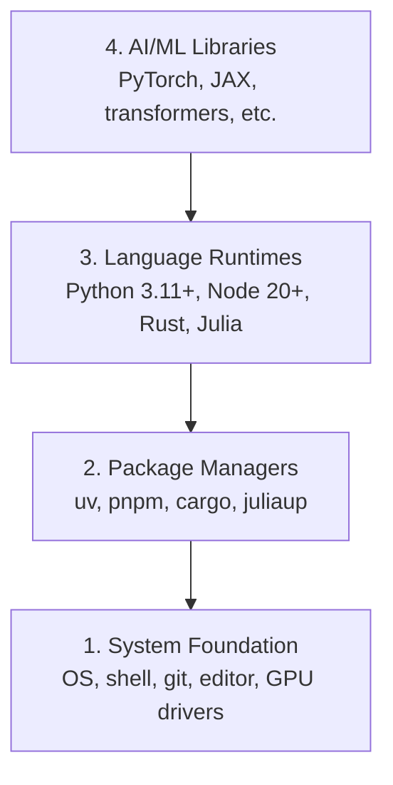

# 開発環境

> ツールは思考を形作る。一度だけ、正しく設定しよう。

**タイプ:** 構築
**言語:** Python, Node.js, Rust
**前提条件:** なし
**所要時間:** 約45分

## 学習目標

- Python 3.11+、Node.js 20+、Rust ツールチェーンをゼロから構築する
- 再現可能なビルドのために仮想環境とパッケージマネージャーを設定する
- CUDA/MPS で GPU アクセスを確認し、テスト用テンソル演算を実行する
- 4層スタック（システム、パッケージ、ランタイム、AI ライブラリ）を理解する

## 問題の背景

これから Python、TypeScript、Rust、Julia を使った200以上のレッスンで AI エンジニアリングを学ぶことになる。環境が壊れていると、学習ではなくツールとの格闘に時間を費やすことになる。

多くの人は環境構築をスキップする。そして、インポートエラー、バージョン競合、CUDA ドライバーの欠落といった問題のデバッグに何時間も費やすことになる。ここで一度、きちんとやっておこう。

## コンセプト

AI エンジニアリング環境は4層構造になっている。



インストールはボトムアップで行う。各層は下の層に依存している。

## 構築手順

### ステップ 1: システム基盤

システムを確認し、基本的なツールをインストールする。

```bash
# macOS
xcode-select --install
brew install git curl wget

# Ubuntu/Debian
sudo apt update && sudo apt install -y build-essential git curl wget

# Windows (use WSL2)
wsl --install -d Ubuntu-24.04
```

### ステップ 2: uv を使った Python

`uv` を使用する — pip より10〜100倍高速で、仮想環境を自動的に管理してくれる。

```bash
curl -LsSf https://astral.sh/uv/install.sh | sh

uv python install 3.12

uv venv
source .venv/bin/activate  # or .venv\Scripts\activate on Windows

uv pip install numpy matplotlib jupyter
```

確認:

```python
import sys
print(f"Python {sys.version}")

import numpy as np
print(f"NumPy {np.__version__}")
a = np.array([1, 2, 3])
print(f"Vector: {a}, dot product with itself: {np.dot(a, a)}")
```

### ステップ 3: pnpm を使った Node.js

TypeScript のレッスン（エージェント、MCP サーバー、Web アプリ）向け。

```bash
curl -fsSL https://fnm.vercel.app/install | bash
fnm install 22
fnm use 22

npm install -g pnpm

node -e "console.log('Node', process.version)"
```

### ステップ 4: Rust

パフォーマンスが重要なレッスン（推論、システム）向け。

```bash
curl --proto '=https' --tlsv1.2 -sSf https://sh.rustup.rs | sh

rustc --version
cargo --version
```

### ステップ 5: Julia（オプション）

Julia が真価を発揮する数学的なレッスン向け。

```bash
curl -fsSL https://install.julialang.org | sh

julia -e 'println("Julia ", VERSION)'
```

### ステップ 6: GPU セットアップ（GPU がある場合）

```bash
# NVIDIA
nvidia-smi

# Install PyTorch with CUDA
uv pip install torch torchvision torchaudio --index-url https://download.pytorch.org/whl/cu124
```

```python
import torch
print(f"CUDA available: {torch.cuda.is_available()}")
if torch.cuda.is_available():
    print(f"GPU: {torch.cuda.get_device_name(0)}")
```

GPU がなくても問題ない。ほとんどのレッスンは CPU でも動作する。学習に重点を置いたレッスンでは、Google Colab やクラウド GPU を活用しよう。

### ステップ 7: 全体の確認

確認スクリプトを実行する:

```bash
python phases/00-setup-and-tooling/01-dev-environment/code/verify.py
```

## 使い方

環境はこのコースのすべてのレッスンに対応している。各言語の使用場面は以下の通り:

| 言語 | 使用フェーズ | パッケージマネージャー |
|----------|---------|-----------------|
| Python | フェーズ 1〜12（ML、DL、NLP、Vision、Audio、LLMs） | uv |
| TypeScript | フェーズ 13〜17（ツール、エージェント、スワーム、インフラ） | pnpm |
| Rust | フェーズ 12、15〜17（パフォーマンス重視のシステム） | cargo |
| Julia | フェーズ 1（数学的基礎） | Pkg |

## 成果物

このレッスンでは、誰でも実行してセットアップを確認できる確認スクリプトを作成する。

環境の問題を AI アシスタントが診断するためのプロンプトについては `outputs/prompt-env-check.md` を参照。

## 演習

1. 確認スクリプトを実行し、失敗した箇所を修正する
2. このコース用の Python 仮想環境を作成し、PyTorch をインストールする
3. 4つの言語すべてで "hello world" を書き、それぞれ実行する
