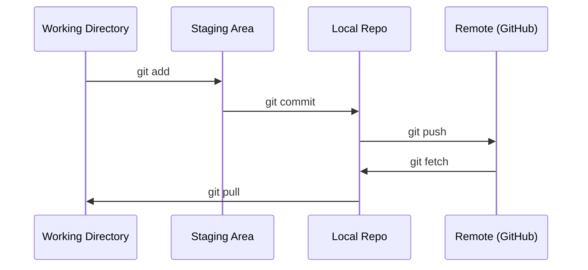

# Git とコラボレーション

> バージョン管理は任意ではありません。ここで行うすべての実験、すべてのモデル、すべてのレッスンを記録します。

**タイプ:** 学習
**言語:** --
**前提条件:** フェーズ 0、レッスン 01
**所要時間:** 約30分

## 学習目標

- git のID設定と、add・commit・push の日常ワークフローを使いこなす
- ブランチを作成・マージして、main を壊さずに実験を独立して行う
- モデルのチェックポイントや大きなバイナリファイルを除外する `.gitignore` を書く
- `git log` でコミット履歴をたどり、プロジェクトの変遷を把握する

## 問題の背景

これから20のフェーズにまたがる数百のコードファイルを書くことになります。バージョン管理がなければ、作業を失い、取り消せない変更を加え、他者と協力する手段もなくなります。

Git がそのツールです。GitHub はコードの置き場所です。このレッスンでは、このコースに必要なことだけを扱います。

## 概念



覚えるべき3つのこと:
1. こまめに保存する (`git commit`)
2. リモートにプッシュする (`git push`)
3. 実験にはブランチを使う (`git checkout -b experiment`)

## 実践

### ステップ 1: git の設定

```bash
git config --global user.name "Your Name"
git config --global user.email "you@example.com"
```

### ステップ 2: 日常のワークフロー

```bash
git status
git add file.py
git commit -m "Add perceptron implementation"
git push origin main
```

### ステップ 3: 実験のためのブランチ作成

```bash
git checkout -b experiment/new-optimizer

# ... 変更を加え、コミットする ...

git checkout main
git merge experiment/new-optimizer
```

### ステップ 4: このコースのリポジトリを使う

```bash
git clone https://github.com/rohitg00/ai-engineering-from-scratch.git
cd ai-engineering-from-scratch

git checkout -b my-progress
# レッスンを進めながら、コードをコミットする
git push origin my-progress
```

## 活用方法

このコースで必要なコマンドはこれだけです:

| コマンド | タイミング |
|---------|------|
| `git clone` | コースのリポジトリを取得する |
| `git add` + `git commit` | 作業を保存する |
| `git push` | GitHub にバックアップする |
| `git checkout -b` | main を壊さずに試みる |
| `git log --oneline` | これまでの作業を確認する |

以上です。このコースでは rebase、cherry-pick、submodule は必要ありません。

## 演習

1. このリポジトリをクローンし、`my-progress` というブランチを作成して、ファイルを作り、コミットし、プッシュする
2. モデルのチェックポイントファイル (`.pt`、`.pth`、`.safetensors`) を除外する `.gitignore` を作成する
3. `git log --oneline` でこのリポジトリのコミット履歴を確認し、レッスンがどのように追加されたかを読む

## 重要用語

| 用語 | よく使われる表現 | 実際の意味 |
|------|----------------|----------------------|
| Commit | 「保存する」 | ある時点でのプロジェクト全体のスナップショット |
| Branch | 「コピー」 | 作業を進めるにつれて前進するコミットへのポインタ |
| Merge | 「コードを統合する」 | あるブランチの変更を別のブランチに適用すること |
| Remote | 「クラウド」 | 別の場所（GitHub、GitLab など）でホストされているリポジトリのコピー |
