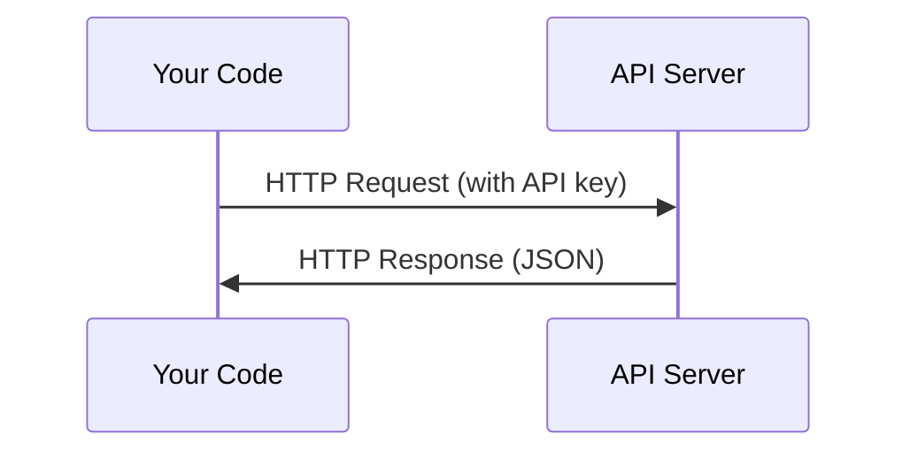

# APIs & Keys

> AIのAPIはすべて同じように動作する：リクエストを送り、レスポンスを受け取る。詳細は変わっても、パターンは変わらない。

**タイプ:** Build
**言語:** Python, TypeScript
**前提条件:** Phase 0, Lesson 01
**所要時間:** 約30分

## 学習目標

- 環境変数と `.env` ファイルを使ってAPIキーを安全に保存する
- Anthropic Python SDKと生のHTTPの両方を使ってLLM APIを呼び出す
- デバッグのためにSDKベースと生のHTTPのリクエスト/レスポンス形式を比較する
- 認証エラーやレート制限を含む一般的なAPIエラーを特定して対処する

## 問題の背景

Phase 11以降では、LLM API（Anthropic、OpenAI、Google）を呼び出します。Phase 13〜16ではこれらのAPIをループの中で使うエージェントを構築します。APIキーの仕組み、安全な保存方法、そして初めてのAPI呼び出し方を理解しておく必要があります。

## コンセプト



すべてのAPI呼び出しには以下が含まれます：
1. エンドポイント（URL）
2. APIキー（認証）
3. リクエストボディ（要求内容）
4. レスポンスボディ（返ってくる内容）

## 実装する

### ステップ1: APIキーを安全に保存する

APIキーをコードに直接書いてはいけません。環境変数を使いましょう。

```bash
export ANTHROPIC_API_KEY="sk-ant-..."
export OPENAI_API_KEY="sk-..."
```

または `.env` ファイルを使う（`.gitignore` に追加すること）：

```
ANTHROPIC_API_KEY=sk-ant-...
OPENAI_API_KEY=sk-...
```

### ステップ2: 初めてのAPI呼び出し（Python）

```python
import anthropic

client = anthropic.Anthropic()

response = client.messages.create(
    model="claude-sonnet-4-20250514",
    max_tokens=256,
    messages=[{"role": "user", "content": "What is a neural network in one sentence?"}]
)

print(response.content[0].text)
```

### ステップ3: 初めてのAPI呼び出し（TypeScript）

```typescript
import Anthropic from "@anthropic-ai/sdk";

const client = new Anthropic();

const response = await client.messages.create({
  model: "claude-sonnet-4-20250514",
  max_tokens: 256,
  messages: [{ role: "user", content: "What is a neural network in one sentence?" }],
});

console.log(response.content[0].text);
```

### ステップ4: 生のHTTP（SDKなし）

```python
import os
import urllib.request
import json

url = "https://api.anthropic.com/v1/messages"
headers = {
    "Content-Type": "application/json",
    "x-api-key": os.environ["ANTHROPIC_API_KEY"],
    "anthropic-version": "2023-06-01",
}
body = json.dumps({
    "model": "claude-sonnet-4-20250514",
    "max_tokens": 256,
    "messages": [{"role": "user", "content": "What is a neural network in one sentence?"}],
}).encode()

req = urllib.request.Request(url, data=body, headers=headers, method="POST")
with urllib.request.urlopen(req) as resp:
    result = json.loads(resp.read())
    print(result["content"][0]["text"])
```

これはSDKが内部でやっていることです。生のHTTP呼び出しを理解しておくとデバッグに役立ちます。

## 使い方

このコースでは：

| API | 使う場面 | 無料枠 |
|-----|-----------------|-----------|
| Anthropic (Claude) | Phase 11〜16（エージェント、ツール） | サインアップ時に$5クレジット |
| OpenAI | Phase 11（比較） | サインアップ時に$5クレジット |
| Hugging Face | Phase 4〜10（モデル、データセット） | 無料 |

今すぐすべてを用意する必要はありません。レッスンで必要になったときに設定してください。

## 成果物

このレッスンでは以下を作成します：
- `outputs/prompt-api-troubleshooter.md` - 一般的なAPIエラーを診断する

## 演習

1. Anthropic APIキーを取得して初めてのAPI呼び出しを行う
2. 生のHTTPバージョンを試してSDKバージョンとレスポンス形式を比較する
3. 意図的に間違ったAPIキーを使ってエラーメッセージを読む

## キーワード

| 用語 | よく言われること | 実際の意味 |
|------|----------------|----------------------|
| API key | 「APIのパスワード」 | アカウントを識別しリクエストを認可する一意の文字列 |
| Rate limit | 「スロットリングされてる」 | 乱用防止と公平な利用確保のための、1分/1時間あたりの最大リクエスト数 |
| Token | 「単語みたいなもの」（APIの文脈で） | 課金単位：入力トークンと出力トークンが別々にカウントされ請求される |
| Streaming | 「リアルタイムのレスポンス」 | 全体の応答を待つのではなく、単語ごとにレスポンスを受け取る方式 |
