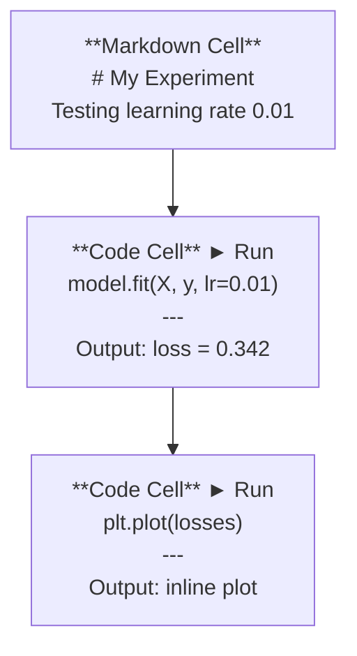
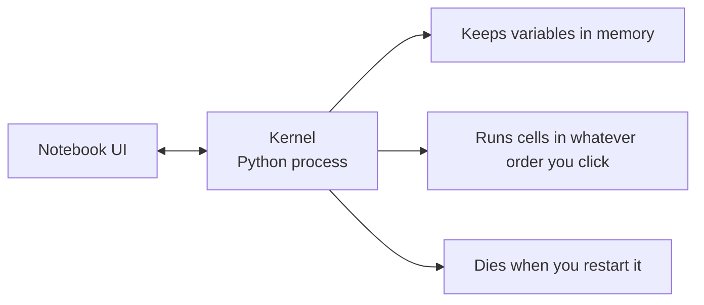

# Jupyter Notebooks

> ノートブックはAIエンジニアリングの実験台です。ここでプロトタイプを作り、うまくいったものを本番環境に移します。

**タイプ:** Build
**言語:** Python
**前提条件:** Phase 0, Lesson 01
**所要時間:** 約30分

## 学習目標

- JupyterLab、Jupyter Notebook、またはJupyter拡張機能付きVS Codeをインストールして起動する
- マジックコマンド（`%timeit`、`%%time`、`%matplotlib inline`）を使ってベンチマークとインライン可視化を行う
- ノートブックとスクリプトの使い分けを理解し、「ノートブックで探索、スクリプトで本番」というワークフローを実践する
- ノートブックの典型的な落とし穴を把握して避ける: 順序外実行、隠れた状態、メモリリーク

## 問題

AIの論文、チュートリアル、Kaggleコンペのほぼすべてでjupyter notebooksが使われています。コードを部分ごとに実行し、出力をインラインで確認し、コードと説明を混在させ、高速にイテレーションできます。ノートブックなしでAIを学ぼうとするのは、下書き用紙なしで数学の宿題をするようなものです。

しかし、ノートブックには実際の落とし穴があります。何でもかんでもノートブックで行う人がいますが、苦手なこともあります。ノートブックを使うべき場面とスクリプトを使うべき場面を知ることで、後々のデバッグの悪夢を防ぐことができます。

## コンセプト

ノートブックはセルのリストです。各セルはコードかテキストのいずれかです。



カーネルはバックグラウンドで動作するPythonプロセスです。セルを実行すると、コードがカーネルに送られ、カーネルがそれを実行して結果を返します。すべてのセルは同じカーネルを共有するため、変数はセル間で保持されます。



「クリックした順序で実行される」という点が、強力な機能でもあり、自分の足を撃つ原因にもなります。

## 作ってみよう

### Step 1: インターフェースを選ぶ

3つの選択肢、1つのフォーマット:

| インターフェース | インストール | 向いている用途 |
|-----------|---------|----------|
| JupyterLab | `pip install jupyterlab` 後 `jupyter lab` | フルIDEエクスペリエンス、複数タブ、ファイルブラウザ、ターミナル |
| Jupyter Notebook | `pip install notebook` 後 `jupyter notebook` | シンプル、軽量、一度に1つのノートブック |
| VS Code | "Jupyter" 拡張機能をインストール | すでにエディタに入っている、git統合、デバッグ |

3つすべてが同じ `.ipynb` ファイルを読み書きします。好きなものを選んでください。JupyterLabがAI作業で最も一般的です。

```bash
pip install jupyterlab
jupyter lab
```

### Step 2: 重要なキーボードショートカット

2つのモードで操作します。コマンドモード（左の青いバー）は `Escape`、編集モード（緑のバー）は `Enter` で切り替えます。

**コマンドモード（よく使うもの）:**

| キー | 操作 |
|-----|--------|
| `Shift+Enter` | セルを実行して次に移動 |
| `A` | 上にセルを挿入 |
| `B` | 下にセルを挿入 |
| `DD` | セルを削除 |
| `M` | マークダウンに変換 |
| `Y` | コードに変換 |
| `Z` | セル操作を元に戻す |
| `Ctrl+Shift+H` | すべてのショートカットを表示 |

**編集モード:**

| キー | 操作 |
|-----|--------|
| `Tab` | 自動補完 |
| `Shift+Tab` | 関数シグネチャを表示 |
| `Ctrl+/` | コメントのトグル |

`Shift+Enter` は1日に何千回も使うキーです。まずこれを覚えましょう。

### Step 3: セルの種類

**コードセル**はPythonを実行して出力を表示します:

```python
import numpy as np
data = np.random.randn(1000)
data.mean(), data.std()
```

出力: `(0.0032, 0.9987)`

**マークダウンセル**はフォーマットされたテキストをレンダリングします。何をしているか、なぜそうするかを文書化するために使います。ヘッダー、太字、斜体、LaTeX数式（`$E = mc^2$`）、テーブル、画像をサポートします。

### Step 4: マジックコマンド

これらはPythonではありません。`%`（ラインマジック）または `%%`（セルマジック）で始まるJupyter固有のコマンドです。

**コードの実行時間を計測する:**

```python
%timeit np.random.randn(10000)
```

出力: `45.2 us +/- 1.3 us per loop`

```python
%%time
model.fit(X_train, y_train, epochs=10)
```

出力: `Wall time: 2.34 s`

`%timeit` はコードを何度も実行して平均を取ります。`%%time` は1回だけ実行します。マイクロベンチマークには `%timeit`、学習の実行には `%%time` を使います。

**インラインプロットを有効にする:**

```python
%matplotlib inline
```

これ以降、すべての `plt.plot()` や `plt.show()` がノートブック内に直接レンダリングされます。

**ノートブックを離れずにパッケージをインストールする:**

```python
!pip install scikit-learn
```

`!` プレフィックスは任意のシェルコマンドを実行します。

**環境変数を確認する:**

```python
%env CUDA_VISIBLE_DEVICES
```

### Step 5: リッチな出力をインラインで表示する

ノートブックはセルの最後の式を自動的に表示します。ただし、制御することもできます:

```python
import pandas as pd

df = pd.DataFrame({
    "model": ["Linear", "Random Forest", "Neural Net"],
    "accuracy": [0.72, 0.89, 0.94],
    "training_time": [0.1, 2.3, 45.6]
})
df
```

これはテキストではなく、フォーマットされたHTMLテーブルとしてレンダリングされます。プロットも同様です:

```python
import matplotlib.pyplot as plt

plt.figure(figsize=(8, 4))
plt.plot([1, 2, 3, 4], [1, 4, 2, 3])
plt.title("Inline Plot")
plt.show()
```

プロットはセルのすぐ下に表示されます。これがノートブックがAI作業で主流な理由です。データ、プロット、コードを一緒に確認できます。

画像の場合:

```python
from IPython.display import Image, display
display(Image(filename="architecture.png"))
```

### Step 6: Google Colab

Colabはクラウド上の無料のjupyter notebookです。GPU、プリインストールされたライブラリ、Google Driveとの統合が提供されます。セットアップ不要です。

1. [colab.research.google.com](https://colab.research.google.com) にアクセス
2. このコースの任意の `.ipynb` ファイルをアップロード
3. ランタイム > ランタイムのタイプを変更 > T4 GPU（無料）

ローカルJupyterとのColabの違い:
- ファイルはセッション間で保持されない（Driveに保存するかダウンロード）
- プリインストール済み: numpy、pandas、matplotlib、torch、tensorflow、sklearn
- ファイルのアップロード/ダウンロードには `from google.colab import files`
- 永続ストレージには `from google.colab import drive; drive.mount('/content/drive')`
- セッションは90分間の非アクティブ後にタイムアウト（無料ティア）

## 使ってみよう

### ノートブック vs スクリプト: どちらをいつ使うか

| ノートブックを使う場合 | スクリプトを使う場合 |
|-------------------|-----------------|
| データセットの探索 | 学習パイプライン |
| モデルのプロトタイピング | 再利用可能なユーティリティ |
| 結果の可視化 | `if __name__` が必要なもの |
| 作業内容の説明 | スケジュールで実行するコード |
| クイック実験 | 本番コード |
| コース演習 | パッケージとライブラリ |

ルール: **ノートブックで探索し、スクリプトで本番リリースする**。

AIにおける典型的なワークフロー:
1. ノートブックでデータを探索する
2. ノートブックでモデルをプロトタイプする
3. うまくいったら、コードを `.py` ファイルに移す
4. それらの `.py` ファイルをノートブックにインポートして、さらに実験する

### よくある落とし穴

**順序外実行。** セル5を実行し、次にセル2、次にセル7を実行します。自分のマシンではノートブックが動くが、誰かが上から下に実行すると壊れます。修正方法: 共有前に「カーネル > 再起動してすべて実行」を実行する。

**隠れた状態。** セルを削除したが、そのセルが作成した変数はまだメモリに残っています。ノートブックはきれいに見えるが、削除されたセルに依存しています。修正方法: 定期的にカーネルを再起動する。

**メモリリーク。** 4GBのデータセットを読み込み、モデルを学習し、別のデータセットを読み込む。何も解放されません。修正方法: `del variable_name` と `gc.collect()` を使う、またはカーネルを再起動する。

## まとめ

このレッスンの成果物:
- ノートブックの問題をデバッグするための `outputs/prompt-notebook-helper.md`

## 演習

1. JupyterLabを開き、ノートブックを作成して、`%timeit` を使ってリスト内包表記とnumpyで100,000個の乱数配列を作成する速度を比較する
2. マークダウンセルとコードセルの両方を含むノートブックを作成し、CSVを読み込み、データフレームを表示し、チャートをプロットする。その後、「カーネル > 再起動してすべて実行」を実行して上から下まで動作することを確認する
3. `code/notebook_tips.py` のコードをColabノートブックに貼り付け、無料GPUで実行する

## キーワード

| 用語 | 一般的な表現 | 実際の意味 |
|------|----------------|----------------------|
| カーネル | 「コードを実行するもの」 | セルを実行して変数をメモリに保持する別のPythonプロセス |
| セル | 「コードブロック」 | ノートブック内で独立して実行可能な単位。コードかマークダウン |
| マジックコマンド | 「Jupyterのトリック」 | `%` または `%%` で始まる、ノートブック環境を制御する特殊コマンド |
| `.ipynb` | 「ノートブックファイル」 | セル、出力、メタデータを含むJSONファイル。IPython Notebookの略 |

## 参考資料

- [JupyterLab Docs](https://jupyterlab.readthedocs.io/) — 全機能セット
- [Google Colab FAQ](https://research.google.com/colaboratory/faq.html) — Colab固有の制限と機能
- [28 Jupyter Notebook Tips](https://www.dataquest.io/blog/jupyter-notebook-tips-tricks-shortcuts/) — パワーユーザー向けショートカット
