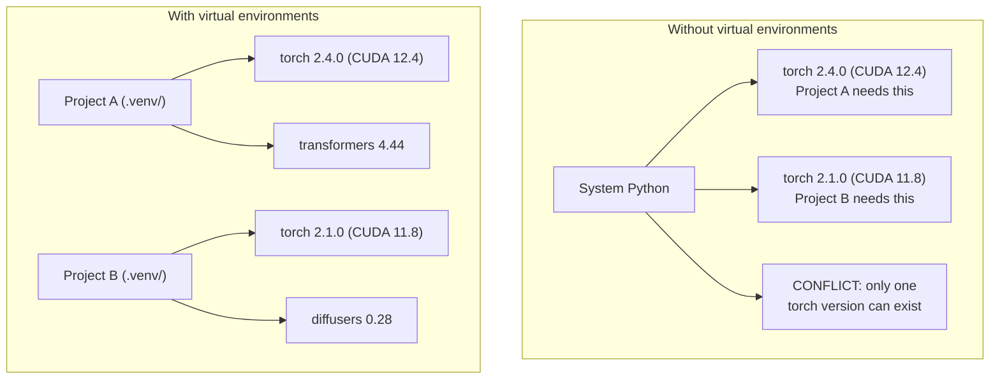

# Python 環境

> 依存関係の地獄は現実に存在する。仮想環境はその解決策だ。

**種別:** Build
**言語:** Shell
**前提条件:** Phase 0, Lesson 01
**所要時間:** 約30分

## 学習目標

- `uv`、`venv`、または `conda` を使って隔離された仮想環境を作成する
- オプショナルな依存グループを含む `pyproject.toml` を記述し、再現性のためのロックファイルを生成する
- よくある落とし穴（グローバルインストール、pip/conda の混用、CUDA バージョンの不一致）を診断・修正する
- 依存関係が競合するプロジェクトに向けた、フェーズごとの環境戦略を実装する

## 問題の背景

ファインチューニングプロジェクトのために PyTorch 2.4 をインストールしたとする。翌週、別のプロジェクトが CUDA ビルドの固定の都合で PyTorch 2.1 を必要とする。グローバルにアップグレードすると最初のプロジェクトが壊れる。ダウングレードすると今度は2番目が壊れる。

これが依存関係の地獄だ。AI/ML の作業では以下の理由から常に発生する。

- PyTorch、JAX、TensorFlow はそれぞれ独自の CUDA バインディングを同梱している
- モデルライブラリは特定のフレームワークバージョンを固定している
- グローバルな `pip install` は以前に存在したものを上書きする
- CUDA 11.8 向けビルドは CUDA 12.x ドライバーでは動作しない（逆も然り）

解決策：すべてのプロジェクトが独自のパッケージを持つ隔離された環境を持つこと。

## 概念



## 構築する

### オプション 1: uv venv（推奨）

`uv` は最速の Python パッケージマネージャーだ（pip より 10〜100倍速い）。仮想環境、Python バージョン管理、依存関係の解決を1つのツールで処理する。

```bash
curl -LsSf https://astral.sh/uv/install.sh | sh

uv python install 3.12

cd your-project
uv venv
source .venv/bin/activate
```

パッケージをインストールする:

```bash
uv pip install torch numpy
```

`pyproject.toml` を含むプロジェクトを一度に作成する:

```bash
uv init my-ai-project
cd my-ai-project
uv add torch numpy matplotlib
```

### オプション 2: venv（組み込み）

`uv` をインストールできない場合、Python には `venv` が同梱されている:

```bash
python3 -m venv .venv
source .venv/bin/activate  # Linux/macOS
.venv\Scripts\activate     # Windows

pip install torch numpy
```

`uv` より遅いが、Python がインストールされているどこでも動作する。

### オプション 3: conda（必要なときに）

Conda は CUDA ツールキット、cuDNN、C ライブラリなどの Python 以外の依存関係を管理する。以下の場合に使用する:

- システム全体にインストールせずに特定の CUDA ツールキットバージョンが必要な場合
- システムパッケージをインストールできない共有クラスター上にいる場合
- ライブラリのインストール手順に「conda を使用してください」と書かれている場合

```bash
# Install miniconda (not the full Anaconda)
curl -LsSf https://repo.anaconda.com/miniconda/Miniconda3-latest-Linux-x86_64.sh -o miniconda.sh
bash miniconda.sh -b

conda create -n myproject python=3.12
conda activate myproject

conda install pytorch torchvision torchaudio pytorch-cuda=12.4 -c pytorch -c nvidia
```

1つのルール: 環境に conda を使う場合は、その環境内のすべてのパッケージに conda を使うこと。conda 環境に `pip install` を混在させると、デバッグが困難な依存関係の競合が発生する。

### このコース向け: フェーズごとの戦略

コース全体で1つの環境を作ることもできる。しかし、やめておこう。フェーズによって異なる（時に競合する）依存関係が必要になる。

戦略:

```
ai-engineering-from-scratch/
├── .venv/                    <-- shared lightweight env for phases 0-3
├── phases/
│   ├── 04-neural-networks/
│   │   └── .venv/            <-- PyTorch env
│   ├── 05-cnns/
│   │   └── .venv/            <-- same PyTorch env (symlink or shared)
│   ├── 08-transformers/
│   │   └── .venv/            <-- might need different transformer versions
│   └── 11-llm-apis/
│       └── .venv/            <-- API SDKs, no torch needed
```

`code/env_setup.sh` にあるスクリプトが、このコース用のベース環境を作成する。

## pyproject.toml の基本

すべての Python プロジェクトには `pyproject.toml` が必要だ。これは `setup.py`、`setup.cfg`、`requirements.txt` を1つのファイルに置き換えるものだ。

```toml
[project]
name = "ai-engineering-from-scratch"
version = "0.1.0"
requires-python = ">=3.11"
dependencies = [
    "numpy>=1.26",
    "matplotlib>=3.8",
    "jupyter>=1.0",
    "scikit-learn>=1.4",
]

[project.optional-dependencies]
torch = ["torch>=2.3", "torchvision>=0.18"]
llm = ["anthropic>=0.39", "openai>=1.50"]
```

インストールする:

```bash
uv pip install -e ".[torch]"    # base + PyTorch
uv pip install -e ".[llm]"     # base + LLM SDKs
uv pip install -e ".[torch,llm]" # everything
```

## ロックファイル

ロックファイルは（推移的なものも含む）すべての依存関係を正確なバージョンに固定する。これによって再現性が保証される: ロックファイルからインストールする人は誰でも全く同じパッケージを取得できる。

```bash
# uv generates uv.lock automatically when using uv add
uv add numpy

# pip-tools approach
uv pip compile pyproject.toml -o requirements.lock
uv pip install -r requirements.lock
```

ロックファイルを git にコミットすること。誰かがリポジトリをクローンしたとき、ロックファイルからインストールして同一のバージョンを取得できる。

## よくある間違い

### 1. グローバルインストール

```bash
pip install torch  # BAD: installs to system Python

source .venv/bin/activate
pip install torch  # GOOD: installs to virtual environment
```

パッケージがどこにインストールされるか確認する:

```bash
which python       # should show .venv/bin/python, not /usr/bin/python
which pip           # should show .venv/bin/pip
```

### 2. pip と conda の混用

```bash
conda create -n myenv python=3.12
conda activate myenv
conda install pytorch -c pytorch
pip install some-other-package   # BAD: can break conda's dependency tracking
conda install some-other-package # GOOD: let conda manage everything
```

conda の中で pip を使わなければならない場合（pip のみのパッケージがある場合）、まずすべての conda パッケージをインストールし、その後 pip パッケージを最後にインストールすること。

### 3. アクティベートし忘れ

```bash
python train.py           # uses system Python, missing packages
source .venv/bin/activate
python train.py           # uses project Python, packages found
```

シェルのプロンプトに環境名が表示されるはずだ:

```
(.venv) $ python train.py
```

### 4. .venv を git にコミットする

```bash
echo ".venv/" >> .gitignore
```

仮想環境は 200MB〜2GB のサイズがある。ローカルなものであり、マシン間で移植できない。代わりに `pyproject.toml` とロックファイルをコミットすること。

### 5. CUDA バージョンの不一致

```bash
nvidia-smi                # shows driver CUDA version (e.g., 12.4)
python -c "import torch; print(torch.version.cuda)"  # shows PyTorch CUDA version

# These must be compatible.
# PyTorch CUDA version must be <= driver CUDA version.
```

## 使ってみる

セットアップスクリプトを実行してコース用の環境を作成する:

```bash
bash phases/00-setup-and-tooling/06-python-environments/code/env_setup.sh
```

これにより、リポジトリのルートにコア依存関係がインストール・検証された `.venv` が作成される。

## 演習

1. `env_setup.sh` を実行し、すべてのチェックが通過することを確認する
2. 2つ目の仮想環境を作成し、そこに異なるバージョンの numpy をインストールして、2つの環境が隔離されていることを確認する
3. PyTorch と Anthropic SDK の両方を必要とするプロジェクト用の `pyproject.toml` を書く
4. 意図的にパッケージをグローバルにインストールし（venv をアクティベートせずに）、それがどこに入るかを確認してから、アンインストールする

## 主要用語

| 用語 | よく言われる表現 | 実際の意味 |
|------|----------------|----------------------|
| 仮想環境 | "venv" | システム Python とは別に、Python インタープリターとパッケージを含む隔離されたディレクトリ |
| ロックファイル | "固定された依存関係" | すべてのパッケージとその正確なバージョンを列挙したファイル。マシン間で同一のインストールを保証する |
| pyproject.toml | "新しい setup.py" | Python プロジェクトの標準設定ファイル。setup.py/setup.cfg/requirements.txt を置き換えるもの |
| 推移的依存関係 | "依存関係の依存関係" | パッケージ B が C に依存している場合; B に依存する A をインストールすると、C は A の推移的依存関係になる |
| CUDA の不一致 | "GPU が動かない" | PyTorch が GPU ドライバーがサポートするものとは異なる CUDA バージョン向けにコンパイルされている |
