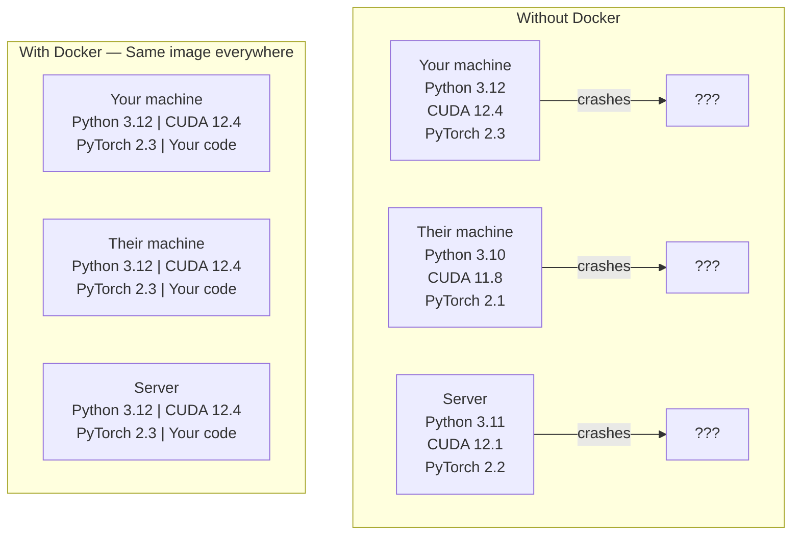

# Docker for AI

> コンテナは「自分のマシンでは動く」という言い訳を過去のものにする。

**タイプ:** Build
**言語:** Docker
**前提条件:** Phase 0、レッスン 01 と 03
**所要時間:** 約60分

## 学習目標

- Dockerfile から CUDA、PyTorch、AI ライブラリを含む GPU 対応 Docker イメージをビルドする
- ホストディレクトリをボリュームとしてマウントし、コンテナを再ビルドしてもモデル、データセット、コードを保持する
- NVIDIA Container Toolkit を設定してコンテナ内から GPU を使えるようにする
- Docker Compose を使って多サービス AI アプリケーション（推論サーバー + ベクターデータベース）をオーケストレーションする

## 問題点

PyTorch 2.3、CUDA 12.4、Python 3.12 でラップトップ上にモデルをトレーニングしたとする。同僚の環境は PyTorch 2.1、CUDA 11.8、Python 3.10 だ。そのモデルは同僚のマシンでクラッシュする。しかし Dockerfile があれば、どちらの環境でも動作する。

AI プロジェクトは依存関係の悪夢だ。典型的なスタックには Python、PyTorch、CUDA ドライバー、cuDNN、システムレベルの C ライブラリ、そして正確なコンパイラーバージョンが必要な flash-attn のような特殊なパッケージが含まれる。Docker はこれらすべてを単一のイメージにパッケージ化し、どこでも同じように動作させる。

## コンセプト

Docker は、コード、ランタイム、ライブラリ、システムツールをコンテナと呼ばれる隔離された単位にまとめる。軽量な仮想マシンのようなものだが、独自の OS を実行する代わりにホストの OS カーネルを共有するため、数分ではなく数秒で起動する。



### AI プロジェクトが他より Docker を必要とする理由

1. **GPU ドライバーは壊れやすい。** CUDA 12.4 のコードは CUDA 11.8 では動作しない。Docker は NVIDIA Container Toolkit を通じてホストの GPU ドライバーを共有しつつ、CUDA ツールキットをコンテナ内に隔離する。

2. **モデルの重みは大きい。** 70 億パラメータのモデルは fp16 で 14 GB になる。コンテナを再ビルドするたびに再ダウンロードしたくはない。Docker ボリュームを使えばホストからモデルディレクトリをマウントできる。

3. **マルチサービスアーキテクチャは一般的だ。** 実際の AI アプリケーションは単なる Python スクリプトではない。推論サーバー、RAG 用のベクターデータベース、場合によってはウェブフロントエンドも含まれる。Docker Compose はこれらすべてを1つのコマンドでオーケストレーションする。

### 主要用語

| 用語 | 意味 |
|------|------|
| Image（イメージ） | 読み取り専用のテンプレート。レシピのようなもの。Dockerfile からビルドされる。 |
| Container（コンテナ） | イメージの実行インスタンス。キッチンのようなもの。 |
| Dockerfile | イメージをビルドするための手順書。レイヤーごとに記述する。 |
| Volume（ボリューム） | コンテナの再起動後も残る永続的なストレージ。 |
| docker-compose | YAML で複数コンテナのアプリケーションを定義するためのツール。 |

### AI における一般的なコンテナパターン

```
Dev Container（開発用コンテナ）
  フルツールキット。エディターサポート。Jupyter。デバッグツール。
  開発・実験中に使用する。

Training Container（トレーニング用コンテナ）
  最小構成。トレーニングスクリプトと依存関係のみ。
  GPU クラスター上で実行。エディターや Jupyter は不要。

Inference Container（推論用コンテナ）
  サービング用に最適化。小さなイメージ。高速なコールドスタート。
  本番環境でロードバランサーの背後で実行する。
```

## ビルドする

### ステップ 1: Docker をインストールする

```bash
# macOS
brew install --cask docker
open /Applications/Docker.app

# Ubuntu
curl -fsSL https://get.docker.com | sh
sudo usermod -aG docker $USER
# グループ変更を有効にするためにログアウトして再ログインする
```

確認:

```bash
docker --version
docker run hello-world
```

### ステップ 2: NVIDIA Container Toolkit をインストールする（NVIDIA GPU 搭載の Linux）

これにより Docker コンテナから GPU にアクセスできるようになる。macOS および Windows（WSL2）のユーザーはこのステップをスキップできる。それらのプラットフォームでは Docker Desktop が異なる方法で GPU パススルーを処理する。

```bash
distribution=$(. /etc/os-release;echo $ID$VERSION_ID)
curl -fsSL https://nvidia.github.io/libnvidia-container/gpgkey | sudo gpg --dearmor -o /usr/share/keyrings/nvidia-container-toolkit-keyring.gpg
curl -s -L https://nvidia.github.io/libnvidia-container/$distribution/libnvidia-container.list | \
    sed 's#deb https://#deb [signed-by=/usr/share/keyrings/nvidia-container-toolkit-keyring.gpg] https://#g' | \
    sudo tee /etc/apt/sources.list.d/nvidia-container-toolkit.list

sudo apt-get update
sudo apt-get install -y nvidia-container-toolkit
sudo nvidia-ctk runtime configure --runtime=docker
sudo systemctl restart docker
```

コンテナ内で GPU アクセスをテストする:

```bash
docker run --rm --gpus all nvidia/cuda:12.4.1-base-ubuntu22.04 nvidia-smi
```

GPU の情報が表示されれば、ツールキットは正常に動作している。

### ステップ 3: ベースイメージを理解する

適切なベースイメージを選ぶことで、デバッグにかかる時間を大幅に節約できる。

```
nvidia/cuda:12.4.1-devel-ubuntu22.04
  フル CUDA ツールキット。コンパイラーが含まれる。
  用途: nvcc が必要なパッケージのビルド（flash-attn、bitsandbytes）
  サイズ: 約 4 GB

nvidia/cuda:12.4.1-runtime-ubuntu22.04
  CUDA ランタイムのみ。コンパイラーなし。
  用途: ビルド済みコードの実行
  サイズ: 約 1.5 GB

pytorch/pytorch:2.3.1-cuda12.4-cudnn9-runtime
  CUDA 上に PyTorch がプリインストール済み。
  用途: PyTorch のインストールステップをスキップしたいとき
  サイズ: 約 6 GB

python:3.12-slim
  CUDA なし。CPU のみ。
  用途: CPU での推論、軽量ツール
  サイズ: 約 150 MB
```

### ステップ 4: AI 開発用 Dockerfile を書く

`code/Dockerfile` の内容を以下に示す。順を追って確認しよう:

```dockerfile
FROM nvidia/cuda:12.4.1-devel-ubuntu22.04

ENV DEBIAN_FRONTEND=noninteractive
ENV PYTHONUNBUFFERED=1

RUN apt-get update && apt-get install -y --no-install-recommends \
    python3.12 \
    python3.12-venv \
    python3.12-dev \
    python3-pip \
    git \
    curl \
    build-essential \
    && rm -rf /var/lib/apt/lists/*

RUN update-alternatives --install /usr/bin/python python /usr/bin/python3.12 1

RUN python -m pip install --no-cache-dir --upgrade pip setuptools wheel

RUN python -m pip install --no-cache-dir \
    torch==2.3.1 \
    torchvision==0.18.1 \
    torchaudio==2.3.1 \
    --index-url https://download.pytorch.org/whl/cu124

RUN python -m pip install --no-cache-dir \
    numpy \
    pandas \
    scikit-learn \
    matplotlib \
    jupyter \
    transformers \
    datasets \
    accelerate \
    safetensors

WORKDIR /workspace

VOLUME ["/workspace", "/models"]

EXPOSE 8888

CMD ["python"]
```

ビルドする:

```bash
docker build -t ai-dev -f phases/00-setup-and-tooling/07-docker-for-ai/code/Dockerfile .
```

初回は時間がかかる（CUDA ベースイメージと PyTorch のダウンロード）。2回目以降はキャッシュされたレイヤーが使われる。

実行する:

```bash
docker run --rm -it --gpus all \
    -v $(pwd):/workspace \
    -v ~/models:/models \
    ai-dev python -c "import torch; print(f'PyTorch {torch.__version__}, CUDA: {torch.cuda.is_available()}')"
```

コンテナ内で Jupyter を起動する:

```bash
docker run --rm -it --gpus all \
    -v $(pwd):/workspace \
    -v ~/models:/models \
    -p 8888:8888 \
    ai-dev jupyter notebook --ip=0.0.0.0 --port=8888 --no-browser --allow-root
```

### ステップ 5: データとモデル用のボリュームマウント

ボリュームマウントは AI 作業において非常に重要だ。これがないと、14 GB のモデルのダウンロードがコンテナ停止時に消えてしまう。

```bash
# コードをマウントする
-v $(pwd):/workspace

# 共有モデルディレクトリをマウントする
-v ~/models:/models

# データセットをマウントする
-v ~/datasets:/data
```

トレーニングスクリプト内では、マウントされたパスから読み込む:

```python
from transformers import AutoModel

model = AutoModel.from_pretrained("/models/llama-7b")
```

モデルはホストのファイルシステム上に存在する。再ダウンロードせずに何度でもコンテナを再ビルドできる。

### ステップ 6: 多サービス AI アプリ向け Docker Compose

実際の RAG アプリケーションには推論サーバーとベクターデータベースが必要だ。Docker Compose は1つのコマンドで両方を起動する。

`code/docker-compose.yml` の内容:

```yaml
services:
  ai-dev:
    build:
      context: .
      dockerfile: Dockerfile
    deploy:
      resources:
        reservations:
          devices:
            - driver: nvidia
              count: all
              capabilities: [gpu]
    volumes:
      - ../../../:/workspace
      - ~/models:/models
      - ~/datasets:/data
    ports:
      - "8888:8888"
    stdin_open: true
    tty: true
    command: jupyter notebook --ip=0.0.0.0 --port=8888 --no-browser --allow-root

  qdrant:
    image: qdrant/qdrant:v1.12.5
    ports:
      - "6333:6333"
      - "6334:6334"
    volumes:
      - qdrant_data:/qdrant/storage

volumes:
  qdrant_data:
```

すべてを起動する:

```bash
cd phases/00-setup-and-tooling/07-docker-for-ai/code
docker compose up -d
```

これで AI 開発コンテナからサービス名 `http://qdrant:6333` でベクターデータベースにアクセスできる。Docker Compose は自動的に共有ネットワークを作成する。

AI コンテナ内から接続をテストする:

```python
from qdrant_client import QdrantClient

client = QdrantClient(host="qdrant", port=6333)
print(client.get_collections())
```

すべてを停止する:

```bash
docker compose down
```

`-v` を追加すると qdrant ボリュームも削除される:

```bash
docker compose down -v
```

### ステップ 7: AI 作業に役立つ Docker コマンド

```bash
# 実行中のコンテナを一覧表示する
docker ps

# すべてのイメージとサイズを一覧表示する
docker images

# 未使用のイメージを削除する（ディスク容量を回収する）
docker system prune -a

# 実行中のコンテナ内で GPU 使用状況を確認する
docker exec -it <container_id> nvidia-smi

# コンテナからホストにファイルをコピーする
docker cp <container_id>:/workspace/results.csv ./results.csv

# コンテナのログを表示する
docker logs -f <container_id>
```

## 使い方

再現性のある AI 開発環境が整った。このコース全体を通じて以下を活用しよう:

- `docker compose up` で開発環境とベクターデータベースを一緒に起動する
- コード、モデル、データをボリュームとしてマウントし、再ビルド時に失わないようにする
- レッスンで新しい Python パッケージが必要になったら、Dockerfile に追加して再ビルドする
- Dockerfile をチームメンバーと共有する。全員がまったく同じ環境を得られる。

### GPU がない場合

`--gpus all` フラグと NVIDIA の deploy ブロックを削除する。CPU ベースのレッスンでもコンテナは問題なく動作する。PyTorch は CUDA の不在を検知し、自動的に CPU にフォールバックする。

## 演習

1. Dockerfile をビルドし、コンテナ内で `python -c "import torch; print(torch.__version__)"` を実行する
2. docker-compose スタックを起動し、AI コンテナから `http://qdrant:6333/collections` で Qdrant にアクセスできることを確認する
3. Dockerfile に `flask` を追加し、再ビルドして、ポート 5000 でシンプルな API サーバーを起動する。`-p 5000:5000` でポートをマップする
4. `docker images` でイメージサイズを計測する。ベースイメージを `devel` から `runtime` に切り替えてサイズを比較する

## キーワード

| 用語 | よく言われること | 実際の意味 |
|------|----------------|-----------|
| Container（コンテナ） | 「軽量 VM」 | ホストカーネルを使用する隔離されたプロセス。独自のファイルシステムとネットワークを持つ。 |
| Image layer（イメージレイヤー） | 「キャッシュされたステップ」 | Dockerfile の各命令がレイヤーを作成する。変更のないレイヤーはキャッシュされるため、再ビルドが速い。 |
| NVIDIA Container Toolkit | 「Docker 内の GPU」 | `--gpus` フラグを通じてホストの GPU をコンテナに公開するランタイムフック。 |
| Volume mount（ボリュームマウント） | 「共有フォルダ」 | ホスト上のディレクトリをコンテナにマップする。コンテナ停止後も変更が保持される。 |
| Base image（ベースイメージ） | 「出発点」 | Dockerfile がその上にビルドする `FROM` イメージ。プリインストールされているものを決定する。 |
