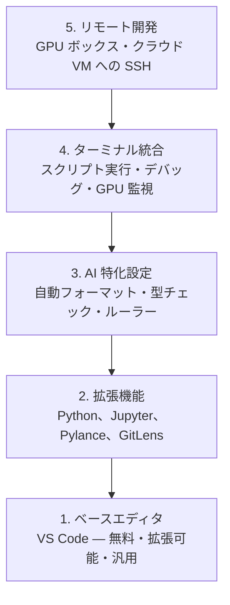

# エディタのセットアップ

> エディタはあなたのコパイロットです。一度設定すれば邪魔にならず、本来の力を発揮してくれます。

**タイプ:** ビルド
**言語:** --
**前提条件:** フェーズ 0、レッスン 01
**所要時間:** 約20分

## 学習目標

- Python、Jupyter、リンティング、リモート SSH に必要な拡張機能と一緒に VS Code をインストールする
- AI ワークフローに向けて、保存時の自動フォーマット・型チェック・ノートブック出力スクロールを設定する
- Remote SSH を設定し、リモートの GPU マシン上のコードをローカルと同じ感覚で編集・デバッグする
- エディタの代替候補（Cursor、Windsurf、Neovim）と AI 開発におけるそれぞれのトレードオフを評価する

## 問題点

あなたはエディタの中で何千時間もかけて Python を書き、ノートブックを実行し、トレーニングループをデバッグし、GPU マシンに SSH 接続することになります。設定が不適切なエディタは、毎回のセッションに摩擦を生みます。オートコンプリートなし、型ヒントなし、インラインエラーなし、手動フォーマット、そして煩わしいターミナル操作です。

適切なセットアップには20分かかります。それをスキップすると、毎日20分のコストを払い続けることになります。

## コンセプト

AI エンジニアリング向けのエディタセットアップには5つの要素が必要です。



## 構築手順

### ステップ 1: VS Code のインストール

VS Code は推奨エディタです。無料で全 OS で動作し、Jupyter ノートブックのサポートが充実しており、拡張エコシステムにより AI 開発に必要なものはすべて揃っています。

[code.visualstudio.com](https://code.visualstudio.com/) からダウンロードしてください。

ターミナルで確認します。

```bash
code --version
```

macOS で `code` コマンドが見つからない場合は、VS Code を開いて `Cmd+Shift+P` を押し、「Shell Command」と入力して「Install 'code' command in PATH」を選択してください。

### ステップ 2: 必須拡張機能のインストール

VS Code の統合ターミナル（`` Ctrl+` `` または `` Cmd+` ``）を開き、AI 開発に必要な拡張機能をインストールします。

```bash
code --install-extension ms-python.python
code --install-extension ms-python.vscode-pylance
code --install-extension ms-toolsai.jupyter
code --install-extension eamodio.gitlens
code --install-extension ms-vscode-remote.remote-ssh
code --install-extension ms-python.debugpy
code --install-extension ms-python.black-formatter
code --install-extension charliermarsh.ruff
```

各拡張機能の役割:

| 拡張機能 | 役割 |
|-----------|-----|
| Python | 言語サポート、仮想環境の検出、実行/デバッグ |
| Pylance | 高速な型チェック、オートコンプリート、インポート解決 |
| Jupyter | VS Code 内でノートブックを実行、変数エクスプローラー |
| GitLens | 変更者の確認、インラインの git blame |
| Remote SSH | リモートの GPU ボックスのフォルダをローカルのように開く |
| Debugpy | Python のステップ実行デバッグ |
| Black Formatter | 保存時の自動フォーマット、一貫したスタイル |
| Ruff | 高速なリンティング、よくあるミスの検出 |

このレッスンの `code/.vscode/extensions.json` ファイルには推奨拡張機能の一覧が含まれています。プロジェクトフォルダを開くと、VS Code がインストールを促します。

### ステップ 3: 設定の構成

このレッスンの `code/.vscode/settings.json` から設定をコピーするか、`Settings > Open Settings (JSON)` から手動で適用してください。

AI 開発に重要な設定:

```jsonc
{
    "python.analysis.typeCheckingMode": "basic",
    "editor.formatOnSave": true,
    "editor.rulers": [88, 120],
    "notebook.output.scrolling": true,
    "files.autoSave": "afterDelay"
}
```

これらの設定が重要な理由:

- **型チェックを basic に設定**: 実行前に引数の型の誤りを検出します。テンソルの形状ミスマッチや誤った API パラメータのデバッグ時間を節約できます。
- **保存時の自動フォーマット**: フォーマットについて考える必要がなくなります。Black が処理します。
- **88と120のルーラー**: Black は88文字で折り返します。120のマーカーはドキュメント文字列やコメントが長くなりすぎたときに警告します。
- **ノートブック出力スクロール**: トレーニングループは何千行も出力します。スクロールなしでは出力パネルが溢れます。
- **自動保存**: 保存を忘れることがあります。古いコードでトレーニングスクリプトが実行されてしまいます。自動保存がそれを防ぎます。

### ステップ 4: ターミナル統合

VS Code の統合ターミナルは、トレーニングスクリプトの実行、GPU の監視、環境管理を行う場所です。

適切に設定します。

```jsonc
{
    "terminal.integrated.defaultProfile.osx": "zsh",
    "terminal.integrated.defaultProfile.linux": "bash",
    "terminal.integrated.fontSize": 13,
    "terminal.integrated.scrollback": 10000
}
```

便利なショートカット:

| 操作 | macOS | Linux/Windows |
|--------|-------|---------------|
| ターミナルの切り替え | `` Ctrl+` `` | `` Ctrl+` `` |
| 新しいターミナル | `Ctrl+Shift+`` ` | `Ctrl+Shift+`` ` |
| ターミナルの分割 | `Cmd+\` | `Ctrl+\` |

ターミナルの分割は便利です。一方でスクリプトを実行し、もう一方で `nvidia-smi -l 1` や `watch -n 1 nvidia-smi` で GPU を監視できます。

### ステップ 5: リモート開発（GPU ボックスへの SSH）

これは AI 開発において最も重要な拡張機能です。リモートマシン（クラウド VM、ラボサーバー、Lambda、Vast.ai）でトレーニングを実行することになります。Remote SSH を使えば、リモートのファイルシステムを開き、ファイルを編集し、ターミナルを実行し、すべてがローカルにあるかのようにデバッグできます。

セットアップ手順:

1. Remote SSH 拡張機能をインストールします（ステップ 2 で完了）。
2. `Ctrl+Shift+P`（または `Cmd+Shift+P`）を押し、「Remote-SSH: Connect to Host」と入力します。
3. `user@your-gpu-box-ip` を入力します。
4. VS Code がリモートマシンにサーバーコンポーネントを自動的にインストールします。

パスワードなしのアクセスには、SSH キーを設定します。

```bash
ssh-keygen -t ed25519 -C "your-email@example.com"
ssh-copy-id user@your-gpu-box-ip
```

利便性のためにホストを `~/.ssh/config` に追加します。

```
Host gpu-box
    HostName 203.0.113.50
    User ubuntu
    IdentityFile ~/.ssh/id_ed25519
    ForwardAgent yes
```

これで `Remote-SSH: Connect to Host > gpu-box` で即座に接続できます。

## 代替手段

### Cursor

[cursor.com](https://cursor.com) は AI コード生成を内蔵した VS Code フォークです。同じ拡張エコシステムと設定フォーマットを使用しています。Cursor を使う場合も、このレッスンのすべての内容が適用されます。同じ `settings.json` と `extensions.json` をインポートしてください。

### Windsurf

[windsurf.com](https://windsurf.com) はもう一つの AI ファーストな VS Code フォークです。同様に、同じ拡張機能、同じ設定フォーマット、同じ Remote SSH サポートが使えます。

### Vim/Neovim

すでに Vim や Neovim を使って生産的に作業しているなら、そのまま使い続けてください。AI Python 開発のための最小セットアップ:

- **pyright** または **pylsp** による型チェック（Mason または手動インストール）
- **nvim-lspconfig** による言語サーバー統合
- **jupyter-vim** または **molten-nvim** によるノートブック的な実行
- **telescope.nvim** によるファイル/シンボル検索
- **none-ls.nvim** に black と ruff を組み合わせたフォーマット/リンティング

Vim をまだ使っていないなら、今から始めないでください。学習曲線が AI エンジニアリングの学習と競合します。VS Code を使ってください。

## 活用方法

このセットアップにより、日常のワークフローは次のようになります。

1. VS Code でプロジェクトフォルダを開く（または Remote SSH で GPU ボックスに接続する）。
2. オートコンプリート、型ヒント、インラインエラーを活用しながらエディタで Python を書く。
3. Jupyter 拡張機能を使ってインラインで Jupyter ノートブックを実行する。
4. 統合ターミナルを使ってトレーニングスクリプトの実行、`uv pip install`、GPU 監視を行う。
5. コミット前に GitLens で変更をレビューする。

## 演習

1. VS Code とステップ 2 に記載されているすべての拡張機能をインストールする
2. このレッスンの `settings.json` を VS Code の設定にコピーする
3. Python ファイルを開いて、Pylance が型ヒントを表示し、保存時に Black がフォーマットすることを確認する
4. リモートマシンにアクセスできる場合は、Remote SSH を設定してフォルダを開く

## 主要用語

| 用語 | 一般的な呼び方 | 実際の意味 |
|------|----------------|------------|
| LSP | 「オートコンプリートエンジン」 | Language Server Protocol: エディタが言語固有のサーバーから型情報・補完・診断を取得するための標準仕様 |
| Pylance | 「Python プラグイン」 | Pyright を使った型チェックと IntelliSense を提供する Microsoft の Python 言語サーバー |
| Remote SSH | 「サーバー上での作業」 | リモートマシン上に軽量サーバーを実行し、UI をローカルエディタにストリーミングする VS Code 拡張機能 |
| Format on save | 「自動プリティア」 | 保存のたびにエディタがフォーマッタ（Black、Ruff）を実行し、コードスタイルを常に一貫させる機能 |
