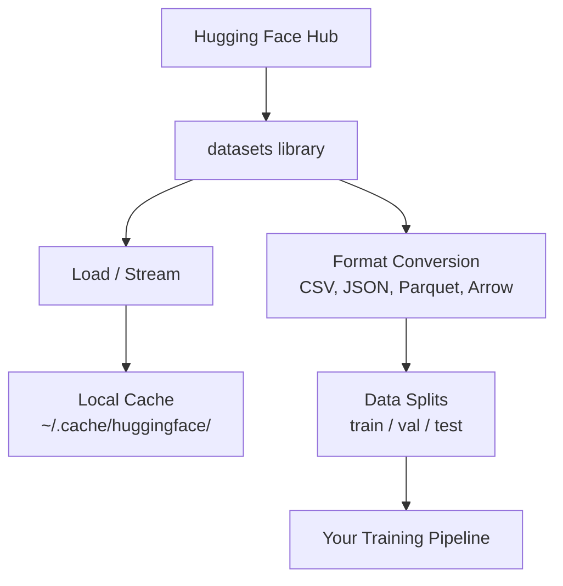

# データ管理

> データは燃料だ。どう管理するかで、進む速さが決まる。

**タイプ:** Build
**言語:** Python
**前提条件:** Phase 0, Lesson 01
**所要時間:** 約45分

## 学習目標

- Hugging Face の `datasets` ライブラリを使ってデータセットを読み込み、ストリーミングし、キャッシュする
- CSV、JSON、Parquet、Arrow 形式間で変換し、それぞれのトレードオフを説明できる
- 固定乱数シードを使って再現可能な train/validation/test 分割を作成する
- `.gitignore`、Git LFS、DVC を使って大きなモデルファイルやデータセットを管理する

## 問題

すべての AI プロジェクトはデータから始まる。データセットを見つけ、ダウンロードし、形式を変換し、学習と評価用に分割し、実験が再現できるようにバージョン管理する必要がある。毎回手動でやるのは遅くてミスが起きやすい。繰り返し使えるワークフローが必要だ。

## コンセプト



Hugging Face の `datasets` ライブラリは、AI 作業のデータ読み込みに使う標準的な方法だ。ダウンロード、キャッシュ、形式変換、ストリーミングをすべて標準でサポートしている。

## 実装する

### ステップ 1: datasets ライブラリをインストールする

```bash
pip install datasets huggingface_hub
```

### ステップ 2: データセットを読み込む

```python
from datasets import load_dataset

dataset = load_dataset("imdb")
print(dataset)
print(dataset["train"][0])
```

これで IMDB 映画レビューデータセットがダウンロードされる。初回ダウンロード以降は `~/.cache/huggingface/datasets/` のキャッシュから読み込まれる。

### ステップ 3: 大きなデータセットをストリーミングする

データセットの中にはディスクに収まりきらないほど大きなものもある。ストリーミングを使えば、全体をダウンロードせずに1行ずつ読み込める。

```python
dataset = load_dataset("wikimedia/wikipedia", "20220301.en", split="train", streaming=True)

for i, example in enumerate(dataset):
    print(example["title"])
    if i >= 4:
        break
```

ストリーミングでは `IterableDataset` が返される。データは届いた順に処理される。メモリ使用量はデータセットのサイズに関係なく一定に保たれる。

### ステップ 4: データセットの形式

`datasets` ライブラリは内部で Apache Arrow を使っている。パイプラインの要件に応じて他の形式に変換できる。

```python
dataset = load_dataset("imdb", split="train")

dataset.to_csv("imdb_train.csv")
dataset.to_json("imdb_train.json")
dataset.to_parquet("imdb_train.parquet")
```

形式の比較:

| 形式 | サイズ | 読み込み速度 | 最適な用途 |
|--------|------|-----------|----------|
| CSV | 大 | 遅い | 人が読める形式、スプレッドシート |
| JSON | 大 | 遅い | API、ネストされたデータ |
| Parquet | 小 | 速い | 分析、カラム指向クエリ |
| Arrow | 小 | 最速 | インメモリ処理（`datasets` が内部で使用） |

AI 作業では、Parquet がベストなストレージ形式だ。Arrow はメモリ上で扱う形式。CSV と JSON はデータ交換用だ。

### ステップ 5: データ分割

すべての ML プロジェクトには3つの分割が必要だ:

- **Train（学習）**: モデルがここから学習する（通常 80%）
- **Validation（検証）**: 学習中の進捗を確認する（通常 10%）
- **Test（テスト）**: 学習完了後の最終評価（通常 10%）

データセットによってはあらかじめ分割されているものもある。そうでない場合は自分で分割する:

```python
dataset = load_dataset("imdb", split="train")

split = dataset.train_test_split(test_size=0.2, seed=42)
train_val = split["train"].train_test_split(test_size=0.125, seed=42)

train_ds = train_val["train"]
val_ds = train_val["test"]
test_ds = split["test"]

print(f"Train: {len(train_ds)}, Val: {len(val_ds)}, Test: {len(test_ds)}")
```

再現性のために必ずシードを設定すること。同じシードを使えば毎回同じ分割が得られる。

### ステップ 6: モデルをダウンロードしてキャッシュする

モデルは大きなファイルだ。`huggingface_hub` ライブラリがダウンロードとキャッシュを担当する。

```python
from huggingface_hub import hf_hub_download, snapshot_download

model_path = hf_hub_download(
    repo_id="sentence-transformers/all-MiniLM-L6-v2",
    filename="config.json"
)
print(f"Cached at: {model_path}")

model_dir = snapshot_download("sentence-transformers/all-MiniLM-L6-v2")
print(f"Full model at: {model_dir}")
```

モデルは `~/.cache/huggingface/hub/` にキャッシュされる。一度ダウンロードすれば、次回以降は即座に読み込まれる。

### ステップ 7: 大きなファイルを管理する

モデルの重みや大きなデータセットは git に入れるべきではない。3つの選択肢がある:

**オプション A: .gitignore（最もシンプル）**

```
*.bin
*.safetensors
*.pt
*.onnx
data/*.parquet
data/*.csv
models/
```

**オプション B: Git LFS（大きなファイルを git で追跡）**

```bash
git lfs install
git lfs track "*.bin"
git lfs track "*.safetensors"
git add .gitattributes
```

Git LFS はリポジトリにポインタを保存し、実際のファイルは別のサーバーに置く。GitHub では 1 GB まで無料で使える。

**オプション C: DVC（データバージョン管理）**

```bash
pip install dvc
dvc init
dvc add data/training_set.parquet
git add data/training_set.parquet.dvc data/.gitignore
git commit -m "Track training data with DVC"
```

DVC はデータを指す小さな `.dvc` ファイルを作成する。データ本体は S3、GCS、または他のリモートストレージバックエンドに置かれる。

| アプローチ | 複雑さ | 最適な用途 |
|----------|-----------|----------|
| .gitignore | 低 | 個人プロジェクト、再取得できるダウンロードデータ |
| Git LFS | 中 | git 経由でモデルの重みを共有するチーム |
| DVC | 高 | 再現可能な実験、大きなデータセット、チーム |

このコースでは `.gitignore` で十分だ。複数のマシンで実験を完全に再現する必要がある場合に DVC を使うこと。

### ステップ 8: ストレージパターン

**ローカルストレージ**は約 10 GB 未満のデータセットに使える。HF キャッシュが自動的に処理してくれる。

**クラウドストレージ**はそれより大きなもの、または複数のマシンで共有する場合に使う:

```python
import os

local_path = os.path.expanduser("~/.cache/huggingface/datasets/")

# s3_path = "s3://my-bucket/datasets/"
# gcs_path = "gs://my-bucket/datasets/"
```

DVC は S3 や GCS と直接統合できる:

```bash
dvc remote add -d myremote s3://my-bucket/dvc-store
dvc push
```

このコースではローカルストレージで十分だ。リモート GPU インスタンスでファインチューニングするようになると、クラウドストレージが重要になる。

## このコースで使うデータセット

| データセット | レッスン | サイズ | 学べること |
|---------|---------|------|----------------|
| IMDB | トークナイゼーション、分類 | 84 MB | テキスト分類の基礎 |
| WikiText | 言語モデリング | 181 MB | 次トークン予測 |
| SQuAD | QA システム | 35 MB | 質問応答、スパン |
| Common Crawl（サブセット） | 埋め込み | 可変 | 大規模テキスト処理 |
| MNIST | ビジョン基礎 | 21 MB | 画像分類の基礎 |
| COCO（サブセット） | マルチモーダル | 可変 | 画像とテキストのペア |

今すぐすべてをダウンロードする必要はない。各レッスンで必要なものを指定する。

## 動かす

ユーティリティスクリプトを実行して、すべてが正常に動作することを確認する:

```bash
python code/data_utils.py
```

これにより小さなデータセットがダウンロードされ、変換・分割されて、サマリーが表示される。

## 成果物

このレッスンで作成するもの:
- `code/data_utils.py` - 再利用可能なデータ読み込み・キャッシュユーティリティ
- `outputs/prompt-data-helper.md` - タスクに適したデータセットを見つけるためのプロンプト

## 演習

1. `glue` データセットを `mrpc` 設定で読み込み、最初の5件の例を確認する
2. `c4` データセットをストリーミングして、10秒間に処理できる例の数を数える
3. データセットを Parquet に変換して、CSV とのファイルサイズを比較する
4. 固定シードで 70/15/15 の train/val/test 分割を作成し、サイズを確認する

## 重要用語

| 用語 | よく言われる説明 | 実際の意味 |
|------|----------------|----------------------|
| データセット分割 | 「学習データ」 | ML ライフサイクルの各段階で使う名前付きサブセット（train/val/test） |
| ストリーミング | 「遅延読み込み」 | データセット全体をダウンロードせず、リモートソースから1行ずつ処理すること |
| Parquet | 「圧縮 CSV」 | 分析クエリとストレージ効率に最適化されたカラム指向ファイル形式 |
| Arrow | 「高速データフレーム」 | datasets ライブラリが内部でゼロコピー読み取りに使うインメモリカラム形式 |
| Git LFS | 「大きなファイル用 git」 | 大きなファイルを git リポジトリの外に保存し、バージョン管理にはポインタを残す拡張機能 |
| DVC | 「データ用 git」 | クラウドストレージと統合するデータセットおよびモデル向けのバージョン管理システム |
| キャッシュ | 「ダウンロード済み」 | 以前に取得したデータのローカルコピー。デフォルトでは ~/.cache/huggingface/ に保存される |
