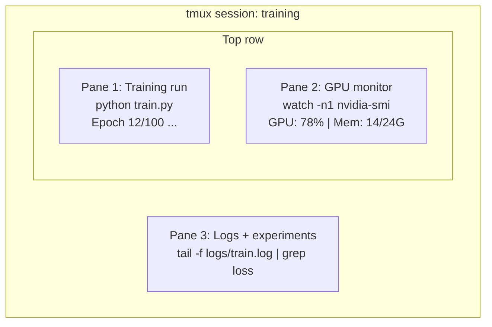

# ターミナルとシェル

> ターミナルはAIエンジニアの拠点だ。ここに慣れ親しもう。

**種別:** 学習
**言語:** --
**前提条件:** フェーズ0、レッスン01
**所要時間:** 約35分

## 学習目標

- パイプ、リダイレクト、`grep` を使ってコマンドラインからトレーニングログをフィルタリング・処理する
- tmux の永続セッションを複数ペインで作成し、トレーニングとGPUモニタリングを並行して実行する
- `htop`、`nvtop`、`nvidia-smi` でシステムリソースとGPUリソースを監視する
- SSH、`scp`、`rsync` を使ってローカルとリモートマシン間でファイルを転送する

## 問題

どんなエディタよりもターミナルで過ごす時間の方が長くなる。トレーニング実行、GPUモニタリング、ログの追跡、リモートSSHセッション、環境管理——AIのワークフローはすべてシェルを通る。ここが遅ければ、すべてが遅くなる。

このレッスンでは、AIの作業に重要なターミナルスキルを扱う。Unixの歴史はない。Bashスクリプティングの深掘りもない。必要なことだけを扱う。

## 概念



3つのものが同時に動いている。ターミナルは1つ。デタッチして帰宅し、SSHで再接続してアタッチし直せる。トレーニングはそのまま動き続ける。

## 構築する

### ステップ1: シェルを確認する

どのシェルが動いているか確認する:

```bash
echo $SHELL
```

ほとんどのシステムは `bash` か `zsh` を使っている。どちらでも問題ない。このコースのコマンドはどちらでも動作する。

知っておくべき基本操作:

```bash
# 移動する
cd ~/projects/ai-engineering-from-scratch
pwd
ls -la

# 履歴検索（これから覚える最も便利なショートカット）
# Ctrl+R を押してから以前のコマンドの一部を入力
# Ctrl+R を再度押して一致する候補を順に表示

# ターミナルをクリア
clear   # または Ctrl+L

# 実行中のコマンドをキャンセル
# Ctrl+C

# 実行中のコマンドを一時停止（fg で再開）
# Ctrl+Z
```

### ステップ2: パイプとリダイレクト

パイプはコマンドをつなぎ合わせる。ログの処理、出力のフィルタリング、ツールの連結に使う方法がこれだ。常に使うことになる。

```bash
# ログに "loss" が何回出現するか数える
cat train.log | grep "loss" | wc -l

# トレーニング出力からlossの値だけを取り出す
grep "loss:" train.log | awk '{print $NF}' > losses.txt

# ログファイルのリアルタイム更新をエラーだけフィルタリングして監視
tail -f train.log | grep --line-buffered "ERROR"

# 最終精度で実験をソートする
grep "final_accuracy" results/*.log | sort -t= -k2 -n -r

# 標準出力と標準エラー出力を別々のファイルにリダイレクト
python train.py > output.log 2> errors.log

# 両方を同じファイルにリダイレクト
python train.py > train_full.log 2>&1
```

覚えておくべき3つのリダイレクト:

| 記号 | 動作 |
|--------|-------------|
| `>` | 標準出力をファイルに書き込む（上書き） |
| `>>` | 標準出力をファイルに追記する |
| `2>` | 標準エラー出力をファイルに書き込む |
| `2>&1` | 標準エラー出力を標準出力と同じ場所に送る |
| `\|` | あるコマンドの標準出力を次のコマンドの標準入力に送る |

### ステップ3: バックグラウンドプロセス

トレーニング実行には何時間もかかる。その間ずっとターミナルを開けたままにしておきたくはない。

```bash
# バックグラウンドで実行（出力はターミナルに表示される）
python train.py &

# バックグラウンドで実行、ハングアップ耐性あり（ターミナルを閉じても終了しない）
nohup python train.py > train.log 2>&1 &

# バックグラウンドで実行中のものを確認
jobs
ps aux | grep train.py

# バックグラウンドのジョブをフォアグラウンドに戻す
fg %1

# バックグラウンドプロセスを終了する
kill %1
# またはPIDを調べて終了する
kill $(pgrep -f "train.py")
```

`&`、`nohup`、`screen`/`tmux` の違い:

| 方法 | ターミナルを閉じても生存するか | 再アタッチできるか |
|--------|-------------------------|---------------|
| `command &` | いいえ | いいえ |
| `nohup command &` | はい | いいえ（ログファイルで確認） |
| `screen` / `tmux` | はい | はい |

数分以上かかるものには tmux を使おう。

### ステップ4: tmux

tmux を使うと、複数ペインを持つ永続的なターミナルセッションを作成できる。トレーニング実行を管理するうえで最も便利なツールだ。

```bash
# インストール
# macOS
brew install tmux
# Ubuntu
sudo apt install tmux

# 名前付きセッションを開始
tmux new -s training

# 水平分割
# Ctrl+B then "

# 垂直分割
# Ctrl+B then %

# ペイン間を移動
# Ctrl+B then arrow keys

# デタッチ（セッションは動き続ける）
# Ctrl+B then d

# 再アタッチ
tmux attach -t training

# セッション一覧
tmux ls

# セッションを終了
tmux kill-session -t training
```

典型的なAIワークフローのセッション:

```bash
tmux new -s train

# ペイン1: トレーニング開始
python train.py --epochs 100 --lr 1e-4

# Ctrl+B, " で分割し、GPUモニターを起動
watch -n1 nvidia-smi

# Ctrl+B, % で縦に分割し、ログを追跡
tail -f logs/experiment.log

# Ctrl+B, d でデタッチ
# SSHを切断してコーヒーを飲みに行き、戻ってきたら
# tmux attach -t train
```

### ステップ5: htop と nvtop で監視する

```bash
# システムプロセス（top より便利）
htop

# GPUプロセス（NVIDIA GPUがある場合）
# インストール: sudo apt install nvtop (Ubuntu) または brew install nvtop (macOS)
nvtop

# nvtop なしの手軽なGPU確認
nvidia-smi

# 1秒ごとにGPU使用状況を更新して表示
watch -n1 nvidia-smi

# GPUを使用しているプロセスを確認
nvidia-smi --query-compute-apps=pid,name,used_memory --format=csv
```

よく使う `htop` のキーバインド:
- `F6` または `>` で列によるソート（メモリでソートしてメモリリークを見つける）
- `F5` でツリービューの切り替え（子プロセスを表示）
- `F9` でプロセスを終了
- `/` でプロセス名を検索

### ステップ6: リモートGPUボックスへのSSH

クラウドGPU（Lambda、RunPod、Vast.ai）を借りた場合、SSH経由で接続する。

```bash
# 基本的な接続
ssh user@gpu-box-ip

# 特定の鍵を使う場合
ssh -i ~/.ssh/my_gpu_key user@gpu-box-ip

# リモートにファイルをコピー
scp model.pt user@gpu-box-ip:~/models/

# リモートからファイルをコピー
scp user@gpu-box-ip:~/results/metrics.json ./

# ディレクトリ全体を同期（ファイルが多い場合に高速）
rsync -avz ./data/ user@gpu-box-ip:~/data/

# ポートフォワーディング（リモートのJupyter/TensorBoardにローカルからアクセス）
ssh -L 8888:localhost:8888 user@gpu-box-ip
# ブラウザで localhost:8888 を開く

# 便利なSSH設定
# ~/.ssh/config に追記:
# Host gpu
#     HostName 192.168.1.100
#     User ubuntu
#     IdentityFile ~/.ssh/gpu_key
#
# これで以下だけでよくなる:
# ssh gpu
```

### ステップ7: AI作業に便利なエイリアス

以下を `~/.bashrc` または `~/.zshrc` に追加しよう:

```bash
source phases/00-setup-and-tooling/10-terminal-and-shell/code/shell_aliases.sh
```

または必要なものだけコピーする。主要なエイリアス:

```bash
# GPU状態を一目で確認
alias gpu='nvidia-smi --query-gpu=index,name,utilization.gpu,memory.used,memory.total,temperature.gpu --format=csv,noheader'

# すべてのPythonトレーニングプロセスを終了
alias killtraining='pkill -f "python.*train"'

# 仮想環境の素早いアクティベート
alias ae='source .venv/bin/activate'

# トレーニングのlossを監視
alias watchloss='tail -f logs/*.log | grep --line-buffered "loss"'
```

全セットは `code/shell_aliases.sh` を参照。

### ステップ8: よく使うAIターミナルパターン

実際の作業で繰り返し登場するパターン:

```bash
# トレーニングを実行してすべてをログに記録し、完了時に通知
python train.py 2>&1 | tee train.log; echo "DONE" | mail -s "Training complete" you@email.com

# 2つの実験ログを並べて比較
diff <(grep "accuracy" exp1.log) <(grep "accuracy" exp2.log)

# 最も大きなモデルファイルを探す（ディスクスペースの整理）
find . -name "*.pt" -o -name "*.safetensors" | xargs du -h | sort -rh | head -20

# Hugging Face からモデルをダウンロード
wget https://huggingface.co/model/resolve/main/model.safetensors

# データセットを展開
tar xzf dataset.tar.gz -C ./data/

# 全Pythonファイルの行数を数える（プロジェクトの規模を把握）
find . -name "*.py" | xargs wc -l | tail -1

# ディスクの空き容量を確認（トレーニングデータはすぐにディスクを埋める）
df -h
du -sh ./data/*

# トレーニング前の環境変数確認
env | grep -i cuda
env | grep -i torch
```

## 活用する

このコースの中で各ツールが活躍する場面:

| ツール | 使用する場面 |
|------|----------------|
| tmux | すべてのトレーニング実行（フェーズ3以降） |
| `tail -f` + `grep` | トレーニングログの監視 |
| `nohup` / `&` | 手軽なバックグラウンドタスク |
| `htop` / `nvtop` | 低速なトレーニングやOOMエラーのデバッグ |
| SSH + `rsync` | クラウドGPU上での作業 |
| パイプ + リダイレクト | 実験結果の処理 |
| エイリアス | 繰り返しコマンドの時間短縮 |

## 演習

1. tmux をインストールし、3ペインのセッションを作成して、1つで `htop`、1つで `watch -n1 date`、もう1つでPythonスクリプトを実行する。デタッチして再アタッチしよう。
2. `code/shell_aliases.sh` のエイリアスをシェル設定に追加し、`source ~/.zshrc`（または `~/.bashrc`）でリロードする。
3. `for i in $(seq 1 100); do echo "epoch $i loss: $(echo "scale=4; 1/$i" | bc)"; sleep 0.1; done > fake_train.log` でフェイクのトレーニングログを作成し、`grep`、`tail`、`awk` を使ってlossの値だけを取り出す。
4. アクセスできるサーバー（または構文の練習のために `localhost`）のSSH設定エントリを作成する。

## 重要用語

| 用語 | よく言われる表現 | 実際の意味 |
|------|----------------|----------------------|
| Shell | 「ターミナル」 | コマンドを解釈するプログラム（bash、zsh、fish） |
| tmux | 「ターミナルマルチプレクサ」 | 1つのウィンドウ内で複数のターミナルセッションを実行し、デタッチ・再アタッチできるプログラム |
| Pipe | 「バーのやつ」 | あるコマンドの出力を別のコマンドの入力として送る `\|` 演算子 |
| PID | 「プロセスID」 | 実行中のすべてのプロセスに割り当てられる一意の番号。監視や終了に使う |
| nohup | 「ノーハングアップ」 | ハングアップシグナルを無視してコマンドを実行し、ターミナルを閉じても終了しないようにする |
| SSH | 「サーバーに接続する」 | Secure Shell。リモートマシンでコマンドを実行するための暗号化プロトコル |
