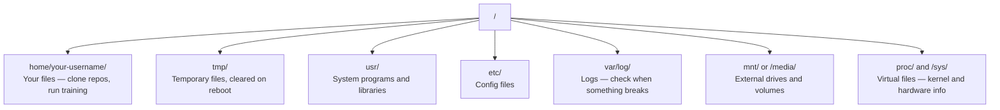

# AI のための Linux

> ほとんどの AI は Linux 上で動く。詰まらないために最低限を知っておく必要がある。

**タイプ:** 学習
**言語:** --
**前提条件:** フェーズ 0、レッスン 01
**所要時間:** 約30分

## 学習目標

- コマンドラインから Linux ファイルシステムを操作し、基本的なファイル操作を行う
- `chmod` と `chown` でファイルのパーミッションを管理し、「Permission denied」エラーを解消する
- `apt` でシステムパッケージをインストールし、AI 作業用の新しい GPU ボックスをセットアップする
- リモートマシン作業でよくはまる macOS と Linux の違いを把握する

## 問題の背景

あなたは macOS や Windows で開発している。しかし、クラウドの GPU ボックスに SSH 接続したり、Lambda インスタンスを借りたり、EC2 マシンを起動した瞬間、Ubuntu の世界に降り立つ。ターミナルが唯一のインターフェースだ。Finder もない、エクスプローラーもない、GUI もない。コマンドラインからファイルシステムを操作し、パッケージをインストールし、プロセスを管理できなければ、「Linux でファイルを解凍する方法」をググりながら GPU の無駄なアイドル費用を払い続けることになる。

これはサバイバルガイドだ。AI 作業のためにリモート Linux マシンを操作するのに必要なことだけを扱う。それ以上は何もない。

## ファイルシステムのレイアウト

Linux はすべてをルート `/` の下に一元管理する。`C:\` も `/Volumes` もない。実際に触ることになるディレクトリ:



ホームディレクトリは `~` または `/home/your-username`。やることのほぼすべてはここで行われる。

## 必須コマンド

リモート GPU ボックスでの作業の95%をカバーする15のコマンドだ。

### 移動

```bash
pwd                         # Where am I?
ls                          # What's here?
ls -la                      # What's here, including hidden files with details?
cd /path/to/dir             # Go there
cd ~                        # Go home
cd ..                       # Go up one level
```

### ファイルとディレクトリ

```bash
mkdir my-project            # Create a directory
mkdir -p a/b/c              # Create nested directories in one shot

cp file.txt backup.txt      # Copy a file
cp -r src/ src-backup/      # Copy a directory (recursive)

mv old.txt new.txt          # Rename a file
mv file.txt /tmp/           # Move a file

rm file.txt                 # Delete a file (no trash, it's gone)
rm -rf my-dir/              # Delete a directory and everything inside
```

`rm -rf` は永続的だ。元に戻せない。Enter を押す前にパスを必ず確認すること。

### ファイルの閲覧

```bash
cat file.txt                # Print entire file
head -20 file.txt           # First 20 lines
tail -20 file.txt           # Last 20 lines
tail -f log.txt             # Follow a log file in real time (Ctrl+C to stop)
less file.txt               # Scroll through a file (q to quit)
```

### 検索

```bash
grep "error" training.log           # Find lines containing "error"
grep -r "learning_rate" .           # Search all files in current directory
grep -i "cuda" config.yaml          # Case-insensitive search

find . -name "*.py"                 # Find all Python files under current dir
find . -name "*.ckpt" -size +1G     # Find checkpoint files larger than 1GB
```

## パーミッション

Linux のすべてのファイルには所有者とパーミッションビットがある。スクリプトが実行できない、ディレクトリに書き込めないといったときに直面する。

```bash
ls -l train.py
# -rwxr-xr-- 1 user group 2048 Mar 19 10:00 train.py
#  ^^^             owner permissions: read, write, execute
#     ^^^          group permissions: read, execute
#        ^^        everyone else: read only
```

よくある対処法:

```bash
chmod +x train.sh           # Make a script executable
chmod 755 deploy.sh         # Owner: full, others: read+execute
chmod 644 config.yaml       # Owner: read+write, others: read only

chown user:group file.txt   # Change who owns a file (needs sudo)
```

「Permission denied」と表示されたら、ほぼ確実にパーミッションの問題だ。`chmod +x` または `sudo` でほとんどのケースは解決する。

## パッケージ管理（apt）

Ubuntu は `apt` を使う。システムレベルのソフトウェアはこれでインストールする。

```bash
sudo apt update             # Refresh the package list (always do this first)
sudo apt install -y htop    # Install a package (-y skips confirmation)
sudo apt install -y build-essential  # C compiler, make, etc. Needed by many Python packages
sudo apt install -y tmux    # Terminal multiplexer (keep sessions alive after disconnect)

apt list --installed        # What's installed?
sudo apt remove htop        # Uninstall
```

新しい GPU ボックスにインストールする定番パッケージ:

```bash
sudo apt update && sudo apt install -y \
    build-essential \
    git \
    curl \
    wget \
    tmux \
    htop \
    unzip \
    python3-venv
```

## ユーザーと sudo

通常は一般ユーザーとしてログインしている。一部の操作には root（管理者）権限が必要だ。

```bash
whoami                      # What user am I?
sudo command                # Run a single command as root
sudo su                     # Become root (exit to go back, use sparingly)
```

クラウドの GPU インスタンスでは、たいてい自分が唯一のユーザーで sudo 権限もある。すべてを root で実行しないこと。必要なときだけ sudo を使う。

## プロセスと systemd

トレーニングがハングしたとき、あるいは何が動いているか確認したいとき:

```bash
htop                        # Interactive process viewer (q to quit)
ps aux | grep python        # Find running Python processes
kill 12345                  # Gracefully stop process with PID 12345
kill -9 12345               # Force kill (use when graceful doesn't work)
nvidia-smi                  # GPU processes and memory usage
```

systemd はサービス（バックグラウンドデーモン）を管理する。推論サーバーを動かすときに使う:

```bash
sudo systemctl start nginx          # Start a service
sudo systemctl stop nginx           # Stop it
sudo systemctl restart nginx        # Restart it
sudo systemctl status nginx         # Check if it's running
sudo systemctl enable nginx         # Start automatically on boot
```

## ディスク容量

GPU ボックスはディスク容量が限られていることが多い。モデルやデータセットはすぐに埋まる。

```bash
df -h                       # Disk usage for all mounted drives
df -h /home                 # Disk usage for /home specifically

du -sh *                    # Size of each item in current directory
du -sh ~/.cache             # Size of your cache (pip, huggingface models land here)
du -sh /data/checkpoints/   # Check how big your checkpoints are

# Find the biggest space hogs
du -h --max-depth=1 / 2>/dev/null | sort -hr | head -20
```

よくある容量節約策:

```bash
# Clear pip cache
pip cache purge

# Clear apt cache
sudo apt clean

# Remove old checkpoints you don't need
rm -rf checkpoints/epoch_01/ checkpoints/epoch_02/
```

## ネットワーク

コマンドラインからモデルをダウンロードし、ファイルを転送し、API を叩く。

```bash
# Download files
wget https://example.com/model.bin                   # Download a file
curl -O https://example.com/data.tar.gz              # Same thing with curl
curl -s https://api.example.com/health | python3 -m json.tool  # Hit an API, pretty-print JSON

# Transfer files between machines
scp model.bin user@remote:/data/                     # Copy file to remote machine
scp user@remote:/data/results.csv .                  # Copy file from remote to local
scp -r user@remote:/data/checkpoints/ ./local-dir/   # Copy directory

# Sync directories (faster than scp for large transfers, resumes on failure)
rsync -avz --progress ./data/ user@remote:/data/
rsync -avz --progress user@remote:/results/ ./results/
```

大きなデータには `scp` より `rsync` を使うこと。変更されたバイトだけを転送し、接続が途切れても再開できる。

## tmux: セッションを生かし続ける

リモートボックスに SSH 接続しているとき、ノートパソコンを閉じるとトレーニングが止まる。tmux はこれを防ぐ。

```bash
tmux new -s train           # Start a new session named "train"
# ... start your training, then:
# Ctrl+B, then D            # Detach (training keeps running)

tmux ls                     # List sessions
tmux attach -t train        # Reattach to session

# Inside tmux:
# Ctrl+B, then %            # Split pane vertically
# Ctrl+B, then "            # Split pane horizontally
# Ctrl+B, then arrow keys   # Switch between panes
```

長いトレーニングジョブは必ず tmux の中で実行すること。必ずだ。

## Windows ユーザー向け WSL2

Windows を使っているなら、WSL2 でデュアルブートなしに本物の Linux 環境が手に入る。

```bash
# In PowerShell (admin)
wsl --install -d Ubuntu-24.04

# After restart, open Ubuntu from Start menu
sudo apt update && sudo apt upgrade -y
```

WSL2 は本物の Linux カーネルを動かす。このレッスンのすべてが WSL2 内で動作する。WSL 内から見た Windows ファイルは `/mnt/c/Users/YourName/` にある。

GPU パススルーは Windows 側に NVIDIA ドライバーをインストールすれば動く。Windows の NVIDIA ドライバー（Linux 版ではない）をインストールすれば、WSL2 内で CUDA が使えるようになる。

## 注意点: macOS から Linux へ

macOS から来た人がはまりやすいこと:

| macOS | Linux | 備考 |
|-------|-------|------|
| `brew install` | `sudo apt install` | パッケージ名が異なる場合がある。`brew install htop` vs `sudo apt install htop` は同じだが、`brew install readline` vs `sudo apt install libreadline-dev` は異なる。 |
| `open file.txt` | `xdg-open file.txt` | リモートボックスには GUI がない。`cat` か `less` を使う。 |
| `pbcopy` / `pbpaste` | 利用不可 | SSH 越しのクリップボードへのパイプは存在しない。 |
| `~/.zshrc` | `~/.bashrc` | macOS のデフォルトは zsh。ほとんどの Linux サーバーは bash を使う。 |
| `/opt/homebrew/` | `/usr/bin/`, `/usr/local/bin/` | バイナリの場所が異なる。 |
| `sed -i '' 's/a/b/' file` | `sed -i 's/a/b/' file` | macOS の sed は `-i` の後に空文字列が必要。Linux は不要。 |
| 大文字・小文字を区別しないファイルシステム | 大文字・小文字を区別するファイルシステム | Linux では `Model.py` と `model.py` は別のファイル。 |
| 改行コード `\n` | 改行コード `\n` | 同じ。ただし Windows は `\r\n` を使うため bash スクリプトが壊れる。`dos2unix` で修正する。 |

## クイックリファレンスカード

```
Navigation:     pwd, ls, cd, find
Files:          cp, mv, rm, mkdir, cat, head, tail, less
Search:         grep, find
Permissions:    chmod, chown, sudo
Packages:       apt update, apt install
Processes:      htop, ps, kill, nvidia-smi
Services:       systemctl start/stop/restart/status
Disk:           df -h, du -sh
Network:        curl, wget, scp, rsync
Sessions:       tmux new/attach/detach
```

## 演習

1. 任意の Linux マシン（または WSL2）に SSH 接続してホームディレクトリに移動する。プロジェクトフォルダを作成し、`touch` で中に3つの空ファイルを作成して、`ls -la` で一覧表示する。
2. apt で `htop` をインストールして実行し、最もメモリを使用しているプロセスを特定する。
3. tmux セッションを開始し、その中で `sleep 300` を実行して、デタッチして、セッション一覧を確認して、再アタッチする。
4. `df -h` で利用可能なディスク容量を確認し、`du -sh ~/.cache/*` でキャッシュの何がスペースを占有しているか調べる。
5. `scp` を使ってローカルマシンからリモートにファイルを転送し、次に `rsync` で同じ転送を行ってその体験を比較する。
