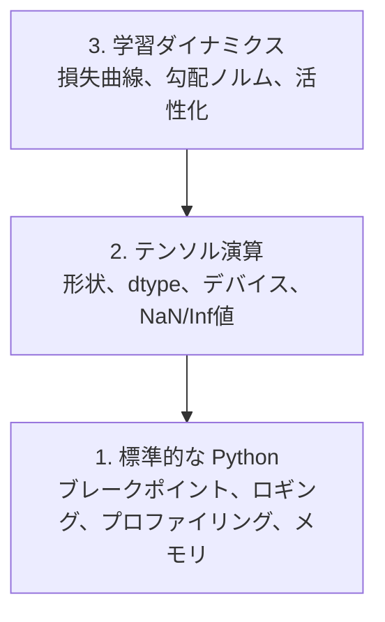

# デバッグとプロファイリング

> AIの最悪のバグはクラッシュしない。ゴミデータで静かに学習を続け、美しい損失曲線を報告する。

**タイプ:** ビルド
**言語:** Python
**前提条件:** レッスン1（開発環境）、PyTorch の基本的な知識
**所要時間:** 約60分

## 学習目標

- 条件付き `breakpoint()` と `debug_print` を使って、学習中のテンソルの形状・dtype・NaN値を検査する
- `cProfile`・`line_profiler`・`tracemalloc` で学習ループをプロファイリングし、ボトルネックを発見する
- AIの一般的なバグ（形状の不一致、NaN損失、データ漏洩、デバイスの不一致テンソル）を検出する
- TensorBoard をセットアップして損失曲線・重みヒストグラム・勾配分布を可視化する

## 問題の背景

AIのコードは通常のコードとは異なる壊れ方をする。Webアプリはスタックトレースとともにクラッシュする。設定ミスのある学習ループは8時間動き続け、GPU代に$200かけ、すべての入力に対して平均値を予測するモデルを生成する。コードはエラーを出さない。バグは、デバイスが違うテンソル、忘れられた `.detach()`、特徴量に漏れ込んだラベルだった。

こうした無音の失敗を時間とコンピュートを無駄にする前に捕捉するデバッグツールが必要だ。

## 概念

AIのデバッグは3つのレベルで行われる：



多くの人はいきなりレベル3（TensorBoard を眺める）に飛びつく。しかし、AIバグの80%はレベル1と2に潜んでいる。

## 作ってみる

### パート1: print デバッグ（これは有効だ）

print デバッグは軽視されがちだが、そうすべきではない。テンソルのコードでは、ターゲットを絞った print 文はデバッガーをステップ実行するより効果的だ。形状・dtype・値の範囲を一度に確認できるからだ。

```python
def debug_print(name, tensor):
    print(f"{name}: shape={tensor.shape}, dtype={tensor.dtype}, "
          f"device={tensor.device}, "
          f"min={tensor.min().item():.4f}, max={tensor.max().item():.4f}, "
          f"mean={tensor.mean().item():.4f}, "
          f"has_nan={tensor.isnan().any().item()}")
```

怪しい演算の後に毎回これを呼ぶ。バグが見つかったら print を削除する。シンプルだ。

### パート2: Python デバッガー（pdb と breakpoint）

組み込みデバッガーはAI開発において過小評価されている。学習ループに `breakpoint()` を仕込んで、テンソルをインタラクティブに検査しよう。

```python
def training_step(model, batch, criterion, optimizer):
    inputs, labels = batch
    outputs = model(inputs)
    loss = criterion(outputs, labels)

    if loss.item() > 100 or torch.isnan(loss):
        breakpoint()

    loss.backward()
    optimizer.step()
```

デバッガーに入ったときに使える便利なコマンド：

- `p outputs.shape` で形状を確認
- `p loss.item()` で損失値を確認
- `p torch.isnan(outputs).sum()` で NaN の数を数える
- `p model.fc1.weight.grad` で勾配を確認
- `c` で続行、`q` で終了

これは条件付きデバッグだ。何かおかしいときだけ止まる。10,000ステップの学習では、それが重要になる。

### パート3: Python ロギング

デバッグがちょっとした確認を超えたら、print 文をロギングに置き換えよう。

```python
import logging

logging.basicConfig(
    level=logging.INFO,
    format="%(asctime)s [%(levelname)s] %(message)s",
    handlers=[
        logging.FileHandler("training.log"),
        logging.StreamHandler()
    ]
)
logger = logging.getLogger(__name__)

logger.info("Starting training: lr=%.4f, batch_size=%d", lr, batch_size)
logger.warning("Loss spike detected: %.4f at step %d", loss.item(), step)
logger.error("NaN loss at step %d, stopping", step)
```

ロギングはタイムスタンプ・重大度レベル・ファイル出力を提供してくれる。学習が午前3時に失敗したとき、欲しいのはスクロールして消えたターミナル出力ではなく、ログファイルだ。

### パート4: コードセクションの計時

時間がどこに使われているかを知ることが、最適化の第一歩だ。

```python
import time

class Timer:
    def __init__(self, name=""):
        self.name = name

    def __enter__(self):
        self.start = time.perf_counter()
        return self

    def __exit__(self, *args):
        elapsed = time.perf_counter() - self.start
        print(f"[{self.name}] {elapsed:.4f}s")

with Timer("data loading"):
    batch = next(dataloader_iter)

with Timer("forward pass"):
    outputs = model(batch)

with Timer("backward pass"):
    loss.backward()
```

よくある発見：データ読み込みが学習時間の60%を占めている。解決策は高速なGPUではなく、DataLoader の `num_workers > 0` だ。

### パート5: cProfile と line_profiler

手動タイマー以上の情報が必要な場合：

```bash
python -m cProfile -s cumtime train.py
```

これにより、全関数呼び出しを累積時間順に表示できる。行単位のプロファイリングには：

```bash
pip install line_profiler
```

```python
@profile
def train_step(model, data, target):
    output = model(data)
    loss = F.cross_entropy(output, target)
    loss.backward()
    return loss

# 実行方法: kernprof -l -v train.py
```

### パート6: メモリプロファイリング

#### tracemalloc による CPU メモリ

```python
import tracemalloc

tracemalloc.start()

# ここにコードを記述
model = build_model()
data = load_dataset()

snapshot = tracemalloc.take_snapshot()
top_stats = snapshot.statistics("lineno")
for stat in top_stats[:10]:
    print(stat)
```

#### memory_profiler による CPU メモリ

```bash
pip install memory_profiler
```

```python
from memory_profiler import profile

@profile
def load_data():
    raw = read_csv("data.csv")       # ここでメモリが跳ね上がるのを確認
    processed = preprocess(raw)       # そしてここでも
    return processed
```

`python -m memory_profiler your_script.py` で実行すると行単位のメモリ使用量が表示される。

#### PyTorch による GPU メモリ

```python
import torch

if torch.cuda.is_available():
    print(torch.cuda.memory_summary())

    print(f"Allocated: {torch.cuda.memory_allocated() / 1e9:.2f} GB")
    print(f"Cached: {torch.cuda.memory_reserved() / 1e9:.2f} GB")
```

OOM（メモリ不足）に達したとき：

1. バッチサイズを減らす（最初に試すべき、常に）
2. `torch.cuda.empty_cache()` でキャッシュされたメモリを解放する
3. 大きな中間テンソルに対して `del tensor` の後に `torch.cuda.empty_cache()` を使う
4. 混合精度（`torch.cuda.amp`）を使ってメモリ使用量を半減させる
5. 非常に深いモデルには勾配チェックポインティングを使う

### パート7: AIの一般的なバグとその検出方法

#### 形状の不一致

最も頻繁なバグだ。モデルが `[batch, channels, height, width]` を期待しているのに、テンソルの形状が `[batch, features]` になっている。

```python
def check_shapes(model, sample_input):
    print(f"Input: {sample_input.shape}")
    hooks = []

    def make_hook(name):
        def hook(module, inp, out):
            in_shape = inp[0].shape if isinstance(inp, tuple) else inp.shape
            out_shape = out.shape if hasattr(out, "shape") else type(out)
            print(f"  {name}: {in_shape} -> {out_shape}")
        return hook

    for name, module in model.named_modules():
        hooks.append(module.register_forward_hook(make_hook(name)))

    with torch.no_grad():
        model(sample_input)

    for h in hooks:
        h.remove()
```

サンプルバッチで一度実行すれば、モデル内のすべての形状変換がマッピングされる。

#### NaN 損失

NaN 損失は何かが爆発したことを意味する。よくある原因：

- 学習率が高すぎる
- カスタム損失関数でゼロ除算が発生している
- ゼロや負の数の対数をとっている
- RNN で勾配爆発が起きている

```python
def detect_nan(model, loss, step):
    if torch.isnan(loss):
        print(f"NaN loss at step {step}")
        for name, param in model.named_parameters():
            if param.grad is not None:
                if torch.isnan(param.grad).any():
                    print(f"  NaN gradient in {name}")
                if torch.isinf(param.grad).any():
                    print(f"  Inf gradient in {name}")
        return True
    return False
```

#### データ漏洩

テストセットで99%の精度が出た。素晴らしく聞こえる。これはバグだ。

```python
def check_data_leakage(train_set, test_set, id_column="id"):
    train_ids = set(train_set[id_column].tolist())
    test_ids = set(test_set[id_column].tolist())
    overlap = train_ids & test_ids
    if overlap:
        print(f"DATA LEAKAGE: {len(overlap)} samples in both train and test")
        return True
    return False
```

時系列漏洩（未来のデータを使って過去を予測している）にも注意しよう。分割前にタイムスタンプでソートすること。

#### デバイスの不一致

デバイスが異なるテンソル（CPU vs GPU）はランタイムエラーを引き起こす。ただし、他のすべてがGPU上にあるのにテンソルが静かにCPU上にとどまり、学習がただ遅くなるだけのこともある。

```python
def check_devices(model, *tensors):
    model_device = next(model.parameters()).device
    print(f"Model device: {model_device}")
    for i, t in enumerate(tensors):
        if t.device != model_device:
            print(f"  WARNING: tensor {i} on {t.device}, model on {model_device}")
```

### パート8: TensorBoard の基本

TensorBoard は学習中に内部で何が起きているかを時系列で見せてくれる。

```bash
pip install tensorboard
```

```python
from torch.utils.tensorboard import SummaryWriter

writer = SummaryWriter("runs/experiment_1")

for step in range(num_steps):
    loss = train_step(model, batch)

    writer.add_scalar("loss/train", loss.item(), step)
    writer.add_scalar("lr", optimizer.param_groups[0]["lr"], step)

    if step % 100 == 0:
        for name, param in model.named_parameters():
            writer.add_histogram(f"weights/{name}", param, step)
            if param.grad is not None:
                writer.add_histogram(f"grads/{name}", param.grad, step)

writer.close()
```

起動方法：

```bash
tensorboard --logdir=runs
```

確認すべきポイント：

- **損失が下がらない**: 学習率が低すぎるか、モデルアーキテクチャの問題
- **損失が激しく振動する**: 学習率が高すぎる
- **損失が NaN になる**: 数値的不安定性（上の NaN セクションを参照）
- **訓練損失は下がるが検証損失が上がる**: 過学習
- **重みヒストグラムがゼロに収束する**: 勾配消失
- **勾配ヒストグラムが爆発する**: 勾配クリッピングが必要

### パート9: VS Code デバッガー

インタラクティブなデバッグには、`launch.json` で VS Code を設定しよう：

```json
{
    "version": "0.2.0",
    "configurations": [
        {
            "name": "Debug Training",
            "type": "debugpy",
            "request": "launch",
            "program": "${file}",
            "console": "integratedTerminal",
            "justMyCode": false
        }
    ]
}
```

ガター部分をクリックしてブレークポイントを設定する。Variables ペインでテンソルのプロパティを検査できる。Debug Console では実行中に任意の Python 式を実行できる。

各変換を確認しながらデータ前処理パイプラインをステップ実行するのに便利だ。

## 使ってみる

AIバグの多くを捕捉するデバッグワークフローを紹介する：

1. **学習前**: サンプルバッチで `check_shapes` を実行する。入出力の次元が期待通りか確認する。
2. **最初の10ステップ**: 損失・出力・勾配に `debug_print` を使う。NaN がなく、値が妥当な範囲にあることを確認する。
3. **学習中**: 損失・学習率・勾配ノルムをログに記録する。可視化には TensorBoard を使う。
4. **何か壊れたとき**: 失敗箇所に `breakpoint()` を仕込む。テンソルをインタラクティブに検査する。
5. **パフォーマンス改善のため**: データ読み込み・フォワードパス・バックワードパスの時間を計測する。OOM に近いならメモリをプロファイリングする。

## 提出する

デバッグツールキットのスクリプトを実行しよう：

```bash
python phases/00-setup-and-tooling/12-debugging-and-profiling/code/debug_tools.py
```

AI固有のバグを診断するためのプロンプトは `outputs/prompt-debug-ai-code.md` を参照。

## 演習

1. `debug_tools.py` を実行して各セクションの出力を読む。ダミーモデルを変更して NaN を発生させ（ヒント: フォワードパスでゼロ除算する）、検出器がそれを捕捉するのを確認する。
2. `cProfile` で学習ループをプロファイリングし、最も遅い関数を特定する。
3. `tracemalloc` を使って、データ読み込みパイプライン内でどの行が最もメモリを消費しているかを探す。
4. シンプルな学習実行に TensorBoard をセットアップして、モデルが過学習しているかどうかを判断する。
5. 学習ループ内で `breakpoint()` を使う。デバッガープロンプトからテンソルの形状・デバイス・勾配値を検査する練習をする。
