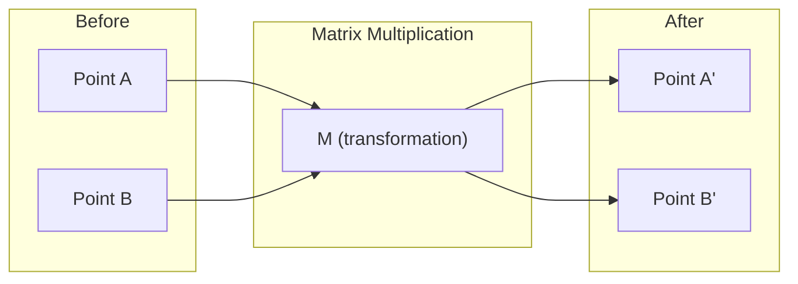
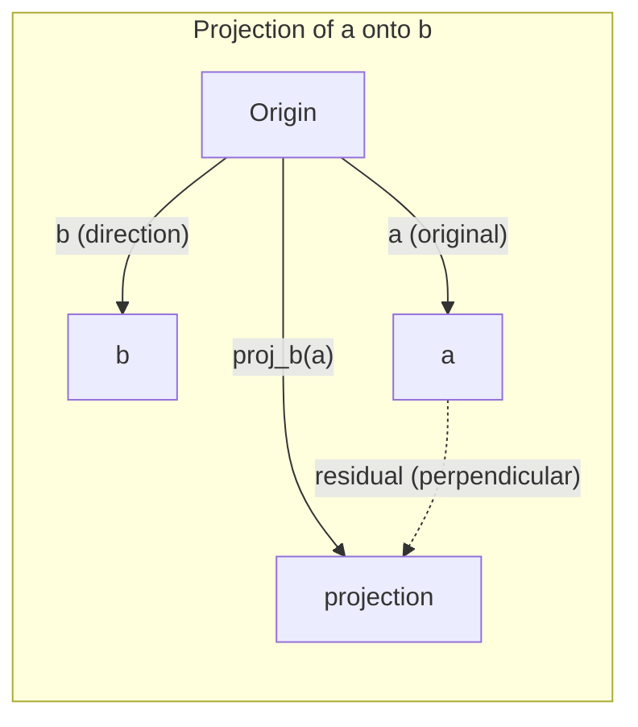

# 線形代数の直感

> あらゆる AI モデルは、派手な帽子をかぶった行列計算にすぎない。

**タイプ:** 学習
**言語:** Python, Julia
**前提条件:** Phase 0
**所要時間:** 約 60 分

## 学習目標

- ベクトルと行列の演算（加算、内積、行列積）を Python でゼロから実装する
- 内積、射影、グラム・シュミット過程が幾何学的に何を行うかを説明する
- 行の削減を使ってベクトルの集合の線形独立性、ランク、基底を決定する
- 線形代数の概念を AI への応用に結びつける：埋め込み、アテンションスコア、LoRA

## 問題

ML の論文を開いてみてください。最初のページで、ベクトル、行列、内積、変換が登場します。線形代数の直感がなければ、これらは単なる記号です。直感があれば、ニューラルネットワークが実際に何をしているか——空間内の点を動かしていること——が見えてきます。

数学者である必要はありません。これらの演算が幾何学的に何を意味するかを理解し、自分でコード化できれば十分です。

## 概念

### ベクトルは点（と方向）である

ベクトルは単なる数値のリストです。しかしその数値には意味があります——空間内の座標です。

**2D ベクトル [3, 2]:**

| x | y | 点 |
|---|---|-------|
| 3 | 2 | このベクトルは平面上の原点 (0,0) から (3, 2) を指す |

このベクトルの大きさは sqrt(3^2 + 2^2) = sqrt(13) で、右上方向を向いています。

AI では、ベクトルはあらゆるものを表します：
- 単語 → 768 個の数値のベクトル（埋め込み空間における「意味」）
- 画像 → 数百万のピクセル値のベクトル
- ユーザー → 好みのベクトル

### 行列は変換である

行列はあるベクトルを別のベクトルに変換します。回転、拡大縮小、伸張、射影が可能です。



AI では、行列がモデルそのものです：
- ニューラルネットワークの重み → 入力を出力に変換する行列
- アテンションスコア → 何に注目するかを決定する行列
- 埋め込み → 単語をベクトルに対応付ける行列

### 内積は類似度を測る

2 つのベクトルの内積は、それらがどれほど似ているかを示します。

```
a · b = a₁×b₁ + a₂×b₂ + ... + aₙ×bₙ

同じ方向:    a · b > 0  (類似)
垂直:        a · b = 0  (無関係)
逆方向:      a · b < 0  (非類似)
```

これはまさに検索エンジン、推薦システム、RAG の仕組みです——内積が大きいベクトルを見つけることです。

### 線形独立性

あるベクトルの集合において、どのベクトルも他のベクトルの線形結合として表せない場合、それらは線形独立です。v1、v2、v3 が独立であれば、それらは 3 次元空間を張ります。1 つが他のベクトルの結合で表せる場合、それらは平面しか張れません。

AI での重要性：特徴行列は線形独立な列を持つべきです。2 つの特徴が完全に相関している（線形従属）場合、モデルはそれらの効果を区別できません。これは回帰における多重共線性を引き起こし、重み行列が不安定になり、わずかな入力変化が大きな出力の変動をもたらします。

**具体的な例：**

```
v1 = [1, 0, 0]
v2 = [0, 1, 0]
v3 = [2, 1, 0]   # v3 = 2*v1 + v2
```

v1 と v2 は独立です——どちらも他方のスカラー倍や線形結合ではありません。しかし v3 = 2*v1 + v2 なので、{v1, v2, v3} は従属な集合です。これら 3 つのベクトルはすべて xy 平面上にあります。どのように組み合わせても [0, 0, 1] には到達できません。ベクトルが 3 つあっても、自由度は 2 次元しかありません。

データセットで言えば：feature_3 = 2*feature_1 + feature_2 の場合、feature_3 を追加してもモデルに新しい情報はゼロです。さらに悪いことに、正規方程式が特異になり——重みに対して一意な解が存在しなくなります。

### 基底とランク

基底とは、空間全体を張る線形独立なベクトルの最小集合です。基底ベクトルの数がその空間の次元数です。

3 次元空間の標準基底は {[1,0,0], [0,1,0], [0,0,1]} ですが、3 次元空間内の独立な 3 つのベクトルはどれも有効な基底を形成します。基底の選択は座標系の選択です。

行列のランク = 線形独立な列の数 = 線形独立な行の数。ランク < min(行数, 列数) の場合、行列はランク不足です。これは以下を意味します：
- 系は無限に多くの解を持つ（またはまったく解がない）
- 変換において情報が失われる
- 行列は逆行列を持てない

| 状況 | ランク | ML における意味 |
|-----------|------|---------------------|
| フルランク（rank = min(m, n)）| 最大値 | 一意な最小二乗解が存在する。モデルは安定している。 |
| ランク不足（rank < min(m, n)）| 最大値以下 | 特徴が冗長。無限に多くの重み解がある。正則化が必要。 |
| ランク 1 | 1 | すべての列は 1 つのベクトルのスケール倍。すべてのデータが直線上にある。 |
| ランク不足に近い（特異値が小さい）| 数値的に低い | 行列が悪条件。わずかな入力ノイズが大きな出力変化をもたらす。SVD の打ち切りまたはリッジ回帰を使用。 |

### 射影

ベクトル **a** をベクトル **b** に射影すると、**b** の方向における **a** の成分が得られます：

```
proj_b(a) = (a dot b / b dot b) * b
```

残差 (a - proj_b(a)) は b に対して垂直です。この直交分解は最小二乗フィッティングの基礎です。

射影は ML のいたるところに登場します：
- 線形回帰は観測値から列空間への距離を最小化します——その解は射影そのものです
- PCA はデータを分散が最大の方向に射影します
- トランスフォーマーのアテンションはクエリをキーに射影することで計算されます



**例：** a = [3, 4], b = [1, 0]

proj_b(a) = (3*1 + 4*0) / (1*1 + 0*0) * [1, 0] = 3 * [1, 0] = [3, 0]

射影は y 成分を除去します。これは最もシンプルな形の次元削減です——不要な方向を捨てることです。

### グラム・シュミット過程

独立なベクトルの任意の集合を正規直交基底に変換します。正規直交とは、すべてのベクトルが長さ 1 で、すべてのペアが垂直であることを意味します。

アルゴリズム：
1. 最初のベクトルを取り、正規化する
2. 2 番目のベクトルを取り、最初のベクトルへの射影を引いて正規化する
3. 3 番目のベクトルを取り、これまでのすべてのベクトルへの射影を引いて正規化する
4. 残りのベクトルに対して繰り返す

```
入力:  v1, v2, v3, ... (線形独立)

u1 = v1 / |v1|

w2 = v2 - (v2 dot u1) * u1
u2 = w2 / |w2|

w3 = v3 - (v3 dot u1) * u1 - (v3 dot u2) * u2
u3 = w3 / |w3|

出力: u1, u2, u3, ... (正規直交基底)
```

これが QR 分解の内部動作です。Q が正規直交基底で、R が射影係数を捉えます。QR 分解は以下に使われます：
- 線形系の解法（ガウス消去法より安定）
- 固有値の計算（QR アルゴリズム）
- 最小二乗回帰（標準的な数値解法）

## 実装する

### ステップ 1: ベクトルをゼロから（Python）

```python
class Vector:
    def __init__(self, components):
        self.components = list(components)
        self.dim = len(self.components)

    def __add__(self, other):
        return Vector([a + b for a, b in zip(self.components, other.components)])

    def __sub__(self, other):
        return Vector([a - b for a, b in zip(self.components, other.components)])

    def dot(self, other):
        return sum(a * b for a, b in zip(self.components, other.components))

    def magnitude(self):
        return sum(x**2 for x in self.components) ** 0.5

    def normalize(self):
        mag = self.magnitude()
        return Vector([x / mag for x in self.components])

    def cosine_similarity(self, other):
        return self.dot(other) / (self.magnitude() * other.magnitude())

    def __repr__(self):
        return f"Vector({self.components})"


a = Vector([1, 2, 3])
b = Vector([4, 5, 6])

print(f"a + b = {a + b}")
print(f"a · b = {a.dot(b)}")
print(f"|a| = {a.magnitude():.4f}")
print(f"cosine similarity = {a.cosine_similarity(b):.4f}")
```

### ステップ 2: 行列をゼロから（Python）

```python
class Matrix:
    def __init__(self, rows):
        self.rows = [list(row) for row in rows]
        self.shape = (len(self.rows), len(self.rows[0]))

    def __matmul__(self, other):
        if isinstance(other, Vector):
            return Vector([
                sum(self.rows[i][j] * other.components[j] for j in range(self.shape[1]))
                for i in range(self.shape[0])
            ])
        rows = []
        for i in range(self.shape[0]):
            row = []
            for j in range(other.shape[1]):
                row.append(sum(
                    self.rows[i][k] * other.rows[k][j]
                    for k in range(self.shape[1])
                ))
            rows.append(row)
        return Matrix(rows)

    def transpose(self):
        return Matrix([
            [self.rows[j][i] for j in range(self.shape[0])]
            for i in range(self.shape[1])
        ])

    def __repr__(self):
        return f"Matrix({self.rows})"


rotation_90 = Matrix([[0, -1], [1, 0]])
point = Vector([3, 1])

rotated = rotation_90 @ point
print(f"Original: {point}")
print(f"Rotated 90°: {rotated}")
```

### ステップ 3: AI への応用

```python
import random

random.seed(42)
weights = Matrix([[random.gauss(0, 0.1) for _ in range(3)] for _ in range(2)])
input_vector = Vector([1.0, 0.5, -0.3])

output = weights @ input_vector
print(f"Input (3D): {input_vector}")
print(f"Output (2D): {output}")
print("This is what a neural network layer does -- matrix multiplication.")
```

### ステップ 4: Julia 版

```julia
a = [1.0, 2.0, 3.0]
b = [4.0, 5.0, 6.0]

println("a + b = ", a + b)
println("a · b = ", a ⋅ b)       # Julia supports unicode operators
println("|a| = ", √(a ⋅ a))
println("cosine = ", (a ⋅ b) / (√(a ⋅ a) * √(b ⋅ b)))

# Matrix-vector multiplication
W = [0.1 -0.2 0.3; 0.4 0.5 -0.1]
x = [1.0, 0.5, -0.3]
println("Wx = ", W * x)
println("This is a neural network layer.")
```

### ステップ 5: 線形独立性と射影をゼロから（Python）

```python
def is_linearly_independent(vectors):
    n = len(vectors)
    dim = len(vectors[0].components)
    mat = Matrix([v.components[:] for v in vectors])
    rows = [row[:] for row in mat.rows]
    rank = 0
    for col in range(dim):
        pivot = None
        for row in range(rank, len(rows)):
            if abs(rows[row][col]) > 1e-10:
                pivot = row
                break
        if pivot is None:
            continue
        rows[rank], rows[pivot] = rows[pivot], rows[rank]
        scale = rows[rank][col]
        rows[rank] = [x / scale for x in rows[rank]]
        for row in range(len(rows)):
            if row != rank and abs(rows[row][col]) > 1e-10:
                factor = rows[row][col]
                rows[row] = [rows[row][j] - factor * rows[rank][j] for j in range(dim)]
        rank += 1
    return rank == n


def project(a, b):
    scalar = a.dot(b) / b.dot(b)
    return Vector([scalar * x for x in b.components])


def gram_schmidt(vectors):
    orthonormal = []
    for v in vectors:
        w = v
        for u in orthonormal:
            proj = project(w, u)
            w = w - proj
        if w.magnitude() < 1e-10:
            continue
        orthonormal.append(w.normalize())
    return orthonormal


v1 = Vector([1, 0, 0])
v2 = Vector([1, 1, 0])
v3 = Vector([1, 1, 1])
basis = gram_schmidt([v1, v2, v3])
for i, u in enumerate(basis):
    print(f"u{i+1} = {u}")
    print(f"  |u{i+1}| = {u.magnitude():.6f}")

print(f"u1 · u2 = {basis[0].dot(basis[1]):.6f}")
print(f"u1 · u3 = {basis[0].dot(basis[2]):.6f}")
print(f"u2 · u3 = {basis[1].dot(basis[2]):.6f}")
```

## 実際に使う

NumPy を使った同じ処理——実際の現場で使うもの：

```python
import numpy as np

a = np.array([1, 2, 3], dtype=float)
b = np.array([4, 5, 6], dtype=float)

print(f"a + b = {a + b}")
print(f"a · b = {np.dot(a, b)}")
print(f"|a| = {np.linalg.norm(a):.4f}")
print(f"cosine = {np.dot(a, b) / (np.linalg.norm(a) * np.linalg.norm(b)):.4f}")

W = np.random.randn(2, 3) * 0.1
x = np.array([1.0, 0.5, -0.3])
print(f"Wx = {W @ x}")
```

### NumPy によるランク、射影、QR

```python
import numpy as np

A = np.array([[1, 2], [2, 4]])
print(f"Rank: {np.linalg.matrix_rank(A)}")

a = np.array([3, 4])
b = np.array([1, 0])
proj = (np.dot(a, b) / np.dot(b, b)) * b
print(f"Projection of {a} onto {b}: {proj}")

Q, R = np.linalg.qr(np.random.randn(3, 3))
print(f"Q is orthogonal: {np.allclose(Q @ Q.T, np.eye(3))}")
print(f"R is upper triangular: {np.allclose(R, np.triu(R))}")
```

### PyTorch——テンソルは自動微分付きのベクトル

```python
import torch

x = torch.randn(3, requires_grad=True)
y = torch.tensor([1.0, 0.0, 0.0])

similarity = torch.dot(x, y)
similarity.backward()

print(f"x = {x.data}")
print(f"y = {y.data}")
print(f"dot product = {similarity.item():.4f}")
print(f"d(dot)/dx = {x.grad}")
```

x に対する内積の勾配は単に y です。PyTorch がこれを自動的に計算しました。ニューラルネットワークのすべての演算は、行列積、内積、射影のような演算から構築されており、自動微分がそれらすべてを通じて勾配を追跡します。

NumPy が 1 行でやることをゼロから構築しました。これで内部で何が起きているかがわかります。

## 成果物

このレッスンで生成するもの：
- `outputs/prompt-linear-algebra-tutor.md` -- AI アシスタントが幾何学的直感を通じて線形代数を教えるためのプロンプト

## 接続

このレッスンのすべての概念は、現代 AI の具体的な部分につながっています：

| 概念 | 登場する場所 |
|---------|------------------|
| 内積 | トランスフォーマーのアテンションスコア、RAG のコサイン類似度 |
| 行列積 | すべてのニューラルネットワーク層、すべての線形変換 |
| 線形独立性 | 特徴選択、多重共線性の回避 |
| ランク | 系が解けるかどうかの判定、LoRA（低ランク適応） |
| 射影 | 線形回帰（列空間への射影）、PCA |
| グラム・シュミット / QR | 数値ソルバー、固有値計算 |
| 正規直交基底 | 安定した数値計算、白色化変換 |

LoRA は特別に言及する価値があります。大規模言語モデルを低ランク行列による重み更新の分解でファインチューニングします。4096×4096 の重み行列（1600 万パラメータ）を更新する代わりに、LoRA は 4096×16 と 16×4096 の 2 つの行列（13.1 万パラメータ）を更新します。ランク 16 の制約は、LoRA が重み更新を完全な 4096 次元空間の 16 次元部分空間に存在すると仮定することを意味します。これが線形代数の実際の仕事です。

## 演習

1. 2 つのベクトル間の角度を度数で返す `Vector.angle_between(other)` を実装してください
2. x 座標を 2 倍、y 座標を 3 倍にする 2D 拡大行列を作成し、ベクトル [1, 1] に適用してください
3. ランダムな単語のようなベクトル 5 つ（次元 50）が与えられたとき、コサイン類似度を使って最も類似した 2 つを見つけてください
4. グラム・シュミットの出力が本当に正規直交であることを検証してください：すべてのペアの内積が 0 で、すべてのベクトルの大きさが 1 であることを確認してください
5. ランク 2 の 3×3 行列を作成してください。`rank()` メソッドを使って検証し、列が張る幾何学的な対象を説明してください。
6. ベクトル [1, 2, 3] を [1, 1, 1] に射影してください。その結果は幾何学的に何を表しますか？

## 主要用語

| 用語 | よく言われること | 実際の意味 |
|------|----------------|----------------------|
| ベクトル | 「矢印」 | n 次元空間内の点や方向を表す数値のリスト |
| 行列 | 「数値の表」 | ベクトルをある空間から別の空間に写す変換 |
| 内積 | 「掛けて足す」 | 2 つのベクトルがどれだけ揃っているかの尺度——類似度検索の中核 |
| 埋め込み | 「AI のある種の魔法」 | 何か（単語、画像、ユーザー）の意味を表すベクトル |
| 線形独立性 | 「重ならない」 | 集合内のどのベクトルも他のベクトルの線形結合で表せない |
| ランク | 「次元の数」 | 行列内の線形独立な列（または行）の数 |
| 射影 | 「影」 | あるベクトルの別のベクトルの方向への成分 |
| 基底 | 「座標軸」 | 空間を張る独立なベクトルの最小集合 |
| 正規直交 | 「垂直な単位ベクトル」 | 互いに垂直で、それぞれの長さが 1 のベクトル |
