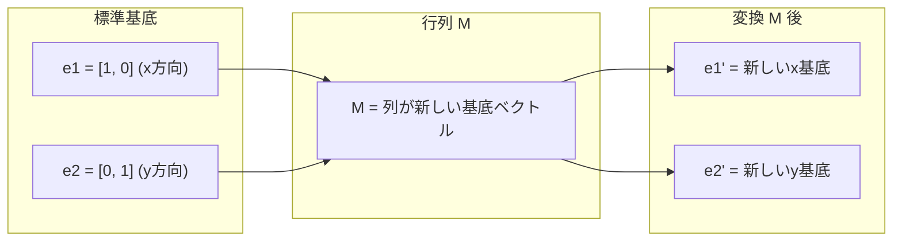
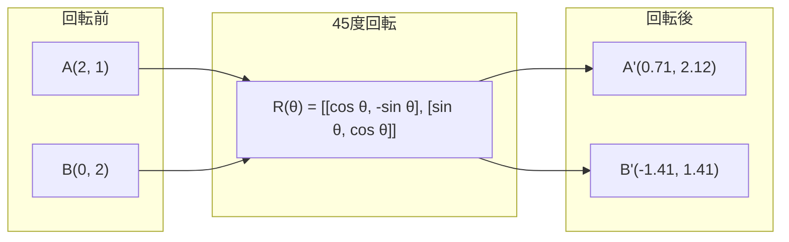
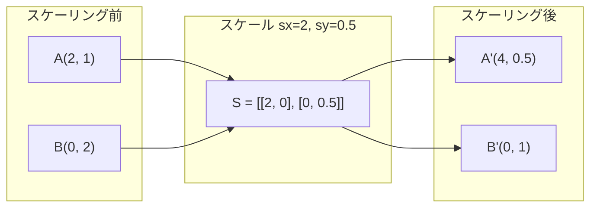
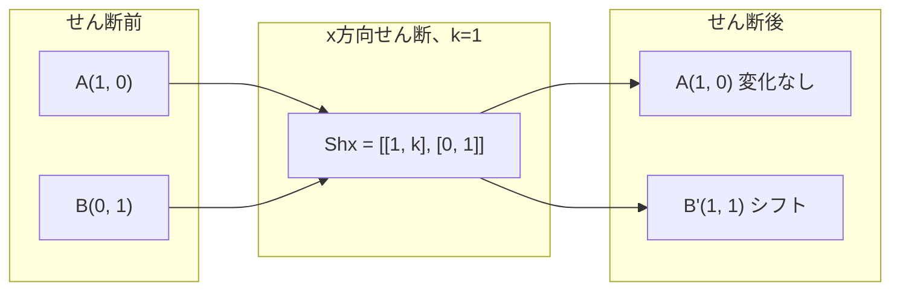
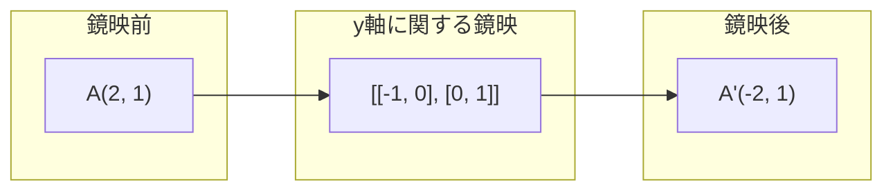
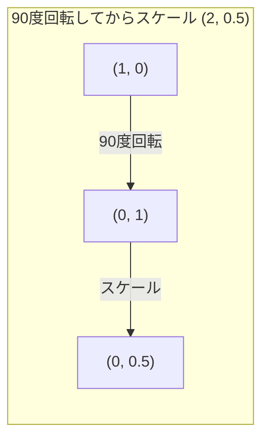
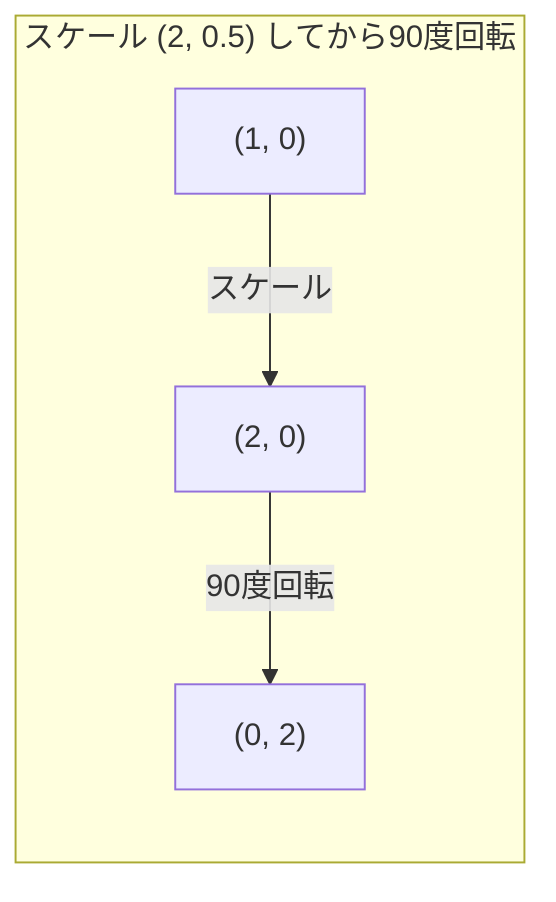

# 行列変換

> 行列は空間を変形させる機械だ。すべての点に対して何をするかを理解すれば、変換全体が見えてくる。

**タイプ:** 実装
**言語:** Python, Julia
**前提条件:** フェーズ1、レッスン01-02（線形代数の直感、ベクトルと行列の演算）
**所要時間:** 約75分

## 学習目標

- 回転・スケーリング・せん断・鏡映の行列を構成し、2D・3D点に適用する
- 行列積による複数変換の合成を行い、順序が結果に影響することを確認する
- 特性方程式から2×2行列の固有値・固有ベクトルを計算する
- 固有値がPCAの方向・RNNの安定性・スペクトルクラスタリングの振る舞いを決定する理由を説明する

## 問題設定

PCAについて読むと「共分散行列の固有ベクトルを求める」と書いてある。モデルの安定性について読むと「すべての固有値の大きさが1未満かどうか確認する」と書いてある。データ拡張について読むと「ランダムな回転を適用する」と書いてある。行列が空間に対して幾何学的に何をするのかを理解するまで、これらは意味をなさない。

行列は単なる数のグリッドではない。空間を操る機械だ。回転行列は点を回転させる。スケーリング行列は点を引き伸ばす。せん断行列は点を傾ける。ニューラルネットワークがデータに適用するすべての変換は、これらの操作またはその組み合わせだ。このレッスンではそれらの操作を具体的に理解する。

## 概念

### 行列としての変換

2Dにおけるすべての線形変換は2×2行列として書ける。行列は基底ベクトル [1, 0] と [0, 1] がどこに移動するかを正確に示す。残りはすべてそこから導かれる。



### 回転

角度thetaによる2D回転は距離と角度を保ったまま、各点を円弧に沿って移動させる。



3Dでは軸の周りに回転する。各軸には固有の回転行列がある。

```
Rz(theta) = | cos  -sin  0 |     z軸周りの回転
            | sin   cos  0 |     (x-y平面が回転、zは固定)
            |  0     0   1 |

Rx(theta) = | 1   0     0    |   x軸周りの回転
            | 0  cos  -sin   |   (y-z平面が回転、xは固定)
            | 0  sin   cos   |

Ry(theta) = |  cos  0  sin |     y軸周りの回転
            |   0   1   0  |     (x-z平面が回転、yは固定)
            | -sin  0  cos |
```

### スケーリング

スケーリングは各軸に沿って独立に引き伸ばしたり圧縮したりする。



### せん断

せん断は一方の軸を傾けながら他方を固定する。長方形を平行四辺形に変える。



せん断行列:
- `Shx = [[1, k], [0, 1]]` はxをk * yだけシフトする
- `Shy = [[1, 0], [k, 1]]` はyをk * xだけシフトする

### 鏡映

鏡映は軸または直線に関して点を反転させる。



鏡映行列:
- y軸に関する鏡映: `[[-1, 0], [0, 1]]`
- x軸に関する鏡映: `[[1, 0], [0, -1]]`

### 合成：変換の連鎖

変換Aを適用してからBを適用することは、それらの行列を掛け合わせることと同じだ: `result = B @ A @ point`。順序が重要だ。先に回転してからスケーリングすると、先にスケーリングしてから回転するのとは異なる結果になる。



合成: `S @ R = [[0, -2], [0.5, 0]]`



合成: `R @ S = [[0, -0.5], [2, 0]]`

結果が異なる。行列の積は可換ではない。

### 固有値と固有ベクトル

ほとんどのベクトルは行列が作用すると方向が変わる。固有ベクトルは特別で、行列はそれをスケーリングするだけで回転させない。そのスケーリング係数が固有値だ。

```
A @ v = lambda * v

v は固有ベクトル（生き残る方向）
lambda は固有値（どれだけ引き伸ばされるか）

例: A = | 2  1 |
       | 1  2 |

固有値3に対応する固有ベクトル [1, 1]:
  A @ [1,1] = [3, 3] = 3 * [1, 1]     （同じ方向、3倍にスケーリング）

固有値1に対応する固有ベクトル [1, -1]:
  A @ [1,-1] = [1, -1] = 1 * [1, -1]  （同じ方向、変化なし）
```

この行列は [1, 1] 方向に空間を3倍に引き伸ばし、[1, -1] は変化させない。他のすべての方向はこの2つの組み合わせだ。

### 固有値分解

行列がn個の線形独立な固有ベクトルを持つ場合、次のように分解できる。

```
A = V @ D @ V^(-1)

V = 固有ベクトルを列とする行列
D = 固有値の対角行列
V^(-1) = Vの逆行列

これは、固有ベクトル座標系に回転し、各軸に沿ってスケーリングし、元に戻すことを意味する。
```

### 固有値が重要な理由

**PCA。** 共分散行列の固有ベクトルが主成分だ。固有値は各成分が捉える分散の量を教えてくれる。固有値で並べ替えて上位k個を保持すれば、次元削減が完成する。

**安定性。** 再帰的なネットワークや動的システムでは、大きさが1より大きい固有値は出力を爆発させる。大きさが1より小さいと消えてなくなる。これが一文で表した勾配消失・爆発問題だ。

**スペクトル法。** グラフニューラルネットワークは隣接行列の固有値を使う。スペクトルクラスタリングはラプラシアンの固有値を使う。固有ベクトルはグラフの構造を明らかにする。

### 行列式：体積スケーリング係数

変換行列の行列式は、その変換が面積（2D）または体積（3D）をどれだけスケーリングするかを教えてくれる。

```
det = 1:   面積は保存される（回転）
det = 2:   面積は2倍になる
det = 0:   空間が低次元に潰される（特異）
det = -1:  面積は保存されるが向きが反転する（鏡映）

| det(回転) | = 1        （常に）
| det(スケール sx, sy) | = sx * sy
| det(せん断) | = 1           （面積は保存される）
| det(鏡映) | = -1     （向きが反転する）
```

## 実装する

### ステップ1：ゼロから変換行列を作る（Python）

```python
import math

def rotation_2d(theta):
    c, s = math.cos(theta), math.sin(theta)
    return [[c, -s], [s, c]]

def scaling_2d(sx, sy):
    return [[sx, 0], [0, sy]]

def shearing_2d(kx, ky):
    return [[1, kx], [ky, 1]]

def reflection_x():
    return [[1, 0], [0, -1]]

def reflection_y():
    return [[-1, 0], [0, 1]]

def mat_vec_mul(matrix, vector):
    return [
        sum(matrix[i][j] * vector[j] for j in range(len(vector)))
        for i in range(len(matrix))
    ]

def mat_mul(a, b):
    rows_a, cols_b = len(a), len(b[0])
    cols_a = len(a[0])
    return [
        [sum(a[i][k] * b[k][j] for k in range(cols_a)) for j in range(cols_b)]
        for i in range(rows_a)
    ]

point = [1.0, 0.0]
angle = math.pi / 4

rotated = mat_vec_mul(rotation_2d(angle), point)
print(f"Rotate (1,0) by 45 deg: ({rotated[0]:.4f}, {rotated[1]:.4f})")

scaled = mat_vec_mul(scaling_2d(2, 3), [1.0, 1.0])
print(f"Scale (1,1) by (2,3): ({scaled[0]:.1f}, {scaled[1]:.1f})")

sheared = mat_vec_mul(shearing_2d(1, 0), [1.0, 1.0])
print(f"Shear (1,1) kx=1: ({sheared[0]:.1f}, {sheared[1]:.1f})")

reflected = mat_vec_mul(reflection_y(), [2.0, 1.0])
print(f"Reflect (2,1) across y: ({reflected[0]:.1f}, {reflected[1]:.1f})")
```

### ステップ2：変換の合成

```python
R = rotation_2d(math.pi / 2)
S = scaling_2d(2, 0.5)

rotate_then_scale = mat_mul(S, R)
scale_then_rotate = mat_mul(R, S)

point = [1.0, 0.0]
result1 = mat_vec_mul(rotate_then_scale, point)
result2 = mat_vec_mul(scale_then_rotate, point)

print(f"Rotate 90 then scale: ({result1[0]:.2f}, {result1[1]:.2f})")
print(f"Scale then rotate 90: ({result2[0]:.2f}, {result2[1]:.2f})")
print(f"Same? {result1 == result2}")
```

### ステップ3：ゼロから固有値を求める（2x2）

2×2行列 `[[a, b], [c, d]]` の固有値は特性方程式 `lambda^2 - (a+d)*lambda + (ad - bc) = 0` を解いて求める。

```python
def eigenvalues_2x2(matrix):
    a, b = matrix[0]
    c, d = matrix[1]
    trace = a + d
    det = a * d - b * c
    discriminant = trace ** 2 - 4 * det
    if discriminant < 0:
        real = trace / 2
        imag = (-discriminant) ** 0.5 / 2
        return (complex(real, imag), complex(real, -imag))
    sqrt_disc = discriminant ** 0.5
    return ((trace + sqrt_disc) / 2, (trace - sqrt_disc) / 2)

def eigenvector_2x2(matrix, eigenvalue):
    a, b = matrix[0]
    c, d = matrix[1]
    if abs(b) > 1e-10:
        v = [b, eigenvalue - a]
    elif abs(c) > 1e-10:
        v = [eigenvalue - d, c]
    else:
        if abs(a - eigenvalue) < 1e-10:
            v = [1, 0]
        else:
            v = [0, 1]
    mag = (v[0] ** 2 + v[1] ** 2) ** 0.5
    return [v[0] / mag, v[1] / mag]

A = [[2, 1], [1, 2]]
vals = eigenvalues_2x2(A)
print(f"Matrix: {A}")
print(f"Eigenvalues: {vals[0]:.4f}, {vals[1]:.4f}")

for val in vals:
    vec = eigenvector_2x2(A, val)
    result = mat_vec_mul(A, vec)
    scaled = [val * vec[0], val * vec[1]]
    print(f"  lambda={val:.1f}, v={[round(x,4) for x in vec]}")
    print(f"    A@v = {[round(x,4) for x in result]}")
    print(f"    l*v = {[round(x,4) for x in scaled]}")
```

### ステップ4：体積スケーリング係数としての行列式

```python
def det_2x2(matrix):
    return matrix[0][0] * matrix[1][1] - matrix[0][1] * matrix[1][0]

print(f"det(rotation 45) = {det_2x2(rotation_2d(math.pi/4)):.4f}")
print(f"det(scale 2,3)   = {det_2x2(scaling_2d(2, 3)):.1f}")
print(f"det(shear kx=1)  = {det_2x2(shearing_2d(1, 0)):.1f}")
print(f"det(reflect y)   = {det_2x2(reflection_y()):.1f}")

singular = [[1, 2], [2, 4]]
print(f"det(singular)     = {det_2x2(singular):.1f}")
print("Singular: columns are proportional, space collapses to a line.")
```

## 活用する

NumPy はこれらすべてを最適化されたルーティンで処理する。

```python
import numpy as np

theta = np.pi / 4
R = np.array([[np.cos(theta), -np.sin(theta)],
              [np.sin(theta),  np.cos(theta)]])

point = np.array([1.0, 0.0])
print(f"Rotate (1,0) by 45 deg: {R @ point}")

S = np.diag([2.0, 3.0])
composed = S @ R
print(f"Scale(2,3) after Rotate(45): {composed @ point}")

A = np.array([[2, 1], [1, 2]], dtype=float)
eigenvalues, eigenvectors = np.linalg.eig(A)
print(f"\nEigenvalues: {eigenvalues}")
print(f"Eigenvectors (columns):\n{eigenvectors}")

for i in range(len(eigenvalues)):
    v = eigenvectors[:, i]
    lam = eigenvalues[i]
    print(f"  A @ v{i} = {A @ v}, lambda * v{i} = {lam * v}")

print(f"\ndet(R) = {np.linalg.det(R):.4f}")
print(f"det(S) = {np.linalg.det(S):.1f}")

B = np.array([[3, 1], [0, 2]], dtype=float)
vals, vecs = np.linalg.eig(B)
D = np.diag(vals)
V = vecs
reconstructed = V @ D @ np.linalg.inv(V)
print(f"\nEigendecomposition A = V @ D @ V^-1:")
print(f"Original:\n{B}")
print(f"Reconstructed:\n{reconstructed}")
```

### NumPy による3D回転

```python
def rotation_3d_z(theta):
    c, s = np.cos(theta), np.sin(theta)
    return np.array([[c, -s, 0], [s, c, 0], [0, 0, 1]])

def rotation_3d_x(theta):
    c, s = np.cos(theta), np.sin(theta)
    return np.array([[1, 0, 0], [0, c, -s], [0, s, c]])

point_3d = np.array([1.0, 0.0, 0.0])
rotated_z = rotation_3d_z(np.pi / 2) @ point_3d
rotated_x = rotation_3d_x(np.pi / 2) @ point_3d

print(f"\n3D point: {point_3d}")
print(f"Rotate 90 around z: {np.round(rotated_z, 4)}")
print(f"Rotate 90 around x: {np.round(rotated_x, 4)}")
```

## 完成

このレッスンはPCA（フェーズ2）とニューラルネットワークの重み分析のための幾何学的基礎を構築する。ここで実装した固有値・固有ベクトルのコードは、本番MLシステムにおける次元削減、スペクトルクラスタリング、安定性解析を支えるアルゴリズムと同じだ。

## 演習

1. 単位正方形（コーナーが [0,0]、[1,0]、[1,1]、[0,1]）に回転・スケーリング・せん断を適用する。各変換後のコーナーを出力せよ。回転がコーナー間の距離を保存することを確認せよ。

2. 特性方程式を使って行列 [[4, 2], [1, 3]] の固有値を手で求める。次にゼロから作った関数とNumPyで検証せよ。

3. 3つの変換（30度回転、[1.5, 0.8]でスケーリング、kx=0.3のせん断）の合成を作り、円上に配置した8点に適用する。変換前後の座標を出力せよ。合成行列の行列式を計算し、それが個々の行列式の積に等しいことを確認せよ。

## キーワード

| 用語 | よく言われること | 実際の意味 |
|------|----------------|----------------------|
| 回転行列 | 「ものを回す」 | 距離と角度を保ちながら点を円弧に沿って移動させる直交行列。行列式は常に1。 |
| スケーリング行列 | 「ものを大きくする」 | 各軸に沿って独立に引き伸ばしたり圧縮したりする対角行列。行列式はスケール係数の積。 |
| せん断行列 | 「ものを斜めにする」 | 一方の座標を他方に比例してシフトし、長方形を平行四辺形に変える行列。行列式は1。 |
| 鏡映 | 「ものを反転させる」 | 軸や平面に関して空間を反転させる行列。行列式は-1。 |
| 合成 | 「2つのことをする」 | 変換行列を掛け合わせて操作を連鎖させること。順序が重要: B @ A はAを先に適用してからBを適用することを意味する。 |
| 固有ベクトル | 「特別な方向」 | 行列がスケーリングするだけで回転させない方向。変換の指紋。 |
| 固有値 | 「どれだけ引き伸ばされるか」 | 行列が固有ベクトルをスケーリングするスカラー係数。負（反転）または複素数（回転）になることもある。 |
| 固有値分解 | 「行列を分解する」 | 行列をV @ D @ V^(-1)として書き、基本的なスケーリング方向と大きさに分離すること。 |
| 行列式 | 「行列から得られる一つの数」 | 変換が面積（2D）または体積（3D）をスケーリングする係数。ゼロは変換が不可逆であることを意味する。 |
| 特性方程式 | 「固有値の出所」 | det(A - lambda * I) = 0。根が固有値となる多項式。 |

## 参考資料

- [3Blue1Brown: Linear Transformations](https://www.3blue1brown.com/lessons/linear-transformations) -- 行列が空間を変形させる方法の視覚的直感
- [3Blue1Brown: Eigenvectors and Eigenvalues](https://www.3blue1brown.com/lessons/eigenvalues) -- 固有ベクトルの幾何学的意味に関する最高の視覚的説明
- [MIT 18.06 Lecture 21: Eigenvalues and Eigenvectors](https://ocw.mit.edu/courses/18-06-linear-algebra-spring-2010/) -- Gilbert Strang による古典的な解説
