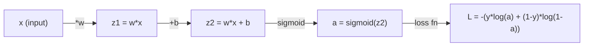
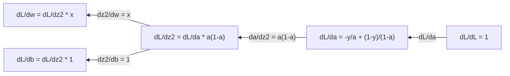
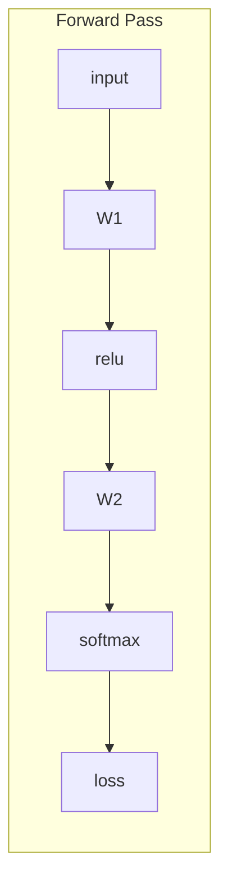
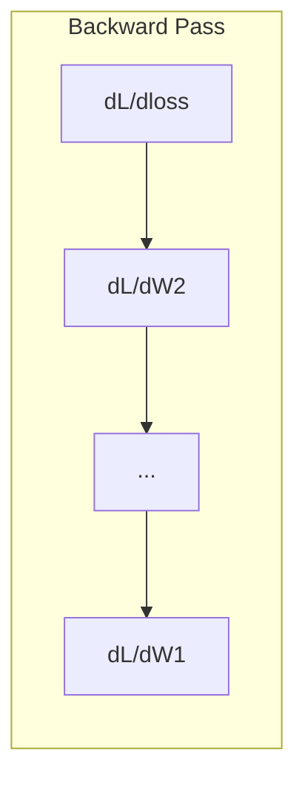

# 機械学習のための微積分

> 導関数は「どちらが下り坂か」を教えてくれる。ニューラルネットワークが学習するために必要なのはそれだけだ。

**タイプ:** 学習
**言語:** Python
**前提条件:** フェーズ1、レッスン01〜03
**所要時間:** 約60分

## 学習目標

- よく使われるML関数（x^2、シグモイド、クロスエントロピー）の数値微分と解析的微分を計算する
- 損失関数を1Dおよび2Dで最小化する勾配降下法をゼロから実装する
- 線形回帰モデルの勾配を導出し、手動の重み更新で訓練する
- ヘッセ行列、テイラー級数近似、および最適化手法との関係を説明する

## 問題の背景

何百万もの重みを持つニューラルネットワークがある。各重みはつまみのようなものだ。モデルが少しでも間違いを減らすために、すべてのつまみをどの方向に回せばいいかを求める必要がある。微積分はその方向を教えてくれる。

微積分がなければ、ニューラルネットワークの訓練はランダムな変更を試してうまくいくことを祈るしかない。導関数を使えば、各重みが誤差にどう影響するかが正確にわかる。毎回、すべてのつまみを正しい方向に回せる。

## 概念の解説

### 導関数とは何か？

導関数は変化率を測る。関数 y = f(x) において、導関数 f'(x) は「x をわずかに変化させたとき、y はどれだけ変化するか？」を教えてくれる。

幾何学的には、導関数はある点における接線の傾きだ。

**f(x) = x^2:**

| x | f(x) | f'(x) (傾き) |
|---|------|---------------|
| 0 | 0    | 0 (平坦、底にいる) |
| 1 | 1    | 2 |
| 2 | 4    | 4 (この点における接線の傾き) |
| 3 | 9    | 6 |

x=2 では傾きは 4 だ。x をわずかに右に動かすと、y はその約 4 倍の量だけ増加する。x=0 では傾きは 0 だ。ボウルの底にいる。

形式的な定義：

```
f'(x) = lim   f(x + h) - f(x)
        h->0  -----------------
                     h
```

コードでは極限を省略して、非常に小さな h を使う。それが数値微分だ。

### 偏微分：1変数ずつ

実際の関数は多くの入力を持つ。ニューラルネットワークの損失は数千の重みに依存する。偏微分は1つの変数以外をすべて定数と見なして、その1つについて微分を取る。

```
f(x, y) = x^2 + 3xy + y^2

df/dx = 2x + 3y     (y を定数として扱う)
df/dy = 3x + 2y     (x を定数として扱う)
```

各偏微分は「この1つの重みだけを少し変化させたとき、損失はどう変わるか？」という問いに答える。

### 勾配：すべての偏微分のベクトル

勾配はすべての偏微分を1つのベクトルにまとめたものだ。関数 f(x, y, z) の勾配は：

```
grad f = [ df/dx, df/dy, df/dz ]
```

勾配は最も急な上り方向を指す。関数を最小化するには、逆方向に進む。

**f(x,y) = x^2 + y^2 の等高線プロット：**

この関数は同心円を等高線とするボウル形状を形成する。最小値は (0, 0) にある。

| 点 | grad f | -grad f（降下方向） |
|-------|--------|----------------------------|
| (1, 1) | [2, 2]（上り方向、最小値から遠ざかる） | [-2, -2]（下り方向、最小値に向かう） |
| (0, 0) | [0, 0]（平坦、最小値にいる） | [0, 0] |

これが勾配降下法を図で表したものだ。勾配を計算し、符号を反転させ、一歩進む。

### 最適化との関係

ニューラルネットワークの訓練は最適化だ。モデルがどれだけ間違っているかを測る損失関数 L(w1, w2, ..., wn) があり、それを最小化したい。

```
勾配降下法の更新則：

  w_new = w_old - learning_rate * dL/dw

すべての重みに対して：
  1. その重みに関する損失の偏微分を計算する
  2. 重みからその小さな倍数を引く
  3. 繰り返す
```

学習率はステップサイズを制御する。大きすぎると行き過ぎる。小さすぎると収束が遅い。

**損失ランドスケープ（1Dスライス）：**

損失関数 L(w) は重み w が変化するにつれてピークと谷を持つ曲線を形成する。

| 特徴 | 説明 |
|---------|-------------|
| 大域的最小値 | 曲線全体で最も低い点 -- 最良の解 |
| 局所的最小値 | 近傍よりは低いが全体で最も低いわけではない谷 |
| 傾き | 勾配降下法はどの出発点からでも傾きに沿って下る |

勾配降下法は傾きに沿って下る。局所的最小値にはまることもあるが、高次元空間（何百万もの重み）では実際にはほとんど問題にならない。

### 数値微分と解析的微分

導関数を計算する方法は2つある。

解析的：微積分の規則を手で適用する。f(x) = x^2 の場合、導関数は f'(x) = 2x だ。正確で速い。

数値的：定義を使って近似する。小さな h に対して f(x+h) と f(x-h) を計算し、差を使う。

```
数値微分（中心差分）：

f'(x) ~= f(x + h) - f(x - h)
          -----------------------
                  2h

h = 0.0001 が実際にはうまく機能する
```

数値微分は遅いが任意の関数に使える。解析的微分は速いが式を導出する必要がある。ニューラルネットワークフレームワークは第3の方法である自動微分を使い、正確な導関数を機械的に計算する。フェーズ3でそれを見ることになる。

### 簡単な関数の手による微分

これらはMLで何度も見ることになる導関数だ。

```
Function        Derivative       Used in
--------        ----------       -------
f(x) = x^2     f'(x) = 2x      Loss functions (MSE)
f(x) = wx + b  f'(w) = x        Linear layer (gradient w.r.t. weight)
                f'(b) = 1        Linear layer (gradient w.r.t. bias)
                f'(x) = w        Linear layer (gradient w.r.t. input)
f(x) = e^x     f'(x) = e^x     Softmax, attention
f(x) = ln(x)   f'(x) = 1/x     Cross-entropy loss
f(x) = 1/(1+e^-x)  f'(x) = f(x)(1-f(x))   Sigmoid activation
```

f(x) = x^2 の場合：

```
f(x) = x^2    f'(x) = 2x

  x    f(x)   f'(x)   meaning
  -2    4      -4      slope tilts left (decreasing)
  -1    1      -2      slope tilts left (decreasing)
   0    0       0      flat (minimum!)
   1    1       2      slope tilts right (increasing)
   2    4       4      slope tilts right (increasing)
```

f(w) = wx + b で x=3, b=1 の場合：

```
f(w) = 3w + 1    f'(w) = 3

The derivative with respect to w is just x.
If x is big, a small change in w causes a big change in output.
```

### 連鎖律

関数が合成されているとき、連鎖律が微分の方法を教えてくれる。

```
If y = f(g(x)), then dy/dx = f'(g(x)) * g'(x)

Example: y = (3x + 1)^2
  outer: f(u) = u^2       f'(u) = 2u
  inner: g(x) = 3x + 1    g'(x) = 3
  dy/dx = 2(3x + 1) * 3 = 6(3x + 1)
```

ニューラルネットワークは関数の連鎖だ：入力 -> 線形 -> 活性化 -> 線形 -> 活性化 -> 損失。バックプロパゲーションは出力から入力に向けて繰り返し適用される連鎖律だ。それがアルゴリズム全体だ。

### ヘッセ行列

勾配は傾きを教えてくれる。ヘッセ行列は曲率を教えてくれる。

ヘッセ行列は2階偏微分の行列だ。関数 f(x1, x2, ..., xn) において、ヘッセ行列の (i, j) 成分は：

```
H[i][j] = d^2f / (dx_i * dx_j)
```

2変数関数 f(x, y) の場合：

```
H = | d^2f/dx^2    d^2f/dxdy |
    | d^2f/dydx    d^2f/dy^2 |
```

**臨界点（勾配=0の点）でのヘッセ行列の意味：**

| ヘッセ行列の性質 | 意味 | 曲面の例 |
|-----------------|---------|-----------------|
| 正定値（すべての固有値 > 0） | 局所的最小値 | 上向きのボウル |
| 負定値（すべての固有値 < 0） | 局所的最大値 | 下向きのボウル |
| 不定値（混合した固有値） | 鞍点 | 馬の鞍形状 |

**例：** f(x, y) = x^2 - y^2（鞍型関数）

```
df/dx = 2x       df/dy = -2y
d^2f/dx^2 = 2    d^2f/dy^2 = -2    d^2f/dxdy = 0

H = | 2   0 |
    | 0  -2 |

Eigenvalues: 2 and -2 (one positive, one negative)
--> Saddle point at (0, 0)
```

f(x, y) = x^2 + y^2（ボウル型）との比較：

```
H = | 2  0 |
    | 0  2 |

Eigenvalues: 2 and 2 (both positive)
--> Local minimum at (0, 0)
```

**MLにおけるヘッセ行列の重要性：**

ニュートン法はヘッセ行列を使って、勾配降下法よりも優れた最適化ステップを取る。傾きに従うだけでなく、曲率を考慮する：

```
Newton's update:    w_new = w_old - H^(-1) * gradient
Gradient descent:   w_new = w_old - lr * gradient
```

ニュートン法はヘッセ行列が勾配を「再スケーリング」するため速く収束する -- 急な方向は小さなステップ、平坦な方向は大きなステップになる。

注意点：N個のパラメータを持つニューラルネットワークでは、ヘッセ行列は N x N になる。100万個のパラメータを持つモデルには1兆エントリの行列が必要になる。だから近似を使う。

| 方法 | 使うもの | コスト | 収束速度 |
|--------|-------------|------|-------------|
| 勾配降下法 | 1階微分のみ | 1ステップあたり O(N) | 遅い（線形） |
| ニュートン法 | 完全なヘッセ行列 | 1ステップあたり O(N^3) | 速い（二次） |
| L-BFGS | 勾配履歴からの近似ヘッセ行列 | 1ステップあたり O(N) | 中程度（超線形） |
| Adam | パラメータごとの適応的学習率（対角ヘッセ行列近似） | 1ステップあたり O(N) | 中程度 |
| 自然勾配 | Fisher情報行列（統計的ヘッセ行列） | 1ステップあたり O(N^2) | 速い |

実際には、Adam が深層学習のデフォルトの最適化手法だ。パラメータごとの勾配の移動平均と分散を追跡することで、2次の情報を安価に近似する。

### テイラー級数近似

任意の滑らかな関数は局所的に多項式で近似できる：

```
f(x + h) = f(x) + f'(x)*h + (1/2)*f''(x)*h^2 + (1/6)*f'''(x)*h^3 + ...
```

含める項が多いほど近似が良くなるが、それは点 x の近くでのみ有効だ。

**MLにおけるテイラー級数の重要性：**

- **1次テイラー = 勾配降下法。** f(x + h) ~ f(x) + f'(x)*h を使うとき、線形近似を行っている。勾配降下法はこの線形モデルを最小化して h = -lr * f'(x) を選ぶ。

- **2次テイラー = ニュートン法。** f(x + h) ~ f(x) + f'(x)*h + (1/2)*f''(x)*h^2 を使うと二次モデルが得られる。最小化すると h = -f'(x)/f''(x) -- ニュートンのステップになる。

- **損失関数の設計。** MSE とクロスエントロピーは滑らかで、テイラー展開が well-behaved だ。これは偶然ではない。滑らかな損失は最適化を予測可能にする。

```
Approximation order    What it captures    Optimization method
-------------------    -----------------   -------------------
0th order (constant)   Just the value      Random search
1st order (linear)     Slope               Gradient descent
2nd order (quadratic)  Curvature           Newton's method
Higher orders          Finer structure     Rarely used in ML
```

重要な洞察：すべての勾配ベースの最適化は、実際には損失関数を局所的に近似してその近似の最小値にステップすることだ。

### MLにおける積分

導関数は変化率を教えてくれる。積分は累積を計算する -- 曲線の下の面積だ。

MLでは積分を手で計算することはほとんどないが、概念はいたるところにある：

**確率。** 密度 p(x) を持つ連続確率変数に対して：
```
P(a < X < b) = integral from a to b of p(x) dx
```
a と b の間の確率密度曲線の下の面積が、その範囲に入る確率だ。

**期待値。** 確率で重み付けされた平均的な結果：
```
E[f(X)] = integral of f(x) * p(x) dx
```
データ分布上の期待損失は積分だ。訓練はその経験的近似を最小化する。

**KLダイバージェンス。** 2つの分布の違いを測る：
```
KL(p || q) = integral of p(x) * log(p(x) / q(x)) dx
```
VAE、知識蒸留、ベイズ推論で使われる。

**正規化定数。** ベイズ推論では：
```
p(w | data) = p(data | w) * p(w) / integral of p(data | w) * p(w) dw
```
分母はすべての可能なパラメータ値にわたる積分だ。これはしばしば扱いにくいため、MCMC や変分推論などの近似を使う。

| 積分の概念 | MLでの登場場面 |
|-----------------|----------------------|
| 曲線の下の面積 | 密度関数からの確率 |
| 期待値 | 損失関数、リスク最小化 |
| KLダイバージェンス | VAE、方策最適化、蒸留 |
| 正規化 | ベイズ事後分布、ソフトマックスの分母 |
| 周辺尤度 | モデル比較、証拠下限（ELBO） |

### 計算グラフにおける多変数連鎖律

連鎖律はスカラー関数の一列に適用されるだけではない。ニューラルネットワークでは変数が分岐し合流する。以下は単純なフォワードパスを通る導関数の流れだ：



バックワードパスは右から左に勾配を計算する：



各矢印は局所的な導関数を掛ける。任意のパラメータの勾配は、損失からそのパラメータへのパス上のすべての局所的導関数の積だ。パスが分岐・合流する場合、寄与を足し合わせる（多変数連鎖律）。

バックプロパゲーションはこれだけだ：出力から入力へ、計算グラフを通じて連鎖律を組織的に適用する。

### ヤコビアン行列

関数がベクトルをベクトルに写像する場合（ニューラルネットワーク層のように）、その導関数は行列になる。ヤコビアンはすべての出力のすべての入力に関する偏微分を含む。

f: R^n -> R^m に対して、ヤコビアン J は m x n 行列だ：

| | x1 | x2 | ... | xn |
|---|---|---|---|---|
| f1 | df1/dx1 | df1/dx2 | ... | df1/dxn |
| f2 | df2/dx1 | df2/dx2 | ... | df2/dxn |
| ... | ... | ... | ... | ... |
| fm | dfm/dx1 | dfm/dx2 | ... | dfm/dxn |

ニューラルネットワークのヤコビアンを手で計算することはない。PyTorch が処理してくれる。しかし、その存在を知ることでバックプロパゲーションの形状を理解しやすくなる：層が R^n を R^m に写像する場合、そのヤコビアンは m x n だ。勾配はこの行列の転置を通じて逆向きに流れる。

### ニューラルネットワークへの重要性

ニューラルネットワークのすべての重みは勾配を受け取る。勾配はその重みをどう調整して損失を減らすかを教えてくれる。





各重みの更新：
- `W1 = W1 - lr * dL/dW1`
- `W2 = W2 - lr * dL/dW2`

フォワードパスは予測と損失を計算する。バックワードパスはすべての重みに関する損失の勾配を計算する。そして各重みが下り坂へ小さな一歩を踏む。これを何百万回も繰り返す。それが深層学習だ。

## 実装してみよう

### ステップ1：数値微分をゼロから

```python
def numerical_derivative(f, x, h=1e-7):
    return (f(x + h) - f(x - h)) / (2 * h)

def f(x):
    return x ** 2

for x in [-2, -1, 0, 1, 2]:
    numerical = numerical_derivative(f, x)
    analytical = 2 * x
    print(f"x={x:2d}  f'(x) numerical={numerical:.6f}  analytical={analytical:.1f}")
```

数値微分は解析的な値と多くの小数点以下の桁まで一致する。

### ステップ2：偏微分と勾配

```python
def numerical_gradient(f, point, h=1e-7):
    gradient = []
    for i in range(len(point)):
        point_plus = list(point)
        point_minus = list(point)
        point_plus[i] += h
        point_minus[i] -= h
        partial = (f(point_plus) - f(point_minus)) / (2 * h)
        gradient.append(partial)
    return gradient

def f_multi(point):
    x, y = point
    return x**2 + 3*x*y + y**2

grad = numerical_gradient(f_multi, [1.0, 2.0])
print(f"Numerical gradient at (1,2): {[f'{g:.4f}' for g in grad]}")
print(f"Analytical gradient at (1,2): [2*1+3*2, 3*1+2*2] = [{2*1+3*2}, {3*1+2*2}]")
```

### ステップ3：f(x) = x^2 の最小値を勾配降下法で求める

```python
x = 5.0
lr = 0.1
for step in range(20):
    grad = 2 * x
    x = x - lr * grad
    print(f"step {step:2d}  x={x:8.4f}  f(x)={x**2:10.6f}")
```

x=5 から始めて、各ステップで x=0（最小値）に近づく。

### ステップ4：2D関数の勾配降下法

```python
def f_2d(point):
    x, y = point
    return x**2 + y**2

point = [4.0, 3.0]
lr = 0.1
for step in range(30):
    grad = numerical_gradient(f_2d, point)
    point = [p - lr * g for p, g in zip(point, grad)]
    loss = f_2d(point)
    if step % 5 == 0 or step == 29:
        print(f"step {step:2d}  point=({point[0]:7.4f}, {point[1]:7.4f})  f={loss:.6f}")
```

### ステップ5：数値微分と解析的微分の比較

```python
import math

test_functions = [
    ("x^2",      lambda x: x**2,          lambda x: 2*x),
    ("x^3",      lambda x: x**3,          lambda x: 3*x**2),
    ("sin(x)",   lambda x: math.sin(x),   lambda x: math.cos(x)),
    ("e^x",      lambda x: math.exp(x),   lambda x: math.exp(x)),
    ("1/x",      lambda x: 1/x,           lambda x: -1/x**2),
]

x = 2.0
print(f"{'Function':<12} {'Numerical':>12} {'Analytical':>12} {'Error':>12}")
print("-" * 50)
for name, f, df in test_functions:
    num = numerical_derivative(f, x)
    ana = df(x)
    err = abs(num - ana)
    print(f"{name:<12} {num:12.6f} {ana:12.6f} {err:12.2e}")
```

### ステップ6：ヘッセ行列の数値計算

```python
def hessian_2d(f, x, y, h=1e-5):
    fxx = (f(x + h, y) - 2 * f(x, y) + f(x - h, y)) / (h ** 2)
    fyy = (f(x, y + h) - 2 * f(x, y) + f(x, y - h)) / (h ** 2)
    fxy = (f(x + h, y + h) - f(x + h, y - h) - f(x - h, y + h) + f(x - h, y - h)) / (4 * h ** 2)
    return [[fxx, fxy], [fxy, fyy]]

def saddle(x, y):
    return x ** 2 - y ** 2

def bowl(x, y):
    return x ** 2 + y ** 2

H_saddle = hessian_2d(saddle, 0.0, 0.0)
H_bowl = hessian_2d(bowl, 0.0, 0.0)
print(f"Saddle Hessian: {H_saddle}")  # [[2, 0], [0, -2]] -- mixed signs
print(f"Bowl Hessian:   {H_bowl}")    # [[2, 0], [0, 2]]  -- both positive
```

鞍型関数のヘッセ行列は固有値 2 と -2（符号が混在、鞍点を確認）を持つ。ボウルは固有値 2 と 2（両方正、最小値を確認）を持つ。

### ステップ7：テイラー近似の実際

```python
import math

def taylor_approx(f, f_prime, f_double_prime, x0, h, order=2):
    result = f(x0)
    if order >= 1:
        result += f_prime(x0) * h
    if order >= 2:
        result += 0.5 * f_double_prime(x0) * h ** 2
    return result

x0 = 0.0
for h in [0.1, 0.5, 1.0, 2.0]:
    true_val = math.sin(h)
    t1 = taylor_approx(math.sin, math.cos, lambda x: -math.sin(x), x0, h, order=1)
    t2 = taylor_approx(math.sin, math.cos, lambda x: -math.sin(x), x0, h, order=2)
    print(f"h={h:.1f}  sin(h)={true_val:.4f}  order1={t1:.4f}  order2={t2:.4f}")
```

x0=0 の近くでは、sin(x) ~ x（1次テイラー）。近似は小さな h に対しては優れているが、大きな h では崩れる。これが勾配降下法が小さな学習率で最もうまく機能する理由だ -- 各ステップが線形近似が正確であると仮定している。

### ステップ8：ニューラルネットワークへの重要性

```python
import random

random.seed(42)

w = random.gauss(0, 1)
b = random.gauss(0, 1)
lr = 0.01

xs = [1.0, 2.0, 3.0, 4.0, 5.0]
ys = [3.0, 5.0, 7.0, 9.0, 11.0]

for epoch in range(200):
    total_loss = 0
    dw = 0
    db = 0
    for x, y in zip(xs, ys):
        pred = w * x + b
        error = pred - y
        total_loss += error ** 2
        dw += 2 * error * x
        db += 2 * error
    dw /= len(xs)
    db /= len(xs)
    total_loss /= len(xs)
    w -= lr * dw
    b -= lr * db
    if epoch % 40 == 0 or epoch == 199:
        print(f"epoch {epoch:3d}  w={w:.4f}  b={b:.4f}  loss={total_loss:.6f}")

print(f"\nLearned: y = {w:.2f}x + {b:.2f}")
print(f"Actual:  y = 2x + 1")
```

すべての勾配ベースの訓練ループはこのパターンに従う：予測し、損失を計算し、勾配を計算し、重みを更新する。

## 使ってみよう

NumPy を使えば、同じ操作がより速く簡潔になる：

```python
import numpy as np

x = np.array([1, 2, 3, 4, 5], dtype=float)
y = np.array([3, 5, 7, 9, 11], dtype=float)

w, b = np.random.randn(), np.random.randn()
lr = 0.01

for epoch in range(200):
    pred = w * x + b
    error = pred - y
    loss = np.mean(error ** 2)
    dw = np.mean(2 * error * x)
    db = np.mean(2 * error)
    w -= lr * dw
    b -= lr * db

print(f"Learned: y = {w:.2f}x + {b:.2f}")
```

勾配降下法をゼロから構築した。PyTorch は勾配計算を自動化するが、更新ループは全く同じだ。

## 演習

1. `numerical_derivative` を2回呼び出す `numerical_second_derivative(f, x)` を実装する。x=2 での x^3 の2階微分が 12 であることを確認する。
2. 勾配降下法を使って f(x, y) = (x - 3)^2 + (y + 1)^2 の最小値を求める。(0, 0) から始める。答えは (3, -1) に収束するはずだ。
3. 勾配降下ループにモメンタムを追加する：過去の勾配を累積する速度ベクトルを維持する。f(x) = x^4 - 3x^2 でモメンタムありとなしの収束速度を比較する。

## 重要な用語

| 用語 | よく言われること | 実際の意味 |
|------|----------------|----------------------|
| 導関数 | "傾き" | ある点での関数の変化率。入力の単位変化あたり出力がどれだけ変わるかを教える。 |
| 偏微分 | "1変数の導関数" | 他のすべての変数を定数に保ちながら1つの変数に関して取る導関数。 |
| 勾配 | "最も急な上り方向" | すべての偏微分のベクトル。関数を最も速く増加させる方向を指す。 |
| 勾配降下法 | "下り坂に進む" | パラメータから勾配（学習率倍）を引いて損失を減らす。ニューラルネットワーク訓練の核心。 |
| 学習率 | "ステップサイズ" | 各勾配降下ステップの大きさを制御するスカラー。大きすぎると発散する。小さすぎると収束が遅い。 |
| 連鎖律 | "導関数を掛け合わせる" | 合成関数を微分するための規則：df/dx = df/dg * dg/dx。バックプロパゲーションの数学的基礎。 |
| ヤコビアン | "導関数の行列" | 関数がベクトルをベクトルに写像するとき、ヤコビアンは出力の入力に関するすべての偏微分の行列。 |
| 数値微分 | "有限差分" | 近くの2点で関数を評価してその間の傾きを計算することで導関数を近似する方法。 |
| バックプロパゲーション | "逆モード自動微分" | 連鎖律を使って出力から入力へ層ごとに勾配を計算する。ニューラルネットワークの学習方法。 |
| ヘッセ行列 | "2階微分の行列" | すべての2階偏微分の行列。関数の曲率を表す。臨界点での正定値ヘッセ行列は局所的最小値を意味する。 |
| テイラー級数 | "多項式近似" | 導関数を使って点の近くで関数を近似する：f(x+h) ~ f(x) + f'(x)h + (1/2)f''(x)h^2 + ...。勾配降下法とニュートン法がなぜ機能するかを理解するための基礎。 |
| 積分 | "曲線の下の面積" | ある範囲にわたる量の累積。MLでは積分が確率、期待値、KLダイバージェンスを定義する。 |

## さらに学ぶために

- [3Blue1Brown: Essence of Calculus](https://www.3blue1brown.com/topics/calculus) - 導関数、積分、連鎖律の視覚的直感
- [Stanford CS231n: Backpropagation](https://cs231n.github.io/optimization-2/) - ニューラルネットワーク層を通じた勾配の流れ
