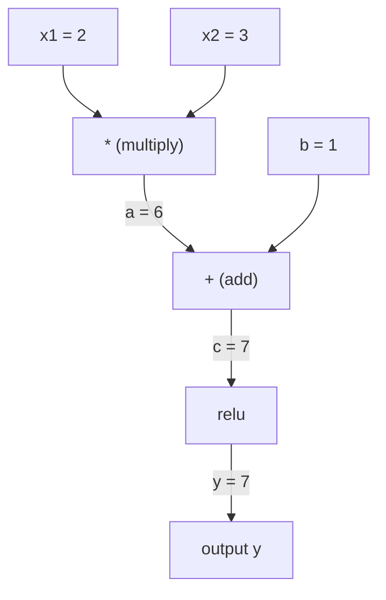
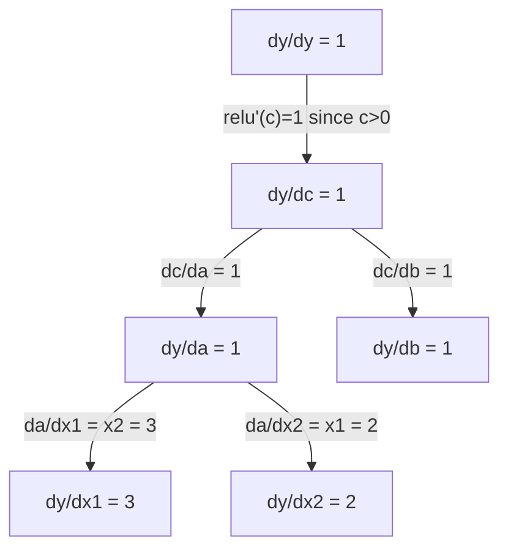

# 連鎖律と自動微分

> 連鎖律は、学習するすべてのニューラルネットワークを動かすエンジンである。

**タイプ:** 構築
**言語:** Python
**前提条件:** フェーズ1、レッスン04（導関数と勾配）
**所要時間:** 約90分

## 学習目標

- 演算を記録し、逆モード自動微分で勾配を計算する最小限のオートグラッドエンジン（Value クラス）を構築する
- トポロジカルソートを使って計算グラフの順伝播と逆伝播を実装する
- スクラッチから作ったオートグラッドエンジンのみを使って、XOR 問題を解く多層パーセプトロンを構築・学習する
- 数値的な有限差分に対する勾配チェックを使って自動微分の正確さを検証する

## 問題

単純な関数の導関数は計算できる。しかしニューラルネットワークは単純な関数ではない。行列積、バイアスの加算、活性化関数の適用、再度の行列積、ソフトマックス、クロスエントロピー損失といった、何百もの関数が合成されている。出力は関数の関数の関数である。

ネットワークを学習させるには、すべての重みに対する損失の勾配が必要だ。数百万のパラメータに対して手計算するのは不可能である。数値的に（有限差分で）計算するのは遅すぎる。

連鎖律が数学を与え、自動微分がアルゴリズムを与える。この二つを組み合わせると、1回の順伝播に比例する時間で、任意の関数合成に対して厳密な勾配を計算できる。

これが PyTorch、TensorFlow、JAX の仕組みである。あなたはこれの小型版をスクラッチから構築する。

## 概念

### 連鎖律

`y = f(g(x))` のとき、`y` の `x` に対する導関数は次のようになる：

```
dy/dx = dy/dg * dg/dx = f'(g(x)) * g'(x)
```

連鎖に沿って導関数を掛け合わせる。各リンクがその局所的な導関数を提供する。

例：`y = sin(x^2)`

```
g(x) = x^2       g'(x) = 2x
f(g) = sin(g)     f'(g) = cos(g)

dy/dx = cos(x^2) * 2x
```

さらに深い合成では、連鎖が伸びる：

```
y = f(g(h(x)))

dy/dx = f'(g(h(x))) * g'(h(x)) * h'(x)
```

ニューラルネットワークのすべての層は、この連鎖の1つのリンクである。

### 計算グラフ

計算グラフは連鎖律を視覚化する。すべての演算がノードになる。データはグラフを順方向に流れる。勾配は逆方向に流れる。

**順伝播（値の計算）：**



**逆伝播（勾配の計算）：**



逆伝播は、すべてのノードで連鎖律を適用し、出力から入力へと勾配を伝播する。

### 順モードと逆モード

グラフを通じて連鎖律を適用する方法は2通りある。

**順モード**は入力から始まり、導関数を前方に伝播する。`dx/dx = 1` を計算し、各演算を通じて伝播させる。入力が少なく出力が多い場合に適している。

```
Forward mode: seed dx/dx = 1, propagate forward

  x = 2       (dx/dx = 1)
  a = x^2     (da/dx = 2x = 4)
  y = sin(a)  (dy/dx = cos(a) * da/dx = cos(4) * 4 = -2.615)
```

**逆モード**は出力から始まり、勾配を後方に引き戻す。`dy/dy = 1` を計算し、各演算を逆順に伝播させる。入力が多く出力が少ない場合に適している。

```
Reverse mode: seed dy/dy = 1, propagate backward

  y = sin(a)  (dy/dy = 1)
  a = x^2     (dy/da = cos(a) = cos(4) = -0.654)
  x = 2       (dy/dx = dy/da * da/dx = -0.654 * 4 = -2.615)
```

ニューラルネットワークには数百万の入力（重み）と1つの出力（損失）がある。逆モードは1回の逆伝播ですべての勾配を計算する。これが誤差逆伝播法が逆モードを使う理由である。

| モード | シード | 方向 | 適している場合 |
|------|------|-----------|-----------|
| 順モード | `dx_i/dx_i = 1` | 入力から出力 | 入力が少なく、出力が多い |
| 逆モード | `dy/dy = 1` | 出力から入力 | 入力が多く、出力が少ない（ニューラルネット） |

### 順モードのための双対数

順モードは双対数を使って優雅に実装できる。双対数は `a + b*epsilon`（`epsilon^2 = 0`）の形をとる。

```
Dual number: (value, derivative)

(2, 1) means: value is 2, derivative w.r.t. x is 1

Arithmetic rules:
  (a, a') + (b, b') = (a+b, a'+b')
  (a, a') * (b, b') = (a*b, a'*b + a*b')
  sin(a, a')         = (sin(a), cos(a)*a')
```

入力変数の導関数を1でシードする。導関数はすべての演算を通じて自動的に伝播する。

### オートグラッドエンジンの構築

オートグラッドエンジンには3つのものが必要だ：

1. **値のラッピング。** すべての数値を、その値と勾配を格納するオブジェクトでラップする。
2. **グラフの記録。** すべての演算が入力と局所的な勾配関数を記録する。
3. **逆伝播。** グラフをトポロジカルソートし、逆順にたどりながら各ノードで連鎖律を適用する。

これがまさに PyTorch の `autograd` が行っていることだ。`torch.Tensor` クラスは値をラップし、`requires_grad=True` のときに演算を記録し、`.backward()` を呼び出すと勾配を計算する。

### PyTorch Autograd の内部動作

PyTorch のコードを書くとき：

```python
x = torch.tensor(2.0, requires_grad=True)
y = x ** 2 + 3 * x + 1
y.backward()
print(x.grad)  # 7.0 = 2*x + 3 = 2*2 + 3
```

PyTorch は内部で：

1. `requires_grad=True` の `x` に対して `Tensor` ノードを作成する
2. すべての演算（`**`、`*`、`+`）が新しいノードを作成し、逆伝播関数を記録する
3. `y.backward()` が記録されたグラフを通じて逆モード自動微分をトリガーする
4. 各ノードの `grad_fn` が局所的な勾配を計算し、親ノードに渡す
5. 勾配は（置き換えではなく）加算によって `.grad` 属性に蓄積される

グラフは動的である（define-by-run）。順伝播のたびに新しいグラフが構築される。これが PyTorch がモデル内での制御フロー（if/else、ループ）をサポートしている理由だ。

## 構築する

### ステップ1：Value クラス

```python
class Value:
    def __init__(self, data, children=(), op=''):
        self.data = data
        self.grad = 0.0
        self._backward = lambda: None
        self._prev = set(children)
        self._op = op

    def __repr__(self):
        return f"Value(data={self.data:.4f}, grad={self.grad:.4f})"
```

すべての `Value` は数値データ、勾配（初期値はゼロ）、逆伝播関数、それを生成した子ノードへのポインタを格納する。

### ステップ2：勾配追跡付きの算術演算

```python
    def __add__(self, other):
        other = other if isinstance(other, Value) else Value(other)
        out = Value(self.data + other.data, (self, other), '+')
        def _backward():
            self.grad += out.grad
            other.grad += out.grad
        out._backward = _backward
        return out

    def __mul__(self, other):
        other = other if isinstance(other, Value) else Value(other)
        out = Value(self.data * other.data, (self, other), '*')
        def _backward():
            self.grad += other.data * out.grad
            other.grad += self.data * out.grad
        out._backward = _backward
        return out

    def relu(self):
        out = Value(max(0, self.data), (self,), 'relu')
        def _backward():
            self.grad += (1.0 if out.data > 0 else 0.0) * out.grad
        out._backward = _backward
        return out
```

各演算は、局所的な勾配を計算して上流の勾配（`out.grad`）を掛け合わせる方法を知るクロージャを作成する。`+=` は、ある値が複数の演算に使われる場合を処理する。

### ステップ3：逆伝播

```python
    def backward(self):
        topo = []
        visited = set()
        def build_topo(v):
            if v not in visited:
                visited.add(v)
                for child in v._prev:
                    build_topo(child)
                topo.append(v)
        build_topo(self)

        self.grad = 1.0
        for v in reversed(topo):
            v._backward()
```

トポロジカルソートにより、各ノードの勾配が子ノードに伝播する前に完全に計算されることが保証される。シード勾配は1.0（dy/dy = 1）である。

### ステップ4：完全なエンジンのための追加演算

基本的な Value クラスは加算、乗算、relu を処理する。実際のオートグラッドエンジンにはさらに多くが必要だ。ニューラルネットワークを構築するために必要な演算を示す：

```python
    def __neg__(self):
        return self * -1

    def __sub__(self, other):
        return self + (-other)

    def __radd__(self, other):
        return self + other

    def __rmul__(self, other):
        return self * other

    def __rsub__(self, other):
        return other + (-self)

    def __pow__(self, n):
        out = Value(self.data ** n, (self,), f'**{n}')
        def _backward():
            self.grad += n * (self.data ** (n - 1)) * out.grad
        out._backward = _backward
        return out

    def __truediv__(self, other):
        return self * (other ** -1) if isinstance(other, Value) else self * (Value(other) ** -1)

    def exp(self):
        import math
        e = math.exp(self.data)
        out = Value(e, (self,), 'exp')
        def _backward():
            self.grad += e * out.grad
        out._backward = _backward
        return out

    def log(self):
        import math
        out = Value(math.log(self.data), (self,), 'log')
        def _backward():
            self.grad += (1.0 / self.data) * out.grad
        out._backward = _backward
        return out

    def tanh(self):
        import math
        t = math.tanh(self.data)
        out = Value(t, (self,), 'tanh')
        def _backward():
            self.grad += (1 - t ** 2) * out.grad
        out._backward = _backward
        return out
```

**各演算が重要な理由：**

| 演算 | 逆伝播の規則 | 使用場面 |
|-----------|--------------|---------|
| `__sub__` | add + neg を再利用 | 損失計算（pred - target） |
| `__pow__` | n * x^(n-1) | 多項式活性化関数、MSE（error^2） |
| `__truediv__` | mul + pow(-1) を再利用 | 正規化、学習率スケーリング |
| `exp` | exp(x) * 上流 | ソフトマックス、対数尤度 |
| `log` | (1/x) * 上流 | クロスエントロピー損失、対数確率 |
| `tanh` | (1 - tanh^2) * 上流 | 古典的な活性化関数 |

巧妙な点：`__sub__` と `__truediv__` は既存の演算を使って定義されている。これらは、下層の add/mul/pow 演算を通じて連鎖律が合成されるため、正しい勾配を無償で得られる。

### ステップ5：スクラッチからのミニ MLP

完全な Value クラスがあれば、ニューラルネットワークを構築できる。PyTorch も NumPy も使わない。Value と連鎖律だけだ。

```python
import random

class Neuron:
    def __init__(self, n_inputs):
        self.w = [Value(random.uniform(-1, 1)) for _ in range(n_inputs)]
        self.b = Value(0.0)

    def __call__(self, x):
        act = sum((wi * xi for wi, xi in zip(self.w, x)), self.b)
        return act.tanh()

    def parameters(self):
        return self.w + [self.b]

class Layer:
    def __init__(self, n_inputs, n_outputs):
        self.neurons = [Neuron(n_inputs) for _ in range(n_outputs)]

    def __call__(self, x):
        return [n(x) for n in self.neurons]

    def parameters(self):
        return [p for n in self.neurons for p in n.parameters()]

class MLP:
    def __init__(self, sizes):
        self.layers = [Layer(sizes[i], sizes[i+1]) for i in range(len(sizes)-1)]

    def __call__(self, x):
        for layer in self.layers:
            x = layer(x)
        return x[0] if len(x) == 1 else x

    def parameters(self):
        return [p for layer in self.layers for p in layer.parameters()]
```

`Neuron` は `tanh(w1*x1 + w2*x2 + ... + b)` を計算する。`Layer` はニューロンのリストだ。`MLP` は層を積み重ねる。すべての重みは `Value` なので、`loss.backward()` を呼び出すとすべてのパラメータに勾配が伝播する。

**XOR での学習：**

```python
random.seed(42)
model = MLP([2, 4, 1])  # 2 inputs, 4 hidden neurons, 1 output

xs = [[0, 0], [0, 1], [1, 0], [1, 1]]
ys = [-1, 1, 1, -1]  # XOR pattern (using -1/1 for tanh)

for step in range(100):
    preds = [model(x) for x in xs]
    loss = sum((p - y) ** 2 for p, y in zip(preds, ys))

    for p in model.parameters():
        p.grad = 0.0
    loss.backward()

    lr = 0.05
    for p in model.parameters():
        p.data -= lr * p.grad

    if step % 20 == 0:
        print(f"step {step:3d}  loss = {loss.data:.4f}")

print("\nPredictions after training:")
for x, y in zip(xs, ys):
    print(f"  input={x}  target={y:2d}  pred={model(x).data:6.3f}")
```

これが micrograd だ。自動微分を使った、純粋な Python による完全なニューラルネットワーク学習ループ。すべての商用深層学習フレームワークは、大規模スケールで同じことをしている。

### ステップ6：勾配チェック

自動微分が正しいことをどう確認するか？数値的な導関数と比較する。これが勾配チェックだ。

```python
def gradient_check(build_expr, x_val, h=1e-7):
    x = Value(x_val)
    y = build_expr(x)
    y.backward()
    autodiff_grad = x.grad

    y_plus = build_expr(Value(x_val + h)).data
    y_minus = build_expr(Value(x_val - h)).data
    numerical_grad = (y_plus - y_minus) / (2 * h)

    diff = abs(autodiff_grad - numerical_grad)
    return autodiff_grad, numerical_grad, diff
```

複雑な式でテストする：

```python
def expr(x):
    return (x ** 3 + x * 2 + 1).tanh()

ad, num, diff = gradient_check(expr, 0.5)
print(f"Autodiff:  {ad:.8f}")
print(f"Numerical: {num:.8f}")
print(f"Difference: {diff:.2e}")
# Difference should be < 1e-5
```

勾配チェックは新しい演算を実装するときに不可欠だ。逆伝播にバグがあれば、数値チェックがそれを検出する。あらゆる本格的な深層学習実装は、開発中に勾配チェックを実行している。

**勾配チェックをいつ使うか：**

| 状況 | 勾配チェックすべきか？ |
|-----------|-------------------|
| オートグラッドに新しい演算を追加するとき | はい、常に |
| 収束しない学習ループをデバッグするとき | はい、まず勾配を確認する |
| 本番環境での学習 | いいえ、遅すぎる（パラメータごとに2回の順伝播） |
| オートグラッドコードのユニットテスト | はい、自動化する |

### ステップ7：手動計算との照合

```python
x1 = Value(2.0)
x2 = Value(3.0)
a = x1 * x2          # a = 6.0
b = a + Value(1.0)    # b = 7.0
y = b.relu()          # y = 7.0

y.backward()

print(f"y = {y.data}")          # 7.0
print(f"dy/dx1 = {x1.grad}")   # 3.0 (= x2)
print(f"dy/dx2 = {x2.grad}")   # 2.0 (= x1)
```

手動確認：`y = relu(x1*x2 + 1)`。`x1*x2 + 1 = 7 > 0` なので、relu は恒等関数となる。
`dy/dx1 = x2 = 3`。`dy/dx2 = x1 = 2`。エンジンの結果と一致する。

## 使ってみる

### PyTorch との照合

```python
import torch

x1 = torch.tensor(2.0, requires_grad=True)
x2 = torch.tensor(3.0, requires_grad=True)
a = x1 * x2
b = a + 1.0
y = torch.relu(b)
y.backward()

print(f"PyTorch dy/dx1 = {x1.grad.item()}")  # 3.0
print(f"PyTorch dy/dx2 = {x2.grad.item()}")  # 2.0
```

同じ勾配だ。数学が同じ（連鎖律による逆モード自動微分）なので、あなたのエンジンは PyTorch と同じ結果を計算する。

### より複雑な式

```python
a = Value(2.0)
b = Value(-3.0)
c = Value(10.0)
f = (a * b + c).relu()  # relu(2*(-3) + 10) = relu(4) = 4

f.backward()
print(f"df/da = {a.grad}")  # -3.0 (= b)
print(f"df/db = {b.grad}")  #  2.0 (= a)
print(f"df/dc = {c.grad}")  #  1.0
```

## 完成させる

このレッスンで生成されるもの：
- `outputs/skill-autodiff.md` -- オートグラッドシステムの構築とデバッグのためのスキル
- `code/autodiff.py` -- 拡張可能な最小限のオートグラッドエンジン

ここで構築した Value クラスは、フェーズ3のニューラルネットワーク学習ループの基盤となる。

## 演習

1. Value クラスに `__pow__` を追加して `x ** n` を計算できるようにする。`x=2` での `d/dx(x^3)` が `12.0` に等しいことを確認する。

2. 活性化関数として `tanh` を追加する。`tanh'(0) = 1` および `tanh'(2) = 0.0707`（近似値）であることを確認する。

3. 単一ニューロンの計算グラフを構築する：`y = relu(w1*x1 + w2*x2 + b)`。5つの勾配をすべて計算し、PyTorch と照合して確認する。

4. 双対数を使った順モード自動微分を実装する。`Dual` クラスを作成し、逆モードエンジンと同じ導関数が得られることを確認する。

## 重要用語

| 用語 | よく言われること | 実際の意味 |
|------|----------------|----------------------|
| 連鎖律 | 「導関数を掛け合わせる」 | 合成関数の導関数は、各関数の局所的な導関数の積に等しい（適切な点で評価する） |
| 計算グラフ | 「ネットワーク図」 | ノードが演算でエッジが値（順方向）または勾配（逆方向）を運ぶ有向非巡回グラフ |
| 順モード | 「導関数を前方に伝播する」 | 入力から出力へ導関数を伝播する自動微分。入力変数ごとに1回のパス。 |
| 逆モード | 「誤差逆伝播法」 | 出力から入力へ勾配を伝播する自動微分。出力変数ごとに1回のパス。 |
| オートグラッド | 「自動勾配」 | 値への演算を記録し、グラフを構築し、連鎖律によって厳密な勾配を計算するシステム |
| 双対数 | 「値プラス導関数」 | a + b*epsilon（epsilon^2 = 0）の形の数で、算術演算を通じて導関数情報を運ぶ |
| トポロジカルソート | 「依存関係順」 | すべてのノードがその依存関係の後に来るようにグラフノードを順序付けること。正しい勾配伝播に必要。 |
| 勾配累積 | 「置き換えではなく加算」 | ある値が複数の演算に入力される場合、その勾配はすべての入ってくる勾配寄与の合計となる |
| 動的グラフ | 「define by run」 | 順伝播のたびに再構築される計算グラフ。モデル内で Python の制御フローを可能にする（PyTorch スタイル） |
| 勾配チェック | 「数値的な検証」 | 正確さを検証するために、自動微分の勾配と数値的な有限差分の勾配を比較すること。デバッグに不可欠。 |
| MLP | 「多層パーセプトロン」 | 1つ以上の隠れ層を持つニューラルネットワーク。各ニューロンは重み付き和にバイアスを加え、活性化関数を適用する。 |
| ニューロン | 「重み付き和＋活性化」 | 基本単位：output = activation(w1*x1 + w2*x2 + ... + b)。重みとバイアスは学習可能なパラメータ。 |

## 参考資料

- [3Blue1Brown: Backpropagation calculus](https://www.youtube.com/watch?v=tIeHLnjs5U8) -- ニューラルネットワークにおける連鎖律の視覚的な説明
- [PyTorch Autograd mechanics](https://pytorch.org/docs/stable/notes/autograd.html) -- 実際のシステムの動作
- [Baydin et al., Automatic Differentiation in Machine Learning: a Survey](https://arxiv.org/abs/1502.05767) -- 包括的なリファレンス
