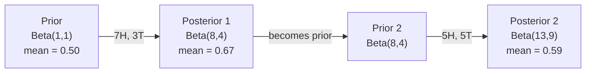

# ベイズの定理

> 確率とは何を期待するかの話だ。ベイズの定理とは何を学ぶかの話だ。

**タイプ:** 実装
**言語:** Python
**前提条件:** フェーズ1、レッスン06（確率の基礎）
**所要時間:** 約75分

## 学習目標

- 事前確率、尤度、証拠からベイズの定理を使って事後確率を計算する
- ラプラス平滑化と対数空間計算を用いたナイーブベイズテキスト分類器をゼロから構築する
- MLE と MAP 推定を比較し、MAP が L2 正則化に対応することを説明する
- A/Bテストのためにベータ二項共役事前分布を使った逐次ベイズ更新を実装する

## 問題

ある医療検査の精度は99%です。あなたは陽性でした。実際に病気である確率はどのくらいでしょうか？

多くの人は99%と答えます。実際の答えは病気がどれほど稀かによります。10,000人に1人が罹患している場合、陽性結果であっても実際に病気である確率は約1%にすぎません。残りの99%の陽性結果は、健康な人による偽陽性です。

これは引っかけ問題ではありません。これがベイズの定理です。スパムフィルター、医療診断、不確実性を定量化するあらゆる機械学習モデルが、まさにこの推論を使っています。信念から始まり、証拠を見て、更新します。

これを理解せずに ML システムを構築すると、モデルの出力を誤解し、不適切な閾値を設定し、過信した予測をリリースしてしまいます。

## 概念

### 同時確率からベイズへ

レッスン06で学んだように、条件付き確率は次のとおりです：

```
P(A|B) = P(A and B) / P(B)
```

対称的に：

```
P(B|A) = P(A and B) / P(A)
```

どちらの式も同じ分子 P(A and B) を持ちます。等値に設定して整理すると：

```
P(A and B) = P(A|B) * P(B) = P(B|A) * P(A)

したがって：

P(A|B) = P(B|A) * P(A) / P(B)
```

これがベイズの定理です。4つの量、1つの式。

### 4つの構成要素

| 構成要素 | 名称 | 意味 |
|------|------|---------------|
| P(A\|B) | 事後確率 | 証拠 B を見た後の A に関する更新された信念 |
| P(B\|A) | 尤度 | A が真である場合に証拠 B がどれほど確からしいか |
| P(A) | 事前確率 | 証拠を見る前の A に関する信念 |
| P(B) | 証拠 | あらゆる可能性の下で B を観測する全確率 |

証拠項 P(B) は正規化定数として機能します。全確率の法則を使って展開できます：

```
P(B) = P(B|A) * P(A) + P(B|not A) * P(not A)
```

### 医療検査の例

ある病気は10,000人に1人が罹患しています。検査の精度は99%（病人の99%を検出し、1%の確率で偽陽性を出す）。

```
P(sick)          = 0.0001     (事前確率: 病気は稀)
P(positive|sick) = 0.99       (尤度: 検査で検出される)
P(positive|healthy) = 0.01    (偽陽性率)

P(positive) = P(positive|sick) * P(sick) + P(positive|healthy) * P(healthy)
            = 0.99 * 0.0001 + 0.01 * 0.9999
            = 0.000099 + 0.009999
            = 0.010098

P(sick|positive) = P(positive|sick) * P(sick) / P(positive)
                 = 0.99 * 0.0001 / 0.010098
                 = 0.0098
                 = 0.98%
```

1%未満です。事前確率が支配的です。ある状態が稀な場合、精度の高い検査でもほとんど偽陽性を生み出します。これが医師が確認検査を行う理由です。

### スパムフィルターの例

「lottery」という単語を含むメールを受け取りました。スパムでしょうか？

```
P(spam)                = 0.3      (メールの30%がスパム)
P("lottery"|spam)      = 0.05     (スパムメールの5%が"lottery"を含む)
P("lottery"|not spam)  = 0.001    (正当なメールの0.1%が"lottery"を含む)

P("lottery") = 0.05 * 0.3 + 0.001 * 0.7
             = 0.015 + 0.0007
             = 0.0157

P(spam|"lottery") = 0.05 * 0.3 / 0.0157
                  = 0.955
                  = 95.5%
```

1つの単語が確率を30%から95.5%に変えます。実際のスパムフィルターは何百もの単語に対して同時にベイズを適用します。

### ナイーブベイズ：独立性の仮定

ナイーブベイズは、クラスが与えられたときにすべての特徴が条件付き独立であると仮定することで、これを複数の特徴に拡張します：

```
P(class | feature_1, feature_2, ..., feature_n)
  = P(class) * P(feature_1|class) * P(feature_2|class) * ... * P(feature_n|class)
    / P(feature_1, feature_2, ..., feature_n)
```

「ナイーブ」の部分は独立性の仮定です。テキストでは単語の出現は独立ではありません（"New" と "York" には相関があります）。しかし、分類器はクラスをランク付けするだけで、較正された確率を生成する必要がないため、実際には驚くほどうまく機能します。

分母はすべてのクラスで同じなので、省略して分子だけを比較できます：

```
score(class) = P(class) * product of P(feature_i | class)
```

最高スコアのクラスを選びます。

### 最尤推定（MLE）

訓練データから P(feature|class) をどのように得るか？カウントします。

```
P("free"|spam) = (number of spam emails containing "free") / (total spam emails)
```

これが MLE です：観測されたデータを最も確からしくするパラメータ値を選択します。尤度関数を最大化しており、離散カウントの場合は相対頻度に帰着します。

問題：訓練中にスパムに単語が一度も現れない場合、MLE は確率をゼロにします。未知の単語1つが積全体を台無しにします。ラプラス平滑化でこれを修正します：

```
P(word|class) = (count(word, class) + 1) / (total_words_in_class + vocabulary_size)
```

すべてのカウントに1を加えることで、確率が絶対にゼロにならないようにします。

### 最大事後確率推定（MAP）

MLE は問います：P(data|parameters) を最大化するパラメータは何か？

MAP は問います：P(parameters|data) を最大化するパラメータは何か？

ベイズの定理により：

```
P(parameters|data) proportional to P(data|parameters) * P(parameters)
```

MAP はパラメータ自体に事前分布を加えます。パラメータが小さくあるべきだと信じるなら、大きな値にペナルティを与える事前分布としてエンコードします。これは ML の L2 正則化と同一です。リッジ回帰の「リッジ」ペナルティは、文字通り重みに対するガウス事前分布です。

| 推定 | 最適化対象 | ML における同等物 |
|------------|-----------|---------------|
| MLE | P(data\|params) | 正則化なし訓練 |
| MAP | P(data\|params) * P(params) | L2 / L1 正則化 |

### ベイズ vs 頻度主義：実用的な違い

頻度主義者はパラメータを固定された未知数として扱います。「この実験を何度も繰り返したら、何が起こるか？」と問います。

ベイズ主義者はパラメータを分布として扱います。「観測したことを踏まえて、パラメータについて何を信じるか？」と問います。

ML システムを構築する上での実用的な違い：

| 側面 | 頻度主義 | ベイズ |
|--------|-------------|----------|
| 出力 | 点推定 | 値の分布 |
| 不確実性 | 信頼区間（手続きについて） | 信用区間（パラメータについて） |
| 少ないデータ | 過学習しやすい | 事前分布が正則化として機能 |
| 計算 | 通常は高速 | 多くの場合サンプリングが必要（MCMC） |

ほとんどの本番 ML は頻度主義です（SGD、点推定）。ベイズ手法は、較正された不確実性が必要な場合（医療的判断、安全クリティカルなシステム）やデータが少ない場合（few-shot 学習、コールドスタート）に真価を発揮します。

### ベイズ的思考が ML に重要な理由

つながりはアナロジーより深いものがあります：

**事前分布は正則化です。** 重みに対するガウス事前分布は L2 正則化です。ラプラス事前分布は L1 です。正則化項を追加するたびに、期待するパラメータ値についてベイズ的な主張をしていることになります。

**事後分布は不確実性です。** 1つの予測確率は、モデルがその推定にどれほど確信を持っているかを示しません。ベイズ手法は分布を与えます：「P(spam) は 0.8 から 0.95 の間にあると思う」。

**ベイズ更新はオンライン学習です。** 今日の事後分布が明日の事前分布になります。モデルが新しいデータを見ると、ゼロから再訓練する代わりに信念を逐次更新します。

**モデル比較はベイズ的です。** ベイズ情報量基準（BIC）、周辺尤度、ベイズ因子はすべて、過学習なしにモデルを選択するためにベイズ的推論を使います。

## 実装

### ステップ1：ベイズの定理関数

```python
def bayes(prior, likelihood, false_positive_rate):
    evidence = likelihood * prior + false_positive_rate * (1 - prior)
    posterior = likelihood * prior / evidence
    return posterior

result = bayes(prior=0.0001, likelihood=0.99, false_positive_rate=0.01)
print(f"P(sick|positive) = {result:.4f}")
```

### ステップ2：ナイーブベイズ分類器

```python
import math
from collections import defaultdict

class NaiveBayes:
    def __init__(self, smoothing=1.0):
        self.smoothing = smoothing
        self.class_counts = defaultdict(int)
        self.word_counts = defaultdict(lambda: defaultdict(int))
        self.class_word_totals = defaultdict(int)
        self.vocab = set()

    def train(self, documents, labels):
        for doc, label in zip(documents, labels):
            self.class_counts[label] += 1
            words = doc.lower().split()
            for word in words:
                self.word_counts[label][word] += 1
                self.class_word_totals[label] += 1
                self.vocab.add(word)

    def predict(self, document):
        words = document.lower().split()
        total_docs = sum(self.class_counts.values())
        vocab_size = len(self.vocab)
        best_class = None
        best_score = float("-inf")
        for cls in self.class_counts:
            score = math.log(self.class_counts[cls] / total_docs)
            for word in words:
                count = self.word_counts[cls].get(word, 0)
                total = self.class_word_totals[cls]
                score += math.log((count + self.smoothing) / (total + self.smoothing * vocab_size))
            if score > best_score:
                best_score = score
                best_class = cls
        return best_class
```

対数確率はアンダーフローを防ぎます。多くの小さな確率を掛け合わせると、浮動小数点で表現できないほど小さな数になります。対数確率を足し合わせることは数値的に安定しており、数学的に同等です。

### ステップ3：スパムデータで訓練

```python
train_docs = [
    "win free money now",
    "free lottery ticket winner",
    "claim your prize today free",
    "urgent offer free cash",
    "congratulations you won free",
    "meeting tomorrow at noon",
    "project update attached",
    "can we schedule a call",
    "quarterly report review",
    "lunch on thursday sounds good",
    "team standup notes attached",
    "please review the pull request",
]

train_labels = [
    "spam", "spam", "spam", "spam", "spam",
    "ham", "ham", "ham", "ham", "ham", "ham", "ham",
]

classifier = NaiveBayes()
classifier.train(train_docs, train_labels)

test_messages = [
    "free money waiting for you",
    "meeting rescheduled to friday",
    "you won a free prize",
    "please review the attached report",
]

for msg in test_messages:
    print(f"  '{msg}' -> {classifier.predict(msg)}")
```

### ステップ4：学習した確率を検査する

```python
def show_top_words(classifier, cls, n=5):
    vocab_size = len(classifier.vocab)
    total = classifier.class_word_totals[cls]
    probs = {}
    for word in classifier.vocab:
        count = classifier.word_counts[cls].get(word, 0)
        probs[word] = (count + classifier.smoothing) / (total + classifier.smoothing * vocab_size)
    sorted_words = sorted(probs.items(), key=lambda x: x[1], reverse=True)
    for word, prob in sorted_words[:n]:
        print(f"    {word}: {prob:.4f}")

print("\nTop spam words:")
show_top_words(classifier, "spam")
print("\nTop ham words:")
show_top_words(classifier, "ham")
```

## 活用する

Scikit-learn には本番対応のナイーブベイズ実装が含まれています：

```python
from sklearn.feature_extraction.text import CountVectorizer
from sklearn.naive_bayes import MultinomialNB
from sklearn.metrics import classification_report

vectorizer = CountVectorizer()
X_train = vectorizer.fit_transform(train_docs)
clf = MultinomialNB()
clf.fit(X_train, train_labels)

X_test = vectorizer.transform(test_messages)
predictions = clf.predict(X_test)
for msg, pred in zip(test_messages, predictions):
    print(f"  '{msg}' -> {pred}")
```

同じアルゴリズムです。CountVectorizer がトークン化と語彙の構築を処理します。MultinomialNB が平滑化と対数確率を内部で処理します。ゼロから実装したバージョンも同じことを40行で行っています。

## まとめ

ここで構築した NaiveBayes クラスは完全なパイプラインを示しています：トークン化、ラプラス平滑化による確率推定、対数空間での予測。`code/bayes.py` のコードは Python 標準ライブラリ以外の依存関係なしにエンドツーエンドで動作します。

### 共役事前分布

事前分布と事後分布が同じ分布族に属する場合、その事前分布は「共役」と呼ばれます。これによりベイズ更新が代数的にシンプルになり、数値積分なしに閉形式の事後分布が得られます。

| 尤度 | 共役事前分布 | 事後分布 | 例 |
|-----------|----------------|-----------|---------|
| ベルヌーイ | Beta(a, b) | Beta(a + successes, b + failures) | コインの偏り推定 |
| 正規（既知の分散） | Normal(mu_0, sigma_0) | Normal(加重平均, より小さい分散) | センサー較正 |
| ポアソン | Gamma(a, b) | Gamma(a + sum of counts, b + n) | 到着率のモデリング |
| 多項 | Dirichlet(alpha) | Dirichlet(alpha + counts) | トピックモデリング、言語モデル |

これが重要な理由：共役事前分布なしでは、事後分布を近似するためにモンテカルロサンプリングや変分推論が必要です。共役事前分布があれば、2つの数値を更新するだけです。

ベータ分布は実際に最もよく使われる共役事前分布です。Beta(a, b) は確率パラメータに対する信念を表します。平均は a/(a+b) です。a+b が大きいほど分布は集中（確信度が高い）します。

ベータ事前分布の特殊ケース：
- Beta(1, 1) = 一様分布。パラメータについて意見がない。
- Beta(10, 10) = 0.5 付近に集中。パラメータが 0.5 に近いと強く信じる。
- Beta(1, 10) = 0 に向かって歪む。パラメータが小さいと信じる。

更新ルールは非常にシンプルです：

```
Prior:     Beta(a, b)
Data:      s successes, f failures
Posterior: Beta(a + s, b + f)
```

積分なし。サンプリングなし。足し算だけ。

### 逐次ベイズ更新

ベイズ推論は本質的に逐次的です。今日の事後分布が明日の事前分布になります。これが実システムが過去のデータをすべて再処理せずに逐次学習する仕組みです。

具体例：コインが公平かどうかを推定する。

**1日目：データなし。**
Beta(1, 1) — 一様事前分布から始める。意見がない。
- 事前平均：0.5
- 事前分布は [0, 1] 全体にわたって平坦

**2日目：表が7回、裏が3回。**
事後分布 = Beta(1 + 7, 1 + 3) = Beta(8, 4)
- 事後平均：8/12 = 0.667
- 証拠はコインが表に偏っていることを示唆

**3日目：さらに表が5回、裏が5回。**
昨日の事後分布を今日の事前分布として使用。
事後分布 = Beta(8 + 5, 4 + 5) = Beta(13, 9)
- 事後平均：13/22 = 0.591
- バランスの取れた新データが推定を 0.5 に引き戻した



観測の順序は重要ではありません。Beta(1,1) を表12回、裏8回すべてで一度に更新すると Beta(13, 9) になり、同じ結果です。逐次更新とバッチ更新は数学的に同等です。しかし、逐次更新では生データを保存せずに各ステップで決定を下せます。

これが本番 ML システムにおけるオンライン学習の基盤です。バンディットのためのトンプソンサンプリング、逐次推薦システム、ストリーミング異常検知器はすべてこのパターンを使います。

### A/Bテストとの関係

A/Bテストは変装したベイズ推論です。

設定：2つのボタンの色をテストしています。バリアントA（青）とバリアントB（緑）。どちらがより多くのクリックを得るかを知りたい。

ベイズ A/Bテスト：

1. **事前分布。** 両バリアントを Beta(1, 1) から始める。事前の優先なし。
2. **データ。** バリアントA：1000回表示のうち50クリック。バリアントB：1000回表示のうち65クリック。
3. **事後分布。**
   - A: Beta(1 + 50, 1 + 950) = Beta(51, 951). 平均 = 0.051
   - B: Beta(1 + 65, 1 + 935) = Beta(66, 936). 平均 = 0.066
4. **判断。** P(B > A) — B の真のコンバージョン率が A より高い確率を計算。

P(B > A) を解析的に計算するのは難しいですが、モンテカルロで簡単になります：

```
1. Draw 100,000 samples from Beta(51, 951)  -> samples_A
2. Draw 100,000 samples from Beta(66, 936)  -> samples_B
3. P(B > A) = fraction of samples where B > A
```

P(B > A) > 0.95 なら、バリアントBをリリースします。0.05 から 0.95 の間なら、データを集め続けます。P(B > A) < 0.05 なら、バリアントAをリリースします。

頻度主義 A/Bテストに対する利点：
- 直接的な確率的主張が得られる：「Bの方が良い確率は97%」
- p値の混乱なし。「帰無仮説を棄却できない」という曖昧な表現なし。
- 偽陽性率を膨らませずにいつでも結果を確認できる（「覗き見問題」なし）
- 事前知識を取り込める（例：過去のテストからコンバージョン率は通常3〜8%）

| 側面 | 頻度主義 A/B | ベイズ A/B |
|--------|----------------|--------------|
| 出力 | p値 | P(B > A) |
| 解釈 | 「A=Bの場合、このデータはどれほど驚くべきか？」 | 「BがAより良い可能性はどのくらいか？」 |
| 早期終了 | 偽陽性率が膨らむ | 任意の時点で安全（適切な事前分布と正しく指定されたモデルが前提） |
| 事前知識 | 使用しない | ベータ事前分布としてエンコード |
| 判断基準 | p < 0.05 | P(B > A) > 閾値 |

## 演習

1. **複数回検査。** 患者が独立した2回の検査で陽性（両方とも99%の精度、疾患有病率は10,000人に1人）。両方の検査後の P(sick) はいくつか？最初の検査の事後分布を2回目の検査の事前分布として使用せよ。

2. **平滑化の影響。** 平滑化値 0.01、0.1、1.0、10.0 でスパム分類器を実行せよ。上位単語の確率はどう変わるか？smoothing=0 で、ハムにのみ出現する単語に何が起こるか？

3. **特徴の追加。** 単語カウントに加えてメッセージの長さ（短い/長い）を特徴として使うように NaiveBayes クラスを拡張せよ。訓練データから P(short|spam) と P(short|ham) を推定し、予測スコアに組み込め。

4. **手計算で MAP。** 観測データ（10回のコイン投げで7回表）が与えられたとき、Beta(2,2) 事前分布を使ったバイアスの MAP 推定値を計算せよ。MLE 推定値（7/10）と比較せよ。

## 主要用語

| 用語 | よく言われること | 実際の意味 |
|------|----------------|----------------------|
| 事前確率 | 「最初の推測」 | 証拠を観測する前の P(仮説)。ML では：正則化項。 |
| 尤度 | 「データのフィットの良さ」 | P(証拠\|仮説)。特定の仮説の下で観測データがどれほど確からしいか。 |
| 事後確率 | 「更新された信念」 | P(仮説\|証拠)。事前確率に尤度を掛けて正規化したもの。 |
| 証拠 | 「正規化定数」 | すべての仮説にわたる P(データ)。事後確率の総和が1になることを保証。 |
| ナイーブベイズ | 「あのシンプルなテキスト分類器」 | クラスが与えられたとき特徴が独立であると仮定する分類器。誤った仮定にもかかわらずうまく機能する。 |
| ラプラス平滑化 | 「加算1平滑化」 | 未知データによるゼロ確率を防ぐために各特徴に小さなカウントを加算すること。 |
| MLE | 「頻度をそのまま使う」 | P(データ\|パラメータ) を最大化するパラメータを選択。事前分布なし。少ないデータで過学習しやすい。 |
| MAP | 「事前分布付き MLE」 | P(データ\|パラメータ) * P(パラメータ) を最大化するパラメータを選択。正則化 MLE と同等。 |
| 対数確率 | 「対数空間で計算する」 | 多くの小さな数を掛け合わせるときの浮動小数点アンダーフローを避けるために P の代わりに log(P) を使う。 |
| 偽陽性 | 「誤報」 | 検査は陽性だが真の状態は陰性。基準率の誤謬を引き起こす。 |

## 参考資料

- [3Blue1Brown: Bayes' theorem](https://www.youtube.com/watch?v=HZGCoVF3YvM) - 医療検査の例を使ったビジュアル説明
- [Stanford CS229: Generative Learning Algorithms](https://cs229.stanford.edu/notes2022fall/cs229-notes2.pdf) - ナイーブベイズと識別モデルとの関係
- [Think Bayes](https://greenteapress.com/wp/think-bayes/) - 無料書籍、Python コード付きのベイズ統計
- [scikit-learn Naive Bayes](https://scikit-learn.org/stable/modules/naive_bayes.html) - 本番実装と各バリアントの使い分け
