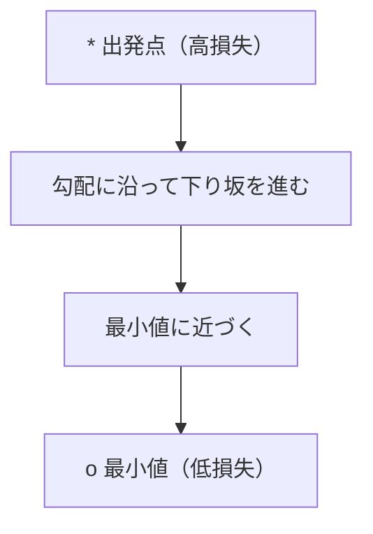
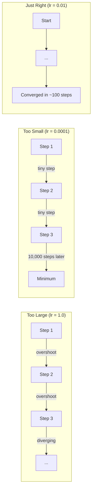
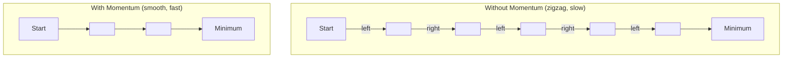
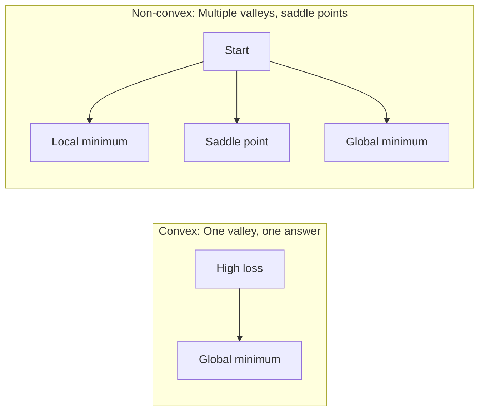
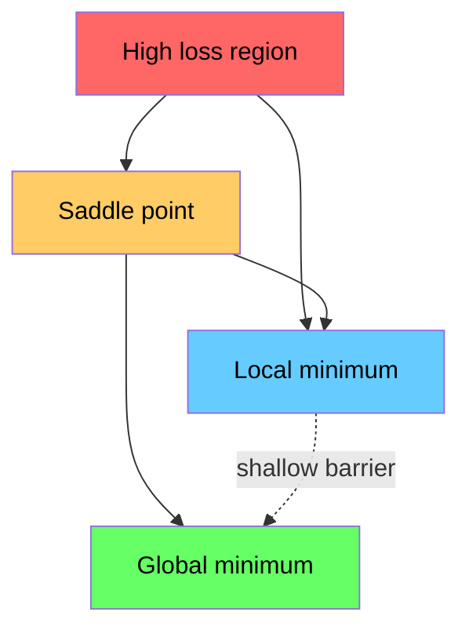

# 最適化

> ニューラルネットワークの訓練とは、谷の底を見つけることに他ならない。

**種別:** 実装
**言語:** Python
**前提条件:** フェーズ1、レッスン04-05（微分、勾配）
**所要時間:** 約75分

## 学習目標

- バニラ勾配降下法、モーメンタム付きSGD、Adamをゼロから実装する
- Rosenbrock関数におけるオプティマイザーの収束を比較し、Adamが重みごとに学習率を適応させる理由を説明する
- 凸損失ランドスケープと非凸損失ランドスケープを区別し、高次元における鞍点の役割を説明する
- 学習安定性のための学習率スケジュール（ステップ減衰、コサインアニーリング、ウォームアップ）を設定する

## 問題の定義

損失関数がある。それはモデルがどれだけ間違っているかを示す。勾配がある。それは損失が悪化する方向を示す。次に必要なのは、下り坂を進む戦略だ。

単純なアプローチは簡単だ：勾配と反対方向に進む。学習率と呼ばれる数値でステップをスケーリングする。繰り返す。これが勾配降下法であり、機能する。しかし「機能する」には注意点がある。学習率が大きすぎると谷を完全に飛び越えて壁の間で跳ね回る。小さすぎると何千もの無駄なステップをかけて答えに向かってゆっくり進む。鞍点に当たると、最小値に到達していないのに進みが止まる。

深層学習のすべてのオプティマイザーは同じ問いへの答えだ：どうすれば谷の底により速く、より確実に到達できるか？

## 概念

### 最適化の意味

最適化とは、関数を最小化（または最大化）する入力値を見つけることだ。機械学習では、関数は損失であり、入力はモデルの重みだ。訓練とは最適化である。

```
minimize L(w) where:
  L = loss function
  w = model weights (could be millions of parameters)
```

### 勾配降下法（バニラ）

最もシンプルなオプティマイザー。すべての重みに対して損失の勾配を計算する。各重みを勾配と逆方向に動かす。ステップを学習率でスケーリングする。

```
w = w - lr * gradient
```

これがアルゴリズム全体だ。1行で完結する。



### 学習率：最も重要なハイパーパラメータ

学習率はステップサイズを制御する。収束に関するすべてを決定する。



適切な学習率を求める公式はない。実験によって見つける。一般的な出発点：Adamでは0.001、モーメンタム付きSGDでは0.01。

### SGD vs バッチ vs ミニバッチ

バニラ勾配降下法は、1ステップ進む前にデータセット全体で勾配を計算する。これをバッチ勾配降下法という。安定しているが遅い。

確率的勾配降下法（SGD）は1つのランダムサンプルで勾配を計算してすぐにステップを進む。ノイズが多いが速い。

ミニバッチ勾配降下法はその中間だ。小さなバッチ（32、64、128、256サンプル）で勾配を計算してからステップを進む。これが実際に誰もが使っている方法だ。

| 種別 | バッチサイズ | 勾配の品質 | ステップあたり速度 | ノイズ |
|---------|-----------|-----------------|---------------|-------|
| バッチGD | データセット全体 | 正確 | 遅い | なし |
| SGD | 1サンプル | 非常にノイズが多い | 速い | 高い |
| ミニバッチ | 32-256 | 良好な推定値 | バランスが取れている | 中程度 |

SGDとミニバッチのノイズはバグではない。浅い局所最小値や鞍点からの脱出を助ける。

### モーメンタム：下り坂を転がるボール

バニラ勾配降下法は現在の勾配だけを見る。勾配がジグザグする場合（狭い谷でよく見られる）、進みが遅い。モーメンタムは過去の勾配を速度項に蓄積することでこれを解決する。

```
v = beta * v + gradient
w = w - lr * v
```

例え：下り坂を転がるボール。凸凹ごとに止まって再スタートはしない。一貫した方向に速度を積み上げ、振動を減衰させる。



`beta`（通常0.9）は保持する履歴の量を制御する。betaが大きいほどモーメンタムが強く、経路が滑らかになるが、方向変化への反応が遅くなる。

### Adam：適応学習率

重みによって必要な学習率は異なる。大きな勾配をあまり受け取らない重みは、ようやく受け取ったときに大きなステップを踏むべきだ。常に巨大な勾配を受け取る重みは小さなステップを踏むべきだ。

Adam（Adaptive Moment Estimation）は各重みについて2つのものを追跡する：

1. 1次モーメント（m）：勾配の移動平均（モーメンタムに相当）
2. 2次モーメント（v）：勾配の2乗の移動平均（勾配の大きさ）

```
m = beta1 * m + (1 - beta1) * gradient
v = beta2 * v + (1 - beta2) * gradient^2

m_hat = m / (1 - beta1^t)    bias correction
v_hat = v / (1 - beta2^t)    bias correction

w = w - lr * m_hat / (sqrt(v_hat) + epsilon)
```

`sqrt(v_hat)`による除算が重要な洞察だ。勾配が大きい重みは大きな数で除算される（有効ステップが小さい）。勾配が小さい重みは小さな数で除算される（有効ステップが大きい）。各重みが独自の適応学習率を持つ。

デフォルトハイパーパラメータ：`lr=0.001, beta1=0.9, beta2=0.999, epsilon=1e-8`。これらのデフォルト値はほとんどの問題でうまく機能する。

### 学習率スケジュール

固定学習率は妥協の産物だ。訓練の初期では大きなステップで速く進みたい。訓練の後期では最小値付近を微調整するために小さなステップを踏みたい。

一般的なスケジュール：

| スケジュール | 式 | ユースケース |
|----------|---------|----------|
| ステップ減衰 | lr = lr * factor every N epochs | シンプル、手動制御 |
| 指数減衰 | lr = lr_0 * decay^t | 滑らかな減少 |
| コサインアニーリング | lr = lr_min + 0.5 * (lr_max - lr_min) * (1 + cos(pi * t / T)) | Transformer、現代の訓練 |
| ウォームアップ＋減衰 | 線形に上昇してから減衰 | 大規模モデル、初期の不安定性を防ぐ |

### 凸関数 vs 非凸関数

凸関数は最小値が1つだ。勾配降下法は必ずそれを見つける。`f(x) = x^2`のような二次関数は凸だ。

ニューラルネットワークの損失関数は非凸だ。多くの局所最小値、鞍点、フラットな領域がある。



実際には、高次元ニューラルネットワークにおける局所最小値はめったに問題にならない。ほとんどの局所最小値は大域最小値に近い損失値を持つ。鞍点（一部の方向ではフラット、他の方向では湾曲）が本当の障害だ。モーメンタムとミニバッチからのノイズがその脱出を助ける。

### 損失ランドスケープの可視化

損失はすべての重みの関数だ。100万個の重みを持つモデルでは、損失ランドスケープは1,000,001次元空間に存在する。重み空間の2つのランダムな方向を選び、その方向に沿った損失をプロットして2次元面を作ることで可視化する。



急峻な最小値は汎化が悪い。フラットな最小値は汎化が良い。これがモーメンタム付きSGDが最終的なテスト精度でAdamを上回ることが多い理由の一つだ：そのノイズが急峻な最小値への収束を防ぐ。

## 実装する

### ステップ1：テスト関数の定義

Rosenbrock関数は古典的な最適化ベンチマークだ。その最小値は(1, 1)にあり、見つけやすいが追いかけにくい狭い曲線状の谷の中にある。

```
f(x, y) = (1 - x)^2 + 100 * (y - x^2)^2
```

```python
def rosenbrock(params):
    x, y = params
    return (1 - x) ** 2 + 100 * (y - x ** 2) ** 2

def rosenbrock_gradient(params):
    x, y = params
    df_dx = -2 * (1 - x) + 200 * (y - x ** 2) * (-2 * x)
    df_dy = 200 * (y - x ** 2)
    return [df_dx, df_dy]
```

### ステップ2：バニラ勾配降下法

```python
class GradientDescent:
    def __init__(self, lr=0.001):
        self.lr = lr

    def step(self, params, grads):
        return [p - self.lr * g for p, g in zip(params, grads)]
```

### ステップ3：モーメンタム付きSGD

```python
class SGDMomentum:
    def __init__(self, lr=0.001, momentum=0.9):
        self.lr = lr
        self.momentum = momentum
        self.velocity = None

    def step(self, params, grads):
        if self.velocity is None:
            self.velocity = [0.0] * len(params)
        self.velocity = [
            self.momentum * v + g
            for v, g in zip(self.velocity, grads)
        ]
        return [p - self.lr * v for p, v in zip(params, self.velocity)]
```

### ステップ4：Adam

```python
class Adam:
    def __init__(self, lr=0.001, beta1=0.9, beta2=0.999, epsilon=1e-8):
        self.lr = lr
        self.beta1 = beta1
        self.beta2 = beta2
        self.epsilon = epsilon
        self.m = None
        self.v = None
        self.t = 0

    def step(self, params, grads):
        if self.m is None:
            self.m = [0.0] * len(params)
            self.v = [0.0] * len(params)

        self.t += 1

        self.m = [
            self.beta1 * m + (1 - self.beta1) * g
            for m, g in zip(self.m, grads)
        ]
        self.v = [
            self.beta2 * v + (1 - self.beta2) * g ** 2
            for v, g in zip(self.v, grads)
        ]

        m_hat = [m / (1 - self.beta1 ** self.t) for m in self.m]
        v_hat = [v / (1 - self.beta2 ** self.t) for v in self.v]

        return [
            p - self.lr * mh / (vh ** 0.5 + self.epsilon)
            for p, mh, vh in zip(params, m_hat, v_hat)
        ]
```

### ステップ5：実行して比較する

```python
def optimize(optimizer, func, grad_func, start, steps=5000):
    params = list(start)
    history = [params[:]]
    for _ in range(steps):
        grads = grad_func(params)
        params = optimizer.step(params, grads)
        history.append(params[:])
    return history

start = [-1.0, 1.0]

gd_history = optimize(GradientDescent(lr=0.0005), rosenbrock, rosenbrock_gradient, start)
sgd_history = optimize(SGDMomentum(lr=0.0001, momentum=0.9), rosenbrock, rosenbrock_gradient, start)
adam_history = optimize(Adam(lr=0.01), rosenbrock, rosenbrock_gradient, start)

for name, history in [("GD", gd_history), ("SGD+M", sgd_history), ("Adam", adam_history)]:
    final = history[-1]
    loss = rosenbrock(final)
    print(f"{name:6s} -> x={final[0]:.6f}, y={final[1]:.6f}, loss={loss:.8f}")
```

期待される出力：Adamが最も速く収束する。モーメンタム付きSGDはより滑らかな経路をたどる。バニラGDは狭い谷に沿ってゆっくり進む。

## 実践で使う

実際には、PyTorchやJAXのオプティマイザーを使う。これらはパラメータグループ、重み減衰、勾配クリッピング、GPUアクセラレーションを処理する。

```python
import torch

model = torch.nn.Linear(784, 10)

sgd = torch.optim.SGD(model.parameters(), lr=0.01, momentum=0.9)
adam = torch.optim.Adam(model.parameters(), lr=0.001)
adamw = torch.optim.AdamW(model.parameters(), lr=0.001, weight_decay=0.01)

scheduler = torch.optim.lr_scheduler.CosineAnnealingLR(adam, T_max=100)
```

経験則：

- Adam（lr=0.001）から始める。チューニングなしでほとんどの問題に機能する。
- 最高の最終精度が必要で、より多くのチューニングが許容できる場合はモーメンタム付きSGD（lr=0.01、momentum=0.9）に切り替える。
- TransformerにはAdamW（Adamに分離された重み減衰を加えたもの）を使う。
- 数エポック以上の訓練では常に学習率スケジュールを使う。
- 訓練が不安定な場合は学習率を下げる。訓練が遅すぎる場合は上げる。

## 成果物

このレッスンでは、適切なオプティマイザーを選ぶためのプロンプトを作成する。`outputs/prompt-optimizer-guide.md`を参照。

ここで構築したオプティマイザークラスは、フェーズ3でニューラルネットワークをゼロから訓練するときに再登場する。

## 演習

1. **学習率スイープ。** Rosenbrock関数に対して、学習率[0.0001, 0.0005, 0.001, 0.005, 0.01]でバニラ勾配降下法を実行する。それぞれ5000ステップ後の最終損失をプロットまたは表示する。収束する最大の学習率を見つけよ。

2. **モーメンタムの比較。** Rosenbrock関数に対して、モーメンタム値[0.0, 0.5, 0.9, 0.99]でSGDを実行する。各ステップの損失を追跡する。どのモーメンタム値が最も速く収束するか？どれがオーバーシュートするか？

3. **鞍点からの脱出。** 関数`f(x, y) = x^2 - y^2`（原点に鞍点がある）を定義する。(0.01, 0.01)から開始する。バニラGD、モーメンタム付きSGD、Adamの動作を比較する。どれが鞍点から脱出するか？

4. **学習率減衰の実装。** GradientDescentクラスに指数減衰スケジュールを追加する：`lr = lr_0 * 0.999^step`。Rosenbrock関数で減衰あり・なしの収束を比較する。

## 主要用語

| 用語 | 一般的な言い方 | 実際の意味 |
|------|----------------|----------------------|
| 勾配降下法 | 「下り坂を進む」 | 学習率でスケーリングした勾配を引くことで重みを更新する。最も基本的なオプティマイザー。 |
| 学習率 | 「ステップサイズ」 | 各更新が重みをどれだけ動かすかを制御するスカラー値。大きすぎると発散する。小さすぎると計算を浪費する。 |
| モーメンタム | 「転がり続ける」 | 過去の勾配を速度ベクトルに蓄積する。振動を減衰させ、一貫した方向への動きを加速する。 |
| SGD | 「ランダムサンプリング」 | 確率的勾配降下法。データセット全体の代わりにランダムなサブセットで勾配を計算する。実際にはほぼ常にミニバッチSGDを意味する。 |
| ミニバッチ | 「データのチャンク」 | 勾配を推定するために使う訓練データの小さなサブセット（32-256サンプル）。速度と勾配精度のバランスを取る。 |
| Adam | 「デフォルトのオプティマイザー」 | Adaptive Moment Estimation。勾配と勾配の2乗の重みごとの移動平均を追跡して、各重みに独自の学習率を与える。 |
| バイアス補正 | 「コールドスタートの修正」 | Adamの1次・2次モーメントはゼロで初期化される。バイアス補正は初期ステップ中の補償のために(1 - beta^t)で除算する。 |
| 学習率スケジュール | 「学習率を時間とともに変化させる」 | 訓練中に学習率を調整する関数。初期は大きなステップ、後期は小さなステップ。 |
| 凸関数 | 「一つの谷」 | 局所最小値がすなわち大域最小値である関数。勾配降下法は必ずそれを見つける。ニューラルネットワークの損失は凸ではない。 |
| 鞍点 | 「フラットだが最小値ではない」 | 勾配はゼロだが、一部の方向では最小値、他の方向では最大値となる点。高次元では一般的。 |
| 損失ランドスケープ | 「地形」 | 重み空間上にプロットした損失関数。2つのランダムな方向に沿ってスライスして可視化する。 |
| 収束 | 「到達する」 | オプティマイザーが、それ以上ステップを進めても損失が意味のある形で減少しない点に達すること。 |

## 参考資料

- [Sebastian Ruder: An overview of gradient descent optimization algorithms](https://ruder.io/optimizing-gradient-descent/) - 主要なオプティマイザーすべての包括的なサーベイ
- [Why Momentum Really Works (Distill)](https://distill.pub/2017/momentum/) - モーメンタムダイナミクスのインタラクティブな可視化
- [Adam: A Method for Stochastic Optimization (Kingma & Ba, 2014)](https://arxiv.org/abs/1412.6980) - Adamの原著論文、読みやすく短い
- [Visualizing the Loss Landscape of Neural Nets (Li et al., 2018)](https://arxiv.org/abs/1712.09913) - 急峻な最小値 vs フラットな最小値を示した論文
