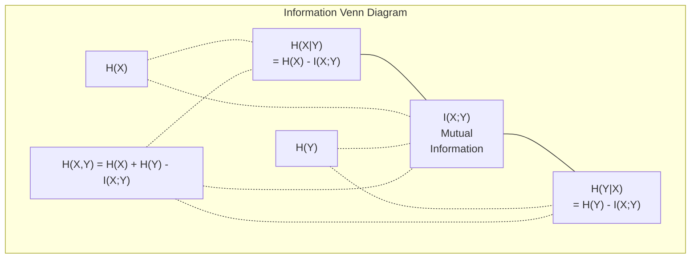

# 情報理論

> 情報理論は「驚き」を測る。損失関数はその上に成り立っている。

**タイプ:** 学習
**言語:** Python
**前提条件:** フェーズ1、レッスン06（確率論）
**所要時間:** 約60分

## 学習目標

- エントロピー・クロスエントロピー・KLダイバージェンスをゼロから計算し、それらの関係を説明できる
- クロスエントロピー損失の最小化が対数尤度の最大化と等価であることを導出できる
- 特徴量とターゲット間の相互情報量を計算し、特徴量の重要度をランク付けできる
- 言語モデルが選択する有効な語彙サイズとしてのパープレキシティを説明できる

## 問題の背景

あなたはすべての分類モデルの学習で `CrossEntropyLoss()` を呼び出している。言語モデルの論文では必ず「パープレキシティ」という言葉を目にする。VAE・蒸留・RLHFにおけるKLダイバージェンスについても読んだことがあるはずだ。これらは互いに無関係な概念ではない。すべて同じアイデアが異なる顔をしているに過ぎない。

情報理論は、不確かさ・圧縮・予測について論じるための言語を与えてくれる。Claude Shannon（クロード・シャノン）は1948年に通信問題を解くためにこれを発明した。ニューラルネットワークの学習も実は通信問題であることがわかる。モデルは学習済みの重みというノイズだらけのチャネルを通じて、正解ラベルを伝達しようとしているのだ。

このレッスンでは、すべての数式をゼロから構築し、その由来と機能する理由を理解する。

## 概念

### 情報量（驚き）

起こりにくいことが起きたとき、それはより多くの情報を運ぶ。コインで表が出た？驚くに値しない。宝くじに当たった？非常に驚く。

確率 p のイベントの情報量は次のように定義される。

```
I(x) = -log(p(x))
```

底を2にすると単位はビット、自然対数を使うとナットになる。アイデアは同じで単位が異なるだけだ。

```
イベント              確率       驚き（ビット）
公平なコインで表    0.5          1.0
サイコロで6         0.167        2.58
1000分の1のイベント  0.001        9.97
確実なイベント       1.0          0.0
```

確実なイベントは情報量ゼロだ。それが起きることはあらかじめわかっているのだから。

### エントロピー（平均的な驚き）

エントロピーは、ある分布のすべての起こりうる結果にわたる驚きの期待値だ。

```
H(P) = -sum( p(x) * log(p(x)) )  for all x
```

公平なコインは二値変数として最大エントロピー（1ビット）を持つ。偏ったコイン（99%の確率で表）は低エントロピー（0.08ビット）だ。何が起きるかほぼわかっているので、各投げから得られる情報はほとんどない。

```
公平なコイン:    H = -(0.5 * log2(0.5) + 0.5 * log2(0.5)) = 1.0 bit
偏ったコイン:   H = -(0.99 * log2(0.99) + 0.01 * log2(0.01)) = 0.08 bits
```

エントロピーは分布の削減不可能な不確かさを測る。それ以下には圧縮できない。

### クロスエントロピー（毎日使う損失関数）

クロスエントロピーは、真の分布 P から生成されるイベントを分布 Q で符号化したときの平均的な驚きを測る。

```
H(P, Q) = -sum( p(x) * log(q(x)) )  for all x
```

P は真の分布（ラベル）、Q はモデルの予測だ。Q が P と完全に一致すれば、クロスエントロピーはエントロピーに等しくなる。不一致があればそれより大きくなる。

分類問題では、P はワンホットベクトル（真のクラスが確率1、それ以外は0）だ。これによりクロスエントロピーは次のように単純化される。

```
H(P, Q) = -log(q(true_class))
```

これが分類のクロスエントロピー損失の全公式だ。正解クラスの予測確率を最大化する。

### KLダイバージェンス（分布間の距離）

KLダイバージェンスは、P の代わりに Q を使ったときに生じる余分な驚きを測る。

```
D_KL(P || Q) = sum( p(x) * log(p(x) / q(x)) )  for all x
             = H(P, Q) - H(P)
```

クロスエントロピーはエントロピーにKLダイバージェンスを加えたものだ。学習中は真の分布のエントロピーが一定なので、クロスエントロピーを最小化することはKLダイバージェンスを最小化することと等しい。モデルの分布を真の分布に近づけているのだ。

KLダイバージェンスは非対称だ。D_KL(P || Q) ≠ D_KL(Q || P) であり、真の距離尺度ではない。

### 相互情報量

相互情報量は、一方の変数を知ることが他方の変数についてどれだけ情報を与えるかを測る。

```
I(X; Y) = H(X) - H(X|Y)
        = H(X) + H(Y) - H(X, Y)
```

X と Y が独立なら相互情報量はゼロだ。一方を知っても他方について何もわからない。完全に相関していれば、相互情報量はどちらかの変数のエントロピーと等しくなる。

特徴量選択において、特徴量とターゲット間の相互情報量が高いということは、その特徴量が有用であることを意味する。相互情報量が低ければ、それはノイズだ。

### 条件付きエントロピー

H(Y|X) は、X を観測した後に Y について残る不確かさを測る。

```
H(Y|X) = H(X,Y) - H(X)
```

二つの極端なケース:
- X が Y を完全に決定するなら、H(Y|X) = 0 だ。X を知ることで Y に関する不確かさがすべて消える。例：X = 摂氏温度、Y = 華氏温度。
- X が Y について何も教えてくれないなら、H(Y|X) = H(Y) だ。X を知っても不確かさは減らない。例：X = コイン投げの結果、Y = 明日の天気。

条件付きエントロピーは常に非負であり、H(Y) を超えない。

```
0 <= H(Y|X) <= H(Y)
```

機械学習では、条件付きエントロピーは決定木に登場する。各分岐点でアルゴリズムは H(Y|X) を最小化する特徴量 X を選ぶ。つまり、ラベル Y についての不確かさを最も除去する特徴量だ。

### 結合エントロピー

H(X,Y) は X と Y を合わせた結合分布のエントロピーだ。

```
H(X,Y) = -sum sum p(x,y) * log(p(x,y))   for all x, y
```

重要な性質:

```
H(X,Y) <= H(X) + H(Y)
```

X と Y が独立のとき等号が成立する。情報を共有している場合、結合エントロピーは個別のエントロピーの和より小さくなる。「欠落」しているエントロピーがまさに相互情報量だ。



各関係式:
- H(X,Y) = H(X) + H(Y|X) = H(Y) + H(X|Y)
- I(X;Y) = H(X) - H(X|Y) = H(Y) - H(Y|X)
- H(X,Y) = H(X) + H(Y) - I(X;Y)

### 相互情報量（詳細）

相互情報量 I(X;Y) は、一方の変数を知ることで他方の不確かさがどれだけ減少するかを定量化する。

```
I(X;Y) = H(X) - H(X|Y)
       = H(Y) - H(Y|X)
       = H(X) + H(Y) - H(X,Y)
       = sum sum p(x,y) * log(p(x,y) / (p(x) * p(y)))
```

性質:
- I(X;Y) >= 0 は常に成立。何かを観測することで情報が失われることはない。
- I(X;Y) = 0 は X と Y が独立な場合に限る。
- I(X;Y) = I(Y;X) だ。KLダイバージェンスとは異なり対称だ。
- I(X;X) = H(X) だ。変数は自分自身とすべての情報を共有する。

**特徴量選択における相互情報量。** ML では、ターゲットについて情報量の多い特徴量が欲しい。相互情報量は特徴量をランク付けする原理的な方法を与えてくれる。

1. 各特徴量 X_i について、Y をターゲット変数として I(X_i; Y) を計算する。
2. MI スコアで特徴量をランク付けする。
3. 上位 k 個の特徴量を残す。

この手法は、線形・非線形・単調・非単調を問わず、特徴量とターゲットのあらゆる関係に対して機能する。相関係数は線形関係しか検出できないが、相互情報量はすべてを捉える。

| 手法 | 検出できる関係 | 計算コスト | カテゴリ変数対応 |
|--------|---------|-------------------|---------------------|
| Pearson 相関 | 線形関係 | O(n) | 不可 |
| Spearman 相関 | 単調関係 | O(n log n) | 不可 |
| 相互情報量 | あらゆる統計的依存関係 | O(n log n)（ビニング使用） | 可 |

### ラベルスムージングとクロスエントロピー

標準的な分類ではハードターゲット [0, 0, 1, 0] を使う。真のクラスが確率1、それ以外は0だ。ラベルスムージングはこれをソフトターゲットに置き換える。

```
soft_target = (1 - epsilon) * hard_target + epsilon / num_classes
```

epsilon = 0.1、4クラスの場合:
- ハードターゲット:  [0, 0, 1, 0]
- ソフトターゲット:  [0.025, 0.025, 0.925, 0.025]

情報理論の観点から見ると、ラベルスムージングはターゲット分布のエントロピーを増大させる。ハードなワンホットターゲットのエントロピーは0であり、不確かさが全くない。ソフトターゲットは正のエントロピーを持つ。

これが有効な理由:
- モデルがロジットを極端な値に追い込むのを防ぐ（クロスエントロピーのもとでワンホットターゲットに完全一致するには無限大のロジットが必要になる）
- 正則化として機能する：モデルは100%確信を持てなくなる
- キャリブレーションを改善する：予測確率が真の不確かさをより適切に反映する
- 学習と推論の動作のギャップを縮小する

ラベルスムージングを用いたクロスエントロピー損失は次のようになる。

```
L = (1 - epsilon) * CE(hard_target, prediction) + epsilon * H_uniform(prediction)
```

第2項は一様分布から遠い予測にペナルティを与える。確信度に直接的な正則化をかけている。

### クロスエントロピーが分類損失の定番である理由

三つの視点から見ても、結論は同じだ。

**情報理論の視点。** クロスエントロピーは、真の分布の代わりにモデルの分布を使うことで無駄にするビット数を測る。それを最小化することで、モデルは現実の最も効率的なエンコーダーになる。

**最尤推定の視点。** 真のクラス y_i を持つ N 個の学習サンプルに対して:

```
尤度            = product( q(y_i) )
対数尤度        = sum( log(q(y_i)) )
負の対数尤度    = -sum( log(q(y_i)) )
```

最後の式がクロスエントロピー損失だ。クロスエントロピーの最小化 = モデルのもとでの学習データの尤度の最大化だ。

**勾配の視点。** ロジットに対するクロスエントロピーの勾配は、単純に（予測 - 真値）だ。クリーンで安定しており、計算も高速だ。これがソフトマックスと完璧に組み合わさる理由だ。

### ビットとナット

違いは対数の底だけだ。

```
底2    -> ビット      （情報理論の伝統）
底 e   -> ナット      （機械学習の慣習）
底10   -> ハートレー  （ほとんど使われない）
```

1 ナット = 1/ln(2) ビット = 1.4427 ビット。PyTorch と TensorFlow はデフォルトで自然対数（ナット）を使用する。

### パープレキシティ

パープレキシティはクロスエントロピーの指数だ。モデルがどれだけ等確率の選択肢の間で迷っているかの実効的な数を示す。

```
Perplexity = 2^H(P,Q)   （ビット使用時）
Perplexity = e^H(P,Q)   （ナット使用時）
```

パープレキシティが50の言語モデルは、平均的に50個の次トークン候補から均一に選ぶ場合と同程度に迷っている。低いほど良い。

GPT-2は一般的なベンチマークでパープレキシティ約30を達成した。現代のモデルは十分に代表されているドメインでは一桁台を達成している。

## 実装

### ステップ1：情報量とエントロピー

```python
import math

def information_content(p, base=2):
    if p <= 0 or p > 1:
        return float('inf') if p <= 0 else 0.0
    return -math.log(p) / math.log(base)

def entropy(probs, base=2):
    return sum(
        p * information_content(p, base)
        for p in probs if p > 0
    )

fair_coin = [0.5, 0.5]
biased_coin = [0.99, 0.01]
fair_die = [1/6] * 6

print(f"Fair coin entropy:   {entropy(fair_coin):.4f} bits")
print(f"Biased coin entropy: {entropy(biased_coin):.4f} bits")
print(f"Fair die entropy:    {entropy(fair_die):.4f} bits")
```

### ステップ2：クロスエントロピーとKLダイバージェンス

```python
def cross_entropy(p, q, base=2):
    total = 0.0
    for pi, qi in zip(p, q):
        if pi > 0:
            if qi <= 0:
                return float('inf')
            total += pi * (-math.log(qi) / math.log(base))
    return total

def kl_divergence(p, q, base=2):
    return cross_entropy(p, q, base) - entropy(p, base)

true_dist = [0.7, 0.2, 0.1]
good_model = [0.6, 0.25, 0.15]
bad_model = [0.1, 0.1, 0.8]

print(f"Entropy of true dist:     {entropy(true_dist):.4f} bits")
print(f"CE (good model):          {cross_entropy(true_dist, good_model):.4f} bits")
print(f"CE (bad model):           {cross_entropy(true_dist, bad_model):.4f} bits")
print(f"KL divergence (good):     {kl_divergence(true_dist, good_model):.4f} bits")
print(f"KL divergence (bad):      {kl_divergence(true_dist, bad_model):.4f} bits")
```

### ステップ3：分類損失としてのクロスエントロピー

```python
def softmax(logits):
    max_logit = max(logits)
    exps = [math.exp(z - max_logit) for z in logits]
    total = sum(exps)
    return [e / total for e in exps]

def cross_entropy_loss(true_class, logits):
    probs = softmax(logits)
    return -math.log(probs[true_class])

logits = [2.0, 1.0, 0.1]
true_class = 0

probs = softmax(logits)
loss = cross_entropy_loss(true_class, logits)

print(f"Logits:      {logits}")
print(f"Softmax:     {[f'{p:.4f}' for p in probs]}")
print(f"True class:  {true_class}")
print(f"Loss:        {loss:.4f} nats")
print(f"Perplexity:  {math.exp(loss):.2f}")
```

### ステップ4：クロスエントロピーは負の対数尤度と等しい

```python
import random

random.seed(42)

n_samples = 1000
n_classes = 3
true_labels = [random.randint(0, n_classes - 1) for _ in range(n_samples)]
model_logits = [[random.gauss(0, 1) for _ in range(n_classes)] for _ in range(n_samples)]

ce_loss = sum(
    cross_entropy_loss(label, logits)
    for label, logits in zip(true_labels, model_logits)
) / n_samples

nll = -sum(
    math.log(softmax(logits)[label])
    for label, logits in zip(true_labels, model_logits)
) / n_samples

print(f"Cross-entropy loss:      {ce_loss:.6f}")
print(f"Negative log-likelihood: {nll:.6f}")
print(f"Difference:              {abs(ce_loss - nll):.2e}")
```

### ステップ5：相互情報量

```python
def mutual_information(joint_probs, base=2):
    rows = len(joint_probs)
    cols = len(joint_probs[0])

    margin_x = [sum(joint_probs[i][j] for j in range(cols)) for i in range(rows)]
    margin_y = [sum(joint_probs[i][j] for i in range(rows)) for j in range(cols)]

    mi = 0.0
    for i in range(rows):
        for j in range(cols):
            pxy = joint_probs[i][j]
            if pxy > 0:
                mi += pxy * math.log(pxy / (margin_x[i] * margin_y[j])) / math.log(base)
    return mi

independent = [[0.25, 0.25], [0.25, 0.25]]
dependent = [[0.45, 0.05], [0.05, 0.45]]

print(f"MI (independent): {mutual_information(independent):.4f} bits")
print(f"MI (dependent):   {mutual_information(dependent):.4f} bits")
```

## 実践的な使い方

NumPy を使った同じ概念の実装。実際の現場での使い方だ。

```python
import numpy as np

def np_entropy(p):
    p = np.asarray(p, dtype=float)
    mask = p > 0
    result = np.zeros_like(p)
    result[mask] = p[mask] * np.log(p[mask])
    return -result.sum()

def np_cross_entropy(p, q):
    p, q = np.asarray(p, dtype=float), np.asarray(q, dtype=float)
    mask = p > 0
    return -(p[mask] * np.log(q[mask])).sum()

def np_kl_divergence(p, q):
    return np_cross_entropy(p, q) - np_entropy(p)

true = np.array([0.7, 0.2, 0.1])
pred = np.array([0.6, 0.25, 0.15])
print(f"Entropy:    {np_entropy(true):.4f} nats")
print(f"Cross-ent:  {np_cross_entropy(true, pred):.4f} nats")
print(f"KL div:     {np_kl_divergence(true, pred):.4f} nats")
```

`torch.nn.CrossEntropyLoss()` が内部でやっていることをゼロから構築した。これで学習中に損失が下がっていく理由がわかる。モデルの予測分布が真の分布に近づいており、それが無駄にするナットの情報量として測られているのだ。

## 演習

1. 英語アルファベットが一様分布と仮定してエントロピーを計算せよ（26文字）。次に、実際の文字頻度を使って推定せよ。どちらが高く、それはなぜか？

2. 真のクラス1のサンプルに対してモデルがロジット [5.0, 2.0, 0.5] を出力した。クロスエントロピー損失を手で計算し、`cross_entropy_loss` 関数で確認せよ。損失がゼロになるロジットは何か？

3. KLダイバージェンスが非対称であることを示せ。二つの分布 P と Q を選び、D_KL(P || Q) と D_KL(Q || P) を計算せよ。それらが異なる理由を説明せよ。

4. トークン予測のシーケンスに対してパープレキシティを計算する関数を構築せよ。(true_token_index, predicted_logits) のペアのリストを与えたとき、そのシーケンスのパープレキシティを返せ。

## 重要用語

| 用語 | 一般的な言い方 | 実際の意味 |
|------|----------------|----------------------|
| 情報量 | 「驚き」 | イベントを符号化するために必要なビット数（またはナット数）: -log(p) |
| エントロピー | 「ランダム性」 | 分布のすべての結果にわたる平均的な驚き。削減不可能な不確かさを測る。 |
| クロスエントロピー | 「損失関数」 | 真の分布 P からのイベントをモデル分布 Q で符号化したときの平均的な驚き。 |
| KLダイバージェンス | 「分布間の距離」 | P の代わりに Q を使うことで無駄にする余分なビット。クロスエントロピーからエントロピーを引いたもの。非対称。 |
| 相互情報量 | 「X と Y はどれだけ関連しているか」 | Y を知ることによる X についての不確かさの減少。ゼロは独立を意味する。 |
| ソフトマックス | 「ロジットを確率に変換する」 | 指数変換して正規化する。任意の実数値ベクトルを有効な確率分布にマッピングする。 |
| パープレキシティ | 「モデルがどれだけ迷っているか」 | クロスエントロピーの指数。各ステップでモデルが選択している実効的な語彙サイズ。 |
| ビット | 「シャノンの単位」 | 底2の対数で測られる情報量。1ビットは公平なコイン投げ一回分の不確かさを解消する。 |
| ナット | 「MLの単位」 | 自然対数で測られる情報量。PyTorch と TensorFlow がデフォルトで使用する。 |
| 負の対数尤度 | 「NLL損失」 | ワンホットラベルに対してクロスエントロピー損失と同一。最小化することで正解予測の確率が最大化される。 |

## さらに学ぶために

- [Shannon 1948: A Mathematical Theory of Communication](https://people.math.harvard.edu/~ctm/home/text/others/shannon/entropy/entropy.pdf) - オリジナル論文、今でも読みやすい
- [Visual Information Theory (Chris Olah)](https://colah.github.io/posts/2015-09-Visual-Information/) - エントロピーとKLダイバージェンスの最良のビジュアル解説
- [PyTorch CrossEntropyLoss docs](https://pytorch.org/docs/stable/generated/torch.nn.CrossEntropyLoss.html) - あなたが今構築したものをフレームワークがどう実装しているか
