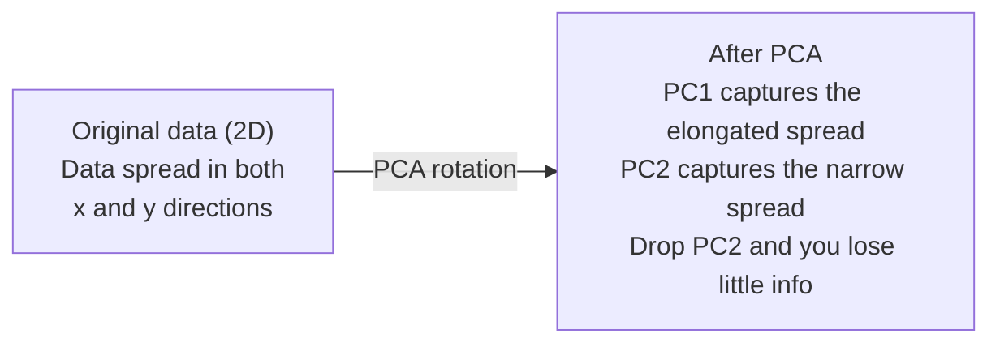

# 次元削減

> 高次元データには構造がある。正しい角度から見れば、それが見えてくる。

**タイプ:** Build
**言語:** Python
**前提条件:** Phase 1、Lesson 01（線形代数の直感）、02（ベクトル・行列・演算）、03（固有値と固有ベクトル）、06（確率と分布）
**所要時間:** 約90分

## 学習目標

- PCA をスクラッチで実装する：データの中心化、共分散行列の計算、固有値分解、射影
- 説明分散比とエルボー法を使って主成分数を選択する
- PCA・t-SNE・UMAP を比較して MNIST 数字を2Dで可視化し、それぞれのトレードオフを説明する
- RBF カーネルを用いたカーネル PCA を適用し、標準 PCA では扱えない非線形データ構造を分離する

## 問題設定

1サンプルあたり784個の特徴量を持つデータセットがあるとする。手書き数字のピクセル値かもしれない。遺伝子発現レベルかもしれない。ユーザー行動シグナルかもしれない。784次元は可視化できない。プロットできない。そもそも頭の中でイメージすることさえできない。

しかし、その784個の特徴量のほとんどは冗長だ。実際の情報はずっと小さな面上に存在する。手書きの「7」を表すのに784個の独立した数値は必要ない。必要なのはわずかだ：ストロークの角度、横棒の長さ、どれだけ傾いているか。残りはノイズだ。

次元削減はその小さな面を見つける。784次元のデータを受け取り、重要な構造を保ちながら2次元・10次元・50次元に圧縮する。

## コンセプト

### 次元の呪い

高次元空間は直感に反する。次元が増えると3つのことが壊れる。

**距離が意味を失う。** 高次元では、任意の2つのランダムな点間の距離が同じ値に収束する。すべての点がほぼ同じ距離にあると、最近傍探索が機能しなくなる。

```
次元数    ランダムな点間の平均距離比（最大/最小）
2         ~5.0
10        ~1.8
100       ~1.2
1000      ~1.02
```

**体積がコーナーに集中する。** d次元の単位超立方体には 2^d 個のコーナーがある。100次元では、ほぼすべての体積が中心から遠く離れたコーナーに集中する。データ点は端に広がり、モデルは内部でデータ不足に悩まされる。

**指数関数的に多くのデータが必要になる。** 空間内のサンプル密度を一定に保つには、2次元から20次元に移行するだけで 10^18 倍のデータが必要になる。それだけのデータは決して手に入らない。次元を削減することで、データ密度を実用的なレベルに戻す。

### PCA：重要な方向を見つける

主成分分析（PCA）は、データが最も大きく変化する軸を見つける。座標系を回転させ、第1軸が最大の分散を捉え、第2軸が次に多くの分散を捉え、というように並べる。

アルゴリズム：

```
1. データの中心化      （各特徴量から平均を引く）
2. 共分散の計算        （特徴量がどのように連動するか）
3. 固有値分解          （主方向を見つける）
4. 固有値でソート      （分散の大きい順に並べる）
5. 射影               （上位 k 個の固有ベクトルを残し、残りを捨てる）
```

なぜ固有値分解なのか？共分散行列は対称かつ半正定値だ。その固有ベクトルは特徴空間上の直交方向だ。固有値は各方向がどれだけの分散を捉えているかを示す。最大の固有値を持つ固有ベクトルが最大分散の方向を指す。



- **PCA 適用前：** データの雲は x 軸と y 軸の両方に対して斜めに広がっている
- **PCA 適用後：** 座標系が回転し、PC1 が最大分散の方向（細長い広がり）に、PC2 が最小分散の方向（狭い広がり）に揃う
- **次元削減：** PC2 を捨てることでデータを PC1 に射影し、ほとんど情報を失わない

### 説明分散比

各主成分は全分散の一定割合を捉える。説明分散比がその割合を示す。

```
成分     固有値    説明比率   累積
PC1      4.73      0.473      0.473
PC2      2.51      0.251      0.724
PC3      1.12      0.112      0.836
PC4      0.89      0.089      0.925
...
```

累積説明分散が 0.95 に達すれば、それだけの成分で情報の95%が捉えられていることがわかる。それ以降はほぼノイズだ。

### 成分数の選び方

3つの戦略：

1. **閾値法。** 分散の90〜95%を説明するのに十分な成分数を保持する。
2. **エルボー法。** 成分ごとの説明分散をプロットし、急激な落ち込みを探す。
3. **下流のパフォーマンス。** PCA を前処理として使い、k を変化させてモデルの精度を測定する。最適な k は精度が頭打ちになる点だ。

### t-SNE：近傍を保持する

t-分布型確率的近傍埋め込み（t-SNE）は可視化のために設計されている。高次元データを2D（または3D）にマッピングしながら、どの点が互いに近いかを保持する。

直感的な説明：元の空間で、点間の距離に基づいて点のペアに対する確率分布を計算する。近い点は高い確率を得る。遠い点は低い確率を得る。次に、同じ確率分布が成り立つ2D配置を見つける。784次元で近傍だった点は2Dでも近傍のままとなる。

t-SNE の主な特性：
- 非線形。PCA では展開できない複雑な多様体を扱える。
- 確率的。実行ごとに異なるレイアウトが生成される。
- パープレキシティパラメータが考慮する近傍数を制御する（典型的な範囲：5〜50）。
- 出力のクラスター間の距離は意味を持たない。意味を持つのはクラスター自体だけだ。
- 大規模データセットでは遅い。デフォルトでは O(n^2)。

### UMAP：より速く、よりよいグローバル構造

一様多様体近似と射影（UMAP）は t-SNE と似た仕組みだが、2つの利点がある：
- より速い。すべての点間距離を計算する代わりに、近似最近傍グラフを使用する。
- よりよいグローバル構造。出力におけるクラスターの相対的な位置が t-SNE よりも意味を持つ傾向がある。

UMAP は高次元空間で重み付きグラフ（「ファジートポロジカル表現」）を構築し、このグラフをできるだけ良く保持する低次元レイアウトを見つける。

主なパラメータ：
- `n_neighbors`：局所的な構造を定義する近傍数（パープレキシティに相当）。大きな値ほどグローバル構造を保持する。
- `min_dist`：出力で点がどれだけ密集するか。小さな値ほど密なクラスターを作る。

### どれを使うべきか

| 手法 | ユースケース | 保持するもの | 速度 |
|--------|----------|-----------|-------|
| PCA | 学習前の前処理 | グローバルな分散 | 高速（厳密）、数百万サンプルでも動作 |
| PCA | 素早い探索的可視化 | 線形構造 | 高速 |
| t-SNE | 公刊品質の2Dプロット | 局所的な近傍 | 低速（理想は1万サンプル未満） |
| UMAP | 大規模な2D可視化 | 局所的 + 一部グローバル構造 | 中速（数百万件を扱える） |
| PCA | モデル向け特徴削減 | 分散ランク付き特徴 | 高速 |
| t-SNE / UMAP | クラスター構造の理解 | クラスターの分離 | 中速〜低速 |

経験則：前処理とデータ圧縮には PCA を使う。2Dで構造を可視化したい場合は t-SNE または UMAP を使う。

### カーネル PCA

標準 PCA は線形部分空間を見つける。座標系を回転させ、軸を削除する。しかし、データが非線形多様体上に存在する場合はどうすればいいか？2次元の円は、いかなる直線でも分離できない。標準 PCA では対処できない。

カーネル PCA は、カーネル関数によって引き起こされる高次元特徴空間でその座標を明示的に計算せずに PCA を適用する。これがカーネルトリックだ。SVM の背後にある考え方と同じだ。

アルゴリズム：
1. K_ij = k(x_i, x_j) となるカーネル行列 K を計算する
2. 特徴空間でカーネル行列を中心化する
3. 中心化されたカーネル行列を固有値分解する
4. 上位固有ベクトル（1/sqrt(固有値) でスケーリング）が射影となる

一般的なカーネル関数：

| カーネル | 式 | 適したデータ |
|--------|---------|----------|
| RBF（ガウス） | exp(-gamma * \|\|x - y\|\|^2) | ほとんどの非線形データ、滑らかな多様体 |
| 多項式 | (x . y + c)^d | 多項式的な関係 |
| シグモイド | tanh(alpha * x . y + c) | ニューラルネットワーク的なマッピング |

カーネル PCA と標準 PCA の使い分け：

| 基準 | 標準 PCA | カーネル PCA |
|-----------|-------------|------------|
| データ構造 | 線形部分空間 | 非線形多様体 |
| 速度 | O(min(n^2 d, d^2 n)) | O(n^2 d + n^3) |
| 解釈可能性 | 成分は特徴の線形結合 | 成分に直接的な特徴解釈がない |
| スケーラビリティ | 数百万サンプルで動作 | カーネル行列は n x n でメモリ制限あり |
| 再構成 | 直接的な逆変換 | 事前イメージ近似が必要 |

典型的な例：2次元の同心円。2つの点の輪が入れ子になっている。標準 PCA は両方を同じ直線に射影する――分類には役に立たない。RBF カーネルを使ったカーネル PCA は内側の円と外側の円を異なる領域にマッピングし、線形分離可能にする。

### 再構成誤差

次元削減の品質はどう評価するか？784次元を50次元に圧縮した。何が失われたか？

再構成誤差を測定する：
1. データを k 次元に射影：X_reduced = X @ W_k
2. 再構成：X_hat = X_reduced @ W_k^T
3. MSE を計算：mean((X - X_hat)^2)

PCA の場合、再構成誤差と説明分散にはきれいな関係がある：

```
再構成誤差 = 含まれていない固有値の合計
全分散     = すべての固有値の合計
失われた割合 = （削除された固有値の合計）/（すべての固有値の合計）
```

各成分の説明分散比は：

```
explained_ratio_k = eigenvalue_k / sum(all eigenvalues)
```

成分数に対する累積説明分散をプロットすると「エルボー」曲線が得られる。適切な成分数は：
- 曲線が平坦になる（収穫逓減）
- 累積分散が閾値（通常 0.90 または 0.95）を超える
- 下流タスクの性能が頭打ちになる

再構成誤差は k の選択以外にも使える。異常検知に使うことができる：再構成誤差が大きいサンプルは、学習した部分空間に適合しない外れ値だ。これが本番システムにおける PCA ベース異常検知の基礎となっている。

## 実装する

### ステップ 1：PCA をスクラッチで実装

```python
import numpy as np

class PCA:
    def __init__(self, n_components):
        self.n_components = n_components
        self.components = None
        self.mean = None
        self.eigenvalues = None
        self.explained_variance_ratio_ = None

    def fit(self, X):
        self.mean = np.mean(X, axis=0)
        X_centered = X - self.mean

        cov_matrix = np.cov(X_centered, rowvar=False)

        eigenvalues, eigenvectors = np.linalg.eigh(cov_matrix)

        sorted_idx = np.argsort(eigenvalues)[::-1]
        eigenvalues = eigenvalues[sorted_idx]
        eigenvectors = eigenvectors[:, sorted_idx]

        self.components = eigenvectors[:, :self.n_components].T
        self.eigenvalues = eigenvalues[:self.n_components]
        total_var = np.sum(eigenvalues)
        self.explained_variance_ratio_ = self.eigenvalues / total_var

        return self

    def transform(self, X):
        X_centered = X - self.mean
        return X_centered @ self.components.T

    def fit_transform(self, X):
        self.fit(X)
        return self.transform(X)
```

### ステップ 2：合成データでテスト

```python
np.random.seed(42)
n_samples = 500

t = np.random.uniform(0, 2 * np.pi, n_samples)
x1 = 3 * np.cos(t) + np.random.normal(0, 0.2, n_samples)
x2 = 3 * np.sin(t) + np.random.normal(0, 0.2, n_samples)
x3 = 0.5 * x1 + 0.3 * x2 + np.random.normal(0, 0.1, n_samples)

X_synthetic = np.column_stack([x1, x2, x3])

pca = PCA(n_components=2)
X_reduced = pca.fit_transform(X_synthetic)

print(f"Original shape: {X_synthetic.shape}")
print(f"Reduced shape:  {X_reduced.shape}")
print(f"Explained variance ratios: {pca.explained_variance_ratio_}")
print(f"Total variance captured: {sum(pca.explained_variance_ratio_):.4f}")
```

### ステップ 3：MNIST 数字を2Dで表示

```python
from sklearn.datasets import fetch_openml

mnist = fetch_openml("mnist_784", version=1, as_frame=False, parser="auto")
X_mnist = mnist.data[:5000].astype(float)
y_mnist = mnist.target[:5000].astype(int)

pca_mnist = PCA(n_components=50)
X_pca50 = pca_mnist.fit_transform(X_mnist)
print(f"50 components capture {sum(pca_mnist.explained_variance_ratio_):.2%} of variance")

pca_2d = PCA(n_components=2)
X_pca2d = pca_2d.fit_transform(X_mnist)
print(f"2 components capture {sum(pca_2d.explained_variance_ratio_):.2%} of variance")
```

### ステップ 4：sklearn と比較

```python
from sklearn.decomposition import PCA as SklearnPCA
from sklearn.manifold import TSNE

sklearn_pca = SklearnPCA(n_components=2)
X_sklearn_pca = sklearn_pca.fit_transform(X_mnist)

print(f"\nOur PCA explained variance:     {pca_2d.explained_variance_ratio_}")
print(f"Sklearn PCA explained variance: {sklearn_pca.explained_variance_ratio_}")

diff = np.abs(np.abs(X_pca2d) - np.abs(X_sklearn_pca))
print(f"Max absolute difference: {diff.max():.10f}")

tsne = TSNE(n_components=2, perplexity=30, random_state=42)
X_tsne = tsne.fit_transform(X_mnist)
print(f"\nt-SNE output shape: {X_tsne.shape}")
```

### ステップ 5：UMAP との比較

```python
try:
    from umap import UMAP

    reducer = UMAP(n_components=2, n_neighbors=15, min_dist=0.1, random_state=42)
    X_umap = reducer.fit_transform(X_mnist)
    print(f"UMAP output shape: {X_umap.shape}")
except ImportError:
    print("Install umap-learn: pip install umap-learn")
```

## 活用する

分類器の前処理として PCA を使う：

```python
from sklearn.decomposition import PCA as SklearnPCA
from sklearn.linear_model import LogisticRegression
from sklearn.model_selection import train_test_split
from sklearn.metrics import accuracy_score

X_train, X_test, y_train, y_test = train_test_split(
    X_mnist, y_mnist, test_size=0.2, random_state=42
)

results = {}
for k in [10, 30, 50, 100, 200]:
    pca_k = SklearnPCA(n_components=k)
    X_tr = pca_k.fit_transform(X_train)
    X_te = pca_k.transform(X_test)

    clf = LogisticRegression(max_iter=1000, random_state=42)
    clf.fit(X_tr, y_train)
    acc = accuracy_score(y_test, clf.predict(X_te))
    var_captured = sum(pca_k.explained_variance_ratio_)
    results[k] = (acc, var_captured)
    print(f"k={k:>3d}  accuracy={acc:.4f}  variance={var_captured:.4f}")
```

784次元に達するはるか前に性能は頭打ちになる。その頭打ちの点が運用上のポイントだ。

## 成果物

このレッスンの成果物：
- `outputs/skill-dimensionality-reduction.md` - 与えられたタスクに対して適切な次元削減手法を選択するためのスキル

## 演習

1. PCA クラスに `inverse_transform` を追加する。10・50・200成分から MNIST 数字を再構成する。それぞれの再構成誤差（元のデータとの平均二乗差）を出力する。

2. 同じ MNIST サブセットに対して、パープレキシティ値 5・30・100 で t-SNE を実行する。出力がどのように変化するか説明する。パープレキシティがクラスターの密集度に影響するのはなぜか？

3. 50個の特徴量のうち5個だけが有益なデータセットを用意する（`sklearn.datasets.make_classification` で生成する）。PCA を適用し、説明分散曲線がデータが事実上5次元であることを正しく識別できるか確認する。

## 主要用語

| 用語 | よく言われること | 実際の意味 |
|------|----------------|----------------------|
| 次元の呪い | 「特徴量が多すぎる」 | 次元が増えるにつれ、距離・体積・データ密度がすべて直感に反する挙動をする。モデルはそれを補うために指数関数的に多くのデータを必要とする。 |
| PCA | 「次元を削減する」 | 軸が最大分散の方向に揃うように座標系を回転させ、低分散の軸を削除する。 |
| 主成分 | 「重要な方向」 | 共分散行列の固有ベクトル。データが最も大きく変化する特徴空間上の方向。 |
| 説明分散比 | 「この成分が持つ情報量」 | 1つの主成分が捉える全分散の割合。上位 k 個の比率を合計することで、k 個の成分が保持する情報量がわかる。 |
| 共分散行列 | 「特徴量がどのように相関するか」 | エントリ (i,j) が特徴量 i と特徴量 j の連動を測る対称行列。対角エントリは個別の分散。 |
| t-SNE | 「あのクラスタープロット」 | 対の近傍確率を保持することで高次元データを2Dにマッピングする非線形手法。可視化には向いているが、前処理には不向き。 |
| UMAP | 「速い t-SNE」 | トポロジカルデータ解析に基づく非線形手法。局所的な構造と一部のグローバル構造の両方を保持する。t-SNE よりスケールする。 |
| パープレキシティ | 「t-SNE のノブ」 | 各点が考慮する有効な近傍数を制御する。低いパープレキシティは非常に局所的な構造に焦点を当てる。高いパープレキシティはより広いパターンを捉える。 |
| 多様体 | 「データが存在する面」 | 高次元空間に埋め込まれた低次元の面。3Dで丸めた紙は2次元多様体だ。 |

## 参考資料

- [A Tutorial on Principal Component Analysis](https://arxiv.org/abs/1404.1100) (Shlens) - PCA をゼロから導出する明快な解説
- [How to Use t-SNE Effectively](https://distill.pub/2016/misread-tsne/) (Wattenberg et al.) - t-SNE の落とし穴とパラメータ選択に関するインタラクティブガイド
- [UMAP documentation](https://umap-learn.readthedocs.io/) - UMAP 著者によるリファレンスと実践的なガイド
