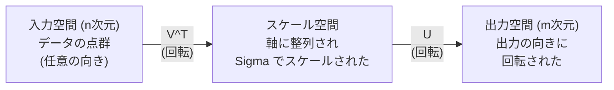
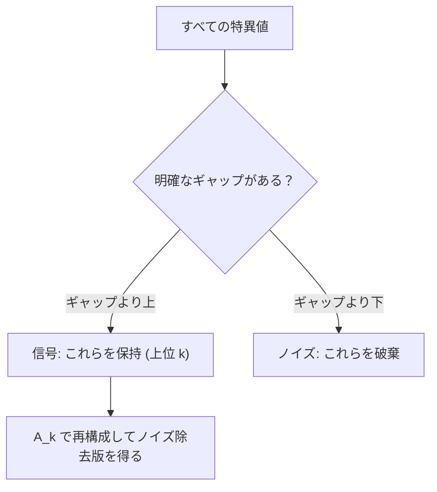

# 特異値分解

> SVD は線形代数のスイスアーミーナイフだ。すべての行列に存在し、すべてのデータサイエンティストが必要とする。

**タイプ:** Build
**言語:** Python, Julia
**前提条件:** Phase 1、レッスン 01（線形代数の直感）、02（ベクトルと行列の演算）、03（行列変換）
**所要時間:** 約120分

## 学習目標

- べき乗法により SVD を実装し、U、Sigma、V^T の幾何学的意味を説明する
- 切り詰め SVD を画像圧縮に適用し、圧縮率と再構成誤差を測定する
- SVD を用いて Moore-Penrose 擬似逆行列を計算し、過剰決定最小二乗系を解く
- SVD と PCA、推薦システム（潜在因子）、NLP における潜在的意味解析の関係を理解する

## 問題設定

1000x2000 の行列がある。ユーザーと映画の評価行列かもしれない。文書と単語の頻度表かもしれない。画像のピクセル値かもしれない。それを圧縮し、ノイズを除去し、隠れた構造を見つけ、あるいは最小二乗系を解く必要がある。固有値分解は正方行列にしか機能しない。しかもそれでも、行列が完全な線形独立固有ベクトルの集合を持つことが必要だ。

SVD はどんな行列にも機能する。どんな形状でも、どんなランクでも、条件なしで機能する。行列が空間に何をするかの幾何学を明らかにする3つの因子に行列を分解する。これは線形代数全体で最も汎用的で最も有用な因数分解だ。

## 概念

### SVD が幾何学的に行うこと

どんな行列も、形状に関係なく、回転・スケーリング・回転という3つの演算を順番に実行する。SVD はこの分解を明示的にする。

```
A = U * Sigma * V^T

      m x n     m x m    m x n    n x n
     (任意)   (回転)  (スケール)  (回転)
```

任意の行列 A が与えられると、SVD はそれを以下に因数分解する。
- V^T は入力空間（n次元）のベクトルを回転する
- Sigma は各軸に沿ってスケーリングする（伸縮する）
- U は結果を出力空間（m次元）に回転する



こう考えればよい。SVD に行列を渡すと、こう教えてくれる。「この行列は入力の球を受け取り、まず V^T で回転し、次に Sigma で楕円体に引き伸ばし、最後に U で楕円体を回転する」。特異値は楕円体の各軸の長さだ。

### 完全な分解

m x n の形状を持つ行列 A について：

```
A = U * Sigma * V^T

ここで：
  U     は m x m、直交行列 (U^T U = I)
  Sigma は m x n、対角行列（対角成分が特異値）
  V     は n x n、直交行列 (V^T V = I)

特異値 sigma_1 >= sigma_2 >= ... >= sigma_r > 0
ここで r = rank(A)
```

U の列を左特異ベクトルと呼ぶ。V の列を右特異ベクトルと呼ぶ。Sigma の対角成分を特異値と呼ぶ。特異値は常に非負で、慣例として降順にソートされている。

### 左特異ベクトル、特異値、右特異ベクトル

SVD の各構成要素は異なる幾何学的意味を持つ。

**右特異ベクトル（V の列）:** これらは入力空間（R^n）の正規直交基底を形成する。行列が出力空間の直交方向に写す入力空間の方向だ。定義域の自然な座標系だと考えればよい。

**特異値（Sigma の対角成分）:** これらはスケーリング因子だ。i 番目の特異値は、行列が i 番目の右特異ベクトル方向のベクトルをどれだけ伸縮するかを表す。ゼロの特異値は、行列がその方向を完全につぶしてしまうことを意味する。

**左特異ベクトル（U の列）:** これらは出力空間（R^m）の正規直交基底を形成する。i 番目の左特異ベクトルは、i 番目の右特異ベクトルが（スケーリング後に）写る出力空間の方向だ。

それらの関係：

```
A * v_i = sigma_i * u_i

行列 A は i 番目の右特異ベクトル v_i を受け取り、
sigma_i でスケールして i 番目の左特異ベクトル u_i に写す。
```

これにより、任意の行列が何をするかを座標ごとに把握できる。

### 外積形式

SVD はランク1行列の和として書ける：

```
A = sigma_1 * u_1 * v_1^T + sigma_2 * u_2 * v_2^T + ... + sigma_r * u_r * v_r^T

各項 sigma_i * u_i * v_i^T はランク1行列（外積）。
完全な行列は r 個のそのような行列の和であり、r はランク。
```

この形式は低ランク近似の基礎だ。各項は1層の構造を加える。最初の項は最も重要なパターンを捉える。2番目は次に重要なものを捉える。そして続く。この和を打ち切ると、任意のランクで可能な限り最良の近似が得られる。

```
ランク1近似:    A_1 = sigma_1 * u_1 * v_1^T
                  (支配的なパターンを捉える)

ランク2近似:    A_2 = sigma_1 * u_1 * v_1^T + sigma_2 * u_2 * v_2^T
                  (最も重要な2つのパターンを捉える)

ランク k 近似:  A_k = 上位 k 項の和
                  (Eckart-Young の定理により最適)
```

### 固有値分解との関係

SVD と固有値分解は深く関連している。A の特異値とベクトルは、A^T A と A A^T の固有値と固有ベクトルから直接得られる。

```
A^T A = V * Sigma^T * U^T * U * Sigma * V^T
      = V * Sigma^T * Sigma * V^T
      = V * D * V^T

ここで D = Sigma^T * Sigma は対角成分に sigma_i^2 を持つ対角行列。

したがって：
- 右特異ベクトル（V）は A^T A の固有ベクトル
- 特異値の二乗（sigma_i^2）は A^T A の固有値

同様に：
A A^T = U * Sigma * V^T * V * Sigma^T * U^T
      = U * Sigma * Sigma^T * U^T

したがって：
- 左特異ベクトル（U）は A A^T の固有ベクトル
- A A^T の固有値も sigma_i^2
```

この関係から3つのことがわかる。
1. 特異値は常に実数かつ非負だ（半正定値行列の固有値の平方根）。
2. A^T A の固有値分解で SVD を計算することも可能だが、条件数を二乗してしまい数値精度が失われる。専用の SVD アルゴリズムはこれを避けている。
3. A が正方かつ対称半正定値の場合、SVD と固有値分解は同じものになる。

### 切り詰め SVD：低ランク近似

Eckart-Young-Mirsky の定理は、A の最良ランク k 近似（Frobenius ノルムとスペクトルノルムの両方で）は、上位 k 個の特異値とそれに対応するベクトルだけを保持することで得られると述べている：

```
A_k = U_k * Sigma_k * V_k^T

ここで：
  U_k     は m x k  (U の最初の k 列)
  Sigma_k は k x k  (Sigma の左上 k x k ブロック)
  V_k     は n x k  (V の最初の k 列)

近似誤差 = sigma_{k+1}  (スペクトルノルムで)
         = sqrt(sigma_{k+1}^2 + ... + sigma_r^2)  (Frobenius ノルムで)
```

これは単に「良い」近似ではない。ランク k として証明可能な最良の近似だ。他のどのランク k 行列も A により近くはない。

| 成分 | 相対的な大きさ | ランク3近似で保持？ |
|-----------|-------------------|------------------------|
| sigma_1 | 最大 | はい |
| sigma_2 | 大 | はい |
| sigma_3 | 中〜大 | はい |
| sigma_4 | 中 | いいえ（誤差） |
| sigma_5 | 中〜小 | いいえ（誤差） |
| sigma_6 | 小 | いいえ（誤差） |
| sigma_7 | 非常に小 | いいえ（誤差） |
| sigma_8 | 微小 | いいえ（誤差） |

上位3個を保持：A_3 は3つの最大特異値を捉える。誤差 = 残りの値（sigma_4 から sigma_8）。

特異値が急速に減衰する場合、小さな k で行列の大部分を捉えられる。緩やかに減衰する場合、行列に低ランク構造はない。

### SVD による画像圧縮

グレースケール画像はピクセル輝度の行列だ。800x600 の画像には 480,000 個の値がある。SVD を使えば、はるかに少ない値で近似できる。

```
元の画像: 800 x 600 = 480,000 値

ランク k の SVD:
  U_k:      800 x k 値
  Sigma_k:  k 値
  V_k:      600 x k 値
  合計:     k * (800 + 600 + 1) = k * 1401 値

  k=10:   14,010 値   (元の 2.9%)
  k=50:   70,050 値  (元の 14.6%)
  k=100: 140,100 値  (元の 29.2%)

  k が小さいほど圧縮率は上がるが、
  視覚的品質は低下する。
```

重要な洞察：自然画像は特異値が急速に減衰する。最初の数個の特異値が広い構造（形状、グラデーション）を捉える。後の特異値は細部とノイズを捉える。ランク 50 で打ち切ると、85% 少ないストレージを使いながら元と視覚的にほぼ同じ画像が得られることが多い。

### 推薦システムへの SVD の応用

Netflix Prize がこれを有名にした。ほとんどのエントリが欠けているユーザーと映画の評価行列がある。

```
             Movie1  Movie2  Movie3  Movie4  Movie5
  User1      [  5      ?       3       ?       1  ]
  User2      [  ?      4       ?       2       ?  ]
  User3      [  3      ?       5       ?       ?  ]
  User4      [  ?      ?       ?       4       3  ]

  ? = 未知の評価
```

アイデア：この評価行列は低ランクだ。ユーザーの好みは完全に独立してはいない。ほとんどの好みを説明するいくつかの潜在因子（アクション対ドラマ、旧作対新作、知的対感情的）がある。

（補完された）評価行列への SVD はこれを分解する：
- U：潜在因子空間におけるユーザープロファイル
- Sigma：各潜在因子の重要度
- V^T：潜在因子空間における映画プロファイル

あるユーザーの映画への予測評価は、そのユーザープロファイルと映画プロファイルの内積（特異値で重み付け）だ。低ランク近似が欠けているエントリを補完する。

実際には、欠損データを直接扱う Simon Funk の増分 SVD や ALS（交互最小二乗法）のような変形を使う。しかしコアアイデアは同じだ：SVD による潜在因子分解。

### NLP における SVD：潜在的意味解析

潜在的意味解析（LSA）、潜在的意味索引（LSI）とも呼ばれるが、これは単語-文書行列に SVD を適用する。

```
             Doc1   Doc2   Doc3   Doc4
  "cat"      [  3      0      1      0  ]
  "dog"      [  2      0      0      1  ]
  "fish"     [  0      4      1      0  ]
  "pet"      [  1      1      1      1  ]
  "ocean"    [  0      3      0      0  ]

ランク k=2 で SVD 後：

  各文書は2次元の「概念空間」の点になる。
  各単語も同じ2次元空間の点になる。
  類似したトピックの文書はまとまる。
  意味が似た単語はまとまる。

  "cat" と "dog" は近くになる（陸上のペット）。
  "fish" と "ocean" は近くになる（水に関する概念）。
  Doc1 と Doc3 は類似トピックを共有すればまとまる。
```

LSA は生のテキストから意味的類似性を捉える最初の成功した手法の一つだった。同義語的な単語は類似した文書に現れる傾向があるため、SVD がそれらを同じ潜在次元にグループ化するからうまくいく。現代の単語埋め込み（Word2Vec、GloVe）はこのアイデアの子孫と見なせる。

### SVD によるノイズ除去

ノイズのあるデータは、信号が上位の特異値に集中し、ノイズがすべての特異値に分散している。打ち切りはノイズフロアを除去する。

**クリーンな信号の特異値：**

| 成分 | 大きさ | 種類 |
|-----------|-----------|------|
| sigma_1 | 非常に大 | 信号 |
| sigma_2 | 大 | 信号 |
| sigma_3 | 中 | 信号 |
| sigma_4 | ほぼゼロ | 無視可能 |
| sigma_5 | ほぼゼロ | 無視可能 |

**ノイズありの信号の特異値（ノイズがすべてに加算）：**

| 成分 | 大きさ | 種類 |
|-----------|-----------|------|
| sigma_1 | 非常に大 | 信号 |
| sigma_2 | 大 | 信号 |
| sigma_3 | 中 | 信号 |
| sigma_4 | 小 | ノイズ |
| sigma_5 | 小 | ノイズ |
| sigma_6 | 小 | ノイズ |
| sigma_7 | 小 | ノイズ |



これは信号処理、科学的測定、データクリーニングで使われる。加算ノイズで汚染された行列があれば、切り詰め SVD は信号とノイズを分離する理論的な方法だ。

### SVD による擬似逆行列

Moore-Penrose 擬似逆行列 A+ は、非正方行列や特異行列への行列の逆の概念を一般化する。SVD はその計算を簡単にする。

```
A = U * Sigma * V^T の場合：

A+ = V * Sigma+ * U^T

ここで Sigma+ は次のように構成される：
  1. Sigma を転置する（行と列を入れ替える）
  2. 各非ゼロ対角成分 sigma_i を 1/sigma_i に置き換える
  3. ゼロはゼロのまま

A (m x n) に対して：      A+ は (n x m)
Sigma (m x n) に対して：  Sigma+ は (n x m)
```

擬似逆行列は最小二乗問題を解く。Ax = b が厳密な解を持たない場合（過剰決定系）、x = A+ b は最小二乗解（||Ax - b|| を最小化）だ。

```
過剰決定系（未知数より多い方程式）：

  [1  1]         [3]
  [2  1] x   =   [5]       厳密な解は存在しない。
  [3  1]         [6]

  x_ls = A+ b = V * Sigma+ * U^T * b

  これは残差の二乗和を最小化する x を与える。
  正規方程式 (A^T A)^(-1) A^T b と同じ結果だが、
  数値的により安定している。
```

### 数値安定性の利点

A^T A の固有値分解を計算すると特異値を二乗してしまう（A^T A の固有値は sigma_i^2）。これにより条件数が二乗され、数値誤差が増幅される。

```
例：
  A の特異値は [1000, 1, 0.001]
  A の条件数: 1000 / 0.001 = 10^6

  A^T A の固有値は [10^6, 1, 10^{-6}]
  A^T A の条件数: 10^6 / 10^{-6} = 10^{12}

  SVD を直接計算: 条件数 10^6 で動作
  A^T A 経由で計算: 条件数 10^{12} で動作
                    (6桁の精度が失われる)
```

現代の SVD アルゴリズム（Golub-Kahan 二対角化）は直接 A で動作し、A^T A を形成しない。だから常に `np.linalg.eig(A.T @ A)` より `np.linalg.svd(A)` を優先すべきだ。

### PCA との関係

PCA は中心化されたデータへの SVD そのものだ。これは類推ではない。文字通り同じ計算だ。

```
データ行列 X（n_samples x n_features）、中心化済み（平均を引いた）：

共分散行列: C = (1/(n-1)) * X^T X

PCA は C の固有ベクトルを見つける。しかし：

  X = U * Sigma * V^T    (X の SVD)

  X^T X = V * Sigma^2 * V^T

  C = (1/(n-1)) * V * Sigma^2 * V^T

したがって主成分はまさしく右特異ベクトル V だ。
各成分の説明分散は sigma_i^2 / (n-1)。

sklearn の PCA は固有値分解ではなく SVD で実装されている。
より高速で数値的により安定している。
```

これはレッスン 10 で学んだ次元削減のすべてが、内部では SVD であることを意味する。PCA は機械学習における SVD の最も一般的な応用だ。

## 実装する

### ステップ 1: べき乗法によるゼロからの SVD

アイデア：最大の特異値とそのベクトルを見つけるために、A^T A（または A A^T）に対してべき乗法を使う。次に行列をデフレートして次の特異値について繰り返す。

```python
import numpy as np

def power_iteration(M, num_iters=100):
    n = M.shape[1]
    v = np.random.randn(n)
    v = v / np.linalg.norm(v)

    for _ in range(num_iters):
        Mv = M @ v
        v = Mv / np.linalg.norm(Mv)

    eigenvalue = v @ M @ v
    return eigenvalue, v

def svd_from_scratch(A, k=None):
    m, n = A.shape
    if k is None:
        k = min(m, n)

    sigmas = []
    us = []
    vs = []

    A_residual = A.copy().astype(float)

    for _ in range(k):
        AtA = A_residual.T @ A_residual
        eigenvalue, v = power_iteration(AtA, num_iters=200)

        if eigenvalue < 1e-10:
            break

        sigma = np.sqrt(eigenvalue)
        u = A_residual @ v / sigma

        sigmas.append(sigma)
        us.append(u)
        vs.append(v)

        A_residual = A_residual - sigma * np.outer(u, v)

    U = np.column_stack(us) if us else np.empty((m, 0))
    S = np.array(sigmas)
    V = np.column_stack(vs) if vs else np.empty((n, 0))

    return U, S, V
```

### ステップ 2: NumPy との比較テスト

```python
np.random.seed(42)
A = np.random.randn(5, 4)

U_ours, S_ours, V_ours = svd_from_scratch(A)
U_np, S_np, Vt_np = np.linalg.svd(A, full_matrices=False)

print("Our singular values:", np.round(S_ours, 4))
print("NumPy singular values:", np.round(S_np, 4))

A_reconstructed = U_ours @ np.diag(S_ours) @ V_ours.T
print(f"Reconstruction error: {np.linalg.norm(A - A_reconstructed):.8f}")
```

### ステップ 3: 画像圧縮デモ

```python
def compress_image_svd(image_matrix, k):
    U, S, Vt = np.linalg.svd(image_matrix, full_matrices=False)
    compressed = U[:, :k] @ np.diag(S[:k]) @ Vt[:k, :]
    return compressed

image = np.random.seed(42)
rows, cols = 200, 300
image = np.random.randn(rows, cols)

for k in [1, 5, 10, 20, 50]:
    compressed = compress_image_svd(image, k)
    error = np.linalg.norm(image - compressed) / np.linalg.norm(image)
    original_size = rows * cols
    compressed_size = k * (rows + cols + 1)
    ratio = compressed_size / original_size
    print(f"k={k:>3d}  error={error:.4f}  storage={ratio:.1%}")
```

### ステップ 4: ノイズ除去

```python
np.random.seed(42)
clean = np.outer(np.sin(np.linspace(0, 4*np.pi, 100)),
                 np.cos(np.linspace(0, 2*np.pi, 80)))
noise = 0.3 * np.random.randn(100, 80)
noisy = clean + noise

U, S, Vt = np.linalg.svd(noisy, full_matrices=False)
denoised = U[:, :5] @ np.diag(S[:5]) @ Vt[:5, :]

print(f"Noisy error:    {np.linalg.norm(noisy - clean):.4f}")
print(f"Denoised error: {np.linalg.norm(denoised - clean):.4f}")
print(f"Improvement:    {(1 - np.linalg.norm(denoised - clean) / np.linalg.norm(noisy - clean)):.1%}")
```

### ステップ 5: 擬似逆行列

```python
A = np.array([[1, 1], [2, 1], [3, 1]], dtype=float)
b = np.array([3, 5, 6], dtype=float)

U, S, Vt = np.linalg.svd(A, full_matrices=False)
S_inv = np.diag(1.0 / S)
A_pinv = Vt.T @ S_inv @ U.T

x_svd = A_pinv @ b
x_lstsq = np.linalg.lstsq(A, b, rcond=None)[0]
x_pinv = np.linalg.pinv(A) @ b

print(f"SVD pseudoinverse solution:  {x_svd}")
print(f"np.linalg.lstsq solution:   {x_lstsq}")
print(f"np.linalg.pinv solution:    {x_pinv}")
```

## 動かす

完全な動作デモは `code/svd.py` にある。実行すると、SVD が画像圧縮、推薦システム、潜在的意味解析、ノイズ除去に適用される様子を確認できる。

```bash
python svd.py
```

`code/svd.jl` の Julia バージョンは、Julia ネイティブの `svd()` 関数と `LinearAlgebra` パッケージを使って同じ概念を示している。

```bash
julia svd.jl
```

## 成果物

このレッスンで生成するもの：
- `outputs/skill-svd.md` - 実際のプロジェクトで SVD をいつどのように適用するかのスキルガイド

## 演習

1. べき乗法を使わずにゼロから完全な SVD を実装する。代わりに A^T A の固有値分解で V と特異値を求め、次に U = A V Sigma^{-1} を計算する。べき乗法バージョンと NumPy との数値精度を比較する。

2. 実際のグレースケール画像を読み込む（またはグレースケールに変換する）。ランク 1、5、10、25、50、100 で圧縮する。各ランクで圧縮率と相対誤差を計算する。画像が視覚的に許容できるランクを見つける。

3. 小さな推薦システムを構築する。いくつかの既知エントリを持つ 10x8 のユーザーと映画の評価行列を作成する。欠けているエントリを行の平均で補完する。SVD を計算してランク3近似を再構成する。再構成行列を使って欠けている評価を予測する。予測が妥当であることを確認する。

4. 3つの合成トピックを持つ 100x50 の文書-単語行列を作成する。各トピックには5つの関連単語がある。ノイズを加える。SVD を適用し、上位3つの特異値が残りよりはるかに大きいことを確認する。文書を3次元の潜在空間に射影し、同じトピックの文書がまとまることを確認する。

5. クリーンな低ランク行列（ランク3、サイズ 50x40）を生成し、異なるレベルのガウスノイズ（sigma = 0.1、0.5、1.0、2.0）を加える。各ノイズレベルで、k を 1 から 40 まで変えてクリーンな行列に対する再構成誤差を測定し、最適な打ち切りランクを見つける。最適な k がノイズレベルによってどう変わるかをプロットする。

## 重要用語

| 用語 | よく言われること | 実際の意味 |
|------|----------------|----------------------|
| SVD | 「任意の行列を因数分解する」 | A を U Sigma V^T に分解する。U と V は直交行列で Sigma は非負成分を持つ対角行列。任意の形状の行列に機能する。 |
| 特異値 | 「この成分の重要度」 | Sigma の i 番目の対角成分。行列が i 番目の主方向にどれだけ引き伸ばすかを測る。常に非負で降順にソートされている。 |
| 左特異ベクトル | 「出力方向」 | U の列。i 番目の右特異ベクトルが（sigma_i でスケール後に）写る出力空間の方向。 |
| 右特異ベクトル | 「入力方向」 | V の列。行列が i 番目の左特異ベクトルに写す（sigma_i でスケール後）入力空間の方向。 |
| 切り詰め SVD | 「低ランク近似」 | 上位 k 個の特異値とそのベクトルだけを保持する。元の行列に対して証明可能な最良のランク k 近似を生成する（Eckart-Young の定理）。 |
| ランク | 「真の次元数」 | 非ゼロ特異値の個数。行列が実際に使う独立した方向の数を教えてくれる。 |
| 擬似逆行列 | 「一般化逆行列」 | V Sigma+ U^T。非ゼロ特異値を逆数にし、ゼロはゼロのままにする。非正方行列や特異行列の最小二乗問題を解く。 |
| 条件数 | 「誤差への感度」 | sigma_max / sigma_min。条件数が大きいと、入力の小さな変化が出力の大きな変化を引き起こす。SVD はこれを直接明らかにする。 |
| 潜在因子 | 「隠れた変数」 | SVD が発見した低ランク空間の次元。推薦システムでは潜在因子がジャンルの好みに対応するかもしれない。NLP ではトピックに対応するかもしれない。 |
| Frobenius ノルム | 「行列全体の大きさ」 | 成分の二乗和の平方根。特異値の二乗和の平方根に等しい。近似誤差の測定に使われる。 |
| Eckart-Young の定理 | 「SVD が最良の圧縮を与える」 | 任意の目標ランク k に対して、切り詰め SVD はすべての可能なランク k 行列の中で近似誤差を最小化する。 |
| べき乗法 | 「最大の固有ベクトルを見つける」 | ランダムベクトルを行列に繰り返し掛けて正規化する。最大固有値を持つ固有ベクトルに収束する。多くの SVD アルゴリズムの基礎となる。 |

## 参考資料

- [Gilbert Strang: Linear Algebra and Its Applications, Chapter 7](https://math.mit.edu/~gs/linearalgebra/) - 応用を含む SVD の詳細な解説
- [3Blue1Brown: But what is the SVD?](https://www.youtube.com/watch?v=vSczTbgc8Rc) - SVD の幾何学的直感
- [We Recommend a Singular Value Decomposition](https://www.ams.org/publicoutreach/feature-column/fcarc-svd) - アメリカ数学会によるわかりやすい概説
- [Netflix Prize and Matrix Factorization](https://sifter.org/~simon/journal/20061211.html) - 推薦システムへの SVD に関する Simon Funk のオリジナルブログ記事
- [Latent Semantic Analysis](https://en.wikipedia.org/wiki/Latent_semantic_analysis) - SVD の最初の NLP 応用
- [Numerical Linear Algebra by Trefethen and Bau](https://people.maths.ox.ac.uk/trefethen/text.html) - SVD アルゴリズムとその数値特性を理解するための定番書
