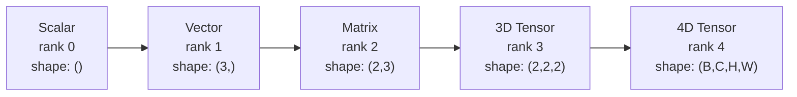
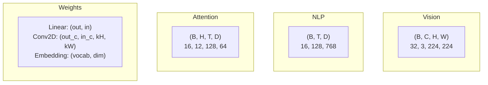
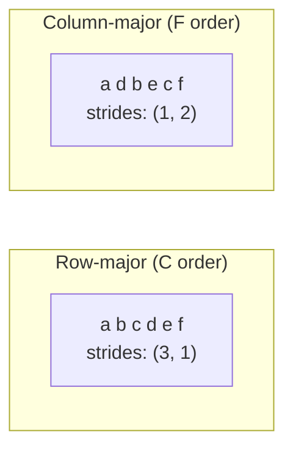
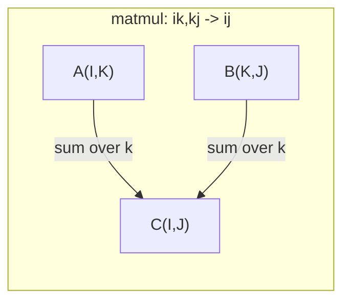

# テンソル演算

> テンソルはデータと深層学習をつなぐ共通言語だ。すべての画像、すべての文、すべての勾配がテンソルを流れる。

**タイプ:** Build
**言語:** Python
**前提条件:** フェーズ1、レッスン01（線形代数の直感）、02（ベクトル・行列と演算）
**所要時間:** 約90分

## 学習目標

- shape・strides・reshape・transpose・要素ごとの演算を持つテンソルクラスをゼロから実装する
- データをコピーせずに異なる shape のテンソルを操作するブロードキャストのルールを適用する
- ドット積・行列乗算・外積・バッチ演算に対する einsum 式を記述する
- マルチヘッドアテンションの各ステップにおけるテンソルの shape を正確に追跡する

## 問題

トランスフォーマーを構築する。フォワードパスはきれいに見える。実行すると `RuntimeError: mat1 and mat2 shapes cannot be multiplied (32x768 and 512x768)` というエラーが出る。shape を眺める。転置を試みる。今度は `Expected 4D input (got 3D input)` と表示される。unsqueeze を追加する。別の箇所が壊れる。

shape エラーは深層学習コードで最も多いバグだ。概念的には難しくない――各演算には shape の契約がある――しかし連鎖的に増殖する。トランスフォーマーには dozens の reshape・transpose・broadcast が連なっている。軸を一つ間違えるとエラーが連鎖する。さらに厄介なのは、shape のミスがエラーを出さないケースもあることだ。間違った次元にブロードキャストしたり、間違った軸で合計したりして、無音でゴミを生成してしまう。

行列は2つの集合間のペアワイズな関係を扱う。実際のデータは2次元には収まらない。224x224 の RGB 画像32枚のバッチは4次元テンソル `(32, 3, 224, 224)` だ。12ヘッドのセルフアテンションも4次元 `(batch, heads, seq_len, head_dim)` だ。任意の次元数に汎化でき、すべての次元にまたがって演算がきれいに組み合わさるデータ構造が必要だ。それがテンソルだ。テンソルの演算をマスターすれば、shape エラーは簡単にデバッグできるようになる。

## 概念

### テンソルとは何か

テンソルは均一なデータ型を持つ多次元数値配列だ。次元の数を**ランク**（または**オーダー**）という。各次元を**軸**という。**shape** は各軸のサイズを並べたタプルだ。



全要素数 = 全サイズの積。shape `(2, 3, 4)` は `2 * 3 * 4 = 24` 個の要素を持つ。

### 深層学習におけるテンソルの shape

データの種類によって、慣例として特定のテンソル shape が対応する。



PyTorch は NCHW（チャネルファースト）を使う。TensorFlow のデフォルトは NHWC（チャネルラスト）だ。レイアウトが食い違うと無音で遅くなったりエラーが出たりする。

### メモリレイアウトの仕組み

メモリ上の2次元配列は1次元のバイト列だ。**ストライド**は各軸に沿って1ステップ進むために何要素スキップするかを示す。



転置はデータを移動しない。ストライドを入れ替えるだけで、テンソルは**非連続**になる――行の要素がメモリ上で隣接しなくなる。

### ブロードキャストのルール

ブロードキャストはデータをコピーせずに異なる shape のテンソルを操作できるようにする。shape を右端から揃える。2つの次元は等しいか、一方が1のとき互換性がある。次元が少ない方は左側に1が補填される。

```
Tensor A:     (8, 1, 6, 1)
Tensor B:        (7, 1, 5)
Padded B:     (1, 7, 1, 5)
Result:       (8, 7, 6, 5)
```

### Einsum: 汎用テンソル演算

アインシュタイン縮約は各軸に文字のラベルを付ける。入力にあって出力にない軸は合計される。両方にある軸は保持される。



主要なパターン: `i,i->` (ドット積), `i,j->ij` (外積), `ii->` (トレース), `ij->ji` (転置), `bij,bjk->bik` (バッチ行列乗算), `bhtd,bhsd->bhts` (アテンションスコア)。

## 実装する

コードは `code/tensors.py` にある。各ステップはそこの実装を参照している。

### ステップ1: テンソルのストレージとストライド

テンソルは数値のフラットリストと shape のメタデータを格納する。ストライドはインデックスのロジックが多次元インデックスをフラット位置にマッピングする方法を示す。

```python
class Tensor:
    def __init__(self, data, shape=None):
        if isinstance(data, (list, tuple)):
            self._data, self._shape = self._flatten_nested(data)
        elif isinstance(data, np.ndarray):
            self._data = data.flatten().tolist()
            self._shape = tuple(data.shape)
        else:
            self._data = [data]
            self._shape = ()

        if shape is not None:
            total = reduce(lambda a, b: a * b, shape, 1)
            if total != len(self._data):
                raise ValueError(
                    f"Cannot reshape {len(self._data)} elements into shape {shape}"
                )
            self._shape = tuple(shape)

        self._strides = self._compute_strides(self._shape)

    @staticmethod
    def _compute_strides(shape):
        if len(shape) == 0:
            return ()
        strides = [1] * len(shape)
        for i in range(len(shape) - 2, -1, -1):
            strides[i] = strides[i + 1] * shape[i + 1]
        return tuple(strides)
```

shape `(3, 4)` に対してストライドは `(4, 1)` になる――1行進むには4要素スキップし、1列進むには1要素スキップする。

### ステップ2: Reshape・squeeze・unsqueeze

Reshape は要素の順序を変えずに shape を変える。要素の総数は同じでなければならない。サイズを推論する次元には `-1` を使う。

```python
t = Tensor(list(range(12)), shape=(2, 6))
r = t.reshape((3, 4))
r = t.reshape((-1, 3))
```

Squeeze はサイズ1の軸を取り除く。Unsqueeze は軸を1つ挿入する。Unsqueeze はブロードキャストに欠かせない――バッチ `(B, T, D)` に加えるバイアスベクトル `(D,)` は `(1, 1, D)` に unsqueeze する必要がある。

```python
t = Tensor(list(range(6)), shape=(1, 3, 1, 2))
s = t.squeeze()
v = Tensor([1, 2, 3])
u = v.unsqueeze(0)
```

### ステップ3: 転置とパーミュート

転置は2つの軸を入れ替える。パーミュートはすべての軸を並べ替える。これが NCHW と NHWC を相互変換する方法だ。

```python
mat = Tensor(list(range(6)), shape=(2, 3))
tr = mat.transpose(0, 1)

t4d = Tensor(list(range(24)), shape=(1, 2, 3, 4))
perm = t4d.permute((0, 2, 3, 1))
```

転置やパーミュートの後、テンソルはメモリ上で非連続になる。PyTorch では `view` は非連続テンソルに対して失敗する――`reshape` を使うか、先に `.contiguous()` を呼び出すこと。

### ステップ4: 要素ごとの演算と集約

要素ごとの演算（加算・乗算・減算）は各要素に独立して適用され、shape を保持する。集約（sum・mean・max）は1つ以上の軸を折り畳む。

```python
a = Tensor([[1, 2], [3, 4]])
b = Tensor([[10, 20], [30, 40]])
c = a + b
d = a * 2
s = a.sum(axis=0)
```

CNN のグローバル平均プーリング: `(B, C, H, W).mean(axis=[2, 3])` は `(B, C)` を生成する。NLP のシーケンス平均プーリング: `(B, T, D).mean(axis=1)` は `(B, D)` を生成する。

### ステップ5: NumPy でのブロードキャスト

`tensors.py` の `demo_broadcasting_numpy()` 関数がコアパターンを示している。

```python
activations = np.random.randn(4, 3)
bias = np.array([0.1, 0.2, 0.3])
result = activations + bias

images = np.random.randn(2, 3, 4, 4)
scale = np.array([0.5, 1.0, 1.5]).reshape(1, 3, 1, 1)
result = images * scale

a = np.array([1, 2, 3]).reshape(-1, 1)
b = np.array([10, 20, 30, 40]).reshape(1, -1)
outer = a * b
```

ブロードキャストを使ったペアワイズ距離: `(M, 2)` を `(M, 1, 2)` に、`(N, 2)` を `(1, N, 2)` に reshape し、引き算・二乗・最後の軸での合計・平方根を取る。結果: `(M, N)`。

### ステップ6: Einsum 演算

`demo_einsum()` と `demo_einsum_gallery()` 関数がすべての一般的なパターンを網羅している。

```python
a = np.array([1.0, 2.0, 3.0])
b = np.array([4.0, 5.0, 6.0])
dot = np.einsum("i,i->", a, b)

A = np.array([[1, 2], [3, 4], [5, 6]], dtype=float)
B = np.array([[7, 8, 9], [10, 11, 12]], dtype=float)
matmul = np.einsum("ik,kj->ij", A, B)

batch_A = np.random.randn(4, 3, 5)
batch_B = np.random.randn(4, 5, 2)
batch_mm = np.einsum("bij,bjk->bik", batch_A, batch_B)
```

縮約の計算コストは全インデックスサイズ（保持されるものと合計されるもの）の積だ。`bij,bjk->bik` で B=32, I=128, J=64, K=128 の場合: `32 * 128 * 64 * 128 = 33,554,432` 回の乗算加算。

### ステップ7: einsum を使ったアテンション機構

`demo_attention_einsum()` 関数がマルチヘッドアテンションをエンドツーエンドで実装している。

```python
B, H, T, D = 2, 4, 8, 16
E = H * D

X = np.random.randn(B, T, E)
W_q = np.random.randn(E, E) * 0.02

Q = np.einsum("bte,ek->btk", X, W_q)
Q = Q.reshape(B, T, H, D).transpose(0, 2, 1, 3)

scores = np.einsum("bhtd,bhsd->bhts", Q, K) / np.sqrt(D)
weights = softmax(scores, axis=-1)
attn_output = np.einsum("bhts,bhsd->bhtd", weights, V)

concat = attn_output.transpose(0, 2, 1, 3).reshape(B, T, E)
output = np.einsum("bte,ek->btk", concat, W_o)
```

すべてのステップがテンソル演算だ: 射影（einsum による行列乗算）、ヘッド分割（reshape + transpose）、アテンションスコア（einsum によるバッチ行列乗算）、重み付き和（einsum によるバッチ行列乗算）、ヘッド統合（transpose + reshape）、出力射影（einsum による行列乗算）。

## 使う

### スクラッチ vs NumPy

| 演算 | スクラッチ（Tensor クラス） | NumPy |
|---|---|---|
| 生成 | `Tensor([[1,2],[3,4]])` | `np.array([[1,2],[3,4]])` |
| Reshape | `t.reshape((3,4))` | `a.reshape(3,4)` |
| 転置 | `t.transpose(0,1)` | `a.T` または `a.transpose(0,1)` |
| Squeeze | `t.squeeze(0)` | `np.squeeze(a, 0)` |
| Sum | `t.sum(axis=0)` | `a.sum(axis=0)` |
| Einsum | なし | `np.einsum("ij,jk->ik", a, b)` |

### スクラッチ vs PyTorch

```python
import torch

t = torch.tensor([[1, 2, 3], [4, 5, 6]], dtype=torch.float32)
t.shape
t.stride()
t.is_contiguous()

t.reshape(3, 2)
t.unsqueeze(0)
t.transpose(0, 1)
t.transpose(0, 1).contiguous()

torch.einsum("ik,kj->ij", A, B)
```

PyTorch は自動微分・GPU サポート・最適化された BLAS カーネルを追加している。shape のセマンティクスは同一だ。スクラッチ版を理解していれば、PyTorch の shape エラーが読めるようになる。

### テンソル演算としてのすべてのニューラルネットワーク層

| 演算 | テンソル形式 | Einsum |
|---|---|---|
| 線形層 | `Y = X @ W.T + b` | `"bd,od->bo"` + バイアス |
| アテンション QKV | `Q = X @ W_q` | `"btd,dh->bth"` |
| アテンションスコア | `Q @ K.T / sqrt(d)` | `"bhtd,bhsd->bhts"` |
| アテンション出力 | `softmax(scores) @ V` | `"bhts,bhsd->bhtd"` |
| バッチ正規化 | `(X - mu) / sigma * gamma` | 要素ごと + ブロードキャスト |
| Softmax | `exp(x) / sum(exp(x))` | 要素ごと + 集約 |

## 仕上げる

このレッスンでは再利用可能なプロンプトを2つ生成する:

1. **`outputs/prompt-tensor-shapes.md`** -- テンソルの shape のミスマッチをデバッグするための体系的なプロンプト。すべての一般的な演算（matmul・broadcast・cat・Linear・Conv2d・BatchNorm・softmax）の判断テーブルと修正ルックアップテーブルを含む。

2. **`outputs/prompt-tensor-debugger.md`** -- shape エラーで詰まったときに AI アシスタントに貼り付けるステップバイステップのデバッグプロンプト。エラーメッセージとテンソルの shape を入力すれば、正確な修正方法が返ってくる。

## 演習

1. **簡単 -- Reshape のラウンドトリップ。** shape `(2, 3, 4)` のテンソルを `(6, 4)` に reshape し、次に `(24,)` に、そして `(2, 3, 4)` に戻す。各ステップでフラットデータを出力して要素の順序が保持されていることを確認する。

2. **中級 -- ブロードキャストを実装する。** `Tensor` クラスに `broadcast_to(shape)` メソッドを追加して、サイズ1の次元をターゲット shape に合わせて拡張する。次に `_elementwise_op` を修正して演算の前に自動的にブロードキャストするようにする。shape `(3, 1)` と `(1, 4)` が `(3, 4)` を生成することをテストする。

3. **難しい -- einsum をゼロから構築する。** 少なくとも次を扱う基本的な `einsum(subscripts, *tensors)` 関数を実装する: ドット積 (`i,i->`)、行列乗算 (`ij,jk->ik`)、外積 (`i,j->ij`)、転置 (`ij->ji`)。添字文字列を解析し、縮約インデックスを特定し、すべてのインデックスの組み合わせをループする。結果を `np.einsum` と比較する。

4. **難しい -- アテンション shape トラッカー。** `batch_size`・`seq_len`・`embed_dim`・`num_heads` を入力として受け取り、マルチヘッドアテンションの各ステップ（入力・Q/K/V 射影・ヘッド分割・アテンションスコア・softmax 重み・重み付き和・ヘッド統合・出力射影）の正確な shape を出力する関数を記述する。`demo_attention_einsum()` の出力と照合して検証する。

## 重要用語

| 用語 | よく言われること | 実際の意味 |
|---|---|---|
| テンソル | 「次元が増えた行列」 | 均一な型と定義された shape・ストライド・演算を持つ多次元配列 |
| ランク | 「次元の数」 | 軸の数。行列はランク2であり、行列のランク（線形代数的な意味）とは異なる |
| Shape | 「テンソルのサイズ」 | 各軸のサイズを並べたタプル。`(2, 3)` は2行3列を意味する |
| ストライド | 「メモリのレイアウト方法」 | 各軸に沿って1ポジション進むためにスキップする要素数 |
| ブロードキャスト | 「shape が違っても動く」 | 厳密なルールの集合: 右端から揃え、次元は等しいか一方が1でなければならない |
| 連続 | 「テンソルが普通の状態」 | 論理レイアウトからギャップや並べ替えなしにメモリ上に順番に格納された要素 |
| Einsum | 「行列乗算の高度な書き方」 | あらゆるテンソル縮約・外積・トレース・転置を1行で表現する汎用記法 |
| ビュー | 「reshape と同じ」 | 同じメモリバッファを共有しながら異なる shape/ストライドのメタデータを持つテンソル。非連続データでは失敗する |
| 縮約 | 「インデックスで合計する」 | テンソル間で共有インデックスを乗算して合計し、より低いランクの結果を生成する一般的な演算 |
| NCHW / NHWC | 「PyTorch vs TensorFlow 形式」 | 画像テンソルのメモリレイアウト規則。NCHW はチャネルを空間次元の前に置き、NHWC は後ろに置く |

## 参考資料

- [NumPy Broadcasting](https://numpy.org/doc/stable/user/basics.broadcasting.html) -- 視覚的な例を含む公式ルール
- [PyTorch Tensor Views](https://pytorch.org/docs/stable/tensor_view.html) -- ビューが機能するときとコピーするとき
- [einops](https://github.com/arogozhnikov/einops) -- テンソルの reshape を読みやすく安全にするライブラリ
- [The Illustrated Transformer](https://jalammar.github.io/illustrated-transformer/) -- アテンションを流れるテンソルの shape を可視化
- [Einstein Summation in NumPy](https://numpy.org/doc/stable/reference/generated/numpy.einsum.html) -- 例を含む完全な einsum ドキュメント
