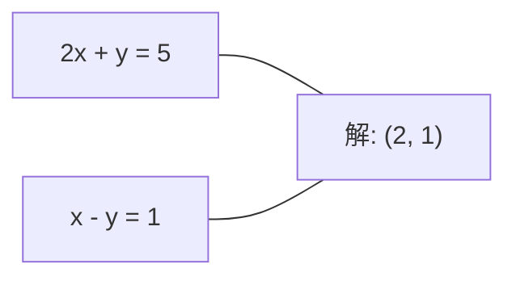
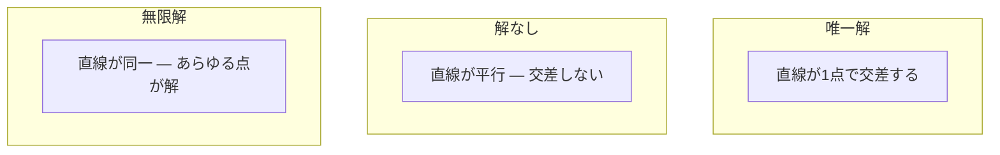

# 線形システム

> Ax = b を解くことは数学史上最古の問題であり、今もあなたのニューラルネットワークを動かしている。

**タイプ:** ビルド
**言語:** Python
**前提条件:** フェーズ1、レッスン01（線形代数の直感）、02（ベクトルと行列）、03（行列変換）
**時間:** 約120分

## 学習目標

- 部分ピボット選択と後退代入を用いたガウス消去法で Ax = b を解く
- LU、QR、Cholesky 分解で行列を因子分解し、それぞれの適切な使いどころを説明する
- 最小二乗法の正規方程式を導出し、線形回帰およびリッジ回帰との関係を示す
- 条件数を使って悪条件のシステムを診断し、正則化を適用して安定化させる

## 問題の背景

線形回帰を学習するたびに、あなたは線形システムを解いている。最小二乗フィットを計算するたびに、線形システムを解いている。ニューラルネットワークの層が `y = Wx + b` を計算するたびに、それは線形システムの一方の辺を評価している。正則化を加えるとシステムが変わる。ガウス過程を使うときは行列を因子分解する。マハラノビス距離のために共分散行列を逆行列にするとき、線形システムを解いている。

Ax = b という方程式はどこにでも現れる。A は既知の係数の行列。b は既知の出力のベクトル。x は求めたい未知変数のベクトル。線形回帰では、A はデータ行列、b は目的変数ベクトル、x は重みベクトルだ。モデル全体は次のように要約できる：Ax が b にできるだけ近くなるような x を求めよ。

このレッスンでは、その方程式を解くすべての主要な手法をゼロから構築する。一部の手法が速く、別の手法が安定している理由、正方系にしか使えない手法と過決定系にも対応する手法がある理由、そして行列の条件数があなたの答えの意味を左右する理由を理解できるようになる。

## 概念

### Ax = b の幾何学的意味

連立一次方程式には幾何学的な解釈がある。各方程式は超平面を定義する。解は、すべての超平面が交わる点（または点の集合）だ。

```
2x + y = 5          2次元上の2本の直線。
x - y  = 1          x=2, y=1 で交差する。
```



3つのケースが起こりうる：



行列形式では、「唯一解」は A が正則であることを意味する。「解なし」はシステムが矛盾していることを意味する。「無限解」は A に零空間があることを意味する。ほとんどの ML の問題は「正確な解なし」のカテゴリに該当する。なぜなら、未知数（パラメータ）より方程式（データ点）の方が多いからだ。そこで最小二乗法が登場する。

### 列の見方と行の見方

Ax = b を読む方法は2つある。

**行の見方。** A の各行が1つの方程式を定義する。各方程式は超平面だ。解はすべてが交わる場所にある。

**列の見方。** A の各列はベクトルだ。問いはこうなる：A の列のどんな線形結合が b を生み出すか？

```
A = | 2  1 |    b = | 5 |
    | 1 -1 |        | 1 |

行の見方: 2x + y = 5 と x - y = 1 を同時に解く。

列の見方: 次を満たす x1, x2 を求める:
  x1 * [2, 1] + x2 * [1, -1] = [5, 1]
  2 * [2, 1] + 1 * [1, -1] = [4+1, 2-1] = [5, 1]   確認。
```

列の見方の方が本質的だ。b が A の列空間にあれば、システムは解を持つ。b がなければ、列空間の中で最も近い点を探す。その最近点が最小二乗解だ。

### ガウス消去法

ガウス消去法は Ax = b を上三角システム Ux = c に変換し、後退代入で解く。最も直接的な手法だ。

アルゴリズム：

```
1. 各列 k（ピボット列）について:
   a. 列 k の k 行目以降で最大の要素を探す（部分ピボット選択）。
   b. その行を k 行目と入れ替える。
   c. k 行目より下の各行 i について:
      - 乗数 m = A[i][k] / A[k][k] を計算する
      - 行 i から m 倍した行 k を引く。
2. 後退代入: 最後の方程式から上向きに解く。
```

例：

```
元の行列:
| 2  1  1 | 8 |       R2 = R2 - (2)R1     | 2  1   1 |  8 |
| 4  3  3 |20 |  -->  R3 = R3 - (1)R1 --> | 0  1   1 |  4 |
| 2  3  1 |12 |                            | 0  2   0 |  4 |

                       R3 = R3 - (2)R2     | 2  1   1 |  8 |
                                       --> | 0  1   1 |  4 |
                                           | 0  0  -2 | -4 |

後退代入:
  -2 * x3 = -4    -->  x3 = 2
  x2 + 2  = 4     -->  x2 = 2
  2*x1 + 2 + 2 = 8 --> x1 = 2
```

ガウス消去法のコストは O(n^3) 演算。1000x1000 のシステムなら約10億回の浮動小数点演算。速いが、同じ A で複数のシステムを解く必要がある場合はより良い方法がある。

### 部分ピボット選択：なぜ重要か

ピボット選択なしでは、ガウス消去法は失敗するか、ゴミを出力する。ピボット要素がゼロなら、ゼロ除算が起きる。小さければ、丸め誤差を増幅する。

```
悪いピボット:                       部分ピボット選択あり:
| 0.001  1 | 1.001 |            まず行を入れ替える:
| 1      1 | 2     |            | 1      1 | 2     |
                                 | 0.001  1 | 1.001 |
m = 1/0.001 = 1000              m = 0.001/1 = 0.001
R2 = R2 - 1000*R1               R2 = R2 - 0.001*R1
| 0.001  1     | 1.001   |      | 1      1     | 2     |
| 0     -999   | -999.0  |      | 0      0.999 | 0.999 |

x2 = 1.000 (正解)               x2 = 1.000 (正解)
x1 = (1.001 - 1)/0.001          x1 = (2 - 1)/1 = 1.000 (正解)
   = 0.001/0.001 = 1.000        乗数が小さいため安定している。
```

精度に限りのある浮動小数点演算では、ピボット選択なしのバージョンは有効桁を失いうる。部分ピボット選択は、誤差の増幅を最小化するため、常に利用可能な最大のピボットを選ぶ。

### LU 分解

LU 分解は A を下三角行列 L と上三角行列 U に因子分解する：A = LU。L 行列はガウス消去法の乗数を保存する。U 行列は消去後の結果だ。

```
A = L @ U

| 2  1  1 |   | 1  0  0 |   | 2  1   1 |
| 4  3  3 | = | 2  1  0 | @ | 0  1   1 |
| 2  3  1 |   | 1  2  1 |   | 0  0  -2 |
```

なぜ消去だけでなく因子分解するのか？ L と U が手に入れば、新しい b に対して Ax = b を解くコストは O(n^2) だけになるからだ：

```
Ax = b
LUx = b
y = Ux とおく:
  Ly = b    (前進代入, O(n^2))
  Ux = y    (後退代入, O(n^2))
```

O(n^3) のコストは因子分解時に一度だけ払う。それ以降の各求解は O(n^2) だ。同じ A で異なる b ベクトルを持つ1000のシステムを解く必要がある場合、LU は総作業量を1000/3倍節約する。

部分ピボット選択を使うと PA = LU となり、P は行入れ替えを記録する置換行列だ。

### QR 分解

QR 分解は A を直交行列 Q と上三角行列 R に因子分解する：A = QR。

直交行列は Q^T Q = I という性質を持つ。その列は正規直交ベクトルだ。Q を掛けると長さと角度が保たれる。

```
A = Q @ R

Q は正規直交列を持つ: Q^T Q = I
R は上三角行列

Ax = b を解くには:
  QRx = b
  Rx = Q^T b    (Q^T を掛けるだけ、逆行列は不要)
  後退代入で x を求める。
```

QR は最小二乗問題を解く際に LU より数値的に安定している。グラム-シュミット法は Q を列ごとに構築する：

```
A の列 a1, a2, ... が与えられたとき:

q1 = a1 / ||a1||

q2 = a2 - (a2 . q1) * q1        (q1 への射影を引く)
q2 = q2 / ||q2||                (正規化)

q3 = a3 - (a3 . q1) * q1 - (a3 . q2) * q2
q3 = q3 / ||q3||

R[i][j] = qi . aj    for i <= j
```

各ステップでは、以前のすべての q ベクトル方向の成分を除去し、新しい直交方向だけを残す。

### Cholesky 分解

A が対称（A = A^T）かつ正定値（すべての固有値が正）のとき、A = L L^T（L は下三角行列）と因子分解できる。これが Cholesky 分解だ。

```
A = L @ L^T

| 4  2 |   | 2  0 |   | 2  1 |
| 2  5 | = | 1  2 | @ | 0  2 |

L[i][i] = sqrt(A[i][i] - sum(L[i][k]^2 for k < i))
L[i][j] = (A[i][j] - sum(L[i][k]*L[j][k] for k < j)) / L[j][j]    for i > j
```

Cholesky は LU の2倍速く、必要なメモリは半分だ。対称正定値行列にしか使えないが、それはいたるところに現れる：

- 共分散行列は対称半正定値（正則化すると正定値）。
- ガウス過程のカーネル行列は対称正定値。
- 凸関数の最小点でのヘッセ行列は対称正定値。
- A^T A は常に対称半正定値。

ガウス過程では、カーネル行列 K を Cholesky で因子分解し、K alpha = y を解いて予測平均を得る。Cholesky 因子はまた周辺尤度の対数行列式も与える：log det(K) = 2 * sum(log(diag(L)))。

### 最小二乗法：Ax = b に正確な解がないとき

A が m x n で m > n（未知数より方程式の方が多い）の場合、システムは過決定だ。正確な解は存在しない。代わりに、二乗誤差を最小化する：

```
minimize ||Ax - b||^2

これは残差の二乗和:
  sum((A[i,:] @ x - b[i])^2 for i in range(m))
```

最小化点は正規方程式を満たす：

```
A^T A x = A^T b
```

導出：||Ax - b||^2 = (Ax - b)^T (Ax - b) = x^T A^T A x - 2 x^T A^T b + b^T b を展開する。x に関する勾配を取ってゼロにセットする：2 A^T A x - 2 A^T b = 0。

```
元のシステム（過決定、方程式4つ、未知数2つ）:
| 1  1 |         | 3 |
| 1  2 | x     = | 5 |       4つの方程式をすべて満たす正確な x は存在しない。
| 1  3 |         | 6 |
| 1  4 |         | 8 |

正規方程式:
A^T A = | 4  10 |    A^T b = | 22 |
        | 10 30 |            | 63 |

解: x = [1.5, 1.7]

これが線形回帰だ。x[0] が切片、x[1] が傾き。
```

### 正規方程式 = 線形回帰

この対応は完全だ。線形回帰では、データ行列 X はサンプルごとに1行、特徴量ごとに1列を持つ。目的変数ベクトル y はサンプルごとに1エントリを持つ。重みベクトル w は次を満たす：

```
X^T X w = X^T y
w = (X^T X)^(-1) X^T y
```

これが線形回帰の閉形式解だ。`sklearn.linear_model.LinearRegression.fit()` へのすべての呼び出しは、これ（またはQRやSVD経由の同等のもの）を計算する。

行列に正則化項 lambda * I を加えるとリッジ回帰になる：

```
(X^T X + lambda * I) w = X^T y
w = (X^T X + lambda * I)^(-1) X^T y
```

正則化により行列の条件が改善され（より正確に逆行列を求めやすくなる）、重みをゼロに向けて縮小することで過学習が防がれる。lambda > 0 のとき X^T X + lambda * I は常に対称正定値なので、Cholesky で解ける。

### 擬似逆行列（Moore-Penrose）

擬似逆行列 A+ は、行列の逆行列を非正方行列や特異行列に一般化する。任意の行列 A に対して：

```
x = A+ b

ここで A+ = V Sigma+ U^T    (SVD で計算)
```

Sigma+ は各非ゼロ特異値の逆数を取り、結果を転置して形成される。A = U Sigma V^T なら、A+ = V Sigma+ U^T だ。

```
A = U Sigma V^T        (SVD)

Sigma = | 5  0 |       Sigma+ = | 1/5  0  0 |
        | 0  2 |                | 0  1/2  0 |
        | 0  0 |

A+ = V Sigma+ U^T
```

擬似逆行列は最小ノルム最小二乗解を与える。システムに：
- 唯一解がある場合：A+ b がそれを与える。
- 解がない場合：A+ b が最小二乗解を与える。
- 無限解がある場合：A+ b が最小の ||x|| を持つ解を与える。

NumPy の `np.linalg.lstsq` と `np.linalg.pinv` はどちらも内部で SVD を使う。

### 条件数

条件数は、入力の小さな変化に対して解がどれだけ敏感かを測る。行列 A の条件数は：

```
kappa(A) = ||A|| * ||A^(-1)|| = sigma_max / sigma_min
```

ここで sigma_max と sigma_min はそれぞれ最大と最小の特異値。

```
良条件 (kappa ~ 1):              悪条件 (kappa ~ 10^15):
b の小さな変化 -->               b の小さな変化 -->
x の小さな変化                   x の大きな変化

| 2  0 |   kappa = 2/1 = 2      | 1   1          |   kappa ~ 10^15
| 0  1 |   安全に解ける          | 1   1+10^(-15) |   解はゴミ
```

経験則：
- kappa < 100：安全、解は正確。
- kappa ~ 10^k：浮動小数点演算から約 k 桁の精度を失う。
- kappa ~ 10^16（float64 の場合）：解は無意味。行列は実質的に特異。

ML では、特徴量がほぼ線形従属のとき悪条件になる。正則化（lambda * I を加える）により条件数が sigma_max / sigma_min から (sigma_max + lambda) / (sigma_min + lambda) に改善される。

### 反復法：共役勾配法

非常に大きな疎システム（数百万の未知数）では、LU や Cholesky などの直接法は高コストすぎる。反復法は、多数のイテレーションで推定値を改良して解を近似する。

共役勾配法（CG）は A が対称正定値のとき Ax = b を解く。厳密な算術では最大 n 回のイテレーションで正確な解を見つけるが、A の固有値がクラスター化されていれば通常はるかに速く収束する。

```
アルゴリズムの概要:
  x0 = 初期推定値（しばしばゼロ）
  r0 = b - A x0           (残差)
  p0 = r0                 (探索方向)

  k = 0, 1, 2, ... について:
    alpha = (rk . rk) / (pk . A pk)
    x_{k+1} = xk + alpha * pk
    r_{k+1} = rk - alpha * A pk
    beta = (r_{k+1} . r_{k+1}) / (rk . rk)
    p_{k+1} = r_{k+1} + beta * pk
    if ||r_{k+1}|| < tolerance: 停止
```

CG は次で使われる：
- 大規模最適化（Newton-CG 法）
- PDE 離散化の求解
- カーネル行列が大きすぎて因子分解できないカーネル法
- 他の反復ソルバーの前処理

収束速度は条件数に依存する。良条件のシステムは速く収束する。これも正則化が役立つもう一つの理由だ。

### 全体像：どの手法をいつ使うか

| 手法 | 要件 | コスト | ユースケース |
|--------|-------------|------|----------|
| ガウス消去法 | 正方かつ非特異な A | O(n^3) | 正方系の一回限りの求解 |
| LU 分解 | 正方かつ非特異な A | O(n^3) 因子分解 + O(n^2) 求解 | 同じ A で複数回の求解 |
| QR 分解 | 任意の A (m >= n) | O(mn^2) | 最小二乗法、数値的に安定 |
| Cholesky | 対称正定値の A | O(n^3/3) | 共分散行列、ガウス過程、リッジ回帰 |
| 正規方程式 | 過決定 (m > n) | O(mn^2 + n^3) | 線形回帰（n が小さい場合） |
| SVD / 擬似逆行列 | 任意の A | O(mn^2) | ランク欠損系、最小ノルム解 |
| 共役勾配法 | 対称正定値かつ疎な A | O(n * k * nnz) | 大規模疎システム、k = イテレーション数 |

### ML との関係

このレッスンのすべての手法は、本番 ML で使われている：

**線形回帰。** 閉形式解は正規方程式 X^T X w = X^T y を解く。これは Cholesky（n が小さい場合）、QR（数値的安定性が重要な場合）、SVD（行列がランク欠損の可能性がある場合）で行われる。

**リッジ回帰。** X^T X に lambda * I を加える。正則化されたシステム (X^T X + lambda * I) w = X^T y は、lambda > 0 のとき X^T X + lambda * I が対称正定値であるため、常に Cholesky で解ける。

**ガウス過程。** 予測平均は K が カーネル行列のとき K alpha = y を解く必要がある。K の Cholesky 因子分解が標準的なアプローチだ。対数周辺尤度は log det(K) = 2 sum(log(diag(L))) を使う。

**ニューラルネットワークの初期化。** 直交初期化は QR 分解を使って列が正規直交な重み行列を作る。これにより深いネットワークでの信号崩壊を防ぐ。

**前処理。** 大規模最適化器は共役勾配ソルバーの前処理として不完全 Cholesky または不完全 LU を使う。

**特徴量エンジニアリング。** X^T X の条件数は特徴量が線形従属かどうかを教えてくれる。kappa が大きければ、特徴量を削除するか正則化を加える。

## 実装

### ステップ1：部分ピボット選択付きガウス消去法

```python
import numpy as np

def gaussian_elimination(A, b):
    n = len(b)
    Ab = np.hstack([A.astype(float), b.reshape(-1, 1).astype(float)])

    for k in range(n):
        max_row = k + np.argmax(np.abs(Ab[k:, k]))
        Ab[[k, max_row]] = Ab[[max_row, k]]

        if abs(Ab[k, k]) < 1e-12:
            raise ValueError(f"Matrix is singular or nearly singular at pivot {k}")

        for i in range(k + 1, n):
            m = Ab[i, k] / Ab[k, k]
            Ab[i, k:] -= m * Ab[k, k:]

    x = np.zeros(n)
    for i in range(n - 1, -1, -1):
        x[i] = (Ab[i, -1] - Ab[i, i+1:n] @ x[i+1:n]) / Ab[i, i]

    return x
```

### ステップ2：LU 分解

```python
def lu_decompose(A):
    n = A.shape[0]
    L = np.eye(n)
    U = A.astype(float).copy()
    P = np.eye(n)

    for k in range(n):
        max_row = k + np.argmax(np.abs(U[k:, k]))
        if max_row != k:
            U[[k, max_row]] = U[[max_row, k]]
            P[[k, max_row]] = P[[max_row, k]]
            if k > 0:
                L[[k, max_row], :k] = L[[max_row, k], :k]

        for i in range(k + 1, n):
            L[i, k] = U[i, k] / U[k, k]
            U[i, k:] -= L[i, k] * U[k, k:]

    return P, L, U

def lu_solve(P, L, U, b):
    n = len(b)
    Pb = P @ b.astype(float)

    y = np.zeros(n)
    for i in range(n):
        y[i] = Pb[i] - L[i, :i] @ y[:i]

    x = np.zeros(n)
    for i in range(n - 1, -1, -1):
        x[i] = (y[i] - U[i, i+1:] @ x[i+1:]) / U[i, i]

    return x
```

### ステップ3：Cholesky 分解

```python
def cholesky(A):
    n = A.shape[0]
    L = np.zeros_like(A, dtype=float)

    for i in range(n):
        for j in range(i + 1):
            s = A[i, j] - L[i, :j] @ L[j, :j]
            if i == j:
                if s <= 0:
                    raise ValueError("Matrix is not positive definite")
                L[i, j] = np.sqrt(s)
            else:
                L[i, j] = s / L[j, j]

    return L
```

### ステップ4：正規方程式による最小二乗法

```python
def least_squares_normal(A, b):
    AtA = A.T @ A
    Atb = A.T @ b
    return gaussian_elimination(AtA, Atb)

def ridge_regression(A, b, lam):
    n = A.shape[1]
    AtA = A.T @ A + lam * np.eye(n)
    Atb = A.T @ b
    L = cholesky(AtA)
    y = np.zeros(n)
    for i in range(n):
        y[i] = (Atb[i] - L[i, :i] @ y[:i]) / L[i, i]
    x = np.zeros(n)
    for i in range(n - 1, -1, -1):
        x[i] = (y[i] - L.T[i, i+1:] @ x[i+1:]) / L.T[i, i]
    return x
```

### ステップ5：条件数

```python
def condition_number(A):
    U, S, Vt = np.linalg.svd(A)
    return S[0] / S[-1]
```

## 使ってみよう

実際のデータで線形回帰とリッジ回帰のすべてをまとめる：

```python
np.random.seed(42)
X_raw = np.random.randn(100, 3)
w_true = np.array([2.0, -1.0, 0.5])
y = X_raw @ w_true + np.random.randn(100) * 0.1

X = np.column_stack([np.ones(100), X_raw])

w_ols = least_squares_normal(X, y)
print(f"OLS weights (ours):    {w_ols}")

w_np = np.linalg.lstsq(X, y, rcond=None)[0]
print(f"OLS weights (numpy):   {w_np}")
print(f"Max difference: {np.max(np.abs(w_ols - w_np)):.2e}")

w_ridge = ridge_regression(X, y, lam=1.0)
print(f"Ridge weights (ours):  {w_ridge}")

from sklearn.linear_model import Ridge
ridge_sk = Ridge(alpha=1.0, fit_intercept=False)
ridge_sk.fit(X, y)
print(f"Ridge weights (sklearn): {ridge_sk.coef_}")
```

## 完成物

このレッスンで作るもの：
- `code/linear_systems.py`：ガウス消去法、LU 分解、Cholesky 分解、最小二乗法、リッジ回帰のゼロからの実装を含む
- 正規方程式と sklearn の LinearRegression が同じ重みを出力することを示す動作デモ

## 演習

1. システム `[[1,2,3],[4,5,6],[7,8,10]] x = [6, 15, 27]` を、自作のガウス消去法、LU ソルバー、`np.linalg.solve` で解け。3つすべてが浮動小数点誤差の範囲内で同じ答えになることを確認せよ。

2. 50x5 のランダム行列 X と目的変数 y = X @ w_true + ノイズを生成せよ。正規方程式、QR（`np.linalg.qr` 経由）、SVD（`np.linalg.svd` 経由）、`np.linalg.lstsq` で w を求めよ。4つの解すべてを比較せよ。X^T X の条件数を計測し、どの手法を信頼すべきかへの影響を説明せよ。

3. 2列をほぼ同一にすることで（例：列2 = 列1 + 1e-10 * ノイズ）ほぼ特異な行列を作れ。その条件数を計算せよ。正則化あり・なし（0.01 * I を加える）で Ax = b を解け。解と残差を比較せよ。正則化がなぜ役立つかを説明せよ。

4. 100x100 のランダムな対称正定値行列に対して共役勾配法アルゴリズムを実装せよ。許容誤差 1e-8 に収束するまでのイテレーション数を数えよ。理論的な最大 n 回のイテレーションと比較せよ。

5. 対称正定値行列でサイズ 10、50、200、500 のとき、自作の Cholesky ソルバー、LU ソルバー、`np.linalg.solve` の時間を計測せよ。結果をプロットせよ。Cholesky が LU より約2倍速いことを確認せよ。

## 主要用語

| 用語 | よく言われること | 実際の意味 |
|------|----------------|----------------------|
| 線形システム | 「x を求めよ」 | 連立一次方程式 Ax = b の集合。x を求めることは、変換 A のもとで出力 b を生み出す入力を見つけること。 |
| ガウス消去法 | 「行基本変形」 | 行操作を使って対角線より下のエントリを系統的にゼロにし、後退代入で解ける上三角システムを作る。O(n^3)。 |
| 部分ピボット選択 | 「安定性のために行を入れ替える」 | 列 k で消去する前に、その列の絶対値が最大の行をピボット位置に入れ替える。小さな数による除算を防ぐ。 |
| LU 分解 | 「三角行列に因子分解」 | A = LU と書く。L は下三角（乗数を保存）、U は上三角（消去後の行列）。O(n^3) のコストを複数の求解に分散させる。 |
| QR 分解 | 「直交因子分解」 | A = QR と書く。Q は正規直交列を持ち、R は上三角行列。最小二乗に対して LU より安定。 |
| Cholesky 分解 | 「行列の平方根」 | 対称正定値の A に対して A = LL^T と書く。LU の半分のコスト。共分散行列、カーネル行列、リッジ回帰で使われる。 |
| 最小二乗法 | 「正確な解がないときの最良フィット」 | システムが過決定（未知数より方程式が多い）のとき、残差の二乗和 ||Ax - b||^2 を最小化する。 |
| 正規方程式 | 「微積分のショートカット」 | A^T A x = A^T b。||Ax - b||^2 の勾配をゼロにしたもの。これが線形回帰の閉形式解そのものだ。 |
| 擬似逆行列 | 「非正方行列の逆行列」 | A+ = V Sigma+ U^T（SVD 経由）。正方・長方形、特異・非特異を問わず、任意の行列に対して最小ノルム最小二乗解を与える。 |
| 条件数 | 「この答えはどれだけ信頼できるか」 | kappa = sigma_max / sigma_min。入力の摂動に対する感度を測る。約 log10(kappa) 桁の精度を失う。 |
| リッジ回帰 | 「正則化付き最小二乗法」 | (X^T X + lambda I) w = X^T y を解く。lambda I を加えることで条件が改善され、重みがゼロに向けて縮小される。過学習を防ぐ。 |
| 共役勾配法 | 「大きな行列用の反復 Ax=b ソルバー」 | 対称正定値システム用の反復ソルバー。最大 n ステップで収束する。因子分解が高コストすぎる大規模疎システムで実用的。 |
| 過決定系 | 「パラメータよりデータが多い」 | m x n のシステムで m > n。正確な解は存在しない。最小二乗法が最良近似を見つける。すべての回帰問題がこれだ。 |
| 後退代入 | 「下から上へ解く」 | 上三角システムが与えられたとき、最後の方程式から解き、後ろ向きに代入していく。O(n^2)。 |
| 前進代入 | 「上から下へ解く」 | 下三角システムが与えられたとき、最初の方程式から解き、前向きに代入していく。O(n^2)。LU 求解の L ステップで使われる。 |

## さらに学ぶために

- [MIT 18.06: Linear Algebra](https://ocw.mit.edu/courses/18-06-linear-algebra-spring-2010/)（Gilbert Strang）-- 線形システムと行列因子分解に関する決定版講座
- [Numerical Linear Algebra](https://people.maths.ox.ac.uk/trefethen/text.html)（Trefethen & Bau）-- 数値的安定性、条件付け、アルゴリズムが失敗する理由を理解するための標準的な参考書
- [Matrix Computations](https://www.cs.cornell.edu/cv/GolubVanLoan4/golubandvanloan.htm)（Golub & Van Loan）-- あらゆる行列アルゴリズムの百科事典的参考書
- [3Blue1Brown: Inverse Matrices](https://www.3blue1brown.com/lessons/inverse-matrices) -- Ax = b を解くことが幾何学的に何を意味するかの視覚的直感
