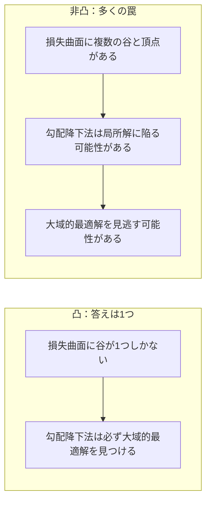
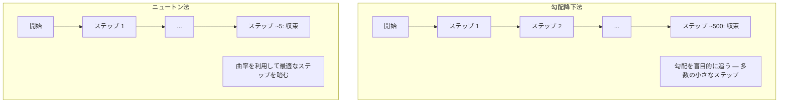
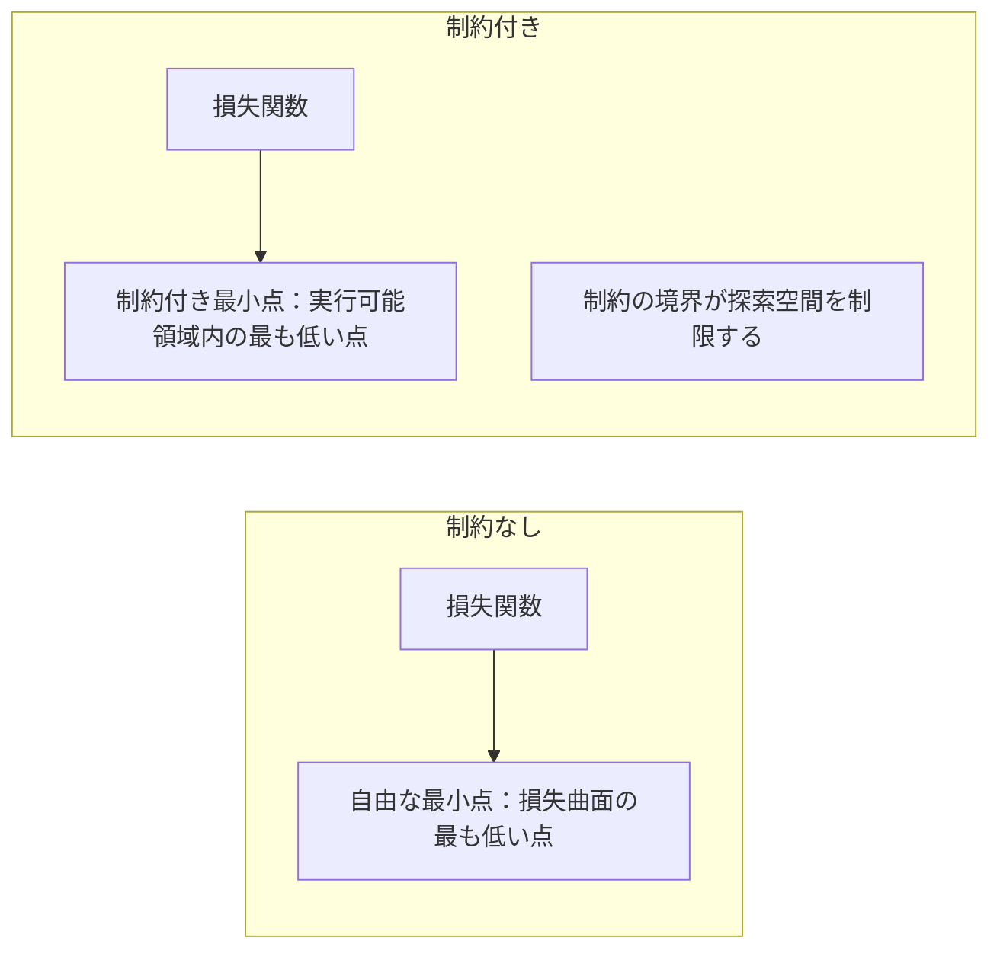
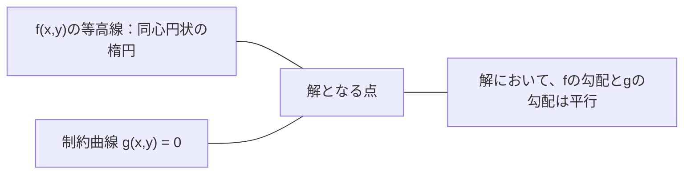

# 凸最適化

> 凸問題には谷が1つしかない。ニューラルネットワークには数百万ある。その違いを知ることが重要なのだ。

**タイプ:** ビルド
**言語:** Python
**前提条件:** フェーズ1、レッスン04（機械学習のための微分積分）、08（最適化）
**時間:** 約90分

## 学習目標

- 定義、二階導関数、ヘッセ行列の基準を用いて、関数が凸であるかどうかをテストする
- ニュートン法を実装し、勾配降下法と比較した際の二次収束性を確認する
- ラグランジュの未定乗数法を用いて制約付き最適化問題を解き、KKT条件を解釈する
- ニューラルネットワークの損失曲面が非凸であるにもかかわらず、なぜSGDが優れた解を見つけられるのかを説明する

## 問題の背景

レッスン08では、勾配降下法、モーメンタム、Adamについて学習した。これらの最適化アルゴリズムは、どのような斜面であっても下る。しかし、それらには保証がない。非凸な地形における勾配降下法は、悪い局所解（ローカルミニマム）に陥ったり、鞍点（サドルポイント）で動けなくなったり、あるいは永遠に振動し続けたりする可能性がある。それでもそれらを使っているのは、ニューラルネットワークが非凸であり、他に選択肢がないからだ。

しかし、機械学習における多くの問題は凸である。線形回帰、ロジスティック回帰、SVM、LASSO、リッジ回帰などがその例だ。これらに対しては、より強力なもの、すなわち数学的保証を伴う最適化が存在する。凸問題には、谷がちょうど1つしかない。下り坂を歩くアルゴリズムであれば、必ず大域的最適解（グローバルミニマム）に到達する。再試行も、学習率のスケジュールも、祈りも必要ない。

凸性を理解することには3つの意義がある。第一に、問題が簡単（凸）か難しい（非凸）かを判断できる。第二に、凸問題に対してはニュートン法のような高速なツールが使えるようになる。第三に、ML全体に現れる概念、例えば制約としての正則化、SVMにおける双対性、そして凸性が提供する優れた性質をすべて無視しているにもかかわらず、なぜディープラーニングが機能するのかを説明できるようになる。

## 概念

### 凸集合

ある集合 S において、その中の任意の2点間の線分もまた完全に S 内にある場合、その集合 S は凸集合である。

| 凸集合 | 凸ではない集合 |
|---|---|
| **長方形**: 内部の任意の2点は、内部を通る線分で結ぶことができる | **星型/三日月型**: 内部の2点を結ぶ線分が集合の外を通る可能性がある |
| **三角形**: すべての内部点において同じ性質が保持される | **ドーナツ型（アニュラス）**: 穴があるため、一部の線分が集合から出てしまう |
| 任意の2点間の線分が集合内に留まる | 一部の2点間の線分が集合から出てしまう |

形式的なテスト：S 内の任意の点 x, y と任意の t ∈ [0, 1] に対して、点 tx + (1-t)y も S 内にあればよい。

凸集合の例：
- 直線、平面、すべての R^n
- 球（円、球体、超球）
- 半空間：{x : a^T x <= b}
- 任意の数の凸集合の積集合（インターセクション）

非凸集合の例：
- ドーナツ型（アニュラス）
- 離れた2つの円の和集合
- 「へこみ」や「穴」のある任意の集合

### 凸関数

関数 f の領域が凸集合であり、その領域内の任意の2点 x, y と任意の t ∈ [0, 1] に対して次が成り立つ場合、その関数 f は凸関数である。

```
f(tx + (1-t)y) <= t*f(x) + (1-t)*f(y)
```

幾何学的には、グラフ上の任意の2点を結んだ線分が、グラフの上側またはグラフ上にあることを意味する。

| 特徴 | 凸関数 | 非凸関数 |
|---|---|---|
| **線分テスト** | グラフ上の任意の2点を結ぶ線分が曲線よりも **上または上側** にある | グラフ上の2点を結ぶ一部の線分が曲線よりも **下** に入り込む |
| **形状** | 上向きにカーブする単一の鉢/谷 | 複数の頂点と谷が混在する形状 |
| **局所解** | すべての局所解が大域的最適解である | 高さの異なる複数の局所解が存在しうる |

一般的な凸関数：
- f(x) = x^2 (放物線)
- f(x) = |x| (絶対値)
- f(x) = e^x (指数関数)
- f(x) = max(0, x) (ReLU、区分線形だが凸)
- f(x) = -log(x) (x > 0 における負の対数)
- 任意の線形関数 f(x) = a^T x + b (凸かつ凹)

### 凸性の判定

簡単なかたちから厳密なものまで、3つの実用的なテストがある。

**テスト1：二階導関数テスト（1次元）。** すべての x に対して f''(x) >= 0 であれば、f は凸である。

- f(x) = x^2: f''(x) = 2 >= 0。凸である。
- f(x) = x^3: f''(x) = 6x。x < 0 では負になる。凸ではない。
- f(x) = e^x: f''(x) = e^x > 0。凸である。

**テスト2：ヘッセ行列テスト（多変数）。** すべての x に対してヘッセ行列 H(x) が半正定値であれば、f は凸である。ヘッセ行列とは、二階偏導関数の行列である。

**テスト3：定義によるテスト。** 不等式 f(tx + (1-t)y) <= t*f(x) + (1-t)*f(y) を直接確認する。導関数の計算が難しい関数に有用である。

### なぜ凸性が重要か

凸最適化の中心定理：

**凸関数において、すべての局所解は大域的最適解である。**

これは、勾配降下法が罠に陥ることがないことを意味する。どのような下り道を選んでも同じ答えに辿り着く。アルゴリズムは最適解に収束することが保証される。



その結果：
- ランダムな初期値からの再試行が不要
- 洗練された学習率スケジュールが不要
- 収束の証明が可能（収束速度は関数の性質に依存する）
- 解が一意である（平坦な領域を除いて）

### 機械学習における凸 vs 非凸

| 問題 | 凸か？ | 理由 |
|---------|---------|-----|
| 線形回帰 (MSE) | はい | 損失が重みに対して二次関数である |
| ロジスティック回帰 | はい | 重みに対してログ損失が凸である |
| SVM (ヒンジ損失) | はい | 線形関数の最大値をとる形式である |
| LASSO (L1 回帰) | はい | 凸関数の和は凸である |
| リッジ回帰 (L2) | はい | 二次関数 + 二次関数 = 凸である |
| ニューラルネットワーク (全損失) | いいえ | 非線形な活性化関数が非凸な地形を生み出す |
| k-means クラスタリング | いいえ | 離散的な割り当てステップがある |
| 行列分解 | いいえ | 未知数同士の積が含まれる |

凸損失を持つ線形モデルは凸である。非線形な活性化関数を持つ隠れ層を追加した瞬間、凸性は崩壊する。

### ヘッセ行列

関数 f: R^n -> R のヘッセ行列 H は、二階偏導関数の n x n 行列である。

```
H[i][j] = d^2 f / (dx_i dx_j)
```

f(x, y) = x^2 + 3xy + y^2 の場合：

```
df/dx = 2x + 3y       d^2f/dx^2 = 2      d^2f/dxdy = 3
df/dy = 3x + 2y       d^2f/dydx = 3      d^2f/dy^2 = 2

H = [ 2  3 ]
    [ 3  2 ]
```

ヘッセ行列は曲率（曲がり具合）を教えてくれる：
- 固有値がすべて正：関数は全方向で上向きに曲がっている（その点で凸）
- 固有値がすべて負：全方向で下向きに曲がっている（凹、局所的な最大値）
- 符号が混在：鞍点（ある方向では上向き、別の方向では下向き）
- 固有値がゼロ：その方向は平坦（退化）

凸であるためには、ヘッセ行列が単一の点だけでなく、あらゆる場所で半正定値（すべての固有値 >= 0）である必要がある。

### ニュートン法

勾配降下法は一階の情報（勾配）を利用する。ニュートン法は二階の情報（ヘッセ行列）を利用する。現在の点において二次近似を行い、その二次関数の最小点へ直接ジャンプする。

```
更新規則:
  x_new = x - H^(-1) * gradient

勾配降下法との比較:
  x_new = x - lr * gradient
```

ニュートン法では、スカラーの学習率がヘッセ行列の逆行列に置き換わる。これにより、局所的な曲率に基づいて歩幅と方向が自動的に調整される。



利点：
- 最小点の近くで二次収束する（各ステップで誤差が二乗される）
- チューニングが必要な学習率がない
- スケール不変（問題のパラメータ化の方法によらず機能する）

欠点：
- ヘッセ行列の計算に O(n^2)、逆行列の計算に O(n^3) のメモリと演算が必要
- 100万個の重みを持つニューラルネットワークの場合、10^12個のエントリと10^18回の演算が必要になる
- ディープラーニングにおいては実用的ではない

### 制約付き最適化

制約なし最適化：すべての x において f(x) を最小化する。
制約付き最適化：制約の条件下で f(x) を最小化する。

現実の問題には制約がある。コストを最小化したいが予算に限りがある。誤差を最小化したいがモデルの複雑さに上限がある。



### ラグランジュの未定乗数法

ラグランジュの未定乗数法は、制約付き問題を制約なし問題に変換する手法である。

問題：g(x) = 0 という制約の下で f(x) を最小化せよ。

解決策：新しい変数（ラグランジュ乗数 lambda）を導入し、次の制約なし問題を解く。

```
L(x, lambda) = f(x) + lambda * g(x)
```

解においては、L の勾配がゼロになる：

```
dL/dx = df/dx + lambda * dg/dx = 0
dL/dlambda = g(x) = 0
```

幾何学的な直感：制約付き最小点において、f の勾配は制約 g の勾配と平行でなければならない。もし平行でなければ、制約の曲面上を移動してさらに f を小さくできるはずだからだ。



例：x + y = 1 という制約の下で f(x,y) = x^2 + y^2 を最小化せよ。

```
L = x^2 + y^2 + lambda(x + y - 1)

dL/dx = 2x + lambda = 0  =>  x = -lambda/2
dL/dy = 2y + lambda = 0  =>  y = -lambda/2
dL/dlambda = x + y - 1 = 0

最初の2つより: x = y
代入して: 2x = 1, よって x = y = 0.5, lambda = -1
```

原点から直線 x + y = 1 に最も近い点は (0.5, 0.5) である。

### KKT 条件

Karush-Kuhn-Tucker（KKT）条件は、ラグランジュの未定乗数法を不等式制約に拡張したものである。

問題：i = 1, ..., m において g_i(x) <= 0 という制約の下で f(x) を最小化せよ。

KKT 条件（最適性のための必要条件）：

```
1. 静止性 (Stationarity):    df/dx + sum(lambda_i * dg_i/dx) = 0
2. 主実行可能条件 (Primal feasibility):  g_i(x) <= 0  (すべての i)
3. 双対実行可能条件 (Dual feasibility):    lambda_i >= 0  (すべての i)
4. 相補性条件 (Complementary slackness):  lambda_i * g_i(x) = 0  (すべての i)
```

相補性条件が鍵となる洞察である：制約が有効（アクティブ）であるか（g_i = 0、解が境界上にある）、あるいは乗数がゼロであるか（その制約は解に影響しない）のどちらかである。解に影響を与えていない制約の lambda は 0 になる。

KKT 条件は SVM の中心概念である。サポートベクターとは、その制約が有効（lambda > 0）であるデータ点のことである。それ以外のすべてのデータ点は lambda = 0 であり、決定境界に影響を与えない。

### 制約付き最適化としての正則化

L1 正則化と L2 正則化は、単なる便利な手法ではない。これらは本質的に制約付き最適化問題である。

**L2 正則化 (リッジ):**

```
最小化  Loss(w)  制約  ||w||^2 <= t

等価な制約なし形式:
最小化  Loss(w) + lambda * ||w||^2
```

制約 ||w||^2 <= t は球（2次元では円、3次元では球体）を定義する。解は、損失関数の等高線がこの球にはじめて接する点になる。

**L1 正則化 (LASSO):**

```
最小化  Loss(w)  制約  ||w||_1 <= t

等価な制約なし形式:
最小化  Loss(w) + lambda * ||w||_1
```

制約 ||w||_1 <= t はダイヤモンド（2次元では回転した正方形）を定義する。

| 特徴 | L2 制約 (円) | L1 制約 (ダイヤモンド) |
|---|---|---|
| **制約の形状** | 円 (高次元では球) | ダイヤモンド (2次元では回転した正方形) |
| **等高線が接する場所** | 滑らかな境界 — 円上の任意の点 | 角 (コーナー) — 軸に沿った点 |
| **解の振る舞い** | 重みは小さくなるがゼロにはなりにくい | 一部の重みが正確にゼロになる (稀疎性/スパース) |
| **結果** | 重みの縮小 | 特徴量選別 |

これが、L2 が重みを縮小させるだけなのに対し、L1 がスパースなモデル（特徴量選別）を生む理由を説明している。ダイヤモンドには軸に沿った「角」がある。損失関数の等高線は角で接しやすいため、1つ以上の重みが正確にゼロに設定される可能性が高くなる。

### 双対性

すべての制約付き最適化問題（主問題）には、対になる問題（双対問題）が存在する。凸問題においては、主問題と双対問題は同じ最適値を持つ。これを強双対性と呼ぶ。

ラグランジュ双対関数：

```
主問題: g(x) <= 0 の下で f(x) を最小化
ラグランジアン: L(x, lambda) = f(x) + lambda * g(x)
双対関数: d(lambda) = min_x L(x, lambda)
双対問題: lambda >= 0 の下で d(lambda) を最大化
```

双対性が重要な理由：
- 双対問題の方が主問題よりも解きやすい場合がある
- SVM は双対形式で解かれる。そこでは問題がデータ点間の内積に依存するようになり、カーネルトリックが使えるようになる
- 双対問題は主問題の最適値の下限を提供するため、解の品質を確認するのに役立つ

SVM の場合：

```
主問題: 次の制約下でマージン 2/||w|| を最大化する w, b を求める
        すべての i について y_i(w^T x_i + b) >= 1

双対問題: 次の制約下で sum(alpha_i) - 0.5 * sum_ij(alpha_i * alpha_j * y_i * y_j * x_i^T x_j) を最大化
         alpha_i >= 0 かつ sum(alpha_i * y_i) = 0

双対問題には内積 x_i^T x_j しか現れない。
x_i^T x_j を K(x_i, x_j) に置き換えることで、カーネルトリックが可能になる。
```

### なぜ非凸なディープラーニングが機能するのか

ニューラルネットワークの損失関数は激しく非凸である。古典的な指標からすれば、その最適化は失敗するはずである。しかし、確率的勾配降下法（SGD）は安定して良い解を見つける。それにはいくつかの要因がある。

**ほとんどの局所解は十分に良い。** 高次元空間において、ランダムな停留点（勾配がゼロになる点）は圧倒的に鞍点であり、局所解（ローカルミニマム）ではない。数少ない局所解も、その損失値は大域的最適解に近い傾向がある。パラメータ空間が数百万次元もある場合、ひどい局所解に閉じ込められる確率は極めて低い。

**本当の障害は局所解ではなく鞍点である。** n 個のパラメータを持つ関数において、鞍点は正と負の曲率が混在する方向を持つ。高次元のランダムな停留点において、すべての n 個の固有値が正（局所解）になる確率は、おおよそ 2^(-n) である。ほとんどすべての停留点は鞍点であり、SGD のノイズがそこから脱出するのを助けてくれる。

**過学習を抑制する過剰パラメータ化。** 学習データ数よりも多くのパラメータを持つネットワークは、より滑らかで連結された損失曲面を持つ。ネットワークが広いほど、悪い局所解が少なくなる。これは直感に反するが、経験的に一致している。

**損失曲面の構造：**

| 性質 | 低次元空間 | 高次元空間 |
|---|---|---|
| **地表** | 孤立した多くの頂点と谷 | 滑らかに連結された谷 |
| **解 (ミニマム)** | 孤立した多くの局所解 | 悪い局所解は少なく、多くが最適に近い |
| **探索** | 大域的最適解を見つけるのが困難 | 多くの経路が良い解へと通じている |
| **停留点** | 局所解と鞍点が混在 | 圧倒的に鞍点であり、局所解ではない |

**確率的ノイズによる暗示的な正則化。** ミニバッチ SGD はノイズを加え、尖った最小点（sharp minima）に居座るのを防ぐ。尖った最小点は過学習しやすく、平坦な最小点（flat minima）は汎用性が高い。ノイズは、最適化を損失曲面の平坦な領域へと導くバイアスとして働く。

### 実践における二階の手法

純粋なニュートン法は、大規模なモデルには不向きである。二階の情報を利用可能にするためのいくつかの近似手法がある。

**L-BFGS (Limited-memory BFGS):** 過去 m 回の勾配の格差を用いて、逆ヘッセ行列を近似する。O(n^2) ではなく O(mn) のメモリで済む。パラメータ数が ~10,000 程度までの問題に有効である。古典的な ML（ロジスティック回帰、CRF）では使われるが、ディープラーニングでは使われない。

**自然勾配 (Natural gradient):** 標準的なヘッセ行列の代わりに、フィッシャー情報行列（対数尤度の期待ヘッセ行列）を使用する。これは確率分布の幾何学的な構造を考慮する。K-FAC (Kronecker-Factored Approximate Curvature) は、フィッシャー行列をクロネッカー積として近似し、ニューラルネットワークでの利用を実用的にしたものである。

**ヘッセ行列フリー最適化 (Hessian-free optimization):** H を構築することなく、共役勾配法を用いて Hx = g を解く。自動微分により、O(n) の時間でヘッセ行列とベクトルの積を計算することができる。

**対角近似:** Adam の二階モーメントは、ヘッセ行列の対角成分の対角近似である。AdaHessian は、Hutchinson 推定量を用いて実際のヘッセ行列の対角成分を利用することで、これを拡張したものである。

| 手法 | メモリ | ステップごとのコスト | いつ使うか |
|--------|--------|--------------|-------------|
| 勾配降下法 | O(n) | O(n) | 基本、大規模モデル |
| ニュートン法 | O(n^2) | O(n^3) | 小規模な凸問題 |
| L-BFGS | O(mn) | O(mn) | 中規模な凸問題 |
| Adam | O(n) | O(n) | ディープラーニングの標準 |
| K-FAC | O(n) | レイヤーごとに O(n) | 研究、大規模バッチ学習 |

## ビルド・イット

### ステップ 1: 凸性チェッカー

点をサンプリングして定義を確認することで、実験的に凸性をテストする関数を構築する。

```python
import random
import math

def check_convexity(f, dim, bounds=(-5, 5), samples=1000):
    violations = 0
    for _ in range(samples):
        x = [random.uniform(*bounds) for _ in range(dim)]
        y = [random.uniform(*bounds) for _ in range(dim)]
        t = random.uniform(0, 1)
        mid = [t * xi + (1 - t) * yi for xi, yi in zip(x, y)]
        lhs = f(mid)
        rhs = t * f(x) + (1 - t) * f(y)
        if lhs > rhs + 1e-10:
            violations += 1
    return violations == 0, violations
```

### ステップ 2: 2次元のニュートン法

明示的なヘッセ行列を用いてニュートン法を実装する。勾配降下法と収束速度を比較せよ。

```python
def newtons_method(f, grad_f, hessian_f, x0, steps=50, tol=1e-12):
    x = list(x0)
    history = [x[:]]
    for _ in range(steps):
        g = grad_f(x)
        H = hessian_f(x)
        det = H[0][0] * H[1][1] - H[0][1] * H[1][0]
        if abs(det) < 1e-15:
            break
        H_inv = [
            [H[1][1] / det, -H[0][1] / det],
            [-H[1][0] / det, H[0][0] / det],
        ]
        dx = [
            H_inv[0][0] * g[0] + H_inv[0][1] * g[1],
            H_inv[1][0] * g[0] + H_inv[1][1] * g[1],
        ]
        x = [x[0] - dx[0], x[1] - dx[1]]
        history.append(x[:])
        if sum(gi ** 2 for gi in g) < tol:
            break
    return history
```

### ステップ 3: ラグランジュ乗数ソルバー

ラグランジアンに対して勾配降下法を適用することで、制約付き最適化を解く。

```python
def lagrange_solve(f_grad, g_val, g_grad, x0, lr=0.01,
                   lr_lambda=0.01, steps=5000):
    x = list(x0)
    lam = 0.0
    history = []
    for _ in range(steps):
        fg = f_grad(x)
        gv = g_val(x)
        gg = g_grad(x)
        x = [
            xi - lr * (fgi + lam * ggi)
            for xi, fgi, ggi in zip(x, fg, gg)
        ]
        lam = lam + lr_lambda * gv
        history.append((x[:], lam, gv))
    return history
```

### ステップ 4: 一階 vs 二階の比較

同じ二次関数に対して勾配降下法とニュートン法を実行し、収束までのステップ数を数える。

```python
def quadratic(x):
    return 5 * x[0] ** 2 + x[1] ** 2

def quadratic_grad(x):
    return [10 * x[0], 2 * x[1]]

def quadratic_hessian(x):
    return [[10, 0], [0, 2]]
```

ニュートン法は1ステップで収束する（二次関数に対しては厳密であるため）。勾配降下法は数百ステップを要する。これはヘッセ行列の固有値が5倍異なり、引き伸ばされた谷を形成しているからである。

## ユーズ・イット

凸性分析は、ML モデルやソルバーを選択する際に直接適用できる。

凸問題（ロジスティック回帰、SVM、LASSO）の場合：
- 専用のソルバー（liblinear, CVXPY, scipy.optimize.minimize の method='L-BFGS-B' など）を使用する
- 一意な大域的最適解を期待できる
- 二階の手法が実用的で高速である

非凸問題（ニューラルネットワーク）の場合：
- 一階の手法（SGD, Adam）を使用する
- 解が初期値やランダム性に依存することを受け入れる
- 過剰パラメータ化、ノイズ、学習率スケジュールを暗示的な正則化として利用する
- 大域的最適解を探すのに時間を費やさない。十分に良い局所解で満足すること。

```python
from scipy.optimize import minimize

result = minimize(
    fun=lambda w: sum((y - X @ w) ** 2) + 0.1 * sum(w ** 2),
    x0=np.zeros(d),
    method='L-BFGS-B',
    jac=lambda w: -2 * X.T @ (y - X @ w) + 0.2 * w,
)
```

SVM では、双対形式によってカーネルトリックを使用できる。

```python
from sklearn.svm import SVC

svm = SVC(kernel='rbf', C=1.0)
svm.fit(X_train, y_train)
print(f"サポートベクターの数: {svm.n_support_}")
```

## 演習

1. **凸性のギャラリー。** 凸性チェッカーを使って、次の関数の凸性をテストせよ：f(x) = x^4, f(x) = sin(x), f(x,y) = x^2 + y^2, f(x,y) = x*y, f(x) = max(x, 0)。それぞれの結果がなぜそうなるのか説明せよ。

2. **ニュートン法 vs 勾配降下法レース。** 関数 f(x,y) = 50*x^2 + y^2 に対して、開始点 (10, 10) から両方の手法を実行せよ。損失 < 1e-10 に達するまでにそれぞれ何ステップ必要か？ 条件数（ヘッセ行列の最大固有値と最小固有値の比）が大きくなると、勾配降下法はどうなるか？

3. **ラグランジュ乗数の幾何学。** x + 2y = 4 という制約の下で f(x,y) = (x-3)^2 + (y-3)^2 を最小化せよ。解において f の勾配が g の勾配と平行であることを確認して、解を検証せよ。

4. **正則化の制約。** L1 制約付き最適化を実装せよ：|x| + |y| <= 1 という制約の下で (x-3)^2 + (y-2)^2 を最小化せよ。ダイヤモンド形の制約により、解の座標の1つがゼロになる（スパースになる）ことを示せ。

5. **ヘッセ行列の固有値分析。** Rosenbrock 関数の (1,1) と (-1,1) におけるヘッセ行列を計算せよ。それぞれの点における固有値を計算せよ。固有値は、最小点と、そこから離れた点での曲率について何を物語っているか？

## 主要用語

| 用語 | よく言われること | 実際の意味 |
|------|---------------|---------------|
| 凸集合 | 「中身が詰まった形」 | 集合内の任意の2点間の線分が、常にその集合内に留まるような集合。 |
| 凸関数 | 「上が開いた鉢のような関数」 | グラフ上の任意の2点を結ぶ線分が、グラフの上側またはグラフ上にある関数。同等に、ヘッセ行列があらゆる場所で半正定値であること。 |
| 局所解 (ローカルミニマム) | 「周りより低い点」 | 近傍のすべての点よりも値が低い点。凸関数においては、すべての局所解が大域的最適解となる。 |
| 大域的最適解 (グローバルミニマム) | 「一番低い点」 | 領域全体において最も値が低い点。 |
| ヘッセ行列 | 「二階微分の行列」 | すべての二階偏導関数の行列。曲率の情報をエンコードしている。 |
| 半正定値 | 「二次形式が非負」 | すべての固有値が非負である行列。「二階微分 >= 0」を多次元に拡張したもの。 |
| 条件数 | 「谷の引き伸ばされ具合」 | ヘッセ行列の最大固有値と最小固有値の比。条件数が大きいと、谷が細長くなり、勾配降下法の収束が遅くなる。 |
| ニュートン法 | 「二階の最適化器」 | 逆ヘッセ行列を用いてステップの方向と大きさを決定する最適化手法。最小点の近くで二次収束する。 |
| ラグランジュ乗数 | 「制約を組み込む変数」 | 制約付き最適化問題を制約なし問題に変換するために導入される変数。 |
| KKT 条件 | 「不等式制約のルール」 | 不等式制約がある場合の最適性の必要条件。ラグランジュの未定乗数法を一般化したもの。 |
| 相補性条件 | 「スイッチのような関係」 | 解において、制約が有効であるか、あるいはその乗数がゼロであるかのどちらかであること。両方がゼロ以外になることはない。 |
| 双対性 | 「裏側の問題」 | すべての制約付き問題には対になる双対問題がある。凸問題では、両方は同じ最適値を持つ。 |
| 強双対性 | 「表と裏が一致」 | 主問題と双対問題の最適値が一致すること。スレーターの条件を満たす凸問題で成り立つ。 |
| L-BFGS | 「効率的なニュートン近似」 | フルヘッセ行列の代わりに、過去 m 回の勾配の変化を記録して使用する近似二階手法。 |
| 鞍点 (サドルポイント) | 「勾配ゼロだが最小ではない」 | 勾配がゼロだが、ある方向では最小、別の方向では最大となっている点。 |
| 過剰パラメータ化 | 「データより多い変数」 | 学習データ数よりも多くのパラメータを使用すること。損失曲面を滑らかにし、悪い局所解を減らす。 |

## さらに学ぶために

- [Boyd & Vandenberghe: Convex Optimization](https://web.stanford.edu/~boyd/cvxbook/) - 標準的な教科書。オンラインで無料公開されている。
- [Bottou, Curtis, Nocedal: Optimization Methods for Large-Scale Machine Learning (2018)](https://arxiv.org/abs/1606.04838) - 凸最適化理論とディープラーニングの実践を繋ぐ論文。
- [Choromanska et al.: The Loss Surfaces of Multilayer Networks (2015)](https://arxiv.org/abs/1412.0233) - なぜ非凸なニューラルネットワークの地形が、懸念されるほど悪くないのかを解説。
- [Nocedal & Wright: Numerical Optimization](https://link.springer.com/book/10.1007/978-0-387-40065-5) - ニュートン法、L-BFGS、制約付き最適化に関する包括的なリファレンス。
