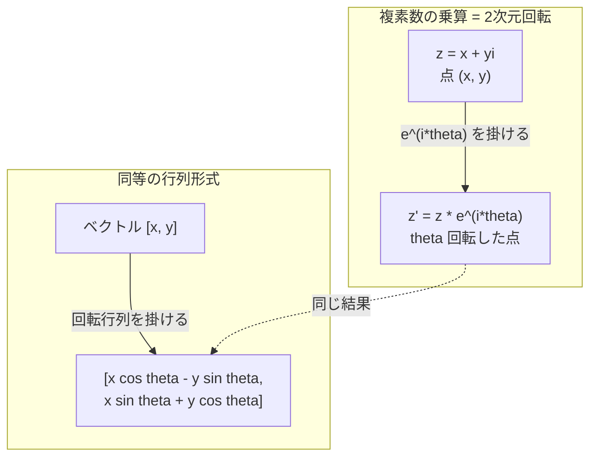
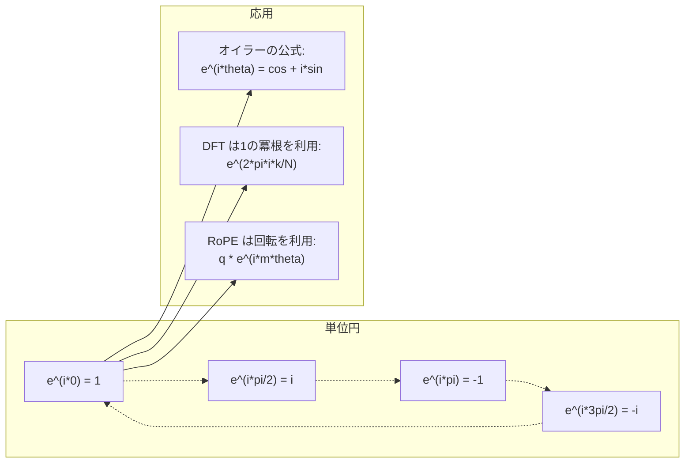

# AIのための複素数

> -1の平方根は「想像上のもの」ではない。それは回転、周波数、そして信号処理の半分を解く鍵である。

**タイプ:** 学習
**言語:** Python
**前提条件:** フェーズ1、レッスン01-04（線形代数、微分積分）
**時間:** 約60分

## 学習目標

- 直交形式と極形式の両方で複素数の演算（加算、乗算、除算、共役）を行う
- オイラーの公式を適用して、複素指数関数と三角関数の間を変換する
- 複素数の1の冪根を用いて、離散フーリエ変換（DFT）を実装する
- 複素回転が、トランスフォーマーにおける RoPE や正弦波位置エンコーディングの基礎となっている仕組みを説明する

## 問題の背景

フーリエ変換に関する論文を開けば、至る所に `i` が現れる。トランスフォーマーの位置エンコーディングを見ると、異なる周波数の `sin` と `cos` が目に入るだろう。――これらは複素指数関数の実部と虚部である。量子コンピュータについて読めば、すべてが複素ベクトル空間で表現されていることに気づくだろう。

複素数は抽象的に思えるかもしれない。-1 の平方根に基づいた数体系は、数学的なトリックのように感じられる。しかし、それはトリックではない。回転や振動を表現するための自然な言語なのだ。何かが回転したり、振動したり、揺れたりするたびに、複素数は最適なツールとなる。

複素数を理解しなければ、離散フーリエ変換（DFT）を理解することはできない。FFT（高速フーリエ変換）も理解できない。現代の言語モデルで RoPE (Rotary Position Embedding) がどのように機能しているかも理解できない。また、オリジナルの Transformer 論文の正弦波位置エンコーディングが、なぜあのような周波数を使っているのかも理解できない。

このレッスンでは、複素演算をゼロから構築し、それを幾何学に結びつけ、複素数が機械学習のどこに現れるのかを具体的に示す。

## 概念

### 複素数とは何か？

複素数は、実部と虚部の2つの部分からなる。

```
z = a + bi

ここで:
  a は実部
  b は虚部
  i は虚数単位（i^2 = -1 と定義される）
```

これだけだ。数直線を平面へと拡張するのである。実数は一方の軸に乗り、虚数はもう一方の軸に乗る。すべての複素数は、この平面上の点として表される。

### 複素演算

**加算。** 実部同士、虚部同士を足し合わせる。

```
(a + bi) + (c + di) = (a + c) + (b + d)i

例: (3 + 2i) + (1 + 4i) = 4 + 6i
```

**乗算。** 分配法則を使い、i^2 = -1 であることを忘れないようにする。

```
(a + bi)(c + di) = ac + adi + bci + bdi^2
                 = ac + adi + bci - bd
                 = (ac - bd) + (ad + bc)i

例: (3 + 2i)(1 + 4i) = 3 + 12i + 2i + 8i^2
                    = 3 + 14i - 8
                    = -5 + 14i
```

**共役。** 虚部の符号を反転させる。

```
(a + bi) の共役 = a - bi
```

複素数とその共役の積は、常に実数になる。

```
(a + bi)(a - bi) = a^2 + b^2
```

**除算。** 分子の分母の両方に、分母の共役を掛ける。

```
(a + bi) / (c + di) = (a + bi)(c - di) / (c^2 + d^2)
```

これにより、分母から虚部がなくなり、きれいな複素数となる。

### 複素平面

複素平面は、すべての複素数を2次元の点に対応させる。水平軸は実軸（Real axis）、垂直軸は虚軸（Imaginary axis）である。

```
z = 3 + 2i  は 点 (3, 2) に対応する
z = -1 + 0i は 実軸上の点 (-1, 0) に対応する
z = 0 + 4i  は 虚軸上の点 (0, 4) に対応する
```

複素数は、点であると同時に原点からのベクトルでもある。この二重の解釈こそが、複素数を幾何学に役立てている理由である。

### 極形式

平面上の点は、原点からの距離と、正の実軸からの角度によっても記述できる。

```
z = r * (cos(theta) + i*sin(theta))

ここで:
  r = |z| = sqrt(a^2 + b^2)     (絶対値、または大きさ)
  theta = atan2(b, a)             (位相、または偏角)
```

直交形式 (a + bi) は加算に適している。一方、極形式 (r, theta) は乗算に適している。

**極形式における乗算。** 大きさを掛け合わせ、角度を足し合わせる。

```
z1 = r1 * e^(i*theta1)
z2 = r2 * e^(i*theta2)

z1 * z2 = (r1 * r2) * e^(i*(theta1 + theta2))
```

これが、複素数が回転に最適である理由だ。大きさ 1 の複素数を掛けることは、純粋な回転を意味する。

### オイラーの公式

複素指数関数と三角関数の架け橋となる公式：

```
e^(i*theta) = cos(theta) + i*sin(theta)
```

これは本レッスンで最も重要な公式である。theta = pi のとき：

```
e^(i*pi) = cos(pi) + i*sin(pi) = -1 + 0i = -1

したがって: e^(i*pi) + 1 = 0
```

5つの基本的な定数（e, i, pi, 1, 0）が1つの方程式で結ばれている。

### なぜ ML においてオイラーの公式が重要なのか

オイラーの公式によれば、theta が変化するにつれて `e^(i*theta)` は単位円をなぞる。theta = 0 では (1, 0) に、theta = pi/2 では (0, 1) に、theta = pi では (-1, 0) に、theta = 3*pi/2 では (0, -1) に位置する。1回転は theta = 2*pi である。

つまり、複素指数関数とは「回転」そのものである。そして、回転は信号処理や ML のいたるところに存在する。

### 2次元回転との接続

複素数 (x + yi) に e^(i*theta) を掛けることは、点 (x, y) を原点中心に角度 theta だけ回転させることと同じである。

```
複素数の乗算による回転:
  (x + yi) * (cos(theta) + i*sin(theta))
  = (x*cos(theta) - y*sin(theta)) + (x*sin(theta) + y*cos(theta))i

行列の乗算による回転:
  [cos(theta)  -sin(theta)] [x]   [x*cos(theta) - y*sin(theta)]
  [sin(theta)   cos(theta)] [y] = [x*sin(theta) + y*cos(theta)]
```

結果は同一である。複素数の乗算は 2次元の回転そのままである。回転行列は、複素数の乗算を行列形式で書いたものに過ぎない。



### フェーザと回転信号

複素指数関数 e^(i*omega*t) は、角周波数 omega で単位円上を回転する点を表す。t が増加するにつれて、点は円を描く。

この回転する点の実部は cos(omega*t) であり、虚部は sin(omega*t) である。正弦波信号（サイン波）は、回転する複素数の影（投影）なのである。

```
e^(i*omega*t) = cos(omega*t) + i*sin(omega*t)

実部:      cos(omega*t)    -- コサイン波
虚部:      sin(omega*t)    -- サイン波
```

これがフェーザ（phasor）表現である。うねうねしたサイン波を追う代わりに、滑らかに回転する矢印を追う。位相のずれは角度のオフセットになり、振幅の変化は大きさの変化になる。信号の加算はベクトルの加算になる。

### 1の冪根 (Roots of unity)

1 の N 乗根（1 の冪根）は、単位円上の等間隔な N 個の点である。

```
w_k = e^(2*pi*i*k/N)    (k = 0, 1, 2, ..., N-1)
```

N = 4 のとき、根は 1, i, -1, -i（東西南北の4点）となる。
N = 8 のときは、東西南北に加えて、対角線上の4点が加わる。

1の冪根は離散フーリエ変換（DFT）の土台である。DFT は、信号をこれら N 個の等間隔な周波数の成分に分解する。

### DFT との関係

信号 x[0], x[1], ..., x[N-1] の離散フーリエ変換は次のようになる。

```
X[k] = sum_{n=0}^{N-1} x[n] * e^(-2*pi*i*k*n/N)
```

各 X[k] は、信号が k 番目の 1 の冪根（周波数 k の複素正弦波）とどれだけ相関しているかを測定する。DFT は信号を N 個の回転するフェーザに分解し、それぞれの振幅と位相を教えてくれる。

### なぜ i は「想像上のもの」ではないのか

「虚数（imaginary）」という言葉は歴史的な偶然である。デカルトが否定的に用いたのが始まりだ。しかし、負の数が初めて登場したときに拒絶されたのと同様に、i も決して架空のものではない。負の数は「3から5を引くと何になるか？」という問いに答える。虚数単位は「二乗して -1 になるのは何か？」に答える。

より実用的な見方をすれば、i とは「90度回転演算子」である。実数に i を1回掛けると、実軸から 90度回転して虚軸へ移動する。さらにもう一度 i を掛ける（i^2）と、さらに 90度回転し、実軸の負の方向を向く。だから i^2 = -1 なのである。これは神秘的なことではない。2回の「4分の1回転」を組み合わせた「半回転」なのである。

これが、工学のいたるところに複素数が存在する理由である。回転するもの――電磁波、量子状態、信号の振動、位置エンコーディング――は何であれ、複素数で記述するのが自然なのである。

### 複素指数関数 vs 三角関数

オイラーの公式が普及する前、エンジニアは信号を A*cos(omega*t + phi)（振幅 A、周波数 omega、位相 phi）と書いていた。これでも機能はするが、計算が苦痛だ。異なる位相を持つ2つのコサイン波を足すには、三角関数の加法定理が必要になる。

複素指数関数を使えば、同じ信号を A*e^(i*(omega*t + phi)) と書ける。2つの信号の足し算は、単なる2つの複素数の足し算になる。掛け算（変調）は、大きさを掛け、角度を足すだけだ。位相のずれは角度の加算になり、周波数の推移はフェーザの乗算になる。

信号処理の全分野が複素指数表記に移行したのは、その方が計算が明快だからだ。「実際の信号」は常に複素表現の実部として取り出せる。虚部は計算を自然に進めるための記帳役として持ち運ばれるのである。

### トランスフォーマーとの接続

**正弦波位置エンコーディング**（オリジナルの Transformer 論文）：

```
PE(pos, 2i) = sin(pos / 10000^(2i/d))
PE(pos, 2i+1) = cos(pos / 10000^(2i/d))
```

この sin と cos のペアは、異なる周波数における複素指数関数の実部と虚部である。個々の周波数が、位置をエンコードするための異なる「解像度」を提供する。低周波はゆっくり変化し（粗い位置）、高周波は素早く変化する（細かい位置）。これらが合わさることで、各位置に一意な周波数の指紋が与えられる。

**RoPE (Rotary Position Embedding)** はこれをさらに進めている。クエリベクトルとキーベクトルに複素回転行列を明示的に掛ける。2つのトークン間の相対的な位置関係は、回転角の差となる。アテンションはこれらの回転したベクトルを用いて計算され、複素数の乗算を通じてモデルが相対的な位置に敏感になるよう設計されている。

| 操作 | 代数形式 | 幾何学的意味 |
|-----------|---------------|-------------------|
| 加算 | (a+c) + (b+d)i | 平面上のベクトルの加算 |
| 乗算 | (ac-bd) + (ad+bc)i | 回転とスケーリング |
| 共役 | a - bi | 実軸対称の反転 |
| 絶対値 (大きさ) | sqrt(a^2 + b^2) | 原点からの距離 |
| 位相 (偏角) | atan2(b, a) | 正の実軸からの角度 |
| 除算 | 共役を掛ける | 逆回転と再スケーリング |
| 累乗 | r^n * e^(i*n*theta) | n 回の回転と r^n 倍のスケーリング |



## ビルド・イット

### ステップ 1: Complex クラス

加減乗除、絶対値、位相、そして直交形式と極形式の変換をサポートする複素数クラスを構築する。

```python
import math

class Complex:
    def __init__(self, real, imag=0.0):
        self.real = real
        self.imag = imag

    def __add__(self, other):
        return Complex(self.real + other.real, self.imag + other.imag)

    def __mul__(self, other):
        r = self.real * other.real - self.imag * other.imag
        i = self.real * other.imag + self.imag * other.real
        return Complex(r, i)

    def __truediv__(self, other):
        denom = other.real ** 2 + other.imag ** 2
        r = (self.real * other.real + self.imag * other.imag) / denom
        i = (self.imag * other.real - self.real * other.imag) / denom
        return Complex(r, i)

    def magnitude(self):
        return math.sqrt(self.real ** 2 + self.imag ** 2)

    def phase(self):
        return math.atan2(self.imag, self.real)

    def conjugate(self):
        return Complex(self.real, -self.imag)
```

### ステップ 2: 極形式への変換とオイラーの公式

```python
def to_polar(z):
    return z.magnitude(), z.phase()

def from_polar(r, theta):
    return Complex(r * math.cos(theta), r * math.sin(theta))

def euler(theta):
    return Complex(math.cos(theta), math.sin(theta))
```

検証：`euler(theta).magnitude()` は常に 1.0 になり、`euler(0)` は (1, 0)、`euler(pi)` は (-1, 0) を返すはずだ。

### ステップ 3: 回転

点 (x, y) を角度 theta だけ回転させることは、1回の複素数の乗算で行える。

```python
point = Complex(3, 4)
rotated = point * euler(math.pi / 4)
```

大きさは変わらず、角度だけが変化する。

### ステップ 4: 複素演算による DFT

```python
def dft(signal):
    N = len(signal)
    result = []
    for k in range(N):
        total = Complex(0, 0)
        for n in range(N):
            angle = -2 * math.pi * k * n / N
            total = total + Complex(signal[n], 0) * euler(angle)
        result.append(total)
    return result
```

これは O(N^2) の DFT である。各出力 X[k] は、信号の各サンプルと 1 の冪根を掛け合わせたものの総和である。

### ステップ 5: 逆 DFT

逆 DFT（IDFT）は、スペクトルから元の信号を再構成する。順方向の DFT との違いは、指数の符号を反転させ、N で割ることだけだ。

```python
def idft(spectrum):
    N = len(spectrum)
    result = []
    for n in range(N):
        total = Complex(0, 0)
        for k in range(N):
            angle = 2 * math.pi * k * n / N
            total = total + spectrum[k] * euler(angle)
        result.append(Complex(total.real / N, total.imag / N))
    return result
```

これにより完璧に再構成される。DFT を適用した後に IDFT を適用すれば、計算精度（machine precision）の範囲内で元の信号に戻る。情報は失われない。

### ステップ 6: 1の冪根

```python
def roots_of_unity(N):
    return [euler(2 * math.pi * k / N) for k in range(N)]
```

次の2つの性質を確認せよ：
- すべての根の大きさは正確に 1 である。
- N 個のすべての根を足し合わせると、対称性によりゼロになる。

これらの性質こそが、DFT を可逆なものにしている。1 の冪根は、周波数ドメインにおける直交基底を形成している。

## ユーズ・イット

Python には複素数のサポートが組み込まれている。リテラルの `j` が虚数単位を表す。

```python
z = 3 + 2j
w = 1 + 4j

print(z + w)
print(z * w)
print(abs(z))

import cmath
print(cmath.phase(z))
print(cmath.exp(1j * cmath.pi))
```

配列については、NumPy がネイティブに複素数を扱う。

```python
import numpy as np

z = np.array([1+2j, 3+4j, 5+6j])
print(np.abs(z))
print(np.angle(z))
print(np.conj(z))
print(np.real(z))
print(np.imag(z))

signal = np.sin(2 * np.pi * 5 * np.linspace(0, 1, 128))
spectrum = np.fft.fft(signal)
freqs = np.fft.fftfreq(128, d=1/128)
```

## シップ・イット

`code/complex_numbers.py` を実行して、`outputs/skill-complex-arithmetic.md` を生成せよ。

## 演習

1. **手計算による複素演算。** (2 + 3i) * (4 - i) を計算し、コードで検証せよ。次に (5 + 2i) / (1 - 3i) を計算せよ。両方の結果を複素平面上に描き、乗算によって最初の数が回転しスケーリングされたことを確認せよ。

2. **回転のシーケンス。** 点 (1, 0) から始め、e^(i*pi/6) を12回掛けよ。12回の乗算の後に (1, 0) に戻ることを確認せよ。各ステップの座標を出力し、それらが正12角形を描くことを確認せよ。

3. **既知の信号の DFT。** 32個のサンプル点において、sin(2*pi*3*t) と 0.5*sin(2*pi*7*t) の和となる信号を作成せよ。自作の DFT を実行し、振幅スペクトルに周波数 3 と 7 のピークがあり、かつ 7 のピークが 3 のピークの半分の高さであることを確認せよ。

4. **1の冪根の可視化。** 1 の 8乗根を計算せよ。それらの和がゼロになることを確認せよ。また、任意の根に原始根 e^(2*pi*i/8) を掛けると、次の根が得られることを確認せよ。

5. **回転行列との同等性。** 10個のランダムな角度と10個のランダムな点について、複素数の乗算が、2x2 の回転行列を用いた行列ベクトル積と同じ結果を与えることを確認せよ。数値的な最大誤差を出力せよ。

## 主要用語

| 用語 | 意味 |
|------|---------------|
| 複素数 (Complex number) | a + bi という形式の数。a は実部、b は虚部であり、i^2 = -1 を満たす。 |
| 虚数単位 (Imaginary unit) | i^2 = -1 と定義される数 i。哲学的な意味で「想像上」なのではなく、回転演算子である。 |
| 複素平面 (Complex plane) | x軸を実部、y軸を虚部とする2次元平面。アルガン図とも呼ばれる。 |
| 絶対値 (Magnitude/Modulus) | 原点からの距離: sqrt(a^2 + b^2)。\|z\| と書かれる。 |
| 位相 (Phase/Argument) | 正の実軸からの角度: atan2(b, a)。arg(z) と書かれる。 |
| 共役 (Conjugate) | 実軸を鏡とした反転: a + bi の共役は a - bi。 |
| 極形式 (Polar form) | z を a + bi ではなく r * e^(i*theta) として表現したもの。乗算が容易になる。 |
| オイラーの公式 (Euler's formula) | e^(i*theta) = cos(theta) + i*sin(theta)。指数関数と三角関数を繋ぐ。 |
| フェーザ (Phasor) | 正弦波信号を表す、回転する複素数 e^(i*omega*t) 。 |
| 1の冪根 (Roots of unity) | k = 0 から N-1 における e^(2*pi*i*k/N) の N 個の複素数。単位円上の等間隔な N 個の点。 |
| DFT | 離散フーリエ変換。1の冪根を用いて、信号を複素正弦波成分に分解する。 |
| RoPE | Rotary Position Embedding。複素回転を用いて、トランスフォーマーのアテンションに相対的な位置情報をエンコードする。 |

## さらに学ぶために

- [Visual Introduction to Euler's Formula](https://betterexplained.com/articles/intuitive-understanding-of-eulers-formula/) - 難しい数式を使わずに、幾何学的な直感を構築する。
- [Su et al.: RoFormer (2021)](https://arxiv.org/abs/2104.09864) - 複素回転を用いた Rotary Position Embedding を紹介した論文。
- [Vaswani et al.: Attention Is All You Need (2017)](https://arxiv.org/abs/1706.03762) - 正弦波位置エンコーディングを用いたオリジナルの Transformer 論文。
- [3Blue1Brown: Euler's formula with introductory group theory](https://www.youtube.com/watch?v=mvmuCPvRoWQ) - なぜ e^(i*pi) = -1 になるのか、視覚的な解説。
- [Needham: Visual Complex Analysis](https://global.oup.com/academic/product/visual-complex-analysis-9780198534464) - 幾何学的な洞察に満ちた、複素解析の最も優れた視覚的解説書。
- [Strang: Introduction to Linear Algebra, Ch. 10](https://math.mit.edu/~gs/linearalgebra/) - 線形代数と固有値の文脈における複素数の扱い。
