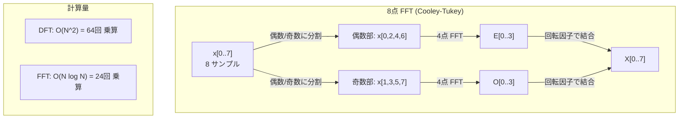
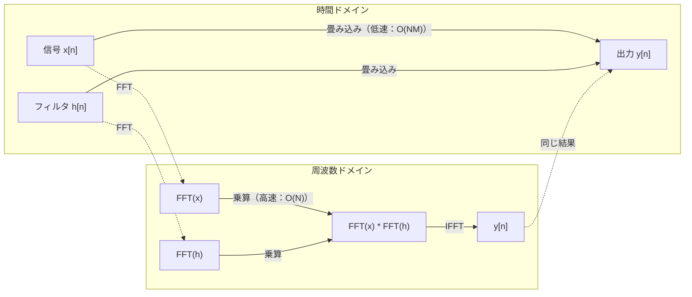

# フーリエ変換

> すべての信号は正弦波（サイン波）の和である。フーリエ変換は、どの正弦波がどれだけ含まれているかを教えてくれる。

**タイプ:** ビルド
**言語:** Python
**前提条件:** フェーズ1、レッスン01-04、19（複素数）
**時間:** 約90分

## 学習目標

- DFT（離散フーリエ変換）をゼロから実装し、O(N log N) の Cooley-Tukey FFT と比較検証する
- 周波数係数を解釈する：信号から振幅、位相、およびパワースペクトルを抽出する
- 畳み込み定理を適用し、FFT 後の乗算によって畳み込み（コンボリューション）を実行する
- フーリエ周波数分解を、トランスフォーマーの位置エンコーディングや CNN の畳み込み層と結びつける

## 問題の背景

オーディオ録音は、時間の経過に伴う音圧の測定値のシーケンスである。株価は、日ごとの値のシーケンスである。画像は、空間上のピクセル強度のグリッドである。これらはすべて、**時間ドメイン**（または空間ドメイン）のデータである。インデックスの変化に伴って値が変化する様子を私たちは見ている。

しかし、多くのパターンは時間ドメインでは見えない。このオーディオ信号は単音か、それとも和音か？ この株価には週間周期があるか？ この画像には繰り返しのテクスチャがあるか？ これらの問いは「周波数成分」に関するものであり、時間ドメインでは隠されてしまっている。

フーリエ変換は、データを時間ドメインから**周波数ドメイン**へと変換する。信号を取り込み、それを異なる周波数の正弦波の和へと分解する。各正弦波には、振幅（その強さ）と位相（どこから始まるか）がある。フーリエ変換はその両方を教えてくれる。

これが ML において重要なのは、周波数ドメインの考え方がいたるところに現れるからだ。畳み込みニューラルネットワーク（CNN）が実行する畳み込みは、周波数ドメインにおける乗算に相当する。トランスフォーマーの位置エンコーディングは、周波数分解を利用して位置を表現する。オーディオモデル（音声認識、音楽生成など）は、音の周波数表現であるスペクトログラム上で動作する。時系列モデルは周期的なパターンを探す。フーリエ変換を理解することで、これらすべてを扱うための語彙が手に入る。

## 概念

### DFT の定義

N 個のサンプル x[0], x[1], ..., x[N-1] が与えられたとき、離散フーリエ変換（DFT）は N 個の周波数係数 X[0], X[1], ..., X[N-1] を生成する。

```
X[k] = sum_{n=0}^{N-1} x[n] * e^(-2*pi*i*k*n/N)

(k = 0, 1, ..., N-1)
```

各 X[k] は複素数である。その大きさ |X[k]| は周波数 k の振幅を、その角度 angle(X[k]) はその周波数の位相オフセットを教えてくれる。

核心となる洞察：`e^(-2*pi*i*k*n/N)` は周波数 k で回転するフェーザである。DFT は、信号と N 個の等間隔な周波数のそれぞれとの相関を計算する。信号に周波数 k のエネルギーが含まれていれば、その相関は大きくなる。含まれていなければ、ゼロに近くなる。

### 各係数が意味するもの

**X[0]: DC 成分。** これはすべてのサンプルの合計であり、平均値に比例する。信号の定数（周波数ゼロ）のオフセットを表す。

```
X[0] = sum_{n=0}^{N-1} x[n] * e^0 = すべてのサンプルの和
```

**X[k] (1 <= k <= N/2): 正の周波数。** X[k] は、N サンプルあたり k サイクルの周波数を表す。k が大きいほど周波数が高い（振動が速い）。

**X[N/2]: ナイキスト周波数。** N 個のサンプルで表現できる最高の周波数。これを超えると、高い周波数が低い周波数に化けてしまう「エイリアシング」が発生する。

**X[k] (N/2 < k < N): 負の周波数。** 実数値信号の場合、X[N-k] = conj(X[k]) となる。負の周波数は正の周波数の鏡像である。有用な情報が最初の N/2 + 1 個の係数に集約されているのはこのためである。

### 逆 DFT (IDFT)

逆 DFT は、周波数係数から元の信号を再構成する。

```
x[n] = (1/N) * sum_{k=0}^{N-1} X[k] * e^(2*pi*i*k*n/N)

(n = 0, 1, ..., N-1)
```

順方向の DFT との違いは、指数の符号が正であることと、1/N の正規化係数があることだけだ。

逆 DFT は完璧な再構成である。情報は失われない。誤差なく時間ドメインから周波数ドメインへ、そして再び時間ドメインへと行き来できる。DFT は**基底の変換**であり、同じ不変の情報を異なる座標系で表現し直しているに過ぎない。

### FFT：高速化

上述の定義通りの DFT は O(N^2) である。N 個の出力係数のそれぞれに対し、N 個の入力サンプルすべてを足し合わせるからだ。N = 100万の場合、10^12 回の演算が必要になる。

高速フーリエ変換（FFT）は、同じ結果を O(N log N) で計算する。N = 100万の場合、1兆回ではなく約2000万回の演算で済む。これが周波数解析を実用的なものにしている。

Cooley-Tukey アルゴリズム（最も一般的な FFT）は、分割統治法によって動作する。

1. 信号を偶数インデックスと奇数インデックスのサンプルに分ける。
2. それぞれの半分に対して再帰的に DFT を計算する。
3. 2つの半分の DFT を「回転因子（twiddle factors）」e^(-2*pi*i*k/N) を用いて結合する。

```
X[k] = E[k] + e^(-2*pi*i*k/N) * O[k]          (k = 0, ..., N/2 - 1)
X[k + N/2] = E[k] - e^(-2*pi*i*k/N) * O[k]    (k = 0, ..., N/2 - 1)

ここで E = 偶数インデックスサンプルの DFT
       O = 奇数インデックスサンプルの DFT
```

対称性により、各再帰レベルのワークロードは O(N) であり、レベル数は log2(N) である。合計で O(N log N) となる。



FFT は信号の長さが 2 のべき乗であることを要求する。実際には、信号は次の 2 のべき乗の長さになるようゼロパディング（末尾にゼロを追加）される。

### スペクトル解析

**パワースペクトル**は |X[k]|^2 であり、各周波数係数の絶対値の二乗である。各周波数にどれだけのエネルギーが含まれているかを示す。

**位相スペクトル**は angle(X[k]) であり、各周波数成分の位相オフセットを示す。多くの解析タスクではパワースペクトルに注目し、位相は無視することが多い。

```
周波数 k のパワー:  P[k] = |X[k]|^2 = X[k].real^2 + X[k].imag^2
周波数 k の位相:    phi[k] = atan2(X[k].imag, X[k].real)
```

### 周波数分解能

DFT の周波数分解能は、サンプル数 N とサンプリングレート fs に依存する。

```
ビン k の周波数:         f_k = k * fs / N
周波数分解能:           delta_f = fs / N
最大周波数:             f_max = fs / 2  (ナイキスト)
```

互いに近い2つの周波数を識別するには、より多くのサンプル（長い観測時間）が必要である。高い周波数を捉えるには、高いサンプリングレートが必要である。

### 畳み込み定理

これは信号処理における最も重要な結果の1つであり、CNN に直接関係する。

**「時間ドメインの畳み込みは、周波数ドメインの要素ごとの乗算に等しい。」**

```
x * h = IFFT(FFT(x) . FFT(h))

ここで * は畳み込み、. は要素ごとの乗算を表す
```

なぜこれが重要なのか：

- 長さ N と M の2つの信号の直接の畳み込みには O(N*M) の演算が必要である。
- FFT ベースの畳み込みは O(N log N) である：両方を変換し、掛け合わせ、逆変換する。
- カーネルが大きい場合、FFT 畳み込みは圧倒的に速くなる。
- 受容野が非常に大きい畳み込み層では、まさにこれが行われている。

注意：DFT は「巡回畳み込み」（信号がラップアラウンドする）を計算する。通常の「線形畳み込み」を計算するには、計算前に両方の信号を長さ N + M - 1 までゼロパディングする必要がある。



### 窓関数 (Windowing)

DFT は信号が周期的であることを前提としている。つまり N 個のサンプルを、無限に繰り返される信号の1周期分として扱う。もし信号の開始点と終了点と値が等しくない場合、その境界に不連続点が生じ、それが架空の高周波成分としてスペクトルに現れてしまう。これを「スペクトル漏れ（spectral leakage）」と呼ぶ。

窓関数は、DFT を計算する前に信号の両端をゼロへと滑らかに減衰させることで、この漏れを軽減する。

一般的な窓関数：

| 窓関数 | 形状 | メインローブ幅 | サイドローブレベル | ユースケース |
|--------|-------|----------------|-----------------|----------|
| 矩形 (なし) | 平坦 | 最も狭い | 最も高い (-13 dB) | 信号が N サンプルでピタリと周期的な場合 |
| ハニング (Hann) | 余弦波の上昇部 | 中程度 | 低い (-31 dB) | 汎用的なスペクトル解析 |
| ハミング (Hamming) | 修正余弦波 | 中程度 | より低い (-42 dB) | 音声処理、音声解析 |
| ブラックマン | 3重余弦波 | 広い | 非常に低い (-58 dB) | サイドローブの抑制が不可欠な場合 |

```
ハン (Hann) 窓:    w[n] = 0.5 * (1 - cos(2*pi*n / (N-1)))
ハミング 窓:       w[n] = 0.54 - 0.46 * cos(2*pi*n / (N-1))
```

窓関数を適用するには、DFT の前に信号と要素ごとに掛け合わせる： `X = DFT(x * w)`。

### DFT の性質

| 性質 | 時間ドメイン | 周波数ドメイン |
|----------|-------------|-----------------|
| 線形性 | a*x + b*y | a*X + b*Y |
| 時間シフト | x[n - k] | X[f] * e^(-2*pi*i*f*k/N) |
| 周波数シフト | x[n] * e^(2*pi*i*f0*n/N) | X[f - f0] |
| 畳み込み | x * h | X * H (要素ごとの積) |
| 乗算 | x * h (要素ごと) | X * H (巡回畳み込み、1/N 倍) |
| パーセバルの定理 | sum \|x[n]\|^2 | (1/N) * sum \|X[k]\|^2 |
| 共役対称性 (実数入力) | x[n] は実数 | X[k] = conj(X[N-k]) |

パーセバルの定理は、全エネルギーが両方のドメインで同じであることを示している。エネルギーは変換を通じても保存される。

### 位置エンコーディングとの接続

オリジナルの Transformer は正弦波位置エンコーディングを使用している：

```
PE(pos, 2i)   = sin(pos / 10000^(2i/d_model))
PE(pos, 2i+1) = cos(pos / 10000^(2i/d_model))
```

各次元ペア (2i, 2i+1) は異なる周波数で振動する。周波数は高周波（次元 0, 1）から低周波（最後の次元）まで等比級数的に配置されている。これにより、各位置はすべての周波数帯域にわたって一意なパターンを持つようになる。これはフーリエ係数が信号を一位に特定するのと似ている。

これが提供する鍵となる性質：

- **一意性:** 2つの位置が同じエンコードを持つことはない。
- **有界な値:** sin と cos は常に [-1, 1] の範囲に収まる。
- **相対位置:** 位置 p+k のエンコードは、位置 p のエンコードの線形関数として表現できる。これによりモデルは相対的な位置関係を学習できる。

### CNN との接続

畳み込み層は、学習されたフィルタ（カーネル）を入力信号や画像の上でスライドさせることで適用する。数学的には、これは畳み込み演算である。

畳み込み定理によれば、これは以下と同等である：
1. 入力に FFT をかける
2. カーネルに FFT をかける
3. 周波数ドメインで掛け合わせる
4. 結果に逆 FFT (IFFT) をかける

標準的な CNN 実装では、小さな 3x3 カーネルなどでは直接の畳み込みを使用する（その方が速いため）。しかし、非常に大きなカーネルやグローバルな畳み込みでは、FFT ベースのアプローチが大幅に高速である。一部のアーキテクチャ（FNet など）では、アテンションを完全に FFT に置き換え、O(N^2) ではなく O(N log N) の計算量で競合力のある精度を達成している。

### スペクトログラムと短時間フーリエ変換 (STFT)

単一の FFT は信号全体の周波数成分を教えてくれるが、それらの周波数が「いつ」発生したかは教えてくれない。チャープ信号（時間とともに周波数が上がる信号）と和音（すべての周波数が同時に鳴る信号）は、同じ振幅スペクトルを持つ可能性がある。

短時間フーリエ変換 (STFT) は、信号を少しずつ重なり合う窓で区切り、それぞれに FFT を計算することでこの問題を解決する。その結果がスペクトログラムである。これは時間を一方の軸、周波数をもう一方の軸にとった2次元表現である。各点の強度は、その時点でのその周波数のエネルギーを示している。

```
STFT の手順:
1. 窓のサイズを決める（例：1024サンプル）
2. ホップサイズを決める（例：256サンプル -- 75% の重なり）
3. 各窓の位置に対して:
   a. 区間を抽出する
   b. ハニング/ハミング窓を適用する
   c. FFT を計算する
   d. 振幅スペクトルをスペクトログラムの1列として保存する
```

スペクトログラムはオーディオ ML モデルの標準的な入力表現である。音声認識モデル（Whisper, DeepSpeech など）は、周波数を人間のピッチ知覚に近い「メル尺度」に変換したメルスペクトログラム上で動作する。

### エイリアシング (Aliasing)

信号に fs/2（ナイキスト周波数）を超える周波数が含まれている場合、レート fs でサンプリングすると、それらが低い周波数へと化けて（エイリアシングして）現れる。例えば、100 Hz でサンプリングした 90 Hz の信号は、10 Hz の信号と全く同じに見えてしまう。サンプルからこれらを区別する術はない。

```
例:
  元の信号: 90 Hz 正弦波
  サンプリングレート: 100 Hz
  見かけ上の周波数: 100 - 90 = 10 Hz

  100 Hz でサンプリングした場合、90 Hz の信号のサンプル値は
  10 Hz の信号のサンプル値と同一になる。
  いかなる数学的処理をもってしても、元の 90 Hz を復元することはできない。
```

デジタル化の際、サンプリング前にナイキストを超える周波数を取り除く「アンチエイリアシングフィルタ」を通すのはこのためである。ML においては、適切なローパスフィルタなしで特徴マップをダウンサンプリング（ストライド付き畳み込みやプーリング）するとエイリアシングが発生する。一部のアーキテクチャでは、これを防ぐためにアンチエイリアス・プーリング層を導入している。

### ゼロパディングは「分解能」を上げない

よくある誤解として、FFT の前に信号をゼロパディングすると周波数分解能が上がるというものがある。これは正しくない。ゼロパディングは既存の周波数ビンの間を補間し、スペクトルを滑らかに見せるだけである。元のサンプルに含まれていなかった周波数の詳細が明らかになるわけではない。

本当の周波数分解能は、観測時間 T = N / fs だけに依存する。delta_f 離れた2つの周波数を識別するには、少なくとも T = 1 / delta_f 秒のデータが必要である。いかなるゼロパディングも、この物理的な限界を変えることはできない。

## ビルド・イット

### ステップ 1: ゼロからの DFT

O(N^2) の DFT は定義から直接導かれる。

```python
import math

class Complex:
    ...

def dft(x):
    N = len(x)
    result = []
    for k in range(N):
        total = Complex(0, 0)
        for n in range(N):
            angle = -2 * math.pi * k * n / N
            w = Complex(math.cos(angle), math.sin(angle))
            xn = x[n] if isinstance(x[n], Complex) else Complex(x[n])
            total = total + xn * w
        result.append(total)
    return result
```

### ステップ 2: 逆 DFT

構造は同じだが、指数の符号が正になり、最後に N で割る。

```python
def idft(X):
    N = len(X)
    result = []
    for n in range(N):
        total = Complex(0, 0)
        for k in range(N):
            angle = 2 * math.pi * k * n / N
            w = Complex(math.cos(angle), math.sin(angle))
            total = total + X[k] * w
        result.append(Complex(total.real / N, total.imag / N))
    return result
```

### ステップ 3: FFT (Cooley-Tukey)

再帰的な FFT は 2 のべき乗の長さを必要とする。偶数と奇数に分け、再帰し、回転因子で結合する。

```python
def fft(x):
    N = len(x)
    if N <= 1:
        return [x[0] if isinstance(x[0], Complex) else Complex(x[0])]
    if N % 2 != 0:
        return dft(x)

    even = fft([x[i] for i in range(0, N, 2)])
    odd = fft([x[i] for i in range(1, N, 2)])

    result = [Complex(0)] * N
    for k in range(N // 2):
        angle = -2 * math.pi * k / N
        twiddle = Complex(math.cos(angle), math.sin(angle))
        t = twiddle * odd[k]
        result[k] = even[k] + t
        result[k + N // 2] = even[k] - t
    return result
```

### ステップ 4: スペクトル解析のヘルパー

```python
def power_spectrum(X):
    return [xk.real ** 2 + xk.imag ** 2 for xk in X]

def convolve_fft(x, h):
    N = len(x) + len(h) - 1
    padded_N = 1
    while padded_N < N:
        padded_N *= 2

    x_padded = x + [0.0] * (padded_N - len(x))
    h_padded = h + [0.0] * (padded_N - len(h))

    X = fft(x_padded)
    H = fft(h_padded)

    Y = [xk * hk for xk, hk in zip(X, H)]

    y = idft(Y)
    return [y[n].real for n in range(N)]
```

## ユーズ・イット

実際の実務では、NumPy の FFT を使用せよ。これは高度に最適化された C ライブラリでバックアップされている。

```python
import numpy as np

signal = np.sin(2 * np.pi * 5 * np.arange(256) / 256)
spectrum = np.fft.fft(signal)
freqs = np.fft.fftfreq(256, d=1/256)

power = np.abs(spectrum) ** 2

positive_freqs = freqs[:len(freqs)//2]
positive_power = power[:len(power)//2]
```

窓関数やより高度なスペクトル解析には SciPy を用いる：

```python
from scipy.signal import windows, stft

window = windows.hann(256)
windowed = signal * window
spectrum = np.fft.fft(windowed)
```

畳み込み：

```python
from scipy.signal import fftconvolve

result = fftconvolve(signal, kernel, mode='full')
```

スペクトログラム：

```python
from scipy.signal import stft

frequencies, times, Zxx = stft(signal, fs=sample_rate, nperseg=256)
spectrogram = np.abs(Zxx) ** 2
```

スペクトログラム行列の形状は (周波数数, 時間フレーム数) となる。各列は特定の時間要素におけるパワースペクトルであり、オーディオ ML モデルが入力として受け取る形式である。

## シップ・イット

`code/fourier.py` を実行して、`outputs/prompt-spectral-analyzer.md` を生成せよ。

## 演習

1. **純音の特定。** 未知の周波数（1～50 Hz）の正弦波を 128 Hz で1秒間サンプリングした信号を作成せよ。自作の DFT を使ってその周波数を特定し、正解と照合せよ。次に標準偏差 0.5 のガウスノイズを加えて同様に行え。ノイズはスペクトルにどう影響するか？

2. **FFT と DFT の検証。** 長さ 64 のランダムな信号を生成せよ。DFT (O(N^2)) と FFT の両方を実行し、すべての係数が 1e-10 以内の誤差で一致することを確認せよ。長さ 256, 512, 1024, 2048 の信号で実行時間を測定し、DFT に対する FFT の高速化率をプロットせよ。

3. **畳み込み定理の実証。** 信号 x = [1, 2, 3, 4, 0, 0, 0, 0] とフィルタ h = [1, 1, 1, 0, 0, 0, 0, 0] を作成せよ。まず二重ループで直接巡回畳み込みを計算せよ。次に FFT を用いて（変換、乗算、逆変換）計算せよ。結果が一致することを確認せよ。次に、適切にゼロパディングを行って線形畳み込みを行え。

4. **窓関数の効果。** 10 Hz と 12 Hz （非常に近い）の2つの正弦波の和を 128 Hz で1秒間サンプリングせよ。窓関数なし、ハニング窓、ハミング窓のそれぞれでパワースペクトルを計算せよ。2つのピークを最も識別しやすいのはどの窓か？ それはなぜか？

5. **位置エンコーディングの解析。** d_model = 128, max_pos = 512 で正弦波位置エンコーディングを生成せよ。任意の2点 (p1, p2) について、エンコーディングのドット積を計算せよ。ドット積が絶対的な位置ではなく、距離 |p1 - p2| のみに依存することを示せ。距離が離れるにつれてドット積はどう変化するか？

## 主要用語

| 用語 | 意味 |
|------|---------------|
| DFT (離散フーリエ変換) | N 個の時間ドメインのサンプルを、N 個の周波数ドメインの係数に変換する。各係数は、その周波数の複素正弦波との相関を表す。 |
| FFT (高速フーリエ変換) | DFT を O(N log N) で計算するアルゴリズム。Cooley-Tukey 法は偶数/奇数インデックスを再帰的に分割する。 |
| 逆 DFT (Inverse DFT) | 周波数係数から時間ドメイン信号を復元する。指数の符号を反転させ 1/N 倍する点を除き、DFT と同じ式。 |
| 周波数ビン (Frequency bin) | DFT 出力の各インデックス k 。周波数 k*fs/N Hz に対応する「バケツ」のようなもの。 |
| DC 成分 | X[0] 。周波数がゼロの係数であり、信号の平均値に比例する。 |
| ナイキスト周波数 | fs/2 。サンプリングレート fs で表現可能な最高周波数。これを超えるとエイリアシングが起きる。 |
| パワースペクトル | \|X[k]\|^2 。各周波数の絶対値の二乗で、エネルギー分布を示す。 |
| 位相スペクトル | angle(X[k]) 。各周波数成分の位相のずれ。解析では無視されることも多い。 |
| スペクトル漏れ | 非周期的な信号を周期的とみなすことで生じる、架空の周波数成分。窓関数で軽減する。 |
| 窓関数 (Window function) | DFT の前に信号を滑らかに減衰させ、スペクトル漏れを抑える関数（Hann, Hamming など）。 |
| 回転因子 (Twiddle factor) | FFT の計算で部分 DFT を結合する際に使われる複素指数 e^(-2*pi*i*k/N) 。 |
| 畳み込み定理 | 「時間ドメインの畳み込みは、周波数ドメインの乗算に等しい。」信号処理と CNN の大原則。 |
| 巡回畳み込み | 信号が末尾から先頭へループする形での畳み込み。DFT が自然に計算する形式。 |
| 線形畳み込み | 通常の畳み込み。DFT で計算するには、事前に十分なゼロパディングが必要。 |
| パーセバルの定理 | フーリエ変換の前後で、全エネルギーが保存されるという定理。sum \|x[n]\|^2 = (1/N) sum \|X[k]\|^2 |
| エイリアシング | サンプリング不足により、高い周波数が低い周波数（偽信号）として現れてしまう現象。 |

## さらに学ぶために

- [Cooley & Tukey: An Algorithm for the Machine Calculation of Complex Fourier Series (1965)](https://www.ams.org/journals/mcom/1965-19-090/S0025-5718-1965-0178586-1/) - 計算機の世界を変えた、オリジナルの FFT 論文。
- [3Blue1Brown: But what is the Fourier Transform?](https://www.youtube.com/watch?v=spUNpyF58BY) - フーリエ変換に関する最も優れた視覚的入門動画。
- [Lee-Thorp et al.: FNet: Mixing Tokens with Fourier Transforms (2021)](https://arxiv.org/abs/2105.03824) - 自己アテンションを FFT に置き換えたトランスフォーマー。
- [Smith: The Scientist and Engineer's Guide to Digital Signal Processing](http://www.dspguide.com/) - FFT、窓関数、スペクトル解析を深く網羅した、無料のオンライン教科書。
- [Vaswani et al.: Attention Is All You Need (2017)](https://arxiv.org/abs/1706.03762) - 周波数分解から導かれた正弦波位置エンコーディング。
- [Radford et al.: Whisper (2022)](https://arxiv.org/abs/2212.04356) - 入力としてメルスペクトログラムを使用する、OpenAI の音声認識モデル。
