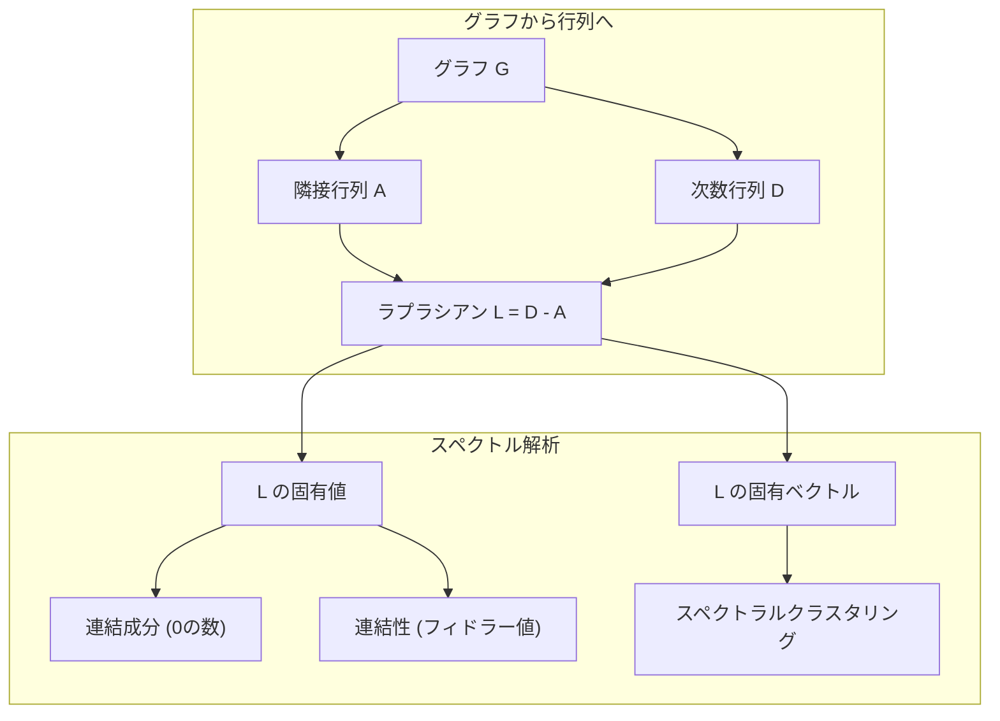
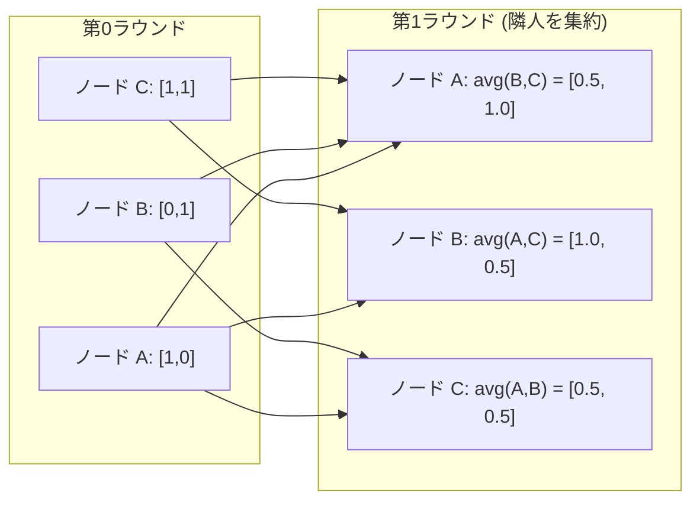

# 機械学習のためのグラフ理論

> グラフは「関係性」を扱うためのデータ構造である。データに繋がりがあるのなら、グラフ理論が必要だ。

**タイプ:** ビルド
**言語:** Python
**前提条件:** フェーズ1、レッスン01-03（線形代数、行列）
**時間:** 約90分

## 学習目標

- 隣接行列・隣接リスト表現を用いたグラフクラスを構築し、BFS（幅優先探索）と DFS（深さ優先探索）を実装する
- グラフ・ラプラシアンを計算し、その固有値を用いて連結成分の検出やノードのクラスタリングを行う
- 正規化された隣接行列の乗算として、GNN スタイルのメッセージパッシングを1ラウンド実装する
- フィドラーベクトル（Fiedler vector）を用いたスペクトラルクラスタリングを適用し、グラフを分割する

## 問題の背景

ソーシャルネットワーク、分子構造、知識ベース、引用ネットワーク、道路地図――これらはすべてグラフである。従来の機械学習では、データを平坦な表（テーブル）として扱ってきた。各行は独立しており、各特徴量は列として並ぶ。しかし、接続の構造そのものが重要な場合、テーブル形式では不十分だ。

ソーシャルネットワークを考えてみよう。あるユーザーがどの商品を買うかを予測したいとする。本人の購入履歴はもちろん重要だが、それ以上に「友人の購入履歴」が重要なシグナルとなる。接続そのものが情報を持っているのだ。

分子構造を考えてみよう。ある分子がタンパク質に結合するかどうかを予測したい。原子の種類も重要だが、本当に重要なのは原子がどのように結合しているかである。構造そのものがデータなのである。

グラフニューラルネットワーク（GNN）は、ディープラーニングにおいて最も急速に成長している分野である。創薬、ソーシャル推薦、不正検知、知識グラフの推論などを支えている。すべての GNN は、基礎的なグラフ理論という同じ土台の上に築かれている。

必要なのは次の4つだ。
1. グラフを行列として表現する方法（行列演算ができるようにするため）
2. グラフの構造を探索するための探索アルゴリズム
3. ラプラシアン――スペクトラルグラフ理論において最も重要な行列
4. メッセージパッシング――GNN を機能させるための基幹操作

## 概念

### グラフ：ノードとエッジ

グラフ G = (V, E) は、頂点（ノード）V と辺（エッジ）E で構成される。各エッジは2つのノードを繋ぐ。

**有向 vs 無向。** 無向グラフでは、エッジ (u, v) は u が v に繋がり、かつ v が u に繋がっていることを意味する。有向グラフ（ダイグラフ）では、エッジ (u, v) は u が v を指していることを意味するが、逆も同様であるとは限らない。

**重み付き vs 重みなし。** 重みなしグラフでは、エッジが存在するかしないかのどちらかである。重み付きグラフでは、各エッジに数値的な重み――距離、コスト、強度など――が割り当てられている。

| グラフの種類 | 例 |
|-----------|---------|
| 無向、重みなし | Facebook の友達ネットワーク |
| 有向、重みなし | Twitter のフォローネットワーク |
| 無向、重み付き | 道路地図（距離） |
| 有向、重み付き | ウェブページのリンク（PageRank スコア） |

### 隣接行列 (Adjacency Matrix)

隣接行列 A は、グラフ表現の核心である。n 個のノードを持つグラフにおいて：

```
A[i][j] = 1    ノード i からノード j へエッジがある場合
A[i][j] = 0    それ以外の場合
```

無向グラフの場合、A は対称行列となる（A[i][j] = A[j][i]）。重み付きグラフの場合、A[i][j] はエッジ (i, j) の重みとなる。

**例：三角形のグラフ**

```
ノード: 0, 1, 2
エッジ: (0,1), (1,2), (0,2)

A = [[0, 1, 1],
     [1, 0, 1],
     [1, 1, 0]]
```

隣接行列は、あらゆる GNN の入力となる。行列 A に対する演算は、グラフに対する操作に対応する。

### 次数 (Degree)

ノードの次数とは、そのノードに接続されているエッジの数である。有向グラフの場合は、入次数（入ってくるエッジ）と出次数（出ていくエッジ）がある。

次数行列 D は、対角行列として定義される。

```
D[i][i] = ノード i の次数
D[i][j] = 0    (i != j の場合)
```

三角形の例では、すべてのノードが他の2つと繋がっているため、D = diag(2, 2, 2) となる。

次数はノードの重要度を教えてくれる。次数が高いノードは「ハブ（hub）」と呼ばれる。ネットワークの次数分布はその構造を反映する。ソーシャルネットワークはべき乗則（少数のハブと多数のリーフノード）に従う。ランダムグラフの次数はポアソン分布に従う。

### BFS と DFS

2つの基本的なグラフ探索アルゴリズム。両方を使い分ける必要がある。

**幅優先探索 (BFS: Breadth-First Search):** まず隣接するノードをすべて探索し、次にそれらの隣人を探索する。キュー（FIFO: 先入れ先出し）を使用する。

```
ノード 0 からの BFS:
  0 を訪問
  キュー: [1, 2]        (0 の隣人)
  1 を訪問
  キュー: [2, 3]        (1 の隣人を追加)
  2 を訪問
  キュー: [3]           (2 の隣人は訪問済み)
  3 を訪問
  キュー: []            (終了)
```

BFS は、重みなしグラフにおける最短経路を見つけるのに適している。開始点からあるノードまでの距離は、そのノードが最初に発見された BFS のレベル（深さ）に等しい。ソーシャルネットワークでの「ホップ数（何人先か）」の計算に BFS が使われるのはこのためだ。

**深さ優先探索 (DFS: Depth-First Search):** 戻る（バックトラックする）前に、可能な限り深く探索を進める。スタック（LIFO: 後入れ先出し）または再帰を使用する。

```
ノード 0 からの DFS:
  0 を訪問
  スタック: [1, 2]      (0 の隣人)
  2 を訪問               (スタックから取り出す)
  スタック: [1, 3]      (2 の隣人を追加)
  3 を訪問               (スタックから取り出す)
  スタック: [1]
  1 を訪問               (スタックから取り出す)
  スタック: []           (終了)
```

DFS は以下の用途に有効である。
- 連結成分の特定（未訪問のノードから順次 DFS を実行）
- 閉路（サイクル）の検出
- トポロジカルソート（DFS の終了順の逆順）

| アルゴリズム | データ構造 | 発見するもの | ユースケース |
|-----------|---------------|-------|----------|
| BFS | キュー | 最短経路 | ソーシャルネットワークの距離、知識グラフの探索 |
| DFS | スタック | 連結成分、閉路 | ネットワークの連結性確認、トポロジカルソート |

### グラフ・ラプラシアン (Graph Laplacian)

L = D - A。スペクトラルグラフ理論において最も重要な行列である。

三角形の例の場合：

```
D = [[2, 0, 0],    A = [[0, 1, 1],    L = [[2, -1, -1],
     [0, 2, 0],         [1, 0, 1],         [-1, 2, -1],
     [0, 0, 2]]         [1, 1, 0]]         [-1, -1,  2]]
```

ラプラシアンには驚くべき性質がある。

1. **L は半正定値である。** すべての固有値は 0 以上である。
2. **0 である固有値の数は、連結成分の数に等しい。** 連結されたグラフは、正確に1つの 0 固有値を持つ。3つの独立した塊からなるグラフは、3つの 0 固有値を持つ。
3. **0 でない最小の固有値（フィドラー値）は、連結の強さを表す。** フィドラー値が大きいほど、そのグラフは密に結合されている。小さい場合は、グラフに「ボトルネック」となる弱い繋がりがあることを意味する。
4. **フィドラー値に対応する固有ベクトル（フィドラーベクトル）は、最適な分割を教えてくれる。** 正の値を持つノードを一方のグループに、負の値を持つノードを他方に分ける。これが「スペクトラルクラスタリング」である。



### スペクトル特性

隣接行列やラプラシアンの固有値は、探索を行わずともグラフの構造的特徴を明らかにする。

**スペクトラルクラスタリング**の手順：
1. ラプラシアン L を計算する
2. L の最小の k 個の固有ベクトルを求める（最初の「すべて1」のベクトルは連結グラフでは無視する）
3. それらの固有ベクトルを、各ノードの新しい座標として使用する
4. その座標に対して k-means を実行する

なぜこれでうまくいくのか？ ラプラシアンの固有ベクトルは、グラフ上での「最も滑らかな」関数をエンコードしているからだ。密に繋がっているノード同士は、似たような固有ベクトル値を持つことになる。ボトルネックによって隔てられているノード同士は、異なる値を持つ。固有ベクトルが自然にクラスターを分離してくれるのである。

**ランダムウォークとの関係。** 正規化されたラプラシアンは、グラフ上のランダムウォークに関連している。ランダムウォークの定常分布はノードの次数に比例する。ランダムウォークが収束するまでの時間（混合時間）は、スペクトルギャップに依存する。

### メッセージパッシング (Message Passing)

グラフニューラルネットワークの核心的な操作。各ノードが周囲の隣人から「メッセージ」を収集し、それらを統合（アグリゲート）して、自身の状態を更新する。

```
h_v^(k+1) = UPDATE(h_v^(k), AGGREGATE({h_u^(k) : u in neighbors(v)}))
```

最も単純な形式では、AGGREGATE に平均値を使い、UPDATE に線形変換と活性化関数を使用する。

```
h_v^(k+1) = sigma(W * mean({h_u^(k) : u in neighbors(v)}))
```

これは行列計算の形でも表現できる。H をノード特徴量の行列、A を隣接行列とすると：

```
H^(k+1) = sigma(A_norm * H^(k) * W)
```

ここで A_norm は、各行の和が 1 になるように正規化された隣接行列である。

1ラウンドのメッセージパッシングで、各ノードは「直系の隣人」を見ることができる。2ラウンドなら「隣人の隣人」まで。K ラウンド実行すれば、各ノードは K ホップ先の近傍からの情報を得ることができる。



### 概念と ML への応用

| 概念 | ML への応用 |
|---------|---------------|
| 隣接行列 | GNN の入力表現 |
| グラフ・ラプラシアン | スペクトラルクラスタリング、コミュニティ検出 |
| BFS/DFS | 知識グラフの探索、経路検索 |
| 次数分布 | ノードの重要度評価、特徴量エンジニアリング |
| メッセージパッシング | GNN レイヤー (GCN, GAT, GraphSAGE) |
| L の固有値 | コミュニティ検出、グラフ分割 |
| スペクトラルクラスタリング | 教師なしのノードグルーピング |
| PageRank | ノードの重要度ランキング、ウェブ検索 |

## ビルド・イット

### ステップ 1: ゼロからの Graph クラス

```python
class Graph:
    def __init__(self, n_nodes, directed=False):
        self.n = n_nodes
        self.directed = directed
        self.adj = {i: {} for i in range(n_nodes)}

    def add_edge(self, u, v, weight=1.0):
        self.adj[u][v] = weight
        if not self.directed:
            self.adj[v][u] = weight

    def neighbors(self, node):
        return list(self.adj[node].keys())

    def degree(self, node):
        return len(self.adj[node])

    def adjacency_matrix(self):
        import numpy as np
        A = np.zeros((self.n, self.n))
        for u in range(self.n):
            for v, w in self.adj[u].items():
                A[u][v] = w
        return A

    def degree_matrix(self):
        import numpy as np
        D = np.zeros((self.n, self.n))
        for i in range(self.n):
            D[i][i] = self.degree(i)
        return D

    def laplacian(self):
        return self.degree_matrix() - self.adjacency_matrix()
```

隣接リスト (`self.adj`) はエッジを効率的に保持する。隣接行列への変換には、スペクトル演算を行うために NumPy を利用する。

### ステップ 2: BFS と DFS

```python
from collections import deque

def bfs(graph, start):
    visited = set()
    order = []
    distances = {}
    queue = deque([(start, 0)])
    visited.add(start)
    while queue:
        node, dist = queue.popleft()
        order.append(node)
        distances[node] = dist
        for neighbor in graph.neighbors(node):
            if neighbor not in visited:
                visited.add(neighbor)
                queue.append((neighbor, dist + 1))
    return order, distances


def dfs(graph, start):
    visited = set()
    order = []
    stack = [start]
    while stack:
        node = stack.pop()
        if node in visited:
            continue
        visited.add(node)
        order.append(node)
        for neighbor in reversed(graph.neighbors(node)):
            if neighbor not in visited:
                stack.append(neighbor)
    return order
```

BFS は O(1) で先頭を取り出すために `deque` を使用し、DFS はリストをスタックとして使用する。いずれもすべてのノードをちょうど1回訪問するため、計算量は O(V + E) である。

### ステップ 3: 連結成分とラプラシアン固有値

```python
def connected_components(graph):
    visited = set()
    components = []
    for node in range(graph.n):
        if node not in visited:
            order, _ = bfs(graph, node)
            visited.update(order)
            components.append(order)
    return components


def laplacian_eigenvalues(graph):
    import numpy as np
    L = graph.laplacian()
    eigenvalues = np.linalg.eigvalsh(L)
    return eigenvalues
```

`eigvalsh` は対称行列用の固有値計算関数である（無向グラフのラプラシアンは常に期待される通り対称である）。これは固有値を昇順で返す。0 の数を数えることで連結成分の数がわかる。

### ステップ 4: スペクトラルクラスタリング

```python
def spectral_clustering(graph, k=2):
    import numpy as np
    L = graph.laplacian()
    eigenvalues, eigenvectors = np.linalg.eigh(L)
    # フィドラーベクトルを取得（固有値 0 の次に対応するもの）
    features = eigenvectors[:, 1:k+1]

    labels = np.zeros(graph.n, dtype=int)
    for i in range(graph.n):
        if features[i, 0] >= 0:
            labels[i] = 0
        else:
            labels[i] = 1
    return labels
```

k=2 の場合、フィドラーベクトルの符号によってグラフを2つのクラスターに分割する。k > 2 の場合は、最初の k 個の固有ベクトル（すべて 1 のものを除く）に対して k-means を実行する。

### ステップ 5: メッセージパッシング

```python
def message_passing(graph, features, weight_matrix):
    import numpy as np
    A = graph.adjacency_matrix()
    # 行の和で割って正規化
    row_sums = A.sum(axis=1, keepdims=True)
    row_sums[row_sums == 0] = 1
    A_norm = A / row_sums
    # 集約
    aggregated = A_norm @ features
    # 更新
    output = aggregated @ weight_matrix
    return output
```

これは GNN メッセージパッシングの1ラウンド分である。各ノードの新しい特徴量は、隣人たちの特徴量の加重平均を重み行列で変換したものになる。これを複数回繰り返すことで、より遠くの情報を伝播させることができる。

## ユーズ・イット

NetworkX と NumPy を使えば、同じ操作はわずか数行で済む。

```python
import networkx as nx
import numpy as np

G = nx.karate_club_graph()

A = nx.adjacency_matrix(G).toarray()
L = nx.laplacian_matrix(G).toarray()

eigenvalues = np.linalg.eigvalsh(L.astype(float))
print(f"最小の固有値: {eigenvalues[:5]}")
print(f"連結成分の数: {nx.number_connected_components(G)}")

communities = nx.community.greedy_modularity_communities(G)
print(f"発見されたコミュニティ数: {len(communities)}")

pr = nx.pagerank(G)
top_nodes = sorted(pr.items(), key=lambda x: x[1], reverse=True)[:5]
print(f"PageRank 上位5ノード: {top_nodes}")
```

実務においては、高度に最適化された NetworkX を使用すること。自作の実装は、それらが内部で何を行っているのかを深く理解するために活用してほしい。

### NumPy によるスペクトル解析

```python
import numpy as np

A = np.array([
    [0, 1, 1, 0, 0],
    [1, 0, 1, 0, 0],
    [1, 1, 0, 1, 0],
    [0, 0, 1, 0, 1],
    [0, 0, 0, 1, 0]
])

D = np.diag(A.sum(axis=1))
L = D - A

eigenvalues, eigenvectors = np.linalg.eigh(L)
print(f"固有値: {np.round(eigenvalues, 4)}")
print(f"フィドラー値: {eigenvalues[1]:.4f}")
print(f"フィドラーベクトル: {np.round(eigenvectors[:, 1], 4)}")

fiedler = eigenvectors[:, 1]
group_a = np.where(fiedler >= 0)[0]
group_b = np.where(fiedler < 0)[0]
print(f"クラスター A: {group_a}")
print(f"クラスター B: {group_b}")
```

フィドラーベクトルが重要な決定（分割）を担ってくれる。正の要素を持つノードを一組に、負をもう一組にするだけだ。繰り返しの最適化は必要なく、一度の固有値分解ですべてが決まる。

## シップ・イット

このレッスンでは以下を生成する：
- `outputs/skill-graph-analysis.md` -- グラフ構造化データを分析するためのスキルリファレンス

## 他のトピックとの繋がり

| 概念 | 登場する場所 |
|---------|------------------|
| 隣接行列 | GCN, GAT, GraphSAGE の入力 |
| ラプラシアン | スペクトラルクラスタリング、ChebNet フィルタ |
| BFS | 知識グラフの探索、最短経路クエリ |
| メッセージパッシング | すべての GNN レイヤー、ニューラルメッセージパッシング |
| スペクトルギャップ | グラフの連結性、ランダムウォークの混合時間 |
| 次数分布 | べき乗則ネットワーク、ノードの特徴量エンジニアリング |
| 連結成分 | 前処理、孤立したグラフの扱い |
| PageRank | ノードの重要度ランキング、アテンションの初期化 |

GNN（グラフニューラルネットワーク）については特に強調しておくべきだろう。GCN (Kipf & Welling, 2017) におけるグラフ畳み込み操作は、自己ループを追加した隣接行列 A_hat = A + I を使用する。

```text
H^(l+1) = sigma(D_hat^(-1/2) * A_hat * D_hat^(-1/2) * H^(l) * W^(l))
```

ここで D_hat は A_hat の次数行列である。自己ループを追加することで、集約時にノード自身の情報も含まれるようになる。これはまさに、対称正規化を伴うメッセージパッシングそのものである。D_hat^(-1/2) * A_hat * D_hat^(-1/2) は正規化された隣接行列である。ラプラシアンを理解することは、なぜ GCN が機能するのかを理解することに直結している。

## 演習

1. **PageRank をゼロから実装せよ。** スコアを均等に初期化し、収束（変化 < 1e-6）するまで以下の更新を繰り返せ：score(v) = (1-d)/n + d * sum(score(u)/out_degree(u))。減衰係数 d = 0.85 とせよ。小さなウェブグラフでテストせよ。

2. **スペクトラルクラスタリングでコミュニティを発見せよ。** 明確に分離された2つのクラスター（例：1本のエッジで繋がった2つのクリーク）を持つグラフを作成せよ。スペクトラルクラスタリングを実行し、正しく分割されるか確認せよ。クラスター間のエッジを増やすとどうなるか？

3. **ダイクストラ (Dijkstra) 法を実装せよ。** 重み付きグラフの最短経路を求め、一様な重みを持つ同じグラフにおける BFS の結果と比較せよ。

4. **2層のメッセージパッシングネットワークを構築せよ。** 異なる重み行列を用いてメッセージパッシングを2回適用せよ。2ラウンド後、各ノードが 2 ホップ先の近傍からの情報を得ていることを示せ。

5. **現実世界のグラフを分析せよ。** Karate Club グラフ（34ノード、78エッジ）を使用せよ。次数分布、ラプラシアン固有値、スペクトラルクラスタリングを計算せよ。スペクトラルクラスタリングの結果と、既知の正しい分割を比較せよ。

## 主要用語

| 用語 | よく言われること | 実際の意味 |
|------|----------------|----------------------|
| グラフ (Graph) | 「ノードとエッジ」 | 対の関係性をエンコードした数学的構造 G=(V,E) |
| 隣接行列 | 「接続のテーブル」 | n x n 行列。ノード i と j が接続されていれば A[i][j] = 1 |
| 次数 (Degree) | 「ノードがどれだけ繋がっているか」 | ノードに接しているエッジの数 |
| ラプラシアン | 「D マイナス A」 | L = D - A。その固有値がグラフの構造を映し出す行列 |
| フィドラー値 | 「代数的連結度」 | L の最小の 0 でない固有値。グラフの連結の強さを測る指標 |
| BFS | 「レベルごとの探索」 | 隣人をすべて訪問してから深く進む探索。最短経路を見つける |
| DFS | 「まず深く行く」 | 一つの道を突き当たりまで進んでから戻る探索 |
| メッセージパッシング | 「隣人と話すノード」 | 各ノードが周囲から情報を集約する、GNN の中心的な操作 |
| スペクトラルクラスタリング | 「固有ベクトルによる分類」 | ラプラシアンの固有ベクトルを用いてグラフを分割する手法 |
| 連結成分 | 「独立した塊」 | どことどこが繋がっているかを示す、グラフ内の互いに到達可能な極大部分 |

## さらに学ぶために

- **Kipf & Welling (2017)** -- "Semi-Supervised Classification with Graph Convolutional Networks." 現代的な GNN の先駆けとなった論文。スペクトラルグラフ畳み込みがメッセージパッシングに簡略化されることを示した。
- **Spielman (2012)** -- "Spectral Graph Theory" 講義ノート。ラプラシアン、スペクトルギャップ、グラフ分割に関する決定版の入門資料。
- **Hamilton (2020)** -- "Graph Representation Learning." 基礎から応用まで GNN を網羅した書籍。
- **Bronstein et al. (2021)** -- "Geometric Deep Learning: Grids, Groups, Graphs, Geodesics, and Gauges." 統一的なフレームワークを提示した論文。
- **Veličković et al. (2018)** -- "Graph Attention Networks." アテンション機構によってメッセージパッシングを拡張。
