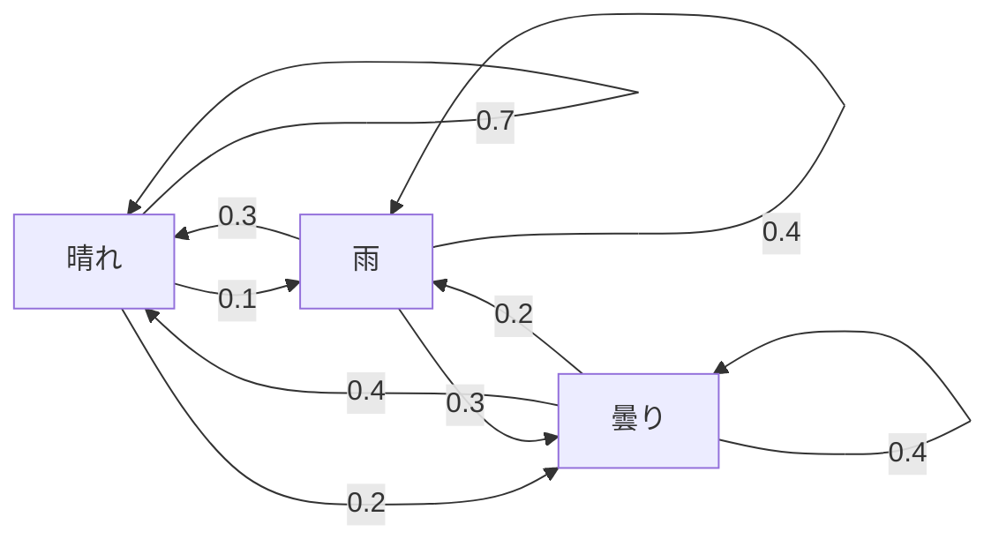
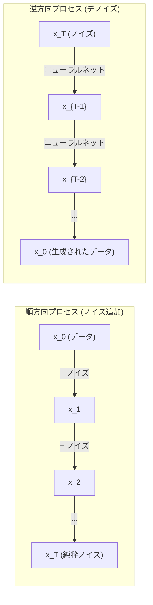

# 確率過程

> 構造を持ったランダムさ。ランダムウォーク、マルコフ連鎖、そして拡散モデルの背後にある数学。

**タイプ:** 学習
**言語:** Python
**前提条件:** フェーズ1、レッスン06-07（確率、ベイズ）
**時間:** 約75分

## 学習目標

- 1次元および2次元のランダムウォークをシミュレートし、変位の sqrt(n) スケーリングを検証する
- マルコフ連鎖シミュレータを構築し、固有値分解を用いてその定常分布を計算する
- ターゲット分布からサンプリングするためのメトロポリス・ヘイスティングス（Metropolis-Hastings）およびランジュバン（Langevin）動力学を実装する
- 順方向の拡散過程をブラウン運動に結びつけ、逆過程がどのようにデータを生成するかを説明する

## 問題の背景

多くの AI システムには、時間の経過とともに進化するランダムさが含まれている。それは単なる静的なランダムさではなく、各ステップがそれ以前の状態に依存するような、構造化された「連続的なランダムさ」である。

言語モデルはトークンを1つずつ生成する。各トークンは直前のコンテキスト（文脈）に依存する。モデルは確率分布を出力し、そこからサンプリングして次へ進む。これは一つの確率過程である。

拡散モデルは、画像に少しずつノイズを加えていき、最終的に完全に真っ白な（純粋な静止した）ノイズにする。そして、その過程を逆転させ、ステップごとにノイズを除去（デノイズ）していくことで、新しい画像を出現させる。この順方向のプロセスはマルコフ連鎖であり、逆方向のプロセスは「逆向きに実行されるように学習されたマルコフ連鎖」である。

強化学習のエージェントは、環境の中で行動を選択する。各行動はある確率で新しい状態を導く。エージェントはランダムな世界でランダムな方策に従う。この全体像は、マルコフ決定過程である。

ベイズ推論の基盤となる MCMC（マルコフ連鎖モンテカルロ法）サンプリングは、サンプリングしたい事後分布を定常分布として持つマルコフ連鎖を構築する。

これらすべては、以下の4つの基礎的なアイデアの上に成り立っている。
1. ランダムウォーク――最も単純な確率過程
2. マルコフ連鎖――遷移行列を持つ、構造化されたランダムさ
3. ランジュバン動力学――ノイズを加えた勾配降下法
4. メトロポリス・ヘイスティングス――任意の分布からのサンプリング

## 概念

### ランダムウォーク

位置 0 から始める。各ステップで、公平なコインを投げる。表なら右へ（+1）、裏なら左へ（-1）移動する。

n ステップ後、あなたの位置は n 個のランダムな +/-1 の値の合計になる。期待される位置は 0 である（偏りがないため）。しかし、原点からの「期待される距離」は sqrt(n) に比例して増大する。

これは直感に反するかもしれない。ウォークは公平であり、どちらの方向にもドリフト（偏り）はない。しかし、時間が経つにつれて、出発点からどんどん遠くへとさまよっていく。n ステップ後の標準偏差は sqrt(n) となる。

```
ステップ 0:  位置 = 0
ステップ 1:  位置 = +1 または -1
ステップ 2:  位置 = +2, 0, または -2
...
ステップ 100: 原点からの期待距離 ~ 10 (sqrt(100))
ステップ 10000: 原点からの期待距離 ~ 100 (sqrt(10000))
```

**2次元の場合**、ウォークは上下左右に等確率で移動する。原点からの距離についても同じ sqrt(n) のスケーリングが適用される。その経路はフラクタルのようなパターンを描く。

**なぜ sqrt(n) なのか？** 各ステップは等確率で +1 または -1 である。n ステップ後の位置 S_n = X_1 + X_2 + ... + X_n とすると、各 X_i は +/-1 である。各ステップの分散は 1 であり、ステップは独立しているため、Var(S_n) = n となる。よって標準偏差 = sqrt(n) である。中心極限定理により、S_n / sqrt(n) は標準正規分布に収束する。

この sqrt(n) スケーリングは ML のいたるところに現れる。SGD のノイズは 1/sqrt(batch_size) に比例し、埋め込み次元は sqrt(d) にスケールする。「平方根」は、独立したランダムな加算が行われていることの証（シグネチャー）なのである。

**ブラウン運動との接続。** ステップサイズを 1/sqrt(n) とし、単位時間あたり n ステップ進むランダムウォークを考える。n を無限大に飛ばすと、このウォークはブラウン運動 B(t) に収束する。これは連続時間の過程であり、B(t) は平均 0、分散 t の正規分布に従う。

ブラウン運動は拡散（ディフュージョン）の数学的基礎である。それは流体中の粒子のランダムな不規則運動や、株価の変動、そして――極めて重要なことに――拡散モデルにおけるノイズ過程をモデル化している。

**破産の連鎖 (Gambler's ruin)。** 位置 k から始め、0 と N に吸収壁があるランダムウォーカーを考える。0 に着く前に N に到達する確率はいくらか？ 公平なウォークの場合、P(Nに到達) = k/N となる。これは驚くほどシンプルでエレガントな結果だ。これは、将来の値の期待値が現在の値に等しいという「マルチンゲール」の理論に繋がっている。

### マルコフ連鎖 (Markov Chains)

マルコフ連鎖とは、固定された確率に従って状態間を遷移するシステムである。鍵となる性質は、**「次の状態は現在の状態にのみ依存し、それ以前の履歴には依存しない」**ということだ。

```
P(X_{t+1} = j | X_t = i, X_{t-1} = ...) = P(X_{t+1} = j | X_t = i)
```

これがマルコフ性である。これにより、全体の動態を**遷移行列 P** で記述できる。

```
P[i][j] = 状態 i から状態 j へ遷移する確率
```

P の各行の和は 1 になる（どこかへは遷移しなければならないため）。

**例：天気**

```
状態: 晴れ (0), 雨 (1), 曇り (2)

P = [[0.7, 0.1, 0.2],    (晴れの場合: 70% 晴れ, 10% 雨, 20% 曇り)
     [0.3, 0.4, 0.3],    (雨の場合: 30% 晴れ, 40% 雨, 30% 曇り)
     [0.4, 0.2, 0.4]]    (曇りの場合: 40% 晴れ, 20% 雨, 40% 曇り)
```

どの状態から始めても、多くの遷移を繰り返した後、状態の分布は**定常分布 pi** に収束する。ここで pi * P = pi が成り立つ。これは、固有値 1 に対応する P の左固有ベクトルである。

この天気の連鎖の場合、定常分布は [0.53, 0.18, 0.29] のようになるかもしれない。つまり、長期的には（開始時の天気がどうであれ）53% の確率で晴れになるということだ。



**定常分布の計算。** 主に2つのアプローチがある：

1. **べき乗法**: 任意の初期分布に P を繰り返し掛ける。十分な回数繰り返せば収束する。
2. **固有値法**: P の固有値 1 に対応する左固有ベクトルを見つける（これは P^T の固有値 1 に対応する右固有ベクトルと同じである）。

いずれのアプローチにおいても、連鎖が収束の条件を満たしている必要がある。

**収束の条件。** マルコフ連鎖が一意な定常分布に収束するための条件：
- **既約性 (Irreducible)**: どの状態からでも、他のどの状態へも到達可能であること。
- **非周期性 (Aperiodic)**: 固定された周期で循環しないこと。

ML で遭遇するほとんどの連鎖は、これら両方の条件を満たしている。

**吸収状態 (Absorbing states)。** 一度入ると二度と出られない状態（P[i][i] = 1）を吸収状態と呼ぶ。吸収マルコフ連鎖は、終了状態のあるプロセスをモデル化するのに使われる。例えば、終わりのあるゲーム、解約した顧客、`<end-of-text>` に達したトークン列などである。

**混合時間 (Mixing time)。** 連鎖が定常分布に「十分に近く」なるまでに何ステップ必要か？ 数学的には、定常分布との全変動距離がある閾値を下回るまでのステップ数である。混合が速い（Fast mixing）ということは、少ないステップ数で収束することを意味する。P のスペクトルギャップ（1 から 2番目に大きい固有値の絶対値を引いたもの）が混合時間を制御する。ギャップが大きいほど混合は速い。

### 言語モデルとの接続

言語モデルにおけるトークン生成は、近似的にマルコフ過程である。現在のコンテキスト（文脈）が与えられると、モデルは次のトークンの分布を出力する。「温度（Temperature）」がその鋭さを制御する。

```
P(token_i) = exp(logit_i / temperature) / sum(exp(logit_j / temperature))
```

- 温度 = 1.0: 標準的な分布
- 温度 < 1.0: より鋭い（より決定論的になる）
- 温度 > 1.0: より平坦（よりランダムになる）
- 温度 -> 0: argmax（貪欲法、最も確率の高いものだけを選ぶ）

Top-k サンプリングは、確率の高い上位 k 個のトークンに制限する。Top-p（ニュークリアス）サンプリングは、累積確率が p を超える最小のセットに制限する。これらはいずれもマルコフ遷移確率を修正する操作である。

### ブラウン運動 (Brownian Motion)

ランダムウォークの連続時間極限。位置 B(t) は以下の3つの性質を持つ：
1. B(0) = 0
2. B(t) - B(s) は平均 0、分散 t - s の正規分布に従う（t > s の場合）
3. 重なり合わない区間における増分は互いに独立である

ブラウン運動は連続だが、どこでも微分不可能である。つまり、あらゆるスケールで細かくギザギザに動いている。平面上でのその軌跡のフラクタル次元は 2 である。

離散的なシミュレーションでは、ブラウン運動は以下のように近似される：

```
B(t + dt) = B(t) + sqrt(dt) * z,    (z ~ N(0, 1))
```

ここでの `sqrt(dt)` スケーリングは非常に重要だ。これはランダムウォークに適用される中心極限定理から来ている。

### ランジュバン動力学 (Langevin Dynamics)

勾配降下法が関数の最小値を見つけるのに対し、ランジュバン動力学は exp(-U(x)/T) に比例する確率分布を見つける。ここで U はエネルギー関数、T は温度である。

```
x_{t+1} = x_t - dt * gradient(U(x_t)) + sqrt(2 * T * dt) * z_t
```

粒子には2つの力が働く：
1. **勾配力** (-dt * gradient(U)): 低いエネルギー（勾配降下のように低い方）へと押し下げる力
2. **ランダム力** (sqrt(2*T*dt) * z): ランダムな方向へと押し出し、探索（exploration）を促す力

温度 T = 0 のとき、これは純粋な勾配降下法になる。高温では、ほとんどランダムウォークのようになる。適切な温度設定において、粒子はエネルギーの地形を探索し、エネルギーの低い領域でより長い時間を過ごすようになる。

**拡散モデルとの接続。** 拡散モデルの順方向プロセスは以下の通りである：

```
x_t = sqrt(alpha_t) * x_{t-1} + sqrt(1 - alpha_t) * noise
```

これは、データに徐々にノイズを混ぜていくマルコフ連鎖である。十分なステップの後、x_T は純粋なガウスノイズ（ガウシアン・ホワイトノイズ）になる。

ノイズからデータへと戻る「逆方向プロセス」もまたマルコフ連鎖だが、その遷移確率はニューラルネットワークによって学習される。ネットワークは各ステップで加えられたノイズを予測することを学び、それを差し引くのである。



### MCMC：マルコフ連鎖モンテカルロ法

（定数を除いて）評価はできるが、直接サンプリングすることができない分布 p(x) からサンプリングが必要になることがある。ベイズの事後分布がその典型例だ（尤度×事前分布は計算できても、正規化定数の計算が困難な場合）。

**メトロポリス・ヘイスティングス (Metropolis-Hastings)** は、p(x) を定常分布として持つマルコフ連鎖を構築する：

1. ある位置 x から始める。
2. 提案分布 Q(x'|x) から新しい位置 x' を提案する。
3. 受理確率を計算する: a = p(x') * Q(x|x') / (p(x) * Q(x'|x))
4. 確率 min(1, a) で x' を受理する。そうでなければ x に留まる。
5. これを繰り返す。

Q が対称な場合（例：Q(x'|x) = Q(x|x') = N(x, sigma^2)）、この比率は a = p(x') / p(x) と単純化される。必要なのは確率の比だけであり、正規化定数はキャンセルされる。

この連鎖は、緩やかな条件の下で p(x) に収束することが保証されている。しかし、提案が小さすぎると（ランダムウォークのように）遅くなり、大きすぎると受理率が低くなって、収束が遅くなる。提案分布をうまく調整することが MCMC のコツである。

**なぜ機能するのか。** 受理確率は「詳細釣り合い（detailed balance）」を保証する。つまり「x にいて x' へ移動する確率」と「x' にいて x へ移動する確率」が等しくなる。詳細釣り合いが成り立つとき、p(x) はその連鎖の定常分布となる。したがって、十分なステップの後、得られるサンプルは p(x) からのものとなる。

**実務上の考慮点：**
- **バーンイン (Burn-in)**: 最初の N 個のサンプルを捨てる。連鎖が開始点から定常分布に到達するまでの時間が必要なため。
- **間引き (Thinning)**: 自己相関を減らすために、k 個おきにサンプルを保持する。
- **マルチチェイン**: 異なる開始点から複数の連鎖を走らせる。それらが同じ分布に収束すれば、収束の証拠となる。
- **受理率**: d 次元のガウス提案分布の場合、最適な受理率は約 23.4% とされる (Roberts & Rosenthal, 2001)。高すぎると連鎖がほとんど動いていないことを意味し、低すぎるとすべてが拒絶されていることを意味する。

### AI における確率過程

| 過程 | AI での応用 |
|---------|---------------|
| ランダムウォーク | 強化学習での探索、Node2Vec グラフ埋め込み |
| マルコフ連鎖 | テキスト生成、MCMC サンプリング |
| ブラウン運動 | 拡散モデル（順方向プロセス） |
| ランジュバン動力学 | スコアベース生成モデル、SGLD |
| マルコフ決定過程 | 強化学習 |
| メトロポリス・ヘイスティングス | ベイズ推論、事後分布サンプリング |

## ビルド・イット

### ステップ 1: ランダムウォーク・シミュレータ

```python
import numpy as np

def random_walk_1d(n_steps, seed=None):
    rng = np.random.RandomState(seed)
    steps = rng.choice([-1, 1], size=n_steps)
    positions = np.concatenate([[0], np.cumsum(steps)])
    return positions


def random_walk_2d(n_steps, seed=None):
    rng = np.random.RandomState(seed)
    directions = rng.choice(4, size=n_steps)
    dx = np.zeros(n_steps)
    dy = np.zeros(n_steps)
    dx[directions == 0] = 1   # 右
    dx[directions == 1] = -1  # 左
    dy[directions == 2] = 1   # 上
    dy[directions == 3] = -1  # 下
    x = np.concatenate([[0], np.cumsum(dx)])
    y = np.concatenate([[0], np.cumsum(dy)])
    return x, y
```

1次元ウォークは累積和を保存する。各ステップは +1 または -1 である。n ステップ後の位置はその合計である。分散は n に比例して増えるため、標準偏差は sqrt(n) に比例して増える。

### ステップ 2: マルコフ連鎖

```python
class MarkovChain:
    def __init__(self, transition_matrix, state_names=None):
        self.P = np.array(transition_matrix, dtype=float)
        self.n_states = len(self.P)
        self.state_names = state_names or [str(i) for i in range(self.n_states)]

    def step(self, current_state, rng=None):
        if rng is None:
            rng = np.random.RandomState()
        probs = self.P[current_state]
        return rng.choice(self.n_states, p=probs)

    def simulate(self, start_state, n_steps, seed=None):
        rng = np.random.RandomState(seed)
        states = [start_state]
        current = start_state
        for _ in range(n_steps):
            current = self.step(current, rng)
            states.append(current)
        return states

    def stationary_distribution(self):
        eigenvalues, eigenvectors = np.linalg.eig(self.P.T)
        idx = np.argmin(np.abs(eigenvalues - 1.0))
        stationary = np.real(eigenvectors[:, idx])
        stationary = stationary / stationary.sum()
        return np.abs(stationary)
```

定常分布は、固有値 1 に対応する P の左固有ベクトルである。P^T の固有ベクトル（転置することで左固有ベクトルを右固有ベクトルとして扱える）を計算することでこれを求める。

### ステップ 3: ランジュバン動力学

```python
def langevin_dynamics(grad_U, x0, dt, temperature, n_steps, seed=None):
    rng = np.random.RandomState(seed)
    x = np.array(x0, dtype=float)
    trajectory = [x.copy()]
    for _ in range(n_steps):
        noise = rng.randn(*x.shape)
        x = x - dt * grad_U(x) + np.sqrt(2 * temperature * dt) * noise
        trajectory.append(x.copy())
    return np.array(trajectory)
```

勾配は x を低エネルギー側へ押しやり、ノイズは停留を防ぐ。平衡状態において、サンプルの分布は exp(-U(x)/temperature) に比例する。

### ステップ 4: メトロポリス・ヘイスティングス

```python
def metropolis_hastings(target_log_prob, proposal_std, x0, n_samples, seed=None):
    rng = np.random.RandomState(seed)
    x = np.array(x0, dtype=float)
    samples = [x.copy()]
    accepted = 0
    for _ in range(n_samples - 1):
        x_proposed = x + rng.randn(*x.shape) * proposal_std
        # log 空間での比率計算
        log_ratio = target_log_prob(x_proposed) - target_log_prob(x)
        if np.log(rng.rand()) < log_ratio:
            x = x_proposed
            accepted += 1
        samples.append(x.copy())
    acceptance_rate = accepted / (n_samples - 1)
    return np.array(samples), acceptance_rate
```

アルゴリズムは新しい点を提案し、確率が高くなったか（あるいは比率に応じた確率で）を確認して、受諾か拒絶かを決める。良い混合のためには、受理率は 23～50% 程度が望ましい。

## ユーズ・イット

実務では、これらのアルゴリズムのために確立されたライブラリを使用するだろう。しかし、デバッグやチューニングのためには内部の仕組みを理解しておく必要がある。

```python
import numpy as np

rng = np.random.RandomState(42)
walk = np.cumsum(rng.choice([-1, 1], size=10000))
print(f"最終位置: {walk[-1]}")
print(f"期待される距離: {np.sqrt(10000):.1f}")
print(f"実際の距離: {abs(walk[-1])}")
```

### NumPy による遷移行列の扱い

```python
import numpy as np

P = np.array([[0.7, 0.1, 0.2],
              [0.3, 0.4, 0.3],
              [0.4, 0.2, 0.4]])

distribution = np.array([1.0, 0.0, 0.0])
for _ in range(100):
    distribution = distribution @ P

print(f"定常分布: {np.round(distribution, 4)}")
```

初期分布に P を繰り返し掛けると、どこから始めても定常分布に収束する。これは支配的な左固有ベクトルを見つけるための「べき乗法」である。

### 実際のフレームワークとの繋がり

- **PyTorch 拡散モデル**: Hugging Face `diffusers` の `DDPMScheduler` は、順方向および逆方向のマルコフ連鎖を実装している。
- **NumPyro / PyMC**: ベイズ推論のために MCMC（Metropolis-Hastings を改良した NUTS サンプラーなど）を使用する。
- **Gymnasium (RL)**: 環境の `step` 関数は、マルコフ決定過程（MDP）を定義している。

### マルコフ連鎖の収束検証

```python
import numpy as np

P = np.array([[0.9, 0.1], [0.3, 0.7]])

eigenvalues = np.linalg.eigvals(P)
# 1 を除いた 2番目に大きい固有値との差がスペクトルギャップ
spectral_gap = 1 - sorted(np.abs(eigenvalues))[-2]
print(f"固有値: {eigenvalues}")
print(f"スペクトルギャップ: {spectral_gap:.4f}")
print(f"おおよその混合時間: {1/spectral_gap:.1f} ステップ")
```

スペクトルギャップは、連鎖がどれだけ速く初期状態を忘れるかを教えてくれる。ギャップが 0.2 なら混合までにおよそ 5 ステップ、0.01 なら 100 ステップ程度かかる。長いシミュレーションを走らせる前に必ずこれを確認せよ。混合の遅い連鎖は計算リソースの無駄遣いになる。

## シップ・イット

このレッスンでは以下を生成する：
- `outputs/prompt-stochastic-process-advisor.md` -- 与えられた問題にどの確率過程のフレームワークが適しているかを特定するのを助けるプロンプト

## 主要用語と繋がり

| 概念 | 登場する場所 |
|---------|------------------|
| ランダムウォーク | Node2Vec グラフ埋め込み、強化学習の探索 |
| マルコフ連鎖 | LLM におけるトークン生成、MCMC サンプリング |
| ブラウン運動 | DDPM における順方向拡散プロセス、SDE ベースのモデル |
| ランジュバン動力学 | スコアベース生成モデル、確率的勾配ランジュバン動力学 (SGLD) |
| 定常分布 | MCMC の収束目標、PageRank |
| メトロポリス・ヘイスティングス | ベイズの事後分布サンプリング、焼きなまし法 |
| 温度 (Temperature) | LLM のサンプリング、強化学習のボルツマン探索、焼きなまし法 |
| 混合時間 | MCMC の収束速度、スペクトルギャップ分析 |
| 吸収状態 | シーケンス終了トークン、強化学習の終点 |
| 詳細釣り合い | MCMC サンプラーの正当性の保証 |

拡散モデルについては特に注目すべきである。DDPM (Ho et al., 2020) は順方向マルコフ連鎖を次のように定義している：

```
q(x_t | x_{t-1}) = N(x_t; sqrt(1-beta_t) * x_{t-1}, beta_t * I)
```

ここで beta_t はノイズのスケジュールである。T ステップ後、x_T はほぼ N(0, I) となる。逆方向プロセスは、ノイズを予測するニューラルネットワークによってパラメータ化される：

```
p_theta(x_{t-1} | x_t) = N(x_{t-1}; mu_theta(x_t, t), sigma_t^2 * I)
```

生成の各ステップは、学習されたマルコフ連鎖における一歩なのである。マルコフ連鎖を理解することは、拡散モデルがどのように、そしてなぜデータを生成できるのかを理解することに他ならない。

SGLD (Stochastic Gradient Langevin Dynamics) は、ミニバッチ勾配降下法とランジュバンノイズを組み合わせたものである。フル勾配を計算する代わりに確率的な推定値を用い、適切に調整されたノイズを加える。学習率が減衰するにつれて、SGLD は「最適化」から「サンプリング」へと移行し、ベイズ事後分布の近似サンプルを無料で得ることができる。これは、ニューラルネットワークから不確実性の推定値を得るための最もシンプルな方法の一つである。

これらすべての繋がりに共通する核心的な洞察：確率過程は単なる理論的な道具ではない。それらは現代の AI システムの内部で動いている「計算メカニズム」そのものなのである。LLM の温度を調整するとき、あなたはマルコフ連鎖を調整しているのだ。拡散モデルを訓練するとき、あなたはブラウン運動のようなプロセスを逆転させる方法を学んでいるのだ。ベイズ推論を実行するとき、事後分布に収束する連鎖を構築しているのだ。

## 演習

1. **10000ステップのランダムウォークを1000回シミュレートせよ。** 最終位置の分布をプロットし、それが平均 0、標準偏差 sqrt(10000) = 100 の近似的なガウス分布になることを確認せよ。

2. **マルコフ連鎖を用いたテキストジェネレーターを構築せよ。** 小さなコーパスで訓練し、各単語について次の単語への遷移回数をカウントして遷移行列を作れ。その連鎖からサンプリングして新しい文章を生成せよ。

3. **焼きなまし法 (Simulated Annealing) を実装せよ。** メトロポリス・ヘイスティングスを使用し、高温（ほとんどすべてを受理）から始めて徐々に冷却（改善のみを受理）せよ。多くの局所解を持つ関数の最小値を見つけるのに使え。

4. **異なる温度におけるランジュバン動力学を比較せよ。** ダブルウェル（二つの谷がある）ポテンシャル U(x) = (x^2 - 1)^2 からサンプリングせよ。低温ではサンプルは一方の谷に固まり、高温では両方に広がる。連鎖が二つの谷の間を行き来し始める「臨界温度」を見つけよ。

5. **順方向拡散プロセスを実装せよ。** 1次元の信号（例：サイン波）から始め、線形ノイズスケジュールに従って 100 ステップかけて徐々にノイズを加えよ。信号がどのように純粋なノイズへと劣化していくかを示せ。次に、そのステップを逆転させてノイズを取り除くシンプルなデノイザーを実装せよ。

## 主要用語

| 用語 | よく言われること | 実際の意味 |
|------|----------------|----------------------|
| ランダムウォーク | 「コイン投げによる移動」 | 位置が各ステップでランダムな増分だけ変化するプロセス |
| マルコフ性 | 「記憶を持たない」 | 未来が過去の履歴ではなく、現在の状態のみに依存する性質 |
| 遷移行列 | 「確率のテーブル」 | P[i][j] = 状態 i から j へ移動する確率 |
| 定常分布 | 「長期的な平均」 | pi * P = pi となる分布 pi 。連鎖の平衡状態。 |
| ブラウン運動 | 「ランダムな震え」 | ランダムウォークの連続時間極限。B(t) ~ N(0, t) |
| ランジュバン動力学 | 「ノイズ付き勾配降下法」 | 決定論的な勾配とランダムな摂動を組み合わせた更新規則 |
| MCMC | 「ターゲットへ向かって歩く」 | サンプリングしたい分布を定常分布として持つマルコフ連鎖を構築する手法 |
| メトロポリス・ヘイスティングス | 「提案して受理・拒絶を決める」 | 受理比率を用いて収束を保証する MCMC アルゴリズム |
| 温度 (Temperature) | 「ランダムさを操るツマミ」 | 探索と活用のトレードオフを制御するパラメータ |
| 拡散プロセス | 「ノイズを入れ、ノイズを出す」 | 順方向でノイズを加え、逆方向で除去してデータを生成する過程 |

## さらに学ぶために

- **Ho, Jain, Abbeel (2020)** -- "Denoising Diffusion Probabilistic Models." 拡散モデル革命の火付け役となった DDPM の論文。順方向と逆方向のマルコフ連鎖の導出が明快。
- **Song & Ermon (2019)** -- "Generative Modeling by Estimating Gradients of the Data Distribution." サンプリングにランジュバン動力学を用いた、スコアベースのアプローチ。
- **Roberts & Rosenthal (2004)** -- "General state space Markov chains and MCMC algorithms." MCMC がいつ、なぜ機能するのかという理論的背景。
- **Norris (1997)** -- "Markov Chains." 標準的な教科書。収束、定常分布などが網羅されている。
- **Welling & Teh (2011)** -- "Bayesian Learning via Stochastic Gradient Langevin Dynamics." SGLD を用いて大規模なベイズ推論を可能にした論文。
