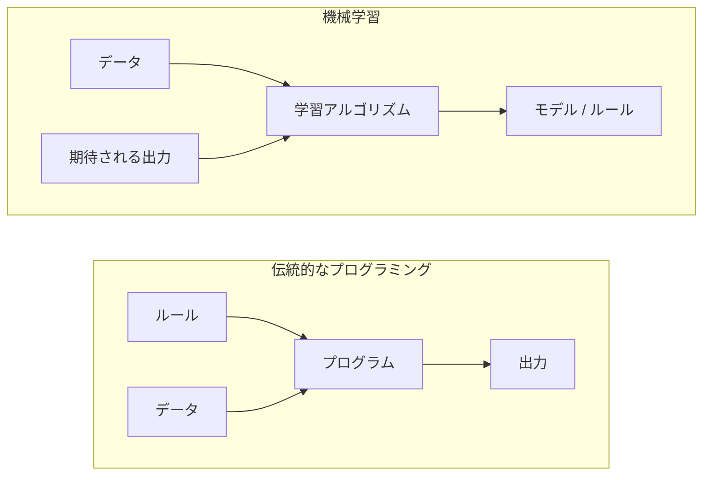
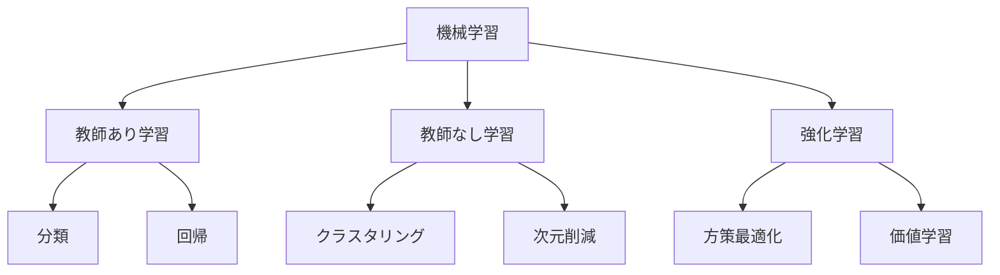
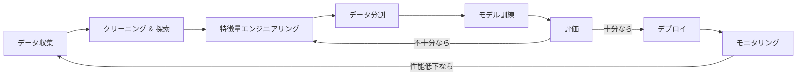
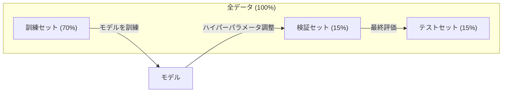
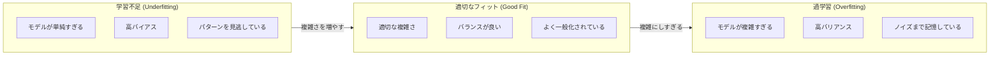
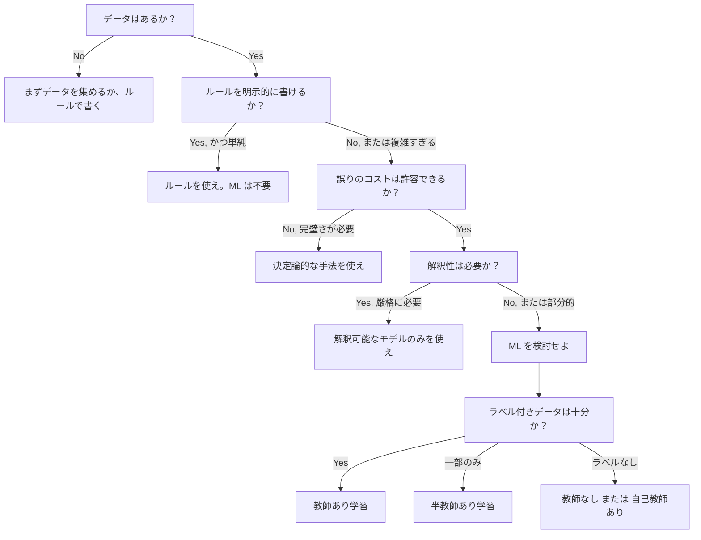

# 機械学習とは何か

> 機械学習（マシンラーニング）とは、ルールを手書きするのではなく、データの中からパターンを見つけ出すようにコンピュータに教えることである。

**タイプ:** 学習
**言語:** Python
**前提条件:** フェーズ1（数学の基礎）
**時間:** 約45分

## 学習目標

- 教師あり学習、教師なし学習、強化学習の違いを説明し、与えられた問題にどのタイプが適用されるかを特定する
- 最寄り重心分類器（nearest centroid classifier）をゼロから実装し、ランダムなベースラインと比較評価する
- 分類タスクと回帰タスクを区別し、それぞれに適した損失関数を選択する
- 与えられたビジネス上の課題が、機械学習に適しているか、あるいは決定論的なルールで解決すべきかを判断する

## 問題の背景

あなたはメールのスパムフィルタを作りたいと考えている。伝統的なアプローチでは、椅子に座って何百ものルールを書き出すことになる。「もしメールに '無料でお金がもらえる' という言葉が含まれていたらスパム。感嘆符が3つ以上あってもスパム。」ルールを書くのに数週間かかる。しかし、スパマーはすぐに言い回しを変える。ルールは通用しなくなり、また新しいルールを書く。このサイクルは終わることがない。

機械学習はこの流れを逆転させる。ルールを書く代わりに、数千通のラベル付きメール（「スパム」か「そうでないか」）をコンピュータに与え、コンピュータ自身にルールを発見させる。コンピュータは、人間が思いもつかなかったようなパターンを見つけ出す。スパマーが戦術を変えても、コードを書き直す代わりに新しいデータでモデルを再学習させればよい。

この「プログラムされたルール」から「データからの学習」へのパラダイムシフトこそが、機械学習の本質である。あらゆる推薦エンジン、音声アシスタント、自動運転車、そして大規模言語モデル（LLM）はこの仕組みで動いている。

## 概念

### ルールではなくデータから学ぶ

伝統的なプログラミングと機械学習は、問題を解決する向きが真逆である。



伝統的なプログラミング：あなたがルールを書く。プログラムはそのルールをデータに適用して出力を出す。

機械学習：あなたがデータと「期待される出力（正解）」を提供する。アルゴリズムがルールを発見する。

学習の結果として得られる「モデル」こそが、数値（重み、パラメータ）としてエンコードされたルールそのものである。モデルは、すでに見た例から一般化を行い、見たことのないデータに対して予測を行う。

### 機械学習の3つのタイプ



**教師あり学習 (Supervised Learning)**: 入力と出力のペア（ラベル）がある場合。モデルは入力を出力にマッピングする方法を学ぶ。
- 「ここに '猫' か '犬' かのラベルが付いた1万枚の写真がある。これらを見分ける方法を学べ。」
- 「ここに家の特徴と価格のリストがある。価格を予測する方法を学べ。」

**教師なし学習 (Unsupervised Learning)**: 入力のみがあり、ラベルがない場合。モデルは自力でデータの構造を見つけ出す。
- 「ここに1万人の顧客の購買履歴がある。自然なグループ分けを見つけ出せ。」
- 「ここに1000次元のデータポイントがある。構造を維持したまま2次元に削減せよ。」

**強化学習 (Reinforcement Learning)**: エージェントが環境の中で行動し、報酬や罰を受け取る。トータルの報酬を最大化するための戦略（方策）を学ぶ。
- 「このゲームをプレイせよ。勝てば +1、負ければ -1。戦略を考え出せ。」
- 「このロボットアームを制御せよ。物を持ち上げれば +1、時間を1秒無駄にするごとに -0.01。」

実務で作るものの多くは教師あり学習である。教師なし学習は前処理やデータ探索でよく使われる。強化学習はゲーム AI やロボティクス、言語モデルの RLHF（人間からのフィードバックによる強化学習）などで力を発揮する。

### 3つの分類を超えて

上記の3つのカテゴリーは明確だが、現実世界の ML はしばしばその境界が曖昧になる。

**半教師あり学習 (Semi-supervised learning)** は、少量のラベル付きデータと大量のラベルなしデータを組み合わせて使用する。例えば、100枚のラベル付き医療画像と10万枚のラベルなし画像があるといった状況だ。

- **ラベル伝播 (Label propagation):** 似たデータポイント同士を結ぶグラフを構築し、ラベル付きノードから周囲のラベルなしノードへとラベルを広めていく。
- **疑似ラベル生成 (Pseudo-labeling):** ラベル付きデータでモデルを訓練し、そのモデルでラベルなしデータのラベルを予測させ、すべてを合わせたデータでもう一度訓練する。モデルが自ら訓練セットを増強させる手法。
- **一致性正則化 (Consistency regularization):** 入力データと、それを少し加工（ノイズ付加など）したデータに対して、モデルが同じ予測を出すように強制する。これはラベルがなくても機能する。

**自己教師あり学習 (Self-supervised learning)** は、データ自体から正解（教師信号）を作り出す。人間によるラベル付けは一切不要だ。

- **マスクされた言語モデリング (BERT):** 文章の中の単語の15%を隠し、欠けている単語を予測するようにモデルを訓練する。正解は元のテキストから得られる。
- **対照学習 (Contrastive learning/SimCLR):** 1枚の画像を2つの異なる方法で加工し、それらが「同じ画像由来である」ことを認識させつつ、他の画像由来のものと区別できるように訓練する。
- **次トークン予測 (GPT):** それまでの単語の並びから、次の単語を予測する。あらゆるテキスト文書がそのまま訓練データになる。

これらは技術的には教師あり学習（モデルが何かを予測している）だが、ラベルが人間ではなく自動的に生成されるという点で異なる。

### 分類 vs 回帰

これらは教師あり学習の2大タスクである。

| 側面 | 分類 (Classification) | 回帰 (Regression) |
|--------|---------------|------------|
| 出力 | 離散的なカテゴリー | 連続的な数値 |
| 例 | 「このメールはスパムか？」 | 「この家の価格はいくらか？」 |
| 出力空間 | {猫, 犬, 鳥} | 任意の浮動小数点数 |
| 損失関数 | クロスエントロピー、正解率 | 平均二乗誤差 (MSE), MAE |
| 決定 | クラス間の境界線を引く | データにフィットする曲線を引く |

分類は「どのカテゴリーか？」に答え、回帰は「どれくらいか（量）？」に答える。

一部の問題はどちらの形式でも扱える。株価が上がるか下がるかを予測するのは分類であり、具体的な価格を予測するのは回帰である。

### ML のワークフロー

アルゴリズムが何であれ、すべての機械学習プロジェクトは同じパイプラインに従う。



**データ収集**: 生データを集める。データ量は多いに越したことはないが、量よりも質が重要。

**クリーニング & 探索**: 欠損値の処理、重複の削除、分布の可視化、異常値の特定。このステップがプロジェクト全体の60～80%の時間を占めることが多い。

**特徴量エンジニアリング**: 生データをモデルが扱える「特徴量」に変換する。日付を曜日に変える、数値を正規化する、カテゴリー変数をエンコードするなど。モデルの種類の工夫よりも、良い特徴量を作ることの方が重要である。

**データ分割**: 訓練用、検証用、テスト用に分ける。訓練用でモデルを鍛え、検証用で細かい調整を行い、最後にテスト用で最終的な性能を確認する。

**モデル訓練**: 訓練データをアルゴリズムに投入する。アルゴリズムは損失関数を最小化するように内部パラメータを調整する。

**評価**: 検証/テストデータで性能を測る。許容できない精度であれば、特徴量やアルゴリズム、ハイパーパラメータを調整し直す。

**デプロイ**: 開発したモデルを本番環境に組み込み、新しいデータに対して予測を行えるようにする。

**モニタリング**: 時間とともに性能を追跡する。データの分布が変わったり（データドリフト）、モデルの精度が落ちたりすることがある。性能が落ちたら再学習や再調整が必要になる。

### 訓練、検証、テストの分割

初心者が最も間違いやすい重要な概念である。モデルを評価する際は、訓練中に一度も見たことのないデータを使わなければならない。そうでないと、「学習」ではなく「丸暗記（記憶）」を測っていることになってしまう。



| 分割 | 目的 | いつ使うか | 一般的な割合 |
|-------|---------|-----------|-------------|
| 訓練 (Train) | モデルがデータから学習する | 訓練中 | 60-80% |
| 検証 (Val) | ハイパーパラメータを調整し、複数のモデルを比較する | 訓練の各試行の後 | 10-20% |
| テスト (Test) | 最終的な偏りのない性能見積もりを得る | プロジェクトの最後、一度だけ | 10-20% |

テストセットは神聖なものである。見るのは一度きりだ。テストセットでの結果を見てモデルを何度も調整してしまうと、実質的にテストセットを訓練しているのと同じになり、報告される数値は無意味になってしまう。

データセットが小さい場合は、**k-分割交差検証 (k-fold cross-validation)** を使用する。データを k 個に分け、k-1 個で訓練、残りの1個で検証を行い、それを順番に入れ替えて平均を取る手法である。

### 過学習 vs 学習不足



**学習不足 (Underfitting)**: モデルが単純すぎて、データの中にあるパターンを捉えきれていない。曲線の関係性を直線で無理やり表そうとしているような状態。訓練エラーもテストエラーも高くなる。

**過学習 (Overfitting)**: モデルが複雑すぎて、訓練データのノイズまで記憶してしまっている。訓練データには完璧に適合するが、新しいデータには対応できない状態。訓練エラーは非常に低いが、テストエラーが高くなる。

**適切なフィット (Good Fit)**: ノイズに惑わされず、本質的なパターンだけを捉えている状態。訓練エラーもテストエラーも妥当な低さになる。

過学習のサイン：
- 訓練データの精度が検証データの精度より大幅に高い
- 訓練データではうまくいくが、新しいデータでは散々な結果になる
- 訓練データを増やすと性能が上がる（丸暗記が難しくなるため）

過学習の対策：
- 訓練データを増やす
- モデルの複雑さを下げる（パラメータを減らす）
- 正則化 (Regularization) を導入する
- ドロップアウト (Dropout) を使う
- 早期終了 (Early stopping) を行う

学習不足の対策：
- より複雑なモデルを使う
- 特徴量を増やす
- 正則化を弱める
- 訓練時間を増やす

### バイアスとバリアンスのトレードオフ

これは過学習と学習不足を説明する数学的な枠組みである。

**バイアス (Bias)**: モデルの誤った仮定による誤差。真の形が曲線なのに直線モデルを使っている場合、高いバイアスを持つ。これは学習不足に繋がる。

**バリアンス (Variance)**: 訓練データの小さな変動に対する敏感さによる誤差。バリアンスが高いモデルは、訓練データのサブセットを変えるだけで全く異なる予測を出す。これは過学習に繋がる。

| モデルの複雑さ | バイアス | バリアンス | 結果 |
|-----------------|------|----------|--------|
| 低すぎる | 高い | 低い | 学習不足 |
| ちょうど良い | 中程度 | 中程度 | 良い一般化 |
| 高すぎる | 低い | 高い | 過学習 |

全誤差 = バイアス^2 + バリアンス + 削減不可能なノイズ

ノイズそのものは減らすことができないため、バイアスとバリアンスの合計が最小になる「スイートスポット」を見つけるのが ML の目標である。

### 「フリーランチなし」の定理

あらゆる問題に対して常に最高の結果を出す唯一のアルゴリズムは存在しない。ある種の問題には極めて強いアルゴリズムも、別の問題には弱い。これが、データサイエンティストが複数のアルゴリズムを試して結果を比較する理由である。

実務における選択基準：
- データの量はどれくらいか
- 特徴量の数はどれくらいか
- 関係性は線形か、非線形か
- 解釈性（なぜその結果になったかの説明しやすさ）が必要か
- 計算リソース（予算、時間）はどれくらいあるか

### 機械学習を使うべき「ではない」とき

ML は強力だが、常に最適な道具とは限らない。モデルを作る前に、本当にそれが必要かを自問せよ。

**ML を使うべきではない場合：**

- **ルールが単純かつ明確である。** 税金計算、ソートアルゴリズム、単位換算など。数個の if 文で書けるなら、モデルを導入しても複雑さが増すだけでメリットがない。
- **データが全くない、あるいは少なすぎる。** 学習するための例がなければ始まらない。
- **誤りが壊滅的な事態を招き、100%の正確性が保証されなければならない。** 投薬量の計算、原子炉の制御など。ML モデルは確率的であり、時として間違える。それが許されないなら決定論的な手法を使うべきだ。
- **ルックアップテーブルや単純なヒューリスティックで解決できる。** 単純な閾値判定で99%カバーできるなら、メンテナンスコストを上げてまで ML を入れる必要はない。
- **意思決定プロセスを説明できなければならない。** 金融審査や司法判断など、法的・倫理的に説明責任がある場合、ブラックボックスになりやすい ML は避けるか、十分に解釈可能なモデル（単純な回帰や決定木）に限定すべきだ。
- **状況の変化が速すぎて、再学習が追いつかない。**

判断フローチャート：



## ビルド・イット

`code/ml_intro.py` では、最もシンプルな ML アルゴリズムである「最寄り重心分類器（Nearest Centroid Classifier）」をゼロから実装する。これは「データから学び、新しいデータに対して予測する」という核心的なアイデアを体現している。

### ステップ 1: 最寄り重心分類器の実装

各クラスのデータポイントの「中心（平均）」を計算し、新しいポイントを「最も近い中心」を持つクラスに割り当てるアルゴリズムである。

```python
class NearestCentroid:
    def fit(self, X, y):
        self.classes = np.unique(y)
        self.centroids = np.array([
            X[y == c].mean(axis=0) for c in self.classes
        ])

    def predict(self, X):
        distances = np.array([
            np.sqrt(((X - c) ** 2).sum(axis=1))
            for c in self.centroids
        ])
        return self.classes[distances.argmin(axis=0)]
```

これだけでアルゴリズムが完成する。
1. `fit` で中心座標（平均）を求める。
2. `predict` で距離を測る。
勾配降下法も、繰り返し計算も、ハイパーパラメータも必要ない。

### ステップ 2: 人工データでの訓練

少し重なりのある2つのクラスからなる2次元データセットを生成し、境界線を引く。

```python
rng = np.random.RandomState(42)
X_class0 = rng.randn(100, 2) + np.array([1.0, 1.0])
X_class1 = rng.randn(100, 2) + np.array([-1.0, -1.0])
X = np.vstack([X_class0, X_class1])
y = np.array([0] * 100 + [1] * 100)
```

### ステップ 3: ベースラインとの比較

すべての ML モデルは、単純なベースラインと比較されるべきだ。ここでは「ランダムに予測するだけ」のベースラインを考える。これに勝てないモデルは役に立たない。

```python
baseline_preds = rng.choice([0, 1], size=len(y_test))
baseline_acc = np.mean(baseline_preds == y_test)
```

きれいなデータセットであれば、重心分類器は約 90% 以上の精度を出し、ランダムなベースライン（約 50%）を圧倒するはずだ。

### ステップ 4: このアルゴリズムの限界

重心分類器は、1つのクラスが一つの「塊」であることを前提としている。そのため、以下のような場合には失敗する。

- 1つのクラスの中に複数のクラスターがある場合（例：数字の '1' でも斜めに書く人と真っ直ぐ書く人がいる）
- 境界線が非線形な場合（例：あるクラスが別のクラスを包み込んでいる）
- 特徴量のスケールが大きく異なる場合（値の大きい特徴量に距離が支配されてしまう）

これらの限界を克服するために、今後学ぶ他のアルゴリズムが登場する。k-近傍法は複数のクラスターに対応し、決定木は非線形な境界を扱える。それぞれのレッスンは、前のアルゴリズムの限界から出発しているのである。

## ユーズ・イット

実務では scikit-learn を使う：

```python
from sklearn.neighbors import NearestCentroid
from sklearn.datasets import make_classification
from sklearn.model_selection import train_test_split

X, y = make_classification(
    n_samples=500, n_features=2, n_redundant=0,
    n_clusters_per_class=1, random_state=42
)
X_train, X_test, y_train, y_test = train_test_split(X, y, test_size=3.0)

clf = NearestCentroid()
clf.fit(X_train, y_train)
print(f"正解率: {clf.score(X_test, y_test):.3f}")
```

## シップ・イット

このレッスンでは `outputs/prompt-ml-problem-framer.md` を生成する。これは、漠然としたビジネス課題を具体的な ML タスクに変換するためのプロンプトである。「顧客離脱を減らしたい」「来期の需要を予測したい」といった説明を入力すると、学習タイプを選定し、予測対象を定義し、候補となる特徴量をリストアップし、成功指標とベースラインを提案し、データリークなどの落とし穴を警告してくれる。

## 主要用語

| 用語 | よく言われること | 実際の意味 |
|------|----------------|----------------------|
| モデル (Model) | 「AI そのもの」 | 入力を出力に変換するための、学習可能なパラメータを持つ数学的関数 |
| 訓練 (Training) | 「AI に教える」 | パラメータを調整して、予測が正解に近づくように最適化アルゴリズムを走らせること |
| 特徴量 (Feature) | 「入力列」 | モデルが予測のために利用する、データの測定可能な性質 |
| ラベル (Label) | 「正解」 | 訓練データに付随する既知の出力値 |
| ハイパーパラメータ | 「調整ツマミ」 | 訓練の前に設定し、学習の過程そのものを制御するパラメータ（学習率など） |
| 損失関数 (Loss function) | 「どれだけ間違っているか」 | 予測と正解のズレを数値化する関数。これを最小化することが訓練の目的 |
| 過学習 | 「暗記してしまった」 | 一般的なパターンではなく訓練データ特有のノイズを学んでしまい、新データに弱い状態 |
| 学習不足 | 「何も学べていない」 | モデルが単純すぎて、データ内の本質的なパターンすら捉えられていない状態 |
| 一般化 (Generalization) | 「新データでも動く」 | 未知のデータに対して正しく予測できる能力 |
| 交差検証 | 「小分けにしてテスト」 | データを入れ替えながら何度も訓練・テストを繰り返し、平均的な性能を測ること |

## 演習

1. 適当なデータセット（Iris や Titanic など）を、訓練/検証/テストに 70/15/15 で分割せよ。なぜテストセットを見てハイパーパラメータを調整してはいけないのか、理由を説明せよ。
2. 現実世界の課題を3つ挙げよ。それぞれについて、分類・回帰・クラスタリングのどれか、また教師あり・なしのどちらにあたるか特定せよ。
3. モデルが訓練データで 99% の精度を出したが、テストデータで 60% になった。何が起きているか診断し、解決のために試すべきことを3つ挙げよ。

## さらに学ぶために

- [An Introduction to Statistical Learning](https://www.statlearning.com/) - 古典的な ML 手法を網羅した、最高峰の入門テキスト（無料配布あり）。
- [Google's Machine Learning Crash Course](https://developers.google.com/machine-learning/crash-course) - 視覚的で分かりやすい ML 概念の入門用コース。
- [Scikit-learn User Guide](https://scikit-learn.org/stable/user_guide.html) - Python での実装における実務的なリファレンス。
