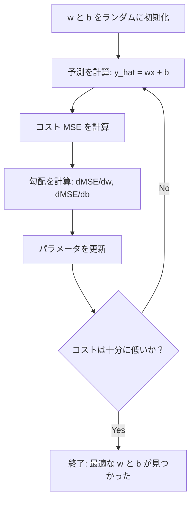

# 線形回帰

> 線形回帰（Linear Regression）は、データの中に最適な直線を描く手法である。これは機械学習における「Hello World」だ。

**タイプ:** ビルド
**言語:** Python
**前提条件:** フェーズ1（線形代数、微分積分、最適化）、フェーズ2 レッスン1
**時間:** 約90分

## 学習目標

- 平均二乗誤差（MSE）に対する勾配降下法の更新規則を導出し、線形回帰をゼロから実装する
- 勾配降下法と正規方程式を計算量とユースケースの観点から比較する
- 特徴量の標準化を伴う重回帰モデルを構築し、学習された重みを解釈する
- リッジ回帰（L2正則化）が大きな重みにペナルティを課すことで過学習を防ぐ仕組みを説明する

## 問題の背景

あなたは、家の広さと販売価格のデータを持っている。新しい家の広さが与えられたとき、その価格を予測したい。散布図を見て目分量で予測することもできるが、数式が必要だ。どんな広さに対しても価格を予測できるように、データに最もよくフィットする直線を見つけなければならない。

線形回帰は、その直線を与えてくれる。さらに重要なのは、線形回帰を通じて「モデルの定義」「コスト関数の定義」「パラメータの最適化」という機械学習の訓練ループ全体を学べることだ。あらゆる機械学習アルゴリズムはこのパターンに従っている。最も単純なケースである線形回帰でこのパターンをマスターすれば、他のあらゆる場所でそれが応用されていることに気づくだろう。

これは単に初歩的な問題のためのものではない。線形回帰は本番システムにおいても、需要予測、A/Bテストの分析、財務モデリング、そしてあらゆる回帰タスクのベースラインとして実際に使用されている。

## 概念

### モデル

線形回帰は、入力 (x) と出力 (y) の間に線形（直線的）な関係があると仮定する。

```
y = wx + b
```

- `w` (重み/傾き): x が 1 増えたときに y がどれだけ変化するか
- `b` (バイアス/切片): x = 0 のときの y の値

複数の入力（特徴量）がある場合は、次のように拡張される。

```
y = w1*x1 + w2*x2 + ... + wn*xn + b
```

ベクトル形式では `y = w^T * x + b` と書ける。

目標は、すべての訓練データにおいて、予測された y が実際の y に「できるだけ近く」なるような w と b の値を見つけることだ。

### コスト関数（平均二乗誤差）

「できるだけ近い」をどう測るか？ 予測がどれだけ間違っているかを一つの数値で表す必要がある。最も一般的な選択肢は**平均二乗誤差 (Mean Squared Error: MSE)** である。

```
MSE = (1/n) * sum((y_予測 - y_実際)^2)
```

なぜ「二乗」するのか？ 主な理由は2つある。第一に、小さな誤差よりも大きな誤差に大きなペナルティを課すためだ（誤差が10の場合、誤差1のときより10倍ではなく100倍悪いとみなす）。第二に、二乗関数はいたるところで滑らかで微分可能（スムーズ）なため、最適化が容易だからだ。

コスト関数は一つの「面」を作り出す。一つの重み w とバイアス b の場合、MSE の面はボウルのような形（凸放物面）になる。ボウルの底が、MSE が最小になる地点である。訓練とは、この「底」を見つけることを意味する。

### 勾配降下法 (Gradient Descent)

勾配降下法は、坂を降るように一歩ずつ進むことでボウルの底を見つける手法である。



勾配は2つのことを教えてくれる。各パラメータをどの方向に動かすべきかと、どれだけ動かすべきかだ。

MSE と y_hat = wx + b の場合：

```
dMSE/dw = (2/n) * sum((y_hat - y) * x)
dMSE/db = (2/n) * sum(y_hat - y)
```

更新規則は次のようになる。

```
w = w - 学習率 * dMSE/dw
b = b - 学習率 * dMSE/db
```

学習率 (Learning rate) は一歩の大きさを制御する。大きすぎると最小値を飛び越えて発散してしまい、小さすぎると訓練に永遠に時間がかかる。一般的な初期値は 0.01、0.001、0.0001 などである。

### 正規方程式 (Normal Equation)

線形回帰に限っては、繰り返し計算を行わずに最適な重みを直接導き出す数式が存在する。

```
w = (X^T * X)^(-1) * X^T * y
```

これは行列の反転（逆行列）を用いて、一歩で w を解く。小規模なデータセットでは完璧に動作する。しかし、大規模なデータセット（数百万行や数万個の特徴量）では、行列の反転の計算量が特徴量数の3乗 (O(n^3)) に比例するため、勾配降下法の方が好まれる。

### 重回帰 (Multiple Linear Regression)

複数の特徴量がある場合、モデルは以下のようになる。

```
y = w1*x1 + w2*x2 + ... + wn*xn + b
```

仕組みは同じだ。MSE をコスト関数とし、勾配降下法ですべての重みを同時に更新する。唯一の違いは、直線の代わりに「超平面 (hyperplane)」をデータにフィットさせている点だ。

ここで**特徴量のスケーリング**が重要になる。ある特徴量が 0～1 の範囲で、別の特徴量が 0～1,000,000 の範囲にある場合、コスト関数の面が細長くなり、勾配降下法が収束しにくくなる。訓練前に特徴量を標準化（平均を引いて標準偏差で割る）することが推奨される。

### 多項式回帰 (Polynomial Regression)

関係が直線でない場合はどうするか？ その場合でも、多項式の特徴量を作ることで線形回帰を利用できる。

```
y = w1*x + w2*x^2 + w3*x^3 + b
```

これは依然として「線形」回帰と呼ばれる。なぜなら、モデルは重み (w1, w2, w3) に対して線形だからだ。単に x の非線形な特徴量を使っているに過ぎない。

次数の高い多項式はより複雑な曲線にフィットできるが、過学習のリスクが高まる。10個のデータに対して10次の多項式を使えば、すべての点を通過する曲線が引けるが、新しいデータに対する予測能力は失われる。

### 決定係数 (R-squared)

MSE はどれだけ間違っているかを教えてくれるが、その数値は y の単位に依存する。決定係数 (R^2) は、単位に依存しない指標を与えてくれる。

```
R^2 = 1 - (残差平方和) / (全平方和)
    = 1 - SS_res / SS_tot
```

- R^2 = 1.0: 完璧な予測
- R^2 = 0.0: 常に平均値を予測するのと変わらない（学習できていない）
- R^2 < 0.0: 平均値を予測するよりも悪い

### 正則化の予習（リッジ回帰）

多くの特徴量がある場合、モデルは大きな重みを割り当てることで過学習しやすくなる。リッジ回帰（L2正則化）はコスト関数に「ペナルティ」を加える。

```
コスト = MSE + lambda * sum(w_i^2)
```

このペナルティ項は、大きな重みを持つことを抑制する。ハイパーパラメータ lambda がトレードオフを制御する。lambda が大きいほど、重みは小さくなり、正則化が強くなる。これについては後のレッスンで詳しく扱うが、今は「過学習を防ぐための工夫」として知っておいてほしい。

## ビルド・イット

### ステップ 1: サンプルデータの生成

```python
import random
import math

random.seed(42)

TRUE_W = 3.0
TRUE_B = 7.0
N_SAMPLES = 100

X = [random.uniform(0, 10) for _ in range(N_SAMPLES)]
y = [TRUE_W * x + TRUE_B + random.gauss(0, 2.0) for x in X]

print(f"{N_SAMPLES} 個のサンプルを生成しました")
print(f"真の関係: y = {TRUE_W}x + {TRUE_B} (+ ノイズ)")
```

### ステップ 2: 勾配降下法による線形回帰（ゼロからの実装）

```python
class LinearRegression:
    def __init__(self, learning_rate=0.01):
        self.w = 0.0
        self.b = 0.0
        self.lr = learning_rate
        self.cost_history = []

    def predict(self, X):
        return [self.w * x + self.b for x in X]

    def compute_cost(self, X, y):
        predictions = self.predict(X)
        n = len(y)
        cost = sum((pred - actual) ** 2 for pred, actual in zip(predictions, y)) / n
        return cost

    def compute_gradients(self, X, y):
        predictions = self.predict(X)
        n = len(y)
        dw = (2 / n) * sum((pred - actual) * x for pred, actual, x in zip(predictions, y, X))
        db = (2 / n) * sum(pred - actual for pred, actual in zip(predictions, y))
        return dw, db

    def fit(self, X, y, epochs=1000, print_every=200):
        for epoch in range(epochs):
            dw, db = self.compute_gradients(X, y)
            self.w -= self.lr * dw
            self.b -= self.lr * db
            cost = self.compute_cost(X, y)
            self.cost_history.append(cost)
            if epoch % print_every == 0:
                print(f"  Epoch {epoch:4d} | Cost: {cost:.4f} | w: {self.w:.4f} | b: {self.b:.4f}")
        return self

    def r_squared(self, X, y):
        predictions = self.predict(X)
        y_mean = sum(y) / len(y)
        ss_res = sum((actual - pred) ** 2 for actual, pred in zip(y, predictions))
        ss_tot = sum((actual - y_mean) ** 2 for actual in y)
        return 1 - (ss_res / ss_tot)
```

この `fit` メソッドの中で、モデルは勾配を計算し、w と b を少しずつ調整していく。

### ステップ 3: 正規方程式（直接解）

```python
class LinearRegressionNormal:
    def __init__(self):
        self.w = 0.0
        self.b = 0.0

    def fit(self, X, y):
        n = len(X)
        x_mean = sum(X) / n
        y_mean = sum(y) / n
        numerator = sum((X[i] - x_mean) * (y[i] - y_mean) for i in range(n))
        denominator = sum((X[i] - x_mean) ** 2 for i in range(n))
        self.w = numerator / denominator
        self.b = y_mean - self.w * x_mean
        return self
```

正規方程式によるアプローチ。ループも学習率も必要なく、一度の計算で最適な答えに到達する。

### ステップ 4: 重回帰の実装

```python
class MultipleLinearRegression:
    def __init__(self, n_features, learning_rate=0.01):
        self.weights = [0.0] * n_features
        self.bias = 0.0
        self.lr = learning_rate

    def predict(self, X):
        return [sum(w * xi for w, xi in zip(self.weights, x)) + self.bias for x in X]

    def fit(self, X, y, epochs=1000):
        n = len(y)
        n_features = len(X[0])
        for _ in range(epochs):
            predictions = self.predict(X)
            errors = [pred - actual for pred, actual in zip(predictions, y)]
            for j in range(n_features):
                grad = (2 / n) * sum(errors[i] * X[i][j] for i in range(n))
                self.weights[j] -= self.lr * grad
            grad_b = (2 / n) * sum(errors)
            self.bias -= self.lr * grad_b
        return self
```

複数の特徴量を扱うために、重みをリスト（またはベクトル）として保持する。

### ステップ 5: 特徴量の標準化

```python
def standardize(X):
    n_features = len(X[0])
    means = [sum(X[i][j] for i in range(len(X))) / len(X) for j in range(n_features)]
    stds = []
    for j in range(n_features):
        variance = sum((X[i][j] - means[j]) ** 2 for i in range(len(X))) / len(X)
        stds.append(variance ** 0.5)
    X_scaled = [[(X[i][j] - means[j]) / stds[j] for j in range(n_features)] for i in range(len(X))]
    return X_scaled
```

重回帰では、この標準化プロセスが勾配降下法の収束のために不可欠である。

## ユーズ・イット

実務では、NumPy や scikit-learn を使用する。

```python
from sklearn.linear_model import LinearRegression, Ridge
from sklearn.preprocessing import StandardScaler
from sklearn.metrics import r2_score

# モデルの作成と訓練
lr = LinearRegression()
lr.fit(X_train, y_train)

# 予測と評価
y_pred = lr.predict(X_test)
print(f"R2 score: {r2_score(y_test, y_pred):.4f}")
```

自作の実装と scikit-learn の結果を比較してみよ。内部動作は同じだが、ライブラリ版は数値的な安定性や速度が最適化されている。

## シップ・イット

このレッスンでは `outputs/skill-regression.md` を生成する。これは、特定の問題に対してどの回帰アプローチ（単回帰、重回帰、多項式回帰、リッジ回帰など）を選ぶべきかを判断するためのスキルリファレンスである。

## 演習

1. バッチ勾配降下法、確率的勾配降下法 (SGD)、ミニバッチ勾配降下法を実装し、同じデータセットでの収束速度を比較せよ。どれが最も速く、どれが最も滑らかなコスト曲線を描くか？
2. 3次関数 (y = ax^3 + bx^2 + cx + d + ノイズ) からデータを生成せよ。1次、3次、10次の多項式をフィットさせ、訓練データとテストデータの R^2 を比較せよ。何次から過学習が顕著になるか？
3. ラッソ (Lasso) 回帰（L1正則化：ペナルティ = alpha * sum(|w_i|)）を実装せよ。住宅価格データで訓練し、リッジ回帰と比較してどの重みがゼロになるか確認せよ。なぜ L1 はスパースな（一部の重みが完全にゼロになる）解を生むのか？

## 主要用語

| 用語 | よく言われること | 実際の意味 |
|-----------|----------------|----------------------|
| 線形回帰 | 「データに線を引く」 | wx+b と実際の y の差の二乗和を最小化する w と b を見つけること |
| コスト関数 | 「モデルのダメさ加減」 | パラメータを数値にマッピングし、予測誤差を測定する関数。これを最小化することが目標 |
| 平均二乗誤差 | 「誤差の二乗の平均」 | (1/n) * sum(予測 - 実際)^2 。大きな誤差ほど重く扱われる |
| 勾配降下法 | 「坂を降る」 | 偏微分を用いて、コスト関数が小さくなる方向へパラメータを繰り返し調整する手法 |
| 学習率 | 「一歩の幅」 | 勾配降下法の各ステップでパラメータをどれだけ変化させるかを制御する定数 |
| 正規方程式 | 「一発で解く」 | 繰り返し計算なしで最適解を導く w = (X^T X)^-1 X^T y という数式 |
| R-squared | 「当てはまりの良さ」 | データ全体の変動のうち、モデルがどれくらい説明できているかを示す指標（0～1） |
| 特徴量スケーリング | 「桁を揃える」 | 勾配降下法を速く収束させるために、特徴量を同じような範囲に調整すること |
| 正則化 | 「重みを縛る」 | コスト関数にペナルティを加え、重みが大きくなりすぎないようにして過学習を防ぐ工夫 |
| リッジ回帰 | 「L2 正則化」 | コスト関数に lambda * sum(w^2) を加えた線形回帰 |
| 多項式回帰 | 「曲線でフィット」 | x の累乗（x^2, x^3 など）を新しい特徴量として扱い、線形回帰を適用すること |

## さらに学ぶために

- [An Introduction to Statistical Learning (ISLR)](https://www.statlearning.com/) -- 第3章と第6章で線形回帰と正則化を詳しく解説している。
- [The Elements of Statistical Learning (ESL)](https://hastie.su.domains/ElemStatLearn/) -- ISLR よりも数学的に深く、正則化の理論などが詳しい。
- [Stanford CS229 講義ノート](https://cs229.stanford.edu/main_notes.pdf) -- Andrew Ng 教授による、正規方程式や勾配降下法の第一原理からの導出。
- [scikit-learn 線形モデルドキュメント](https://scikit-learn.org/stable/modules/linear_model.html) -- 実務で使う際の各アルゴリズムの解説とコード例。
