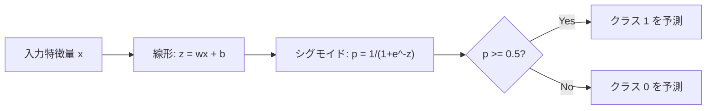

# ロジスティック回帰

> ロジスティック回帰（Logistic Regression）は、直線をS字型に曲げることで、確率を用いて「はい」か「いいえ」の質問に答える手法である。

**タイプ:** ビルド
**言語:** Python
**前提条件:** フェーズ2 レッスン1-2（機械学習とは何か、線形回帰）
**時間:** 約90分

## 学習目標

- シグモイド関数とバイナリクロスエントロピー損失を用いて、ロジスティック回帰をゼロから実装する
- 二値分類における適合率（Precision）、再現率（Recall）、F1スコア、および混同行列を計算し、解釈する
- なぜ分類において平均二乗誤差 (MSE) が適さないのか、そしてなぜバイナリクロスエントロピーが凸なコスト関数を生むのかを説明する
- 多クラス分類のためのソフトマックス回帰を構築し、閾値（しきい値）調整によるトレードオフを評価する

## 問題の背景

あなたは、腫瘍の大きさからそれが良性か悪性かを予測したいと考えている。試しに線形回帰を使ってみると、0.3 や 1.7、あるいは -0.5 といった数値が出力された。これらは何を意味するのだろうか？ 1.7 は「非常に悪性」ということか？ -0.5 は「非常に良性」か？ 線形回帰の出力には上限も下限もない。分類に必要なのは、0 から 1 の間の「確率」と、最終的な「はい」か「いいえ」という明確な判断である。

ロジスティック回帰はこれを解決する。線形回帰と同じ線形結合 (wx + b) を計算するが、その出力を**シグモイド関数**に通す。これにより、どんな数値も (0, 1) の範囲に押し込められ、確率として扱えるようになる。ある閾値（通常は 0.5）を設定することで、最終的な分類の判断を行う。

名前に「回帰」と付いているが、ロジスティック回帰は分類アルゴリズムである。この名前は、使用されるロジスティック関数（シグモイド関数）に由来している。実務で最も広く使われているアルゴリズムの一つである。

## 概念

### なぜ分類に線形回帰が適さないのか

勉強時間に基づいて試験の合否 (1/0) を予測することを考えてみよう。

```
時間:  1   2   3   4   5   6   7   8   9   10
結果:  0   0   0   0   1   1   1   1   1   1
```

線形回帰で直線を当てはめると、1時間勉強したときには -0.2、10時間勉強したときには 1.3 といった予測値が出るかもしれない。これらは確率ではない（0未満や1より大きい数値）。さらに、50時間勉強したという極端な外れ値が一つあるだけで直線が引っ張られ、他のすべての人の予測結果が変わってしまう。

分類に必要な関数は：
- 0 から 1 の間の値（確率）を出力する
- 明確な切り替わり（決定境界）を作る
- 境界から遠い外れ値に振り回されない

### シグモイド関数

シグモイド関数はまさにこの役割を果たす：

```
sigmoid(z) = 1 / (1 + e^(-z))
```

性質：
- z が大きな正の値のとき、sigmoid(z) は 1 に近づく
- z が大きな負の値のとき、sigmoid(z) は 0 に近づく
- z = 0 のとき、sigmoid(z) = 0.5
- 出力は常に 0 と 1 の間
- 滑らかで、いたるところで微分可能

微分の形も非常に扱いやすい：sigmoid'(z) = sigmoid(z) * (1 - sigmoid(z))。これにより、勾配計算が効率的に行える。

### ロジスティック回帰 = 線形モデル + シグモイド

モデルは z = wx + b を計算し、それにシグモイド関数を適用する。



出力 p は、入力がクラス 1 に属する確率 P(y=1 | x) と解釈される。決定境界は wx + b = 0 となる場所であり、そこではシグモイド関数の出力はちょうど 0.5 になる。

### バイナリクロスエントロピー損失 (Binary Cross-Entropy Loss)

ロジスティック回帰では MSE を使うことはできない。シグモイド関数と MSE を組み合わせると、局所解（ローカルミニマ）が多数存在する非凸なコスト関数になってしまうからだ。代わりに、バイナリクロスエントロピー（対数損失、Log Loss）を使用する。

```
損失 = -(1/n) * sum(y * log(p) + (1-y) * log(1-p))
```

なぜこれが機能するのか：
- y=1 のときに p が 1 に近い場合：log(1) = 0 なので、損失は 0 に近くなる（正解、低コスト）
- y=1 のときに p が 0 に近い場合：log(0) はマイナス無限大に近づくので、損失は非常に大きくなる（不正解、高コスト）
- y=0 のときに p が 0 に近い場合：同様に損失は 0 に近くなる（正解、低コスト）
- y=0 のときに p が 1 に近い場合：損失は非常に大きくなる（不正解、高コスト）

この損失関数は、ロジスティック回帰において凸（下側に凸なボウル型）であることが保証されており、単一の大局的最小値を見つけることができる。

### ロジスティック回帰の勾配降下法

勾配の形は、驚くほど線形回帰のものとよく似ており、非常にシンプルである：

```
dL/dw = (1/n) * sum((p - y) * x)
dL/db = (1/n) * sum(p - y)
```

違いは、p が単なる wx + b ではなく、sigmoid(wx + b) であることだ。シグモイド関数によって非線形性が導入されているが、パラメータの更新ルール自体は同じ形を保っている。

### 決定境界 (Decision Boundary)

2つの特徴量がある場合、決定境界は以下の式で表される直線になる。

```
w1*x1 + w2*x2 + b = 0
```

この線の一方の側にある点は 1、反対側にある点は 0 と予測される。ロジスティック回帰単体では常に「直線」の境界線が作られる。曲線が必要な場合は、特徴量に多項式（x^2 など）を加えるか、非線形なモデルを使う必要がある。

### ソフトマックスを用いた多クラス分類

二値分類ではなく k 個のクラスに分類したい場合は、**ソフトマックス関数**を使用する。

```
softmax(z_i) = e^(z_i) / sum(e^(z_j) for all j)
```

各クラスが専用の重みベクトルを持つ。モデルは各クラスのスコア z_i を計算し、ソフトマックス関数がそれらを合計が 1 になる確率に変換する。最も確率の高いクラスが予測結果となる。

この場合の損失関数は、カテゴリカルクロスエントロピー (Categorical Cross-Entropy) になる。

### 評価指標

精度（Accuracy）だけでは不十分だ。95% が負例で 5% が正例のデータセットでは、常に「負例」と答えるだけで 95% の精度が出てしまうが、そのモデルは全く役に立たない。

**混同行列 (Confusion Matrix)**：

| | 予測が正 (Positive) | 予測が負 (Negative) |
|---|---|---|
| 実際が正 | 真陽性 (True Positive: TP) | 偽陰性 (False Negative: FN) |
| 実際が負 | 偽陽性 (False Positive: FP) | 真陰性 (True Negative: TN) |

- **適合率 (Precision)**: 正と予測したもののうち、実際に正だった割合。
  `Precision = TP / (TP + FP)`
- **再現率 (Recall)**: 実際の正のうち、どれだけ正と予測できたか（見逃さなかった割合）。
  `Recall = TP / (TP + FN)`
- **F1スコア**: 適合率と再現率の調和平均。両方のバランスを取った指標。
  `F1 = 2 * (Precision * Recall) / (Precision + Recall)`

使い分け：
- **適合率重視**: 誤検知（偽陽性）を避けたいとき。例：スパムフィルタ。
- **再現率重視**: 見逃し（偽陰性）を避けたいとき。例：がん検診。
- **F1スコア**: 単一のバランスの取れた数値が必要なとき。

## ビルド・イット

### ステップ 1: シグモイド関数とデータの生成

```python
import random
import math

def sigmoid(z):
    # 数値的に安定させるため、z の範囲を制限
    z = max(-500, min(500, z))
    return 1.0 / (1.0 + math.exp(-z))

# 平均 (2,2) と (5,5) の周囲に2つのクラスのデータを生成
random.seed(42)
N = 200
X = []
y = []

for _ in range(N // 2):
    X.append([random.gauss(2, 1), random.gauss(2, 1)])
    y.append(0)

for _ in range(N // 2):
    X.append([random.gauss(5, 1), random.gauss(5, 1)])
    y.append(1)
```

### ステップ 2: ゼロからのロジスティック回帰の実装

```python
class LogisticRegression:
    def __init__(self, n_features, learning_rate=0.01):
        self.weights = [0.0] * n_features
        self.bias = 0.0
        self.lr = learning_rate

    def predict_proba(self, x):
        z = sum(w * xi for w, xi in zip(self.weights, x)) + self.bias
        return sigmoid(z)

    def fit(self, X, y, epochs=1000):
        n = len(y)
        for _ in range(epochs):
            # 全データに対する勾配の平均を計算
            dw = [0.0] * len(self.weights)
            db = 0.0
            for i in range(n):
                p = self.predict_proba(X[i])
                error = p - y[i]
                for j in range(len(self.weights)):
                    dw[j] += error * X[i][j]
                db += error
            # 重みとバイアスを更新
            for j in range(len(self.weights)):
                self.weights[j] -= self.lr * (dw[j] / n)
            self.bias -= self.lr * (db / n)
```

### ステップ 3: 混同行列と指標の計算

```python
class ClassificationMetrics:
    def __init__(self, y_true, y_pred):
        self.tp = sum(1 for t, p in zip(y_true, y_pred) if t == 1 and p == 1)
        self.tn = sum(1 for t, p in zip(y_true, y_pred) if t == 0 and p == 0)
        self.fp = sum(1 for t, p in zip(y_true, y_pred) if t == 0 and p == 1)
        self.fn = sum(1 for t, p in zip(y_true, y_pred) if t == 1 and p == 0)

    def precision(self):
        return self.tp / (self.tp + self.fp) if (self.tp + self.fp) > 0 else 0

    def recall(self):
        return self.tp / (self.tp + self.fn) if (self.tp + self.fn) > 0 else 0
```

### ステップ 4: 閾値の調整 (Threshold Tuning)

デフォルトの閾値は 0.5 だが、これを動かすことで適合率と再現率のバランスを調整できる。
- 閾値を上げる (例: 0.8) -> 確信があるものだけを 1 と判定。適合率は上がるが、見逃し（FN）が増え、再現率は下がる。
- 閾値を下げる (例: 0.2) -> 積極的に 1 と判定。見逃しは減り再現率は上がるが、誤検知（FP）が増え、適合率は下がる。

## ユーズ・イット

実務では scikit-learn を使用する。

```python
from sklearn.linear_model import LogisticRegression
from sklearn.metrics import classification_report, confusion_matrix

# 手順は線形回帰と同じ
clf = LogisticRegression()
clf.fit(X_train, y_train)
y_pred = clf.predict(X_test)

# 詳細な評価レポートを表示
print(classification_report(y_test, y_pred))
```

scikit-learn 版は、最適化アルゴリズム（LBFGS など）の選択、正則化の自動適用、多クラス対応などが高度に最適化されている。

## 主要用語

| 用語 | よく言われること | 実際の意味 |
|------|----------------|----------------------|
| ロジスティック回帰 | 「分類のための回帰」 | 線形モデルの出力をシグモイド関数に通してクラス確率を出力する手法 |
| シグモイド関数 | 「S字曲線」 | 任意の数値を (0, 1) の範囲に変換する関数 1/(1+e^-z) |
| バイナリクロスエントロピー | 「対数損失」 | 確信を持って間違えたときに厳しく罰する、二値分類のための損失関数 |
| 決定境界 | 「区切りの線」 | モデルの出力確率が 0.5 となる場所。クラスの境界 |
| ソフトマックス | 「多クラス版シグモイド」 | スコアを合計が 1 になる確率に変換し、多クラス分類に使う関数 |
| 適合率 (Precision) | 「当てたうちの正解」 | 正と予測したもののうち、実際に正である割合 |
| 再現率 (Recall) | 「正解のうちの発見」 | 実際の正のうち、モデルが正しく見つけた割合 |
| F1スコア | 「バランスの取れた精度」 | 適合率と再現率の調和平均。両者のバランスを測る |
| 混同行列 | 「失敗の内訳」 | TP, TN, FP, FN の各カウントを一覧にした表 |
| 閾値 (Threshold) | 「境界のライン」 | モデルの確率がこれを超えたらクラス 1 と判定する数値（デフォルト 0.5） |

## 演習

1. 線形分離可能ではないデータセット（例：同心円状のデータ）を生成し、ロジスティック回帰で学習させてみよ。精度が出ないことを確認した後、多項式特徴量（x1^2, x2^2, x1*x2 など）を追加して学習させ、精度が向上することを示せ。
2. 3クラスのソフトマックス回帰における混同行列を実装せよ。クラスごとの適合率と再現率を計算し、どのクラスの分類が最も難しいか特定せよ。
3. ROC 曲線（Receiver Operating Characteristic curve）をゼロから実装せよ。0 から 1 まで 100 個の閾値を設定し、それぞれの真陽性率 (TPR) と偽陽性率 (FPR) を計算してプロットせよ。

## さらに学ぶために

- **Stanford CS229 講義ノート**: ロジスティック回帰の最尤法（Maximum Likelihood Estimation）による導出が詳しく解説されている。
- **scikit-learn 公式ドキュメント**: 実装のバリエーションや正則化、大規模データ向けの最適化アルゴリズムの詳細。
- **ISLR Chapter 4**: ロジスティック回帰、線形判別分析 (LDA)、K-近傍法 (KNN) の比較。
