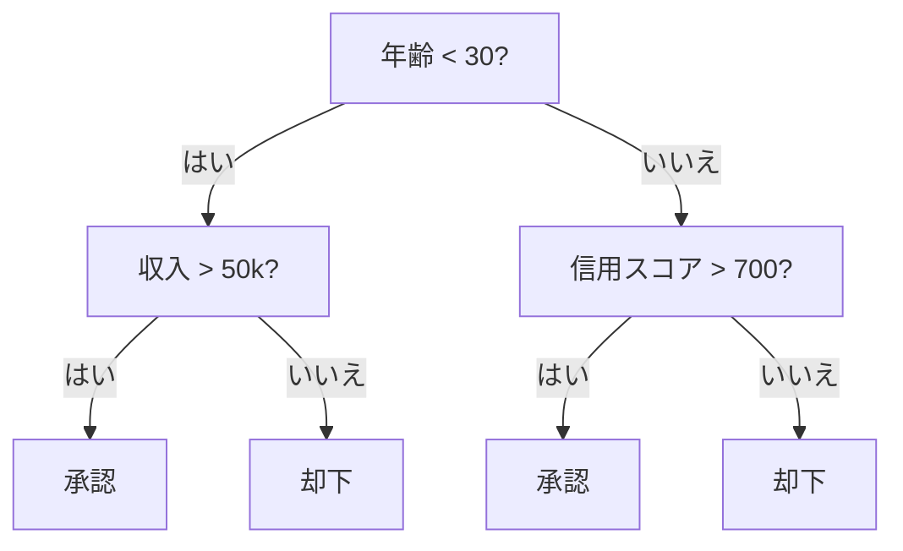
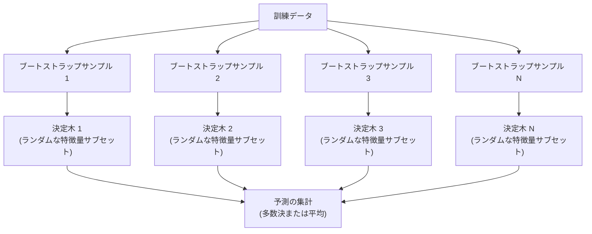

# 決定木とランダムフォレスト

> 決定木（Decision Tree）は単なるフローチャートである。しかし、それを集めたフォレスト（森）は、機械学習において最も強力なツールの一つとなる。

**タイプ:** ビルド
**言語:** Python
**前提条件:** フェーズ1（[レッスン09 情報理論](file:///Users/satoshimochizuki/Documents/github/ai-engineering-from-scratch/phases/01-math-foundations/09-information-theory/)、[レッスン06 確率](file:///Users/satoshimochizuki/Documents/github/ai-engineering-from-scratch/phases/01-math-foundations/06-probability-and-distributions/)）
**時間:** 約90分

## 学習目標

- ジニ不純度、エントロピー、および情報利得（Information Gain）を実装し、最適な決定木の分割を探索する
- 事前枝刈り（Pre-pruning）制御（最大深さ、最小サンプル数）を備えた決定木分類器をゼロから構築する
- ブートストラップサンプリングと特徴量のランダム化を用いてランダムフォレストを構築し、それによって分散（Variance）が減少する理由を説明する
- MDI（Mean Decrease in Impurity）重要度とパーミュテーション（シャッフル）重要度を比較し、MDIにバイアスが生じるケースを特定する

## 問題の背景

手元にテーブル（表形式）データがあるとする。行はサンプル、列は特徴量であり、予測対象となるターゲット列がある。ディープラーニング（ニューラルネットワーク）を適用することもできるが、テーブルデータにおいては、決定木ベースのモデル（決定木、ランダムフォレスト、勾配ブースティング木）が一貫してディープラーニングを凌駕している。構造化データを扱うKaggleコンペティションの勝者は、Transformerではなく、XGBoostやLightGBMによって占められているのが現実である。

なぜだろうか？決定木は、数値型とカテゴリ型が混在した特徴量を前処理なしで扱うことができる。また、特徴量エンジニアリングを行わなくても、非線形な関係性を捉えることができる。さらに、解釈性（説明可能性）が高い。決定木を見れば、なぜその予測が行われたのかを正確に追うことができる。そして、多数の決定木を平均化するランダムフォレストは、中規模のデータセットにおいて過学習（Overfitting）に対して非常に強い耐性を持つ。

このレッスンでは、再帰的分割（Recursive Splitting）を用いて決定木をゼロから構築し、さらにその上にランダムフォレストを構築する。分割基準（ジニ不純度、エントロピー、情報利得）の背後にある数学を実装し、弱学習器のアンサンブルがなぜ強力な強学習器になるのかを理解する。

## 概念

### 決定木が何を行うか

決定木は、一連の「はい / いいえ」の質問を繰り返すことで、特徴量空間を矩形（長方形）の領域に分割する。



各内部ノードは、ある特徴量としきい値（閾値）を比較する。各葉（リーフ）ノードは予測結果を表す。新しいデータポイントを分類するには、根（ルート）ノードから開始し、葉ノードに到達するまで分岐をたどる。

決定木は、各ノードにおいてデータを最もよく分割できる特徴量としきい値を選択することによって、トップダウンで構築される。「最もよく」というのは、分割基準によって定義される。

### 分割基準：不純度の測定

各ノードにはサンプルの集合がある。これらを分割して、生成される子ノードができるだけ「純粋（Pure）」になるようにしたい。つまり、各子ノードが大部分において単一のクラスのサンプルのみを含むようにしたいのである。

**ジニ不純度（Gini impurity）**は、あるノードにおけるクラス分布に従ってランダムにラベルを割り当てた場合に、同じくランダムに選択されたサンプルが誤分類される確率を測定する。

```
Gini(S) = 1 - sum(p_k^2)

ここで、p_k は集合 S におけるクラス k の割合である。
```

完全に純粋なノード（すべてのサンプルが単一クラス）の場合、ジニ不純度は 0 になる。2クラスが50/50の割合で均等に交ざっている二値分割の場合、ジニ不純度は 0.5（最大値）になる。数値が低いほど不純度が低く、望ましい。

```
例: 猫 6 匹、犬 4 匹

Gini = 1 - (0.6^2 + 0.4^2) = 1 - (0.36 + 0.16) = 0.48
```

**エントロピー（Entropy）**は、ノード内の情報量（乱雑さ）を測定する。これについては、フェーズ1 レッスン09で学習した。

```
Entropy(S) = -sum(p_k * log2(p_k))
```

完全に純粋なノードの場合、エントロピーは 0 になる。50/50に分かれた二値分割の場合、エントロピーは 1.0 になる。数値が低いほど望ましい。

```
例: 猫 6 匹、犬 4 匹

Entropy = -(0.6 * log2(0.6) + 0.4 * log2(0.4))
        = -(0.6 * -0.737 + 0.4 * -1.322)
        = 0.442 + 0.529
        = 0.971 ビット
```

**情報利得（Information gain）**は、分割の前後における不純度（エントロピーまたはジニ不純度）の減少量である。

```
IG(S, feature, threshold) = Impurity(S) - weighted_avg(Impurity(S_left), Impurity(S_right))

ここで、重み（weighted_avgの係数）は、各子ノードに属するサンプルの割合である。
```

各ノードでの貪欲（Greedy）アルゴリズム：すべての特徴量とすべての可能なしきい値を試す。情報利得が最大となるような「特徴量としきい値」のペアを選択する。

### 分割の仕組み

現在のノードにおける、特徴量数が $n$、サンプル数が $m$ のデータセットに対する手順：

1. 各特徴量 $j$ （$j = 1$ から $n$）について：
   - 特徴量 $j$ の値でサンプルをソートする
   - 連続する異なる値の中点をすべて、しきい値候補として試す
   - 各しきい値候補について情報利得を計算する
2. 最大の情報利得をもたらす特徴量としきい値を選択する
3. データを左（特徴量 <= しきい値）と右（特徴量 > しきい値）に分割する
4. それぞれの子ノードについて再帰的に処理を行う

この貪欲なアプローチは、大局的な最適解（グローバルに最適な木）を保証するものではない。最適な決定木の構築はNP困難（NP-hard）な問題である。しかし、実務においては貪欲法による分割が十分にうまく機能する。

### 停止条件

停止条件がない場合、すべての葉が純粋になる（各葉にサンプルが1つだけになる）まで木は成長する。これでは訓練データを完全に暗記してしまい、汎化性能が極めて低くなる（過学習）。

**事前枝刈り（Pre-pruning）**は、木が完全に成長する前に構築を停止する：
- 最大深さ（Maximum depth）：木が設定された深さに達したときに分割を停止する
- 葉ノードの最小サンプル数（Minimum samples per leaf）：ノードのサンプル数が $k$ 個未満の場合に分割を停止する
- 最小情報利得（Minimum information gain）：最良の分割を行っても不純度の改善がしきい値未満の場合に分割を停止する
- 最大葉ノード数（Maximum leaf nodes）：全体の葉ノードの総数を制限する

**事後枝刈り（Post-pruning）**は、いったん木を完全に成長させてから、刈り戻す：
- コスト複雑度枝刈り（Cost-complexity pruning、scikit-learnで使用される）：葉の数に比例したペナルティを加える。ペナルティを大きくすると、より小さな木が得られる
- 誤り率削減枝刈り（Reduced error pruning）：検証データ（Validation data）でのエラーが増加しない限り、部分木を削除（マージ）する

事前枝刈りの方がシンプルで高速である。事後枝刈りは、後に有用な分割につながる可能性のある分割を途中で止めてしまわないため、より良い木が得られることが多い。

### 回帰のための決定木

回帰（Regression）問題では、葉ノードの予測値は、その葉に含まれるターゲット値の平均値となる。また、分割基準も変更される：

情報利得の代わりに、**分散減少量（Variance reduction）**が用いられる：

```
VR(S, feature, threshold) = Var(S) - weighted_avg(Var(S_left), Var(S_right))
```

分散を最も減少させる分割を選択する。決定木は入力空間を領域に切り分け、各領域内で定数（平均値）を予測する。

### ランダムフォレスト：アンサンブルの力

単一の決定木は、分散（Variance）が高い。データがわずかに変わるだけで、まったく異なる決定木が構築されてしまう。ランダムフォレストは、多くの決定木を平均化することでこの問題を解決する。



決定木の多様性を生み出すための2つのランダム性のソース：

**バギング（Bagging / bootstrap aggregating）：** 各決定木は、訓練データから重複を許してランダムにサンプリングされた「ブートストラップサンプル」を用いて訓練される。元のサンプルの約63%が各ブートストラップに含まれ、残りはOOB（Out-Of-Bag）サンプルとして検証用に使用できる。

**特徴量のランダム化（Feature randomization）：** 各ノードの分割において、特徴量全体のランダムなサブセットのみが考慮される。分類タスクの場合、デフォルトの考慮される特徴量数は $\sqrt{n_{\text{features}}}$ である。回帰タスクの場合、デフォルトは $n_{\text{features}}/3$ である。これにより、すべての決定木が同じ支配的な特徴量で分割を開始することを防ぐ。

重要な洞察：相関の低い（多様な）多くの木を平均化することで、バイアス（偏り）を増やすことなく分散を減らすことができる。個々の木は凡庸かもしれないが、アンサンブル全体としては非常に強力になる。

### 特徴量の重要度

ランダムフォレストは、特徴量の重要度（Feature importance）スコアを自然に出力できる。最も一般的なアプローチ：

**平均不純度減少（MDI: Mean Decrease in Impurity）：** 各特徴量について、すべての決定木およびその特徴量が分割に使用されたすべてのノードにおける不純度の総減少量を合算する。より早い段階（根に近いノード）の分割で、より大きな不純度減少をもたらした特徴量ほど、重要度が高くなる。

```
importance(feature_j) = 全決定木の feature_j が使用されたすべてのノードにおける合計:
    (ノードのサンプル数 / 全体のサンプル数) * 不純度減少量
```

この方法は学習中に計算されるため高速だが、高カーディナリティ（取りうる値の種類が多い）特徴量や、分割点の候補が多い特徴量に対して重要度を過大評価するバイアスがある。

**パーミュテーション重要度（Permutation importance）**は代替となる方法である：ある特徴量の値をランダムにシャッフルし、モデルの予測精度がどれだけ低下するかを測定する。計算は遅くなるが、より信頼性が高い。

### 決定木がニューラルネットワークに勝る場合

テーブルデータにおいては、決定木やランダムフォレストがニューラルネットワークを一貫して圧倒している。いくつかの理由がある：

| 要因 | 決定木ベースモデル | ニューラルネットワーク |
|---|---|---|
| 混在データ（数値＋カテゴリ） | ネイティブに対応 | エンコーディングが必要 |
| 小規模データ（1万行未満） | うまく機能する | 過学習しやすい |
| 特徴量の相互作用 | 分割の過程で発見 | 特殊なアーキテクチャ設計が必要 |
| 解釈性 | 完全な透明性 | ブラックボックス |
| 訓練時間 | 数分以内 | 数時間 |
| ハイパーパラメータの敏感さ | 低い | 高い |

ニューラルネットワークが優れているのは、データに空間的または時系列的な構造がある場合（画像、テキスト、音声）である。特徴量が並んだフラットなテーブルデータについては、決定木ベースモデルがデフォルトの選択肢となる。

## 実装してみよう

### ステップ 1：ジニ不純度とエントロピー

両方の分割基準をゼロから構築し、それらが同じ分割が適切であると判断するかどうかを検証する。

```python
import math

def gini_impurity(labels):
    n = len(labels)
    if n == 0:
        return 0.0
    counts = {}
    for label in labels:
        counts[label] = counts.get(label, 0) + 1
    return 1.0 - sum((c / n) ** 2 for c in counts.values())

def entropy(labels):
    n = len(labels)
    if n == 0:
        return 0.0
    counts = {}
    for label in labels:
        counts[label] = counts.get(label, 0) + 1
    return -sum(
        (c / n) * math.log2(c / n) for c in counts.values() if c > 0
    )
```

### ステップ 2：最良の分割を見つける

すべての特徴量とすべてのしきい値を試す。最も高い情報利得をもたらすものを返す。

```python
def information_gain(parent_labels, left_labels, right_labels, criterion="gini"):
    measure = gini_impurity if criterion == "gini" else entropy
    n = len(parent_labels)
    n_left = len(left_labels)
    n_right = len(right_labels)
    if n_left == 0 or n_right == 0:
        return 0.0
    parent_impurity = measure(parent_labels)
    child_impurity = (
        (n_left / n) * measure(left_labels) +
        (n_right / n) * measure(right_labels)
    )
    return parent_impurity - child_impurity
```

### ステップ 3：DecisionTree クラスの構築

再帰的分割、予測、および特徴量の重要度の追跡を実装する。

```python
class DecisionTree:
    def __init__(self, max_depth=None, min_samples_split=2,
                 min_samples_leaf=1, criterion="gini",
                 max_features=None):
        self.max_depth = max_depth
        self.min_samples_split = min_samples_split
        self.min_samples_leaf = min_samples_leaf
        self.criterion = criterion
        self.max_features = max_features
        self.tree = None
        self.feature_importances_ = None

    def fit(self, X, y):
        self.n_features = len(X[0])
        self.feature_importances_ = [0.0] * self.n_features
        self.n_samples = len(X)
        self.tree = self._build(X, y, depth=0)
        total = sum(self.feature_importances_)
        if total > 0:
            self.feature_importances_ = [
                fi / total for fi in self.feature_importances_
            ]

    def predict(self, X):
        return [self._predict_one(x, self.tree) for x in X]
```

### ステップ 4：RandomForest クラスの構築

ブートストラップサンプリング、特徴量のランダム化、および多数決による予測を実装する。

```python
class RandomForest:
    def __init__(self, n_trees=100, max_depth=None,
                 min_samples_split=2, max_features="sqrt",
                 criterion="gini"):
        self.n_trees = n_trees
        self.max_depth = max_depth
        self.min_samples_split = min_samples_split
        self.max_features = max_features
        self.criterion = criterion
        self.trees = []

    def fit(self, X, y):
        n = len(X)
        for _ in range(self.n_trees):
            indices = [random.randint(0, n - 1) for _ in range(n)]
            X_boot = [X[i] for i in indices]
            y_boot = [y[i] for i in indices]
            tree = DecisionTree(
                max_depth=self.max_depth,
                min_samples_split=self.min_samples_split,
                max_features=self.max_features,
                criterion=self.criterion,
            )
            tree.fit(X_boot, y_boot)
            self.trees.append(tree)

    def predict(self, X):
        all_preds = [tree.predict(X) for tree in self.trees]
        predictions = []
        for i in range(len(X)):
            votes = {}
            for preds in all_preds:
                v = preds[i]
                votes[v] = votes.get(v, 0) + 1
            predictions.append(max(votes, key=votes.get))
        return predictions
```

完全な実装とすべてのヘルパーメソッドについては、[trees.py](file:///Users/satoshimochizuki/Documents/github/ai-engineering-from-scratch/phases/02-ml-fundamentals/04-decision-trees/code/trees.py) を参照。

## 使ってみよう

scikit-learn を使えば、わずか3行でランダムフォレストの訓練ができる：

```python
from sklearn.ensemble import RandomForestClassifier
from sklearn.datasets import load_iris
from sklearn.model_selection import train_test_split

X, y = load_iris(return_X_y=True)
X_train, X_test, y_train, y_test = train_test_split(X, y, random_state=42)

rf = RandomForestClassifier(n_estimators=100, random_state=42)
rf.fit(X_train, y_train)
print(f"Accuracy: {rf.score(X_test, y_test):.4f}")
print(f"Feature importances: {rf.feature_importances_}")
```

実務において、勾配ブースティング木（XGBoost、LightGBM、CatBoost）は、各木が前の木の誤差を修正するように逐次的に決定木を構築するため、多くの場合においてランダムフォレストよりも強力である。しかし、ランダムフォレストは設定ミスが発生しにくく、ハイパーパラメータの調整もほとんど必要としないというメリットがある。

## 成果物

このレッスンでは、[prompt-tree-interpreter.md](file:///Users/satoshimochizuki/Documents/github/ai-engineering-from-scratch/phases/02-ml-fundamentals/04-decision-trees/outputs/prompt-tree-interpreter.md) を生成する。これは、ビジネス関係者向けに決定木の分割基準を解釈するためのプロンプトである。訓練済み決定木の構造（深さ、特徴量、分割しきい値、精度）を入力すると、このプロンプトはモデルの振る舞いを分かりやすい言葉によるルールへと変換し、特徴量の重要度を順位付けし、過学習やデータリーケージ（データ漏洩）を指摘し、次のステップを提案する。コードを読まない人に決定木モデルを説明する必要があるときに活用してほしい。

## 演習問題

1. 3つのクラスを持つ2次元のデータセットに対して単一の決定木を訓練せよ。手動で分割をトレースし、矩形の決定境界を描画せよ。`max_depth=2` と `max_depth=10` の場合で決定境界を比較せよ。

2. 回帰木のための分散減少分割を実装せよ。200個のデータポイントに対して $y = \sin(x) + \text{noise}$ を生成し、回帰木を適合させよ。木の区分的定数（Piecewise-constant）予測値を真の曲線に対してプロットせよ。

3. 決定木の数を 1, 5, 10, 50, 200 としたランダムフォレストを構築せよ。決定木の数に対する訓練精度とテスト精度をプロットせよ。テスト精度が横ばい（プラトー）になり、減少はしない（ランダムフォレストは過学習に強い）ことを確認せよ。

4. 5つの異なるデータセットにおいて、分割基準としてのジニ不純度とエントロピーを比較せよ。予測精度と決定木の深さを測定せよ。ほとんどの場合、ほぼ同一の結果が得られるはずである。その理由を説明せよ。

5. パーミュテーション重要度を実装せよ。1つの特徴量がランダムノイズでありながら高カーディナリティ（取りうる値の種類が多い）であるデータセットにおいて、MDI重要度と比較せよ。MDIはそのノイズ特徴量を上位に評価するが、パーミュテーション重要度はそうならないことを確認せよ。

## 主要用語

| 用語 | よくある説明 | 実際の意味 |
|---|---|---|
| 決定木 (Decision tree) | 「予測のためのフローチャート」 | if/else の分岐ルールを学習することで、特徴量空間を矩形の領域に分割するモデル |
| ジニ不純度 (Gini impurity) | 「ノードの混ざり具合」 | あるノードでランダムに選ばれたサンプルを誤分類する確率。0 は完全に純粋、0.5 は二値分類における最大の不純度 |
| エントロピー (Entropy) | 「ノード内の乱雑さ」 | ノードにおける情報量。0 は完全に純粋、1.0 は二値分類における最大の不確実性。情報理論に由来する |
| 情報利得 (Information gain) | 「分割の良さ」 | 分割の前後における不純度の減少量。分割を選択するための貪欲な基準 |
| 事前枝刈り (Pre-pruning) | 「木を早めに止める」 | 最大の深さ、最小サンプル数、または最小利得のしきい値を設定することで、木の成長を早期に停止させること |
| 事後枝刈り (Post-pruning) | 「後から木をトリミングする」 | いったん木を完全に成長させてから、検証データにおける性能を向上させない部分木を削除すること |
| バギング (Bagging) | 「ランダムなサブセットで訓練する」 | ブートストラップアンサンブル（Bootstrap aggregating）。重複を許したランダムなサンプリングに基づいて各モデルを個別に訓練すること |
| ランダムフォレスト (Random forest) | 「決定木の集まり」 | 決定木のアンサンブル。各決定木はブートストラップサンプルを用いて訓練され、各分割ではランダムに選ばれた特徴量サブセットのみを考慮する |
| 特徴量重要度（MDI） (Feature importance (MDI)) | 「どの特徴量が重要か」 | 各特徴量が寄与した不純度減少の総量。すべての木とノードにわたって合算される |
| パーミュテーション重要度 (Permutation importance) | 「シャッフルしてテストする」 | 特徴量の値をランダムにシャッフルしたときの予測精度の低下量。ノイズの多い特徴量に対してMDIよりも信頼性が高い |
| 分散減少量 (Variance reduction) | 「情報利得の回帰バージョン」 | 情報利得の回帰木版。ターゲット値の分散を最も減少させる分割を選択する |
| ブートストラップサンプル (Bootstrap sample) | 「重複ありのランダムサンプル」 | 元のデータセットから重複を許してランダムに抽出されたサンプル。サイズは元と同じだが、重複するデータが含まれる |

## 推薦図書・論文

- [Breiman: Random Forests (2001)](https://link.springer.com/article/10.1023/A:1010933404324) - ランダムフォレストの原著論文
- [Grinsztajn et al.: Why do tree-based models still outperform deep learning on tabular data? (2022)](https://arxiv.org/abs/2207.08815) - テーブルデータにおける決定木モデルとディープラーニングの厳密な性能比較
- [scikit-learn Decision Trees documentation](https://scikit-learn.org/stable/modules/tree.html) - 視覚化ツールを含む決定木の実用的な解説
- [XGBoost: A Scalable Tree Boosting System (Chen & Guestrin, 2016)](https://arxiv.org/abs/1603.02754) - Kaggleを席巻した勾配ブースティング木（XGBoost）の論文
