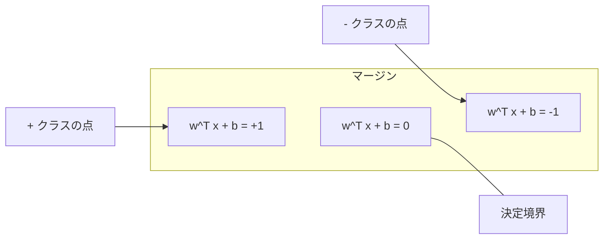
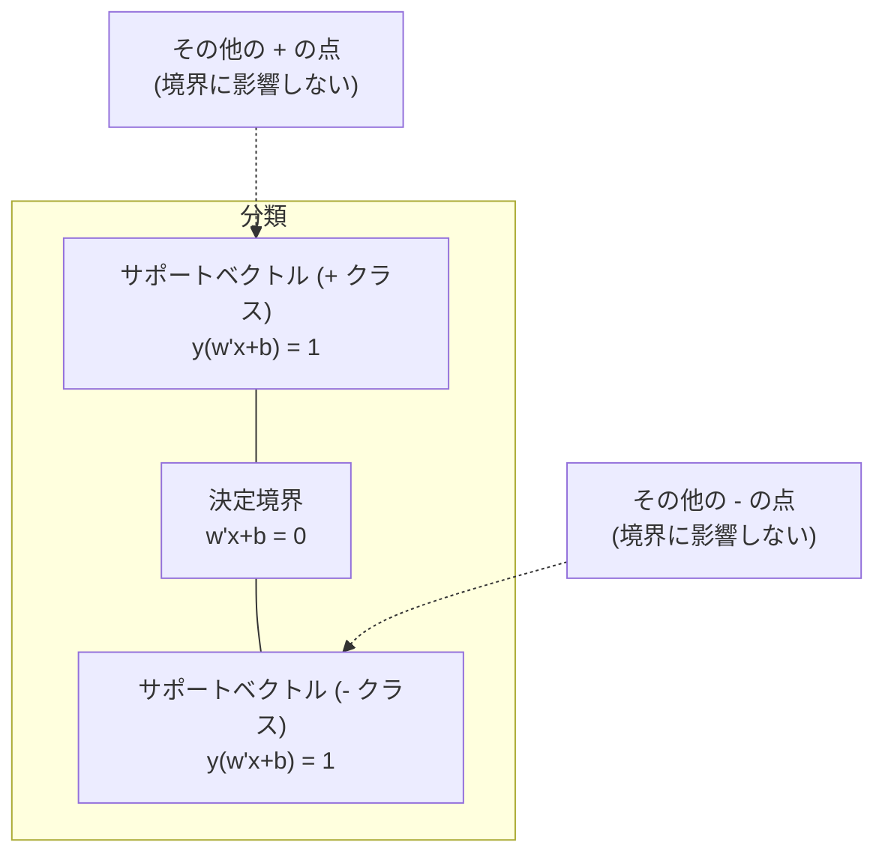
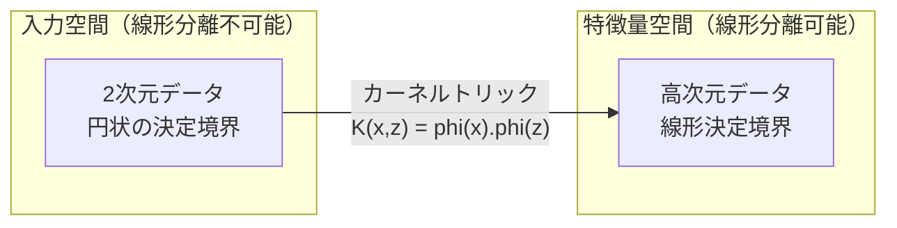

# サポートベクトルマシン

> 2つのクラスの間に「最も幅の広い道路」を通すこと。アイデアのすべてはそこにある。

**タイプ:** ビルド
**言語:** Python
**前提条件:** フェーズ1（[レッスン08 最適化](file:///Users/satoshimochizuki/Documents/github/ai-engineering-from-scratch/phases/01-math-foundations/08-optimization/)、[レッスン14 ノルムと距離](file:///Users/satoshimochizuki/Documents/github/ai-engineering-from-scratch/phases/01-math-foundations/14-norms-and-distances/)、[レッスン18 凸最適化](file:///Users/satoshimochizuki/Documents/github/ai-engineering-from-scratch/phases/01-math-foundations/18-convex-optimization/)）
**時間:** 約90分

## 学習目標

- ヒンジ損失（Hinge Loss）と主問題（Primal formulation）に対する勾配降下法を用いて、線形サポートベクトルマシン（SVM）をゼロから実装する
- 最大マージンの原理を説明し、訓練済みモデルからサポートベクトルを特定する
- 線形、多項式、RBF（放射基底関数）カーネルを比較し、カーネルトリックがなぜ明示的な高次元写像を回避できるのかを説明する
- マージンの幅と分類エラーの許容度を制御するパラメータ C のトレードオフを評価する

## 問題の背景

2つのクラスのデータポイントがあり、それらを分割する線（または超平面）を引きたいとする。これを満たす線は無限に存在する。では、どの線を選ぶべきだろうか？

最もマージン（Margin）が大きい線を選ぶべきである。マージンとは、決定境界と、その両側にある最も近いデータポイントとの距離である。マージンが広いほど、分類器はより確信を持って予測でき、未知のデータに対してもよりよく汎化（Generalize）する。

この直感に基づき構築されるのが、機械学習において最も数学的に洗練されたアルゴリズムの一つであるサポートベクトルマシン（SVM: Support Vector Machine）である。ディープラーニングが登場する前は、SVMは分類手法の主流であり、小規模なデータセット、高次元データ、そして理論的な保証を持つ原理的な（挙動がよく理解された）モデルが必要な問題においては、現在でも最良の選択肢である。

SVMはフェーズ1で学んだ内容と直結している。その最適化問題は凸最適化（レッスン18）であり、マージンの測定にはノルム（レッスン14）が使われ、カーネルトリックは内積（ドットプロダクト）を利用して、高次元空間での計算を実際に行うことなしに非線形な決定境界を扱う。

## 概念

### 最大マージン分類器

$y_i \in \{-1, +1\}$ のラベルと特徴量ベクトル $x_i$ を持つ線形分離可能なデータに対して、クラスを分離する超平面 $w^T x + b = 0$ を求めたい。

点 $x_i$ から超平面までの距離は以下のように表される：

```
distance = |w^T x_i + b| / ||w||
```

正しく分類された点については、$y_i * (w^T x_i + b) > 0$ となる。マージンは、超平面から両側の最も近い点までの距離の2倍である。



最適化問題：

```
maximize    2 / ||w||     (マージンの幅)
subject to  y_i * (w^T x_i + b) >= 1  (すべての i について)
```

これと同値な問題（$||w||^2$ を最小化する方が最適化しやすい）：

```
minimize    (1/2) ||w||^2
subject to  y_i * (w^T x_i + b) >= 1  (すべての i について)
```

これは凸二次計画問題（Convex quadratic program）であり、一意な大局的最適解を持つ。マージン境界上にぴったり位置するデータポイント（すなわち $y_i * (w^T x_i + b) = 1$ を満たす点）を**サポートベクトル（Support vector）**と呼ぶ。決定境界を決定するのはこれらの点だけである。サポートベクトル以外の任意の点を移動または削除しても、決定境界は一切変化しない。

### サポートベクトル：重要な少数のデータ



訓練ポイントの大部分は決定境界の決定に関与しない。サポートベクトルだけが重要である。そのため、SVMは予測時に訓練データ全体を保持する必要がなく、サポートベクトルだけを保存すればよいため、メモリ効率が非常に高い。

また、サポートベクトルの数は汎化誤差の上界（最大値）と直接関係している。データセット全体に対してサポートベクトルの割合が少ないほど、よりよく汎化することを意味する。

### ソフトマージン：パラメータ C によるノイズの処理

現実のデータが完全に線形分離可能であることは稀である。一部のデータポイントは境界の反対側にあったり、マージンの内部に入り込んだりする。ソフトマージン（Soft margin）定式化では、スラック変数（Slack variables）を導入することで、これらのマージン違反を許容する。

```
minimize    (1/2) ||w||^2 + C * sum(xi_i)
subject to  y_i * (w^T x_i + b) >= 1 - xi_i
            xi_i >= 0  (すべての i について)
```

スラック変数 $\xi_i$ は、ポイント $i$ がマージンをどれだけ犯しているかを測定する。パラメータ $C$ はそのトレードオフを制御する：

| C の値 | 挙動 |
|---|---|
| 大きい C | 違反を厳しくペナルティ化する。マージンは狭くなり、分類誤りは減少する。過学習（Overfit）しやすくなる |
| 小さい C | より多くの違反を許容する。マージンは広くなり、分類誤りは増加する。未学習（Underfit）しやすくなる |

$C$ は正則化の強さの逆数である。大きい $C$ ＝ 正則化が弱い。小さい $C$ ＝ 正則化が強い。

### ヒンジ損失：SVMの損失関数

ソフトマージンSVMは、制約なしの最適化問題として以下のように書き換えることができる：

```
minimize    (1/2) ||w||^2 + C * sum(max(0, 1 - y_i * (w^T x_i + b)))
```

ここで、$\max(0, 1 - y_i * f(x_i))$ という項は**ヒンジ損失（Hinge loss）**と呼ばれる。この値は、データポイントが正しく分類され、かつマージンの外側にある場合は 0 になる。ポイントがマージンの内側にあるか誤分類されている場合は、線形にペナルティが増加する。

```
単一ポイントに対するヒンジ損失：

損失 (loss)
  |
  | \
  |  \
  |   \
  |    \
  |     \_______________
  |
  +-----|-----|-------->  y * f(x)
       0     1

y * f(x) >= 1 のとき損失はゼロ（正しく分類され、マージン外）。
y * f(x) < 1 のとき線形ペナルティ。
```

ロジスティック損失（ロジスティック回帰）と比較してみる：

```
ヒンジ損失:       max(0, 1 - y*f(x))          マージンでの急激なカットオフ
ロジスティック:    log(1 + exp(-y*f(x)))       滑らかであり、完全にゼロにはならない
```

ヒンジ損失は疎な（Sparse）解を生成する（サポートベクトルのみが損失計算に非ゼロの寄与をする）。ロジスティック損失はすべてのデータポイントを使用する。これにより、SVMは予測時のメモリ効率において優位性を持つ。

### 勾配降下法による線形SVMの訓練

制約付き二次計画法（QP）を解かなくても、ヒンジ損失とL2正則化の和に対して勾配降下法を適用することで、線形SVMを訓練できる：

```
L(w, b) = (lambda/2) * ||w||^2 + (1/n) * sum(max(0, 1 - y_i * (w^T x_i + b)))

w に対する勾配：
  y_i * (w^T x_i + b) >= 1 の場合：  dL/dw = lambda * w
  y_i * (w^T x_i + b) < 1 の場合：   dL/dw = lambda * w - y_i * x_i

b に対する勾配：
  y_i * (w^T x_i + b) >= 1 の場合：  dL/db = 0
  y_i * (w^T x_i + b) < 1 の場合：   dL/db = -y_i
```

これは主問題（Primal formulation）と呼ばれる。1エポックあたりの計算量は $O(n \cdot d)$ である（ここで $n$ はサンプル数、$d$ は特徴量数）。大規模で疎な高次元データ（テキスト分類など）において、この手法は非常に高速に動作する。

### 双対問題とカーネルトリック

SVM最適化問題のラグランジュ双対問題（Lagrangian dual、フェーズ1 レッスン18のKKT条件に由来）は以下のようになる：

```
maximize    sum(alpha_i) - (1/2) * sum_ij(alpha_i * alpha_j * y_i * y_j * (x_i . x_j))
subject to  0 <= alpha_i <= C
            sum(alpha_i * y_i) = 0
```

この双対問題（Dual formulation）は、データポイント間の内積 $x_i \cdot x_j$ のみに依存している。これが極めて重要な洞察である。この内積を任意のカーネル関数 $K(x_i, x_j)$ に置き換えることで、SVMは特徴量の高次元への変換を明示的に計算することなく、非線形な決定境界を学習できるようになる（これを**カーネルトリック**と呼ぶ）。

```
線形カーネル:      K(x, z) = x . z
多項式カーネル:    K(x, z) = (x . z + c)^d
RBFカーネル:       K(x, z) = exp(-gamma * ||x - z||^2)
```

RBF（放射基底関数）カーネルは、データを無限次元空間へ写像する。入力空間で近い位置にあるポイント同士はカーネル値が 1 に近くなり、遠く離れたポイント同士は 0 に近くなる。これにより、任意の滑らかな決定境界を学習することができる。



カーネルトリックは、高次元空間に実際にデータを移すことなく、その高次元空間における内積を直接計算する。例えば、$D$ 次元において $d$ 次の多項式カーネルを明示的に構築すると $O(D^d)$ 次元の特徴量空間が必要になる。しかし、カーネル関数 $K(x, z)$ を用いることで、これを $O(D)$ の時間で計算できる。

### 回帰のためのサポートベクトルマシン（SVR）

サポートベクトル回帰（SVR: Support Vector Regression）は、データの周りに幅 $\epsilon$ の「チューブ」をフィットさせる。チューブの内側にあるポイントの損失は 0 となり、チューブの外側にあるポイントのみが線形にペナルティを課される。

```
minimize    (1/2) ||w||^2 + C * sum(xi_i + xi_i*)
subject to  y_i - (w^T x_i + b) <= epsilon + xi_i
            (w^T x_i + b) - y_i <= epsilon + xi_i*
            xi_i, xi_i* >= 0
```

パラメータ $\epsilon$ はチューブの幅を制御する。チューブが広いほど、サポートベクトルの数は少なくなり、滑らかなフィットが得られる。チューブが狭いほど、サポートベクトルの数は多くなり、データに密着したフィットが得られる。

### なぜSVMはディープラーニングに敗れたのか（あるいは、どのような状況で今でも有効か）

SVMは1990年代後半から2010年代初頭にかけて機械学習の主流であったが、いくつかの理由によりディープラーニングに主役の座を譲ることとなった：

| 要因 | SVM | ディープラーニング |
|---|---|---|
| 特徴量エンジニアリング | 手動で設計する必要がある | 特徴量を自動で学習する |
| スケーラビリティ | カーネルを使うと O(n^2) から O(n^3) | SGD（確率的勾配降下法）により1エポックあたり O(n) |
| 画像/テキスト/音声 | 手設計の特徴量が必要 | 生データから直接学習可能 |
| 大規模データ（10万件超） | 計算が極めて遅い | スケールしやすい |
| GPUアクセラレーション | 恩恵が限定的 | 劇的な高速化が可能 |

しかし、以下のような状況では現在でもSVMが有利である：
- 小規模なデータセット（数百〜数千サンプル）
- 高次元かつ疎な（Sparse）データ（TF-IDF特徴量を用いたテキストなど）
- 数学的な保証（マージン境界）が必要な場合
- 訓練時間を最小限に抑えたい場合（線形SVMは非常に高速）
- 明確なマージン構造を持つ二値分類
- 異常検知（1クラスSVM）

## 実装してみよう

### ステップ 1：ヒンジ損失と勾配

すべての基本となる。バッチに対するヒンジ損失とその勾配を計算する。

```python
def hinge_loss(X, y, w, b):
    n = len(X)
    total_loss = 0.0
    for i in range(n):
        margin = y[i] * (dot(w, X[i]) + b)
        total_loss += max(0.0, 1.0 - margin)
    return total_loss / n
```

### ステップ 2：勾配降下法による線形SVM

二次計画法（QP）のソルバーを使わずに、正則化ヒンジ損失を最小化することで訓練を行う。

```python
class LinearSVM:
    def __init__(self, lr=0.001, lambda_param=0.01, n_epochs=1000):
        self.lr = lr
        self.lambda_param = lambda_param
        self.n_epochs = n_epochs
        self.w = None
        self.b = 0.0

    def fit(self, X, y):
        n_features = len(X[0])
        self.w = [0.0] * n_features
        self.b = 0.0

        for epoch in range(self.n_epochs):
            for i in range(len(X)):
                margin = y[i] * (dot(self.w, X[i]) + self.b)
                if margin >= 1:
                    self.w = [wj - self.lr * self.lambda_param * wj
                              for wj in self.w]
                else:
                    self.w = [wj - self.lr * (self.lambda_param * wj - y[i] * X[i][j])
                              for j, wj in enumerate(self.w)]
                    self.b -= self.lr * (-y[i])

    def predict(self, X):
        return [1 if dot(self.w, x) + self.b >= 0 else -1 for x in X]
```

### ステップ 3：カーネル関数

線形、多項式、RBFカーネルを実装する。

```python
def linear_kernel(x, z):
    return dot(x, z)

def polynomial_kernel(x, z, degree=3, c=1.0):
    return (dot(x, z) + c) ** degree

def rbf_kernel(x, z, gamma=0.5):
    diff = [xi - zi for xi, zi in zip(x, z)]
    return math.exp(-gamma * dot(diff, diff))
```

### ステップ 4：マージンとサポートベクトルの特定

訓練後、どのデータポイントがサポートベクトルであるかを特定し、マージン幅を計算する。

```python
def find_support_vectors(X, y, w, b, tol=1e-3):
    support_vectors = []
    for i in range(len(X)):
        margin = y[i] * (dot(w, X[i]) + b)
        if abs(margin - 1.0) < tol:
            support_vectors.append(i)
    return support_vectors
```

完全なデモを含む実装については、[svm.py](file:///Users/satoshimochizuki/Documents/github/ai-engineering-from-scratch/phases/02-ml-fundamentals/05-support-vector-machines/code/svm.py) を参照。

## 使ってみよう

scikit-learn を使用した実装例：

```python
from sklearn.svm import SVC, LinearSVC, SVR
from sklearn.preprocessing import StandardScaler
from sklearn.pipeline import Pipeline

clf = Pipeline([
    ("scaler", StandardScaler()),
    ("svm", SVC(kernel="rbf", C=1.0, gamma="scale")),
])
clf.fit(X_train, y_train)
print(f"Accuracy: {clf.score(X_test, y_test):.4f}")
print(f"Support vectors: {clf['svm'].n_support_}")
```

**重要**：SVMを訓練する前に、必ず特徴量のスケーリング（標準化）を行ってほしい。SVMは特徴量の大きさに敏感である。なぜなら、マージンは $||w||$ に依存するため、スケーリングされていない特徴量は空間の幾何学的構造を歪めてしまうからである。

大規模なデータセットに対しては、`SVC`（双対定式化、計算量 $O(n^2)$ 〜 $O(n^3)$）の代わりに `LinearSVC`（主定式化、1エポックあたり計算量 $O(n)$）を使用してほしい：

```python
from sklearn.svm import LinearSVC

clf = Pipeline([
    ("scaler", StandardScaler()),
    ("svm", LinearSVC(C=1.0, max_iter=10000)),
])
```

## 演習問題

1. 2次元の線形分離可能なデータセットを生成せよ。自身の `LinearSVM` を訓練し、サポートベクトルを特定せよ。サポートベクトルが決定境界に最も近い点であることを確認せよ。

2. ノイズの多いデータセットにおいて、C パラメータを 0.001 から 1000 まで変化させよ。それぞれの C の値に対する決定境界をプロットせよ。広いマージン（未学習）から狭いマージン（過学習）への変化を観察せよ。

3. クラス境界が（直線ではなく）円状であるデータセットを作成せよ。線形SVMでは分類に失敗することを示せ。RBFカーネル行列を計算し、カーネルによって誘導される特徴量空間においてクラスが線形分離可能になることを示せ。

4. 同じデータセットにおいて、ヒンジ損失とロジスティック損失を比較せよ。線形SVMとロジスティック回帰をそれぞれ訓練し、各モデルの決定境界の決定に寄与している訓練ポイントの数をカウントせよ（サポートベクトル vs 全てのデータポイント）。

5. SVR（$\epsilon$-insensitive 損失）を実装せよ。これを $y = \sin(x) + \text{noise}$ に適合させよ。予測の周りに幅 $\epsilon$ のチューブをプロットし、サポートベクトル（チューブの外側または境界上にある点）をハイライトせよ。

## 主要用語

| 用語 | 実際の意味 |
|---|---|
| サポートベクトル (Support vectors) | 決定境界に最も近い訓練データポイント。超平面を決定する唯一の点 |
| マージン (Margin) | 決定境界と最も近いサポートベクトルとの間の最短距離。SVMはこの値を最大化する |
| ヒンジ損失 (Hinge loss) | $\max(0, 1 - y \cdot f(x))$。正しく分類されマージン外にある場合はゼロ。それ以外は線形にペナルティが加算される |
| パラメータ C (C parameter) | マージン幅と分類誤りの許容度とのトレードオフを制御する。大きい C = 狭いマージン、小さい C = 広いマージン |
| ソフトマージン (Soft margin) | スラック変数を導入することで、マージン違反を許容するSVMの定式化。線形分離不可能なデータに対処する |
| カーネルトリック (Kernel trick) | 特徴量を明示的に高次元に写像することなく、高次元特徴量空間における内積を計算する手法 |
| 線形カーネル (Linear kernel) | $K(x, z) = x \cdot z$。標準的な内積に相当する。線形分離可能なデータに使用する |
| RBFカーネル (RBF kernel) | $K(x, z) = \exp(-\gamma \cdot \|\|x-z\|\|^2)$。無限次元に写像し、任意の滑らかな境界を学習する。放射基底関数カーネル |
| 多項式カーネル (Polynomial kernel) | $K(x, z) = (x \cdot z + c)^d$。特徴量の多項式的な組み合わせ空間へと写像する |
| 双対定式化 (Dual formulation) | データポイント間の内積のみに依存するようにSVM問題を再構成したもの。カーネルの適用を可能にする |
| SVR | サポートベクトル回帰（Support Vector Regression）。データの周りに $\epsilon$-チューブを適合させ、チューブ外の点のみにペナルティを課す |
| スラック変数 (Slack variables) | $\xi_i$: データポイントがマージン境界からどれだけ逸脱しているかを表す変数。正しく分類されマージン外にある点については 0 |
| 最大マージン (Maximum margin) | 各クラスの最も近い点からの距離を最大化するような超平面を選択する原理 |

## 推薦図書・論文

- [Vapnik: The Nature of Statistical Learning Theory (1995)](https://link.springer.com/book/10.1007/978-1-4757-3264-1) - SVMと統計的学習理論に関する古典的かつ基礎的な書籍
- [Cortes & Vapnik: Support-vector networks (1995)](https://link.springer.com/article/10.1007/BF00994018) - SVMを提案した原著論文
- [Platt: Sequential Minimal Optimization (1998)](https://www.microsoft.com/en-us/research/publication/sequential-minimal-optimization-a-fast-algorithm-for-training-support-vector-machines/) - SVMの学習を実用的な速度にしたSMOアルゴリズムの論文
- [scikit-learn SVM documentation](https://scikit-learn.org/stable/modules/svm.html) - 実装の詳細と可視化を含む実用的なガイド
- [LIBSVM: A Library for Support Vector Machines](https://www.csie.ntu.edu.tw/~cjlin/libsvm/) - 多くのSVM実装の裏で動いているC++ライブラリ
