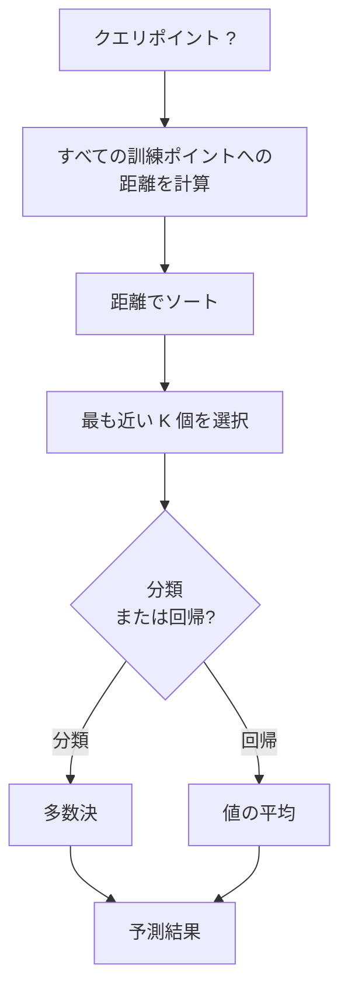
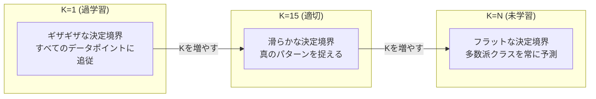
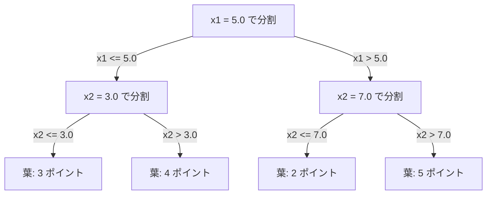

# K近傍法と距離

> すべてを記憶せよ。予測は近傍のデータを見ることで行う。実際に機能する最もシンプルなアルゴリズム。

**タイプ:** ビルド
**言語:** Python
**前提条件:** フェーズ1（[レッスン14 ノルムと距離](file:///Users/satoshimochizuki/Documents/github/ai-engineering-from-scratch/phases/01-math-foundations/14-norms-and-distances/)）
**時間:** 約90分

## 学習目標

- 調整可能な K および距離の重み付け投票機能を備えた K近傍法（KNN: K-Nearest Neighbors）による分類および回帰をゼロから実装する
- L1、L2、コサイン、およびミンコフスキー距離尺度を比較し、与えられたデータ型に対して適切な距離関数を選択する
- 次元の呪い（Curse of dimensionality）を説明し、高次元空間においてなぜKNNの性能が劣化するのかをデモを用いて示す
- 効率的な最近傍探索のためにKD木（KD-tree）を構築し、それがブルートフォース（全探索）を上回る条件を分析する

## 問題の背景

手元にデータセットがあるとする。新しいデータポイントが到着したとき、それを分類するか、あるいはその数値を予測する必要がある。線形回帰やSVMのようにデータからパラメータを学習する代わりに、新しいポイントに最も近い $K$ 個の訓練データを見つけて、それらの投票によって予測を行う。

これが K近傍法（KNN: K-Nearest Neighbors）である。訓練フェーズはない。学習すべきパラメータもない。最小化すべき損失関数もない。訓練セット全体を保存しておき、予測時に距離を計算する。

あまりにシンプルすぎて機能しないように思えるかもしれない。しかし、KNNは特に小〜中規模のデータセットにおいて驚くほど競争力があり、これを深く理解することで「距離尺度の選択」（フェーズ1 レッスン14に直結）、「次元の呪い」、および「怠惰学習（Lazy learning）と積極学習（Eager learning）の違い」といった機械学習の基礎的な概念が明らかになる。

KNNは現代のAIのいたるところで、形を変えて登場している。ベクトルデータベース（Vector database）は、埋め込みベクトル（Embeddings）に対してKNN探索を行う。RAG（Retrieval-augmented generation）は、最も近い $K$ 個のドキュメントチャンクを検索する。推薦システム（Recommendation systems）は、類似したユーザーやアイテムを探し出す。アルゴリズム自体は同じである。スケールとデータ構造が異なっているだけである。

## 概念

### KNNの仕組み

ラベル付きデータの集合と、新しいクエリポイントが与えられたときの手順：

1. クエリポイントからデータセット内のすべての点までの距離を計算する
2. 距離が近い順にソートする
3. 最も近い $K$ 個の点を選択する
4. 分類タスクの場合：$K$ 個の近傍における多数決（Majority vote）を行う
5. 回帰タスクの場合：$K$ 個の近傍の値の平均（または重み付き平均）を計算する



これがアルゴリズムのすべてである。フィッティング（適合）も、勾配降下法も、エポックの概念もない。

### Kの選択

K は唯一のハイパーパラメータである。これはバイアスと分散のトレードオフを制御する：

| K の値 | 挙動 |
|---|---|
| K = 1 | 決定境界はすべての点に追従する。訓練誤差は 0 になる。高分散。過学習（Overfit）する |
| 小さな K (3-5) | 局所的な構造に敏感。複雑な決定境界を捉えることができる |
| 大きな K | 境界は滑らかになる。ノイズに対してより頑健。未学習（Underfit）の可能性がある |
| K = N | すべてのポイントに対して多数派のクラスを予測する。最大バイアス |

一般的な初期値の目安として、サンプル数 $N$ に対して $K = \sqrt{N}$ が使われる。二値分類においてタイ（同数投票）を避けるために、奇数の $K$ を選択する。



### 距離尺度

距離関数は「近い」ということの定義そのものである。使用する尺度によって、近傍となる点や最終的な予測結果が変わる。

**L2（ユークリッド）距離**はデフォルトの選択肢である。直線距離を表す。

```
d(a, b) = sqrt(sum((a_i - b_i)^2))
```

特徴量のスケール（大きさ）に極めて敏感である。L2距離をKNNで使用する前には、必ず特徴量を標準化（標準スケーリング）してほしい。

**L1（マンハッタン）距離**は、絶対差の総和である。差を2乗しないため、L2距離よりも外れ値に対して頑健（Robust）である。

```
d(a, b) = sum(|a_i - b_i|)
```

**コサイン（Cosine）距離**は、ベクトルの大きさを無視して、ベクトル間の角度を測定する。テキストデータや埋め込みベクトルの比較に不可欠である。

```
d(a, b) = 1 - (a . b) / (||a|| * ||b||)
```

**ミンコフスキー（Minkowski）距離**は、パラメータ $p$ によって L1 と L2 を一般化したものである。

```
d(a, b) = (sum(|a_i - b_i|^p))^(1/p)

p=1: マンハッタン距離
p=2: ユークリッド距離
p->inf: チェビシェフ距離 (最大の絶対差)
```

データの種類によってどの距離尺度を使用すべきかが決まる：

| データの種類 | 最適な距離尺度 | 理由 |
|---|---|---|
| 数値特徴量、スケールが同等 | L2（ユークリッド） | デフォルト。空間データに最適 |
| 数値特徴量、外れ値あり | L1（マンハッタン） | 頑健。大きな差を増幅しない |
| テキスト埋め込み | コサイン | ベクトルの大きさはノイズであり、向きに意味があるため |
| 高次元で疎な（Sparse）データ | コサインまたは L1 | L2は次元の呪いの影響を受けやすいため |
| 混在データ | カスタム距離 | 特徴量の種類ごとに距離を計算して組み合わせる |

### 重み付きKNN

標準的なKNNは、選択された $K$ 個の近傍すべてに均等な重みを与える。しかし、距離が 0.1 の位置にある近傍は、距離が 5.0 の位置にある近傍よりも重要であるべきである。

**距離の重み付きKNN**は、各近傍の投票に距離の逆数を重みとして割り当てる：

```
weight_i = 1 / (distance_i + epsilon)

分類タスクの場合：重み付き投票
回帰タスクの場合：重み付き平均 = sum(w_i * y_i) / sum(w_i)
```

$\epsilon$（極小値）は、クエリポイントが訓練データポイントと完全に一致した場合にゼロ除算が発生するのを防ぐ。

重み付きKNNは、遠くの近傍の寄与が自動的に極めて小さくなるため、ハイパーパラメータ $K$ の選択に対して頑健になる。

### 次元の呪い

KNNの性能は、高次元空間において極端に低下する。これは曖昧な懸念ではなく、数学的な事実である。

**問題 1: 距離の収束。** 次元数が増加するにつれて、最大ペア距離と最小ペア距離の比率が 1 に近づく。すべての点がクエリポイントからほぼ同じ「遠さ」になってしまう。

```
一様ランダムなデータポイントにおける、次元 d と距離の関係：

d=2:    max_dist / min_dist = 大きく変動する
d=100:  max_dist / min_dist ~ 1.01
d=1000: max_dist / min_dist ~ 1.001

すべての距離がほぼ等しくなると、「最も近い」という概念自体が意味を失う。
```

**問題 2: 体積の爆発。** データの一定割合（例えば $K$ 個 of neighbors）をキャプチャするためには、次元が高くなるほど、特徴量空間の大部分をカバーするように探索半径を広げなければならない。高次元における「近傍」は、事実上空間のほぼ全体を含んでしまう。

**問題 3: 角（コーナー）の支配。** $d$ 次元の単位超立方体において、体積のほとんどは中心ではなく角の付近に集中する。立方体に内接する超球の体積は、$d$ が大きくなるにつれて立方体全体の体積に対して無視できるほど小さくなっていく。

実務上の帰結：KNNがうまく機能するのは、およそ 20 〜 50 特徴量までである。これを超える場合は、KNNを適用する前に次元削減（PCA、UMAP、t-SNEなど）を行うか、データの潜在的な低次元構造を利用する決定木ベースの探索構造を用いる必要がある。

### KD木：効率的な最近傍探索

ブルートフォース（全探索）によるKNNは、クエリポイントからすべての訓練データポイントまでの距離を計算する。この計算量はクエリあたり $O(n \cdot d)$ となる。大規模なデータセットでは、これでは遅すぎる。

**KD木（KD-tree）**は、特徴量の軸に沿って空間を再帰的に分割する。各階層において、特定の次元の中央値（メディアン）を用いて空間を2つに分割する。



最近傍を見つけるには、まずクエリポイントを含む葉ノードまで木をたどり、その後に逆方向に探索（バックトラック）する。より近い点が含まれる可能性のある隣接領域のみをチェックしていく。

平均クエリ時間：低次元の場合は $O(\log n)$ である。しかし、高次元（$d > 20$）になると、バックトラックで枝刈りできるブランチが急激に減るため、KD木は $O(n)$ （ブルートフォースと同等）に退化する。

### ボール木：中程度の次元に適したデータ構造

ボール木（Ball tree）は、軸に沿ったボックスではなく、入れ子状の超球面（Hyperspheres）で空間を分割する。各ノードは、その部分木に含まれるすべての点を包含する「ボール」（中心＋半径）を定義する。

KD木に対する利点：
- 中程度の次元数（最大で 〜50）においてよりうまく機能する
- 特徴量の軸に沿っていない斜め方向のデータ構造を処理できる
- 包含体積がより密着しているため、探索時の枝刈りがより効果的になる

KD木とボール木はどちらも正確な（Exact）アルゴリズムである。数百万ポイント、数百次元におよぶ真に大規模な探索を行う場合は、近似最近傍（ANN: Approximate Nearest Neighbor）探索手法（HNSW、LSH、IVFなど）が代わりに用いられる。これらはフェーズ1 レッスン14で扱った。

### 怠惰学習と積極学習

KNNは典型的な怠惰学習器である。訓練時には一切の計算を行わず、すべての処理を予測時に実行する。これに対し、多くのアルゴリズム（線形回帰、SVM、ニューラルネットワーク）は積極学習器である。訓練時に重い計算を行ってコンパクトなモデルを構築し、予測時には高速に処理を行う。

| 特徴 | 怠惰学習 (KNN) | 積極学習 (SVM, ニューラルネット) |
|---|---|---|
| 訓練時間 | O(1) データを保存するだけ | O(n * エポック数) |
| 予測時間 | クエリごとに O(n * d) | O(d) またはパラメータ数に依存 |
| 予測時のメモリ量 | 訓練データ全体を保持する必要がある | モデルのパラメータのみ保持すればよい |
| 新しいデータへの対応 | 新たな点を即座に追加可能 | モデルを再訓練する必要がある |
| 決定境界 | 暗黙的。予測時にオンザフライで計算 | 明示的。訓練完了後に固定 |

怠惰学習が最適な状況：
- データセットが頻繁に変更される場合（再訓練なしでポイントを追加・削除したい）
- 予測を実行するクエリ数が非常に少ない場合
- 訓練時間を 0 にしたい場合
- データセットが十分に小さく、ブルートフォースによる全探索でも十分に高速な場合

### 回帰のためのKNN

回帰問題におけるKNNは、多数決の代わりに、選ばれた $K$ 個の近傍のターゲット値の平均を予測値とする。

```
予測値 = (1/K) * sum(y_i)  (K個の最近傍にわたる和)

距離の重み付きの場合：
予測値 = sum(w_i * y_i) / sum(w_i)
ここで、w_i = 1 / distance_i
```

KNN回帰は、区分的定数（重み付きの場合は区分的滑らか）な予測を生成する。訓練データの範囲を超えた予測（外揃: Extrapolation）は行えない。例えば、訓練データのターゲット値がすべて 0 から 100 の間にある場合、KNNが 200 という値を予測することは絶対にない。

## 実装してみよう

### ステップ 1：距離関数

L1、L2、コサイン、およびミンコフスキー距離を実装する。これらはフェーズ1 レッスン14に直結している。

```python
import math

def l2_distance(a, b):
    return math.sqrt(sum((ai - bi) ** 2 for ai, bi in zip(a, b)))

def l1_distance(a, b):
    return sum(abs(ai - bi) for ai, bi in zip(a, b))

def cosine_distance(a, b):
    dot_val = sum(ai * bi for ai, bi in zip(a, b))
    norm_a = math.sqrt(sum(ai ** 2 for ai in a))
    norm_b = math.sqrt(sum(bi ** 2 for bi in b))
    if norm_a == 0 or norm_b == 0:
        return 1.0
    return 1.0 - dot_val / (norm_a * norm_b)

def minkowski_distance(a, b, p=2):
    if p == float('inf'):
        return max(abs(ai - bi) for ai, bi in zip(a, b))
    return sum(abs(ai - bi) ** p for ai, bi in zip(a, b)) ** (1 / p)
```

### ステップ 2：KNN 分類器と回帰器

Kの値、距離関数、および距離による重み付けを選択可能な KNN クラスを実装する。

```python
class KNN:
    def __init__(self, k=5, distance_fn=l2_distance, weighted=False,
                 task="classification"):
        self.k = k
        self.distance_fn = distance_fn
        self.weighted = weighted
        self.task = task
        self.X_train = None
        self.y_train = None

    def fit(self, X, y):
        self.X_train = X
        self.y_train = y

    def predict(self, X):
        return [self._predict_one(x) for x in X]
```

### ステップ 3：KD木による効率的な探索

各次元の中央値（メディアン）で再帰的に空間を分割するKD木をゼロから構築する。

```python
class KDTree:
    def __init__(self, X, indices=None, depth=0):
        # データを再帰的にパーティショニングする
        self.axis = depth % len(X[0])
        # 現在の軸の中央値で分割する
        ...

    def query(self, point, k=1):
        # 葉までトラバースし、バックトラックを行う
        ...
```

完全な実装、ヘルパーメソッド、およびデモについては [knn.py](file:///Users/satoshimochizuki/Documents/github/ai-engineering-from-scratch/phases/02-ml-fundamentals/06-knn-and-distances/code/knn.py) を参照。

### ステップ 4：特徴量のスケーリング

距離尺度は特徴量の大きさに依存するため、KNNではスケーリングが不可欠である。例えば 0 〜 1000 の範囲を取る特徴量は、0 〜 1 の特徴量を距離計算で圧倒してしまう。

```python
def standardize(X):
    n = len(X)
    d = len(X[0])
    means = [sum(X[i][j] for i in range(n)) / n for j in range(d)]
    stds = [
        max(1e-10, (sum((X[i][j] - means[j]) ** 2 for i in range(n)) / n) ** 0.5)
        for j in range(d)
    ]
    return [[((X[i][j] - means[j]) / stds[j]) for j in range(d)] for i in range(n)], means, stds
```

## 使ってみよう

scikit-learn を使用した実装例：

```python
from sklearn.neighbors import KNeighborsClassifier
from sklearn.preprocessing import StandardScaler
from sklearn.pipeline import Pipeline

clf = Pipeline([
    ("scaler", StandardScaler()),
    ("knn", KNeighborsClassifier(n_neighbors=5, metric="euclidean")),
])
clf.fit(X_train, y_train)
print(f"Accuracy: {clf.score(X_test, y_test):.4f}")
```

データセットが十分に大きく、かつ次元数が十分に低い場合、scikit-learn は自動的にKD木やボール木を内部で構築して使用する。高次元データの場合は自動的にブルートフォース探索へ切り替わる。これは `algorithm` パラメータで制御できる。

数百万ベクトル規模の超大規模な最近傍探索を行う場合は、FAISS、Annoy、あるいは専用のベクトルデータベースを使用してほしい：

```python
import faiss

index = faiss.IndexFlatL2(dimension)
index.add(embeddings)
distances, indices = index.search(query_vectors, k=5)
```

## 演習問題

1. 3つのクラスを持つ2次元データセットに対してKNN分類を適用せよ。K=1, K=5, K=15, K=N のそれぞれについて決定境界をプロットせよ。過学習から未学習への遷移を観察せよ。

2. 2次元、5次元、10次元、50次元、100次元、500次元のそれぞれの空間において、一様なランダムポイントを1000個生成せよ。それぞれの次元について、全ペア間の「最大距離と最小距離の比率」を計算せよ。この比率を次元数に対してプロットし、次元の呪いを視覚化せよ。

3. テキスト分類問題（TF-IDFベクトルを使用）に対して、KNNで使用する距離尺度（L1、L2、コサイン距離）を比較せよ。どの尺度が最も高い予測精度をもたらすか？なぜテキストデータではコサイン距離が優れているのかを説明せよ。

4. KD木を実装し、2次元、10次元、50次元のデータセット（サイズ 1k、10k、100k ポイント）において、クエリ応答時間をブルートフォース探索と比較せよ。次元数がいくつになると、KD木の探索がブルートフォース探索より遅くなるか？

5. $y = \sin(x) + \text{noise}$ に対して、重み付きKNN回帰器を構築せよ。K=3, 10, 30 において、重みなしKNN回帰器と比較せよ。特に大きな K を用いた場合に、重み付けによってどれだけ予測が滑らかになるかを示せ。

## 主要用語

| 用語 | 実際の意味 |
|---|---|
| K近傍法 (K-nearest neighbors) | 新しいクエリに対して、最も距離が近い K 個 of 訓練データポイントを見つけることで予測を行う非パラメータアルゴリズム |
| 怠惰学習 (Lazy learning) | 訓練時には一切計算を行わず、予測を実行する段階ですべての計算を行う学習形態。KNNはその代表例 |
| 積極学習 (Eager learning) | 訓練時に重い計算を行ってコンパクトなモデルを構築する学習形態。多くの機械学習モデルが該当する |
| 次元の呪い (Curse of dimensionality) | 高次元空間において、距離が収束し、近傍領域が空間の大部分を覆ってしまうため、KNNが機能しなくなる現象 |
| KD木 (KD-tree) | 特徴量の軸に沿って空間を再帰的に2分割する二分木。低次元におけるクエリ計算量を $O(\log n)$ に抑える |
| ボール木 (Ball tree) | 入れ子状の超球面で空間を分割するツリー構造。中程度の次元数（最大でおよそ50）においてKD木より優れる |
| 重み付きKNN (Weighted KNN) | 近傍の投票重みを距離の逆数に比例させる手法。より近いデータほど予測に強い影響を与える |
| 特徴量のスケーリング (Feature scaling) | 特徴量の範囲を同等にスケーリングすること。KNNのような距離ベースのアルゴリズムでは必須の処理 |
| 多数決 (Majority vote) | K個の近傍データの中で最も頻出するクラスを予測結果とする分類方法 |
| ブルートフォース探索 (Brute force search) | クエリに対して、すべての訓練データポイントとの距離を計算する全探索法。クエリあたり $O(n \cdot d)$。正確だが大規模データでは遅い |
| 近似最近傍探索 (Approximate nearest neighbor) | 正確な最近傍探索を行う代わりに、探索速度を劇的に向上させる近似アルゴリズム（HNSW、LSHなど） |
| ボロノイ図 (Voronoi diagram) | 各領域が特定の訓練ポイントに最も近い空間の分割図。K=1 のKNNの決定境界はボロノイ図の境界に一致する |

## 推薦図書・論文

- [Cover & Hart: Nearest Neighbor Pattern Classification (1967)](https://ieeexplore.ieee.org/document/1053964) - 最も基礎的なKNNの論文。KNNの誤差率がベイズ最適誤差率の最大2倍以下に収まることを証明した
- [Friedman, Bentley, Finkel: An Algorithm for Finding Best Matches in Logarithmic Expected Time (1977)](https://dl.acm.org/doi/10.1145/355744.355745) - KD木の原著論文
- [Beyer et al.: When Is "Nearest Neighbor" Meaningful? (1999)](https://link.springer.com/chapter/10.1007/3-540-49257-7_15) - 最近傍探索における次元の呪いの形式的な数学的分析
- [scikit-learn Nearest Neighbors documentation](https://scikit-learn.org/stable/modules/neighbors.html) - アルゴリズムの選択と使用法の実用的な解説
- [FAISS: A Library for Efficient Similarity Search](https://github.com/facebookresearch/faiss) - 数十億個のベクトルに対する効率的な近似最近傍探索のためのMeta社製ライブラリ
