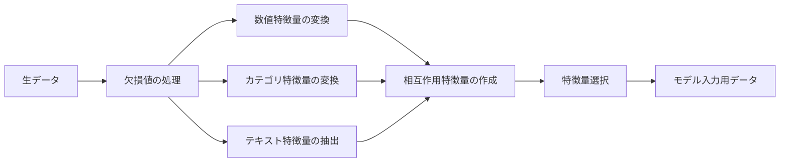

# 特徴量エンジニアリングと特徴量選択

> 優れた特徴量は、千個のデータポイントに匹敵する価値がある。

**タイプ:** ビルド
**言語:** Python
**前提条件:** フェーズ1（[レッスン15 機械学習のための統計学](file:///Users/satoshimochizuki/Documents/github/ai-engineering-from-scratch/phases/01-math-foundations/15-statistics-for-ml/)、[レッスン01 線形代数の直感](file:///Users/satoshimochizuki/Documents/github/ai-engineering-from-scratch/phases/01-math-foundations/01-linear-algebra-intuition/)）、フェーズ2 レッスン01〜07
**時間:** 約90分

## 学習目標

- 数値特徴量の変換（標準化、Min-Maxスケーリング、対数変換、ビニング）を実装し、それぞれの適用シーンを説明する
- カテゴリ特徴量のエンコーディング（ワンホット、ラベル、ターゲットエンコーディング）を構築し、ターゲットエンコーディングにおけるデータリーケージのリスクを特定する
- TF-IDFベクトライザをゼロから構築し、なぜそれがテキスト分類において単なる単語カウントを上回るかを説明する
- フィルターベースの特徴量選択（分散しきい値、相関、相互情報量）を適用して、データ次元を削減する

## 問題の背景

手元にデータセットがある。アルゴリズムを選び、訓練した。しかし結果はパッとしない。今度はより複雑なアルゴリズムを試してみる。やはり結果は平凡だ。丸一週間をハイパーパラメータの調整に費やした。ほんのわずかだけ改善した。

そんなとき、誰かが生のデータを変換してより良い特徴量を作ったところ、シンプルなロジスティック回帰が、あなたが苦労して調整した複雑な勾配ブースティングアンサンブルモデルに圧勝した。

これは機械学習の実務で日常茶飯事である。古典的な機械学習においては、アルゴリズムの選択よりも「データの表現（表現方法）」の方がはるかに重要である。どんなに洗練された学習アルゴリズムを使用しても、「住所を表す生の文字列」をそのまま与えたモデルは、「床面積（平方フィート）」と「寝室の数」を持つ家賃予測モデルには勝てない。アルゴリズムは、あなたが与えたデータをもとにしか機能しないからである。

特徴量エンジニアリング（Feature engineering）とは、生のデータをモデルがパターンを見つけやすい表現に変換するプロセスである。特徴量選択（Feature selection）とは、シグナルを増やさずにノイズだけを増やす無駄な特徴量を捨てるプロセスである。これらを組み合わせることは、古典的な機械学習において最も強力なテコ（レバレッジ）となる。

## 概念

### 特徴量パイプライン



### 数値特徴量

生の数値データがそのままモデルに適していることは稀である。一般的な変換方法：

**スケーリング（Scaling）：** 距離ベースのアルゴリズム（K-Means、KNN、SVM）がすべての特徴量を平等に扱うように、特徴量を同じ範囲に揃える。Min-Maxスケーリングは値を $[0, 1]$ の範囲に写像する。標準化（Standardization / z-score）は平均が 0、標準偏差が 1 になるように写像する。

**対数変換（Log transform）：** 右に歪んだ分布（収入、人口、単語の出現頻度など）を圧縮する。掛け算的な（乗法的な）関係を足し算的な（加法的な）関係に変換する。

**ビニング（Binning / 離散化）：** 連続値をいくつかのカテゴリ（ビン）に変換する。特徴量とターゲットの関係が非線形だが、段階的（ステップ状）である場合（例：年齢グループ）に有用である。

**多項式特徴量（Polynomial features）：** $x^2$ や $x^3$、あるいは $x_1 \times x_2$ のような項を作成する。特徴量の数は増えるが、線形モデルで非線形な関係性を捉えることができるようになる。

### カテゴリ特徴量

モデルが処理できるのは数値だけである。したがって、カテゴリ（文字列やクラス）はエンコードする必要がある。

**ワンホットエンコーディング（One-hot encoding）：** カテゴリごとに二値（0か1）の列を作成する。「色 ＝ 赤/青/緑」は、`is_red`、`is_blue`、`is_green` の3つの列になる。カテゴリの種類数が少ない（低カーディナリティ）場合はうまく機能するが、種類数が多いと列数が爆発的に増加する。

**ラベルエンコーディング（Label encoding）：** 各カテゴリを単一の整数にマッピングする（赤＝0、青＝1、緑＝2）。しかし、これは「緑 ＞ 青 ＞ 赤」という誤った順序関係を導入してしまう。個々の値で条件分岐する決定木ベースのモデルでのみ適切に使用できる。

**ターゲットエンコーディング（Target encoding）：** 各カテゴリを、そのカテゴリに対応するターゲット変数の平均値で置き換える。強力だが、データリーケージ（情報の漏洩）のリスクが非常に高い危険な手法でもある。必ず訓練データのみから平均値を計算し、それをテストデータに適用しなければならない。

### テキスト特徴量

**カウントベクトライザ（Count vectorizer）：** 各単語がドキュメント内に何回出現するかをカウントする。「the cat sat on the mat」は `{the: 2, cat: 1, sat: 1, on: 1, mat: 1}` と表現される。

**TF-IDF：** 単語の出現頻度（Term Frequency）と逆文書頻度（Inverse Document Frequency）の積である。コーパス（文書全体）において、その単語がどれだけユニークであるかによって重み付けを行う。多くの文書に出現する一般的な単語（「the」など）の重みは低くなり、特定の文書にしか出現しない珍しく特徴的な単語の重みが高くなる。

```
TF(word, doc) = 文書 doc 内の word の出現回数 / 文書 doc 内の総単語数
IDF(word) = log(総文書数 / word を含む文書数)
TF-IDF = TF * IDF
```

### 欠損値（Missing Values）

現実のデータには欠落がある。処理戦略：

- **行の削除（Drop rows）**：欠損データが稀であり、かつランダムに発生している場合のみ適用可能
- **平均値/中央値の代入（Mean/median imputation）**：シンプルであり、分布の形状を維持する（中央値は外れ値に対してより頑健である）
- **最頻値の代入（Mode imputation）**：カテゴリ特徴量に対して適用する
- **欠損インジケータ（Indicator column）**：値を代入する前に「この値は欠損していたか」を示す二値の列 `was_this_missing` を追加する。データが欠損しているという事実そのものが予測に役立つ情報である場合が多い
- **前方/後方置換（Forward/backward fill）**：時系列データに対して適用する

### 相互作用特徴量（Feature Interaction）

関係性が「組み合わせ」の中に存在することがある。「身長」と「体重」を単独で用いるよりも、「BMI ＝ 体重 / 身長²」という組み合わせの方が予測に役立つ。相互作用特徴量は特徴量空間を掛け算的に拡大させるため、ドメイン知識を用いて適切なものだけを選択してほしい。

### 特徴量選択

特徴量は多ければ多いほど良いというわけではない。無関係な特徴量はノイズを加え、訓練時間を引き延ばし、過学習の原因となる。

**フィルター手法（Filter methods、モデル構築前）：**
- 相関（Correlation）：互いに高度に相関している特徴量（冗長なもの）を削除する
- 相互情報量（Mutual information）：ある特徴量を知ることで、ターゲットに関する不確実性がどれだけ減少するかを測定する
- 分散しきい値（Variance threshold）：ほとんど値が変化しない特徴量を削除する

**ラッパー手法（Wrapper methods、モデルベース）：**
- L1正則化（Lasso）：無関係な特徴量の重みを正確にゼロにする
- 再帰的特徴量削減（Recursive feature elimination）：モデルを訓練し、最も重要度の低い特徴量を削除する、というプロセスを繰り返す

**選択が重要な理由：** 通常、10個の優れた特徴量を持つモデルは、10個の優れた特徴量と90個のノイズ特徴量を持つモデルよりも優れた性能を発揮する。ノイズ特徴量が存在すると、モデルが「一般化しない（未知のデータに通用しない）訓練データ特有のパターン」に過学習してしまうためである。

## 実装してみよう

### ステップ 1：数値特徴量変換のスクラッチ実装

```python
import math


def min_max_scale(values):
    min_val = min(values)
    max_val = max(values)
    if max_val == min_val:
        return [0.0] * len(values)
    return [(v - min_val) / (max_val - min_val) for v in values]


def standardize(values):
    n = len(values)
    mean = sum(values) / n
    variance = sum((v - mean) ** 2 for v in values) / n
    std = math.sqrt(variance) if variance > 0 else 1.0
    return [(v - mean) / std for v in values]


def log_transform(values):
    return [math.log(v + 1) for v in values]


def bin_values(values, n_bins=5):
    min_val = min(values)
    max_val = max(values)
    bin_width = (max_val - min_val) / n_bins
    if bin_width == 0:
        return [0] * len(values)
    result = []
    for v in values:
        bin_idx = int((v - min_val) / bin_width)
        bin_idx = min(bin_idx, n_bins - 1)
        result.append(bin_idx)
    return result


def polynomial_features(row, degree=2):
    n = len(row)
    result = list(row)
    if degree >= 2:
        for i in range(n):
            result.append(row[i] ** 2)
        for i in range(n):
            for j in range(i + 1, n):
                result.append(row[i] * row[j])
    return result
```

### ステップ 2：カテゴリ特徴量エンコーディングのスクラッチ実装

```python
def one_hot_encode(values):
    categories = sorted(set(values))
    cat_to_idx = {cat: i for i, cat in enumerate(categories)}
    n_cats = len(categories)

    encoded = []
    for v in values:
        row = [0] * n_cats
        row[cat_to_idx[v]] = 1
        encoded.append(row)

    return encoded, categories


def label_encode(values):
    categories = sorted(set(values))
    cat_to_int = {cat: i for i, cat in enumerate(categories)}
    return [cat_to_int[v] for v in values], cat_to_int


def target_encode(feature_values, target_values, smoothing=10):
    global_mean = sum(target_values) / len(target_values)

    category_stats = {}
    for feat, target in zip(feature_values, target_values):
        if feat not in category_stats:
            category_stats[feat] = {"sum": 0.0, "count": 0}
        category_stats[feat]["sum"] += target
        category_stats[feat]["count"] += 1

    encoding = {}
    for cat, stats in category_stats.items():
        cat_mean = stats["sum"] / stats["count"]
        weight = stats["count"] / (stats["count"] + smoothing)
        encoding[cat] = weight * cat_mean + (1 - weight) * global_mean

    return [encoding[v] for v in feature_values], encoding
```

### ステップ 3：テキスト特徴量のスクラッチ実装

```python
def count_vectorize(documents):
    vocab = {}
    idx = 0
    for doc in documents:
        for word in doc.lower().split():
            if word not in vocab:
                vocab[word] = idx
                idx += 1

    vectors = []
    for doc in documents:
        vec = [0] * len(vocab)
        for word in doc.lower().split():
            vec[vocab[word]] += 1
        vectors.append(vec)

    return vectors, vocab


def tfidf(documents):
    n_docs = len(documents)

    vocab = {}
    idx = 0
    for doc in documents:
        for word in doc.lower().split():
            if word not in vocab:
                vocab[word] = idx
                idx += 1

    doc_freq = {}
    for doc in documents:
        seen = set()
        for word in doc.lower().split():
            if word not in seen:
                doc_freq[word] = doc_freq.get(word, 0) + 1
                seen.add(word)

    vectors = []
    for doc in documents:
        words = doc.lower().split()
        word_count = len(words)
        tf_map = {}
        for word in words:
            tf_map[word] = tf_map.get(word, 0) + 1

        vec = [0.0] * len(vocab)
        for word, count in tf_map.items():
            tf = count / word_count
            idf = math.log(n_docs / doc_freq[word])
            vec[vocab[word]] = tf * idf
        vectors.append(vec)

    return vectors, vocab
```

### ステップ 4：欠損値代入のスクラッチ実装

```python
def impute_mean(values):
    present = [v for v in values if v is not None]
    if not present:
        return [0.0] * len(values), 0.0
    mean = sum(present) / len(present)
    return [v if v is not None else mean for v in values], mean


def impute_median(values):
    present = sorted(v for v in values if v is not None)
    if not present:
        return [0.0] * len(values), 0.0
    n = len(present)
    if n % 2 == 0:
        median = (present[n // 2 - 1] + present[n // 2]) / 2
    else:
        median = present[n // 2]
    return [v if v is not None else median for v in values], median


def impute_mode(values):
    present = [v for v in values if v is not None]
    if not present:
        return values, None
    counts = {}
    for v in present:
        counts[v] = counts.get(v, 0) + 1
    mode = max(counts, key=counts.get)
    return [v if v is not None else mode for v in values], mode


def add_missing_indicator(values):
    return [0 if v is not None else 1 for v in values]
```

### ステップ 5：特徴量選択のスクラッチ実装

```python
def correlation(x, y):
    n = len(x)
    mean_x = sum(x) / n
    mean_y = sum(y) / n
    cov = sum((xi - mean_x) * (yi - mean_y) for xi, yi in zip(x, y)) / n
    std_x = math.sqrt(sum((xi - mean_x) ** 2 for xi in x) / n)
    std_y = math.sqrt(sum((yi - mean_y) ** 2 for yi in y) / n)
    if std_x == 0 or std_y == 0:
        return 0.0
    return cov / (std_x * std_y)


def mutual_information(feature, target, n_bins=10):
    feat_min = min(feature)
    feat_max = max(feature)
    bin_width = (feat_max - feat_min) / n_bins if feat_max != feat_min else 1.0
    feat_binned = [
        min(int((f - feat_min) / bin_width), n_bins - 1) for f in feature
    ]

    n = len(feature)
    target_classes = sorted(set(target))

    feat_bins = sorted(set(feat_binned))
    p_feat = {}
    for b in feat_bins:
        p_feat[b] = feat_binned.count(b) / n

    p_target = {}
    for t in target_classes:
        p_target[t] = target.count(t) / n

    mi = 0.0
    for b in feat_bins:
        for t in target_classes:
            joint_count = sum(
                1 for fb, tv in zip(feat_binned, target) if fb == b and tv == t
            )
            p_joint = joint_count / n
            if p_joint > 0:
                mi += p_joint * math.log(p_joint / (p_feat[b] * p_target[t]))

    return mi


def variance_threshold(features, threshold=0.01):
    n_features = len(features[0])
    n_samples = len(features)
    selected = []

    for j in range(n_features):
        col = [features[i][j] for i in range(n_samples)]
        mean = sum(col) / n_samples
        var = sum((v - mean) ** 2 for v in col) / n_samples
        if var >= threshold:
            selected.append(j)

    return selected


def remove_correlated(features, threshold=0.9):
    n_features = len(features[0])
    n_samples = len(features)

    to_remove = set()
    for i in range(n_features):
        if i in to_remove:
            continue
        col_i = [features[r][i] for r in range(n_samples)]
        for j in range(i + 1, n_features):
            if j in to_remove:
                continue
            col_j = [features[r][j] for r in range(n_samples)]
            corr = abs(correlation(col_i, col_j))
            if corr >= threshold:
                to_remove.add(j)

    return [i for i in range(n_features) if i not in to_remove]
```

### ステップ 6：パイプラインの構築と実行デモ

```python
import random


def make_housing_data(n=200, seed=42):
    random.seed(seed)
    data = []
    for _ in range(n):
        sqft = random.uniform(500, 5000)
        bedrooms = random.choice([1, 2, 3, 4, 5])
        age = random.uniform(0, 50)
        neighborhood = random.choice(["downtown", "suburbs", "rural"])
        has_pool = random.choice([True, False])

        sqft_with_missing = sqft if random.random() > 0.05 else None
        age_with_missing = age if random.random() > 0.08 else None

        price = (
            50 * sqft
            + 20000 * bedrooms
            - 1000 * age
            + (50000 if neighborhood == "downtown" else 10000 if neighborhood == "suburbs" else 0)
            + (15000 if has_pool else 0)
            + random.gauss(0, 20000)
        )

        data.append({
            "sqft": sqft_with_missing,
            "bedrooms": bedrooms,
            "age": age_with_missing,
            "neighborhood": neighborhood,
            "has_pool": has_pool,
            "price": price,
        })
    return data


if __name__ == "__main__":
    data = make_housing_data(200)

    print("=== Raw Data Sample ===")
    for row in data[:3]:
        print(f"  {row}")

    sqft_raw = [d["sqft"] for d in data]
    age_raw = [d["age"] for d in data]
    prices = [d["price"] for d in data]

    print("\n=== Missing Value Handling ===")
    sqft_missing = sum(1 for v in sqft_raw if v is None)
    age_missing = sum(1 for v in age_raw if v is None)
    print(f"  sqft missing: {sqft_missing}/{len(sqft_raw)}")
    print(f"  age missing: {age_missing}/{len(age_raw)}")

    sqft_indicator = add_missing_indicator(sqft_raw)
    age_indicator = add_missing_indicator(age_raw)
    sqft_imputed, sqft_fill = impute_median(sqft_raw)
    age_imputed, age_fill = impute_mean(age_raw)
    print(f"  sqft filled with median: {sqft_fill:.0f}")
    print(f"  age filled with mean: {age_fill:.1f}")

    print("\n=== Numerical Transforms ===")
    sqft_scaled = standardize(sqft_imputed)
    age_scaled = min_max_scale(age_imputed)
    sqft_log = log_transform(sqft_imputed)
    age_binned = bin_values(age_imputed, n_bins=5)
    print(f"  sqft standardized: mean={sum(sqft_scaled)/len(sqft_scaled):.4f}, std={math.sqrt(sum(v**2 for v in sqft_scaled)/len(sqft_scaled)):.4f}")
    print(f"  age min-max: [{min(age_scaled):.2f}, {max(age_scaled):.2f}]")
    print(f"  age bins: {sorted(set(age_binned))}")

    print("\n=== Categorical Encoding ===")
    neighborhoods = [d["neighborhood"] for d in data]

    ohe, ohe_cats = one_hot_encode(neighborhoods)
    print(f"  One-hot categories: {ohe_cats}")
    print(f"  Sample encoding: {neighborhoods[0]} -> {ohe[0]}")

    le, le_map = label_encode(neighborhoods)
    print(f"  Label encoding map: {le_map}")

    te, te_map = target_encode(neighborhoods, prices, smoothing=10)
    print(f"  Target encoding: {({k: round(v) for k, v in te_map.items()})}")

    print("\n=== Text Features ===")
    descriptions = [
        "large modern house with pool",
        "small cozy cottage near downtown",
        "spacious family home with large yard",
        "modern apartment downtown with view",
        "rustic cabin in rural area",
    ]
    cv, cv_vocab = count_vectorize(descriptions)
    print(f"  Vocabulary size: {len(cv_vocab)}")
    print(f"  Doc 0 non-zero features: {sum(1 for v in cv[0] if v > 0)}")

    tf, tf_vocab = tfidf(descriptions)
    print(f"  TF-IDF vocabulary size: {len(tf_vocab)}")
    top_words = sorted(tf_vocab.keys(), key=lambda w: tf[0][tf_vocab[w]], reverse=True)[:3]
    print(f"  Doc 0 top TF-IDF words: {top_words}")

    print("\n=== Polynomial Features ===")
    sample_row = [sqft_scaled[0], age_scaled[0]]
    poly = polynomial_features(sample_row, degree=2)
    print(f"  Input: {[round(v, 4) for v in sample_row]}")
    print(f"  Polynomial: {[round(v, 4) for v in poly]}")
    print(f"  Features: [x1, x2, x1^2, x2^2, x1*x2]")

    print("\n=== Feature Selection ===")
    feature_matrix = [
        [sqft_scaled[i], age_scaled[i], float(sqft_indicator[i]), float(age_indicator[i])]
        + ohe[i]
        for i in range(len(data))
    ]

    print(f"  Total features: {len(feature_matrix[0])}")

    surviving_var = variance_threshold(feature_matrix, threshold=0.01)
    print(f"  After variance threshold (0.01): {len(surviving_var)} features kept")

    surviving_corr = remove_correlated(feature_matrix, threshold=0.9)
    print(f"  After correlation filter (0.9): {len(surviving_corr)} features kept")

    binary_prices = [1 if p > sum(prices) / len(prices) else 0 for p in prices]
    print("\n  Mutual information with target:")
    feature_names = ["sqft", "age", "sqft_missing", "age_missing"] + [f"neigh_{c}" for c in ohe_cats]
    for j in range(len(feature_matrix[0])):
        col = [feature_matrix[i][j] for i in range(len(feature_matrix))]
        mi = mutual_information(col, binary_prices, n_bins=10)
        print(f"    {feature_names[j]}: MI={mi:.4f}")

    print("\n  Correlation with price:")
    for j in range(len(feature_matrix[0])):
        col = [feature_matrix[i][j] for i in range(len(feature_matrix))]
        corr = correlation(col, prices)
        print(f"    {feature_names[j]}: r={corr:.4f}")
```

完全な実装、ヘルパーメソッド、およびデモについては [features.py](file:///Users/satoshimochizuki/Documents/github/ai-engineering-from-scratch/phases/02-ml-fundamentals/08-feature-engineering/code/features.py) を参照。

## 使ってみよう

scikit-learn を使用すれば、これらの変換を連結可能なパイプラインとして構築できる：

```python
from sklearn.preprocessing import StandardScaler, OneHotEncoder, PolynomialFeatures
from sklearn.impute import SimpleImputer
from sklearn.feature_extraction.text import TfidfVectorizer
from sklearn.feature_selection import mutual_info_classif, VarianceThreshold
from sklearn.compose import ColumnTransformer
from sklearn.pipeline import Pipeline

numeric_pipe = Pipeline([
    ("imputer", SimpleImputer(strategy="median")),
    ("scaler", StandardScaler()),
])

categorical_pipe = Pipeline([
    ("encoder", OneHotEncoder(sparse_output=False)),
])

preprocessor = ColumnTransformer([
    ("num", numeric_pipe, ["sqft", "age"]),
    ("cat", categorical_pipe, ["neighborhood"]),
])
```

このスクラッチ実装を通じて、各変換の内部で何が起こっているのかを正確に理解できる。ライブラリ版では、例外的なケースの処理、疎行列（Sparse matrix）のサポート、およびパイプラインの統合が追加されているが、適用されている数学的・論理的処理は同一である。

## 成果物

このレッスンでは以下を生成する：
- [prompt-feature-engineer.md](file:///Users/satoshimochizuki/Documents/github/ai-engineering-from-scratch/phases/02-ml-fundamentals/08-feature-engineering/outputs/prompt-feature-engineer.md) - 生データから系統的に特徴量をエンジニアリングするためのプロンプト

## 演習問題

1. ロバストスケーリング（平均と標準偏差の代わりに、中央値と四分位範囲を用いるスケーリング）を数値特徴量の変換に追加せよ。極端な外れ値が含まれるデータに対して、標準スケーリング（標準化）とその挙動を比較せよ。
2. Leave-one-out ターゲットエンコーディングを実装せよ。各行をエンコードする際、その行自身のターゲット値を除外してカテゴリ平均を算出する。これにより、単純なターゲットエンコーディングと比較してどれだけ過学習が抑えられるかを示せ。
3. 分散しきい値、相関フィルタリング、および相互情報量による順位付けを組み合わせた、自動特徴量選択パイプラインを構築せよ。これを住宅価格データセットに適用し、全特徴量を使用した場合と、選択した特徴量のみを使用した場合でモデル（シンプルな線形回帰）の性能を比較せよ。

## 主要用語

| 用語 | よくある説明 | 実際の意味 |
|---|---|---|
| 特徴量エンジニアリング (Feature engineering) | 「新しい列を作ること」 | 生のデータを、モデルがパターンを学習しやすいような新しい表現へと変換すること |
| 標準化 (Standardization) | 「正規化すること」 | 特徴量から平均を引き、標準偏差で割ることで、平均が 0、標準偏差が 1 になるように変換すること |
| ワンホットエンコーディング (One-hot encoding) | 「ダミー変数を作ること」 | カテゴリごとに二値（0/1）の列を作成し、各行で1つの列だけが 1 になるようにすること |
| ターゲットエンコーディング (Target encoding) | 「正解を使ってエンコードすること」 | 各カテゴリを、そのカテゴリに対応するターゲット値の平均値に置き換える手法。過学習を防ぐために平滑化（Smoothing）を行う |
| TF-IDF (TF-IDF) | 「高度な単語カウント」 | Term Frequency（単語出現頻度）と Inverse Document Frequency（逆文書頻度）の積。文書群全体の中でどれだけ特徴的かに基づいて単語を重み付ける |
| インピュテーション (Imputation) | 「空白を埋めること」 | 欠損した値を、推定された値（平均値、中央値、最頻値、またはモデルによる予測値）で置き換えること |
| 特徴量選択 (Feature selection) | 「悪い列を捨てること」 | ノイズや冗長性を加えている特徴量を取り除き、ターゲットに関する予測シグナルを持つ特徴量だけを残すこと |
| 相互情報量 (Mutual information) | 「ある変数が別の変数についてどれだけ情報を与えるか」 | 変数 X を観測することによって、変数 Y に関する不確実性がどれだけ減少するかを測定した量 |
| データリーケージ (Data leakage) | 「うっかりカンニングすること」 | 予測実行時には利用できない情報を訓練時に使用してしまうこと。訓練精度が異常に高くなるが、未知データへの汎化に失敗する |

## 推薦図書・論文

- [Feature Engineering and Selection (Max Kuhn & Kjell Johnson)](http://www.feat.engineering/) - 特徴量エンジニアリング全般を包括的にカバーした無料のオンライン書籍
- [scikit-learn Preprocessing Guide](https://scikit-learn.org/stable/modules/preprocessing.html) - 標準的なあらゆる特徴量変換に関する実用的なリファレンス
- [Target Encoding Done Right (Micci-Barreca, 2001)](https://dl.acm.org/doi/10.1145/507533.507538) - 平滑化を用いたターゲットエンコーディングを導入した原著論文
