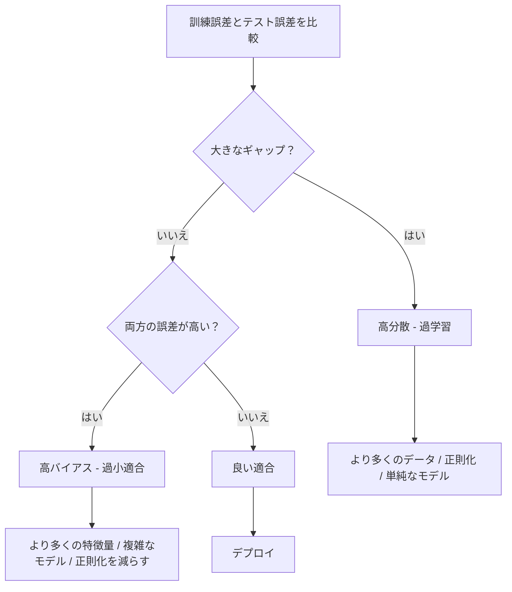
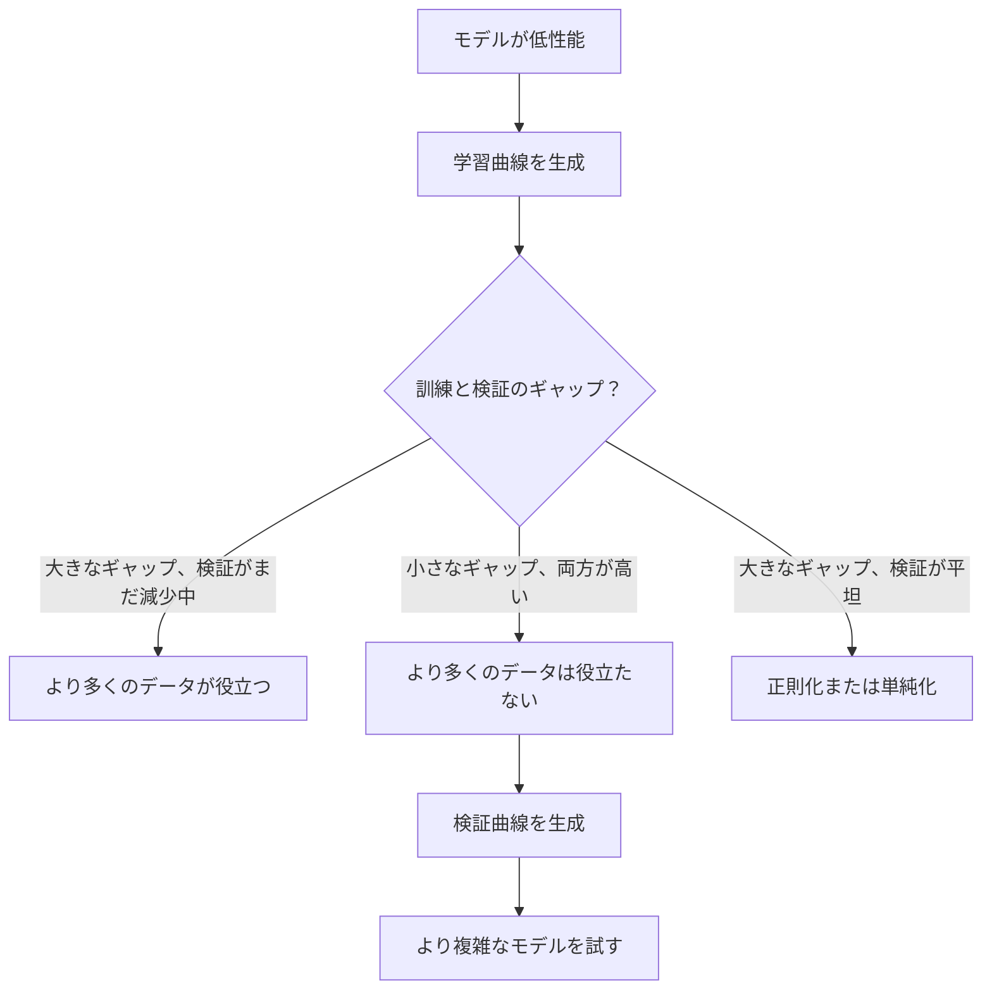

# バイアスと分散のトレードオフ

> すべてのモデル誤差は3つの源のいずれかから来る：バイアス、分散、またはノイズ。コントロールできるのは最初の2つだけだ。

**タイプ:** Learn
**言語:** Python
**前提条件:** Phase 2、レッスン01〜09（ML基礎、回帰、分類、評価）
**所要時間:** 約75分

## 学習目標

- 期待予測誤差のバイアスと分散の分解を導出し、既約ノイズの役割を説明できる
- 訓練誤差とテスト誤差のパターンを使って、モデルが高バイアスか高分散かを診断できる
- 正則化手法（L1、L2、ドロップアウト、早期停止）がどのようにバイアスと分散をトレードオフするかを説明できる
- 複雑度が増すモデルでバイアスと分散のトレードオフを可視化する実験を実装できる

## 問題

モデルを訓練した。テストデータに誤差がある。その誤差はどこから来るのか？

モデルが単純すぎる場合（曲線データセットへの線形回帰）、真のパターンを常に見逃す。それがバイアスだ。モデルが複雑すぎる場合（15データポイントへの20次多項式）、訓練データには完璧に適合するが、新しいデータに対してはまったく異なる予測を出す。それが分散だ。

固定されたモデル容量で両方を同時に最小化することはできない。バイアスを下げると分散が上がる。分散を下げるとバイアスが上がる。このトレードオフを理解することは、機械学習における最も有用な診断スキルだ。モデルをより複雑にすべきかより単純にすべきか、より多くのデータを取得すべきかより良い特徴量を設計すべきか、より多く正則化すべきかより少なく正則化すべきかを教えてくれる。

## コンセプト

### バイアス：系統的誤差

バイアスは、モデルの平均予測が真の値からどれだけ外れているかを測定する。同じ分布から抽出された多くの異なる訓練セットで同じモデルを訓練し、予測を平均した場合、バイアスはその平均と真実の間のギャップだ。

高バイアスとは、モデルが実際のパターンを捉えるには硬すぎることを意味する。放物線に直線を当てはめると、どれだけデータを与えても常に曲線を見逃す。これが過小適合だ。

```
高バイアス（過小適合）：
  モデルは常にほぼ同じ間違いを予測する。
  訓練誤差：高
  テスト誤差：高
  それらの間のギャップ：小
```

### 分散：訓練データへの感度

分散は、異なるデータサブセットで訓練したときに予測がどれだけ変わるかを測定する。訓練セットの小さな変化がモデルに大きな変化を引き起こす場合、分散が高い。

高分散とは、モデルが基礎となるシグナルではなく訓練データのノイズに適合していることを意味する。20次多項式はすべての訓練点を通り抜けるが、それらの間で激しく振動する。これが過学習だ。

```
高分散（過学習）：
  モデルは訓練データには完璧に適合するが、新しいデータでは失敗する。
  訓練誤差：低
  テスト誤差：高
  それらの間のギャップ：大
```

### 分解

任意の点xについて、二乗損失の下での期待予測誤差は正確に分解される：

```
期待誤差 = バイアス^2 + 分散 + 既約ノイズ

ここで：
  バイアス^2 = (E[f_hat(x)] - f(x))^2
  分散       = E[(f_hat(x) - E[f_hat(x)])^2]
  ノイズ     = E[(y - f(x))^2]             (sigma^2)
```

- `f(x)` は真の関数
- `f_hat(x)` はモデルの予測
- `E[...]` は異なる訓練セットに対する期待値
- `y` は観測されたラベル（真の関数＋ノイズ）

ノイズ項は既約だ。どんなモデルもノイズのあるデータでsigma^2より良くすることはできない。あなたの仕事は、バイアス^2と分散の適切なバランスを見つけることだ。

### モデルの複雑度と誤差


古典的なU字型曲線：

| 複雑度 | バイアス | 分散 | 総誤差 |
|--------|----------|------|--------|
| 低すぎる | 高 | 低 | 高（過小適合） |
| 適切 | 中 | 中 | 最低 |
| 高すぎる | 低 | 高 | 高（過学習） |

### 正則化によるバイアスと分散の制御

正則化は意図的にバイアスを増やして分散を減らす。モデルを制約してノイズを追いかけられないようにする。

- **L2（リッジ）:** すべての重みをゼロに向けて縮小する。すべての特徴量を保持するが、その影響を減らす。
- **L1（ラッソ）:** 一部の重みを正確にゼロに押し込む。特徴量選択を行う。
- **ドロップアウト:** 訓練中にランダムにニューロンを無効化する。冗長な表現を強制する。
- **早期停止:** モデルが訓練データに完全に適合する前に訓練を停止する。

正則化の強度（ラムダ、ドロップアウト率、エポック数）は、バイアスと分散の曲線上のどこにいるかを直接制御する。より多くの正則化はバイアスが増え、分散が減ることを意味する。

### 二重降下：現代的な視点

古典的な理論では：スイートスポットの後、複雑度が増すほど常に悪化する。しかし、2019年以降の研究で予想外のことが示された。モデル容量を補間閾値（モデルが訓練データを完璧に適合させるのに十分なパラメータを持つ点）をはるかに超えて増やし続けると、テスト誤差が再び低下する可能性がある。


この「二重降下」現象は、なぜ大規模に過剰パラメータ化されたニューラルネットワーク（訓練サンプル数よりはるかに多くのパラメータを持つ）が依然として汎化するのかを説明する。古典的なバイアスと分散のトレードオフは間違いではないが、現代の体制では不完全だ。

二重降下に関する重要な観察：
- 線形モデル、決定木、ニューラルネットワークで発生する
- より多くのデータが補間領域では実際に悪化させることがある（サンプルワイズ二重降下）
- より多くの訓練エポックでも発生する（エポックワイズ二重降下）
- 正則化はピークを滑らかにするが、なくなりはしない

なぜこれが起こるのか？補間閾値では、モデルはすべての訓練点を適合させるのにちょうど十分な容量を持っている。データ内のすべての点を通り抜ける非常に特定の解に強制され、データの小さな摂動が適合の大きな変化を引き起こす。これが分散がピークになる場所だ。閾値を超えると、モデルはデータを完璧に適合させる多くの可能な解を持つ。学習アルゴリズム（例：暗黙的な正則化を持つ勾配降下法）は、それらの中で最も単純なものを選ぶ傾向がある。単純な解への暗黙のバイアスが、過剰パラメータ化されたモデルが汎化する理由だ。

| 体制 | パラメータ対サンプル | 動作 |
|------|---------------------|------|
| 過小パラメータ | p << n | 古典的トレードオフが適用される |
| 補間閾値 | p ~ n | 分散がピーク、テスト誤差が急増 |
| 過剰パラメータ | p >> n | 暗黙的正則化が機能し、テスト誤差が低下 |

実用的な目的で：ニューラルネットワークや大きな木アンサンブルを使っている場合、補間閾値で止まらないこと。明示的な正則化で十分に低い位置を保つか、十分に超えた位置に行くかのどちらかにする。最悪の場所はちょうど閾値にいることだ。

### モデルの診断



| 症状 | 診断 | 修正 |
|------|------|------|
| 高い訓練誤差、高いテスト誤差 | バイアス | より多くの特徴量、複雑なモデル、正則化を減らす |
| 低い訓練誤差、高いテスト誤差 | 分散 | より多くのデータ、正則化、単純なモデル、ドロップアウト |
| 低い訓練誤差、低いテスト誤差 | 良い適合 | リリースする |
| 訓練誤差が減少中、テスト誤差が増加中 | 進行中の過学習 | 早期停止 |

### 実践的な戦略

**バイアスが問題の場合：**
- 多項式または交互作用特徴量を追加する
- より柔軟なモデルを使う（線形モデルの代わりに木アンサンブル）
- 正則化強度を減らす
- より長く訓練する（まだ収束していない場合）

**分散が問題の場合：**
- より多くの訓練データを取得する
- バギングを使う（ランダムフォレスト）
- 正則化を増やす（より高いラムダ、より多くのドロップアウト）
- 特徴量選択（ノイズの多い特徴量を除去）
- 交差検証で早期に検出する

### アンサンブル手法と分散の削減

アンサンブル手法は分散と戦うための最も実践的なツールだ。

**バギング（Bootstrap Aggregating）** は訓練データの異なるブートストラップサンプルで複数のモデルを訓練し、予測を平均する。個々のモデルは高い分散を持つが、平均はずっと低い分散を持つ。ランダムフォレストは決定木に適用されたバギングだ。

なぜ数学的に機能するか：分散sigma^2を持つN個の独立した予測を平均すると、平均の分散はsigma^2 / Nになる。モデルは真に独立ではない（すべて類似したデータを見る）ので、削減は1/Nより少ないが、それでも実質的だ。

**ブースティング** はアンサンブルのこれまでの誤差に各新しいモデルが焦点を当てることで、モデルを順番に構築することによりバイアスを削減する。勾配ブースティングとAdaBoostが主な例だ。ブースティングはモデルを多く追加しすぎると過学習することがあるので、早期停止や正則化が必要だ。

| 手法 | 主な効果 | バイアスの変化 | 分散の変化 |
|------|----------|----------------|------------|
| バギング | 分散を削減 | 変化なし | 減少 |
| ブースティング | バイアスを削減 | 減少 | 増加する可能性 |
| スタッキング | 両方を削減 | メタ学習器に依存 | ベースモデルに依存 |
| ドロップアウト | 暗黙的バギング | わずかに増加 | 減少 |

**実践的ルール：** ベースモデルの分散が高い（深い木、高次の多項式）場合はバギングを使う。ベースモデルのバイアスが高い（浅い切り株、単純な線形モデル）場合はブースティングを使う。

### 学習曲線

学習曲線は訓練セットサイズの関数として訓練誤差と検証誤差をプロットする。持っている中で最も実践的な診断ツールだ。単一の訓練/テスト比較とは異なり、学習曲線はモデルの軌跡を示し、より多くのデータが役立つかどうかを教えてくれる。


読み方：

| シナリオ | 訓練誤差 | 検証誤差 | ギャップ | 意味 | 対処法 |
|----------|----------|----------|----------|------|--------|
| 高バイアス | 高 | 高 | 小 | モデルがパターンを捉えられない | より多くの特徴量、複雑なモデル、正則化を減らす |
| 高分散 | 低 | 高 | 大 | モデルが訓練データを暗記している | より多くのデータ、正則化、単純なモデル |
| 良い適合 | 中 | 中 | 小 | モデルが良く汎化している | リリースする |
| 高分散、改善中 | 低 | データが増えると減少 | 縮小中 | データで修正できる分散問題 | より多くのデータを収集する |
| 高バイアス、平坦 | 高 | 高くて平坦 | 小さく平坦 | より多くのデータは役立たない | モデルアーキテクチャを変更する |

重要な洞察：両方の曲線が均衡し、ギャップが小さいが両方の誤差が高い場合、より多くのデータは役立たない。より良いモデルが必要だ。ギャップが大きく、まだ縮小中の場合、より多くのデータが役立つ。

### 学習曲線の生成方法

2つのアプローチがある：

**アプローチ1：訓練セットサイズを変化させ、モデルを固定する。** モデルとハイパーパラメータを一定に保つ。訓練データのますます大きなサブセットで訓練する。各サイズで訓練誤差と検証誤差を測定する。これが標準的な学習曲線だ。

**アプローチ2：モデルの複雑度を変化させ、データを固定する。** データを一定に保つ。複雑度パラメータ（多項式次数、木の深さ、層の数）をスイープする。各複雑度で訓練誤差と検証誤差を測定する。これが検証曲線で、バイアスと分散のトレードオフを直接示す。

両方のアプローチは互いを補完する。最初のアプローチはより多くのデータが役立つかどうかを教える。2番目のアプローチは異なるモデルが役立つかどうかを教える。次のステップについての意思決定をする前に両方を実行する。



## 構築

`code/bias_variance.py` のコードは、バイアスと分散の完全な分解実験を実行する。手順を段階的に示す。

### ステップ1: 既知の関数から合成データを生成する

ガウスノイズを持つ `f(x) = sin(1.5x) + 0.5x` を使う。真の関数を知ることで、正確なバイアスと分散を計算できる。

```python
def true_function(x):
    return np.sin(1.5 * x) + 0.5 * x

def generate_data(n_samples=30, noise_std=0.5, x_range=(-3, 3), seed=None):
    rng = np.random.RandomState(seed)
    x = rng.uniform(x_range[0], x_range[1], n_samples)
    y = true_function(x) + rng.normal(0, noise_std, n_samples)
    return x, y
```

### ステップ2: ブートストラップサンプリングと多項式適合

各多項式次数に対して、多くのブートストラップ訓練セットを引き出し、多項式を適合させ、固定されたテストグリッド上の予測を記録する。これにより、各テスト点での予測の分布が得られる。

```python
def fit_polynomial(x_train, y_train, degree, lam=0.0):
    X = np.column_stack([x_train ** d for d in range(degree + 1)])
    if lam > 0:
        penalty = lam * np.eye(X.shape[1])
        penalty[0, 0] = 0
        w = np.linalg.solve(X.T @ X + penalty, X.T @ y_train)
    else:
        w = np.linalg.lstsq(X, y_train, rcond=None)[0]
    return w
```

200個の異なるブートストラップサンプルで適合させる。各ブートストラップサンプルは同じ基礎分布から引き出されるが、異なる点を含む。

### ステップ3: バイアス^2、分散の分解を計算する

各テスト点での200セットの予測があれば、定義から直接分解を計算できる：

```python
mean_pred = predictions.mean(axis=0)
bias_sq = np.mean((mean_pred - y_true) ** 2)
variance = np.mean(predictions.var(axis=0))
total_error = np.mean(np.mean((predictions - y_true) ** 2, axis=1))
```

- `mean_pred` はブートストラップサンプルから推定されるE[f_hat(x)]
- `bias_sq` は平均予測と真実の間の二乗ギャップ
- `variance` はブートストラップサンプルにわたる予測の平均スプレッド
- `total_error` はほぼバイアス^2＋分散＋ノイズに等しいはずだ

### ステップ4: 学習曲線

学習曲線はモデルの複雑度を固定しながら訓練セットサイズをスイープする。モデルがデータ制限なのか容量制限なのかを示す。

```python
def demo_learning_curves():
    sizes = [10, 15, 20, 30, 50, 75, 100, 150, 200, 300]
    degree = 5

    for n in sizes:
        train_errors = []
        test_errors = []
        for seed in range(50):
            x_train, y_train = generate_data(n_samples=n, seed=seed * 100)
            w = fit_polynomial(x_train, y_train, degree)
            train_pred = predict_polynomial(x_train, w)
            train_mse = np.mean((train_pred - y_train) ** 2)
            test_pred = predict_polynomial(x_test, w)
            test_mse = np.mean((test_pred - y_test) ** 2)
            train_errors.append(train_mse)
            test_errors.append(test_mse)
        # 実行全体を平均することで学習曲線の点が得られる
```

高分散モデル（少ないデータで次数5）の場合：
- 訓練誤差は低く始まり、より多くのデータで暗記が難しくなるにつれて増加する
- テスト誤差は高く始まり、モデルがより多くのシグナルを得るにつれて減少する
- ギャップはより多くのデータで縮小する

高バイアスモデル（次数1）の場合、両方の誤差は同じ高い値に素早く収束し、より多くのデータは役立たない。

### ステップ5: 正則化スイープ

コードには `demo_regularization_sweep()` も含まれており、高次の多項式（次数15）を固定し、リッジ正則化強度を0.001から100までスイープする。これはバイアスと分散のトレードオフを異なる角度から示す：モデルの複雑度を変化させる代わりに、制約の強度を変化させる。

```python
def demo_regularization_sweep():
    alphas = [0.001, 0.005, 0.01, 0.05, 0.1, 0.5, 1.0, 5.0, 10.0, 50.0, 100.0]
    for alpha in alphas:
        results = bias_variance_decomposition([15], lam=alpha)
        r = results[15]
        print(f"alpha={alpha:.3f}  bias={r['bias_sq']:.4f}  var={r['variance']:.4f}")
```

alphaが低い場合、15次多項式はほぼ制約なしだ。分散が支配する。なぜならモデルが各ブートストラップサンプルのノイズを追いかけるからだ。alphaが高い場合、ペナルティが非常に強く、モデルは事実上ほぼ定数関数になる。バイアスが支配する。最適なalphaはこれらの極端な間にある。

これは多項式次数を変化させることと同じU字型曲線だが、離散的なものではなく連続的なノブで制御される。実際には、特徴量セットを変えずに細かい制御が可能なため、正則化がトレードオフを制御する推奨される方法だ。

## 活用

sklearnはブートストラップループを書かずにこれらの診断を自動化する `learning_curve` と `validation_curve` を提供する。

### 検証曲線：モデルの複雑度をスイープする

```python
from sklearn.model_selection import validation_curve
from sklearn.pipeline import make_pipeline
from sklearn.preprocessing import PolynomialFeatures
from sklearn.linear_model import Ridge

degrees = list(range(1, 16))
train_scores_all = []
val_scores_all = []

for d in degrees:
    pipe = make_pipeline(PolynomialFeatures(d), Ridge(alpha=0.01))
    train_scores, val_scores = validation_curve(
        pipe, X, y, param_name="polynomialfeatures__degree",
        param_range=[d], cv=5, scoring="neg_mean_squared_error"
    )
    train_scores_all.append(-train_scores.mean())
    val_scores_all.append(-val_scores.mean())
```

これによりバイアスと分散のトレードオフ曲線が直接得られる。検証スコアが訓練スコアに対して最も悪い場所では分散が支配する。両方が悪い場所ではバイアスが支配する。

### 学習曲線：訓練セットサイズをスイープする

```python
from sklearn.model_selection import learning_curve

pipe = make_pipeline(PolynomialFeatures(5), Ridge(alpha=0.01))
train_sizes, train_scores, val_scores = learning_curve(
    pipe, X, y, train_sizes=np.linspace(0.1, 1.0, 10),
    cv=5, scoring="neg_mean_squared_error"
)
train_mse = -train_scores.mean(axis=1)
val_mse = -val_scores.mean(axis=1)
```

`train_mse` と `val_mse` を `train_sizes` に対してプロットする。その形がモデルについてのすべてを教えてくれる。

### 正則化スイープを含む交差検証

```python
from sklearn.model_selection import cross_val_score

alphas = [0.001, 0.01, 0.1, 1.0, 10.0, 100.0]
for alpha in alphas:
    pipe = make_pipeline(PolynomialFeatures(10), Ridge(alpha=alpha))
    scores = cross_val_score(pipe, X, y, cv=5, scoring="neg_mean_squared_error")
    print(f"alpha={alpha:>7.3f}  MSE={-scores.mean():.4f} +/- {scores.std():.4f}")
```

これにより固定されたモデルの複雑度に対して正則化強度がスイープされる。同じバイアスと分散のトレードオフが見える：低いalphaは高い分散、高いalphaは高いバイアスを意味する。

### すべてをまとめる：完全な診断ワークフロー

実際には、これらの診断を順番に実行する：

1. モデルを訓練する。訓練誤差とテスト誤差を計算する。
2. 両方が高い場合：バイアス問題がある。ステップ4にスキップ。
3. 訓練が低いがテストが高い場合：分散問題がある。より多くのデータが役立つかどうかを確認するために学習曲線を生成する。役立たない場合は正則化する。
4. 主要な複雑度パラメータをスイープする検証曲線を生成する。スイートスポットを見つける。
5. スイートスポットで学習曲線を生成する。ギャップがまだ大きい場合、より多くのデータや正則化が必要だ。
6. `cross_val_score` を使って異なるalpha値でリッジ/ラッソを試す。交差検証された誤差が最も低いalphaを選ぶ。

ほとんどの表形式データセットでは10〜15分の計算で済み、何時間もの推測を節約できる。

## Ship It

このレッスンが生成するもの：`outputs/prompt-model-diagnostics.md`

## 演習

1. `noise_std=0`（ノイズなし）で分解を実行する。既約誤差項はどうなるか？最適な複雑度は変わるか？

2. 訓練セットサイズを30から300に増やす。これは分散成分にどう影響するか？最適な多項式次数はシフトするか？

3. 実験にL2正則化（リッジ回帰）を追加する。固定された高次多項式（次数15）に対して、ラムダを0から100までスイープする。ラムダの関数としてバイアス^2と分散をプロットする。

4. 真の関数を多項式から `sin(x)` に変更する。バイアスと分散の分解はどう変わるか？依然として明確な最適次数があるか？

5. 単純なブートストラップ集約（バギング）ラッパーを実装する：ブートストラップサンプルで10個のモデルを訓練し、予測を平均する。これがバイアスをあまり増やさずに分散を削減することを示す。

## 用語集

| 用語 | よく言われること | 実際の意味 |
|------|----------------|----------------------|
| バイアス | 「モデルが単純すぎる」 | 誤った仮定からの系統的誤差。平均モデル予測と真実の間のギャップ。 |
| 分散 | 「モデルが過学習している」 | 訓練データへの感度からの誤差。異なる訓練セットにわたって予測がどれだけ変わるか。 |
| 既約誤差 | 「データのノイズ」 | 真のデータ生成プロセスのランダム性からの誤差。どんなモデルも排除できない。 |
| 過小適合 | 「十分に学習していない」 | モデルの高バイアス。訓練データでも実際のパターンを見逃す。 |
| 過学習 | 「データを暗記している」 | モデルの高分散。汎化しない訓練データのノイズに適合する。 |
| 正則化 | 「モデルを制約する」 | モデルの複雑度を減らすためのペナルティを追加し、低い分散のためにバイアスをトレードオフする。 |
| 二重降下 | 「より多くのパラメータが役立つ可能性がある」 | モデル容量が補間閾値をはるかに超えると、テスト誤差が再び低下する。 |
| モデルの複雑度 | 「モデルがどれだけ柔軟か」 | 任意のパターンに適合するモデルの容量。アーキテクチャ、特徴量、または正則化で制御される。 |

## 参考文献

- [Hastie, Tibshirani, Friedman: Elements of Statistical Learning, Ch. 7](https://hastie.su.domains/ElemStatLearn/) -- バイアスと分散の分解の決定的な扱い
- [Belkin et al., Reconciling modern machine learning practice and the bias-variance trade-off (2019)](https://arxiv.org/abs/1812.11118) -- 二重降下論文
- [Nakkiran et al., Deep Double Descent (2019)](https://arxiv.org/abs/1912.02292) -- エポックワイズおよびサンプルワイズ二重降下
- [Scott Fortmann-Roe: Understanding the Bias-Variance Tradeoff](http://scott.fortmann-roe.com/docs/BiasVariance.html) -- 明確なビジュアル説明
