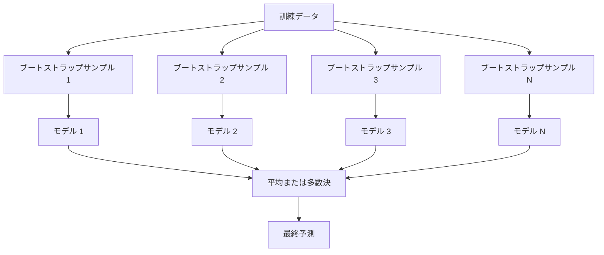
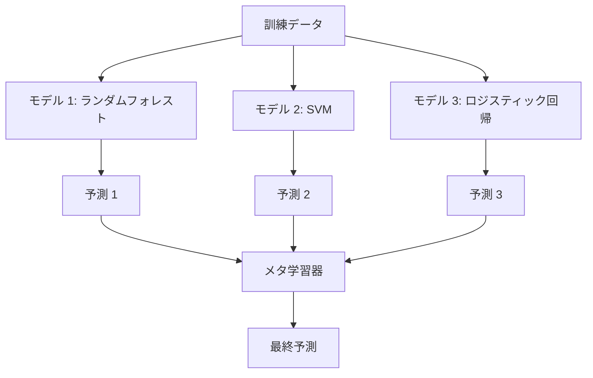

# アンサンブル手法

> 弱い学習器のグループを正しく組み合わせると、強い学習器になる。これは比喩ではなく、定理だ。

**タイプ:** 構築
**言語:** Python
**前提条件:** Phase 2、レッスン10（バイアスと分散のトレードオフ）
**所要時間:** 約120分

## 学習目標

- AdaBoostと勾配ブースティングをスクラッチで実装し、ブースティングがどのように順次バイアスを削減するかを説明できる
- バギングアンサンブルを構築し、相関のないモデルを平均することがバイアスを増やさずに分散を削減することを実証できる
- バギング、ブースティング、スタッキングを、それぞれがターゲットとする誤差成分の観点で比較できる
- アンサンブルの多様性を評価し、より多くの独立した弱い学習器で多数決の精度が向上する理由を説明できる

## 問題

単一の決定木は訓練が速く解釈しやすいが、過学習する。単一の線形モデルは複雑な境界では過小適合する。完璧なモデルアーキテクチャを設計するのに何日も費やすことができる。あるいは、不完全なモデルをたくさん組み合わせて、個別のモデルよりも優れたものを得ることができる。

アンサンブル手法はまさにこれを行う。Kaggleコンペティションで表形式データに勝つための最も信頼できる技術であり、ほとんどの本番MLシステムを支えており、バイアスと分散のトレードオフを実際に示す。バギングは分散を削減する。ブースティングはバイアスを削減する。スタッキングはどの入力でどのモデルを信頼するかを学習する。

## コンセプト

### なぜアンサンブルが機能するか

精度p > 0.5のN個の独立した分類器があるとする。多数決の精度は：

```
P(多数決が正しい) = k > N/2 の sum C(N,k) * p^k * (1-p)^(N-k)
```

それぞれ60%の精度を持つ21個の分類器の場合、多数決の精度は約74%だ。101個の分類器では84%まで上昇する。モデルが異なるミスをすると、誤差は打ち消し合う。

重要な要件は**多様性**だ。すべてのモデルが同じ誤差を犯す場合、組み合わせても何も助けにならない。アンサンブルが多様なモデルを生成する方法：

- 異なる訓練サブセット（バギング）
- 異なる特徴量サブセット（ランダムフォレスト）
- 順次誤差修正（ブースティング）
- 異なるモデルファミリー（スタッキング）

### バギング（Bootstrap Aggregating）

バギングは各モデルを訓練データの異なるブートストラップサンプルで訓練することで多様性を作る。



ブートストラップサンプルは元のデータから復元抽出で、元と同じサイズで引き出す。約63.2%のユニークサンプルが各ブートストラップに現れる。残りの36.8%（バッグ外サンプル）は無料の検証セットを提供する。

バギングはバイアスをあまり増やさずに分散を削減する。個々の木はブートストラップサンプルに過学習するが、過学習は木ごとに異なるので、平均がノイズを打ち消す。

**ランダムフォレスト**はバギングに追加のひねりを加えたものだ：各分割で、ランダムな特徴量のサブセットのみが検討される。これにより木の間にさらに多様性が生まれる。候補特徴量の典型的な数は、分類では`sqrt(n_features)`、回帰では`n_features / 3`だ。

### ブースティング（順次誤差修正）

ブースティングはモデルを順次訓練する。各新しいモデルは前のモデルが間違えた例に焦点を当てる。


ブースティングはバイアスを削減する。各新しいモデルはアンサンブルの系統的誤差を修正する。最終予測はすべてのモデルの加重和であり、より良いモデルが高い重みを得る。

トレードオフ：ブースティングは多くのラウンドを実行すると過学習する可能性がある。なぜならより難しい例に適合し続け、そのいくつかはノイズかもしれないからだ。

### AdaBoost

AdaBoost（適応型ブースティング）は最初の実践的なブースティングアルゴリズムだった。任意の基底学習器、通常は決定木の切り株（深さ1の木）と共に機能する。

アルゴリズム：

```
1. サンプル重みを初期化する: w_i = 1/N（全iに対して）

2. t = 1 から T まで:
   a. 重み付きデータで弱学習器h_tを訓練する
   b. 加重誤差を計算する:
      err_t = sum(w_i * I(h_t(x_i) != y_i)) / sum(w_i)
   c. モデル重みを計算する:
      alpha_t = 0.5 * ln((1 - err_t) / err_t)
   d. サンプル重みを更新する:
      w_i = w_i * exp(-alpha_t * y_i * h_t(x_i))
   e. 重みを1に正規化する

3. 最終予測: H(x) = sign(sum(alpha_t * h_t(x)))
```

誤差が低いモデルは高いalphaを得る。誤分類されたサンプルは高い重みを得るので、次のモデルがそれらに焦点を当てる。

### 勾配ブースティング

勾配ブースティングは任意の損失関数へのブースティングを一般化する。サンプルの重みを付け直す代わりに、各新しいモデルを現在のアンサンブルの残差（損失の負の勾配）に適合させる。

```
1. 初期化: F_0(x) = argmin_c sum(L(y_i, c))

2. t = 1 から T まで:
   a. 擬似残差を計算する:
      r_i = -dL(y_i, F_{t-1}(x_i)) / dF_{t-1}(x_i)
   b. 残差r_iに木h_tを適合させる
   c. 最適なステップサイズを見つける:
      gamma_t = argmin_gamma sum(L(y_i, F_{t-1}(x_i) + gamma * h_t(x_i)))
   d. 更新する:
      F_t(x) = F_{t-1}(x) + learning_rate * gamma_t * h_t(x)

3. 最終予測: F_T(x)
```

二乗誤差損失の場合、擬似残差は実際の残差になる：`r_i = y_i - F_{t-1}(x_i)`。各木は文字通り前のアンサンブルの誤差に適合する。

学習率（縮小）は各木がどれだけ寄与するかを制御する。より小さい学習率はより多くの木を必要とするが、より良く汎化する。典型的な値：0.01から0.3。

### XGBoost: なぜ表形式データで支配的なのか

XGBoost（eXtreme Gradient Boosting）は高速で正確、過学習に強いエンジニアリング最適化を持つ勾配ブースティングだ：

- **正則化された目的関数:** リーフ重みへのL1とL2ペナルティが、個々の木が自信過剰になるのを防ぐ
- **二次近似:** 損失の一階と二階の導関数の両方を使用し、より良い分割決定を与える
- **スパース対応分割:** 各分割で欠損データに対する最良の方向を学習することで欠損値をネイティブに扱う
- **列サブサンプリング:** ランダムフォレストのように、多様性のために各分割で特徴量をサンプリングする
- **加重分位スケッチ:** 分散データの連続特徴量の分割点を効率的に見つける
- **キャッシュ対応ブロック構造:** CPUキャッシュラインに最適化されたメモリレイアウト

表形式データでは、XGBoost（とその後継のLightGBM）は継続的な研究の試みにもかかわらず、一貫してニューラルネットワークを上回る。もしデータが行と列を持つ表に収まるなら、勾配ブースティングから始める。

### スタッキング（メタ学習）

スタッキングは複数のベースモデルの予測をメタ学習器の特徴量として使う。



メタ学習器はどの入力に対してどのベースモデルを信頼するかを学習する。ランダムフォレストが特定の領域でより良く、SVMが別の領域でより良い場合、メタ学習器はそれに応じてルーティングすることを学ぶ。

データリークを避けるため、ベースモデルの予測は訓練セットの交差検証を通じて生成されなければならない。同じデータでベースモデルを訓練してメタ特徴量を生成することはしない。

### 投票

最もシンプルなアンサンブル。予測を直接組み合わせるだけだ。

- **ハード投票:** クラスラベルの多数決。
- **ソフト投票:** 予測確率を平均し、最高の平均確率を持つクラスを選ぶ。通常はより良い。なぜなら信頼度情報を使うからだ。

## 構築

### ステップ1: 決定木の切り株（基底学習器）

`code/ensembles.py` のコードはすべてをスクラッチで実装する。決定木の切り株（単一分割の木）から始める。

```python
class DecisionStump:
    def __init__(self):
        self.feature_idx = None
        self.threshold = None
        self.polarity = 1
        self.alpha = None

    def fit(self, X, y, weights):
        n_samples, n_features = X.shape
        best_error = float("inf")

        for f in range(n_features):
            thresholds = np.unique(X[:, f])
            for thresh in thresholds:
                for polarity in [1, -1]:
                    pred = np.ones(n_samples)
                    pred[polarity * X[:, f] < polarity * thresh] = -1
                    error = np.sum(weights[pred != y])
                    if error < best_error:
                        best_error = error
                        self.feature_idx = f
                        self.threshold = thresh
                        self.polarity = polarity

    def predict(self, X):
        n = X.shape[0]
        pred = np.ones(n)
        idx = self.polarity * X[:, self.feature_idx] < self.polarity * self.threshold
        pred[idx] = -1
        return pred
```

### ステップ2: スクラッチからAdaBoost

```python
class AdaBoostScratch:
    def __init__(self, n_estimators=50):
        self.n_estimators = n_estimators
        self.stumps = []
        self.alphas = []

    def fit(self, X, y):
        n = X.shape[0]
        weights = np.full(n, 1 / n)

        for _ in range(self.n_estimators):
            stump = DecisionStump()
            stump.fit(X, y, weights)
            pred = stump.predict(X)

            err = np.sum(weights[pred != y])
            err = np.clip(err, 1e-10, 1 - 1e-10)

            alpha = 0.5 * np.log((1 - err) / err)
            weights *= np.exp(-alpha * y * pred)
            weights /= weights.sum()

            stump.alpha = alpha
            self.stumps.append(stump)
            self.alphas.append(alpha)

    def predict(self, X):
        total = sum(a * s.predict(X) for a, s in zip(self.alphas, self.stumps))
        return np.sign(total)
```

### ステップ3: スクラッチから勾配ブースティング

```python
class GradientBoostingScratch:
    def __init__(self, n_estimators=100, learning_rate=0.1, max_depth=3):
        self.n_estimators = n_estimators
        self.lr = learning_rate
        self.max_depth = max_depth
        self.trees = []
        self.initial_pred = None

    def fit(self, X, y):
        self.initial_pred = np.mean(y)
        current_pred = np.full(len(y), self.initial_pred)

        for _ in range(self.n_estimators):
            residuals = y - current_pred
            tree = SimpleRegressionTree(max_depth=self.max_depth)
            tree.fit(X, residuals)
            update = tree.predict(X)
            current_pred += self.lr * update
            self.trees.append(tree)

    def predict(self, X):
        pred = np.full(X.shape[0], self.initial_pred)
        for tree in self.trees:
            pred += self.lr * tree.predict(X)
        return pred
```

### ステップ4: sklearnと比較する

コードは、スクラッチからの実装がsklearnの `AdaBoostClassifier` と `GradientBoostingClassifier` と同様の精度を生成することを確認し、すべての手法を並べて比較する。

## 活用

### 各手法をいつ使うか

| 手法 | 削減するもの | 最適な用途 | 注意点 |
|------|------------|-----------|--------|
| バギング / ランダムフォレスト | 分散 | ノイズの多いデータ、多くの特徴量 | バイアスの改善には役立たない |
| AdaBoost | バイアス | クリーンなデータ、単純な基底学習器 | 外れ値とノイズに敏感 |
| 勾配ブースティング | バイアス | 表形式データ、コンペ | 訓練が遅く、調整なしで過学習しやすい |
| XGBoost / LightGBM | 両方 | 本番の表形式ML | 多くのハイパーパラメータ |
| スタッキング | 両方 | 最後の1〜2%の精度を得る | 複雑で、メタ学習器の過学習リスクがある |
| 投票 | 分散 | 多様なモデルの迅速な組み合わせ | モデルが多様な場合にのみ役立つ |

### 表形式データの本番スタック

ほとんどの表形式予測問題では、試す順序：

1. デフォルトパラメータで **LightGBM または XGBoost**
2. n_estimators、learning_rate、max_depth、min_child_weightを調整する
3. 最後の0.5%が必要な場合、3〜5個の多様なモデルでスタッキングアンサンブルを構築する
4. 全体を通じて交差検証を使う

表形式データのニューラルネットワークは、継続的な研究の試みにもかかわらず、ほぼ常に勾配ブースティングより悪い。TabNet、NODE、および同様のアーキテクチャは時々匹敵するが、適切に調整されたXGBoostを上回ることはほとんどない。

## Ship It

このレッスンは `outputs/prompt-ensemble-selector.md` を生成する -- 特定のデータセットに対して適切なアンサンブル手法を選ぶのに役立つプロンプト。データ（サイズ、特徴量の種類、ノイズレベル、クラスバランス）と解決しようとしている問題を説明する。プロンプトは決定チェックリストを案内し、手法を推奨し、開始ハイパーパラメータを提案し、その手法のよくある間違いについて警告する。また `outputs/skill-ensemble-builder.md` に完全な選択ガイドを生成する。

## 演習

1. AdaBoostの実装を修正して、各ラウンド後の訓練精度を追跡する。精度と推定器数をプロットする。いつ収束するか？

2. 回帰木にランダムな特徴量サブサンプリングを追加することでスクラッチからランダムフォレストを実装する。`max_features=sqrt(n_features)` で100本の木を訓練し、予測を平均する。単一の木と比較して分散の削減を確認する。

3. 勾配ブースティングの実装に早期停止を追加する：各ラウンド後に検証損失を追跡し、10連続ラウンドで改善がない場合に停止する。実際には何本の木が必要か？

4. 3つのベースモデル（ロジスティック回帰、決定木、k最近傍）とロジスティック回帰のメタ学習器でスタッキングアンサンブルを構築する。メタ特徴量を生成するために5分割交差検証を使う。各ベースモデル単独と比較する。

5. 同じデータセットでデフォルトパラメータを使ってXGBoostを実行する。スクラッチからの勾配ブースティングと精度を比較する。両方の時間を計測する。速度の差はどれくらいか？

## 用語集

| 用語 | よく言われること | 実際の意味 |
|------|----------------|----------------------|
| バギング | 「ランダムなサブセットで訓練する」 | ブートストラップ集約：ブートストラップサンプルでモデルを訓練し、分散を削減するために予測を平均する |
| ブースティング | 「難しい例に焦点を当てる」 | バイアスを削減するために、各モデルがアンサンブルの誤差を修正しながらモデルを順次訓練する |
| AdaBoost | 「データを再重み付けする」 | サンプル重み更新によるブースティング；誤分類された点は次の学習器でより高い重みを得る |
| 勾配ブースティング | 「残差に適合する」 | 各新しいモデルを損失関数の負の勾配に適合させることでブースティング |
| XGBoost | 「Kaggleの武器」 | 正則化、二次最適化、システムレベルの速度トリックを持つ勾配ブースティング |
| スタッキング | 「モデルの上のモデル」 | ベースモデルの予測をメタ学習器の入力特徴量として使う |
| ランダムフォレスト | 「多くのランダム化された木」 | 多様性のために各分割でランダムな特徴量サブサンプリングを追加した決定木によるバギング |
| アンサンブルの多様性 | 「異なるミスをする」 | アンサンブルが個別のモデルを上回るために、モデルが誤差において無相関でなければならない |
| バッグ外誤差 | 「無料の検証」 | ブートストラップ抽出に含まれないサンプル（約36.8%）がホールドアウトなしで検証セットとして機能する |

## 参考文献

- [Schapire & Freund: Boosting: Foundations and Algorithms](https://mitpress.mit.edu/9780262526036/) -- AdaBoostの作者による本
- [Friedman: Greedy Function Approximation: A Gradient Boosting Machine (2001)](https://statweb.stanford.edu/~jhf/ftp/trebst.pdf) -- 元の勾配ブースティング論文
- [Chen & Guestrin: XGBoost (2016)](https://arxiv.org/abs/1603.02754) -- XGBoost論文
- [Wolpert: Stacked Generalization (1992)](https://www.sciencedirect.com/science/article/abs/pii/S0893608005800231) -- 元のスタッキング論文
- [scikit-learn アンサンブル手法](https://scikit-learn.org/stable/modules/ensemble.html) -- 実践的なリファレンス
