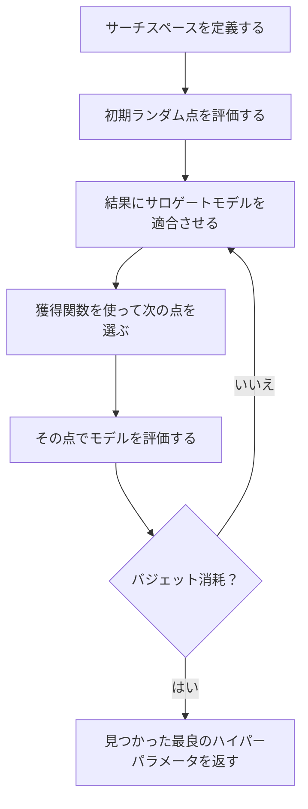
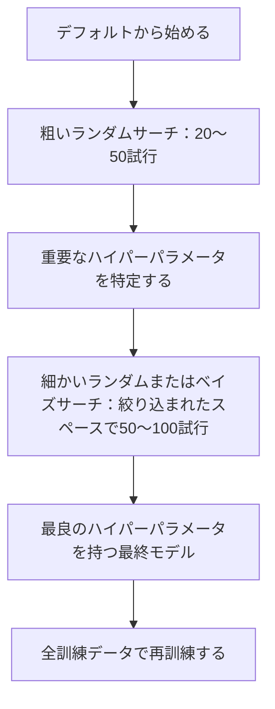
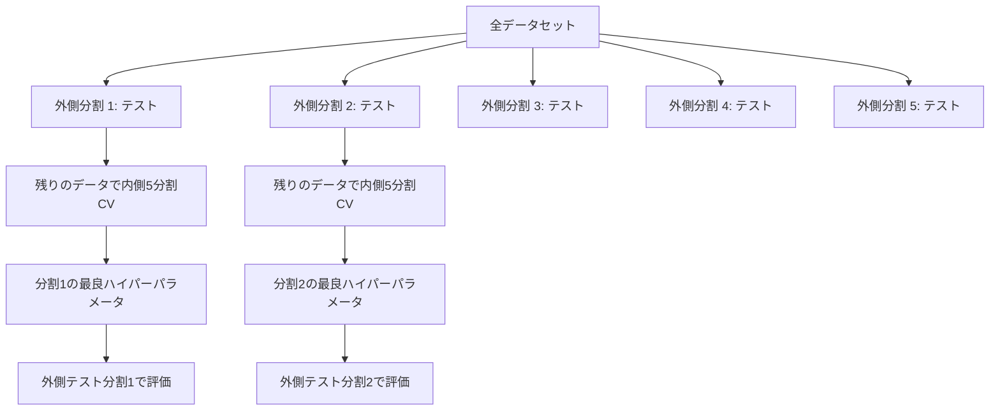

# ハイパーパラメータ調整

> ハイパーパラメータは訓練開始前に回すノブだ。うまく回すことが、平凡なモデルと優れたモデルの違いだ。

**タイプ:** 構築
**言語:** Python
**前提条件:** Phase 2、レッスン11（アンサンブル手法）
**所要時間:** 約90分

## 学習目標

- グリッドサーチ、ランダムサーチ、ベイズ最適化をスクラッチで実装し、サンプル効率を比較できる
- 多くのハイパーパラメータの有効次元が低い場合、ランダムサーチがグリッドサーチを上回る理由を説明できる
- サロゲートモデルと獲得関数を使ったベイズ最適化ループを構築し、サーチをガイドできる
- 適切な交差検証を通じて検証セットへの過学習を避けるハイパーパラメータ調整戦略を設計できる

## 問題

勾配ブースティングモデルには学習率、木の数、最大深度、リーフあたりの最小サンプル数、サブサンプル比率、カラムサンプル比率がある。それで6つのハイパーパラメータだ。それぞれが5つの合理的な値を持つ場合、グリッドは5^6=15,625の組み合わせになる。各訓練に10秒かかる。すべて試すのに43時間の計算が必要だ。

グリッドサーチは明白なアプローチであり、規模に応じた最悪のアプローチだ。ランダムサーチはより少ない計算でより良い結果を出す。ベイズ最適化は過去の評価から学ぶことでさらに良い結果を出す。どの戦略を使うべきか、そしてどのハイパーパラメータが実際に重要かを知ることで、何日もの無駄なGPU時間を節約できる。

## コンセプト

### パラメータとハイパーパラメータ

パラメータは訓練中に学習される（重み、バイアス、分割閾値）。ハイパーパラメータは訓練開始前に設定され、学習がどのように行われるかを制御する。

| ハイパーパラメータ | 制御するもの | 典型的な範囲 |
|-----------------|------------|------------|
| 学習率 | 更新あたりのステップサイズ | 0.001から1.0 |
| 木の数/エポック数 | 訓練期間 | 10から10,000 |
| 最大深度 | モデルの複雑度 | 1から30 |
| 正則化（ラムダ） | 過学習防止 | 0.0001から100 |
| バッチサイズ | 勾配推定ノイズ | 16から512 |
| ドロップアウト率 | ドロップされるニューロンの割合 | 0.0から0.5 |

### グリッドサーチ

グリッドサーチは指定された値のすべての組み合わせを評価する。網羅的で理解しやすいが、ハイパーパラメータの数に応じて指数関数的にスケールする。

```
2つのハイパーパラメータのグリッド：

  learning_rate: [0.01, 0.1, 1.0]
  max_depth:     [3, 5, 7]

  評価数: 3 x 3 = 9組み合わせ

  (0.01, 3)  (0.01, 5)  (0.01, 7)
  (0.1,  3)  (0.1,  5)  (0.1,  7)
  (1.0,  3)  (1.0,  5)  (1.0,  7)
```

グリッドサーチには根本的な欠陥がある：1つのハイパーパラメータが重要で、もう1つが重要でない場合、ほとんどの評価が無駄になる。9回の評価から重要なパラメータの値は3つしか得られない。

### ランダムサーチ

ランダムサーチはグリッドの代わりに分布からハイパーパラメータをサンプリングする。同じ9回の評価のバジェットで、各ハイパーパラメータの9つのユニークな値が得られる。


ランダムがグリッドを上回る理由（Bergstra & Bengio, 2012）：

- ほとんどのハイパーパラメータの有効次元が低い。通常、特定の問題では6個中1〜2個のハイパーパラメータのみが重要だ。
- グリッドサーチは重要でない次元で評価を無駄にする。
- ランダムサーチは同じバジェットで重要な次元をより密にカバーする。
- 60回のランダム試行で、（サーチスペースに存在する場合）最適の5%以内の点を見つける95%の確率がある。

### ベイズ最適化

ランダムサーチは結果を無視する。高い学習率が発散を引き起こすことや、深さ3が深さ10より一貫して優れていることを学習しない。ベイズ最適化は過去の評価を使って次にどこを探すかを決める。



2つの重要なコンポーネント：

**サロゲートモデル:** 高コストな目的関数を近似する安価に評価できるモデル（通常はガウス過程）。サーチスペース内のどの点でも予測と不確実性の推定の両方を与える。

**獲得関数:** 探索（既知の良い点の近くを探す）と発見（不確実性が高い場所を探す）のバランスを取ることで、次にどこを評価するかを決める。一般的な選択肢：

- **期待改善（EI）:** この点での現在のベストに対してどれくらいの改善が期待できるか？
- **上限信頼バウンド（UCB）:** 予測に不確実性の倍数を加えたもの。UCBが高いほど有望または未探索。
- **改善確率（PI）:** この点が現在のベストを上回る確率は何か？

ベイズ最適化は通常、2〜5倍少ない評価でランダムサーチより良いハイパーパラメータを見つける。サロゲートモデルを適合させるオーバーヘッドは、実際のモデルを訓練することに比べて無視できる。

### 早期停止

すべての訓練実行が終了する必要はない。設定が10エポック後に明らかに悪い場合、停止して先に進む。これがハイパーパラメータサーチの文脈での早期停止だ。

戦略：
- **忍耐ベース:** 検証損失がN連続エポックで改善しない場合に停止する
- **中央値刈り取り:** 同じステップでの完了した試行の中央値より試行の中間結果が悪い場合に停止する
- **Hyperband:** 多くの設定に小さなバジェットを割り当て、最良のものにプログレッシブにバジェットを増やす

Hyperbandは特に効果的だ。81の設定を各1エポックで開始し、上位3分の1を保持し、3エポック与え、上位3分の1を保持し、続ける。これにより、全バジェットで全設定を評価するより10〜50倍速く良い設定を見つける。

### 学習率スケジューラ

学習率はほぼ常に最も重要なハイパーパラメータだ。固定に保つ代わりに、スケジューラは訓練中に調整する。

| スケジューラ | 式 | 使用する場合 |
|------------|---|------------|
| ステップ減衰 | Nエポックごとに0.1を掛ける | 古典的CNN訓練 |
| コサインアニーリング | lr * 0.5 * (1 + cos(pi * t / T)) | 現代のデフォルト |
| ウォームアップ＋減衰 | 線形増加後コサイン減衰 | トランスフォーマー |
| ワンサイクル | 1サイクルで増加後減少 | 高速収束 |
| プラトーで削減 | 指標が停滞したときに係数で削減 | 安全なデフォルト |

### ハイパーパラメータの重要性

すべてのハイパーパラメータが同等に重要ではない。ランダムフォレスト（Probst et al., 2019）と勾配ブースティングの研究では一貫したパターンが示されている：

**高い重要性：**
- 学習率（常に最初に調整する）
- 推定器数/エポック数（調整の代わりに早期停止を使う）
- 正則化強度

**中程度の重要性：**
- 最大深度/層の数
- リーフあたりの最小サンプル数/重み減衰
- サブサンプル比率

**低い重要性：**
- 最大特徴量（ランダムフォレストの場合）
- 特定の活性化関数の選択
- バッチサイズ（合理的な範囲内）

重要なものを最初に調整し、残りはデフォルトのままにする。

### 実践的な戦略



具体的なワークフロー：

1. **ライブラリのデフォルトから始める。** これらは経験豊富な実践者によって選ばれており、しばしば80%の到達点にある。
2. **粗いランダムサーチ。** 広い範囲、20〜50試行。早期停止を使って悪い実行を素早く終わらせる。
3. **結果を分析する。** どのハイパーパラメータが性能と相関しているか？サーチスペースを絞り込む。
4. **細かいサーチ。** 絞り込まれたスペースでのベイズ最適化または集中型ランダムサーチ。50〜100試行。
5. **見つかった最良のハイパーパラメータで全訓練データで再訓練する。**

### 交差検証との統合

単一の検証分割でハイパーパラメータを調整することはリスクがある。最良のハイパーパラメータが特定の検証分割に過学習するかもしれない。ネストされた交差検証はこれを2つのループを使って解決する：

- **外側ループ**（評価）：データを訓練+検証とテストに分割する。偏りのない性能を報告する。
- **内側ループ**（調整）：訓練+検証を訓練と検証に分割する。最良のハイパーパラメータを見つける。



各外側分割は独立して独自の最良ハイパーパラメータを見つける。外側スコアは汎化性能の偏りのない推定値だ。

sklearnで：

```python
from sklearn.model_selection import cross_val_score, GridSearchCV
from sklearn.ensemble import GradientBoostingRegressor

inner_cv = GridSearchCV(
    GradientBoostingRegressor(),
    param_grid={
        "learning_rate": [0.01, 0.05, 0.1],
        "max_depth": [2, 3, 5],
        "n_estimators": [50, 100, 200],
    },
    cv=5,
    scoring="neg_mean_squared_error",
)

outer_scores = cross_val_score(
    inner_cv, X, y, cv=5, scoring="neg_mean_squared_error"
)

print(f"ネスト化CV MSE: {-outer_scores.mean():.4f} +/- {outer_scores.std():.4f}")
```

これはコスト高だ（5つの外側分割 × 5つの内側分割 × 27グリッドポイント = 675モデル適合）が、信頼性の高い性能推定を与える。論文での最終結果を報告するとき、または意思決定の賭けが高いときに使う。

### 実践的なヒント

**学習率から始める。** 勾配ベースの手法では常に最も重要なハイパーパラメータだ。悪い学習率は他のすべてを無意味にする。他のハイパーパラメータをデフォルトに固定し、まず学習率をスイープする。

**学習率と正則化にはlog-uniform分布を使う。** 0.001と0.01の違いは0.1と1.0の違いと同じくらい重要だ。線形で探索すると大きい端でバジェットを無駄にする。

**n_estimatorsの調整の代わりに早期停止を使う。** ブースティングとニューラルネットワークでは、n_estimatorsまたはエポックを高く設定し、早期停止がいつ停止するかを決めさせる。これによりサーチから1つのハイパーパラメータが除去される。

**バジェット配分。** 調整バジェットの60%を最も重要な2つのハイパーパラメータに費やす。残りの40%はすべてに費やす。上位2つが性能変動のほとんどを占める。

**スケールが重要だ。** バッチサイズは決してlog scaleで探索しない（16、32、64で十分）。学習率は常にlog scaleで探索する。ハイパーパラメータがモデルにどう影響するかに合わせてサーチ分布を一致させる。

| モデルタイプ | 主要ハイパーパラメータ | 推奨サーチ | バジェット |
|------------|---------------------|---------|----------|
| ランダムフォレスト | n_estimators、max_depth、min_samples_leaf | ランダムサーチ、50試行 | 低（訓練が速い） |
| 勾配ブースティング | learning_rate、n_estimators、max_depth | ベイズ、100試行＋早期停止 | 中 |
| ニューラルネットワーク | learning_rate、weight_decay、batch_size | ベイズまたはランダム、100+試行 | 高（訓練が遅い） |
| SVM | C、gamma（RBFカーネル） | log scaleのグリッド、25〜50試行 | 低（2パラメータ） |
| ラッソ/リッジ | alpha | log scaleの1D探索、20試行 | 非常に低 |
| XGBoost | learning_rate、max_depth、subsample、colsample | ベイズ、100〜200試行＋早期停止 | 中 |

**迷ったとき：** ハイパーパラメータ数の2倍の試行でランダムサーチ（例：6ハイパーパラメータ = 最低12+試行）。慎重に設計されたグリッドサーチを50試行のランダムサーチが上回ることに驚くだろう。

## 構築

### ステップ1: スクラッチからグリッドサーチ

`code/tuning.py` のコードはグリッドサーチ、ランダムサーチ、シンプルなベイズオプティマイザをスクラッチで実装する。

```python
def grid_search(model_fn, param_grid, X_train, y_train, X_val, y_val):
    keys = list(param_grid.keys())
    values = list(param_grid.values())
    best_score = -float("inf")
    best_params = None
    n_evals = 0

    for combo in itertools.product(*values):
        params = dict(zip(keys, combo))
        model = model_fn(**params)
        model.fit(X_train, y_train)
        score = evaluate(model, X_val, y_val)
        n_evals += 1

        if score > best_score:
            best_score = score
            best_params = params

    return best_params, best_score, n_evals
```

### ステップ2: スクラッチからランダムサーチ

```python
def random_search(model_fn, param_distributions, X_train, y_train,
                  X_val, y_val, n_iter=50, seed=42):
    rng = np.random.RandomState(seed)
    best_score = -float("inf")
    best_params = None

    for _ in range(n_iter):
        params = {k: sample(v, rng) for k, v in param_distributions.items()}
        model = model_fn(**params)
        model.fit(X_train, y_train)
        score = evaluate(model, X_val, y_val)

        if score > best_score:
            best_score = score
            best_params = params

    return best_params, best_score, n_iter
```

### ステップ3: ベイズ最適化（簡略版）

コアアイデア：観測された（ハイパーパラメータ、スコア）ペアにガウス過程を適合させ、次にどこを見るかを決める獲得関数を使う。

```python
class SimpleBayesianOptimizer:
    def __init__(self, search_space, n_initial=5):
        self.search_space = search_space
        self.n_initial = n_initial
        self.X_observed = []
        self.y_observed = []

    def _kernel(self, x1, x2, length_scale=1.0):
        dists = np.sum((x1[:, None, :] - x2[None, :, :]) ** 2, axis=2)
        return np.exp(-0.5 * dists / length_scale ** 2)

    def _fit_gp(self, X_new):
        X_obs = np.array(self.X_observed)
        y_obs = np.array(self.y_observed)
        y_mean = y_obs.mean()
        y_centered = y_obs - y_mean

        K = self._kernel(X_obs, X_obs) + 1e-4 * np.eye(len(X_obs))
        K_star = self._kernel(X_new, X_obs)

        L = np.linalg.cholesky(K)
        alpha = np.linalg.solve(L.T, np.linalg.solve(L, y_centered))
        mu = K_star @ alpha + y_mean

        v = np.linalg.solve(L, K_star.T)
        var = 1.0 - np.sum(v ** 2, axis=0)
        var = np.maximum(var, 1e-6)

        return mu, var

    def _expected_improvement(self, mu, var, best_y):
        sigma = np.sqrt(var)
        z = (mu - best_y) / (sigma + 1e-10)
        ei = sigma * (z * norm_cdf(z) + norm_pdf(z))
        return ei

    def suggest(self):
        if len(self.X_observed) < self.n_initial:
            return sample_random(self.search_space)

        candidates = [sample_random(self.search_space) for _ in range(500)]
        X_cand = np.array([to_vector(c) for c in candidates])
        mu, var = self._fit_gp(X_cand)
        ei = self._expected_improvement(mu, var, max(self.y_observed))
        return candidates[np.argmax(ei)]

    def observe(self, params, score):
        self.X_observed.append(to_vector(params))
        self.y_observed.append(score)
```

GPサロゲートは各候補点で2つのことを与える：予測スコア（mu）と不確実性（var）。期待改善はこれらをバランスさせる：モデルが高いスコアを予測する点、または不確実性が高い点を好む。最初は、ほとんどの点の不確実性が高いのでオプティマイザが探索する。後では、最も有望な領域に集中する。

### ステップ4: すべての手法を比較する

同じ合成目的関数で3つの手法すべてを実行して比較する。この比較は各オプティマイザを直接目的関数で呼び出す簡略化されたラッパーを使う（モデル訓練なし）ので、APIは上記のモデルベースの実装とは異なる：

```python
def synthetic_objective(params):
    lr = params["learning_rate"]
    depth = params["max_depth"]
    return -(np.log10(lr) + 2) ** 2 - (depth - 4) ** 2 + 10

param_grid = {
    "learning_rate": [0.001, 0.01, 0.1, 1.0],
    "max_depth": [2, 3, 4, 5, 6, 7, 8],
}

grid_best = None
grid_score = -float("inf")
grid_history = []
for combo in itertools.product(*param_grid.values()):
    params = dict(zip(param_grid.keys(), combo))
    score = synthetic_objective(params)
    grid_history.append((params, score))
    if score > grid_score:
        grid_score = score
        grid_best = params

param_dist = {
    "learning_rate": ("log_float", 0.001, 1.0),
    "max_depth": ("int", 2, 8),
}

rand_best = None
rand_score = -float("inf")
rand_history = []
rng = np.random.RandomState(42)
for _ in range(28):
    params = {k: sample(v, rng) for k, v in param_dist.items()}
    score = synthetic_objective(params)
    rand_history.append((params, score))
    if score > rand_score:
        rand_score = score
        rand_best = params

optimizer = SimpleBayesianOptimizer(param_dist, n_initial=5)
bayes_history = []
for _ in range(28):
    params = optimizer.suggest()
    score = synthetic_objective(params)
    optimizer.observe(params, score)
    bayes_history.append((params, score))
bayes_score = max(s for _, s in bayes_history)

print(f"{'手法':<20} {'最良スコア':>12} {'評価回数':>12}")
print("-" * 50)
print(f"{'グリッドサーチ':<20} {grid_score:>12.4f} {len(grid_history):>12}")
print(f"{'ランダムサーチ':<20} {rand_score:>12.4f} {len(rand_history):>12}")
print(f"{'ベイズ最適化':<20} {bayes_score:>12.4f} {len(bayes_history):>12}")
```

同じバジェットで、ベイズ最適化は通常最も速く最良のスコアを見つける。なぜなら明らかに悪い領域で評価を無駄にしないからだ。ランダムサーチはグリッドサーチより広くカバーする。グリッドサーチはハイパーパラメータが非常に少なく網羅的にできる場合にのみ勝つ。

## 活用

### 実践でのOptuna

Optunaはシリアスなハイパーパラメータ調整に推奨されるライブラリだ。刈り取り、分散サーチ、可視化をすぐに使える。

```python
import optuna

def objective(trial):
    lr = trial.suggest_float("learning_rate", 1e-4, 1e-1, log=True)
    n_est = trial.suggest_int("n_estimators", 50, 500)
    max_depth = trial.suggest_int("max_depth", 2, 10)

    model = GradientBoostingRegressor(
        learning_rate=lr,
        n_estimators=n_est,
        max_depth=max_depth,
    )
    model.fit(X_train, y_train)
    return mean_squared_error(y_val, model.predict(X_val))

study = optuna.create_study(direction="minimize")
study.optimize(objective, n_trials=100)

print(f"最良パラメータ: {study.best_params}")
print(f"最良MSE: {study.best_value:.4f}")
```

主要なOptunaの機能：
- `suggest_float(..., log=True)` はlog scaleで最もよく探索されるパラメータに使う（学習率、正則化）
- `suggest_int` は整数パラメータに使う
- `suggest_categorical` は離散的な選択に使う
- 悪い試行の早期停止のための組み込みMedianPruner
- 分析のための `study.trials_dataframe()`

### Optunaと刈り取り

刈り取りは有望でない試行を早期に停止し、大規模な計算を節約する。以下のパターン：

```python
import optuna
from sklearn.model_selection import cross_val_score

def objective(trial):
    params = {
        "learning_rate": trial.suggest_float("lr", 1e-4, 0.5, log=True),
        "max_depth": trial.suggest_int("max_depth", 2, 10),
        "n_estimators": trial.suggest_int("n_estimators", 50, 500),
        "subsample": trial.suggest_float("subsample", 0.5, 1.0),
    }

    model = GradientBoostingRegressor(**params)
    scores = cross_val_score(model, X_train, y_train, cv=3,
                             scoring="neg_mean_squared_error")
    mean_score = -scores.mean()

    trial.report(mean_score, step=0)
    if trial.should_prune():
        raise optuna.TrialPruned()

    return mean_score

pruner = optuna.pruners.MedianPruner(n_startup_trials=10, n_warmup_steps=5)
study = optuna.create_study(direction="minimize", pruner=pruner)
study.optimize(objective, n_trials=200)
```

`MedianPruner` は同じステップで完了したすべての試行の中央値より中間値が悪い場合に試行を停止する。刈り取りには中間指標を報告する `trial.report()` と試行を停止すべきかチェックする `trial.should_prune()` の呼び出しが必要だ。`n_startup_trials=10` は刈り取りが始まる前に少なくとも10試行が完全に完了することを保証する。これにより通常、計算の40〜60%が節約される。

### sklearnの組み込みチューナー

クイックな実験のために、sklearnは `GridSearchCV`、`RandomizedSearchCV`、`HalvingRandomSearchCV` を提供する：

```python
from sklearn.model_selection import RandomizedSearchCV
from scipy.stats import loguniform, randint

param_dist = {
    "learning_rate": loguniform(1e-4, 0.5),
    "max_depth": randint(2, 10),
    "n_estimators": randint(50, 500),
}

search = RandomizedSearchCV(
    GradientBoostingRegressor(),
    param_dist,
    n_iter=100,
    cv=5,
    scoring="neg_mean_squared_error",
    random_state=42,
    n_jobs=-1,
)
search.fit(X_train, y_train)
print(f"最良パラメータ: {search.best_params_}")
print(f"最良CV MSE: {-search.best_score_:.4f}")
```

学習率と正則化には `scipy` の `loguniform` を使う。整数ハイパーパラメータには `randint` を使う。`n_jobs=-1` フラグはすべてのCPUコアに並列化する。

### ハイパーパラメータ調整のよくある間違い

**前処理によるデータリーク。** 交差検証の前に全データセットでスケーラーを適合させると、検証分割からの情報が訓練に漏れる。前処理は訓練分割のみに適合されるよう、常に `Pipeline` 内に入れる。

**検証セットへの過学習。** 何千もの試行を実行することは、実質的に検証セットで訓練することになる。最終的な性能推定のためにネストされた交差検証を使うか、調整中は決して触れない別のテストセットを保持する。

**探索範囲が狭すぎる。** 最良値がサーチスペースの境界にある場合、十分に広く探索していない。最適値が範囲外にある可能性がある。最良パラメータが端にないか常に確認する。

**相互作用効果を無視する。** 学習率と推定器数はブースティングで強く相互作用する。低い学習率はより多くの推定器を必要とする。独立して調整するより一緒に調整する方が良い結果が得られる。

**反復モデルで早期停止を使わない。** 勾配ブースティングとニューラルネットワークでは、n_estimatorsまたはエポックを高い値に設定して早期停止を使う。これはイテレーション数をハイパーパラメータとして調整するよりも厳密に優れている。

## 演習

1. 同じ総バジェット（例：50評価）でグリッドサーチとランダムサーチを実行する。見つかった最良スコアを比較する。異なるシードで10回実験を実行する。ランダムサーチはどれくらいの頻度で勝つか？

2. スクラッチからHyperbandを実装する。81の設定を各1エポックで開始し、各ラウンドで上位3分の1を保持し、バジェットを3倍にする。全設定を全バジェットで実行した場合と比較した総計算量（全設定の全エポックの合計）を比較する。

3. レッスン11の勾配ブースティング実装に学習率スケジューラ（コサインアニーリング）を追加する。固定学習率と比較して役立つか？

4. Optunaを使ってsklearnの乳がんデータセットなどの実際のデータセットでRandomForestClassifierを調整する。`optuna.visualization.plot_param_importances(study)` を使ってどのハイパーパラメータが最も重要かを確認する。このレッスンの重要度ランキングと一致しているか？

5. シンプルな獲得関数（期待改善）を実装し、探索対活用を示す。サロゲートモデルの平均と不確実性をプロットし、EIが次にどこを評価するかを選択することを示す。

## 用語集

| 用語 | よく言われること | 実際の意味 |
|------|----------------|----------------------|
| ハイパーパラメータ | 「選択する設定」 | 訓練前に設定され学習プロセスを制御する値。データから学習されない |
| グリッドサーチ | 「すべての組み合わせを試す」 | 指定されたパラメータグリッドの網羅的探索。指数関数的なコスト。 |
| ランダムサーチ | 「ランダムにサンプリングするだけ」 | 分布からハイパーパラメータをサンプリング。グリッドサーチより重要な次元をよりカバーする。 |
| ベイズ最適化 | 「賢いサーチ」 | 目的のサロゲートモデルを使って次にどこを評価するかを決め、探索と活用のバランスを取る |
| サロゲートモデル | 「安価な近似」 | 観測された評価から高コストな目的関数を近似するモデル（通常ガウス過程） |
| 獲得関数 | 「次にどこを見るか」 | 期待改善と不確実性のバランスを取って候補点をスコアリングする。EIとUCBが一般的な選択 |
| 早期停止 | 「時間を無駄にするな」 | 検証性能の改善が止まったら早期に訓練を終了する |
| Hyperband | 「設定のトーナメント」 | 適応的リソース割り当て：小さなバジェットで多くの設定を開始し、最良のものを保持してバジェットを増やす |
| 学習率スケジューラ | 「訓練中にlrを変更する」 | より良い収束のために訓練の過程で学習率を調整する関数 |

## 参考文献

- [Bergstra & Bengio: Random Search for Hyper-Parameter Optimization (2012)](https://jmlr.org/papers/v13/bergstra12a.html) -- ランダムがグリッドを上回ることを示した論文
- [Snoek et al., Practical Bayesian Optimization of Machine Learning Algorithms (2012)](https://arxiv.org/abs/1206.2944) -- MLのベイズ最適化
- [Li et al., Hyperband: A Novel Bandit-Based Approach (2018)](https://jmlr.org/papers/v18/16-558.html) -- Hyperband論文
- [Optuna: A Next-generation Hyperparameter Optimization Framework](https://arxiv.org/abs/1907.10902) -- Optuna論文
- [Probst et al., Tunability: Importance of Hyperparameters (2019)](https://jmlr.org/papers/v20/18-444.html) -- どのハイパーパラメータが重要か
