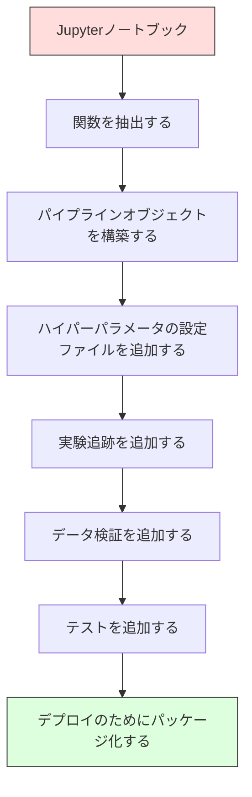

# MLパイプライン

> モデルは製品ではない。パイプラインが製品だ。パイプラインとは生のデータからデプロイされた予測まですべてのことであり、すべてのステップが再現可能でなければならない。

**タイプ:** 構築
**言語:** Python
**前提条件:** Phase 2、レッスン12（ハイパーパラメータ調整）
**所要時間:** 約120分

## 学習目標

- 欠損値補完、スケーリング、エンコーディング、モデル訓練を単一の再現可能なオブジェクトにチェーンするMLパイプラインをスクラッチで構築できる
- データリークのシナリオを特定し、パイプラインがどのようにトランスフォーマーを訓練データのみに適合させることでそれを防ぐかを説明できる
- 数値特徴量とカテゴリカル特徴量に異なる前処理を適用するColumnTransformerを構築できる
- パイプラインのシリアル化を実装し、同じ適合されたパイプラインが訓練と本番で同一の結果を生成することを実証できる

## 問題

データを読み込み、欠損値を中央値で埋め、特徴量をスケーリングし、モデルを訓練し、精度を印刷するノートブックがある。機能する。リリースする。

1ヶ月後、誰かがモデルを再訓練し、異なる結果を得る。中央値はテストデータを含む全データセットで計算された（データリーク）。スケーリングパラメータが保存されなかったため、推論で異なる統計を使っている。特徴量エンジニアリングコードが訓練とサービング間でコピーペーストされ、コピーが乖離した。本番環境のカテゴリカル列がエンコーダが一度も見たことのない新しい値を獲得した。

これらは仮定の話ではない。本番MLシステムが失敗する最も一般的な理由だ。パイプラインはすべての変換ステップを単一の順序付けられた再現可能なオブジェクトにパッケージングすることでこれらすべてを解決する。

## コンセプト

### パイプラインとは何か

パイプラインはモデルに続くデータ変換の順序付けられたシーケンスだ。各ステップは前のステップの出力を入力として受け取る。パイプライン全体は訓練データで一度適合される。推論時には、同じ適合されたパイプラインが新しいデータを変換し、予測を生成する。


パイプラインが保証すること：
- 変換は訓練データのみに適合される（リークなし）
- 推論時に同じ変換が適用される
- オブジェクト全体を1つのアーティファクトとしてシリアル化してデプロイできる
- 交差検証はパイプラインを分割ごとに適用し、微妙なリークを防ぐ

### データリーク：静かなキラー

データリークはテストセットまたは将来のデータからの情報が訓練を汚染するときに発生する。パイプラインは最も一般的な形式を防ぐ。

**リーク（間違い）：**
```python
X = df.drop("target", axis=1)
y = df["target"]

scaler = StandardScaler()
X_scaled = scaler.fit_transform(X)

X_train, X_test = X_scaled[:800], X_scaled[800:]
y_train, y_test = y[:800], y[800:]
```

スケーラーはテストデータを見た。平均と標準偏差にはテストサンプルが含まれる。これにより精度の推定が膨らむ。

**正しい：**
```python
X_train, X_test = X[:800], X[800:]

scaler = StandardScaler()
X_train_scaled = scaler.fit_transform(X_train)
X_test_scaled = scaler.transform(X_test)
```

パイプラインを使えば、これについて考える必要はない。パイプラインが自動的に処理する。

### sklearnパイプライン

sklearnの `Pipeline` はトランスフォーマーと推定器をチェーンする。すべてのステップを順に適用する `.fit()`、`.predict()`、`.score()` を公開する。

```python
from sklearn.pipeline import Pipeline
from sklearn.preprocessing import StandardScaler
from sklearn.linear_model import LogisticRegression

pipe = Pipeline([
    ("scaler", StandardScaler()),
    ("model", LogisticRegression()),
])

pipe.fit(X_train, y_train)
predictions = pipe.predict(X_test)
```

`pipe.fit(X_train, y_train)` を呼び出すと：
1. スケーラーはX_trainに `fit_transform` を呼び出す
2. モデルはスケーリングされたX_trainに `fit` を呼び出す

`pipe.predict(X_test)` を呼び出すと：
1. スケーラーはX_testに `transform`（fit_transformではない）を呼び出す
2. モデルはスケーリングされたX_testに `predict` を呼び出す

スケーラーは適合中にテストデータを見ない。これが全体のポイントだ。

### ColumnTransformer: 列ごとに異なるパイプライン

実際のデータセットには異なる前処理が必要な数値列とカテゴリカル列がある。`ColumnTransformer` がこれを処理する。

```python
from sklearn.compose import ColumnTransformer
from sklearn.preprocessing import StandardScaler, OneHotEncoder
from sklearn.impute import SimpleImputer

numeric_pipe = Pipeline([
    ("impute", SimpleImputer(strategy="median")),
    ("scale", StandardScaler()),
])

categorical_pipe = Pipeline([
    ("impute", SimpleImputer(strategy="most_frequent")),
    ("encode", OneHotEncoder(handle_unknown="ignore")),
])

preprocessor = ColumnTransformer([
    ("num", numeric_pipe, ["age", "income", "score"]),
    ("cat", categorical_pipe, ["city", "gender", "plan"]),
])

full_pipeline = Pipeline([
    ("preprocess", preprocessor),
    ("model", GradientBoostingClassifier()),
])
```

OneHotEncoderの `handle_unknown="ignore"` は本番環境で重要だ。新しいカテゴリが現れた（モデルが一度も見たことのない都市）とき、クラッシュする代わりにゼロベクトルを生成する。

### 実験追跡

パイプラインは訓練を再現可能にするが、実験全体で何が起きたかも追跡する必要がある：どのハイパーパラメータが使われたか、どのデータセットのバージョンか、指標は何だったか、どのコードが実行されていたか。

**MLflow** は最も一般的なオープンソースソリューションだ：

```python
import mlflow

with mlflow.start_run():
    mlflow.log_param("max_depth", 5)
    mlflow.log_param("n_estimators", 100)
    mlflow.log_param("learning_rate", 0.1)

    pipe.fit(X_train, y_train)
    accuracy = pipe.score(X_test, y_test)

    mlflow.log_metric("accuracy", accuracy)
    mlflow.sklearn.log_model(pipe, "model")
```

すべての実行はパラメータ、指標、アーティファクト、完全なモデルと共に記録される。実行を比較し、任意の実験を再現し、任意のモデルバージョンをデプロイできる。

**Weights & Biases (wandb)** はホストされたダッシュボードで同じ機能を提供する：

```python
import wandb

wandb.init(project="my-pipeline")
wandb.config.update({"max_depth": 5, "n_estimators": 100})

pipe.fit(X_train, y_train)
accuracy = pipe.score(X_test, y_test)

wandb.log({"accuracy": accuracy})
```

### モデルのバージョニング

実験追跡の後、モデルバージョンを管理する必要がある。どのモデルが本番環境にあるか？どれがステージングか？先週のはどれか？

MLflowのモデルレジストリが提供するもの：
- **バージョン追跡:** 保存されたすべてのモデルにバージョン番号が付く
- **ステージ移行:** 「ステージング」、「本番」、「アーカイブ」
- **承認ワークフロー:** モデルは明示的に本番環境に昇格させる必要がある
- **ロールバック:** 以前のバージョンに即座に切り替える

### DVCによるデータのバージョニング

コードはgitでバージョン管理される。データもバージョン管理すべきだが、gitは大きなファイルを扱えない。DVC（Data Version Control）がこれを解決する。

```
dvc init
dvc add data/training.csv
git add data/training.csv.dvc data/.gitignore
git commit -m "Track training data"
dvc push
```

DVCは実際のデータをリモートストレージ（S3、GCS、Azure）に保存し、ハッシュを記録する小さな `.dvc` ファイルをgitに保持する。gitコミットをチェックアウトすると、`dvc checkout` が使われた正確なデータを復元する。

これにより、すべてのgitコミットがコードとデータの両方をピン留めする。完全な再現性だ。

### 再現可能な実験

再現可能な実験には4つのことが必要だ：

1. **固定されたランダムシード:** numpy、random、フレームワーク（torch、sklearn）のシードを設定する
2. **ピン留めされた依存関係:** 正確なバージョンを含むrequirements.txtまたはpoetry.lock
3. **バージョン管理されたデータ:** DVCまたは類似のもの
4. **設定ファイル:** ハードコードされていなく、設定内のすべてのハイパーパラメータ

```python
import numpy as np
import random

def set_seed(seed=42):
    random.seed(seed)
    np.random.seed(seed)
    try:
        import torch
        torch.manual_seed(seed)
        torch.cuda.manual_seed_all(seed)
        torch.backends.cudnn.deterministic = True
    except ImportError:
        pass
```

### ノートブックから本番パイプラインへ



典型的な進行：

1. **ノートブック探索:** 素早い実験、可視化、特徴量のアイデア
2. **関数の抽出:** 前処理、特徴量エンジニアリング、評価をモジュールに移す
3. **パイプラインの構築:** 変換をsklearnパイプラインまたはカスタムクラスにチェーンする
4. **設定管理:** すべてのハイパーパラメータをYAML/JSON設定に移す
5. **実験追跡:** MLflowまたはwandpのログを追加する
6. **データ検証:** 訓練前にスキーマ、分布、欠損値パターンをチェックする
7. **テスト:** トランスフォーマーの単体テスト、パイプライン全体の統合テスト
8. **デプロイ:** パイプラインをシリアル化し、API（FastAPI、Flask）でラップし、コンテナ化する

### よくあるパイプラインの間違い

| 間違い | なぜ悪いか | 修正 |
|--------|-----------|------|
| 分割前に全データで適合する | データリーク | cross_val_scoreでパイプラインを使う |
| パイプライン外での特徴量エンジニアリング | 訓練とサービングで異なる変換 | すべての変換をパイプラインに入れる |
| 未知のカテゴリを処理しない | 新しい値で本番クラッシュ | OneHotEncoder(handle_unknown="ignore") |
| ハードコードされた列名 | スキーマが変わると壊れる | 設定からの列名リストを使う |
| データ検証なし | 悪いデータに対してサイレントな誤った予測 | 予測前にスキーマチェックを追加する |
| 訓練/サービングスキュー | 本番でモデルが異なる特徴量を見る | 両方に1つのパイプラインオブジェクト |

## 構築

`code/pipeline.py` のコードはスクラッチから完全なMLパイプラインを構築する：

### ステップ1: カスタムトランスフォーマー

```python
class CustomTransformer:
    def __init__(self):
        self.means = None
        self.stds = None

    def fit(self, X):
        self.means = np.mean(X, axis=0)
        self.stds = np.std(X, axis=0)
        self.stds[self.stds == 0] = 1.0
        return self

    def transform(self, X):
        return (X - self.means) / self.stds

    def fit_transform(self, X):
        return self.fit(X).transform(X)
```

### ステップ2: スクラッチからのパイプライン

```python
class PipelineFromScratch:
    def __init__(self, steps):
        self.steps = steps

    def fit(self, X, y=None):
        X_current = X.copy()
        for name, step in self.steps[:-1]:
            X_current = step.fit_transform(X_current)
        name, model = self.steps[-1]
        model.fit(X_current, y)
        return self

    def predict(self, X):
        X_current = X.copy()
        for name, step in self.steps[:-1]:
            X_current = step.transform(X_current)
        name, model = self.steps[-1]
        return model.predict(X_current)
```

### ステップ3: パイプラインを使った交差検証

コードはパイプラインを使った交差検証がデータリークを防ぐことを示す：スケーラーは各分割の訓練データで別々に適合される。

### ステップ4: sklearnを使った完全な本番パイプライン

`ColumnTransformer`、複数の前処理パス、モデルを持つ完全なパイプラインで、適切な交差検証と実験ログで訓練する。

## Ship It

このレッスンが生成するもの：
- `outputs/prompt-ml-pipeline.md` -- MLパイプラインの構築とデバッグのためのスキル
- `code/pipeline.py` -- スクラッチからsklearnまでの完全なパイプライン

## 演習

1. 3つの数値列と2つのカテゴリカル列を持つデータセットを処理するパイプラインを構築する。`ColumnTransformer` を使って数値には中央値補完＋スケーリング、カテゴリカルには最頻値補完＋ワンホットエンコーディングを適用する。5分割交差検証で訓練する。

2. 意図的にデータリークを導入する：分割前に全データセットでスケーラーを適合させる。交差検証スコア（リーク）とパイプライン交差検証スコア（クリーン）を比較する。差はどれくらいか？

3. `joblib.dump` でパイプラインをシリアル化する。別のスクリプトでロードして予測を実行する。予測が同一であることを確認する。

4. 最も重要な2つの数値列のために多項式特徴量（次数2）を作成するカスタムトランスフォーマーをパイプラインに追加する。パイプラインのどこに置くべきか？

5. パイプラインのMLflow追跡をセットアップする。異なるハイパーパラメータで5つの実験を実行する。MLflow UI（`mlflow ui`）を使って実行を比較し、最良のモデルを選ぶ。

## 用語集

| 用語 | よく言われること | 実際の意味 |
|------|----------------|----------------------|
| パイプライン | 「変換とモデルのチェーン」 | リークを防ぐために1つのユニットとして適用される、適合されたトランスフォーマーとモデルの順序付けられたシーケンス |
| データリーク | 「テスト情報が訓練に漏れた」 | 訓練セット外の情報を使ってモデルを構築し、性能の推定が膨らむ |
| ColumnTransformer | 「列ごとに異なる前処理」 | 異なる列のサブセットに異なるパイプラインを適用し、結果を組み合わせる |
| 実験追跡 | 「実行をログに記録する」 | すべての訓練実行のパラメータ、指標、アーティファクト、コードバージョンを記録する |
| MLflow | 「モデルを追跡してデプロイする」 | 実験追跡、モデルレジストリ、デプロイのためのオープンソースプラットフォーム |
| DVC | 「データのgit」 | 大きなデータファイルのバージョン管理システム。gitにハッシュを保存し、リモートストレージにデータを保存する |
| モデルレジストリ | 「モデルバージョンカタログ」 | ステージラベル（ステージング、本番、アーカイブ）でモデルバージョンを追跡するシステム |
| 訓練/サービングスキュー | 「ノートブックでは動いた」 | 訓練と推論でデータの処理方法が異なり、サイレントなエラーを引き起こす |
| 再現性 | 「同じコード、同じ結果」 | 同じコード、データ、設定から同一の結果を得る能力 |

## 参考文献

- [scikit-learn パイプラインドキュメント](https://scikit-learn.org/stable/modules/compose.html) -- 公式パイプラインリファレンス
- [MLflowドキュメント](https://mlflow.org/docs/latest/index.html) -- 実験追跡とモデルレジストリ
- [DVCドキュメント](https://dvc.org/doc) -- データのバージョニング
- [Sculley et al., Hidden Technical Debt in Machine Learning Systems (2015)](https://papers.nips.cc/paper/2015/hash/86df7dcfd896fcaf2674f757a2463eba-Abstract.html) -- MLシステムの複雑性に関する重要な論文
- [Google ML ベストプラクティス：MLのルール](https://developers.google.com/machine-learning/guides/rules-of-ml) -- 実践的な本番MLアドバイス
