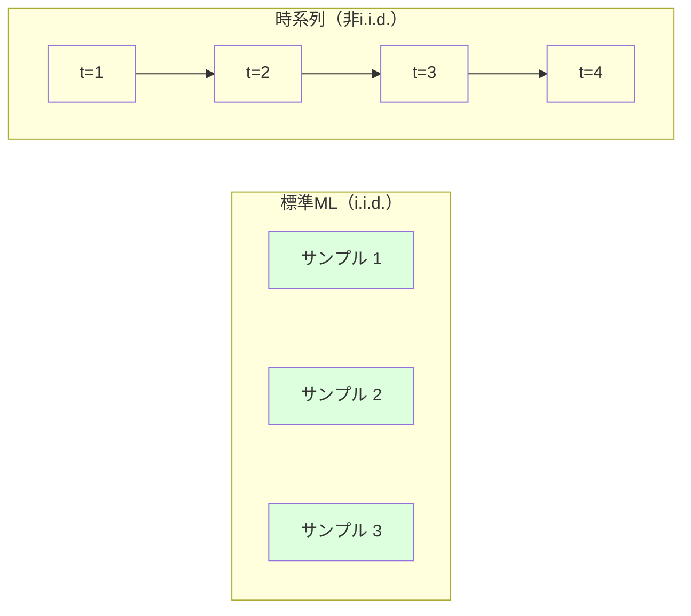
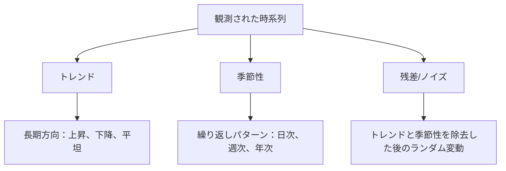
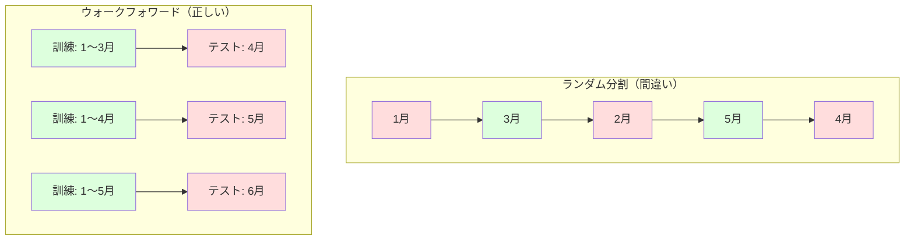

# 時系列の基礎

> 過去の性能は将来の結果を予測する -- まず定常性を確認すれば。

**タイプ:** 構築
**言語:** Python
**前提条件:** Phase 2、レッスン01〜09
**所要時間:** 約90分

## 学習目標

- 時系列をトレンド、季節性、残差成分に分解し、定常性を検定できる
- ラグ特徴量と移動統計を実装して時系列を教師あり学習問題に変換できる
- 将来データが訓練に漏れるのを防ぐウォークフォワード検証フレームワークを構築できる
- 時系列でランダムな訓練/テスト分割が無効な理由を説明し、適切な時間ベース分割との性能ギャップを実証できる

## 問題

時間順に並んだデータがある。日次売上、時間ごとの気温、分単位のCPU使用率、週次株価。次の値、次の週、次の四半期を予測したい。

標準的なMLツールキットを手に取る：ランダム訓練/テスト分割、交差検証、特徴量行列を入力して予測を出力。すべてのステップが間違いだ。

時系列は標準的なMLが依存する仮定を破る。サンプルは独立していない -- 今日の気温は昨日の気温に依存する。ランダム分割は将来の情報を過去に漏らす。バックテストで見栄えの良い特徴量は、時間とともに変化するパターンに依存するため本番環境では失敗する。

ランダム交差検証で95%の精度を得るモデルが、適切な時間ベースの評価では55%になるかもしれない。差は些細なことではない。紙の上で機能するモデルと本番環境で機能するモデルの違いだ。

このレッスンは基礎をカバーする：時間データを特別にする理由、モデルを正直に評価する方法、時系列を標準的なMLモデルが消費できる特徴量に変換する方法。

## コンセプト

### 時系列を特別にするもの

標準的なMLはi.i.d. -- 独立かつ同一分布 -- を仮定する。各サンプルは他のサンプルとは独立に、同じ分布から引き出される。時系列はこれらの両方を破る：

- **独立していない。** 今日の株価は昨日のものに依存する。今週の売上は先週と相関する。
- **同一分布でない。** 分布は時間とともに変化する。12月の売上は3月とは異なって見える。

これらの違反は些細なことではない。特徴量の構築方法、モデルの評価方法、どのアルゴリズムが機能するかを変える。



標準的なMLでは、サンプルは交換可能だ。シャッフルしても何も変わらない。時系列では、順序がすべてだ。シャッフルするとシグナルが破壊される。

### 時系列の成分

すべての時系列は以下の組み合わせだ：



- **トレンド**: 長期的な方向性。年10%成長する売上。上昇する世界の気温。
- **季節性**: 固定間隔での繰り返しパターン。12月に急増する小売売上。7月にピークになる冷房使用。
- **残差**: トレンドと季節性を除去した後に残るもの。残差がホワイトノイズのように見える場合、分解がシグナルを捉えた。

### 定常性

時系列は、その統計的特性（平均、分散、自己相関）が時間とともに変わらない場合に定常だ。ほとんどの予測手法は定常性を仮定する。

**なぜ重要か：** 非定常系列はドリフトする平均を持つ。1月のデータで訓練されたモデルは2月が示す異なる平均を学習している。系統的に間違いになる。

**確認方法：** ウィンドウにわたって移動平均と移動標準偏差を計算する。ドリフトする場合、系列は非定常だ。

**修正方法：** 差分。生の値をモデル化する代わりに、連続する値間の変化をモデル化する：

```
diff[t] = value[t] - value[t-1]
```

1回の差分で定常にならない場合、再度適用する（二次差分）。ほとんどの実世界の系列は最大2回の差分が必要だ。

**例：**

元の系列：[100, 102, 106, 112, 120]
一次差分：[2, 4, 6, 8]（まだ上昇傾向）
二次差分：[2, 2, 2]（定数 -- 定常）

元の系列は2次のトレンドを持っていた。一次差分で線形トレンドになった。二次差分で平坦になった。実際には、通常2回以上必要ない。

**正式なテスト：** 拡張ディッキー・フラー（ADF）検定は定常性の標準的な統計検定だ。帰無仮説は「系列は非定常だ」だ。p値が0.05未満であれば、帰無仮説を棄却して定常性を結論できる。ADFはスクラッチで実装しない（漸近分布表が必要）が、コードの移動統計アプローチは実践的な視覚的チェックを与える。

### 自己相関

自己相関は、時刻tでの値が時刻t-k（k時刻前）での値とどれだけ相関するかを測定する。自己相関関数（ACF）は各ラグkのこの相関をプロットする。

**ACFが教えること：**
- 系列がどれくらい先まで記憶しているか。ラグ5後にACFがゼロに落ちる場合、5ステップ以上前の値は無関係だ。
- 季節性が存在するかどうか。ラグ12（月次データ）でACFがスパイクする場合、年次季節性がある。
- 作成するラグ特徴量の数。ACFが無視できるようになるラグまで使う。

**PACF（偏自己相関関数）** は間接的な相関を除去する。今日が3日前と相関するのが、両方が昨日と相関するためだけの場合、ラグ3のPACFはゼロになるが、ラグ3のACFはゼロにならない。

### ラグ特徴量：時系列を教師あり学習に変換する

標準的なMLモデルは特徴量行列Xとターゲットyが必要だ。時系列は単一の値の列を与える。橋はラグ特徴量だ。

系列[10, 12, 14, 13, 15]を取り、ラグ1とラグ2の特徴量を作成する：

| lag_2 | lag_1 | ターゲット |
|-------|-------|---------|
| 10    | 12    | 14      |
| 12    | 14    | 13      |
| 14    | 13    | 15      |

これで標準的な回帰問題になった。任意のMLモデル（線形回帰、ランダムフォレスト、勾配ブースティング）がラグからターゲットを予測できる。

エンジニアリングできる追加の特徴量：
- **移動統計：** 最後のk値にわたる平均、標準偏差、最小、最大
- **カレンダー特徴量：** 曜日、月、is_holiday、is_weekend
- **差分値：** 前のステップからの変化
- **拡大統計：** 累積平均、累積和
- **比率特徴量：** 現在値 / 移動平均（最近の平均からどれくらい離れているか）
- **交互作用特徴量：** lag_1 * day_of_week（モメンタムへの平日効果）

**ラグはいくつ？** 自己相関関数を使う。ACFがラグ10まで有意な場合、少なくとも10ラグを使う。週次季節性がある場合、ラグ7（そして可能なら14）を含める。より多くのラグはモデルにより多くの履歴を与えるが、より多くの特徴量も適合させるので過学習のリスクが増える。

**ターゲットのアライメント落とし穴。** ラグ特徴量を作成するとき、ターゲットは時刻tでの値でなければならず、すべての特徴量は時刻t-1以前の値を使わなければならない。誤って時刻tでの値を特徴量として含めると、完璧な予測器を持つことになる -- そして完全に役立たないモデルだ。これは時系列特徴量エンジニアリングで最も一般的なバグだ。

### ウォークフォワード検証

これがこのレッスンで最も重要なコンセプトだ。標準的なk分割交差検証はランダムにサンプルを訓練とテストに割り当てる。時系列では、これが将来の情報を漏らす。



ウォークフォワード検証：
1. 時刻tまでのデータで訓練する
2. 時刻t+1（またはt+1からt+kのマルチステップ）で予測する
3. ウィンドウを前にスライドする
4. 繰り返す

各テスト分割にはすべての訓練データより後に来るデータのみが含まれる。将来のリークなし。これによりデプロイ時のモデルの性能の正直な推定が得られる。

**拡大ウィンドウ** は訓練にすべての過去データを使う（ウィンドウが成長する）。**スライディングウィンドウ** は固定サイズの訓練ウィンドウを使う（ウィンドウがスライドする）。古いデータがまだ関連していると考える場合は拡大を使う。世界が変化して古いデータが傷つける場合はスライディングを使う。

### ARIMAの直感

ARIMAは古典的な時系列モデルだ。3つの成分がある：

- **AR（自己回帰）：** 過去の値から予測する。AR(p)は最後のp値を使う。
- **I（和分）：** 定常性を達成するための差分。I(d)はd回の差分を適用する。
- **MA（移動平均）：** 過去の予測誤差から予測する。MA(q)は最後のq個の誤差を使う。

ARIMA(p, d, q)はこれら3つを組み合わせる。ACF/PACF分析または自動化されたサーチ（auto-ARIMA）に基づいてp、d、qを選ぶ。

ARIMAはスクラッチで実装しない -- このレッスンの範囲を超える数値最適化が必要だ。重要な洞察は各成分が何をするかを理解することなので、ARIMA結果を解釈していつ使うべきかを知ることができる。

### 何をいつ使うか

| アプローチ | 最適な用途 | 季節性を扱うか | 外部特徴量を扱うか |
|---------|---------|--------------|---------------|
| ラグ特徴量 + ML | 多くの外部特徴量を持つ表形式データ | カレンダー特徴量で | はい |
| ARIMA | 単変量系列、短期 | SARIMA変種 | いいえ（制限にはARIMAX） |
| 指数平滑法 | シンプルなトレンド＋季節性 | はい（Holt-Winters） | いいえ |
| Prophet | ビジネス予測、祝日 | はい（フーリエ項） | 限定的 |
| ニューラルネットワーク（LSTM、トランスフォーマー） | 長いシーケンス、多くの系列 | 学習された | はい |

ほとんどの実践的な問題では、ラグ特徴量 + 勾配ブースティングが最も強力な出発点だ。外部特徴量を自然に処理し、定常性を必要とせず、デバッグが容易だ。

### 予測ホライゾンと戦略

単一ステップ予測は1時間ステップ先を予測する。マルチステップ予測は複数のステップを予測する。3つの戦略がある：

**再帰的（反復）：** 1ステップ先を予測し、予測を次のステップの入力として使う。シンプルだが誤差が積み重なる -- 各予測は前の予測を使うので、間違いが複合する。

**直接：** 各ホライゾンに別のモデルを訓練する。モデル-1はt+1を予測し、モデル-5はt+5を予測する。誤差の積み重ねなし、しかし各モデルは訓練サンプルが少なく、情報を共有しない。

**マルチ出力：** すべてのホライゾンを同時に出力する1つのモデルを訓練する。ホライゾン間で情報を共有するが、複数の出力をサポートするモデル（またはカスタム損失関数）が必要だ。

ほとんどの実践的な問題では、短いホライゾン（1〜5ステップ）に再帰的、長いホライゾンに直接から始める。

### 時系列でのよくある間違い

| 間違い | なぜ起こるか | 修正方法 |
|--------|------------|---------|
| ランダムな訓練/テスト分割 | 標準MLからの習慣 | ウォークフォワードまたは時間的分割を使う |
| 将来の特徴量を使う | 時刻tの特徴量が誤って含まれる | すべての特徴量の時間的アライメントを監査する |
| 季節性への過学習 | モデルがカレンダーパターンを暗記する | テストセットに少なくとも1つの完全な季節サイクルを保持する |
| スケール変化を無視する | 売上が倍になってもパターンは同じ | 絶対値の代わりにパーセント変化をモデル化する |
| ラグ特徴量が多すぎる | 「より多くの履歴がより良い」 | ACFを使って関連するラグを決める |
| 差分しない | 「モデルが解決するだろう」 | 木モデルはトレンドを扱える；線形モデルは定常性が必要 |

## 構築

`code/time_series.py` のコードはスクラッチからコアの構成要素を実装する。

### ラグ特徴量クリエーター

```python
def make_lag_features(series, n_lags):
    n = len(series)
    X = np.full((n, n_lags), np.nan)
    for lag in range(1, n_lags + 1):
        X[lag:, lag - 1] = series[:-lag]
    valid = ~np.isnan(X).any(axis=1)
    return X[valid], series[valid]
```

これは1D系列を特徴量行列に変換する。各行は最後の `n_lags` 値を特徴量として持ち、現在の値をターゲットとして持つ。

### ウォークフォワード交差検証

```python
def walk_forward_split(n_samples, n_splits=5, min_train=50):
    assert min_train < n_samples, "min_train must be less than n_samples"
    step = max(1, (n_samples - min_train) // n_splits)
    for i in range(n_splits):
        train_end = min_train + i * step
        test_end = min(train_end + step, n_samples)
        if train_end >= n_samples:
            break
        yield slice(0, train_end), slice(train_end, test_end)
```

各分割は訓練データがテストデータより厳密に前に来ることを保証する。訓練ウィンドウは各分割で拡大する。

### シンプルな自己回帰モデル

純粋なARモデルはラグ特徴量での線形回帰に過ぎない：

```python
class SimpleAR:
    def __init__(self, n_lags=5):
        self.n_lags = n_lags
        self.weights = None
        self.bias = None

    def fit(self, series):
        X, y = make_lag_features(series, self.n_lags)
        # 正規方程式で解く
        X_b = np.column_stack([np.ones(len(X)), X])
        theta = np.linalg.lstsq(X_b, y, rcond=None)[0]
        self.bias = theta[0]
        self.weights = theta[1:]
        return self
```

これはレッスン02の線形回帰と概念的に同一だが、同じ変数の時間ラグ版に適用される。

### 定常性チェック

コードは移動統計を計算して定常性を視覚的および数値的に評価する：

```python
def check_stationarity(series, window=50):
    rolling_mean = np.array([
        series[max(0, i - window):i].mean()
        for i in range(1, len(series) + 1)
    ])
    rolling_std = np.array([
        series[max(0, i - window):i].std()
        for i in range(1, len(series) + 1)
    ])
    return rolling_mean, rolling_std
```

移動平均がドリフトするか移動標準偏差が変化する場合、系列は非定常だ。差分を適用して再度確認する。

コードはまた系列の前半と後半を比較することで定常性をチェックする。平均が標準偏差の半分以上異なる、または分散比が2倍を超える場合、系列は非定常とフラグされる。

### 自己相関

```python
def autocorrelation(series, max_lag=20):
    n = len(series)
    mean = series.mean()
    var = series.var()
    acf = np.zeros(max_lag + 1)
    for k in range(max_lag + 1):
        cov = np.mean((series[:n-k] - mean) * (series[k:] - mean))
        acf[k] = cov / var if var > 0 else 0
    return acf
```

## 活用

sklearnでは、ラグ特徴量を任意の回帰器で直接使う：

```python
from sklearn.linear_model import Ridge
from sklearn.ensemble import GradientBoostingRegressor

X, y = make_lag_features(series, n_lags=10)

for train_idx, test_idx in walk_forward_split(len(X)):
    model = Ridge(alpha=1.0)
    model.fit(X[train_idx], y[train_idx])
    predictions = model.predict(X[test_idx])
```

ARIMAにはstatsmodelsを使う：

```python
from statsmodels.tsa.arima.model import ARIMA

model = ARIMA(train_series, order=(5, 1, 2))
fitted = model.fit()
forecast = fitted.forecast(steps=30)
```

`time_series.py` のコードは両方のアプローチを示し、ウォークフォワード検証を使って比較する。

### sklearn TimeSeriesSplit

sklearnは `TimeSeriesSplit` を提供し、ウォークフォワード検証を実装する：

```python
from sklearn.model_selection import TimeSeriesSplit

tscv = TimeSeriesSplit(n_splits=5)
for train_index, test_index in tscv.split(X):
    X_train, X_test = X[train_index], X[test_index]
    y_train, y_test = y[train_index], y[test_index]
    model.fit(X_train, y_train)
    score = model.score(X_test, y_test)
```

これはスクラッチからの `walk_forward_split` と等価だが、sklearnの交差検証フレームワークに統合されている。`cross_val_score` で使える：

```python
from sklearn.model_selection import cross_val_score

scores = cross_val_score(model, X, y, cv=TimeSeriesSplit(n_splits=5))
print(f"平均スコア: {scores.mean():.4f} +/- {scores.std():.4f}")
```

### 評価指標

時系列予測は回帰指標を使うが、時間を意識したコンテキストで：

- **MAE（平均絶対誤差）：** |y_true - y_pred| の平均。元の単位で解釈しやすい。「平均して、予測は3.2度外れている。」
- **RMSE（二乗平均平方根誤差）：** 平均二乗誤差の平方根。MAEより大きな誤差をより多くペナルティ化する。多くの小さなエラーより大きなエラーが悪い場合に使う。
- **MAPE（平均絶対パーセンテージ誤差）：** |error / true_value| * 100 の平均。スケール非依存、異なる系列間の比較に有用。しかし真の値がゼロの場合は未定義。
- **ナイーブなベースライン比較：** 常にシンプルなベースラインと比較する。季節的ナイーブベースラインは1期前の値を予測する（昨日、先週）。モデルがナイーブに勝てない場合、何かが間違っている。

### 移動特徴量

コードはラグ特徴量に移動統計（7日と14日のウィンドウにわたる平均、標準偏差、最小、最大）を追加することを示す。これらによりモデルに最近のトレンドと変動性についての情報が与えられ、ラグ特徴量単独では捉えられないものだ。

例えば、移動平均が上昇している場合、上昇トレンドを示唆する。移動標準偏差が増加している場合、変動性の増大を示唆する。これらはツリーベースのモデルが学習できるパターンの種類だが、線形モデルはできない。

## Ship It

このレッスンが生成するもの：
- `outputs/prompt-time-series-advisor.md` -- 時系列問題のフレーミングのためのプロンプト
- `code/time_series.py` -- ラグ特徴量、ウォークフォワード検証、ARモデル、定常性チェック

### 超えなければならないベースライン

モデルを構築する前に、ベースラインを確立する：

1. **最後の値（持続性）。** 明日は今日と同じだと予測する。多くの系列でこれは驚くほど難しい。
2. **季節的ナイーブ。** 今日は先週の同じ日（または昨年）と同じだと予測する。モデルがこれに勝てない場合、季節性を超えた有用なパターンを学習していない。
3. **移動平均。** 最後のk値の平均を予測する。ノイズを平滑化するが急激な変化を捉えられない。

高度なMLモデルが季節的ナイーブベースラインに負ける場合、バグがある。最も一般的なのは：特徴量での将来のリーク、誤った評価方法、または系列が本当にランダムで予測不可能だ。

### 実践的なヒント

1. **まずプロットする。** モデリングの前に、生の系列をプロットする。トレンド、季節性、外れ値、構造的な変化（動作の急激な変化）を探す。30秒の視覚的な検査が1時間の自動化された分析より多くを教えることが多い。

2. **差分してからモデル化する。** 系列に明確なトレンドがある場合、ラグ特徴量を作成する前に差分する。ツリーベースのモデルはトレンドを扱えるが、線形モデルはできず、差分は決して傷つけない。

3. **少なくとも1つの完全な季節サイクルを保持する。** 週次季節性がある場合、テストセットには少なくとも1つの完全な週が必要だ。月次なら少なくとも1ヶ月。そうでなければモデルが季節パターンを捉えたかどうかを評価できない。

4. **本番環境でモニタリングする。** 時系列モデルは世界が変化するにつれて劣化する。予測誤差を移動ベースでトラッキングする。誤差が増加し始めたら、最近のデータでモデルを再訓練する。

5. **体制の変化に注意する。** パンデミック前のデータで訓練されたモデルはパンデミック後の動作を予測しない。既知の体制の変化を特徴量として含めるか、古いデータを忘れるスライディングウィンドウを使う。

6. **歪んだ系列にlog変換する。** 収益、価格、カウントはしばしば右歪みだ。logを取ることで分散を安定させ、乗法的なパターンを加法的にし、線形モデルが扱えるようにする。対数空間で予測し、元の単位に戻すために指数化する。

## 演習

1. **定常性実験。** 線形トレンドを持つ系列を生成する。移動統計で定常性をチェックする。一次差分を適用する。再度チェックする。2次トレンドに何回の差分が必要か？

2. **ラグ選択。** 季節性がある系列（期間=7）でACFを計算する。どのラグが最も高い自己相関を持つか？連続したラグ（1から7）の代わりに、それらのラグのみを使ってラグ特徴量を作成する。精度は改善するか？

3. **ウォークフォワード対ランダム分割。** ラグ特徴量でリッジ回帰を訓練する。ランダム80/20分割とウォークフォワード検証で評価する。ランダム分割はどれくらい性能を過大評価するか？

4. **特徴量エンジニアリング。** 移動平均（ウィンドウ=7）、移動標準偏差（ウィンドウ=7）、曜日特徴量をラグ特徴量に追加する。ウォークフォワード検証を使ってこれらの追加の有無で精度を比較する。

5. **マルチステップ予測。** ARモデルを1ステップ先の代わりに5ステップ先を予測するように修正する。2つの戦略を比較する：（a）1ステップを予測し、予測を次のステップの入力として使う（再帰的）、（b）各ホライゾンに別のモデルを訓練する（直接）。どちらがより正確か？

## 用語集

| 用語 | よく言われること | 実際の意味 |
|------|----------------|----------------------|
| 定常性 | 「統計が時間とともに変わらない」 | 平均、分散、自己相関構造が時間とともに一定の系列 |
| 差分 | 「連続する値を引く」 | トレンドを除去して定常性を達成するためにy[t] - y[t-1]を計算する |
| 自己相関（ACF） | 「系列が自分自身とどう相関するか」 | 時系列とラグのコピー自身の間の相関、ラグの関数として |
| 偏自己相関（PACF） | 「直接の相関のみ」 | より短いラグの効果を除去した後のラグkでの自己相関 |
| ラグ特徴量 | 「過去の値を入力として」 | y[t]を予測するためにy[t-1]、y[t-2]、...、y[t-k]を特徴量として使う |
| ウォークフォワード検証 | 「時間を尊重した交差検証」 | 訓練データが常に時系列的にテストデータに先行する評価 |
| ARIMA | 「古典的な時系列モデル」 | 自己回帰和分移動平均：過去の値（AR）、差分（I）、過去の誤差（MA）を組み合わせる |
| 季節性 | 「繰り返すカレンダーパターン」 | カレンダー期間（日次、週次、年次）に結びついた時系列の規則的で予測可能なサイクル |
| トレンド | 「長期的な方向」 | 時間とともに系列レベルの持続的な増加または減少 |
| 拡大ウィンドウ | 「すべての履歴を使う」 | 各分割で訓練セットが成長するウォークフォワード検証 |
| スライディングウィンドウ | 「固定サイズの履歴」 | 固定長のウィンドウが前方にスライドするウォークフォワード検証 |

## 参考文献

- [Hyndman and Athanasopoulos, Forecasting: Principles and Practice (第3版)](https://otexts.com/fpp3/) -- 時系列予測の最良の無料テキストブック
- [scikit-learn Time Series Split](https://scikit-learn.org/stable/modules/generated/sklearn.model_selection.TimeSeriesSplit.html) -- sklearnのウォークフォワード分割器
- [statsmodels ARIMAドキュメント](https://www.statsmodels.org/stable/generated/statsmodels.tsa.arima.model.ARIMA.html) -- 診断を含むARIMA実装
- [Makridakis et al., The M5 Competition (2022)](https://www.sciencedirect.com/science/article/pii/S0169207021001874) -- ML手法対統計手法を示す大規模予測コンペティション
