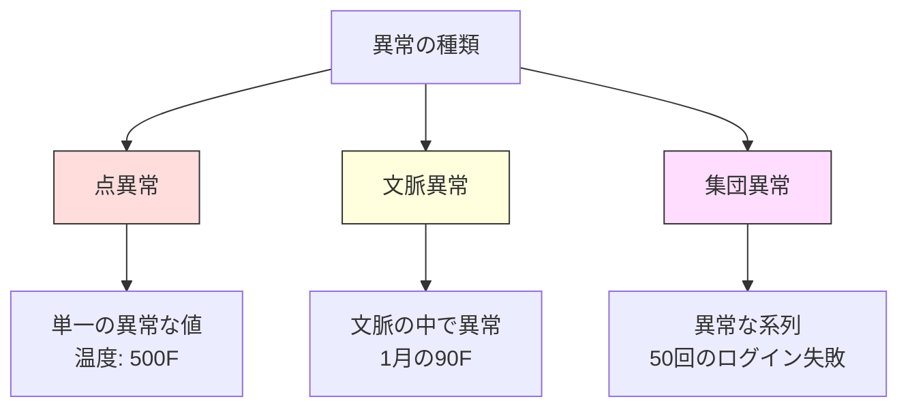
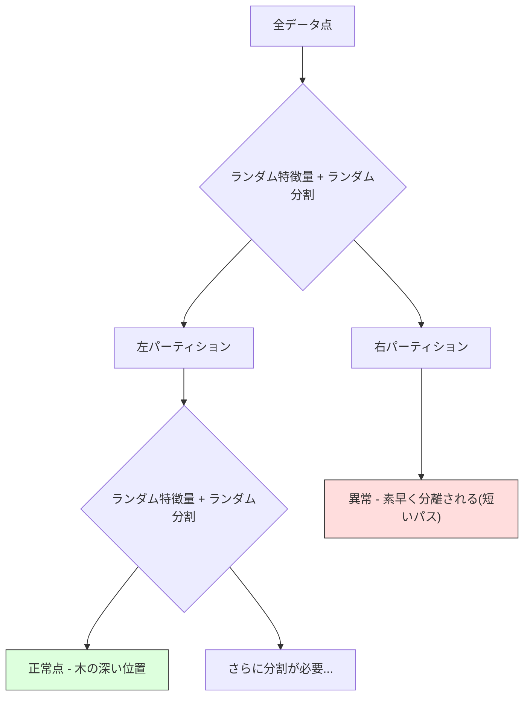
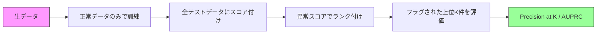

# 異常検知

> 正常を定義するのは簡単だ。異常とは、それに当てはまらないすべてのものである。

**タイプ:** Build
**言語:** Python
**前提条件:** Phase 2, Lessons 01-09
**所要時間:** 約75分

## 学習目標

- Z スコア、IQR、Isolation Forest の各異常検知手法をゼロから実装する
- 点異常、文脈異常、集団異常を区別し、それぞれに適した検知手法を選択する
- なぜ異常検知が「異常を分類する」のではなく「正常データをモデル化する」問題として定式化されるのかを説明する
- 教師なし異常検知と教師あり分類を比較し、新規異常のカバレッジと精度のトレードオフを評価する

## 問題

あるクレジットカードが午後2時にニューヨークで使われ、その5分後の午後2時5分に東京で使われる。工場のセンサーが、正常範囲が80〜120度であるところを150度と読み取る。サーバーが、1日平均200リクエストのところを毎秒50,000リクエスト送信する。

これらは異常である。異常を見つけることは重要だ。詐欺は数十億ドルの損失を生む。設備の故障はダウンタイムのコストを生む。ネットワーク侵入はデータの損失を生む。

課題はこうだ。異常のラベル付き例はめったに手に入らない。詐欺は取引全体の0.1%しかない。設備の故障は年に数回しか起きない。標準的な分類器を訓練することはできない。なぜなら「異常」クラスに学習すべきものがほとんど存在しないからだ。たとえいくつかのラベルがあったとしても、これまで見てきた異常が、今後遭遇するすべての種類というわけではない。明日の詐欺の手口は、今日のものとは異なって見える。

異常検知はこの問題を反転させる。何が異常かを学習する代わりに、何が正常かを学習するのだ。正常から逸脱したものはすべて疑わしい。これはラベルなしで機能し、新しい種類の異常にも適応し、大規模なデータセットにもスケールする。

## コンセプト

### 異常の種類

すべての異常が同じというわけではない。

- **点異常 (Point anomalies)。** 文脈に関係なく、それ単体で異常な単一のデータ点。500度の温度読み取り値。通常50ドルしか使わないアカウントからの50,000ドルの取引。
- **文脈異常 (Contextual anomalies)。** その文脈を踏まえると異常なデータ点。90度の気温は夏なら正常だが、冬なら異常である。同じ値でも文脈が異なる。
- **集団異常 (Collective anomalies)。** 個々の点はそれぞれ正常かもしれないが、グループとして見ると異常な一連のデータ点。5回のログイン失敗は正常だ。連続50回はブルートフォース攻撃である。

ほとんどの手法は点異常を検出する。文脈異常には時刻や場所の特徴量が必要だ。集団異常には系列を考慮した手法が必要である。



### 教師なしという枠組み

標準的な分類では、両方のクラスに対するラベルがある。異常検知では、通常は次の3つの状況のいずれかになる。

1. **完全な教師なし。** ラベルがまったくない。すべてのデータで検出器を当てはめ、異常が十分まれで「正常」モデルを汚さないことを期待する。
2. **半教師あり。** 正常データだけのクリーンなデータセットを持っている。このクリーンな集合に当てはめ、それ以外のすべてにスコアを付ける。可能な場合、これが最も強力な設定である。
3. **弱教師あり。** いくつかのラベル付き異常を持っている。それらを訓練ではなく評価に使う。教師なしで訓練し、ラベル付きサブセットで精度/再現率を測定する。

重要な洞察は、異常検知は分類とは根本的に異なるということだ。2つのクラス間の決定境界ではなく、正常データの分布をモデル化しているのである。

### 教師あり vs 教師なし: トレードオフ

ラベル付き異常を持っている場合、それらを訓練に使う(教師あり分類)べきか、評価のみに使う(教師なし検知)べきか。

**教師あり(分類として扱う):**
- これまで見たことのある正確な種類の異常を捕捉する
- 既知の異常タイプに対する精度が高い
- 新規の異常タイプを完全に見逃す
- 新しい異常タイプが出現したら再訓練が必要
- 十分な異常の例が必要(多くの場合少なすぎる)

**教師なし(正常をモデル化し、逸脱をフラグする):**
- 新規タイプを含め、正常からのあらゆる逸脱を捕捉する
- ラベル付き異常を必要としない
- 偽陽性率が高い(異常なものすべてが悪いわけではない)
- 分布シフトに対してより頑健

実際には、最良のシステムは両方を組み合わせる。すなわち、広範なカバレッジのための教師なし検知、既知の優先度の高い異常タイプのための教師ありモデル、そして曖昧なケースのための人間によるレビューである。

### Z スコア法

最もシンプルなアプローチ。各特徴量の平均と標準偏差を計算する。平均から k 標準偏差以上離れた点をフラグする。

```text
z_score = (x - mean) / std
anomaly if |z_score| > threshold
```

デフォルトの閾値は3.0である(ガウス分布では正常データの99.7%が3標準偏差以内に収まる)。

**強み:** シンプル。高速。解釈可能(「この値は正常から4.5標準偏差離れている」)。

**弱み:** データが正規分布していると仮定する。訓練データ内の外れ値に敏感(外れ値が平均をずらし、標準偏差を膨らませ、検出を難しくする)。多峰分布で失敗する。

**うまく機能する場面:** データがおおよそベル型である単一特徴量の監視。サーバー応答時間、製造公差、安定したベースラインを持つセンサー読み取り値。

**失敗する場面:** マルチクラスタのデータ(異なるベースライン温度を持つ2つのオフィス拠点)、歪んだデータ(1000ドルがまれだが異常ではない取引額)、訓練セットに外れ値を含むデータ。

### IQR 法

Z スコアより頑健。平均と標準偏差の代わりに四分位範囲を使う。

```
Q1 = 25th percentile
Q3 = 75th percentile
IQR = Q3 - Q1
lower_bound = Q1 - factor * IQR
upper_bound = Q3 + factor * IQR
anomaly if x < lower_bound or x > upper_bound
```

デフォルトの factor は1.5である。

**強み:** 外れ値に頑健(パーセンタイルは極端な値の影響を受けない)。歪んだ分布でも機能する。正規性の仮定がない。

**弱み:** 単変量のみ(特徴量ごとに独立して適用される)。特徴量を一緒に考慮したときにのみ異常となる異常を検出できない(ある点が各特徴量では個別に正常でも、結合空間では異常な場合がある)。

**実践上の注意:** IQR の1.5という factor は箱ひげ図のひげに対応する。ひげの外側の点は外れ値の候補である。1.5の代わりに3.0を使うと、検出器はより保守的になる(フラグが減り、偽陽性が減る)。適切な factor は、誤警報に対する許容度に依存する。

### Isolation Forest

重要な洞察は、異常は数が少なく、かつ異なっているということだ。データのランダムな分割において、異常はより簡単に分離できる。すなわち、残りから分離するのに必要なランダム分割の回数が少ない。



**仕組み:**
1. 多数のランダムな木を構築する(Isolation Forest)
2. 各ノードで、ランダムな特徴量と、その特徴量の最小値と最大値の間のランダムな分割値を選ぶ
3. すべての点が分離される(それぞれが自身の葉に入る)まで分割を続ける
4. 異常はすべての木にわたる平均パス長が短い

**なぜ機能するか:** 正常点は密な領域に存在する。隣接点から1つを分離するには多数のランダム分割が必要だ。異常は疎な領域に存在する。1〜2回のランダム分割でそれらを分離するのに十分である。

異常スコアはすべての木にわたる平均パス長に基づき、ランダムな二分探索木の期待パス長で正規化される。

```
score(x) = 2^(-average_path_length(x) / c(n))
```

ここで `c(n)` は n サンプルに対する期待パス長である。スコアが1に近いと異常を意味する。0.5に近いと正常を意味する。0に近いと非常に正常(密なクラスタの深い位置)を意味する。

**強み:** 分布の仮定がない。高次元で機能する。スケールが良い(各木がサブサンプルを使うためサンプルサイズに対して線形未満)。混在した特徴量タイプを扱える。

**弱み:** 密な領域での異常に苦労する(マスキング効果)。多くの特徴量が無関係な場合、ランダム分割の有効性が下がる。

**主要なハイパーパラメータ:**
- `n_estimators`: 木の数。100で通常は十分。木が多いほどスコアは安定するが計算は遅くなる。
- `max_samples`: 木ごとのサンプル数。元論文のデフォルトは256。値が小さいほど個々の木の精度は下がるが多様性が増す。サブサンプリングこそが Isolation Forest を高速にしている。各木はデータのごく一部しか見ない。
- `contamination`: 異常の期待割合。閾値の設定にのみ使われる。スコアそのものには影響しない。

### Local Outlier Factor (LOF)

LOF は、ある点の周囲の局所密度を、その隣接点の周囲の密度と比較する。密な領域に囲まれた疎な領域にある点は異常である。

**仕組み:**
1. 各点について、k 個の最近傍を見つける
2. 局所到達可能密度を計算する(近傍がどれくらい密か)
3. 各点の密度を、その隣接点の密度と比較する
4. ある点が隣接点よりはるかに密度が低ければ、それは外れ値である

**LOF スコア:**
- LOF が1.0に近いと隣接点と同様の密度を意味する(正常)
- LOF が1.0より大きいと隣接点より密度が低いことを意味する(異常の可能性)
- LOF が1.0よりはるかに大きい(例: 2.0以上)と密度が著しく低いことを意味する(異常の可能性が高い)

「局所」という部分が決定的に重要だ。2つのクラスタを持つデータセットを考えよう。1000点の密なクラスタと50点の疎なクラスタである。疎なクラスタの端にある点は、大域的には異常ではない。50個の隣接点を持っているからだ。しかし、もしその直近の隣接点が自分より密であれば、局所的には異常である。LOF は大域的手法が見逃すこの微妙な違いを捉える。

**強み:** 局所的な異常を検出する(大域的には異常でなくても、近傍では異常な点)。異なる密度のクラスタで機能する。

**弱み:** 大規模データセットで遅い(素朴な実装では O(n^2))。k の選択に敏感。非常に高次元ではうまく機能しない(次元の呪いが距離計算に影響する)。

### 比較

| 手法 | 仮定 | 速度 | 高次元への対応 | 局所異常の検出 |
|--------|------------|-------|-------------------|------------------------|
| Z-score | 正規分布 | 非常に高速 | あり(特徴量ごと) | なし |
| IQR | なし(特徴量ごと) | 非常に高速 | あり(特徴量ごと) | なし |
| Isolation Forest | なし | 高速 | あり | 部分的 |
| LOF | 距離が意味を持つこと | 遅い | 不得意 | あり |

### 評価の難しさ

異常検出器の評価は分類器の評価より難しい。

- **極端なクラス不均衡。** 異常が0.1%の場合、すべてを「正常」と予測すれば99.9%の正解率になる。正解率は役に立たない。
- **AUROC は誤解を招く。** 大きな不均衡があると、モデルが実用的な閾値でほとんどの異常を見逃していても AUROC が良く見えることがある。
- **より良い指標:** Precision@k(フラグされた上位 k 件のうち、いくつが本当の異常か)、AUPRC(精度-再現率曲線の下の面積)、固定の偽陽性率での再現率。



### 異常検知パイプライン

実際には、異常検知は次のワークフローに従う。

1. **ベースラインデータの収集。** 理想的には、異常が(ほとんど)ないと分かっている期間。
2. **特徴量エンジニアリング。** 生の特徴量に加え、導出した特徴量(移動統計量、時刻特徴量、比率)。
3. **検出器の訓練。** ベースラインデータに当てはめる。モデルは「正常」がどう見えるかを学習する。
4. **新しいデータへのスコア付け。** 各新規観測値が異常スコアを得る。
5. **閾値の選択。** スコアのカットオフを選ぶ。これはビジネス上の判断である。閾値が高いほど誤警報は減るが見逃す異常は増える。
6. **アラートと調査。** フラグされた点は人間によるレビューまたは自動応答に回される。
7. **フィードバックの収集。** フラグされた項目が本当の異常だったか誤警報だったかを記録する。このデータを使って検出器を評価し、時間をかけて閾値を調整する。

パイプラインに「完成」はない。データの分布はシフトし、新しい異常タイプが出現し、閾値は調整が必要になる。異常検知は一度きりのモデルではなく、生き続けるシステムとして扱おう。

## ビルドする

`code/anomaly_detection.py` のコードは、Z スコア、IQR、Isolation Forest をゼロから実装している。

### Z スコア検出器

```python
def zscore_detect(X, threshold=3.0):
    mean = X.mean(axis=0)
    std = X.std(axis=0)
    std[std == 0] = 1.0
    z = np.abs((X - mean) / std)
    return z.max(axis=1) > threshold
```

シンプルでベクトル化されている。いずれかの特徴量が閾値を超えると点をフラグする。

### IQR 検出器

```python
def iqr_detect(X, factor=1.5):
    q1 = np.percentile(X, 25, axis=0)
    q3 = np.percentile(X, 75, axis=0)
    iqr = q3 - q1
    iqr[iqr == 0] = 1.0
    lower = q1 - factor * iqr
    upper = q3 + factor * iqr
    outside = (X < lower) | (X > upper)
    return outside.any(axis=1)
```

### Isolation Forest をゼロから

ゼロからの実装は、特徴空間をランダムに分割する isolation tree を構築する。

```python
class IsolationTree:
    def __init__(self, max_depth):
        self.max_depth = max_depth

    def fit(self, X, depth=0):
        n, p = X.shape
        if depth >= self.max_depth or n <= 1:
            self.is_leaf = True
            self.size = n
            return self
        self.is_leaf = False
        self.feature = np.random.randint(p)
        x_min = X[:, self.feature].min()
        x_max = X[:, self.feature].max()
        if x_min == x_max:
            self.is_leaf = True
            self.size = n
            return self
        self.threshold = np.random.uniform(x_min, x_max)
        left_mask = X[:, self.feature] < self.threshold
        self.left = IsolationTree(self.max_depth).fit(X[left_mask], depth + 1)
        self.right = IsolationTree(self.max_depth).fit(X[~left_mask], depth + 1)
        return self
```

ある点を分離するまでのパス長が、その異常スコアを決定する。パスが短いほど異常度が高い。

`IsolationForest` クラスは複数の木をまとめる。

```python
class IsolationForest:
    def __init__(self, n_estimators=100, max_samples=256, seed=42):
        self.n_estimators = n_estimators
        self.max_samples = max_samples

    def fit(self, X):
        sample_size = min(self.max_samples, X.shape[0])
        max_depth = int(np.ceil(np.log2(sample_size)))
        for _ in range(self.n_estimators):
            idx = rng.choice(X.shape[0], size=sample_size, replace=False)
            tree = IsolationTree(max_depth=max_depth)
            tree.fit(X[idx])
            self.trees.append(tree)

    def anomaly_score(self, X):
        avg_path = average path length across all trees
        scores = 2.0 ** (-avg_path / c(max_samples))
        return scores
```

正規化係数 `c(n)` は、n 要素を持つ二分探索木における失敗探索の期待パス長である。これは `2 * H(n-1) - 2*(n-1)/n` に等しい(`H` は調和数)。この正規化により、異なるサイズのデータセット間でスコアを比較可能にできる。

### デモシナリオ

コードは複数のテストシナリオを生成する。

1. **外れ値を伴う単一クラスタ。** 中心から遠く離れた異常を注入した2次元ガウスクラスタ。すべての手法がここでは機能するはずだ。
2. **多峰データ。** 異なるサイズと密度の3つのクラスタ。クラスタ間の点が異常である。Z スコアは特徴量ごとの範囲が広いため苦労する。
3. **高次元データ。** 50特徴量だが、異常はそのうち5つだけで異なる。手法が特徴量の部分集合の中で異常を見つけられるかをテストする。

各デモは、精度、再現率、F1、Precision@k を使ってすべての手法を比較する。

## 使ってみる

sklearn を使う場合(ゼロからではなくライブラリ実装を使用)。

```python
from sklearn.ensemble import IsolationForest
from sklearn.neighbors import LocalOutlierFactor

iso = IsolationForest(n_estimators=100, contamination=0.05, random_state=42)
iso.fit(X_train)
predictions = iso.predict(X_test)

lof = LocalOutlierFactor(n_neighbors=20, contamination=0.05, novelty=True)
lof.fit(X_train)
predictions = lof.predict(X_test)
```

`contamination` は異常の期待割合を設定することに注意。正しく設定することが重要だ。低すぎると異常を見逃し、高すぎると誤警報を生む。

`anomaly_detection.py` のコードは、同じデータ上でゼロからの実装と sklearn を比較する。

### sklearn の contamination パラメータ

sklearn の `contamination` パラメータは、連続的な異常スコアを2値予測に変換するための閾値を決定する。基礎となるスコア自体は変更しない。

```python
iso_5 = IsolationForest(contamination=0.05)
iso_10 = IsolationForest(contamination=0.10)
```

どちらも同じ異常スコアを生成する。しかし `iso_5` は上位5%をフラグし、`iso_10` は上位10%をフラグする。真の異常率が分からない場合(通常は分からない)、contamination を "auto" に設定し、生のスコアを直接扱おう。偽陽性と偽陰性のコストのトレードオフに基づいて、自分自身の閾値を設定する。

### One-Class SVM

知っておく価値のあるもう1つの教師なし異常検出器。One-Class SVM は、高次元特徴空間(カーネルトリックを使用)において正常データの周囲に境界を当てはめる。

```python
from sklearn.svm import OneClassSVM

oc_svm = OneClassSVM(kernel="rbf", gamma="auto", nu=0.05)
oc_svm.fit(X_train)
predictions = oc_svm.predict(X_test)
```

`nu` パラメータは異常の割合を近似する。One-Class SVM は小〜中規模のデータセットでうまく機能するが、非常に大きなデータにはスケールしない(カーネル行列が二次的に増大する)。

### オートエンコーダによるアプローチ(プレビュー)

オートエンコーダは、データを圧縮して再構成することを学習するニューラルネットワークである。正常データで訓練する。テスト時には、ネットワークが正常パターンのみを再構成することを学習したため、異常は高い再構成誤差を持つ。

これは Phase 3(深層学習)で扱うが、原理は同じである。正常なものをモデル化し、逸脱したものをフラグする。

### アンサンブル異常検知

アンサンブル手法が分類を改善するのと同様に(Lesson 11)、複数の異常検出器を組み合わせると検出が改善する。最もシンプルなアプローチは次のとおり。

1. 複数の検出器を実行する(Z スコア、IQR、Isolation Forest、LOF)
2. 各検出器のスコアを [0, 1] に正規化する
3. 正規化されたスコアを平均する
4. 平均スコアが閾値を超える点をフラグする

これは偽陽性を減らす。なぜなら、異なる手法は異なる失敗モードを持つからだ。4つの手法すべてでフラグされた点はほぼ確実に異常である。1つの手法だけでフラグされた点は、その手法の癖かもしれない。

より洗練されたアンサンブルは、各検出器をその推定信頼性で重み付けする(可能であれば、既知の異常を持つ検証セットで測定する)。

### 本番での考慮事項

1. **閾値のドリフト。** データ分布がシフトするにつれ、固定の閾値は時代遅れになる。異常スコアの分布を監視し、定期的に調整する。
2. **アラート疲れ。** 誤警報が多すぎるとオペレータが注意を払わなくなる。高い閾値(少なく、より信頼できるアラート)から始め、信頼が築かれるにつれて下げる。
3. **アンサンブルアプローチ。** 本番では複数の検出器を組み合わせる。複数の手法が異常だと一致した場合にのみ点をフラグする。これは偽陽性を大幅に減らす。
4. **特徴量エンジニアリング。** 生の特徴量だけでは十分なことはまれだ。移動統計量、比率、前回イベントからの経過時間、ドメイン固有の特徴量を追加する。良い特徴量セットは検出器の選択より重要である。
5. **フィードバックループ。** オペレータがフラグされた項目を調査し、確認または却下したら、これをシステムにフィードバックする。時間をかけてラベル付きデータを蓄積し、検出器を評価・改善する。

## 出荷する

このレッスンは次のものを生成する。
- `outputs/skill-anomaly-detector.md` -- 適切な検出器を選ぶための意思決定スキル
- `code/anomaly_detection.py` -- ゼロからの Z スコア、IQR、Isolation Forest、および sklearn との比較

### 閾値の選択

異常スコアは連続値である。2値の判断を下すには閾値が必要だ。これは技術的判断ではなく、ビジネス上の判断である。

2つのシナリオを考えよう。
- **詐欺検知。** 詐欺の見逃しは高くつく(チャージバック、顧客の信頼)。誤警報は人間のアナリストが調査するのに5分かかる。より多くの詐欺を捕捉するために閾値を低く設定し、より多くの誤警報を受け入れる。
- **設備保全。** 誤警報は50,000ドルかかる不必要な停止を意味する。故障の見逃しは500,000ドルの修理を意味する。これらのコストのバランスを取るように閾値を設定する。

どちらの場合も、最適な閾値は偽陽性と偽陰性の間のコスト比に依存する。異なる閾値での精度と再現率をプロットし、コスト関数を重ね、最小コストの点を選ぶ。

### 本番へのスケーリング

本番でのリアルタイム異常検知のために。

1. **バッチ訓練、オンラインスコアリング。** 最近の正常データでモデルを定期的に(日次、週次)訓練する。各新規観測値が到着するたびにスコアを付ける。
2. **特徴量の計算は一致しなければならない。** 30日間の移動統計量で訓練した場合、新規観測値の特徴量を計算するには30日分の履歴が必要だ。必要な履歴をバッファする。
3. **スコア分布の監視。** 時間にわたる異常スコアの分布を追跡する。中央値スコアが上方にドリフトしたら、データが変化しているか、モデルが古くなっている。
4. **説明可能性。** 異常をフラグするときは、その理由を述べる。Z スコア: 「特徴量 X は正常より4.2標準偏差高い」。Isolation Forest: 「この点は平均3.1回の分割で分離された(正常点は8.5回かかる)」。

## 演習

1. **閾値のチューニング。** Z スコア検出器を1.0から5.0まで0.5刻みの閾値で実行する。各閾値での精度と再現率をプロットする。あなたのデータにとってのスイートスポットはどこか?

2. **多変量異常。** 各特徴量が個別には正常に見えるが、組み合わせると異常になる2次元データを作成する(例: 主クラスタの対角線から遠く離れた点)。特徴量ごとの Z スコアがこれらを見逃すが、Isolation Forest が捕捉することを示す。

3. **LOF をゼロから。** k 最近傍を使って Local Outlier Factor を実装する。同じデータ上で sklearn の LocalOutlierFactor と比較する。k=10 と k=50 を使う。k の選択は結果にどう影響するか?

4. **ストリーミング異常検知。** Z スコア検出器をストリーミング設定で機能するように修正する。新しい点が到着するたびに移動平均と分散を更新する(Welford のオンラインアルゴリズム)。同じデータ上でバッチ Z スコアと比較する。

5. **実世界での評価。** 既知の異常を持つデータセット(例えば Kaggle のクレジットカード詐欺)を取る。precision@100、precision@500、AUPRC を使ってすべての手法を評価する。どの手法が最も良く機能するか? なぜか?

## 主要用語

| 用語 | 人々が言うこと | 実際の意味 |
|------|----------------|----------------------|
| 異常 (Anomaly) | 「外れ値、異常な点」 | 正常データの期待されるパターンから著しく逸脱したデータ点 |
| 点異常 (Point anomaly) | 「単一の奇妙な値」 | 文脈に関係なく異常な個々の観測値 |
| 文脈異常 (Contextual anomaly) | 「正常な値、間違った文脈」 | 文脈(時刻、場所など)を踏まえると異常だが、別の文脈では正常かもしれない観測値 |
| Isolation Forest | 「外れ値を見つけるためのランダム分割」 | 正常点より少ない分割で異常を分離する、ランダムな木のアンサンブル |
| Local Outlier Factor | 「密度を隣接点と比較する」 | 局所密度が隣接点の密度よりはるかに低い点をフラグする手法 |
| Z スコア (Z-score) | 「平均からの標準偏差」 | (x - mean) / std、点が中心から標準偏差の単位でどれだけ離れているかを測る |
| IQR | 「四分位範囲」 | Q3 - Q1、データの中央50%の広がりを測り、頑健な外れ値検出に使う |
| Contamination | 「異常の期待割合」 | データのどれくらいの割合を異常としてフラグすべきかを検出器に伝えるハイパーパラメータ |
| Precision@k | 「上位 k 件のフラグのうち、いくつが本物か」 | 最も疑わしい k 点のみで計算される精度。不均衡な異常検知に有用 |
| AUPRC | 「精度-再現率曲線の下の面積」 | すべての閾値にわたる精度-再現率の性能を要約する指標。不均衡データでは AUROC より良い |

## 参考文献

- [Liu et al., Isolation Forest (2008)](https://cs.nju.edu.cn/zhouzh/zhouzh.files/publication/icdm08b.pdf) -- 元の Isolation Forest 論文
- [Breunig et al., LOF: Identifying Density-Based Local Outliers (2000)](https://dl.acm.org/doi/10.1145/342009.335388) -- 元の LOF 論文
- [scikit-learn Outlier Detection docs](https://scikit-learn.org/stable/modules/outlier_detection.html) -- すべての sklearn 異常検出器の概要
- [Chandola et al., Anomaly Detection: A Survey (2009)](https://dl.acm.org/doi/10.1145/1541880.1541882) -- 異常検知手法の包括的なサーベイ
- [Goldstein and Uchida, A Comparative Evaluation of Unsupervised Anomaly Detection Algorithms (2016)](https://journals.plos.org/plosone/article?id=10.1371/journal.pone.0152173) -- 実データセット上での10手法の実証的比較
