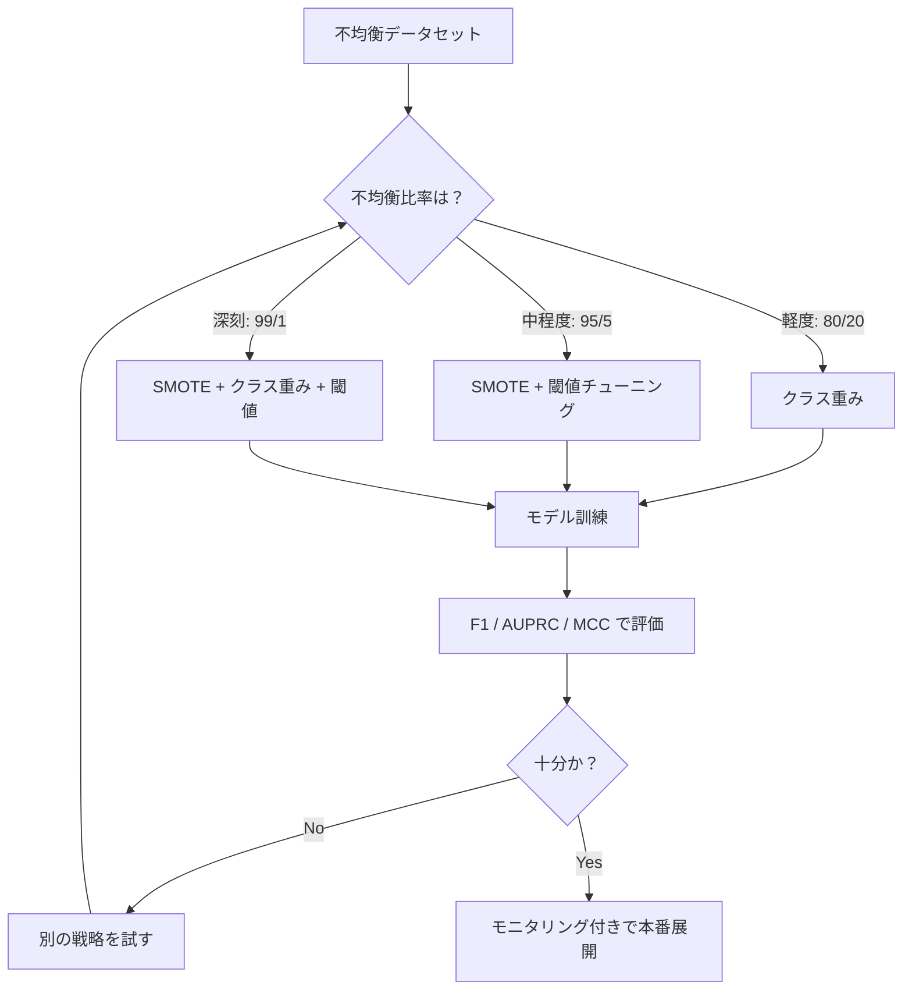
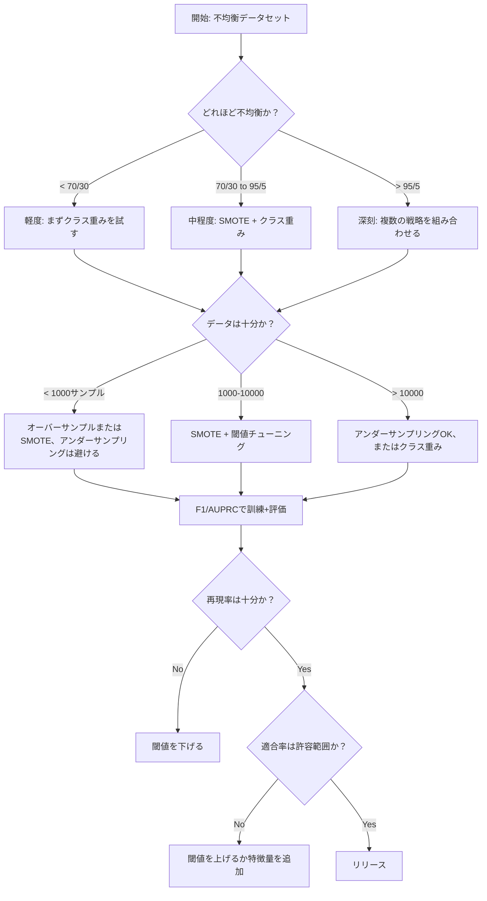

# 不均衡データの処理

> データの99%が「正常」のとき、精度は嘘をつく。

**タイプ:** 構築
**言語:** Python
**前提条件:** フェーズ2、レッスン01-09（特に評価指標）
**所要時間:** 約90分

## 学習目標

- SMOTEをゼロから実装し、合成オーバーサンプリングがランダム複製とどのように異なるかを説明する
- 精度の代わりにF1、AUPRC、マシューズ相関係数を使って不均衡な分類器を評価する
- クラス重み付け、閾値チューニング、リサンプリング戦略を比較し、与えられた不均衡比率に応じた適切なアプローチを選択する
- SMOTE、クラス重み、閾値最適化を組み合わせた完全な不均衡データパイプラインを構築する

## 問題

不正検知モデルを構築する。精度99.9%を達成する。喜ぶ。そして、すべてのトランザクションに対して「不正でない」と予測していることに気づく。

これはバグではない。トランザクションの0.1%しか不正でない場合に、合理的な判断として行われることだ。モデルは、常に多数派クラスを予測することで全体的なエラーが最小化されることを学習する。技術的には正しいが、まったく役に立たない。

これは実際の分類が重要なあらゆる場面で起きる。疾病診断：陽性率1%。ネットワーク侵入：0.01%の攻撃。製造不良：0.5%の欠陥品。スパムフィルタリング：スパム20%。チャーン予測：5%の離脱者。少数クラスが重要であるほど、そのクラスが稀である傾向がある。

精度は、すべての正解予測を均等に扱うため失敗する。正当なトランザクションを正しくラベル付けすることも、不正を正しく捉えることも、精度の1点として数えられる。しかし、不正を捉えることこそがモデルの存在理由だ。稀だが重要なクラスにモデルが注意を払うよう強制する指標、手法、訓練戦略が必要だ。

## コンセプト

### 精度が失敗する理由

1000サンプルのデータセット（陰性990、陽性10）を考える。常に陰性を予測するモデル：

|  | 予測：陽性 | 予測：陰性 |
|--|---|---|
| 実際：陽性 | 0 (TP) | 10 (FN) |
| 実際：陰性 | 0 (FP) | 990 (TN) |

精度 = (0 + 990) / 1000 = 99.0%

このモデルは不正を一件も検出しない。疾病も、欠陥もゼロ。しかし精度は99%と言う。これが不均衡問題において精度が危険な理由だ。

### より良い指標

**適合率** = TP / (TP + FP)。陽性と予測されたものの中で、実際に陽性だったものはいくつか？適合率が高いほど誤警報が少ない。

**再現率** = TP / (TP + FN)。実際に陽性のものの中で、いくつ捉えられたか？再現率が高いほど見逃しが少ない。

**F1スコア** = 2 * 適合率 * 再現率 / (適合率 + 再現率)。調和平均。適合率と再現率の極端な不均衡を算術平均より強く罰する。

**Fベータスコア** = (1 + beta^2) * 適合率 * 再現率 / (beta^2 * 適合率 + 再現率)。beta > 1のとき再現率を重視。beta < 1のとき適合率を重視。F2は不正検知でよく使われる（不正を見逃すことは誤警報より悪い）。

**AUPRC**（適合率-再現率曲線下面積）。AUC-ROCに似ているが、不均衡データにはより有益。ランダム分類器のAUPRCは陽性クラスの割合（ROCの0.5ではなく）に等しい。これにより改善が見えやすくなる。

**マシューズ相関係数** = (TP * TN - FP * FN) / sqrt((TP+FP)(TP+FN)(TN+FP)(TN+FN))。-1から+1の範囲。モデルが両クラスで良い性能を発揮する場合のみ高スコアを与える。クラスサイズが非常に異なる場合でもバランスが取れている。

上記の「常に陰性を予測する」モデルの場合：適合率 = 0/0（未定義、通常0に設定）、再現率 = 0/10 = 0、F1 = 0、MCC = 0。これらの指標はモデルが役に立たないことを正しく識別する。

### 不均衡データパイプライン



### SMOTE: 合成少数オーバーサンプリング手法

ランダムオーバーサンプリングは既存の少数サンプルを複製する。これは効果があるが、モデルが同一の点を繰り返し見るため過学習のリスクがある。

SMOTEは、もっともらしいが複製でない新しい合成少数サンプルを作成する。アルゴリズム：

1. 各少数サンプルxについて、他の少数サンプルの中からk個の最近傍を見つける
2. ランダムに1つの近傍を選ぶ
3. xとその近傍の線分上に新しいサンプルを作成する

式：`new_sample = x + random(0, 1) * (neighbor - x)`

これは実際の少数点の間を補間し、既存データを単に複製せずに特徴量空間の同じ領域にサンプルを作成する。


### サンプリング戦略の比較

**ランダムオーバーサンプリング**：多数派の数に合わせて少数サンプルを複製する。
- メリット：シンプル、情報損失なし
- デメリット：完全な複製による過学習、訓練時間増加

**ランダムアンダーサンプリング**：少数派の数に合わせて多数サンプルを削除する。
- メリット：高速な訓練、シンプル
- デメリット：有用な多数派データを捨てる、高い分散

**SMOTE**：補間による合成少数サンプル作成。
- メリット：新しいデータ点を生成、ランダムオーバーサンプリングと比較して過学習を低減
- デメリット：決定境界付近でノイズが多いサンプルを作る可能性、多数派クラスの分布を考慮しない

| 戦略 | データ変更 | リスク | 使用場面 |
|----------|-------------|------|-------------|
| オーバーサンプル | 少数派複製 | 過学習 | 小データセット、中程度の不均衡 |
| アンダーサンプル | 多数派削除 | 情報損失 | 大規模データセット、高速訓練が必要 |
| SMOTE | 合成少数追加 | 境界ノイズ | 中程度の不均衡、k-NNに十分な少数サンプル |

### クラス重み

データを変えるのではなく、モデルがエラーを扱う方法を変える。少数クラスの誤分類に高い重みを割り当てる。

陰性950、陽性50サンプルの二値問題：
- 陰性クラスの重み = n_samples / (2 * n_negative) = 1000 / (2 * 950) = 0.526
- 陽性クラスの重み = n_samples / (2 * n_positive) = 1000 / (2 * 50) = 10.0

陽性クラスは19倍の重みを得る。陽性サンプルを1つ誤分類するコストは、陰性サンプルを19個誤分類するコストと同じ。モデルは少数クラスに注意を払うよう強制される。

ロジスティック回帰では、損失関数を修正する：

```
weighted_loss = -sum(w_i * [y_i * log(p_i) + (1-y_i) * log(1-p_i)])
```

ここでw_iはサンプルiのクラスに依存する。

クラス重みは期待値においてオーバーサンプリングと数学的に等価だが、新しいデータ点を作成しない。そのため高速で、複製サンプルによる過学習リスクを回避できる。

### 閾値チューニング

ほとんどの分類器は確率を出力する。デフォルト閾値は0.5：P(陽性) >= 0.5なら陽性を予測。しかし0.5は任意だ。クラスが不均衡なとき、最適閾値は通常はるかに低い。

プロセス：
1. モデルを訓練する
2. バリデーションセットで予測確率を取得する
3. 0.0から1.0まで閾値を掃引する
4. 各閾値でF1（または選択した指標）を計算する
5. 指標を最大化する閾値を選ぶ


モデルが不正トランザクションに対してP(不正) = 0.15を出力するかもしれない。閾値0.5では不正でないと分類される。閾値0.10では正しく捉えられる。確率キャリブレーションよりランキングが重要だ——不正が非不正より高い確率を得る限り、それらを分離する閾値が存在する。

### コスト敏感学習

クラス重みの一般化。均一なコストではなく、特定の誤分類コストを割り当てる：

| | 陽性予測 | 陰性予測 |
|--|---|---|
| 実際：陽性 | 0（正解） | C_FN = 100 |
| 実際：陰性 | C_FP = 1 | 0（正解） |

不正トランザクションを見逃すこと（FN）は、誤警報（FP）の100倍のコストがかかる。モデルは総エラー数ではなく、総コストを最適化する。

実際のコストを推定できる場合、これが最も原則的なアプローチだ。見逃されたがんの診断は、追加生検につながる誤警報とはまったく異なるコストを持つ。これらのコストを明示することで正しいトレードオフが強制される。

### 決定フローチャート



## 構築する

### ステップ1：不均衡データセットの生成

```python
import numpy as np


def make_imbalanced_data(n_majority=950, n_minority=50, seed=42):
    rng = np.random.RandomState(seed)

    X_maj = rng.randn(n_majority, 2) * 1.0 + np.array([0.0, 0.0])
    X_min = rng.randn(n_minority, 2) * 0.8 + np.array([2.5, 2.5])

    X = np.vstack([X_maj, X_min])
    y = np.concatenate([np.zeros(n_majority), np.ones(n_minority)])

    shuffle_idx = rng.permutation(len(y))
    return X[shuffle_idx], y[shuffle_idx]
```

### ステップ2：SMOTEをゼロから実装

```python
def euclidean_distance(a, b):
    return np.sqrt(np.sum((a - b) ** 2))


def find_k_neighbors(X, idx, k):
    distances = []
    for i in range(len(X)):
        if i == idx:
            continue
        d = euclidean_distance(X[idx], X[i])
        distances.append((i, d))
    distances.sort(key=lambda x: x[1])
    return [d[0] for d in distances[:k]]


def smote(X_minority, k=5, n_synthetic=100, seed=42):
    rng = np.random.RandomState(seed)
    n_samples = len(X_minority)
    k = min(k, n_samples - 1)
    synthetic = []

    for _ in range(n_synthetic):
        idx = rng.randint(0, n_samples)
        neighbors = find_k_neighbors(X_minority, idx, k)
        neighbor_idx = neighbors[rng.randint(0, len(neighbors))]
        t = rng.random()
        new_point = X_minority[idx] + t * (X_minority[neighbor_idx] - X_minority[idx])
        synthetic.append(new_point)

    return np.array(synthetic)
```

### ステップ3：ランダムオーバーサンプリングとアンダーサンプリング

```python
def random_oversample(X, y, seed=42):
    rng = np.random.RandomState(seed)
    classes, counts = np.unique(y, return_counts=True)
    max_count = counts.max()

    X_resampled = list(X)
    y_resampled = list(y)

    for cls, count in zip(classes, counts):
        if count < max_count:
            cls_indices = np.where(y == cls)[0]
            n_needed = max_count - count
            chosen = rng.choice(cls_indices, size=n_needed, replace=True)
            X_resampled.extend(X[chosen])
            y_resampled.extend(y[chosen])

    X_out = np.array(X_resampled)
    y_out = np.array(y_resampled)
    shuffle = rng.permutation(len(y_out))
    return X_out[shuffle], y_out[shuffle]


def random_undersample(X, y, seed=42):
    rng = np.random.RandomState(seed)
    classes, counts = np.unique(y, return_counts=True)
    min_count = counts.min()

    X_resampled = []
    y_resampled = []

    for cls in classes:
        cls_indices = np.where(y == cls)[0]
        chosen = rng.choice(cls_indices, size=min_count, replace=False)
        X_resampled.extend(X[chosen])
        y_resampled.extend(y[chosen])

    X_out = np.array(X_resampled)
    y_out = np.array(y_resampled)
    shuffle = rng.permutation(len(y_out))
    return X_out[shuffle], y_out[shuffle]
```

### ステップ4：クラス重み付きロジスティック回帰

```python
def sigmoid(z):
    return 1.0 / (1.0 + np.exp(-np.clip(z, -500, 500)))


def logistic_regression_weighted(X, y, weights, lr=0.01, epochs=200):
    n_samples, n_features = X.shape
    w = np.zeros(n_features)
    b = 0.0

    for _ in range(epochs):
        z = X @ w + b
        pred = sigmoid(z)
        error = pred - y
        weighted_error = error * weights

        gradient_w = (X.T @ weighted_error) / n_samples
        gradient_b = np.mean(weighted_error)

        w -= lr * gradient_w
        b -= lr * gradient_b

    return w, b


def compute_class_weights(y):
    classes, counts = np.unique(y, return_counts=True)
    n_samples = len(y)
    n_classes = len(classes)
    weight_map = {}
    for cls, count in zip(classes, counts):
        weight_map[cls] = n_samples / (n_classes * count)
    return np.array([weight_map[yi] for yi in y])
```

### ステップ5：閾値チューニング

```python
def find_optimal_threshold(y_true, y_probs, metric="f1"):
    best_threshold = 0.5
    best_score = -1.0

    for threshold in np.arange(0.05, 0.96, 0.01):
        y_pred = (y_probs >= threshold).astype(int)
        tp = np.sum((y_pred == 1) & (y_true == 1))
        fp = np.sum((y_pred == 1) & (y_true == 0))
        fn = np.sum((y_pred == 0) & (y_true == 1))

        if metric == "f1":
            precision = tp / (tp + fp) if (tp + fp) > 0 else 0.0
            recall = tp / (tp + fn) if (tp + fn) > 0 else 0.0
            score = 2 * precision * recall / (precision + recall) if (precision + recall) > 0 else 0.0
        elif metric == "recall":
            score = tp / (tp + fn) if (tp + fn) > 0 else 0.0
        elif metric == "precision":
            score = tp / (tp + fp) if (tp + fp) > 0 else 0.0

        if score > best_score:
            best_score = score
            best_threshold = threshold

    return best_threshold, best_score
```

### ステップ6：評価関数

```python
def confusion_matrix_values(y_true, y_pred):
    tp = np.sum((y_pred == 1) & (y_true == 1))
    tn = np.sum((y_pred == 0) & (y_true == 0))
    fp = np.sum((y_pred == 1) & (y_true == 0))
    fn = np.sum((y_pred == 0) & (y_true == 1))
    return tp, tn, fp, fn


def compute_metrics(y_true, y_pred):
    tp, tn, fp, fn = confusion_matrix_values(y_true, y_pred)
    accuracy = (tp + tn) / (tp + tn + fp + fn)
    precision = tp / (tp + fp) if (tp + fp) > 0 else 0.0
    recall = tp / (tp + fn) if (tp + fn) > 0 else 0.0
    f1 = 2 * precision * recall / (precision + recall) if (precision + recall) > 0 else 0.0

    denom = np.sqrt(float((tp + fp) * (tp + fn) * (tn + fp) * (tn + fn)))
    mcc = (tp * tn - fp * fn) / denom if denom > 0 else 0.0

    return {
        "accuracy": accuracy,
        "precision": precision,
        "recall": recall,
        "f1": f1,
        "mcc": mcc,
    }
```

### ステップ7：全アプローチの比較

```python
X, y = make_imbalanced_data(950, 50, seed=42)
split = int(0.8 * len(y))
X_train, X_test = X[:split], X[split:]
y_train, y_test = y[:split], y[split:]

# ベースライン：処理なし
w_base, b_base = logistic_regression_weighted(
    X_train, y_train, np.ones(len(y_train)), lr=0.1, epochs=300
)
probs_base = sigmoid(X_test @ w_base + b_base)
preds_base = (probs_base >= 0.5).astype(int)

# オーバーサンプリング
X_over, y_over = random_oversample(X_train, y_train)
w_over, b_over = logistic_regression_weighted(
    X_over, y_over, np.ones(len(y_over)), lr=0.1, epochs=300
)
preds_over = (sigmoid(X_test @ w_over + b_over) >= 0.5).astype(int)

# SMOTE
minority_mask = y_train == 1
X_minority = X_train[minority_mask]
synthetic = smote(X_minority, k=5, n_synthetic=len(y_train) - 2 * int(minority_mask.sum()))
X_smote = np.vstack([X_train, synthetic])
y_smote = np.concatenate([y_train, np.ones(len(synthetic))])
w_sm, b_sm = logistic_regression_weighted(
    X_smote, y_smote, np.ones(len(y_smote)), lr=0.1, epochs=300
)
preds_smote = (sigmoid(X_test @ w_sm + b_sm) >= 0.5).astype(int)

# クラス重み
sample_weights = compute_class_weights(y_train)
w_cw, b_cw = logistic_regression_weighted(
    X_train, y_train, sample_weights, lr=0.1, epochs=300
)
probs_cw = sigmoid(X_test @ w_cw + b_cw)
preds_cw = (probs_cw >= 0.5).astype(int)

# 閾値チューニング（テストセットではなく、ホールドアウト検証セットでチューニング）
probs_val = sigmoid(X_val @ w_cw + b_cw)
best_thresh, best_f1 = find_optimal_threshold(y_val, probs_val, metric="f1")
preds_thresh = (probs_cw >= best_thresh).astype(int)
```

コードファイルはこれらをすべて1つのスクリプトで実行し、結果を表示する。

## 活用する

scikit-learnとimbalanced-learnを使えば、これらの手法は1行で実現できる：

```python
from sklearn.linear_model import LogisticRegression
from sklearn.metrics import classification_report, f1_score
from sklearn.model_selection import train_test_split
from imblearn.over_sampling import SMOTE
from imblearn.under_sampling import RandomUnderSampler
from imblearn.pipeline import Pipeline

X_train, X_test, y_train, y_test = train_test_split(X, y, stratify=y)

model_weighted = LogisticRegression(class_weight="balanced")
model_weighted.fit(X_train, y_train)
print(classification_report(y_test, model_weighted.predict(X_test)))

smote = SMOTE(random_state=42)
X_resampled, y_resampled = smote.fit_resample(X_train, y_train)
model_smote = LogisticRegression()
model_smote.fit(X_resampled, y_resampled)
print(classification_report(y_test, model_smote.predict(X_test)))

pipeline = Pipeline([
    ("smote", SMOTE()),
    ("model", LogisticRegression(class_weight="balanced")),
])
pipeline.fit(X_train, y_train)
print(classification_report(y_test, pipeline.predict(X_test)))
```

ゼロからの実装は各手法が何をするかを正確に示す。SMOTEは少数クラスへのk-NN補間に過ぎない。クラス重みは損失を掛け算する。閾値チューニングはカットオフのforループだ。魔法はない。

## 成果物

このレッスンで生成されるもの：
- `outputs/skill-imbalanced-data.md` -- 不均衡分類問題を処理するための意思決定チェックリスト

## 演習

1. **Borderline-SMOTE**：決定境界近くにある少数点（k最近傍に多数クラスのサンプルを含むもの）に対してのみ合成サンプルを生成するようSMOTEの実装を修正する。クラスが重なるデータセットで標準SMOTEと結果を比較する。

2. **コスト行列最適化**：コスト行列をパラメータとするコスト敏感学習を実装する。コスト行列を受け取り、期待コストを最小化する最適予測を返す関数を作成する。異なるコスト比率（1:10、1:100、1:1000）でテストし、適合率-再現率のトレードオフがどのように変化するかをプロットする。

3. **閾値キャリブレーション**：Plattスケーリング（モデルの生の出力にロジスティック回帰を適合させてキャリブレーションされた確率を生成する）を実装する。キャリブレーション前後の適合率-再現率曲線を比較する。キャリブレーションはランキングを変えない（AUCは同じまま）が確率をより意味のあるものにすることを示す。

4. **バランス化バギングによるアンサンブル**：複数のモデルを訓練し、それぞれはバランス化ブートストラップサンプル（全少数 + 多数のランダムサブセット）で訓練する。予測を平均する。このアプローチをSMOTEを使った単一モデルと比較する。性能と実行間の分散の両方を測定する。

5. **不均衡比率実験**：バランスのとれたデータセットを使って不均衡比率を段階的に増やす（50/50、70/30、90/10、95/5、99/1）。各比率でSMOTEあり・なしで訓練する。両アプローチのF1対不均衡比率をプロットする。SMOTEが意味のある差を生み出し始める比率はどこか？

## 主要な用語

| 用語 | よく言われること | 実際の意味 |
|------|----------------|----------------------|
| クラス不均衡 | 「一方のクラスのサンプルが圧倒的に多い」 | データセットのクラス分布が著しく歪んでおり、モデルが多数派クラスを優先する傾向がある状態 |
| SMOTE | 「合成オーバーサンプリング」 | 既存の少数サンプルとそのk近傍少数サンプルの間を補間することで新しい少数サンプルを作成する手法 |
| クラス重み | 「稀なクラスのエラーをより高コストにする」 | クラス固有の重みで損失関数を掛け算し、少数クラスの誤分類をより重く罰するようにすること |
| 閾値チューニング | 「決定境界を動かす」 | 分類の確率カットオフをデフォルトの0.5から、望む指標を最適化する値に変更すること |
| 適合率-再現率のトレードオフ | 「両方は手に入らない」 | 閾値を下げると陽性をより多く捉えられる（高い再現率）が、誤陽性も増える（低い適合率）、逆も同様 |
| AUPRC | 「PR曲線下面積」 | 適合率-再現率曲線を単一の数値にまとめたもの；クラスが著しく不均衡な場合はAUC-ROCより有益 |
| マシューズ相関係数 | 「バランスの取れた指標」 | 予測ラベルと実際のラベル間の相関で、モデルが両クラスで良い性能を発揮する場合のみ高スコアを与える |
| コスト敏感学習 | 「異なる間違いは異なるコストを持つ」 | 実際の誤分類コストを訓練目的に組み込み、エラー数ではなく総コストを最適化するようモデルを導くこと |
| ランダムオーバーサンプリング | 「少数派を複製する」 | クラス数のバランスを取るために少数クラスのサンプルを繰り返す；シンプルだが複製点への過学習リスクがある |

## 参考文献

- [SMOTE: Synthetic Minority Over-sampling Technique (Chawla et al., 2002)](https://arxiv.org/abs/1106.1813) -- オリジナルのSMOTE論文、不均衡学習で最も引用されている研究
- [Learning from Imbalanced Data (He & Garcia, 2009)](https://ieeexplore.ieee.org/document/5128907) -- サンプリング、コスト敏感、アルゴリズム的アプローチをカバーする包括的な調査
- [imbalanced-learn ドキュメント](https://imbalanced-learn.org/stable/) -- SMOTEバリアント、アンダーサンプリング戦略、パイプライン統合を持つPythonライブラリ
- [The Precision-Recall Plot Is More Informative than the ROC Plot (Saito & Rehmsmeier, 2015)](https://journals.plos.org/plosone/article?id=10.1371/journal.pone.0118432) -- 不均衡問題でROC曲線よりPR曲線を好む場合とその理由
