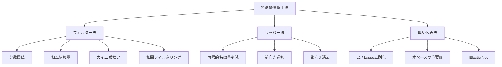
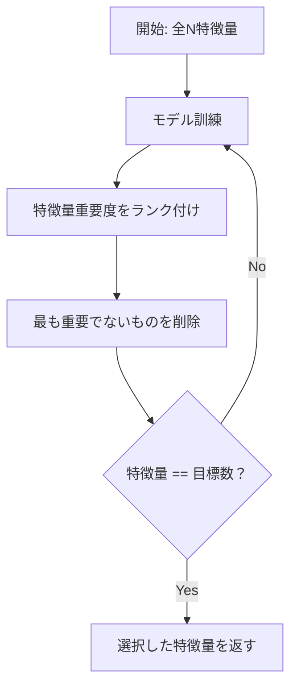
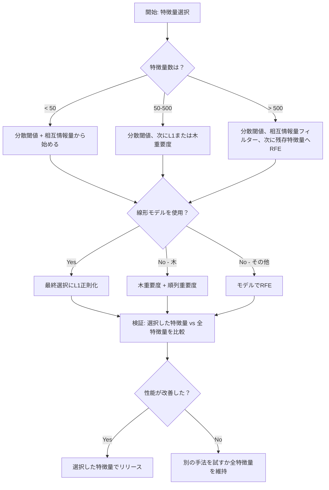

# 特徴量選択

> 特徴量が多いほど良いわけではない。適切な特徴量が良いのだ。

**タイプ:** 構築
**言語:** Python
**前提条件:** フェーズ2、レッスン01-09、08（特徴量エンジニアリング）
**所要時間:** 約75分

## 学習目標

- フィルター法（分散閾値、相互情報量、カイ二乗）とラッパー法（RFE、前向き選択）をゼロから実装する
- 相互情報量が、相関が見逃す非線形特徴量-目標変数関係を捉える理由を説明する
- L1正則化（埋め込み選択）とRFE（ラッパー選択）を比較し、計算コストのトレードオフを評価する
- 複数の手法を組み合わせた特徴量選択パイプラインを構築し、ホールドアウトデータでの汎化改善を実証する

## 問題

特徴量が500個ある。モデルの訓練は遅く、常に過学習し、何を学習したかを誰も説明できない。性能を改善しようとさらに特徴量を追加する。悪化する。

これが次元の呪いだ。特徴量数が増えると、特徴量空間の体積が爆発する。データ点がまばらになる。点間の距離が収束する。モデルは実際のパターンを見つけるために指数関数的に多くのデータが必要になる。ノイズ特徴量が信号特徴量を溺れさせる。過学習がデフォルトになる。

特徴量選択は解毒剤だ。ノイズを取り除く。冗長性を排除する。目標変数に関する実際の情報を持つ特徴量を残す。結果として：高速な訓練、より良い汎化、実際に説明できるモデル。

目標は利用可能な情報をすべて使うことではない。正しい情報を使うことだ。

## コンセプト

### 特徴量選択の3カテゴリ

すべての特徴量選択手法は3つのカテゴリのいずれかに属する：



**フィルター法**は統計的尺度を使って各特徴量を独立してスコアリングする。モデルを使わない。高速だが、特徴量間の相互作用を見逃す。

**ラッパー法**は特徴量サブセットを評価するためにモデルを訓練する。モデルの性能をスコアとして使う。より良い結果が得られるが、モデルを何度も再訓練するためコストが高い。

**埋め込み法**はモデル訓練の一部として特徴量を選択する。L1正則化は重みをゼロに駆動する。決定木は最も有用な特徴量で分割する。選択は独立したステップとしてではなく、適合中に行われる。

### 分散閾値

最もシンプルなフィルター。特徴量がサンプル間でほとんど変動しない場合、それはほとんど情報を持たない。

1000サンプルのうち999サンプルで0.0の特徴量を考える。分散はゼロに近い。どのモデルもそれを使ってクラス間を区別できない。削除する。

```
variance(x) = mean((x - mean(x))^2)
```

閾値を設定する（例：0.01）。それ以下の分散を持つすべての特徴量を削除する。これは目標変数を全く見ずに定数または定数に近い特徴量を除去する。

使い時：他の手法の前の前処理ステップとして。ほぼゼロのコストで明らかに役に立たない特徴量を捉える。

制限：特徴量は高い分散を持ちながら、純粋なノイズであることもある。分散閾値は必要条件だが十分条件ではない。

### 相互情報量

相互情報量は、特徴量Xの値を知ることで目標変数Yに関する不確実性がどれだけ減るかを測定する。

```
I(X; Y) = sum_x sum_y p(x, y) * log(p(x, y) / (p(x) * p(y)))
```

XとYが独立なら、p(x, y) = p(x) * p(y)となり、log項はゼロでI(X; Y) = 0。XがYについて伝える情報が多いほど、相互情報量は高くなる。

相関に対する主な利点：相互情報量は非線形関係を捉える。特徴量と目標変数の関係が二次関数的または周期的である場合、相関はゼロでも相互情報量は高いことがある。

連続特徴量の場合、最初にビンに離散化する（ヒストグラムベースの推定）。ビン数は推定値に影響する——ビンが少なすぎると情報が失われ、多すぎるとノイズが増える。一般的な選択：sqrt(n)個のビンまたはSturgesの法則（1 + log2(n)）。


### 再帰的特徴量削減（RFE）

RFEはラッパー法だ。モデル自身の特徴量重要度を使って反復的に刈り込む：

1. 全特徴量でモデルを訓練する
2. 重要度で特徴量をランク付けする（線形モデルは係数、木は不純度減少）
3. 最も重要でない特徴量を削除する
4. 望む特徴量数になるまで繰り返す



RFEはモデルが残りの全特徴量を一緒に見るため、特徴量間の相互作用を考慮する。1つの特徴量を削除すると他の重要度が変わる。これがフィルター法より徹底的な理由だ。

コスト：目標数を引いたN回モデルを訓練する。500特徴量で目標が10の場合、490回の訓練が必要。コストの高いモデルでは遅い。1ステップで複数の特徴量を削除することで高速化できる（例：各ラウンドで下位10%を削除）。

### L1（Lasso）正則化

L1正則化は重みの絶対値を損失関数に加える：

```
loss = prediction_error + alpha * sum(|w_i|)
```

alphaパラメータは特徴量がどれだけ積極的に刈り込まれるかを制御する。alphaが高いほど多くの重みが正確にゼロになる。

なぜ正確にゼロなのか？L1ペナルティは重み空間でダイヤモンド型の制約領域を作る。最適解はこのダイヤモンドの角に落ちる傾向があり、そこで1つ以上の重みがゼロになる。L2正則化（ridge）は円形制約を作り、重みは縮小するがゼロになることはほとんどない。

これが埋め込み特徴量選択だ：モデルは訓練中にどの特徴量を無視するかを学習する。重みがゼロの特徴量は実質的に除去される。

利点：単一の訓練実行、相関する特徴量を処理（1つを選び他をゼロに）、ほとんどの線形モデル実装に組み込み済み。

制限：線形モデルにのみ機能する。非線形特徴量重要度を捉えられない。

### 木ベースの特徴量重要度

決定木とそのアンサンブル（ランダムフォレスト、勾配ブースティング）は自然に特徴量をランク付けする。すべての分割は不純度を減少させる（分類ではGiniまたはエントロピー、回帰では分散）。より大きな不純度減少をもたらす特徴量がより重要だ。

T本の木からなるランダムフォレストの場合：

```
importance(feature_j) = (1/T) * sum over all trees of
    sum over all nodes splitting on feature_j of
        (n_samples * impurity_decrease)
```

これは各特徴量の正規化された重要度スコアを与える。非線形関係と特徴量間の相互作用を自動的に処理する。

注意：木ベースの重要度は多くのユニーク値（高いカーディナリティ）を持つ特徴量に偏っている。ランダムなID列は全サンプルを完全に分割できるため重要に見える。正当性チェックとして順列重要度を使う。

### 順列重要度

モデル非依存の手法：

1. モデルを訓練し、バリデーションデータでのベースライン性能を記録する
2. 各特徴量について：値をランダムにシャッフルし、性能の低下を測定する
3. 低下が大きいほど、その特徴量が重要

特徴量をシャッフルしても性能に影響がなければ、モデルはそれに依存していない。性能が崩壊するなら、その特徴量は重要だ。

順列重要度は木ベースの重要度のカーディナリティバイアスを回避する。しかし遅い：特徴量ごとに1回の完全な評価が必要で、安定性のために複数回繰り返す。

### 比較表

| 手法 | タイプ | 速度 | 非線形 | 特徴量間相互作用 |
|--------|------|-------|-----------|---------------------|
| 分散閾値 | フィルター | 非常に高速 | いいえ | いいえ |
| 相互情報量 | フィルター | 高速 | はい | いいえ |
| 相関フィルター | フィルター | 高速 | いいえ | いいえ |
| RFE | ラッパー | 遅い | モデルによる | はい |
| L1 / Lasso | 埋め込み | 高速 | いいえ（線形） | いいえ |
| 木重要度 | 埋め込み | 中程度 | はい | はい |
| 順列重要度 | モデル非依存 | 遅い | はい | はい |

### 決定フローチャート



## 構築する

### ステップ1：既知の特徴量構造を持つ合成データの生成

```python
import numpy as np


def make_feature_selection_data(n_samples=500, seed=42):
    rng = np.random.RandomState(seed)

    x1 = rng.randn(n_samples)
    x2 = rng.randn(n_samples)
    x3 = rng.randn(n_samples)
    x4 = x1 + 0.1 * rng.randn(n_samples)
    x5 = x2 + 0.1 * rng.randn(n_samples)

    informative = np.column_stack([x1, x2, x3, x4, x5])

    correlated = np.column_stack([
        x1 * 0.9 + 0.1 * rng.randn(n_samples),
        x2 * 0.8 + 0.2 * rng.randn(n_samples),
        x3 * 0.7 + 0.3 * rng.randn(n_samples),
        x1 * 0.5 + x2 * 0.5 + 0.1 * rng.randn(n_samples),
        x2 * 0.6 + x3 * 0.4 + 0.1 * rng.randn(n_samples),
    ])

    noise = rng.randn(n_samples, 10) * 0.5

    X = np.hstack([informative, correlated, noise])
    y = (2 * x1 - 1.5 * x2 + x3 + 0.5 * rng.randn(n_samples) > 0).astype(int)

    feature_names = (
        [f"info_{i}" for i in range(5)]
        + [f"corr_{i}" for i in range(5)]
        + [f"noise_{i}" for i in range(10)]
    )

    return X, y, feature_names
```

正解がわかっている：特徴量0-4が有益（3と4は0と1の相関コピー）、特徴量5-9は有益特徴量と相関、特徴量10-19は純粋なノイズ。良い選択手法は0-4を最高位にランク付けし、10-19を最低位にすべきだ。

### ステップ2：分散閾値

```python
def variance_threshold(X, threshold=0.01):
    variances = np.var(X, axis=0)
    mask = variances > threshold
    return mask, variances
```

### ステップ3：相互情報量（離散）

```python
def discretize(x, n_bins=10):
    min_val, max_val = x.min(), x.max()
    if max_val == min_val:
        return np.zeros_like(x, dtype=int)
    bin_edges = np.linspace(min_val, max_val, n_bins + 1)
    binned = np.digitize(x, bin_edges[1:-1])
    return binned


def mutual_information(X, y, n_bins=10):
    n_samples, n_features = X.shape
    mi_scores = np.zeros(n_features)

    y_vals, y_counts = np.unique(y, return_counts=True)
    p_y = y_counts / n_samples

    for f in range(n_features):
        x_binned = discretize(X[:, f], n_bins)
        x_vals, x_counts = np.unique(x_binned, return_counts=True)
        p_x = dict(zip(x_vals, x_counts / n_samples))

        mi = 0.0
        for xv in x_vals:
            for yi, yv in enumerate(y_vals):
                joint_mask = (x_binned == xv) & (y == yv)
                p_xy = np.sum(joint_mask) / n_samples
                if p_xy > 0:
                    mi += p_xy * np.log(p_xy / (p_x[xv] * p_y[yi]))
        mi_scores[f] = mi

    return mi_scores
```

### ステップ4：再帰的特徴量削減

```python
def simple_logistic_importance(X, y, lr=0.1, epochs=100):
    n_samples, n_features = X.shape
    w = np.zeros(n_features)
    b = 0.0

    for _ in range(epochs):
        z = X @ w + b
        pred = 1.0 / (1.0 + np.exp(-np.clip(z, -500, 500)))
        error = pred - y
        w -= lr * (X.T @ error) / n_samples
        b -= lr * np.mean(error)

    return w, b


def rfe(X, y, n_features_to_select=5, lr=0.1, epochs=100):
    n_total = X.shape[1]
    remaining = list(range(n_total))
    rankings = np.ones(n_total, dtype=int)
    rank = n_total

    while len(remaining) > n_features_to_select:
        X_subset = X[:, remaining]
        w, _ = simple_logistic_importance(X_subset, y, lr, epochs)
        importances = np.abs(w)

        least_idx = np.argmin(importances)
        original_idx = remaining[least_idx]
        rankings[original_idx] = rank
        rank -= 1
        remaining.pop(least_idx)

    for idx in remaining:
        rankings[idx] = 1

    selected_mask = rankings == 1
    return selected_mask, rankings
```

### ステップ5：L1特徴量選択

```python
def soft_threshold(w, alpha):
    return np.sign(w) * np.maximum(np.abs(w) - alpha, 0)


def l1_feature_selection(X, y, alpha=0.1, lr=0.01, epochs=500):
    n_samples, n_features = X.shape
    w = np.zeros(n_features)
    b = 0.0

    for _ in range(epochs):
        z = X @ w + b
        pred = 1.0 / (1.0 + np.exp(-np.clip(z, -500, 500)))
        error = pred - y

        gradient_w = (X.T @ error) / n_samples
        gradient_b = np.mean(error)

        w -= lr * gradient_w
        w = soft_threshold(w, lr * alpha)
        b -= lr * gradient_b

    selected_mask = np.abs(w) > 1e-6
    return selected_mask, w
```

### ステップ6：木ベースの重要度（シンプルな決定木）

```python
def gini_impurity(y):
    if len(y) == 0:
        return 0.0
    classes, counts = np.unique(y, return_counts=True)
    probs = counts / len(y)
    return 1.0 - np.sum(probs ** 2)


def best_split(X, y, feature_idx):
    values = np.unique(X[:, feature_idx])
    if len(values) <= 1:
        return None, -1.0

    best_threshold = None
    best_gain = -1.0
    parent_gini = gini_impurity(y)
    n = len(y)

    for i in range(len(values) - 1):
        threshold = (values[i] + values[i + 1]) / 2.0
        left_mask = X[:, feature_idx] <= threshold
        right_mask = ~left_mask

        n_left = np.sum(left_mask)
        n_right = np.sum(right_mask)

        if n_left == 0 or n_right == 0:
            continue

        gain = parent_gini - (n_left / n) * gini_impurity(y[left_mask]) - (n_right / n) * gini_impurity(y[right_mask])

        if gain > best_gain:
            best_gain = gain
            best_threshold = threshold

    return best_threshold, best_gain


def tree_importance(X, y, n_trees=50, max_depth=5, seed=42):
    rng = np.random.RandomState(seed)
    n_samples, n_features = X.shape
    importances = np.zeros(n_features)

    for _ in range(n_trees):
        sample_idx = rng.choice(n_samples, size=n_samples, replace=True)
        feature_subset = rng.choice(n_features, size=max(1, int(np.sqrt(n_features))), replace=False)

        X_boot = X[sample_idx]
        y_boot = y[sample_idx]

        tree_imp = _build_tree_importance(X_boot, y_boot, feature_subset, max_depth)
        importances += tree_imp

    total = importances.sum()
    if total > 0:
        importances /= total

    return importances


def _build_tree_importance(X, y, feature_subset, max_depth, depth=0):
    n_features = X.shape[1]
    importances = np.zeros(n_features)

    if depth >= max_depth or len(np.unique(y)) <= 1 or len(y) < 4:
        return importances

    best_feature = None
    best_threshold = None
    best_gain = -1.0

    for f in feature_subset:
        threshold, gain = best_split(X, y, f)
        if gain > best_gain:
            best_gain = gain
            best_feature = f
            best_threshold = threshold

    if best_feature is None or best_gain <= 0:
        return importances

    importances[best_feature] += best_gain * len(y)

    left_mask = X[:, best_feature] <= best_threshold
    right_mask = ~left_mask

    importances += _build_tree_importance(X[left_mask], y[left_mask], feature_subset, max_depth, depth + 1)
    importances += _build_tree_importance(X[right_mask], y[right_mask], feature_subset, max_depth, depth + 1)

    return importances
```

### ステップ7：全手法の実行と比較

コードファイルは同じ合成データセットで5つの手法をすべて実行し、各手法が選択する特徴量を示す比較表を表示する。

## 活用する

scikit-learnでは、特徴量選択はパイプラインに組み込まれている：

```python
from sklearn.feature_selection import (
    VarianceThreshold,
    mutual_info_classif,
    RFE,
    SelectFromModel,
)
from sklearn.linear_model import Lasso, LogisticRegression
from sklearn.ensemble import RandomForestClassifier

vt = VarianceThreshold(threshold=0.01)
X_filtered = vt.fit_transform(X)

mi_scores = mutual_info_classif(X, y)
top_k = np.argsort(mi_scores)[-10:]

rfe_selector = RFE(LogisticRegression(), n_features_to_select=10)
rfe_selector.fit(X, y)
X_rfe = rfe_selector.transform(X)

lasso_selector = SelectFromModel(Lasso(alpha=0.01))
lasso_selector.fit(X, y)
X_lasso = lasso_selector.transform(X)

rf = RandomForestClassifier(n_estimators=100)
rf.fit(X, y)
importances = rf.feature_importances_
```

ゼロからの実装は各手法の内部で何が起きているかを正確に示す。分散閾値は単に`var(X, axis=0)`を計算してマスクを適用するだけ。相互情報量は分割表で結合頻度と周辺頻度をカウントする。RFEは訓練、ランク付け、刈り込みのループ。L1はソフト閾値処理ステップのある勾配降下法。木重要度は分割での不純度減少を積算する。魔法なし——統計とループだけ。

sklearn版はロバスト性（例：mutual_info_classifはビニングではなくk-NN密度推定を使用）、速度（C実装）、パイプライン統合を追加する。

## 成果物

このレッスンで生成されるもの：
- `outputs/skill-feature-selector.md` -- 適切な特徴量選択手法を選ぶためのクイックリファレンス決定木

## 演習

1. **前向き選択**：RFEの逆を実装する。ゼロ特徴量から始める。各ステップで、モデル性能を最も改善する特徴量を追加する。特徴量を追加しても改善がなくなったら停止する。選択した特徴量をRFEの結果と比較する。どちらが速いか？どちらが良い結果を出すか？

2. **安定性選択**：L1特徴量選択を50回実行する（毎回データのランダムな80%サブサンプルで、わずかに異なるalpha値）。各特徴量が選択された回数をカウントする。80%以上の実行で選択された特徴量が「安定」だ。安定した特徴量を単一実行のL1選択と比較する。どちらが信頼性が高いか？

3. **多重共線性検出**：全特徴量の相関行列を計算する。相関閾値（例：0.9）が与えられたとき、高相関ペアの一方の特徴量を削除する（目標変数との相互情報量が高い方を残す）関数を実装する。合成データセットでテストし、冗長な相関特徴量を削除することを確認する。

4. **特徴量選択パイプライン**：分散閾値、相互情報量フィルター、RFEを1つのパイプラインに連鎖させる。まずゼロ分散に近い特徴量を削除し、次に相互情報量で上位50%を残し、残存特徴量にRFEを実行する。このパイプラインを全特徴量への単独RFEと比較する。パイプラインは速いか？精度は同等か？

5. **ゼロからの順列重要度**：順列重要度を実装する。各特徴量について値を10回シャッフルし、F1スコアの平均低下を測定する。木ベースの重要度とのランキングを比較する。両者が一致しない場合を見つけ、その理由を説明する（ヒント：相関する特徴量）。

## 主要な用語

| 用語 | よく言われること | 実際の意味 |
|------|----------------|----------------------|
| フィルター法 | 「特徴量を独立してスコアリング」 | モデルを訓練せずに統計的尺度で特徴量をランク付けし、各特徴量を単独で評価する特徴量選択アプローチ |
| ラッパー法 | 「モデルを使って特徴量を選ぶ」 | モデルを訓練し、その性能を選択基準として使って特徴量サブセットを評価する特徴量選択アプローチ |
| 埋め込み法 | 「モデルが訓練中に特徴量を選択する」 | L1正則化が重みをゼロに駆動するなど、モデル適合の一部として行われる特徴量選択 |
| 相互情報量 | 「ある変数が別の変数について伝える情報量」 | Xの知識が与えられたときのYに関する不確実性の減少量で、線形・非線形両方の依存関係を捉える |
| 再帰的特徴量削減 | 「訓練、ランク付け、刈り込み、繰り返し」 | モデルを訓練し、最も重要でない特徴量を削除し、目標数に達するまで繰り返す反復ラッパー法 |
| L1 / Lasso正則化 | 「特徴量を殺すペナルティ」 | 損失関数に重みの絶対値の和を加えること。これにより重要でない特徴量の重みが正確にゼロになる |
| 分散閾値 | 「定数特徴量を削除する」 | サンプル間の分散が指定の閾値を下回る特徴量を削除し、情報を持たない特徴量をフィルタリングする |
| 特徴量重要度 | 「どの特徴量が最も重要か」 | 各特徴量がモデル予測にどれだけ貢献するかを示すスコア。分割ゲイン（木）または係数の大きさ（線形）から計算 |
| 順列重要度 | 「シャッフルしてダメージを測る」 | 各特徴量の値をランダムにシャッフルし、モデル性能の低下を測定することで特徴量重要度を評価する |
| 次元の呪い | 「特徴量が多すぎてデータが不足」 | 特徴量を追加すると特徴量空間の体積が指数関数的に増加し、データがまばらになり距離が意味をなさなくなる現象 |

## 参考文献

- [An Introduction to Variable and Feature Selection (Guyon & Elisseeff, 2003)](https://jmlr.org/papers/v3/guyon03a.html) -- 特徴量選択手法の基礎的な調査、今も広く参照される
- [scikit-learn Feature Selection Guide](https://scikit-learn.org/stable/modules/feature_selection.html) -- フィルター、ラッパー、埋め込み法のコード例付き実践リファレンス
- [Stability Selection (Meinshausen & Buhlmann, 2010)](https://arxiv.org/abs/0809.2932) -- サブサンプリングと特徴量選択を組み合わせてロバストで再現可能な結果を得る
- [Beware Default Random Forest Importances (Strobl et al., 2007)](https://bmcbioinformatics.biomedcentral.com/articles/10.1186/1471-2105-8-25) -- 木ベース重要度のカーディナリティバイアスを実証し、代替として条件付き重要度を提案
