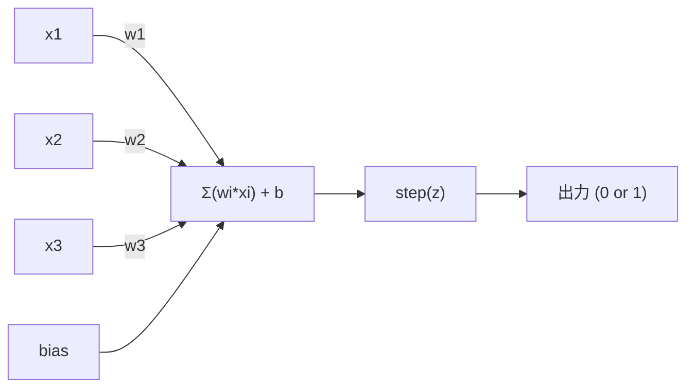
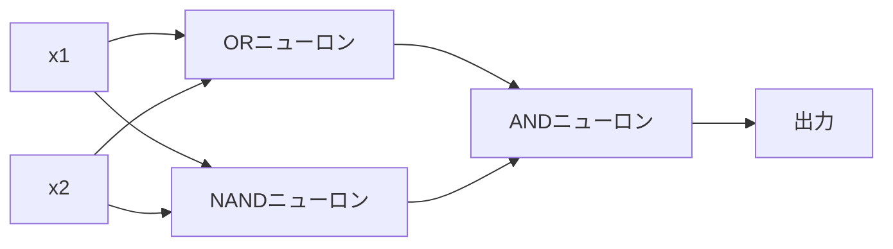

# パーセプトロン

> パーセプトロンはニューラルネットワークの原子だ。分解すると、重み、バイアス、そして決定が見つかる。

**タイプ:** 構築
**言語:** Python
**前提条件:** フェーズ1（線形代数の直感）
**所要時間:** 約60分

## 学習目標

- Pythonでパーセプトロンをゼロから実装し、重み更新ルールとステップ活性化関数を含める
- 単一のパーセプトロンが線形分離可能な問題しか解けない理由を説明し、XORの失敗事例を実演する
- OR、NAND、ANDゲートを組み合わせてXORを解くマルチレイヤーパーセプトロンを構築する
- シグモイド活性化とバックプロパゲーションを使って2層ネットワークを訓練し、XORを自動的に学習する

## 問題

ベクトルとドット積を知っている。行列が入力を出力に変換することを知っている。しかし、機械はどの変換を使うかを*学習する*のだろうか？

パーセプトロンがこれに答える。最もシンプルな学習機械だ：いくつかの入力を取り、重みで掛け算し、バイアスを加え、二値決定を行う。そして調整する。それだけだ。これまでに構築されたすべてのニューラルネットワークは、このアイデアを積み重ねた層だ。

パーセプトロンを理解することは、「学習」がコードで実際に何を意味するかを理解することだ：出力が現実と一致するまで数値を調整すること。

## コンセプト

### 1つのニューロン、1つの決定

パーセプトロンはn個の入力を取り、それぞれを重みで掛け算し、合計し、バイアスを加え、結果を活性化関数に通す。



ステップ関数は容赦ない：重み付き和とバイアスの合計が >= 0なら1を出力。そうでなければ0を出力。

```
step(z) = 1  if z >= 0
           0  if z < 0
```

これは線形分類器だ。重みとバイアスは入力空間を2つの領域に分割する直線（または高次元の超平面）を定義する。

### 決定境界

2つの入力に対して、パーセプトロンは2次元空間に直線を引く：

```
  x2
  ┤
  │  クラス1       /
  │    (0)         /
  │               /
  │              / w1·x1 + w2·x2 + b = 0
  │             /
  │            /     クラス2
  │           /        (1)
  ┼──────────/──────────── x1
```

直線の一方の側はすべて0を出力する。もう一方の側はすべて1を出力する。訓練によって、クラスを正しく分離するまでこの直線が移動する。

### 学習ルール

パーセプトロンの学習ルールはシンプルだ：

```
各訓練例 (x, y_true) について：
    y_pred = predict(x)
    error = y_true - y_pred

    各重みについて：
        w_i = w_i + learning_rate * error * x_i
    bias = bias + learning_rate * error
```

予測が正しければ、error = 0、何も変わらない。0と予測したが1であるべきなら、重みが増える。1と予測したが0であるべきなら、重みが減る。学習率は各調整の大きさを制御する。

### XOR問題

ここで壊れる。これらの論理ゲートを見てみよう：

```
ANDゲート：          ORゲート：           XORゲート：
x1  x2  出力        x1  x2  出力        x1  x2  出力
0   0   0           0   0   0           0   0   0
0   1   0           0   1   1           0   1   1
1   0   0           1   0   1           1   0   1
1   1   1           1   1   1           1   1   0
```

ANDとORは線形分離可能：0と1を分離する単一の直線を引ける。XORはそうではない。[0,1]と[1,0]を[0,0]と[1,1]から分離する単一の直線は存在しない。

```
AND（分離可能）：          XOR（分離不可能）：

  x2                        x2
  1 ┤  0     1              1 ┤  1     0
    │     /                   │
  0 ┤  0 / 0                0 ┤  0     1
    ┼──/──────── x1           ┼──────────── x1
       直線が機能する！         単一の直線は機能しない！
```

これは根本的な制限だ。単一のパーセプトロンは線形分離可能な問題しか解けない。MinksyとPapertは1969年にこれを証明し、ニューラルネットワーク研究を10年近く停滞させた。

修正方法：パーセプトロンを層に積み重ねる。マルチレイヤーパーセプトロンは2つの線形決定を非線形なものに組み合わせることでXORを解ける。

## 構築する

### ステップ1：パーセプトロンクラス

```python
class Perceptron:
    def __init__(self, n_inputs, learning_rate=0.1):
        self.weights = [0.0] * n_inputs
        self.bias = 0.0
        self.lr = learning_rate

    def predict(self, inputs):
        total = sum(w * x for w, x in zip(self.weights, inputs))
        total += self.bias
        return 1 if total >= 0 else 0

    def train(self, training_data, epochs=100):
        for epoch in range(epochs):
            errors = 0
            for inputs, target in training_data:
                prediction = self.predict(inputs)
                error = target - prediction
                if error != 0:
                    errors += 1
                    for i in range(len(self.weights)):
                        self.weights[i] += self.lr * error * inputs[i]
                    self.bias += self.lr * error
            if errors == 0:
                print(f"Converged at epoch {epoch + 1}")
                return
        print(f"Did not converge after {epochs} epochs")
```

### ステップ2：論理ゲートで訓練する

```python
and_data = [
    ([0, 0], 0),
    ([0, 1], 0),
    ([1, 0], 0),
    ([1, 1], 1),
]

or_data = [
    ([0, 0], 0),
    ([0, 1], 1),
    ([1, 0], 1),
    ([1, 1], 1),
]

not_data = [
    ([0], 1),
    ([1], 0),
]

print("=== AND Gate ===")
p_and = Perceptron(2)
p_and.train(and_data)
for inputs, _ in and_data:
    print(f"  {inputs} -> {p_and.predict(inputs)}")

print("\n=== OR Gate ===")
p_or = Perceptron(2)
p_or.train(or_data)
for inputs, _ in or_data:
    print(f"  {inputs} -> {p_or.predict(inputs)}")

print("\n=== NOT Gate ===")
p_not = Perceptron(1)
p_not.train(not_data)
for inputs, _ in not_data:
    print(f"  {inputs} -> {p_not.predict(inputs)}")
```

### ステップ3：XORの失敗を観察する

```python
xor_data = [
    ([0, 0], 0),
    ([0, 1], 1),
    ([1, 0], 1),
    ([1, 1], 0),
]

print("\n=== XOR Gate (single perceptron) ===")
p_xor = Perceptron(2)
p_xor.train(xor_data, epochs=1000)
for inputs, expected in xor_data:
    result = p_xor.predict(inputs)
    status = "OK" if result == expected else "WRONG"
    print(f"  {inputs} -> {result} (expected {expected}) {status}")
```

収束しない。これが単一のパーセプトロンがXORを学習できないという確固たる証明だ。

### ステップ4：2層でXORを解く

トリック：XOR = (x1 OR x2) AND NOT (x1 AND x2)。3つのパーセプトロンを組み合わせる：



```python
def xor_network(x1, x2):
    or_neuron = Perceptron(2)
    or_neuron.weights = [1.0, 1.0]
    or_neuron.bias = -0.5

    nand_neuron = Perceptron(2)
    nand_neuron.weights = [-1.0, -1.0]
    nand_neuron.bias = 1.5

    and_neuron = Perceptron(2)
    and_neuron.weights = [1.0, 1.0]
    and_neuron.bias = -1.5

    hidden1 = or_neuron.predict([x1, x2])
    hidden2 = nand_neuron.predict([x1, x2])
    output = and_neuron.predict([hidden1, hidden2])
    return output


print("\n=== XOR Gate (multi-layer network) ===")
for inputs, expected in xor_data:
    result = xor_network(inputs[0], inputs[1])
    print(f"  {inputs} -> {result} (expected {expected})")
```

4つのケースすべてが正しい。パーセプトロンを層に積み重ねることで、単一のパーセプトロンでは作れない決定境界が生まれる。

### ステップ5：2層ネットワークの訓練

ステップ4は重みを手動で設定した。XORには機能するが、適切な重みが事前にわからない実際の問題には使えない。修正方法：ステップ関数をシグモイドに置き換え、バックプロパゲーションを通じて重みを自動的に学習する。

```python
class TwoLayerNetwork:
    def __init__(self, learning_rate=0.5):
        import random
        random.seed(0)
        self.w_hidden = [[random.uniform(-1, 1), random.uniform(-1, 1)] for _ in range(2)]
        self.b_hidden = [random.uniform(-1, 1), random.uniform(-1, 1)]
        self.w_output = [random.uniform(-1, 1), random.uniform(-1, 1)]
        self.b_output = random.uniform(-1, 1)
        self.lr = learning_rate

    def sigmoid(self, x):
        import math
        x = max(-500, min(500, x))
        return 1.0 / (1.0 + math.exp(-x))

    def forward(self, inputs):
        self.inputs = inputs
        self.hidden_outputs = []
        for i in range(2):
            z = sum(w * x for w, x in zip(self.w_hidden[i], inputs)) + self.b_hidden[i]
            self.hidden_outputs.append(self.sigmoid(z))
        z_out = sum(w * h for w, h in zip(self.w_output, self.hidden_outputs)) + self.b_output
        self.output = self.sigmoid(z_out)
        return self.output

    def train(self, training_data, epochs=10000):
        for epoch in range(epochs):
            total_error = 0
            for inputs, target in training_data:
                output = self.forward(inputs)
                error = target - output
                total_error += error ** 2

                d_output = error * output * (1 - output)

                saved_w_output = self.w_output[:]
                hidden_deltas = []
                for i in range(2):
                    h = self.hidden_outputs[i]
                    hd = d_output * saved_w_output[i] * h * (1 - h)
                    hidden_deltas.append(hd)

                for i in range(2):
                    self.w_output[i] += self.lr * d_output * self.hidden_outputs[i]
                self.b_output += self.lr * d_output

                for i in range(2):
                    for j in range(len(inputs)):
                        self.w_hidden[i][j] += self.lr * hidden_deltas[i] * inputs[j]
                    self.b_hidden[i] += self.lr * hidden_deltas[i]
```

```python
net = TwoLayerNetwork(learning_rate=2.0)
net.train(xor_data, epochs=10000)
for inputs, expected in xor_data:
    result = net.forward(inputs)
    predicted = 1 if result >= 0.5 else 0
    print(f"  {inputs} -> {result:.4f} (rounded: {predicted}, expected {expected})")
```

ステップ4との2つの主な違い。第一に、シグモイドがステップ関数を置き換える——滑らかなので勾配が存在する。第二に、`train`メソッドが出力から隠れ層にエラーを後ろ向きに伝播させ、エラーへの各重みの寄与に比例してすべての重みを調整する。これが20行のバックプロパゲーションだ。

これはレッスン03へのブリッジだ。`d_output`と`hidden_deltas`の背後にある数学は、ネットワークグラフに適用された連鎖律だ。そこで適切に導出する。

## 活用する

ゼロから構築したものはすべて1つのインポートで存在する：

```python
from sklearn.linear_model import Perceptron as SkPerceptron
import numpy as np

X = np.array([[0,0],[0,1],[1,0],[1,1]])
y = np.array([0, 0, 0, 1])

clf = SkPerceptron(max_iter=100, tol=1e-3)
clf.fit(X, y)
print([clf.predict([x])[0] for x in X])
```

5行。30行の`Perceptron`クラスと同じことをする。sklearn版は収束チェック、複数の損失関数、スパース入力サポートを追加——しかしコアループは同一：重み付き和、ステップ関数、エラーに基づく重み更新。

本当の差はスケールで現れる。本番ネットワークで変わること：

- ステップ関数はシグモイド、ReLU、その他の滑らかな活性化関数になる
- 重みはバックプロパゲーション（レッスン03）を通じて自動的に学習される
- 層が深くなる：3層、10層、100層以上
- 同じ原則が成立する：各層は前の層の出力から新しい特徴量を作成する

単一のパーセプトロンは直線しか引けない。積み重ねると、任意の形を描ける。

## 成果物

このレッスンで生成されるもの：
- `outputs/skill-perceptron.md` - 単層vs多層アーキテクチャが必要な場合を扱うスキル

## 演習

1. NANDゲート（ユニバーサルゲート——すべての論理回路はNANDから構築できる）でパーセプトロンを訓練する。その重みとバイアスが有効な決定境界を形成することを確認する。
2. パーセプトロンクラスを修正して、各エポックでの決定境界（w1*x1 + w2*x2 + b = 0）を追跡する。ANDゲートの訓練中に直線がどのように移動するかを表示する。
3. 3つの入力のうち少なくとも2つが1のときに1を出力する3入力パーセプトロンを構築する（多数決関数）。これは線形分離可能か？なぜ？

## 主要な用語

| 用語 | よく言われること | 実際の意味 |
|------|----------------|----------------------|
| パーセプトロン | 「偽のニューロン」 | 線形分類器：入力と重みのドット積にバイアスを加え、ステップ関数を通す |
| 重み | 「入力の重要度」 | 各入力の決定への寄与をスケーリングする乗数 |
| バイアス | 「閾値」 | 決定境界をシフトさせる定数で、入力がゼロでもパーセプトロンが発火できるようにする |
| 活性化関数 | 「値を押しつぶすもの」 | 重み付き和の後に適用される関数——パーセプトロンにはステップ関数、現代のネットワークにはシグモイド/ReLU |
| 線形分離可能 | 「それらの間に直線を引ける」 | 単一の超平面でクラスを完全に分離できるデータセット |
| XOR問題 | 「パーセプトロンができないもの」 | 単層ネットワークが非線形分離可能な関数を学習できないという証明 |
| 決定境界 | 「分類器が切り替わる場所」 | 入力空間を2つのクラスに分割する超平面 w*x + b = 0 |
| マルチレイヤーパーセプトロン | 「本物のニューラルネットワーク」 | 層に積み重ねられたパーセプトロンで、各層の出力が次の層の入力になる |

## 参考文献

- Frank Rosenblatt, "The Perceptron: A Probabilistic Model for Information Storage and Organization in the Brain" (1958) -- すべての始まりとなったオリジナル論文
- Minsky & Papert, "Perceptrons" (1969) -- XORが単層ネットワークでは解けないことを証明し、パーセプトロン研究を10年停滞させた本
- Michael Nielsen, "Neural Networks and Deep Learning", Chapter 1 (http://neuralnetworksanddeeplearning.com/) -- 無料オンライン、パーセプトロンがネットワークに合成される方法の最良の視覚的説明
