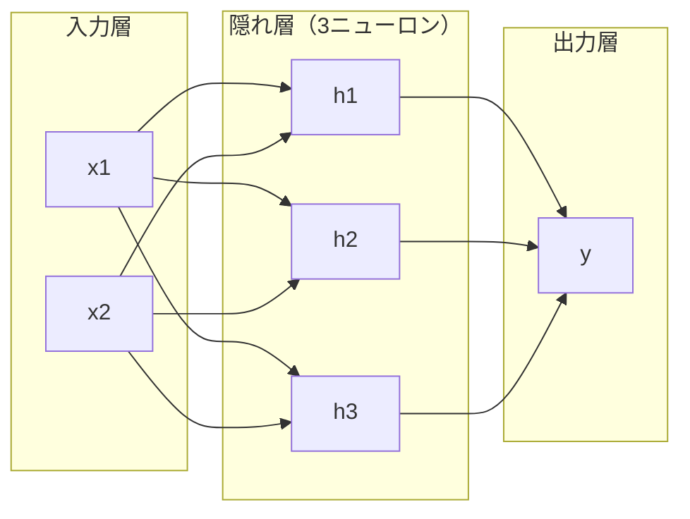
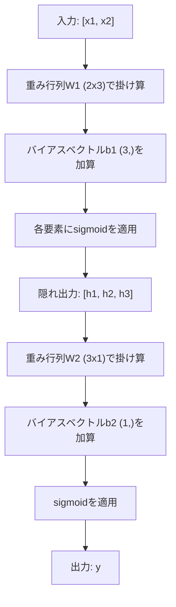

# 多層ネットワークとフォワードパス

> 1つのニューロンは直線を引く。積み重ねれば、何でも描ける。

**タイプ:** 構築
**言語:** Python
**前提条件:** フェーズ01（数学的基礎）、レッスン03.01（パーセプトロン）
**所要時間:** 約90分

## 学習目標

- 完全なフォワードパスを実行するLayerクラスとNetworkクラスを使って多層ネットワークをゼロから構築する
- ネットワークの各層を通じて行列の次元を追跡し、形状の不一致を特定する
- 非線形活性化を積み重ねることで、ネットワークが曲がった決定境界を学習できるようになる仕組みを説明する
- 手動チューニングしたシグモイド重みを持つ2-2-1アーキテクチャを使ってXOR問題を解く

## 問題

単一のニューロンは直線を引くだけだ。データに引く1本の直線。AIのすべての実際の問題——画像認識、言語理解、囲碁のプレイ——には曲線が必要だ。ニューロンを層に積み重ねることで曲線が得られる。

1969年、MinksyとPapertはこの制限が致命的であることを証明した：単層ネットワークはXORを学習できない。「学習に苦労する」ではなく——数学的に不可能だ。XOR真理値表は[0,1]と[1,0]を一方に、[0,0]と[1,1]を他方に置く。それらを分離する単一の直線は存在しない。

これによりニューラルネットワークの資金調達は10年以上停滞した。修正方法は後から見れば明白だった：1つの層を使うのをやめる。ニューロンを層に積み重ねる。最初の層に入力空間を新しい特徴量に彫刻させ、2番目の層にそれらの特徴量を単一の直線では決して作れない決定に組み合わせさせる。

その積み重ねが多層ネットワークだ。今日の本番に存在するすべてのディープラーニングモデルの基礎だ。フォワードパス——入力から隠れ層を通じて出力へとデータが流れること——は、他のすべてが機能するために最初に構築する必要があるものだ。

## コンセプト

### 層：入力、隠れ、出力

多層ネットワークには3種類の層がある：

**入力層** -- 実際には層ではない。生のデータを保持する。2つの特徴量は2つの入力ノードを意味する。ここでは計算が行われない。

**隠れ層** -- 作業が行われる場所。各ニューロンは前の層からのすべての出力を取り、重みとバイアスを適用し、結果を活性化関数に通す。「隠れ」とは、訓練データでこれらの値を直接見ることがないからだ。

**出力層** -- 最終的な答え。二値分類にはシグモイドの1つのニューロン。多クラス分類にはクラスごとに1つのニューロン。



これは2-3-1ネットワークだ。2つの入力、3つの隠れニューロン、1つの出力。すべての接続が重みを持つ。入力以外のすべてのニューロンがバイアスを持つ。

各層は隠れ状態と呼ばれる数値のベクトルを生成する。テキストでは、隠れ状態が次元数を増加させる——意味論的な意味を捉えるために単語を768個の数値としてエンコードする。画像では、次元数を減少させる——数百万のピクセルを扱いやすい表現に圧縮する。隠れ状態は学習が存在する場所だ。

### ニューロンと活性化

各ニューロンは3つのことをする：

1. すべての入力を対応する重みで掛け算する
2. すべての積を合算してバイアスを加える
3. 合計を活性化関数に通す

今のところ、活性化はシグモイドだ：

```
sigmoid(z) = 1 / (1 + e^(-z))
```

シグモイドは任意の数を範囲(0, 1)に押しつぶす。大きな正の入力は1に向かう。大きな負の入力は0に向かう。ゼロは0.5になる。この滑らかな曲線が学習を可能にする——パーセプトロンのハードなステップとは違い、シグモイドはどこでも勾配を持つ。

### フォワードパス：データの流れ方

フォワードパスは入力データをネットワークを通じて層ごとに押し進め、出力に達するまで続ける。フォワードパス中に学習は行われない。純粋な計算だ：掛け算、足し算、活性化、繰り返し。



各層で3つの操作が順番に行われる：

```
z = W * input + b       （線形変換）
a = sigmoid(z)           （活性化）
```

ある層の出力が次の入力になる。これがフォワードパス全体だ。

### 行列の次元

次元を追跡することは、ディープラーニングで最も重要なデバッグスキルだ。2-3-1ネットワークを示す：

| ステップ | 操作 | 次元 | 結果の形状 |
|------|-----------|------------|-------------|
| 入力 | x | -- | (2,) |
| 隠れ線形 | W1 * x + b1 | W1: (3, 2), b1: (3,) | (3,) |
| 隠れ活性化 | sigmoid(z1) | -- | (3,) |
| 出力線形 | W2 * h + b2 | W2: (1, 3), b2: (1,) | (1,) |
| 出力活性化 | sigmoid(z2) | -- | (1,) |

ルール：層kの重み行列Wの形状は(layer_kのニューロン数, layer_k_minus_1のニューロン数)。行が現在の層に対応する。列が前の層に対応する。形状が合わなければ、バグがある。

### 普遍近似定理

1989年、George Cybenkoは注目すべきことを証明した：単一の隠れ層と十分なニューロンを持つニューラルネットワークは、任意の精度で任意の連続関数を近似できる。

これは1つの隠れ層が常に最善だということを意味しない。アーキテクチャが理論的に可能だということを意味する。実際には、より深いネットワーク（より多くの層、層あたりのニューロンが少ない）は、浅くて広いネットワークよりはるかに少ない総パラメータで同じ関数を学習する。それがディープラーニングが機能する理由だ。

直感：隠れ層の各ニューロンは1つの「バンプ」または特徴量を学習する。十分なバンプが適切な場所に配置されれば、任意の滑らかな曲線を近似できる。ニューロンが多いほど、バンプが多く、近似がより良くなる。


### 合成可能性

ニューラルネットワークは合成可能だ。積み重ねたり、連鎖させたり、並列に実行したりできる。Whisperモデルはエンコーダーネットワークで音声を処理し、別のデコーダーネットワークでテキストを生成する。現代のLLMはデコーダーのみ。BERTはエンコーダーのみ。T5はエンコーダー-デコーダー。アーキテクチャの選択がモデルができることを定義する。

## 構築する

純粋なPython。numpyなし。すべての行列演算をゼロから記述。

### ステップ1：シグモイド活性化

```python
import math

def sigmoid(x):
    x = max(-500.0, min(500.0, x))
    return 1.0 / (1.0 + math.exp(-x))
```

[-500, 500]へのクランプはオーバーフローを防ぐ。`math.exp(500)`は大きいが有限だ。`math.exp(1000)`は無限大だ。

### ステップ2：Layerクラス

ディープラーニング全体で最も重要な操作は行列の掛け算だ。すべての層、すべてのアテンションヘッド、すべてのフォワードパス——すべて行列積だ。線形層は入力ベクトルを取り、重み行列と掛け算し、バイアスベクトルを加える：y = Wx + b。この単一の方程式がニューラルネットワークの計算の90%だ。

層は重み行列とバイアスベクトルを保持する。forwardメソッドは入力ベクトルを取り、活性化された出力を返す。

```python
class Layer:
    def __init__(self, n_inputs, n_neurons, weights=None, biases=None):
        if weights is not None:
            self.weights = weights
        else:
            import random
            self.weights = [
                [random.uniform(-1, 1) for _ in range(n_inputs)]
                for _ in range(n_neurons)
            ]
        if biases is not None:
            self.biases = biases
        else:
            self.biases = [0.0] * n_neurons

    def forward(self, inputs):
        self.last_input = inputs
        self.last_output = []
        for neuron_idx in range(len(self.weights)):
            z = sum(
                w * x for w, x in zip(self.weights[neuron_idx], inputs)
            )
            z += self.biases[neuron_idx]
            self.last_output.append(sigmoid(z))
        return self.last_output
```

重み行列の形状は(n_neurons, n_inputs)。各行が1つのニューロンのすべての入力にわたる重みだ。forwardメソッドはニューロンをループして重み付き和とバイアスを計算し、シグモイドを適用し、結果を収集する。

### ステップ3：Networkクラス

ネットワークは層のリストだ。フォワードパスはそれらを連鎖させる：層kの出力が層k+1に入力される。

```python
class Network:
    def __init__(self, layers):
        self.layers = layers

    def forward(self, inputs):
        current = inputs
        for layer in self.layers:
            current = layer.forward(current)
        return current
```

これがフォワードパス全体だ。4行のロジック。データが入り、すべての層を流れ、反対側から出てくる。

### ステップ4：手動チューニングした重みでXORを解く

レッスン01では、OR、NAND、ANDパーセプトロンを組み合わせることでXORを解いた。今はLayerクラスとNetworkクラスで同じことをする。2-2-1アーキテクチャ：2つの入力、2つの隠れニューロン、1つの出力。

```python
hidden = Layer(
    n_inputs=2,
    n_neurons=2,
    weights=[[20.0, 20.0], [-20.0, -20.0]],
    biases=[-10.0, 30.0],
)

output = Layer(
    n_inputs=2,
    n_neurons=1,
    weights=[[20.0, 20.0]],
    biases=[-30.0],
)

xor_net = Network([hidden, output])

xor_data = [
    ([0, 0], 0),
    ([0, 1], 1),
    ([1, 0], 1),
    ([1, 1], 0),
]

for inputs, expected in xor_data:
    result = xor_net.forward(inputs)
    predicted = 1 if result[0] >= 0.5 else 0
    print(f"  {inputs} -> {result[0]:.6f} (rounded: {predicted}, expected: {expected})")
```

大きな重み（20、-20）はシグモイドをステップ関数のように動作させる。最初の隠れニューロンはORを近似する。2番目はNANDを近似する。出力ニューロンはそれらをANDに組み合わせ、XORとなる。

### ステップ5：円の分類

より難しい問題：原点を中心とした半径0.5の円の内側と外側として2D点を分類する。これには曲がった決定境界が必要——単一のパーセプトロンでは不可能だ。

```python
import random
import math

random.seed(42)

data = []
for _ in range(200):
    x = random.uniform(-1, 1)
    y = random.uniform(-1, 1)
    label = 1 if (x * x + y * y) < 0.25 else 0
    data.append(([x, y], label))

circle_net = Network([
    Layer(n_inputs=2, n_neurons=8),
    Layer(n_inputs=8, n_neurons=1),
])
```

ランダムな重みでは、ネットワークはうまく分類しない。しかしフォワードパスはまだ実行される。これがポイント——フォワードパスは計算に過ぎない。正しい重みを学習するのはバックプロパゲーションで、レッスン03で扱う。

```python
correct = 0
for inputs, expected in data:
    result = circle_net.forward(inputs)
    predicted = 1 if result[0] >= 0.5 else 0
    if predicted == expected:
        correct += 1

print(f"Accuracy with random weights: {correct}/{len(data)} ({100*correct/len(data):.1f}%)")
```

ランダムな重みは低い精度を与える——しばしば多数派クラスを推測するよりも悪い。訓練後（レッスン03）、この同じアーキテクチャに8つの隠れニューロンがあれば、内側と外側を分離する曲がった境界を描く。

## 活用する

PyTorchは上記すべてを4行で行う：

```python
import torch
import torch.nn as nn

model = nn.Sequential(
    nn.Linear(2, 8),
    nn.Sigmoid(),
    nn.Linear(8, 1),
    nn.Sigmoid(),
)

x = torch.tensor([[0.0, 0.0], [0.0, 1.0], [1.0, 0.0], [1.0, 1.0]])
output = model(x)
print(output)
```

`nn.Linear(2, 8)`はLayerクラスだ：形状(8, 2)の重み行列、形状(8,)のバイアスベクトル。`nn.Sigmoid()`は要素ごとに適用されるシグモイド関数。`nn.Sequential`はNetworkクラス：順番に層を連鎖させる。

違いは速度とスケールだ。PyTorchはGPUで実行し、数百万サンプルのバッチを処理し、バックプロパゲーションのために自動的に勾配を計算する。しかしフォワードパスのロジックはゼロから構築したものと同一だ。

## 成果物

このレッスンはネットワークアーキテクチャを設計するための再利用可能なプロンプトを生成する：

- `outputs/prompt-network-architect.md`

与えられた問題に対して、何層使うか、層あたりのニューロン数、どの活性化関数を使うかを決める必要があるときに使う。

## 演習

1. 2-4-2-1ネットワーク（2つの隠れ層）を構築し、ランダムな重みでXORデータにフォワードパスを実行する。各層での表現がどのように変換されるかを見るために、中間の隠れ層の出力を表示する。

2. 円分類器の隠れ層サイズを8から2に、次に32に変更する。毎回ランダムな重みでフォワードパスを実行する。隠れニューロンの数は出力の範囲や分布を変えるか？なぜ？

3. Networkクラスに`count_parameters`メソッドを実装し、訓練可能な重みとバイアスの総数を返す。784-256-128-10ネットワーク（古典的なMNISTアーキテクチャ）でテストする。パラメータ数はいくつか？

4. 3-4-4-2ネットワークのフォワードパスを構築する。RGB色値（0-1に正規化）を入力し、2つの出力を観察する。これは2クラスのシンプルな色分類器のアーキテクチャだ。

5. シグモイドを「リーキーステップ」関数に置き換える：z < 0なら0.01 * z、そうでなければ1.0を返す。ステップ4の手動チューニングした重みでXORにフォワードパスを実行する。まだ機能するか？なぜ滑らかなシグモイドがハードなカットオフより好まれるのか？

## 主要な用語

| 用語 | よく言われること | 実際の意味 |
|------|----------------|----------------------|
| フォワードパス | 「モデルを実行する」 | 出力を生成するために、すべての層を通じて入力を押し進める——重みで掛け算、バイアスを加算、活性化——こと |
| 隠れ層 | 「真ん中の部分」 | 入力と出力の間にある層で、値が訓練データで直接観察されない |
| 多層ネットワーク | 「ディープニューラルネットワーク」 | 順次積み重ねられたニューロンの層で、各層の出力が次の層の入力になる |
| 活性化関数 | 「非線形性」 | 線形変換の後に適用される関数で、決定境界に曲線を導入する |
| シグモイド | 「S字曲線」 | sigma(z) = 1/(1+e^(-z))、任意の実数を(0,1)に押しつぶし、滑らかで至る所微分可能 |
| 重み行列 | 「パラメータ」 | 形状(現在の層のニューロン数, 前の層のニューロン数)のW行列で、学習可能な接続強度を含む |
| バイアスベクトル | 「オフセット」 | 行列積の後に加算されるベクトルで、すべての入力がゼロでもニューロンが活性化できるようにする |
| 普遍近似 | 「ニューラルネットは何でも学習できる」 | 十分なニューロンを持つ単一の隠れ層は任意の連続関数を近似できる——しかし「十分」とは数十億を意味することもある |
| 線形変換 | 「行列積のステップ」 | z = W * x + b、活性化の前の計算で、入力を新しい空間に写像する |
| 決定境界 | 「分類器が切り替わる場所」 | ネットワーク出力が分類閾値を超える入力空間の表面 |

## 参考文献

- Michael Nielsen, "Neural Networks and Deep Learning", Chapter 1-2 (http://neuralnetworksanddeeplearning.com/) -- フォワードパスとネットワーク構造の最も明快な無料説明、インタラクティブな視覚化付き
- Cybenko, "Approximation by Superpositions of a Sigmoidal Function" (1989) -- 普遍近似定理のオリジナル論文、驚くほど読みやすい
- 3Blue1Brown, "But what is a neural network?" (https://www.youtube.com/watch?v=aircAruvnKk) -- 層、重み、フォワードパスの20分間の視覚的ウォークスルーで、正しい精神的モデルを構築する
- Goodfellow, Bengio, Courville, "Deep Learning", Chapter 6 (https://www.deeplearningbook.org/) -- 多層ネットワークの標準的な参考文献、オンライン無料
