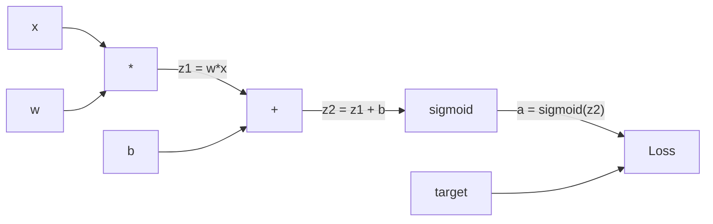
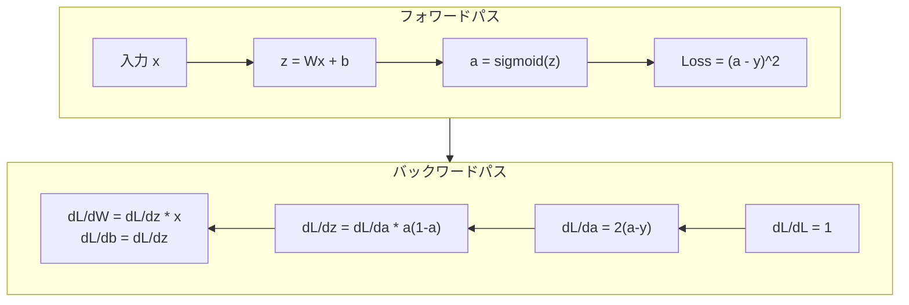
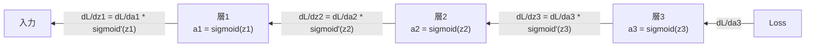

# バックプロパゲーションをゼロから

> バックプロパゲーションは学習を可能にするアルゴリズムだ。これがなければ、ニューラルネットワークはただの高価な乱数生成器に過ぎない。

**タイプ:** 構築
**言語:** Python
**前提条件:** レッスン03.02（多層ネットワーク）
**所要時間:** 約120分

## 学習目標

- 計算グラフを構築し、トポロジカルソートを通じて勾配を計算するValueベースのオートグラッドエンジンを実装する
- 連鎖律を使って加算、乗算、シグモイドのバックワードパスを導出する
- ゼロから構築したバックプロパゲーションエンジンのみを使って、XORと円分類で多層ネットワークを訓練する
- 深いシグモイドネットワークでの勾配消失問題を特定し、なぜ勾配が指数関数的に縮小するかを説明する

## 問題

ネットワークに768個の入力と3072個の出力を持つ単一の隠れ層がある。それは2,359,296個の重みを持つ。間違った予測をした。どの重みがエラーを引き起こしたか？各重みを個別にテストするには2.3百万のフォワードパスが必要だ。バックプロパゲーションは単一のバックワードパスですべての2.3百万の勾配を計算する。これは最適化ではない。訓練可能と不可能の差だ。

ナイーブなアプローチ：1つの重みを取り、わずかな量だけ微調整し、もう一度フォワードパスを実行し、損失が上がったか下がったかを測定する。これがその重みの勾配を与える。今度はネットワークのすべての重みに対してそれをやる。数千の訓練ステップと数百万のデータポイントで掛け算する。有用なものを訓練するには地質学的な時間が必要になる。

バックプロパゲーションはこれを解決する。1回のフォワードパス、1回のバックワードパス、すべての勾配が計算される。トリックは計算グラフに系統的に適用された微積分の連鎖律だ。これはディープラーニングを実用的にしたアルゴリズムだ。これがなければ、今もおもちゃの問題に行き詰まっていただろう。

## コンセプト

### ネットワークに適用された連鎖律

フェーズ01のレッスン05で連鎖律を見た。簡単なまとめ：y = f(g(x))ならば、dy/dx = f'(g(x)) * g'(x)。連鎖に沿って微分を掛け合わせる。

ニューラルネットワークでは、「連鎖」は入力から損失への操作の列だ。各層は重みを適用し、バイアスを加え、活性化を通す。損失関数は最終出力を目標と比較する。バックプロパゲーションはこの連鎖を逆向きにたどり、各操作がエラーにどのように寄与したかを計算する。

### 計算グラフ

すべてのフォワードパスはグラフを構築する。各ノードは操作（掛け算、足し算、シグモイド）だ。各エッジは前向きに値を運び、後ろ向きに勾配を運ぶ。



フォワードパス：値が左から右へ流れる。xとwはz1 = w*xを生成する。bを加えてz2を得る。シグモイドで活性化aを得る。aを目標yと損失関数で比較する。

バックワードパス：勾配が右から左へ流れる。dL/da（損失が活性化とともにどのように変わるか）から始める。da/dz2（シグモイドの微分）で掛け算する。これがdL/dz2を与える。dL/db（z2 = z1 + bなのでdL/dz2に等しい）とdL/dz1に分割する。次にdL/dw = dL/dz1 * xとdL/dx = dL/dz1 * w。

グラフ内のすべてのノードはバックワードパスで1つの仕事を持つ：上から来る勾配を取り、ローカル微分で掛け算し、下に渡す。

### フォワードとバックワード



フォワードパスはすべての中間値を保存する：z、a、各層への入力。バックワードパスは勾配を計算するためにこれらの保存値が必要だ。これがバックプロパゲーションの核心にある記憶-計算のトレードオフだ。メモリ（活性化の保存）を速度（数百万の代わりに1回のパス）と交換する。

### ネットワークを通じた勾配フロー

3層ネットワークでは、勾配がすべての層を通じて連鎖する：



各層で、勾配はシグモイドの微分で掛け算される。シグモイドの微分はa * (1 - a)で、a = 0.5のとき最大値0.25だ。3層深いと、勾配は最大でも0.25^3 = 0.0156で掛け算されている。10層深いと：0.25^10 = 0.000001。

### 勾配消失

これが勾配消失問題だ。シグモイドはその出力を0と1の間に押しつぶす。その微分は常に0.25未満だ。十分なシグモイド層を積み重ねると、勾配はゼロに縮小する。早い層はほぼゼロの勾配を受け取るため、ほとんど学習しない。

```
sigmoid(z):     出力範囲 [0, 1]
sigmoid'(z):    最大値 0.25 (z = 0のとき)

5層後：   gradient * 0.25^5 = 0.001x 元の値
10層後：  gradient * 0.25^10 = 0.000001x 元の値
```

これが深いシグモイドネットワークの訓練がほぼ不可能な理由だ。修正方法——ReLUとその変種——はレッスン04のテーマだ。今は、バックプロパゲーションが完璧に機能していることを理解する。問題はそれが何を通じて機能しているかだ。

### 2層ネットワークの勾配の導出

入力x、シグモイドを持つ隠れ層、シグモイドを持つ出力層、MSE損失を持つネットワークの具体的な数学。

フォワードパス：
```
z1 = W1 * x + b1
a1 = sigmoid(z1)
z2 = W2 * a1 + b2
a2 = sigmoid(z2)
L = (a2 - y)^2
```

バックワードパス（連鎖律をステップごとに適用）：
```
dL/da2 = 2(a2 - y)
da2/dz2 = a2 * (1 - a2)
dL/dz2 = dL/da2 * da2/dz2 = 2(a2 - y) * a2 * (1 - a2)

dL/dW2 = dL/dz2 * a1
dL/db2 = dL/dz2

dL/da1 = dL/dz2 * W2
da1/dz1 = a1 * (1 - a1)
dL/dz1 = dL/da1 * da1/dz1

dL/dW1 = dL/dz1 * x
dL/db1 = dL/dz1
```

すべての勾配は損失からたどられたローカル微分の積だ。これがバックプロパゲーションのすべてだ。

## 構築する

### ステップ1：Valueノード

計算内のすべての数値がValueになる。データ、勾配、どのように作成されたか（後ろ向きに勾配を計算する方法を知るために）を保存する。

```python
class Value:
    def __init__(self, data, children=(), op=''):
        self.data = data
        self.grad = 0.0
        self._backward = lambda: None
        self._children = set(children)
        self._op = op

    def __repr__(self):
        return f"Value(data={self.data:.4f}, grad={self.grad:.4f})"
```

勾配なし（0.0）。バックワード関数なし（ノーオペレーション）。`_children`はどのValueがこれを生成したかを追跡し、後でグラフをトポロジカルソートできるようにする。

### ステップ2：バックワード関数を持つ操作

各操作は新しいValueを作成し、勾配がどのように後ろ向きに流れるかを定義する。

```python
def __add__(self, other):
    other = other if isinstance(other, Value) else Value(other)
    out = Value(self.data + other.data, (self, other), '+')

    def _backward():
        self.grad += out.grad
        other.grad += out.grad

    out._backward = _backward
    return out

def __mul__(self, other):
    other = other if isinstance(other, Value) else Value(other)
    out = Value(self.data * other.data, (self, other), '*')

    def _backward():
        self.grad += other.data * out.grad
        other.grad += self.data * out.grad

    out._backward = _backward
    return out
```

加算の場合：d(a+b)/da = 1、d(a+b)/db = 1。したがって両方の入力が出力の勾配を直接受け取る。

乗算の場合：d(a*b)/da = b、d(a*b)/db = a。各入力は相手の値と出力の勾配の積を受け取る。

`+=`が重要だ。Valueは複数の操作で使用されることがある。その勾配はすべてのパスからの勾配の和だ。

### ステップ3：シグモイドと損失

```python
import math

def sigmoid(self):
    x = self.data
    x = max(-500, min(500, x))
    s = 1.0 / (1.0 + math.exp(-x))
    out = Value(s, (self,), 'sigmoid')

    def _backward():
        self.grad += (s * (1 - s)) * out.grad

    out._backward = _backward
    return out
```

シグモイドの微分：sigmoid(x) * (1 - sigmoid(x))。フォワードパス中にsigmoid(x) = sを計算した。再利用する。余計な作業は不要だ。

```python
def mse_loss(predicted, target):
    diff = predicted + Value(-target)
    return diff * diff
```

単一出力のMSE：(predicted - target)^2。減算を負のValueとの加算として表現する。

### ステップ4：バックワードパス

トポロジカルソートは正しい順序でノードを処理することを保証する——ノードの勾配は、それを通じて伝播する前に完全に蓄積される。

```python
def backward(self):
    topo = []
    visited = set()

    def build_topo(v):
        if v not in visited:
            visited.add(v)
            for child in v._children:
                build_topo(child)
            topo.append(v)

    build_topo(self)
    self.grad = 1.0
    for v in reversed(topo):
        v._backward()
```

損失から始まる（dL/dL = 1なので勾配 = 1.0）。ソートされたグラフを後ろ向きにたどる。各ノードの`_backward`が子に勾配を伝播する。

### ステップ5：LayerとNetwork

```python
import random

class Neuron:
    def __init__(self, n_inputs):
        scale = (2.0 / n_inputs) ** 0.5
        self.weights = [Value(random.uniform(-scale, scale)) for _ in range(n_inputs)]
        self.bias = Value(0.0)

    def __call__(self, x):
        act = sum((wi * xi for wi, xi in zip(self.weights, x)), self.bias)
        return act.sigmoid()

    def parameters(self):
        return self.weights + [self.bias]


class Layer:
    def __init__(self, n_inputs, n_outputs):
        self.neurons = [Neuron(n_inputs) for _ in range(n_outputs)]

    def __call__(self, x):
        out = [n(x) for n in self.neurons]
        return out[0] if len(out) == 1 else out

    def parameters(self):
        params = []
        for n in self.neurons:
            params.extend(n.parameters())
        return params


class Network:
    def __init__(self, sizes):
        self.layers = []
        for i in range(len(sizes) - 1):
            self.layers.append(Layer(sizes[i], sizes[i + 1]))

    def __call__(self, x):
        for layer in self.layers:
            x = layer(x)
            if not isinstance(x, list):
                x = [x]
        return x[0] if len(x) == 1 else x

    def parameters(self):
        params = []
        for layer in self.layers:
            params.extend(layer.parameters())
        return params

    def zero_grad(self):
        for p in self.parameters():
            p.grad = 0.0
```

ニューロンは入力を取り、重み付き和+バイアスを計算し、シグモイドを適用する。重みの初期化はより深いネットワークでシグモイドの飽和を防ぐために sqrt(2/n_inputs) でスケーリングされる。層はニューロンのリストだ。ネットワークは層のリストだ。`parameters()`メソッドはすべての学習可能なValueを収集して更新できるようにする。

### ステップ6：XORで訓練する

```python
random.seed(42)
net = Network([2, 4, 1])

xor_data = [
    ([0.0, 0.0], 0.0),
    ([0.0, 1.0], 1.0),
    ([1.0, 0.0], 1.0),
    ([1.0, 1.0], 0.0),
]

learning_rate = 1.0

for epoch in range(1000):
    total_loss = Value(0.0)
    for inputs, target in xor_data:
        x = [Value(i) for i in inputs]
        pred = net(x)
        loss = mse_loss(pred, target)
        total_loss = total_loss + loss

    net.zero_grad()
    total_loss.backward()

    for p in net.parameters():
        p.data -= learning_rate * p.grad

    if epoch % 100 == 0:
        print(f"Epoch {epoch:4d} | Loss: {total_loss.data:.6f}")

print("\nXOR Results:")
for inputs, target in xor_data:
    x = [Value(i) for i in inputs]
    pred = net(x)
    print(f"  {inputs} -> {pred.data:.4f} (expected {target})")
```

損失が減少するのを見る。ランダムな予測から正しいXOR出力へ、バックプロパゲーションが勾配を計算して重みを正しい方向に微調整することで完全に駆動される。

### ステップ7：円の分類

レッスン02では、円分類の重みを手動でチューニングした。今はネットワークがそれらを学習させる。

```python
random.seed(7)

def generate_circle_data(n=100):
    data = []
    for _ in range(n):
        x1 = random.uniform(-1.5, 1.5)
        x2 = random.uniform(-1.5, 1.5)
        label = 1.0 if x1 * x1 + x2 * x2 < 1.0 else 0.0
        data.append(([x1, x2], label))
    return data

circle_data = generate_circle_data(80)

circle_net = Network([2, 8, 1])
learning_rate = 0.5

for epoch in range(2000):
    random.shuffle(circle_data)
    total_loss_val = 0.0
    for inputs, target in circle_data:
        x = [Value(i) for i in inputs]
        pred = circle_net(x)
        loss = mse_loss(pred, target)
        circle_net.zero_grad()
        loss.backward()
        for p in circle_net.parameters():
            p.data -= learning_rate * p.grad
        total_loss_val += loss.data

    if epoch % 200 == 0:
        correct = 0
        for inputs, target in circle_data:
            x = [Value(i) for i in inputs]
            pred = circle_net(x)
            predicted_class = 1.0 if pred.data > 0.5 else 0.0
            if predicted_class == target:
                correct += 1
        accuracy = correct / len(circle_data) * 100
        print(f"Epoch {epoch:4d} | Loss: {total_loss_val:.4f} | Accuracy: {accuracy:.1f}%")
```

ここではオンラインSGDを使用する——フルバッチを蓄積する代わりに各サンプルの後に重みを更新する。これは対称性をより速く壊し、完全な損失ランドスケープでのシグモイド飽和を避ける。各エポックでデータをシャッフルすることで、ネットワークが順序を暗記するのを防ぐ。

手動チューニングなし。ネットワークは円形の決定境界を自分で発見する。これがバックプロパゲーションの力だ：アーキテクチャ、損失関数、データを定義する。アルゴリズムが重みを見つけ出す。

## 活用する

PyTorchは上記すべてを数行で行う。コアのアイデアは同一——オートグラッドはフォワードパス中に計算グラフを構築し、それを後ろ向きにたどって勾配を計算する。

```python
import torch
import torch.nn as nn

model = nn.Sequential(
    nn.Linear(2, 4),
    nn.Sigmoid(),
    nn.Linear(4, 1),
    nn.Sigmoid(),
)
optimizer = torch.optim.SGD(model.parameters(), lr=1.0)
criterion = nn.MSELoss()

X = torch.tensor([[0,0],[0,1],[1,0],[1,1]], dtype=torch.float32)
y = torch.tensor([[0],[1],[1],[0]], dtype=torch.float32)

for epoch in range(1000):
    pred = model(X)
    loss = criterion(pred, y)
    optimizer.zero_grad()
    loss.backward()
    optimizer.step()

print("PyTorch XOR Results:")
with torch.no_grad():
    for i in range(4):
        pred = model(X[i])
        print(f"  {X[i].tolist()} -> {pred.item():.4f} (expected {y[i].item()})")
```

`loss.backward()`は`total_loss.backward()`だ。`optimizer.step()`は手動の`p.data -= lr * p.grad`だ。`optimizer.zero_grad()`は`net.zero_grad()`だ。同じアルゴリズム、産業強度の実装。PyTorchはGPUアクセラレーション、混合精度、勾配チェックポインティング、数百種類の層タイプを処理する。しかしバックワードパスは同じ計算グラフに適用された同じ連鎖律だ。

訓練はフォワードパス、次にバックワードパス、次に重みを更新する。推論はフォワードパスのみ実行する。勾配なし、更新なし。この区別は重要で、推論が本番で起きることだからだ。ClaudeやGPTのようなAPIを呼び出すとき、推論を実行している——プロンプトがネットワークをフォワード方向に流れ、トークンが反対側から出てくる。重みは変わらない。バックプロパゲーションを理解することは重要で、それがそのネットワークのすべての重みを形成したからだ。

## 成果物

このレッスンで生成されるもの：
- `outputs/prompt-gradient-debugger.md` -- ニューラルネットワークの勾配問題（消失、爆発、NaN）を診断するための再利用可能なプロンプト

## 演習

1. Valueクラスに`__sub__`メソッドを追加する（a - b = a + (-1 * b)）。次に`__neg__`メソッドを実装する。(a - b)^2のような簡単な式の手動計算と比較して、勾配が正しいことを確認する。

2. Valueに`relu`メソッドを追加する（max(0, x)を出力、微分はx > 0なら1、そうでなければ0）。隠れ層でシグモイドをreluに置き換えてXORで再度訓練する。収束速度を比較する。より速い訓練が見られるはず——これはレッスン04のプレビューだ。

3. Valueに整数乗のための`__pow__`メソッドを実装する。それを使って`mse_loss`を適切な`(predicted - target) ** 2`式に置き換える。勾配が元の実装と一致することを確認する。

4. 訓練ループに勾配クリッピングを追加する：`backward()`を呼び出した後、すべての勾配を[-1, 1]にクリップする。4層以上のシグモイドネットワークを訓練し、クリッピングありとなしで損失曲線を比較する。これが爆発する勾配に対する最初の防御だ。

5. 視覚化を構築する：XORで訓練した後、ネットワークのすべてのパラメータの勾配を表示する。最小の勾配を持つ層を特定する。これはコンセプトセクションで読んだ勾配消失問題を実証する。

## 主要な用語

| 用語 | よく言われること | 実際の意味 |
|------|----------------|----------------------|
| バックプロパゲーション | 「ネットワークが学習する」 | 計算グラフを後ろ向きに連鎖律を適用することで、すべての重みのdL/dwを計算するアルゴリズム |
| 計算グラフ | 「ネットワーク構造」 | ノードが操作でエッジが値（前向き）と勾配（後ろ向き）を運ぶ有向非巡回グラフ |
| 連鎖律 | 「微分を掛け合わせる」 | y = f(g(x))ならば、dy/dx = f'(g(x)) * g'(x)——バックプロパゲーションの数学的基礎 |
| 勾配 | 「最急上昇の方向」 | 損失のパラメータに対する偏微分——損失を減らすためにそのパラメータをどう変えるかを教える |
| 勾配消失 | 「深いネットワークが学習しない」 | シグモイドのような飽和活性化を持つ層を通じて伝播すると、勾配が指数関数的に縮小する |
| フォワードパス | 「ネットワークを実行する」 | 各層の操作を順次適用して入力から出力を計算し、中間値を保存する |
| バックワードパス | 「勾配を計算する」 | 計算グラフを逆方向にたどり、連鎖律を使って各ノードで勾配を蓄積する |
| 学習率 | 「学習する速さ」 | 重みを更新するときのステップサイズを制御するスカラー：w_new = w_old - lr * gradient |
| トポロジカルソート | 「正しい順序」 | グラフノードの順序付けで、各ノードが依存するすべてのノードの後に現れる——伝播の前に勾配が完全に蓄積されることを保証する |
| オートグラッド | 「自動微分」 | フォワード計算中に計算グラフを構築し、自動的に勾配を計算するシステム——PyTorchのエンジンがやること |

## 参考文献

- Rumelhart, Hinton & Williams, "Learning representations by back-propagating errors" (1986) -- バックプロパゲーションを主流にし、多層ネットワーク訓練を解放した論文
- 3Blue1Brown, "Neural Networks" series (https://www.youtube.com/playlist?list=PLZHQObOWTQDNU6R1_67000Dx_ZCJB-3pi) -- ネットワークを通じたバックプロパゲーションと勾配フローの最良の視覚的説明
