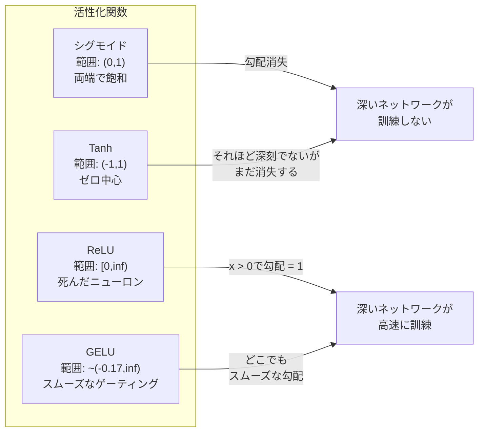
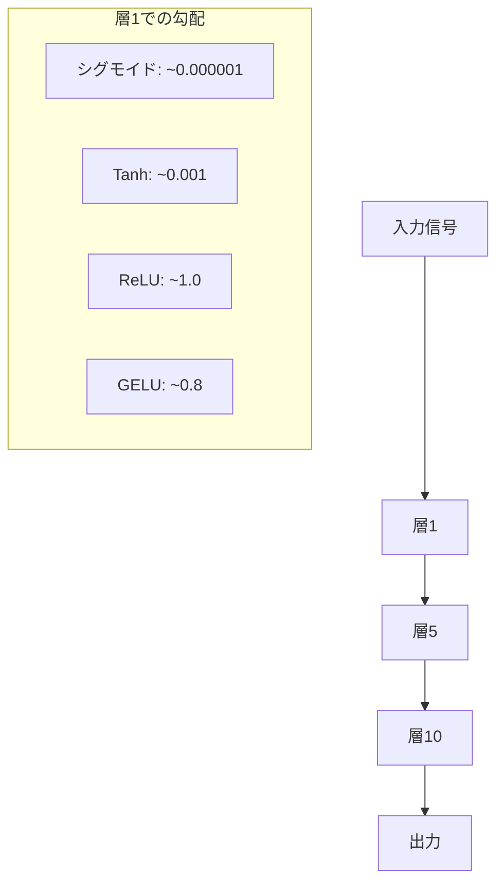
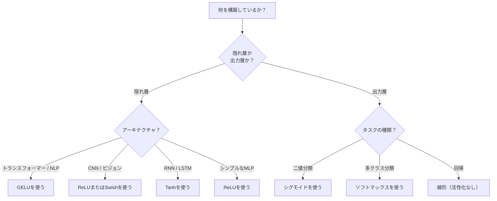

# 活性化関数

> 非線形性がなければ、100層のネットワークは派手な行列の掛け算に過ぎない。活性化関数はニューラルネットワークが曲線で考えられるようにするゲートだ。

**タイプ:** 構築
**言語:** Python
**前提条件:** レッスン03.03（バックプロパゲーション）
**所要時間:** 約75分

## 学習目標

- シグモイド、tanh、ReLU、Leaky ReLU、GELU、Swish、softmaxとその微分をゼロから実装する
- 10層以上でのさまざまな活性化の活性化の大きさを測定することで、勾配消失問題を診断する
- ReLUネットワークで死んだニューロンを検出し、GELUがこの失敗モードを避ける理由を説明する
- 与えられたアーキテクチャ（トランスフォーマー、CNN、RNN、出力層）に正しい活性化関数を選択する

## 問題

2つの線形変換を積み重ねる：y = W2(W1x + b1) + b2。展開すると：y = W2W1x + W2b1 + b2。これは単にy = Ax + c——単一の線形変換だ。いくつの線形層を積み重ねても、結果は1つの行列の掛け算に収まる。100層のネットワークは単一層と同じ表現力を持つ。

これは理論的な珍奇性ではない。深い線形ネットワークはXORを文字通り学習できず、螺旋データセットを分類できず、顔を認識できないことを意味する。活性化関数がなければ、深さは幻想だ。

活性化関数は線形性を破る。各層の出力を非線形関数で歪め、ネットワークに決定境界を曲げ、任意の関数を近似し、実際に学習する能力を与える。しかし間違った活性化を選ぶと、勾配がゼロに消える（深いネットワークのシグモイド）、無限に爆発する（慎重な初期化なしの無制限活性化）、またはニューロンが永久に死ぬ（大きな負のバイアスを持つReLU）。活性化関数の選択はネットワークがまったく学習するかどうかを直接決定する。

## コンセプト

### なぜ非線形性が必要か

行列の掛け算は合成可能だ。ベクトルを行列Aで掛け算してから行列Bで掛け算することは、ABで掛け算することと同一だ。これは10個の線形層を積み重ねることが、数学的に1つの大きな行列を持つ1つの線形層に等しいことを意味する。それらすべてのパラメータ、すべての深さ——無駄だ。連鎖を破るものが必要だ。それが活性化関数がすることだ。

ここに証明がある。線形層はf(x) = Wx + bを計算する。2つを積み重ねる：

```
層1: h = W1 * x + b1
層2: y = W2 * h + b2
```

代入する：

```
y = W2 * (W1 * x + b1) + b2
y = (W2 * W1) * x + (W2 * b1 + b2)
y = A * x + c
```

1つの層だ。非線形活性化g()を層間に挿入する：

```
h = g(W1 * x + b1)
y = W2 * h + b2
```

今は代入が壊れる。W2 * g(W1 * x + b1) + b2は単一の線形変換に還元できない。ネットワークは非線形関数を表現できる。活性化を持つ各追加層が表現能力を追加する。

### シグモイド

ニューラルネットワークのオリジナル活性化関数。

```
sigmoid(x) = 1 / (1 + e^(-x))
```

出力範囲：(0, 1)。滑らかで微分可能、任意の実数を確率に似た値に写像する。

微分：

```
sigmoid'(x) = sigmoid(x) * (1 - sigmoid(x))
```

この微分の最大値は0.25で、x = 0のときに発生する。バックプロパゲーションでは、勾配は層を通じて掛け算される。10層のシグモイドは勾配が最大でも0.25を10回掛け算されることを意味する：

```
0.25^10 = 0.000000953674
```

元の信号の100万分の1未満。これが勾配消失問題だ。早い層の勾配が非常に小さくなり、重みがほとんど更新されない。ネットワークは学習しているように見える——後の層の損失は減少する——しかし最初の層は凍っている。深いシグモイドネットワークは単純に訓練しない。

追加の問題：シグモイドの出力は常に正（0から1）であり、重みの勾配は常に同じ符号を持つ。これにより勾配降下中にジグザグが起きる。

### Tanh

シグモイドの中心化バージョン。

```
tanh(x) = (e^x - e^(-x)) / (e^x + e^(-x))
```

出力範囲：(-1, 1)。ゼロ中心化されており、ジグザグ問題を排除する。

微分：

```
tanh'(x) = 1 - tanh(x)^2
```

x = 0での最大微分は1.0——シグモイドの4倍良い。しかし勾配消失問題はまだ存在する。大きな正または負の入力に対して、微分はゼロに近づく。10層はまだ勾配を押しつぶすが、それほど積極的ではない。

### ReLU：ブレークスルー

Rectified Linear Unit（整流線形ユニット）。2010年にNairとHintonによってディープラーニング向けに普及された（関数自体は福島の1969年の研究に遡る）、すべてを変えた。

```
relu(x) = max(0, x)
```

出力範囲：[0, 無限大)。微分は自明にシンプルだ：

```
relu'(x) = 1  if x > 0
            0  if x <= 0
```

正の入力に対して勾配消失がない。勾配はちょうど1で、まっすぐ通る。これが深いネットワークが訓練可能になった理由だ——ReLUは層を通じて勾配の大きさを保存する。

しかし失敗モードがある：死んだニューロン問題。ニューロンの重み付き入力が常に負（大きな負のバイアスや運の悪い重みの初期化による）の場合、その出力は常にゼロ、勾配は常にゼロ、更新は永遠にない。永久に死んでいる。実際には、ReLUネットワークのニューロンの10-40%が訓練中に死ぬことがある。

### Leaky ReLU

死んだニューロンのための最もシンプルな修正。

```
leaky_relu(x) = x        if x > 0
                alpha * x if x <= 0
```

alphaは小さな定数で、通常0.01。負の側には勾配信号がまだ来る小さな傾きがあり、死んだニューロンも回復できる。

### GELU：現代のデフォルト

Gaussian Error Linear Unit（ガウス誤差線形ユニット）。2016年にHendrycksとGimpelによって導入された。BERT、GPT、ほとんどの現代のトランスフォーマーのデフォルト活性化。

```
gelu(x) = x * Phi(x)
```

Phi(x)は標準正規分布の累積分布関数。実際に使われる近似：

```
gelu(x) ~= 0.5 * x * (1 + tanh(sqrt(2/pi) * (x + 0.044715 * x^3)))
```

GELUはどこでも滑らかで、（ゼロにハードクリップするReLUとは異なり）小さな負の値を許容し、確率的解釈を持つ：ガウス分布の下で正である確率で各入力を重み付けする。このスムーズなゲーティングはトランスフォーマーアーキテクチャでReLUを上回るパフォーマンスを発揮し、より良い勾配フローを提供し、死んだニューロン問題を完全に回避する。

### Swish / SiLU

2017年にRamachandranらによる自動化探索で発見された自己ゲート型活性化。

```
swish(x) = x * sigmoid(x)
```

SwishはTensorFlowではSiLU（Sigmoid Linear Unit）とも呼ばれる。Googleが活性化関数空間の自動探索によって発見した——ニューラルネットワークがニューラルネットワークの一部を設計している。

GELUと同様に、滑らかで非単調で、小さな負の値を許容する。違いは微妙で、Swishはゲーティングにシグモイドを使い、GELUはガウスCDFを使う。実際には性能はほぼ同一だ。SwishはEfficientNetと一部のビジョンモデルで使われる。GELUは言語モデルで支配的だ。

### ソフトマックス：出力活性化

隠れ層では使わない。ソフトマックスは生のスコア（ロジット）のベクトルを確率分布に変換する。

```
softmax(x_i) = e^(x_i) / sum(e^(x_j) for all j)
```

すべての出力は0と1の間。すべての出力の合計は1。これにより多クラス分類の標準的な最終活性化となる。最大のロジットが最高確率を得るが、argmaxとは異なり、ソフトマックスは微分可能で相対的な信頼度についての情報を保存する。

### 形状の比較



### 勾配フローの比較



### どの活性化をいつ使うか



## 構築する

### ステップ1：微分付きですべての活性化関数を実装する

各関数は単一の浮動小数点数を取り、浮動小数点数を返す。各微分関数は同じ入力を取り、勾配を返す。

```python
import math

def sigmoid(x):
    x = max(-500, min(500, x))
    return 1.0 / (1.0 + math.exp(-x))

def sigmoid_derivative(x):
    s = sigmoid(x)
    return s * (1 - s)

def tanh_act(x):
    return math.tanh(x)

def tanh_derivative(x):
    t = math.tanh(x)
    return 1 - t * t

def relu(x):
    return max(0.0, x)

def relu_derivative(x):
    return 1.0 if x > 0 else 0.0

def leaky_relu(x, alpha=0.01):
    return x if x > 0 else alpha * x

def leaky_relu_derivative(x, alpha=0.01):
    return 1.0 if x > 0 else alpha

def gelu(x):
    return 0.5 * x * (1 + math.tanh(math.sqrt(2 / math.pi) * (x + 0.044715 * x ** 3)))

def gelu_derivative(x):
    phi = 0.5 * (1 + math.erf(x / math.sqrt(2)))
    pdf = math.exp(-0.5 * x * x) / math.sqrt(2 * math.pi)
    return phi + x * pdf

def swish(x):
    return x * sigmoid(x)

def swish_derivative(x):
    s = sigmoid(x)
    return s + x * s * (1 - s)

def softmax(xs):
    max_x = max(xs)
    exps = [math.exp(x - max_x) for x in xs]
    total = sum(exps)
    return [e / total for e in exps]
```

### ステップ2：勾配が消える場所を可視化する

-5から5まで等間隔の100点で勾配を計算する。各活性化の勾配がほぼゼロになる場所を示すテキストヒストグラムを表示する。

```python
def gradient_scan(name, derivative_fn, start=-5, end=5, n=100):
    step = (end - start) / n
    near_zero = 0
    healthy = 0
    for i in range(n):
        x = start + i * step
        g = derivative_fn(x)
        if abs(g) < 0.01:
            near_zero += 1
        else:
            healthy += 1
    pct_dead = near_zero / n * 100
    print(f"{name:15s}: {healthy:3d} healthy, {near_zero:3d} near-zero ({pct_dead:.0f}% dead zone)")

gradient_scan("Sigmoid", sigmoid_derivative)
gradient_scan("Tanh", tanh_derivative)
gradient_scan("ReLU", relu_derivative)
gradient_scan("Leaky ReLU", leaky_relu_derivative)
gradient_scan("GELU", gelu_derivative)
gradient_scan("Swish", swish_derivative)
```

### ステップ3：勾配消失実験

シグモイドとReLUを使ってN層を通じて信号をフォワードパスする。活性化の大きさがどのように変化するかを測定する。

```python
import random

def vanishing_gradient_experiment(activation_fn, name, n_layers=10, n_inputs=5):
    random.seed(42)
    values = [random.gauss(0, 1) for _ in range(n_inputs)]

    print(f"\n{name} through {n_layers} layers:")
    for layer in range(n_layers):
        weights = [random.gauss(0, 1) for _ in range(n_inputs)]
        z = sum(w * v for w, v in zip(weights, values))
        activated = activation_fn(z)
        magnitude = abs(activated)
        bar = "#" * int(magnitude * 20)
        print(f"  Layer {layer+1:2d}: magnitude = {magnitude:.6f} {bar}")
        values = [activated] * n_inputs

vanishing_gradient_experiment(sigmoid, "Sigmoid")
vanishing_gradient_experiment(relu, "ReLU")
vanishing_gradient_experiment(gelu, "GELU")
```

### ステップ4：死んだニューロン検出器

ReLUネットワークを作成し、ランダムな入力を通過させ、一度も発火しないニューロンをカウントする。

```python
def dead_neuron_detector(n_inputs=5, hidden_size=20, n_samples=1000):
    random.seed(0)
    weights = [[random.gauss(0, 1) for _ in range(n_inputs)] for _ in range(hidden_size)]
    biases = [random.gauss(0, 1) for _ in range(hidden_size)]

    fire_counts = [0] * hidden_size

    for _ in range(n_samples):
        inputs = [random.gauss(0, 1) for _ in range(n_inputs)]
        for neuron_idx in range(hidden_size):
            z = sum(w * x for w, x in zip(weights[neuron_idx], inputs)) + biases[neuron_idx]
            if relu(z) > 0:
                fire_counts[neuron_idx] += 1

    dead = sum(1 for c in fire_counts if c == 0)
    rarely_fire = sum(1 for c in fire_counts if 0 < c < n_samples * 0.05)
    healthy = hidden_size - dead - rarely_fire

    print(f"\nDead Neuron Report ({hidden_size} neurons, {n_samples} samples):")
    print(f"  Dead (never fired):     {dead}")
    print(f"  Barely alive (<5%):     {rarely_fire}")
    print(f"  Healthy:                {healthy}")
    print(f"  Dead neuron rate:       {dead/hidden_size*100:.1f}%")

    for i, c in enumerate(fire_counts):
        status = "DEAD" if c == 0 else "WEAK" if c < n_samples * 0.05 else "OK"
        bar = "#" * (c * 40 // n_samples)
        print(f"  Neuron {i:2d}: {c:4d}/{n_samples} fires [{status:4s}] {bar}")

dead_neuron_detector()
```

### ステップ5：訓練比較——シグモイド vs ReLU vs GELU

3つの異なる活性化で円データセット（円の内側の点 = クラス1、外側 = クラス0）に同じ2層ネットワークを訓練する。収束速度を比較する。

```python
def make_circle_data(n=200, seed=42):
    random.seed(seed)
    data = []
    for _ in range(n):
        x = random.uniform(-2, 2)
        y = random.uniform(-2, 2)
        label = 1.0 if x * x + y * y < 1.5 else 0.0
        data.append(([x, y], label))
    return data


class ActivationNetwork:
    def __init__(self, activation_fn, activation_deriv, hidden_size=8, lr=0.1):
        random.seed(0)
        self.act = activation_fn
        self.act_d = activation_deriv
        self.lr = lr
        self.hidden_size = hidden_size

        self.w1 = [[random.gauss(0, 0.5) for _ in range(2)] for _ in range(hidden_size)]
        self.b1 = [0.0] * hidden_size
        self.w2 = [random.gauss(0, 0.5) for _ in range(hidden_size)]
        self.b2 = 0.0

    def forward(self, x):
        self.x = x
        self.z1 = []
        self.h = []
        for i in range(self.hidden_size):
            z = self.w1[i][0] * x[0] + self.w1[i][1] * x[1] + self.b1[i]
            self.z1.append(z)
            self.h.append(self.act(z))

        self.z2 = sum(self.w2[i] * self.h[i] for i in range(self.hidden_size)) + self.b2
        self.out = sigmoid(self.z2)
        return self.out

    def backward(self, target):
        error = self.out - target
        d_out = error * self.out * (1 - self.out)

        for i in range(self.hidden_size):
            d_h = d_out * self.w2[i] * self.act_d(self.z1[i])
            self.w2[i] -= self.lr * d_out * self.h[i]
            for j in range(2):
                self.w1[i][j] -= self.lr * d_h * self.x[j]
            self.b1[i] -= self.lr * d_h
        self.b2 -= self.lr * d_out

    def train(self, data, epochs=200):
        losses = []
        for epoch in range(epochs):
            total_loss = 0
            correct = 0
            for x, y in data:
                pred = self.forward(x)
                self.backward(y)
                total_loss += (pred - y) ** 2
                if (pred >= 0.5) == (y >= 0.5):
                    correct += 1
            avg_loss = total_loss / len(data)
            accuracy = correct / len(data) * 100
            losses.append(avg_loss)
            if epoch % 50 == 0 or epoch == epochs - 1:
                print(f"    Epoch {epoch:3d}: loss={avg_loss:.4f}, accuracy={accuracy:.1f}%")
        return losses


data = make_circle_data()

configs = [
    ("Sigmoid", sigmoid, sigmoid_derivative),
    ("ReLU", relu, relu_derivative),
    ("GELU", gelu, gelu_derivative),
]

results = {}
for name, act_fn, act_d_fn in configs:
    print(f"\n=== Training with {name} ===")
    net = ActivationNetwork(act_fn, act_d_fn, hidden_size=8, lr=0.1)
    losses = net.train(data, epochs=200)
    results[name] = losses

print("\n=== Final Loss Comparison ===")
for name, losses in results.items():
    print(f"  {name:10s}: start={losses[0]:.4f} -> end={losses[-1]:.4f} (improvement: {(1 - losses[-1]/losses[0])*100:.1f}%)")
```

## 活用する

PyTorchはすべてを関数形式とモジュール形式で提供する：

```python
import torch
import torch.nn as nn
import torch.nn.functional as F

x = torch.randn(4, 10)

relu_out = F.relu(x)
gelu_out = F.gelu(x)
sigmoid_out = torch.sigmoid(x)
swish_out = F.silu(x)

logits = torch.randn(4, 5)
probs = F.softmax(logits, dim=1)

model = nn.Sequential(
    nn.Linear(10, 64),
    nn.GELU(),
    nn.Linear(64, 32),
    nn.GELU(),
    nn.Linear(32, 5),
)
```

トランスフォーマーの隠れ層：GELU。CNNの隠れ層：ReLU。分類の出力層：ソフトマックス。回帰の出力層：なし（線形）。確率の出力層：シグモイド。それだけだ。これらのデフォルトから始める。証拠がある場合のみ変更する。

RNNとLSTMは隠れ状態にtanh、ゲートにシグモイドを使うが、今日ゼロから構築しているならおそらくRNNを使っていない。ReLUネットワークでニューロンが死んでいるなら、GELUに切り替える。特定の理由がない限りLeaky ReLUに手を伸ばさないこと——GELUは死んだニューロン問題を解決し、より良い勾配フローを提供する。

## 成果物

このレッスンで生成されるもの：
- `outputs/prompt-activation-selector.md` -- 任意のアーキテクチャに正しい活性化関数を選ぶための再利用可能なプロンプト

## 演習

1. 負の傾きalphaが学習可能なパラメータであるParametric ReLU（PReLU）を実装する。円データセットで訓練し、固定Leaky ReLUと比較する。

2. 10層ではなく50層で勾配消失実験を実行する。シグモイド、tanh、ReLU、GELUの各層での大きさをプロットする。各活性化の信号がどの層で実質的にゼロに達するか？

3. ELU（指数線形ユニット）を実装する：x > 0ならx、x <= 0ならalpha * (e^x - 1)。同じネットワークでReLUと比べた死んだニューロン率を比較する。

4. 訓練中に実行する「勾配ヘルスモニター」を構築する：各エポックで各層の平均勾配の大きさを計算する。任意の層の勾配が0.001を下回るか100を超えると警告を表示する。

5. 訓練比較を円の代わりにレッスン01のXORデータセットを使うように修正する。XORでどの活性化が最も速く収束するか？なぜ円の結果と異なるのか？

## 主要な用語

| 用語 | よく言われること | 実際の意味 |
|------|----------------|----------------------|
| 活性化関数 | 「非線形部分」 | 各ニューロンの出力に適用される関数で線形性を破り、ネットワークが非線形写像を学習できるようにする |
| 勾配消失 | 「深いネットワークで勾配が消える」 | 活性化の微分が1未満の場合、勾配が層を通じて指数関数的に縮小し、早い層が訓練不能になる |
| 勾配爆発 | 「勾配が爆発する」 | 実効乗数が1を超えると勾配が層を通じて指数関数的に増大し、不安定な訓練を引き起こす |
| 死んだニューロン | 「学習を止めたニューロン」 | 入力が常に負で、ゼロの出力とゼロの勾配を生成するReLUニューロン |
| シグモイド | 「値を0-1に押しつぶす」 | ロジスティック関数1/(1+e^-x)、歴史的に重要だが深いネットワークで勾配消失を引き起こす |
| ReLU | 「負の値をゼロにクリップする」 | max(0, x)——勾配の大きさを保存することでディープラーニングを実用的にした活性化 |
| GELU | 「トランスフォーマーの活性化」 | Gaussian Error Linear Unit、正である確率で入力を重み付けする滑らかな活性化 |
| Swish/SiLU | 「自己ゲート型ReLU」 | x * sigmoid(x)、自動化探索で発見、EfficientNetで使用 |
| ソフトマックス | 「スコアを確率に変換する」 | ロジットのベクトルをすべての値が(0,1)にあって合計が1になる確率分布に正規化する |
| Leaky ReLU | 「死なないReLU」 | max(alpha*x, x)でalphaは小さい（0.01）、小さな負の勾配を許すことで死んだニューロンを防ぐ |
| 飽和 | 「シグモイドの平坦部分」 | 活性化の微分がゼロに近づく領域、勾配フローをブロックする |
| ロジット | 「ソフトマックス前の生のスコア」 | ソフトマックスまたはシグモイドを適用する前の最終層の正規化されていない出力 |

## 参考文献

- Nair & Hinton, "Rectified Linear Units Improve Restricted Boltzmann Machines" (2010) -- ReLUを導入し深いネットワークの訓練を可能にした論文
- Hendrycks & Gimpel, "Gaussian Error Linear Units (GELUs)" (2016) -- トランスフォーマーのデフォルトになった活性化関数を導入
- Ramachandran et al., "Searching for Activation Functions" (2017) -- 自動化探索でSwishを発見し、活性化設計が自動化できることを示した
- Glorot & Bengio, "Understanding the difficulty of training deep feedforward neural networks" (2010) -- 勾配消失/爆発を診断し、Xavier初期化を提案した論文
- Goodfellow, Bengio, Courville, "Deep Learning" Chapter 6.3 (https://www.deeplearningbook.org/) -- 隠れユニットと活性化関数の厳密な扱い
