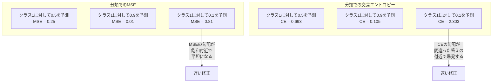
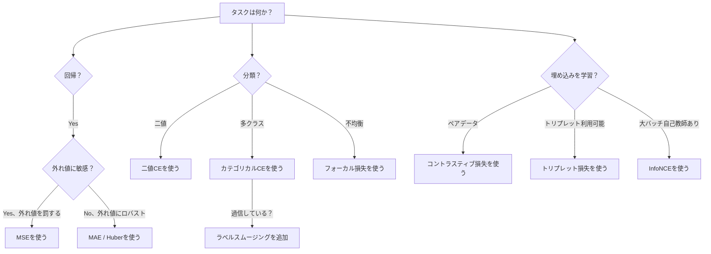
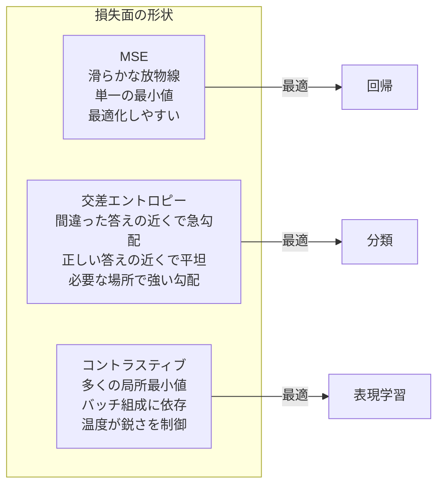

# 損失関数

> ネットワークが予測をする。正解はそうでないと言う。どれほど間違っているか？その数値が損失だ。間違った損失関数を選ぶと、モデルはまったく間違ったことを最適化する。

**タイプ:** 構築
**言語:** Python
**前提条件:** レッスン03.04（活性化関数）
**所要時間:** 約75分

## 学習目標

- MSE、二値交差エントロピー、カテゴリカル交差エントロピー、コントラスティブ損失（InfoNCE）をゼロから勾配付きで実装する
- 「すべてに対して0.5を予測する」失敗モードを実証することで、なぜMSEが分類に失敗するかを説明する
- 交差エントロピーにラベルスムージングを適用し、過信した予測をどのように防ぐかを説明する
- 回帰、二値分類、多クラス分類、埋め込み学習タスクに正しい損失関数を選択する

## 問題

分類問題でMSEを最小化するモデルは、すべてに対して自信を持って0.5を予測する。損失を最小化している。同時に役に立たない。

損失関数はモデルが実際に最適化する唯一のものだ。精度ではない。F1スコアではない。マネージャーに報告するどんな指標でもない。オプティマイザは損失関数の勾配を取って、その数値を小さくするために重みを調整する。損失関数があなたが気にしていることを捉えていなければ、モデルはそれを満たすために数学的に最も安いやり方を見つける。そしてそのやり方はあなたが望んだものとはほぼ決して一致しない。

具体的な例を挙げる。二値分類タスクがある。2クラス、50/50の分割。損失としてMSEを使う。モデルはすべての入力に対して0.5を予測する。平均MSEは0.25で、実際に何も学習せずに達成できる最小値だ。モデルは識別能力がゼロだが、技術的には損失関数を最小化している。交差エントロピーに切り替えると、同じモデルが予測を0または1に向けて押し出すよう強制される。なぜなら-log(0.5) = 0.693はひどい損失であり、-log(0.99) = 0.01は自信のある正解予測に報酬を与えるからだ。損失関数の選択は、学習するモデルと指標をゲームするモデルの違いだ。

さらに悪化する。自己教師あり学習では、ラベルすらない。コントラスティブ損失は学習信号を完全に定義する：何が類似していて、何が異なっていて、モデルがどれほど強く押し離すべきかを。コントラスティブ損失を間違えると、埋め込みが単一の点に崩壊する——すべての入力が同じベクトルに写像される。技術的にはゼロの損失。完全に役に立たない。

## コンセプト

### 平均二乗誤差（MSE）

回帰のデフォルト。予測と目標の二乗差を計算し、すべてのサンプルで平均する。

```
MSE = (1/n) * sum((y_pred - y_true)^2)
```

なぜ二乗するか：大きなエラーを二次関数的に罰する。エラーが2のコストは、エラーが1のコストの4倍。エラーが10のコストは100倍。これがMSEを外れ値に対して敏感にする——単一の大きく間違った予測が損失を支配する。

実際の数値：モデルが住宅価格を予測していて、ほとんどの家で1万ドルずれているが、ある豪邸で20万ドルずれている場合、MSEはその豪邸を積極的に修正しようとし、他の99軒の性能を損なう可能性がある。

予測に関するMSEの勾配：

```
dMSE/dy_pred = (2/n) * (y_pred - y_true)
```

エラーに対して線形だ。大きなエラーが大きな勾配を得る。これは回帰の特徴（大きなエラーには大きな修正が必要）であり、分類のバグだ（自信を持って間違った答えを指数関数的に罰したい、線形ではなく）。

### 交差エントロピー損失

分類の損失関数。情報理論に根ざしており——予測確率分布と真の分布の乖離を測定する。

**二値交差エントロピー（BCE）：**

```
BCE = -(y * log(p) + (1 - y) * log(1 - p))
```

ここでyは真のラベル（0または1）、pは予測確率だ。

なぜ-log(p)が機能するか：真のラベルが1でp = 0.99を予測すると、損失は-log(0.99) = 0.01。p = 0.01を予測すると、損失は-log(0.01) = 4.6。この460倍の差が交差エントロピーが機能する理由だ。自信を持って間違った予測を残酷に罰し、自信を持って正しい予測をほとんど罰しない。

勾配も同じ話をしている：

```
dBCE/dp = -(y/p) + (1-y)/(1-p)
```

y = 1でpがゼロに近いとき、勾配は-1/pで負の無限大に近づく。モデルは間違いを修正するための大きな信号を受け取る。pが1に近いとき、勾配は小さい。すでに正しく、修正するものがない。

**カテゴリカル交差エントロピー：**

one-hotエンコードされた目標を持つ多クラス分類。

```
CCE = -sum(y_i * log(p_i))
```

真のクラスのみが損失に寄与する（他のすべてのy_iはゼロだから）。10クラスがあって正しいクラスが確率0.1（ランダム推測）を得ると、損失は-log(0.1) = 2.3。正しいクラスが確率0.9を得ると、損失は-log(0.9) = 0.105。モデルは正しい答えに確率を集中させることを学習する。

### なぜMSEが分類に失敗するか



MSEの勾配は予測が0または1に近いとき平坦になる（シグモイド飽和による）。交差エントロピーの勾配はこれを補償する——-logがシグモイドの平坦な領域をキャンセルし、最も必要な場所で強い勾配を与える。

### ラベルスムージング

標準的なone-hotラベルは「これは100%クラス3で、他はすべて0%だ」と言う。それは強い主張だ。ラベルスムージングはそれを和らげる：

```
smooth_label = (1 - alpha) * one_hot + alpha / num_classes
```

alpha = 0.1で10クラスの場合：[0, 0, 1, 0, ...]の代わりに目標は[0.01, 0.01, 0.91, 0.01, ...]になる。モデルは1.0の代わりに0.91を目標にする。

なぜこれが機能するか：ソフトマックスを通じて正確に1.0を出力しようとするモデルはロジットを無限大に押す必要がある。これは過信を引き起こし、汎化を損ない、分布シフトに対してモデルを脆弱にする。ラベルスムージングは目標を0.9にキャップし（alpha=0.1の場合）、ロジットを合理的な範囲に保つ。GPTとほとんどの現代のモデルはラベルスムージングまたはその等価物を使う。

### コントラスティブ損失

ラベルなし。クラスなし。ただ入力のペアと問い：これらは類似しているか異なるか？

**SimCLRスタイルのコントラスティブ損失（NT-Xent / InfoNCE）：**

1つの画像を取る。それの2つの拡張ビューを作成する（クロップ、回転、カラージッター）。これらが「ポジティブペア」——類似した埋め込みを持つべき。バッチの他のすべての画像が「ネガティブペア」——異なる埋め込みを持つべき。

```
L = -log(exp(sim(z_i, z_j) / tau) / sum(exp(sim(z_i, z_k) / tau)))
```

sim()はコサイン類似度、z_iとz_jはポジティブペア、sumはすべてのネガティブにわたり、tau（温度）は分布がどれほど鋭いかを制御する。低い温度 = より難しいネガティブ = より積極的な分離。

実際の数値：バッチサイズ256はポジティブペアごとに255のネガティブを意味する。温度tau = 0.07（SimCLRのデフォルト）。損失は類似度に対するソフトマックスのように見える——ポジティブペアの類似度が256の選択肢の中で最も高くなることを望む。

**トリプレット損失：**

3つの入力を取る：アンカー、ポジティブ（同じクラス）、ネガティブ（異なるクラス）。

```
L = max(0, d(anchor, positive) - d(anchor, negative) + margin)
```

マージン（通常0.2-1.0）はポジティブとネガティブの距離の間に最小ギャップを強制する。ネガティブがすでに十分遠ければ、損失はゼロ——勾配なし、更新なし。これにより訓練が効率的になるが、注意深いトリプレットマイニング（アンカーに近い難しいネガティブを選ぶ）が必要だ。

### フォーカル損失

不均衡データセット向け。標準的な交差エントロピーはすべての正しく分類された例を均等に扱う。フォーカル損失は簡単な例の重みを下げる：

```
FL = -alpha * (1 - p_t)^gamma * log(p_t)
```

p_tは真のクラスの予測確率で、gammaはフォーカシングを制御する。gamma = 0の場合、標準的な交差エントロピーと同じ。gamma = 2（デフォルト）の場合：

- 簡単な例（p_t = 0.9）：重み = (0.1)^2 = 0.01。実質的に無視される。
- 難しい例（p_t = 0.1）：重み = (0.9)^2 = 0.81。完全な勾配信号。

フォーカル損失はLinらによって物体検出のために導入された。候補領域の99%が背景（簡単なネガティブ）の場合。フォーカル損失がなければ、モデルは簡単な背景例に溺れ、物体を検出することを学習しない。あれば、モデルは重要な難しくて曖昧なケースに容量を集中させる。

### 損失関数の決定木



### 損失ランドスケープ



## 構築する

### ステップ1：MSEとその勾配

```python
def mse(predictions, targets):
    n = len(predictions)
    total = 0.0
    for p, t in zip(predictions, targets):
        total += (p - t) ** 2
    return total / n

def mse_gradient(predictions, targets):
    n = len(predictions)
    grads = []
    for p, t in zip(predictions, targets):
        grads.append(2.0 * (p - t) / n)
    return grads
```

### ステップ2：二値交差エントロピー

log(0)の問題は実在する。モデルが陽性の例に対して正確に0を予測すると、log(0) = 負の無限大。クリッピングがこれを防ぐ。

```python
import math

def binary_cross_entropy(predictions, targets, eps=1e-15):
    n = len(predictions)
    total = 0.0
    for p, t in zip(predictions, targets):
        p_clipped = max(eps, min(1 - eps, p))
        total += -(t * math.log(p_clipped) + (1 - t) * math.log(1 - p_clipped))
    return total / n

def bce_gradient(predictions, targets, eps=1e-15):
    grads = []
    for p, t in zip(predictions, targets):
        p_clipped = max(eps, min(1 - eps, p))
        grads.append(-(t / p_clipped) + (1 - t) / (1 - p_clipped))
    return grads
```

### ステップ3：ソフトマックス付きカテゴリカル交差エントロピー

ソフトマックスは生のロジットを確率に変換する。次にone-hot目標に対して交差エントロピーを計算する。

```python
def softmax(logits):
    max_val = max(logits)
    exps = [math.exp(x - max_val) for x in logits]
    total = sum(exps)
    return [e / total for e in exps]

def categorical_cross_entropy(logits, target_index, eps=1e-15):
    probs = softmax(logits)
    p = max(eps, probs[target_index])
    return -math.log(p)

def cce_gradient(logits, target_index):
    probs = softmax(logits)
    grads = list(probs)
    grads[target_index] -= 1.0
    return grads
```

ソフトマックス+交差エントロピーの勾配は美しく簡略化される：真のクラスでは（予測確率 - 1）、他のすべてのクラスでは（予測確率）。このエレガントな簡略化は偶然ではない——ソフトマックスと交差エントロピーがペアになる理由だ。

### ステップ4：ラベルスムージング

```python
def label_smoothed_cce(logits, target_index, num_classes, alpha=0.1, eps=1e-15):
    probs = softmax(logits)
    loss = 0.0
    for i in range(num_classes):
        if i == target_index:
            smooth_target = 1.0 - alpha + alpha / num_classes
        else:
            smooth_target = alpha / num_classes
        p = max(eps, probs[i])
        loss += -smooth_target * math.log(p)
    return loss
```

### ステップ5：コントラスティブ損失（簡略化されたInfoNCE）

```python
def cosine_similarity(a, b):
    dot = sum(x * y for x, y in zip(a, b))
    norm_a = math.sqrt(sum(x * x for x in a))
    norm_b = math.sqrt(sum(x * x for x in b))
    if norm_a < 1e-10 or norm_b < 1e-10:
        return 0.0
    return dot / (norm_a * norm_b)

def contrastive_loss(anchor, positive, negatives, temperature=0.07):
    sim_pos = cosine_similarity(anchor, positive) / temperature
    sim_negs = [cosine_similarity(anchor, neg) / temperature for neg in negatives]

    max_sim = max(sim_pos, max(sim_negs)) if sim_negs else sim_pos
    exp_pos = math.exp(sim_pos - max_sim)
    exp_negs = [math.exp(s - max_sim) for s in sim_negs]
    total_exp = exp_pos + sum(exp_negs)

    return -math.log(max(1e-15, exp_pos / total_exp))
```

### ステップ6：分類でのMSE vs 交差エントロピー

レッスン04と同じネットワーク（円データセット）を両方の損失関数で訓練する。交差エントロピーがより速く収束するのを観察する。

```python
import random

def sigmoid(x):
    x = max(-500, min(500, x))
    return 1.0 / (1.0 + math.exp(-x))

def make_circle_data(n=200, seed=42):
    random.seed(seed)
    data = []
    for _ in range(n):
        x = random.uniform(-2, 2)
        y = random.uniform(-2, 2)
        label = 1.0 if x * x + y * y < 1.5 else 0.0
        data.append(([x, y], label))
    return data


class LossComparisonNetwork:
    def __init__(self, loss_type="bce", hidden_size=8, lr=0.1):
        random.seed(0)
        self.loss_type = loss_type
        self.lr = lr
        self.hidden_size = hidden_size

        self.w1 = [[random.gauss(0, 0.5) for _ in range(2)] for _ in range(hidden_size)]
        self.b1 = [0.0] * hidden_size
        self.w2 = [random.gauss(0, 0.5) for _ in range(hidden_size)]
        self.b2 = 0.0

    def forward(self, x):
        self.x = x
        self.z1 = []
        self.h = []
        for i in range(self.hidden_size):
            z = self.w1[i][0] * x[0] + self.w1[i][1] * x[1] + self.b1[i]
            self.z1.append(z)
            self.h.append(max(0.0, z))

        self.z2 = sum(self.w2[i] * self.h[i] for i in range(self.hidden_size)) + self.b2
        self.out = sigmoid(self.z2)
        return self.out

    def backward(self, target):
        if self.loss_type == "mse":
            d_loss = 2.0 * (self.out - target)
        else:
            eps = 1e-15
            p = max(eps, min(1 - eps, self.out))
            d_loss = -(target / p) + (1 - target) / (1 - p)

        d_sigmoid = self.out * (1 - self.out)
        d_out = d_loss * d_sigmoid

        for i in range(self.hidden_size):
            d_relu = 1.0 if self.z1[i] > 0 else 0.0
            d_h = d_out * self.w2[i] * d_relu
            self.w2[i] -= self.lr * d_out * self.h[i]
            for j in range(2):
                self.w1[i][j] -= self.lr * d_h * self.x[j]
            self.b1[i] -= self.lr * d_h
        self.b2 -= self.lr * d_out

    def compute_loss(self, pred, target):
        if self.loss_type == "mse":
            return (pred - target) ** 2
        else:
            eps = 1e-15
            p = max(eps, min(1 - eps, pred))
            return -(target * math.log(p) + (1 - target) * math.log(1 - p))

    def train(self, data, epochs=200):
        losses = []
        for epoch in range(epochs):
            total_loss = 0.0
            correct = 0
            for x, y in data:
                pred = self.forward(x)
                self.backward(y)
                total_loss += self.compute_loss(pred, y)
                if (pred >= 0.5) == (y >= 0.5):
                    correct += 1
            avg_loss = total_loss / len(data)
            accuracy = correct / len(data) * 100
            losses.append((avg_loss, accuracy))
            if epoch % 50 == 0 or epoch == epochs - 1:
                print(f"    Epoch {epoch:3d}: loss={avg_loss:.4f}, accuracy={accuracy:.1f}%")
        return losses
```

## 活用する

PyTorchはすべての標準損失関数を数値安定性付きで提供する：

```python
import torch
import torch.nn as nn
import torch.nn.functional as F

predictions = torch.tensor([0.9, 0.1, 0.7], requires_grad=True)
targets = torch.tensor([1.0, 0.0, 1.0])

mse_loss = F.mse_loss(predictions, targets)
bce_loss = F.binary_cross_entropy(predictions, targets)

logits = torch.randn(4, 10)
labels = torch.tensor([3, 7, 1, 9])
ce_loss = F.cross_entropy(logits, labels)
ce_smooth = F.cross_entropy(logits, labels, label_smoothing=0.1)
```

`F.cross_entropy`を使う（`F.nll_loss`と手動ソフトマックスではなく）。これはlog-softmaxと負の対数尤度を1つの数値的に安定した操作で組み合わせる。ソフトマックスを別々に適用してから対数を取ると安定性が下がる——大きな指数の減算で精度が失われる。

コントラスティブ学習では、ほとんどのチームがカスタム実装または`lightly`や`pytorch-metric-learning`のようなライブラリを使う。コアループは常に同じ：ペア間の類似度を計算し、ポジティブとネガティブに対してソフトマックスを作成し、バックプロパゲーションする。

## 成果物

このレッスンで生成されるもの：
- `outputs/prompt-loss-function-selector.md` -- 正しい損失関数を選ぶための再利用可能なプロンプト
- `outputs/prompt-loss-debugger.md` -- 損失曲線がおかしく見えるときの診断プロンプト

## 演習

1. Huber損失（スムーズなL1損失）を実装する。小さなエラーにはMSE、大きなエラーにはMAE。訓練目標に5%のランダムなノイズが加えられた（外れ値）y = sin(x)を予測する回帰ネットワークをMSE vs Huberで訓練する。最終的なテストエラーを比較する。

2. 二値分類訓練ループにフォーカル損失を追加する。不均衡なデータセット（クラス0が90%、クラス1が10%）を作成する。200エポック後に少数クラスの再現率で標準BCE vs フォーカル損失（gamma=2）を比較する。

3. セミハードネガティブマイニング付きのトリプレット損失を実装する。5クラスの2D埋め込みデータを生成する。各アンカーについて、まだポジティブより遠いが最も難しいネガティブを見つける（セミハード）。ランダムなトリプレット選択と収束を比較する。

4. MSE vs 交差エントロピーの比較を実行するが、訓練中に各層の勾配の大きさを追跡する。エポックごとの平均勾配ノルムをプロットする。交差エントロピーがモデルが最も不確実な早いエポックでより大きな勾配を生成することを確認する。

5. KLダイバージェンス損失を実装し、真の分布がone-hotの場合、KL(true || predicted)の最小化が交差エントロピーと同じ勾配を与えることを確認する。次に教師モデルのソフトマックス出力からくる「真の」分布を持つソフトターゲット（知識蒸留のような）を試す。

## 主要な用語

| 用語 | よく言われること | 実際の意味 |
|------|----------------|----------------------|
| 損失関数 | 「モデルがどれほど間違っているか」 | 予測と目標をオプティマイザが最小化するスカラーに写像する微分可能な関数 |
| MSE | 「平均二乗誤差」 | 予測と目標の差の二乗の平均；大きなエラーを二次関数的に罰する |
| 交差エントロピー | 「分類の損失」 | -log(p)を使って予測確率分布と真の分布の乖離を測定する |
| 二値交差エントロピー | 「BCE」 | 2クラスの交差エントロピー：-(y*log(p) + (1-y)*log(1-p)) |
| ラベルスムージング | 「目標を和らげる」 | ハードな0/1の目標をソフトな値（例：0.1/0.9）に置き換え、過信を防ぎ汎化を改善する |
| コントラスティブ損失 | 「引き寄せて、押し離す」 | 類似したペアを埋め込み空間で近くに、異なるペアを遠くに置くことで表現を学習する損失 |
| InfoNCE | 「CLIP/SimCLRの損失」 | 類似度スコアに対する正規化された温度スケーリング交差エントロピー；コントラスティブ学習を分類として扱う |
| フォーカル損失 | 「不均衡データの修正」 | 難しい例に集中するために(1-p_t)^gammaで重み付けされた交差エントロピー |
| トリプレット損失 | 「アンカー-ポジティブ-ネガティブ」 | 埋め込み空間でアンカーをネガティブより少なくともマージン分ポジティブに近づける |
| 温度 | 「鋭さノブ」 | ロジット/類似度に対するスカラー除数で、結果として得られる分布がどれほど尖っているかを制御する；低い = より鋭い |

## 参考文献

- Lin et al., "Focal Loss for Dense Object Detection" (2017) -- 物体検出での極端なクラス不均衡を処理するためのフォーカル損失を導入（RetinaNet）
- Chen et al., "A Simple Framework for Contrastive Learning of Visual Representations" (SimCLR, 2020) -- NT-Xent損失を使った現代のコントラスティブ学習パイプラインを定義
- Szegedy et al., "Rethinking the Inception Architecture" (2016) -- ラベルスムージングを正則化手法として導入、今ではほとんどの大型モデルで標準的
- Hinton et al., "Distilling the Knowledge in a Neural Network" (2015) -- ソフトターゲットとKLダイバージェンスを使った知識蒸留、モデル圧縮の基礎
