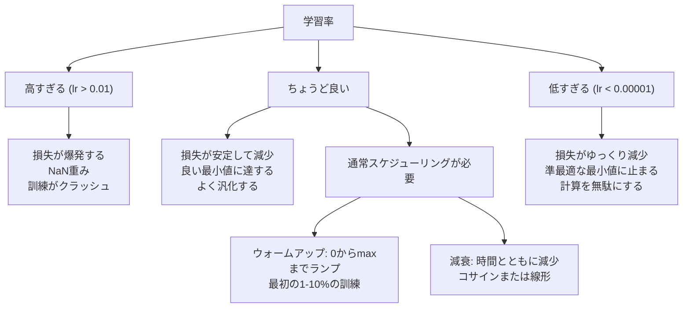
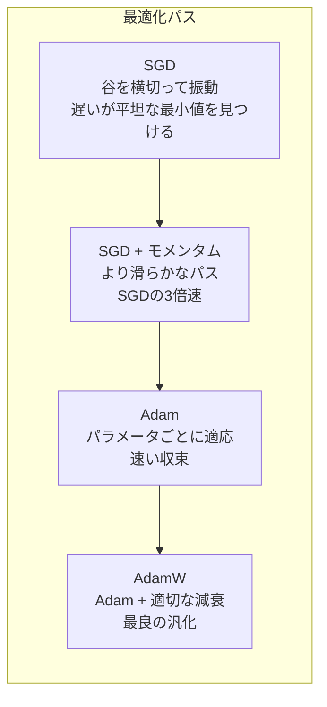
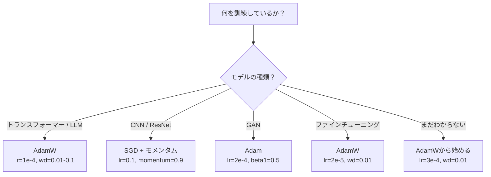

# オプティマイザ

> 勾配降下法はどの方向に動くかを教える。どれくらい遠く、どれくらい速くかについては何も言わない。SGDはコンパスだ。AdamはGPSに交通データが加わったものだ。

**タイプ:** 構築
**言語:** Python
**前提条件:** レッスン03.05（損失関数）
**所要時間:** 約75分

## 学習目標

- SGD、モメンタム付きSGD、Adam、AdamWオプティマイザをPythonでゼロから実装する
- Adamのバイアス補正が訓練の早いステップでゼロ初期化されたモーメント推定をどのように補償するかを説明する
- 同じタスクでAdamW がL2正則化付きAdamより良い汎化をもたらすことを実証する
- トランスフォーマー、CNN、GAN、ファインチューニングに適したオプティマイザとデフォルトのハイパーパラメータを選択する

## 問題

勾配を計算した。重み#4,721が損失を減らすために0.003減少すべきだとわかる。しかし0.003はどんな単位で？何でスケールする？そしてステップ1でもステップ1,000でも同じ量を動かすべきか？

バニラ勾配降下法はすべてのパラメータにすべてのステップで同じ学習率を適用する：w = w - lr * gradient。これにより実際のニューラルネットワーク訓練を困難にする3つの問題が生じる。

第一に、振動。損失ランドスケープはなめらかなボウルの形をしていることはほとんどない。むしろ長くて細い谷のようなものだ。勾配は（浅い方向に沿ってではなく）谷を横切る（急な方向の）方向を指す。勾配降下法は有用な方向へのわずかな進歩をしながら、細い次元を行き来する。これを見たことがある：損失は急速に下がってからプラトーになる。収束したのではなく、振動しているのだ。

第二に、すべてのパラメータに対して1つの学習率は間違いだ。一部の重みは大きな更新が必要（まだ適合不足の段階）。他は小さな更新が必要（最適値に近い）。前者に機能する学習率は後者を破壊し、その逆も同じだ。

第三に、サドル点。高次元では、損失ランドスケープには勾配がほぼゼロの広大な平坦領域がある。バニラSGDはこれらの領域を勾配の速度で——実質的にゼロで——這う。モデルは止まっているように見える。止まっていない——他の側に有用な降下がある平坦領域にいるだけだ。しかしSGDは乗り越えるメカニズムを持たない。

Adamはこれら3つを解決する。パラメータごとに2つの移動平均を維持する——平均勾配（モメンタム、振動を処理）と平均二乗勾配（適応率、異なるスケールを処理）。最初の数ステップのバイアス補正と組み合わせることで、デフォルトのハイパーパラメータで問題の80%で機能する単一のオプティマイザが得られる。このレッスンはそれを正確にいつなぜ残りの20%で失敗するかを理解するためにゼロから構築する。

## コンセプト

### 確率的勾配降下法（SGD）

最もシンプルなオプティマイザ。ミニバッチで勾配を計算し、反対方向にステップする。

```
w = w - lr * gradient
```

「確率的」は、完全なデータセットではなくランダムなサブセット（ミニバッチ）を使って勾配を推定することを意味する。このノイズは実際には有用だ——鋭い局所最小値からの脱出を助ける。しかしノイズは振動も引き起こす。

学習率が唯一のノブだ。高すぎる：損失が発散する。低すぎる：訓練に永遠がかかる。最適値はアーキテクチャ、データ、バッチサイズ、訓練の現在のステージに依存する。現代のネットワークでのバニラSGDの場合、一般的な値は0.01から0.1の範囲だ。しかし単一の訓練実行内でも、理想的な学習率は変化する。

### モメンタム

ボールが丘を転がる類比は使いすぎだが正確だ。勾配だけでステップするのではなく、過去の勾配を蓄積した速度を維持する。

```
m_t = beta * m_{t-1} + gradient
w = w - lr * m_t
```

ベータ（通常0.9）は保持する履歴の量を制御する。beta = 0.9の場合、モメンタムは最後の約10個の勾配の平均だ（1 / (1 - 0.9) = 10）。

なぜこれが振動を修正するか：同じ方向を指す勾配が蓄積される。方向が反転する勾配はキャンセルされる。細い谷では、「横切る」コンポーネントが各ステップで符号を反転して減衰する。「沿う」コンポーネントが一貫して維持されて増幅される。結果は有用な方向へのスムーズな加速だ。

実際の数値：悪い条件の損失ランドスケープでのSGDだけでは10,000ステップかかるかもしれない。モメンタム付きSGD（beta=0.9）は通常同じ問題で3,000〜5,000ステップかかる。高速化は僅差ではない。

### RMSProp

実際に機能した最初のパラメータごとの適応学習率法。HintonによってCourseraの講義で提案された（正式には出版されなかった）。

```
s_t = beta * s_{t-1} + (1 - beta) * gradient^2
w = w - lr * gradient / (sqrt(s_t) + epsilon)
```

s_tは二乗勾配の移動平均を追跡する。一貫して大きな勾配を持つパラメータは大きな数で除算される（より小さな実効学習率）。小さな勾配を持つパラメータは小さな数で除算される（より大きな実効学習率）。

これが「すべてのパラメータに対して1つの学習率」問題を解決する。すでに大きな更新を受けている重みはおそらく目標に近い——遅くする。小さな更新を受けている重みは十分に訓練されていないかもしれない——速くする。

イプシロン（通常1e-8）はパラメータが更新されていないときのゼロ除算を防ぐ。

### Adam：モメンタム + RMSProp

Adamは両方のアイデアを組み合わせる。パラメータごとに2つの指数移動平均を維持する：

```
m_t = beta1 * m_{t-1} + (1 - beta1) * gradient        （1次モーメント：平均）
v_t = beta2 * v_{t-1} + (1 - beta2) * gradient^2       （2次モーメント：分散）
```

**バイアス補正**はほとんどの説明が省くキーの詳細だ。ステップ1では、m_1 = (1 - beta1) * gradient。beta1 = 0.9の場合、それは0.1 * gradient——10倍小さすぎる。移動平均がまだウォームアップしていない。バイアス補正が補償する：

```
m_hat = m_t / (1 - beta1^t)
v_hat = v_t / (1 - beta2^t)
```

beta1 = 0.9のステップ1で：m_hat = m_1 / (1 - 0.9) = m_1 / 0.1 = 実際の勾配。ステップ100では：(1 - 0.9^100)は約1.0で、補正が消える。バイアス補正は最初の約10ステップで重要で、約50ステップ後は無関係だ。

更新：

```
w = w - lr * m_hat / (sqrt(v_hat) + epsilon)
```

Adamのデフォルト：lr = 0.001、beta1 = 0.9、beta2 = 0.999、epsilon = 1e-8。これらのデフォルトは問題の80%で機能する。機能しないとき、最初にlrを変更する。次にbeta2。beta1またはepsilonはほとんど変更しない。

### AdamW：正しい方法での重み減衰

L2正則化は損失にlambda * w^2を加える。バニラSGDでは、これは重み減衰と等価だ（各ステップで重みからlambda * wを引く）。Adamでは、この等価性が崩れる。

LoshchilovとHutterの洞察：L2を損失に加えてからAdamが勾配を処理すると、適応学習率が正則化項もスケールする。大きな勾配分散を持つパラメータはより少ない正則化を受ける。小さな分散を持つパラメータはより多く受ける。これはあなたが望むものではない——勾配統計に関わらず均一な正則化が必要だ。

AdamWはAdamの更新後に重みに直接重み減衰を適用することでこれを修正する：

```
w = w - lr * m_hat / (sqrt(v_hat) + epsilon) - lr * lambda * w
```

重み減衰項（lr * lambda * w）はAdamの適応因子でスケールされない。すべてのパラメータが同じ比例的な縮小を受ける。

これは小さな詳細に見える。そうではない。AdamWは実質的にすべてのタスクでAdam + L2正則化より良い解に収束する。PyTorchでのトランスフォーマー、拡散モデル、ほとんどの現代のアーキテクチャのデフォルトオプティマイザだ。BERT、GPT、LLaMA、Stable Diffusion——すべてAdamWで訓練された。

### 学習率：最も重要なハイパーパラメータ



1つのハイパーパラメータを調整するなら、学習率を調整する。学習率の10倍の変化は、行うすべてのアーキテクチャ上の決定より重要だ。一般的なデフォルト：

- SGD: lr = 0.01から0.1
- Adam/AdamW: lr = 1e-4から3e-4
- 事前学習済みモデルのファインチューニング: lr = 1e-5から5e-5
- 学習率ウォームアップ: 最初の1-10%のステップで線形ランプ

### オプティマイザの比較



### 各オプティマイザが勝つとき



## 構築する

### ステップ1：バニラSGD

```python
class SGD:
    def __init__(self, lr=0.01):
        self.lr = lr

    def step(self, params, grads):
        for i in range(len(params)):
            params[i] -= self.lr * grads[i]
```

### ステップ2：モメンタム付きSGD

```python
class SGDMomentum:
    def __init__(self, lr=0.01, beta=0.9):
        self.lr = lr
        self.beta = beta
        self.velocities = None

    def step(self, params, grads):
        if self.velocities is None:
            self.velocities = [0.0] * len(params)
        for i in range(len(params)):
            self.velocities[i] = self.beta * self.velocities[i] + grads[i]
            params[i] -= self.lr * self.velocities[i]
```

### ステップ3：Adam

```python
import math

class Adam:
    def __init__(self, lr=0.001, beta1=0.9, beta2=0.999, epsilon=1e-8):
        self.lr = lr
        self.beta1 = beta1
        self.beta2 = beta2
        self.epsilon = epsilon
        self.m = None
        self.v = None
        self.t = 0

    def step(self, params, grads):
        if self.m is None:
            self.m = [0.0] * len(params)
            self.v = [0.0] * len(params)

        self.t += 1

        for i in range(len(params)):
            self.m[i] = self.beta1 * self.m[i] + (1 - self.beta1) * grads[i]
            self.v[i] = self.beta2 * self.v[i] + (1 - self.beta2) * grads[i] ** 2

            m_hat = self.m[i] / (1 - self.beta1 ** self.t)
            v_hat = self.v[i] / (1 - self.beta2 ** self.t)

            params[i] -= self.lr * m_hat / (math.sqrt(v_hat) + self.epsilon)
```

### ステップ4：AdamW

```python
class AdamW:
    def __init__(self, lr=0.001, beta1=0.9, beta2=0.999, epsilon=1e-8, weight_decay=0.01):
        self.lr = lr
        self.beta1 = beta1
        self.beta2 = beta2
        self.epsilon = epsilon
        self.weight_decay = weight_decay
        self.m = None
        self.v = None
        self.t = 0

    def step(self, params, grads):
        if self.m is None:
            self.m = [0.0] * len(params)
            self.v = [0.0] * len(params)

        self.t += 1

        for i in range(len(params)):
            self.m[i] = self.beta1 * self.m[i] + (1 - self.beta1) * grads[i]
            self.v[i] = self.beta2 * self.v[i] + (1 - self.beta2) * grads[i] ** 2

            m_hat = self.m[i] / (1 - self.beta1 ** self.t)
            v_hat = self.v[i] / (1 - self.beta2 ** self.t)

            params[i] -= self.lr * m_hat / (math.sqrt(v_hat) + self.epsilon)
            params[i] -= self.lr * self.weight_decay * params[i]
```

### ステップ5：訓練比較

レッスン05の円データセットで、4つのオプティマイザすべてで同じ2層ネットワークを訓練する。収束を比較する。

```python
import random

def sigmoid(x):
    x = max(-500, min(500, x))
    return 1.0 / (1.0 + math.exp(-x))

def make_circle_data(n=200, seed=42):
    random.seed(seed)
    data = []
    for _ in range(n):
        x = random.uniform(-2, 2)
        y = random.uniform(-2, 2)
        label = 1.0 if x * x + y * y < 1.5 else 0.0
        data.append(([x, y], label))
    return data


class OptimizerTestNetwork:
    def __init__(self, optimizer, hidden_size=8):
        random.seed(0)
        self.hidden_size = hidden_size
        self.optimizer = optimizer

        self.w1 = [[random.gauss(0, 0.5) for _ in range(2)] for _ in range(hidden_size)]
        self.b1 = [0.0] * hidden_size
        self.w2 = [random.gauss(0, 0.5) for _ in range(hidden_size)]
        self.b2 = 0.0

    def get_params(self):
        params = []
        for row in self.w1:
            params.extend(row)
        params.extend(self.b1)
        params.extend(self.w2)
        params.append(self.b2)
        return params

    def set_params(self, params):
        idx = 0
        for i in range(self.hidden_size):
            for j in range(2):
                self.w1[i][j] = params[idx]
                idx += 1
        for i in range(self.hidden_size):
            self.b1[i] = params[idx]
            idx += 1
        for i in range(self.hidden_size):
            self.w2[i] = params[idx]
            idx += 1
        self.b2 = params[idx]

    def forward(self, x):
        self.x = x
        self.z1 = []
        self.h = []
        for i in range(self.hidden_size):
            z = self.w1[i][0] * x[0] + self.w1[i][1] * x[1] + self.b1[i]
            self.z1.append(z)
            self.h.append(max(0.0, z))

        self.z2 = sum(self.w2[i] * self.h[i] for i in range(self.hidden_size)) + self.b2
        self.out = sigmoid(self.z2)
        return self.out

    def compute_grads(self, target):
        eps = 1e-15
        p = max(eps, min(1 - eps, self.out))
        d_loss = -(target / p) + (1 - target) / (1 - p)
        d_sigmoid = self.out * (1 - self.out)
        d_out = d_loss * d_sigmoid

        grads = [0.0] * (self.hidden_size * 2 + self.hidden_size + self.hidden_size + 1)
        idx = 0
        for i in range(self.hidden_size):
            d_relu = 1.0 if self.z1[i] > 0 else 0.0
            d_h = d_out * self.w2[i] * d_relu
            grads[idx] = d_h * self.x[0]
            grads[idx + 1] = d_h * self.x[1]
            idx += 2

        for i in range(self.hidden_size):
            d_relu = 1.0 if self.z1[i] > 0 else 0.0
            grads[idx] = d_out * self.w2[i] * d_relu
            idx += 1

        for i in range(self.hidden_size):
            grads[idx] = d_out * self.h[i]
            idx += 1

        grads[idx] = d_out
        return grads

    def train(self, data, epochs=300):
        losses = []
        for epoch in range(epochs):
            total_loss = 0.0
            correct = 0
            for x, y in data:
                pred = self.forward(x)
                grads = self.compute_grads(y)
                params = self.get_params()
                self.optimizer.step(params, grads)
                self.set_params(params)

                eps = 1e-15
                p = max(eps, min(1 - eps, pred))
                total_loss += -(y * math.log(p) + (1 - y) * math.log(1 - p))
                if (pred >= 0.5) == (y >= 0.5):
                    correct += 1
            avg_loss = total_loss / len(data)
            accuracy = correct / len(data) * 100
            losses.append((avg_loss, accuracy))
            if epoch % 75 == 0 or epoch == epochs - 1:
                print(f"    Epoch {epoch:3d}: loss={avg_loss:.4f}, accuracy={accuracy:.1f}%")
        return losses
```

## 活用する

PyTorchのオプティマイザはパラメータグループ、勾配クリッピング、学習率スケジューリングを処理する：

```python
import torch
import torch.optim as optim

model = torch.nn.Sequential(
    torch.nn.Linear(784, 256),
    torch.nn.ReLU(),
    torch.nn.Linear(256, 10),
)

optimizer = optim.AdamW(model.parameters(), lr=3e-4, weight_decay=0.01)

scheduler = optim.lr_scheduler.CosineAnnealingLR(optimizer, T_max=100)

for epoch in range(100):
    optimizer.zero_grad()
    output = model(torch.randn(32, 784))
    loss = torch.nn.functional.cross_entropy(output, torch.randint(0, 10, (32,)))
    loss.backward()
    torch.nn.utils.clip_grad_norm_(model.parameters(), max_norm=1.0)
    optimizer.step()
    scheduler.step()
```

パターンは常に：zero_grad、forward、loss、backward、（clip）、step、（schedule）。この順番を覚える。間違えること（例：optimizer.step()の前にscheduler.step()を呼ぶ）は微妙なバグの一般的な原因だ。

CNNでは、多くの実践者がまだstepまたはcosineスケジュール付きのSGD + モメンタム（lr=0.1、momentum=0.9、weight_decay=1e-4）を好む。SGDはより平坦な最小値を見つけ、それがより良く汎化することが多い。トランスフォーマーとLLMでは、ウォームアップ + コサイン減衰付きのAdamWが普遍的なデフォルトだ。測定された理由なしにコンセンサスと戦わないこと。

## 成果物

このレッスンで生成されるもの：
- `outputs/prompt-optimizer-selector.md` -- 任意のアーキテクチャに正しいオプティマイザと学習率を選ぶための決定プロンプト

## 演習

1. Nesterovモメンタムを実装する。現在の位置ではなく「先読み」位置（w - lr * beta * v）で勾配を計算する。円データセットで標準モメンタムと収束を比較する。

2. 学習率ウォームアップスケジュールを実装する：訓練ステップの最初の10%で0からmax_lrへ線形ランプ、次にコサイン減衰で0へ。ウォームアップありとなしのAdamで訓練する。円データセットで90%の精度に達するまでのエポック数を測定する。

3. Adam訓練中の各パラメータの実効学習率を追跡する。実効率はlr * m_hat / (sqrt(v_hat) + eps)。10、50、200ステップ後の実効率の分布をプロットする。すべてのパラメータが同じ速度で更新されているか？

4. 勾配クリッピングを実装する（グローバルノルムでクリップ）。最大勾配ノルムを1.0に設定する。高い学習率（AdamではLr=0.01）でクリッピングありとなしで訓練する。10のランダムシードでクリッピングなしとありで発散する（損失がNaNになる）実行の数をカウントする。

5. 大きな重みを持つネットワークでAdam vs AdamWを比較する。すべての重みを[-5, 5]のランダムな値で初期化する（通常より大きい）。weight_decay=0.1で200エポック訓練する。両方のオプティマイザの訓練を通じた重みのL2ノルムをプロットする。AdamWはより速い重みの縮小を示すはずだ。

## 主要な用語

| 用語 | よく言われること | 実際の意味 |
|------|----------------|----------------------|
| 学習率 | 「ステップサイズ」 | 勾配更新に対するスカラー乗数；訓練で最も影響力のある単一のハイパーパラメータ |
| SGD | 「基本的な勾配降下法」 | 確率的勾配降下法：ミニバッチで計算した lr * gradient を引くことで重みを更新する |
| モメンタム | 「転がるボールの類比」 | 過去の勾配の指数移動平均；振動を減衰し、一貫した方向を加速する |
| RMSProp | 「適応学習率」 | 各パラメータの勾配を最近の勾配のRMSで除算；学習率を均等化する |
| Adam | 「デフォルトのオプティマイザ」 | モメンタム（1次モーメント）とRMSProp（2次モーメント）を最初のステップのバイアス補正で組み合わせる |
| AdamW | 「正しいAdam」 | 重み減衰が分離されたAdam；勾配を通じてではなく直接重みに正則化を適用する |
| バイアス補正 | 「移動平均のウォームアップ」 | Adamのモーメント推定のゼロ初期化を補償するために(1 - beta^t)で除算する |
| 重み減衰 | 「重みを縮小する」 | 各ステップで重みの値の分を引く；大きな重みを罰する正則化 |
| 学習率スケジュール | 「時間とともにlrを変える」 | 訓練中に学習率を調整する関数；ウォームアップ + コサイン減衰が現代のデフォルト |
| 勾配クリッピング | 「勾配ノルムをキャップする」 | ノルムが閾値を超えると勾配ベクトルをスケールダウンする；勾配が爆発する更新を防ぐ |

## 参考文献

- Kingma & Ba, "Adam: A Method for Stochastic Optimization" (2014) -- 収束分析とバイアス補正の導出を含むオリジナルのAdam論文
- Loshchilov & Hutter, "Decoupled Weight Decay Regularization" (2017) -- L2正則化と重み減衰がAdamでは等価でないことを証明し、AdamWを提案
- Smith, "Cyclical Learning Rates for Training Neural Networks" (2017) -- LR範囲テストとサイクリックスケジュールを導入し、固定学習率のチューニングの必要性を排除
- Ruder, "An Overview of Gradient Descent Optimization Algorithms" (2016) -- すべてのオプティマイザバリアントの最良の単一調査、明確な比較と直感を持つ
