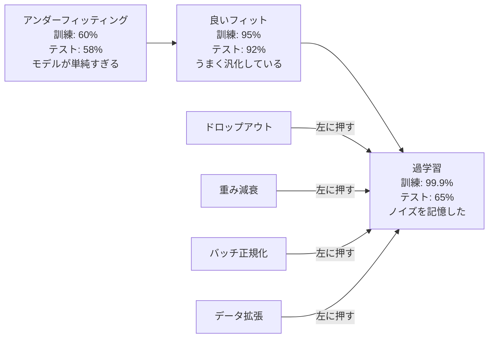
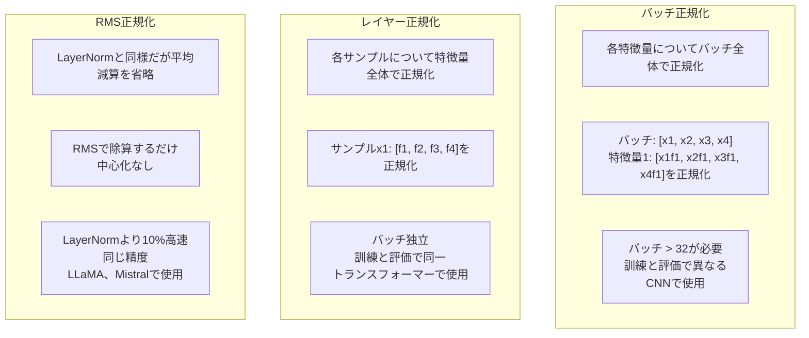
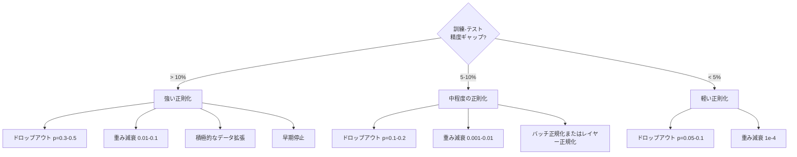

# 正則化

> モデルが訓練データで99%、テストデータで60%の精度を出している。学習ではなく記憶してしまっている。正則化とは、汎化を強制するために複雑性に課す「税金」だ。

**タイプ:** 構築
**言語:** Python
**前提条件:** レッスン 03.06（オプティマイザ）
**所要時間:** 約75分

## 学習目標

- 逆スケーリングを使ったドロップアウト、L2重み減衰、バッチ正規化、レイヤー正規化、RMSNormをゼロから実装する
- 訓練精度とテスト精度のギャップを測定し、正則化実験を通じて過学習を診断する
- トランスフォーマーがバッチ正規化ではなくLayerNormを使用する理由と、現代のLLMがRMSNormを好む理由を説明する
- 過学習の深刻度に応じた正則化手法の適切な組み合わせを適用する

## 問題

パラメータが十分にあるニューラルネットワークは、あらゆるデータセットを記憶できる。これは仮説ではなく、Zhangら（2017年）がImageNetをランダムなラベルで標準的なネットワークを訓練することで証明した。ネットワークは完全にランダムなラベル割り当てに対してほぼゼロの訓練損失に達した。100万件のランダムな入出力ペアを、学習すべきパターンもなく記憶したのだ。訓練損失は完璧だった。テスト精度はゼロだった。

これが過学習の問題であり、モデルが大きくなるほど深刻化する。GPT-3は1750億パラメータを持つ。訓練セットには約5000億トークンある。これだけのパラメータがあれば、モデルは訓練データの相当量をそのまま記憶できる容量を持つ。正則化がなければ、汎化可能なパターンを学習する代わりに、訓練例をそのまま吐き出すだけになる。

訓練性能とテスト性能の差が過学習ギャップだ。このレッスンのすべてのテクニックは、異なる角度からそのギャップに取り組む。ドロップアウトは、ネットワークが特定のニューロンに依存しないよう強制する。重み減衰は、単一の重みが大きくなりすぎるのを防ぐ。バッチ正規化は損失の地形を滑らかにし、オプティマイザがよりフラットで汎化しやすい最小値を見つけやすくする。レイヤー正規化は同じことをするが、バッチ正規化が失敗する場所（小さいバッチ、可変長シーケンス）でも機能する。RMSNormは平均計算を省略することで10%高速化する。各テクニックはシンプルだ。組み合わせると、記憶するモデルと汎化するモデルの違いになる。

## コンセプト

### 過学習のスペクトラム

すべてのモデルは、アンダーフィッティング（パターンを捉えるには単純すぎる）から過学習（ノイズまで捉えてしまうほど複雑）までのスペクトラムのどこかに位置する。スイートスポットはその中間にあり、正則化はモデルを過学習側から押し戻す。



### ドロップアウト

最もエレガントな解釈を持つ、最もシンプルな正則化テクニック。訓練中、確率pで各ニューロンの出力をランダムにゼロにする。

```
output = activation(z) * mask    ここで mask[i] ~ Bernoulli(1 - p)
```

p = 0.5の場合、フォワードパスごとに半分のニューロンがゼロになる。どのニューロンが使えるか予測できないため、ネットワークは冗長な表現を学習しなければならない。これにより共適応—ニューロンが特定の他のニューロンの存在に依存するよう学習すること—が防がれる。

アンサンブルの解釈：N個のニューロンとドロップアウトを持つネットワークは2^N個の可能なサブネットワーク（どのニューロンがオンまたはオフかのすべての組み合わせ）を生成する。ドロップアウトを使った訓練は、それぞれが異なるミニバッチで2^N個のサブネットワークを同時に訓練することに相当する。テスト時はすべてのニューロンを使用し（ドロップアウトなし）、訓練中の期待値に合わせて出力を(1 - p)でスケーリングする。これは単一モデルから2^N個のサブネットワークの予測を平均することと等価—膨大なアンサンブルだ。

実際には、スケーリングはテスト時ではなく訓練時に適用される（逆ドロップアウト）：

```
訓練時:  output = activation(z) * mask / (1 - p)
テスト時: output = activation(z)   （変更不要）
```

テストコードがドロップアウトについて知る必要がなくなるため、これがよりクリーンだ。

デフォルトのレート：トランスフォーマーではp = 0.1、MLPではp = 0.5、CNNではp = 0.2-0.3。ドロップアウトが高いほど正則化が強くなり、アンダーフィッティングのリスクが高まる。

### 重み減衰（L2正則化）

すべての重みの二乗の大きさを損失に追加する：

```
total_loss = task_loss + (lambda / 2) * sum(w_i^2)
```

正則化項の勾配はlambda * wだ。これは各ステップで、各重みがその大きさに比例した割合でゼロに向かって縮小されることを意味する。大きい重みはより多くペナルティを受ける。モデルは、単一の重みが支配しない解に向かって押し進められる。

汎化に役立つ理由：過学習したモデルは、訓練データのノイズを増幅する大きな重みを持つ傾向がある。重み減衰は重みを小さく保ち、モデルの実効的な容量を制限し、記憶した特殊なパターンではなく、頑健で汎化可能な特徴量に依存するよう強制する。

lambdaハイパーパラメータは強度を制御する。典型的な値：

- トランスフォーマーのAdamWでは0.01
- CNNのSGDでは1e-4
- 過学習が著しいモデルでは0.1

レッスン06で説明したように：重み減衰とL2正則化はSGDでは等価だがAdamでは等価でない。Adamで訓練する際は常にAdamW（分離型重み減衰）を使用すること。

### バッチ正規化

次の層に渡す前に、各層の出力をミニバッチ全体で正規化する。

ある層でのアクティベーションのミニバッチについて：

```
mu = (1/B) * sum(x_i)           （バッチ平均）
sigma^2 = (1/B) * sum((x_i - mu)^2)   （バッチ分散）
x_hat = (x_i - mu) / sqrt(sigma^2 + eps)   （正規化）
y = gamma * x_hat + beta        （スケールとシフト）
```

GammaとBetaは学習可能なパラメータで、正規化を最適であれば元に戻すことができる。これらがなければ、すべての層の出力を強制的に平均ゼロ・単位分散にすることになるが、ネットワークがそれを望まない場合もある。

**訓練対推論の違い：** 訓練中、muとsigmaは現在のミニバッチから得られる。推論中は、訓練中に蓄積された移動平均（momentum = 0.1の指数移動平均、つまり90%旧値 + 10%新値）を使用する。

バッチ正規化がなぜ機能するかはまだ議論されている。元の論文は「内部共変量シフト」（前の層が更新されるにつれて層の入力の分布が変化すること）を減少させると主張した。Santurkarら（2018年）はこの説明が誤りであることを示した。実際の理由：バッチ正規化は損失の地形を滑らかにする。勾配がより予測可能になり、リプシッツ定数が小さくなり、オプティマイザが大きなステップを安全に取れるようになる。これがバッチ正規化によって高い学習率を使用でき、収束が速くなる理由だ。

バッチ正規化には根本的な制限がある：バッチ統計に依存する。バッチサイズが1の場合、平均と分散は意味をなさない。小さいバッチ（< 32）では統計がノイジーになり、性能を損なう。これは物体検出（メモリがバッチサイズを制限する）や言語モデリング（シーケンス長が変動する）などのタスクで重要だ。

### レイヤー正規化

バッチ全体ではなく特徴量全体で正規化する。単一サンプルについて：

```
mu = (1/D) * sum(x_j)           （特徴量平均）
sigma^2 = (1/D) * sum((x_j - mu)^2)   （特徴量分散）
x_hat = (x_j - mu) / sqrt(sigma^2 + eps)
y = gamma * x_hat + beta
```

Dは特徴量の次元数だ。各サンプルは独立して正規化される—バッチサイズへの依存がない。これがトランスフォーマーがバッチ正規化ではなくLayerNormを使用する理由だ。シーケンスは可変長を持ち、バッチサイズはしばしば小さく（生成中は1になることも）、訓練と推論での計算が同一だ。

トランスフォーマーのLayerNormは、各セルフアテンションブロックの後と各フィードフォワードブロックの後（Post-LN）、またはその前（Pre-LN、訓練においてより安定）に適用される。

### RMSNorm

LayerNormから平均の減算を取り除いたもの。Zhang & Sennrich（2019年）が提案した。

```
rms = sqrt((1/D) * sum(x_j^2))
y = gamma * x / rms
```

これだけだ。平均計算なし、betaパラメータなし。観察：LayerNormの再中心化（平均の減算）はモデルの性能にほとんど貢献しないが、計算コストはかかる。これを取り除くと、約10%のオーバーヘッド削減で同じ精度が得られる。

LLaMA、LLaMA 2、LLaMA 3、Mistral、そして現代のほとんどのLLMはLayerNormの代わりにRMSNormを使用している。数十億パラメータと数兆トークンのスケールでは、その10%の節約は重要だ。

### 正規化の比較



### 正則化としてのデータ拡張

モデルの修正ではなくデータの修正だ。ラベルを保持しながら訓練入力を変換する：

- 画像：ランダムクロップ、フリップ、回転、色ジッター、カットアウト
- テキスト：同義語置換、逆翻訳、ランダム削除
- 音声：時間伸縮、ピッチシフト、ノイズ追加

効果は正則化と同一だ：訓練セットの実効的なサイズを増やし、モデルが特定の例を記憶しにくくする。各画像を一度だけ元の形で見るモデルはそれを記憶できる。各画像の50種類の拡張バージョンを見るモデルは、不変な構造を学習することを強いられる。

### 早期停止

最もシンプルな正則化器：検証損失が増加し始めたら訓練を停止する。その時点ではモデルはまだ過学習していない。実際には、エポックごとに検証損失を追跡し、最良のモデルを保存し、「忍耐」ウィンドウ（通常5〜20エポック）で訓練を続ける。忍耐ウィンドウ内で検証損失が改善しなければ停止し、最良の保存済みモデルを読み込む。

### どの手法をいつ適用するか



## 構築する

### ステップ1：ドロップアウト（訓練モードと評価モード）

```python
import random
import math


class Dropout:
    def __init__(self, p=0.5):
        self.p = p
        self.training = True
        self.mask = None

    def forward(self, x):
        if not self.training:
            return list(x)
        self.mask = []
        output = []
        for val in x:
            if random.random() < self.p:
                self.mask.append(0)
                output.append(0.0)
            else:
                self.mask.append(1)
                output.append(val / (1 - self.p))
        return output

    def backward(self, grad_output):
        grads = []
        for g, m in zip(grad_output, self.mask):
            if m == 0:
                grads.append(0.0)
            else:
                grads.append(g / (1 - self.p))
        return grads
```

### ステップ2：L2重み減衰

```python
def l2_regularization(weights, lambda_reg):
    penalty = 0.0
    for w in weights:
        penalty += w * w
    return lambda_reg * 0.5 * penalty

def l2_gradient(weights, lambda_reg):
    return [lambda_reg * w for w in weights]
```

### ステップ3：バッチ正規化

```python
class BatchNorm:
    def __init__(self, num_features, momentum=0.1, eps=1e-5):
        self.gamma = [1.0] * num_features
        self.beta = [0.0] * num_features
        self.eps = eps
        self.momentum = momentum
        self.running_mean = [0.0] * num_features
        self.running_var = [1.0] * num_features
        self.training = True
        self.num_features = num_features

    def forward(self, batch):
        batch_size = len(batch)
        if self.training:
            mean = [0.0] * self.num_features
            for sample in batch:
                for j in range(self.num_features):
                    mean[j] += sample[j]
            mean = [m / batch_size for m in mean]

            var = [0.0] * self.num_features
            for sample in batch:
                for j in range(self.num_features):
                    var[j] += (sample[j] - mean[j]) ** 2
            var = [v / batch_size for v in var]

            for j in range(self.num_features):
                self.running_mean[j] = (1 - self.momentum) * self.running_mean[j] + self.momentum * mean[j]
                self.running_var[j] = (1 - self.momentum) * self.running_var[j] + self.momentum * var[j]
        else:
            mean = list(self.running_mean)
            var = list(self.running_var)

        self.x_hat = []
        output = []
        for sample in batch:
            normalized = []
            out_sample = []
            for j in range(self.num_features):
                x_h = (sample[j] - mean[j]) / math.sqrt(var[j] + self.eps)
                normalized.append(x_h)
                out_sample.append(self.gamma[j] * x_h + self.beta[j])
            self.x_hat.append(normalized)
            output.append(out_sample)
        return output
```

### ステップ4：レイヤー正規化

```python
class LayerNorm:
    def __init__(self, num_features, eps=1e-5):
        self.gamma = [1.0] * num_features
        self.beta = [0.0] * num_features
        self.eps = eps
        self.num_features = num_features

    def forward(self, x):
        mean = sum(x) / len(x)
        var = sum((xi - mean) ** 2 for xi in x) / len(x)

        self.x_hat = []
        output = []
        for j in range(self.num_features):
            x_h = (x[j] - mean) / math.sqrt(var + self.eps)
            self.x_hat.append(x_h)
            output.append(self.gamma[j] * x_h + self.beta[j])
        return output
```

### ステップ5：RMSNorm

```python
class RMSNorm:
    def __init__(self, num_features, eps=1e-6):
        self.gamma = [1.0] * num_features
        self.eps = eps
        self.num_features = num_features

    def forward(self, x):
        rms = math.sqrt(sum(xi * xi for xi in x) / len(x) + self.eps)
        output = []
        for j in range(self.num_features):
            output.append(self.gamma[j] * x[j] / rms)
        return output
```

### ステップ6：正則化あり・なしでの訓練

```python
def sigmoid(x):
    x = max(-500, min(500, x))
    return 1.0 / (1.0 + math.exp(-x))


def make_circle_data(n=200, seed=42):
    random.seed(seed)
    data = []
    for _ in range(n):
        x = random.uniform(-2, 2)
        y = random.uniform(-2, 2)
        label = 1.0 if x * x + y * y < 1.5 else 0.0
        data.append(([x, y], label))
    return data


class RegularizedNetwork:
    def __init__(self, hidden_size=16, lr=0.05, dropout_p=0.0, weight_decay=0.0):
        random.seed(0)
        self.hidden_size = hidden_size
        self.lr = lr
        self.dropout_p = dropout_p
        self.weight_decay = weight_decay
        self.dropout = Dropout(p=dropout_p) if dropout_p > 0 else None

        self.w1 = [[random.gauss(0, 0.5) for _ in range(2)] for _ in range(hidden_size)]
        self.b1 = [0.0] * hidden_size
        self.w2 = [random.gauss(0, 0.5) for _ in range(hidden_size)]
        self.b2 = 0.0

    def forward(self, x, training=True):
        self.x = x
        self.z1 = []
        self.h = []
        for i in range(self.hidden_size):
            z = self.w1[i][0] * x[0] + self.w1[i][1] * x[1] + self.b1[i]
            self.z1.append(z)
            self.h.append(max(0.0, z))

        if self.dropout and training:
            self.dropout.training = True
            self.h = self.dropout.forward(self.h)
        elif self.dropout:
            self.dropout.training = False
            self.h = self.dropout.forward(self.h)

        self.z2 = sum(self.w2[i] * self.h[i] for i in range(self.hidden_size)) + self.b2
        self.out = sigmoid(self.z2)
        return self.out

    def backward(self, target):
        eps = 1e-15
        p = max(eps, min(1 - eps, self.out))
        d_loss = -(target / p) + (1 - target) / (1 - p)
        d_sigmoid = self.out * (1 - self.out)
        d_out = d_loss * d_sigmoid

        for i in range(self.hidden_size):
            d_relu = 1.0 if self.z1[i] > 0 else 0.0
            d_h = d_out * self.w2[i] * d_relu
            self.w2[i] -= self.lr * (d_out * self.h[i] + self.weight_decay * self.w2[i])
            for j in range(2):
                self.w1[i][j] -= self.lr * (d_h * self.x[j] + self.weight_decay * self.w1[i][j])
            self.b1[i] -= self.lr * d_h
        self.b2 -= self.lr * d_out

    def evaluate(self, data):
        correct = 0
        total_loss = 0.0
        for x, y in data:
            pred = self.forward(x, training=False)
            eps = 1e-15
            p = max(eps, min(1 - eps, pred))
            total_loss += -(y * math.log(p) + (1 - y) * math.log(1 - p))
            if (pred >= 0.5) == (y >= 0.5):
                correct += 1
        return total_loss / len(data), correct / len(data) * 100

    def train_model(self, train_data, test_data, epochs=300):
        history = []
        for epoch in range(epochs):
            total_loss = 0.0
            correct = 0
            for x, y in train_data:
                pred = self.forward(x, training=True)
                self.backward(y)
                eps = 1e-15
                p = max(eps, min(1 - eps, pred))
                total_loss += -(y * math.log(p) + (1 - y) * math.log(1 - p))
                if (pred >= 0.5) == (y >= 0.5):
                    correct += 1
            train_loss = total_loss / len(train_data)
            train_acc = correct / len(train_data) * 100
            test_loss, test_acc = self.evaluate(test_data)
            history.append((train_loss, train_acc, test_loss, test_acc))
            if epoch % 75 == 0 or epoch == epochs - 1:
                gap = train_acc - test_acc
                print(f"    Epoch {epoch:3d}: train_acc={train_acc:.1f}%, test_acc={test_acc:.1f}%, gap={gap:.1f}%")
        return history
```

## 活用する

PyTorchはすべての正規化と正則化をモジュールとして提供している：

```python
import torch
import torch.nn as nn

model = nn.Sequential(
    nn.Linear(784, 256),
    nn.BatchNorm1d(256),
    nn.ReLU(),
    nn.Dropout(0.3),
    nn.Linear(256, 128),
    nn.BatchNorm1d(128),
    nn.ReLU(),
    nn.Dropout(0.3),
    nn.Linear(128, 10),
)

model.train()
out_train = model(torch.randn(32, 784))

model.eval()
out_test = model(torch.randn(1, 784))
```

`model.train()` / `model.eval()` の切り替えは重要だ。これはドロップアウトのオン/オフを切り替え、バッチ正規化にバッチ統計と移動平均統計のどちらを使用するかを伝える。推論前に `model.eval()` を忘れることは、ディープラーニングで最も一般的なバグの一つだ。ドロップアウトがまだアクティブでバッチ正規化がミニバッチ統計を使用しているため、テスト精度がランダムに変動する。

トランスフォーマーでは、パターンが異なる：

```python
class TransformerBlock(nn.Module):
    def __init__(self, d_model=512, nhead=8, dropout=0.1):
        super().__init__()
        self.attention = nn.MultiheadAttention(d_model, nhead, dropout=dropout)
        self.norm1 = nn.LayerNorm(d_model)
        self.ff = nn.Sequential(
            nn.Linear(d_model, d_model * 4),
            nn.GELU(),
            nn.Linear(d_model * 4, d_model),
            nn.Dropout(dropout),
        )
        self.norm2 = nn.LayerNorm(d_model)
        self.dropout = nn.Dropout(dropout)

    def forward(self, x):
        attended, _ = self.attention(x, x, x)
        x = self.norm1(x + self.dropout(attended))
        x = self.norm2(x + self.ff(x))
        return x
```

バッチ正規化ではなくLayerNorm。ドロップアウトp=0.5ではなくp=0.1。これらがトランスフォーマーのデフォルトだ。

## Ship It

このレッスンが生成するもの：
- `outputs/prompt-regularization-advisor.md` — 過学習を診断し、適切な正則化戦略を推奨するプロンプト

## 演習

1. 2Dデータのスペーシャルドロップアウトを実装する：個々のニューロンをドロップするのではなく、特徴量チャネル全体をドロップする。連続した特徴量のグループをチャネルとして扱い、グループ全体をドロップすることでこれをシミュレートする。hidden_size=32の円データセットで標準的なドロップアウトと訓練-テストギャップを比較する。

2. レッスン05のラベル平滑化とこのレッスンのドロップアウトを組み合わせて実装する。4つの設定で訓練する：どちらでもない、ドロップアウトのみ、ラベル平滑化のみ、両方。それぞれの最終的な訓練-テスト精度ギャップを測定する。どの組み合わせが最小のギャップをもたらすか？

3. 円データセットのネットワークで、隠れ層とアクティベーションの間にバッチ正規化層を追加する。学習率0.01、0.05、0.1でバッチ正規化ありとなしで訓練する。バッチ正規化は、バニラネットワークが発散する高い学習率での安定した訓練を可能にすべきだ。

4. 早期停止を実装する：各エポックでテスト損失を追跡し、最良の重みを保存し、テスト損失が20エポック改善されなかった場合に停止する。正則化ネットワークを1000エポック実行する。最良のテスト精度が得られたエポックと、節約できた計算エポック数を報告する。

5. 4層ネットワーク（2層だけでなく）でLayerNormとRMSNormを比較する。両方を同じ重みで初期化する。200エポック訓練し、最終精度、訓練速度（エポックあたりの時間）、最初の層の勾配の大きさを比較する。RMSNormが同じ精度でより速いことを検証する。

## 用語集

| 用語 | よく言われること | 実際の意味 |
|------|----------------|----------------------|
| 過学習 | 「モデルがデータを記憶した」 | モデルの訓練性能がテスト性能を大幅に上回る場合。シグナルではなくノイズを学習したことを示す |
| 正則化 | 「過学習を防ぐこと」 | 汎化を改善するためにモデルの複雑性を制約する任意のテクニック：ドロップアウト、重み減衰、正規化、拡張 |
| ドロップアウト | 「ランダムなニューロンの削除」 | 確率pで訓練中にランダムなニューロンをゼロにし、冗長な表現を強制する。アンサンブルの訓練と等価 |
| 重み減衰 | 「L2ペナルティ」 | 各ステップでlambda * wを引くことですべての重みをゼロに向かって縮小する。重みの大きさで複雑性にペナルティを与える |
| バッチ正規化 | 「バッチごとに正規化する」 | 訓練中はバッチ統計を使い、推論中は移動平均を使ってバッチ次元で層の出力を正規化する |
| レイヤー正規化 | 「サンプルごとに正規化する」 | 各サンプル内で特徴量全体で正規化する。バッチに依存せず、バッチサイズが変動するトランスフォーマーで使用される |
| RMSNorm | 「LayerNormから平均を取り除いたもの」 | 二乗平均平方根正規化。LayerNormから平均減算を省略し、同等の精度で10%の高速化を実現する |
| 早期停止 | 「過学習前に停止する」 | 検証損失の改善が止まったら訓練を停止する。最もシンプルな正則化器で、他と組み合わせて使われることが多い |
| データ拡張 | 「少ないデータからより多くのデータを」 | 訓練入力を変換（フリップ、クロップ、ノイズ）してデータセットの実効的なサイズを増やし、不変性の学習を強制する |
| 汎化ギャップ | 「訓練-テスト分割」 | 訓練とテストの性能の差。正則化はこのギャップを最小化することを目指す |

## 参考文献

- Srivastavaら、「Dropout: A Simple Way to Prevent Neural Networks from Overfitting」（2014年）—アンサンブルの解釈と広範な実験を含む元のドロップアウト論文
- Ioffe & Szegedy、「Batch Normalization: Accelerating Deep Network Training by Reducing Internal Covariate Shift」（2015年）—バッチ正規化とその訓練手順を紹介した、最も引用されるディープラーニング論文の一つ
- Zhang & Sennrich、「Root Mean Square Layer Normalization」（2019年）—RMSNormが計算を削減しながらLayerNormの精度に匹敵することを示した。LLaMAとMistralに採用された
- Zhangら、「Understanding Deep Learning Requires Rethinking Generalization」（2017年）—ニューラルネットワークがランダムなラベルを記憶できることを示した画期的な論文。汎化の従来の見解に挑戦した
