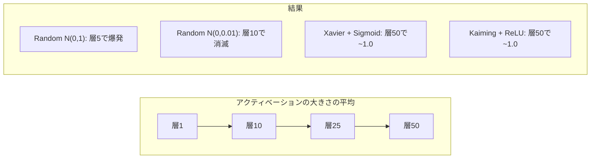
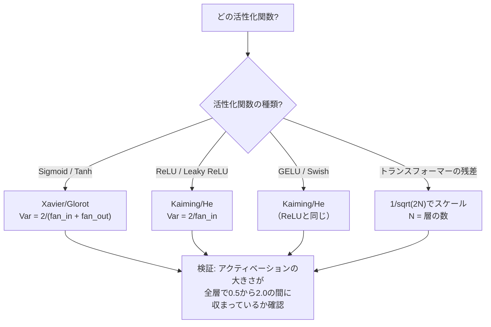

# 重み初期化と訓練の安定性

> 初期化を誤ると訓練が始まらない。正しく初期化すれば、50層でも3層と同じくらいスムーズに訓練できる。

**タイプ:** 構築
**言語:** Python
**前提条件:** レッスン 03.04（活性化関数）、レッスン 03.07（正則化）
**所要時間:** 約90分

## 学習目標

- ゼロ、ランダム、Xavier/Glorot、Kaiming/He初期化戦略を実装し、50層を通したアクティベーションの大きさへの影響を測定する
- XavierがVar(w) = 2/(fan_in + fan_out)を、KaimingがVar(w) = 2/fan_inを使用する理由を導出する
- ゼロ初期化による対称性の問題を示し、ランダムなスケールだけでは不十分な理由を説明する
- 活性化関数に対応する正しい初期化戦略を対応付ける：sigmoid/tanhにはXavier、ReLU/GELUにはKaiming

## 問題

すべての重みをゼロに初期化する。何も学習しない。すべてのニューロンが同じ関数を計算し、同じ勾配を受け取り、同一に更新される。10,000エポック後、512ニューロンの隠れ層は512個の同一ニューロンのままだ。512個のパラメータに対してお金を払ったのに、1個しか得られない。

大きすぎる値で初期化する。アクティベーションがネットワークを通じて爆発する。層10では値が1e15に達する。層20ではinfにオーバーフローする。勾配は逆の軌跡をたどる。

標準正規分布からランダムに初期化する。3層では機能する。50層では、ランダムスケールがわずかに小さすぎるか大きすぎるかに応じて、シグナルがゼロに崩壊するか無限大に爆発するかのどちらかだ。「機能する」と「壊れている」の境界は非常に薄い。

重み初期化はディープラーニングで最も過小評価されている決定だ。アーキテクチャは論文になる。オプティマイザはブログ記事になる。初期化は脚注になる。しかし誤ると他のものは何も重要ではない—ネットワークは訓練が始まる前に死んでいる。

## コンセプト

### 対称性の問題

層の各ニューロンは同じ構造を持つ：入力に重みを掛け、バイアスを加え、アクティベーションを適用する。すべての重みが同じ値で始まる場合（ゼロは極端なケース）、すべてのニューロンが同じ出力を計算する。バックプロパゲーション中、すべてのニューロンが同じ勾配を受け取る。更新ステップ中、すべてのニューロンが同じ量だけ変化する。

行き詰まる。ネットワークは数百のパラメータを持つが、すべてが一緒に動く。これは対称性と呼ばれ、ランダム初期化はそれを破る力まかせの方法だ。各ニューロンは重み空間の異なるポイントから始まるため、それぞれが異なる特徴量を学習する。

しかし「ランダム」では不十分だ。ランダム性の*スケール*がネットワークが訓練されるかどうかを決定する。

### 層を通じた分散の伝播

fan_in個の入力を持つ単一の層を考える：

```
z = w1*x1 + w2*x2 + ... + w_n*x_n
```

各重みwiが分散Var(w)の分布から、各入力xiが分散Var(x)から引かれる場合、出力の分散は：

```
Var(z) = fan_in * Var(w) * Var(x)
```

Var(w) = 1でfan_in = 512の場合、出力分散は入力分散の512倍だ。10層後：512^10 = 1.2e27。シグナルは爆発した。

Var(w) = 0.001の場合、出力分散は0.001 * 512 = 0.512ずつ層ごとに縮小する。10層後：0.512^10 = 0.00013。シグナルは消えた。

目標：Var(z) = Var(x)となるようにVar(w)を選ぶ。シグナルの大きさが層全体で一定に保たれる。

### Xavier/Glorot初期化

GlorotとBengio（2010年）は、sigmoidとtanhアクティベーション向けの解を導出した。フォワードパスとバックワードパスの両方で分散を一定に保つために：

```
Var(w) = 2 / (fan_in + fan_out)
```

実際には、重みは次から引かれる：

```
w ~ Uniform(-limit, limit)  ここで limit = sqrt(6 / (fan_in + fan_out))
```

または：

```
w ~ Normal(0, sqrt(2 / (fan_in + fan_out)))
```

これが機能する理由：sigmoidとtanhは、正しく初期化されたアクティベーションが存在するゼロ付近では概ね線形だ。数十層を通じて分散が安定して保たれる。

### Kaiming/He初期化

ReLUは出力の半分を殺す（負の値はすべてゼロになる）。平均して半分の入力がゼロになるため、実効的なfan_inは半分になる。Xavier初期化はこれを考慮しない—必要な分散を過小評価してしまう。

Heら（2015年）は式を調整した：

```
Var(w) = 2 / fan_in
```

重みは次から引かれる：

```
w ~ Normal(0, sqrt(2 / fan_in))
```

2の係数はReLUが半分のアクティベーションをゼロにすることを補正する。これがなければ、シグナルは層ごとに約0.5倍縮小する。50層後：0.5^50 = 8.8e-16。Kaiming初期化はこれを防ぐ。

### トランスフォーマーの初期化

GPT-2は異なるパターンを導入した。残差接続は各サブ層の出力をその入力に加える：

```
x = x + sublayer(x)
```

各加算により分散が増加する。N個の残差層では、分散はNに比例して増加する。GPT-2は残差層の重みを1/sqrt(2N)（Nは層の数）でスケーリングする。これにより累積シグナルの大きさが安定する。

Llama 3（405Bパラメータ、126層）は同様のスキームを使用している。このスケーリングなしでは、残差ストリームは126層のアテンションとフィードフォワードブロックを通じて無制限に増加してしまう。

```mermaid
flowchart TD
    subgraph "ゼロ初期化"
        Z1["層1<br/>全重み = 0"] --> Z2["層2<br/>全ニューロンが同一"]
        Z2 --> Z3["層3<br/>まだ同一"]
        Z3 --> ZR["結果: 幅に関係なく<br/>実効ニューロン数1"]
    end

    subgraph "Xavier初期化"
        X1["層1<br/>Var = 2/(fan_in+fan_out)"] --> X2["層2<br/>シグナル安定"]
        X2 --> X3["層50<br/>シグナル安定"]
        X3 --> XR["結果: sigmoid/tanhで<br/>訓練可能"]
    end

    subgraph "Kaiming初期化"
        K1["層1<br/>Var = 2/fan_in"] --> K2["層2<br/>シグナル安定"]
        K2 --> K3["層50<br/>シグナル安定"]
        K3 --> KR["結果: ReLU/GELUで<br/>訓練可能"]
    end
```



### 50層を通じたアクティベーションの大きさ



### 正しい初期化の選び方



## 構築する

### ステップ1：初期化戦略

重み行列を初期化する4つの方法。それぞれfan_in列とfan_out行の2Dリスト（行列）を返す。

```python
import math
import random


def zero_init(fan_in, fan_out):
    return [[0.0 for _ in range(fan_in)] for _ in range(fan_out)]


def random_init(fan_in, fan_out, scale=1.0):
    return [[random.gauss(0, scale) for _ in range(fan_in)] for _ in range(fan_out)]


def xavier_init(fan_in, fan_out):
    std = math.sqrt(2.0 / (fan_in + fan_out))
    return [[random.gauss(0, std) for _ in range(fan_in)] for _ in range(fan_out)]


def kaiming_init(fan_in, fan_out):
    std = math.sqrt(2.0 / fan_in)
    return [[random.gauss(0, std) for _ in range(fan_in)] for _ in range(fan_out)]
```

### ステップ2：活性化関数

sigmoid、tanh、ReLUを各初期化戦略と意図した活性化でテストする必要がある。

```python
def sigmoid(x):
    x = max(-500, min(500, x))
    return 1.0 / (1.0 + math.exp(-x))


def tanh_act(x):
    return math.tanh(x)


def relu(x):
    return max(0.0, x)
```

### ステップ3：50層を通じたフォワードパス

ランダムデータを深いネットワークに通し、各層でアクティベーションの大きさの平均を測定する。

```python
def forward_deep(init_fn, activation_fn, n_layers=50, width=64, n_samples=100):
    random.seed(42)
    layer_magnitudes = []

    inputs = [[random.gauss(0, 1) for _ in range(width)] for _ in range(n_samples)]

    for layer_idx in range(n_layers):
        weights = init_fn(width, width)
        biases = [0.0] * width

        new_inputs = []
        for sample in inputs:
            output = []
            for neuron_idx in range(width):
                z = sum(weights[neuron_idx][j] * sample[j] for j in range(width)) + biases[neuron_idx]
                output.append(activation_fn(z))
            new_inputs.append(output)
        inputs = new_inputs

        magnitudes = []
        for sample in inputs:
            magnitudes.append(sum(abs(v) for v in sample) / width)
        mean_mag = sum(magnitudes) / len(magnitudes)
        layer_magnitudes.append(mean_mag)

    return layer_magnitudes
```

### ステップ4：実験

すべての組み合わせを実行する：ゼロ初期化、ランダムN(0,1)、ランダムN(0,0.01)、Xavier + sigmoid、Xavier + tanh、Kaiming + ReLU。主要な層での大きさを出力する。

```python
def run_experiment():
    configs = [
        ("Zero init + Sigmoid", lambda fi, fo: zero_init(fi, fo), sigmoid),
        ("Random N(0,1) + ReLU", lambda fi, fo: random_init(fi, fo, 1.0), relu),
        ("Random N(0,0.01) + ReLU", lambda fi, fo: random_init(fi, fo, 0.01), relu),
        ("Xavier + Sigmoid", xavier_init, sigmoid),
        ("Xavier + Tanh", xavier_init, tanh_act),
        ("Kaiming + ReLU", kaiming_init, relu),
    ]

    print(f"{'Strategy':<30} {'L1':>10} {'L5':>10} {'L10':>10} {'L25':>10} {'L50':>10}")
    print("-" * 80)

    for name, init_fn, act_fn in configs:
        mags = forward_deep(init_fn, act_fn)
        row = f"{name:<30}"
        for idx in [0, 4, 9, 24, 49]:
            val = mags[idx]
            if val > 1e6:
                row += f" {'EXPLODED':>10}"
            elif val < 1e-6:
                row += f" {'VANISHED':>10}"
            else:
                row += f" {val:>10.4f}"
        print(row)
```

### ステップ5：対称性のデモ

ゼロ初期化が同一のニューロンを生成することを示す。

```python
def symmetry_demo():
    random.seed(42)
    weights = zero_init(2, 4)
    biases = [0.0] * 4

    inputs = [0.5, -0.3]
    outputs = []
    for neuron_idx in range(4):
        z = sum(weights[neuron_idx][j] * inputs[j] for j in range(2)) + biases[neuron_idx]
        outputs.append(sigmoid(z))

    print("\n対称性デモ（4ニューロン、ゼロ初期化）:")
    for i, out in enumerate(outputs):
        print(f"  ニューロン {i}: output = {out:.6f}")
    all_same = all(abs(outputs[i] - outputs[0]) < 1e-10 for i in range(len(outputs)))
    print(f"  全て同一: {all_same}")
    print(f"  実効パラメータ数: 1 ({len(weights) * len(weights[0])}ではない)")
```

### ステップ6：層ごとの大きさレポート

50層を通じたアクティベーションの大きさのテキスト棒グラフを出力する。

```python
def magnitude_report(name, magnitudes):
    print(f"\n{name}:")
    for i, mag in enumerate(magnitudes):
        if i % 5 == 0 or i == len(magnitudes) - 1:
            if mag > 1e6:
                bar = "X" * 50 + " EXPLODED"
            elif mag < 1e-6:
                bar = "." + " VANISHED"
            else:
                bar_len = min(50, max(1, int(mag * 10)))
                bar = "#" * bar_len
            print(f"  Layer {i+1:3d}: {bar} ({mag:.6f})")
```

## 活用する

PyTorchはこれらをビルトイン関数として提供している：

```python
import torch
import torch.nn as nn

layer = nn.Linear(512, 256)

nn.init.xavier_uniform_(layer.weight)
nn.init.xavier_normal_(layer.weight)

nn.init.kaiming_uniform_(layer.weight, nonlinearity='relu')
nn.init.kaiming_normal_(layer.weight, nonlinearity='relu')

nn.init.zeros_(layer.bias)
```

`nn.Linear(512, 256)` を呼ぶと、PyTorchはデフォルトでKaiming uniform初期化を使用する。ほとんどのシンプルなネットワークが「そのまま動く」のはそのためだ—PyTorchがすでに正しい選択をしている。しかし、カスタムアーキテクチャを構築したり20層以上の深さになったりした場合は、何が起きているかを理解し、デフォルトを上書きする必要がある可能性がある。

トランスフォーマーでは、HuggingFaceのモデルは通常`_init_weights`メソッドで初期化を処理する。GPT-2の実装は残差のプロジェクションを1/sqrt(N)でスケーリングする。トランスフォーマーをゼロから構築する場合は、これを自分で追加する必要がある。

## Ship It

このレッスンが生成するもの：
- `outputs/prompt-init-strategy.md` — 重み初期化の問題を診断し、適切な戦略を推奨するプロンプト

## 演習

1. LeCun初期化（Var = 1/fan_in、SELUアクティベーション向けに設計）を追加する。LeCun初期化 + tanhで50層実験を実行し、Xavier + tanhと比較する。

2. GPT-2の残差スケーリングを実装する：各層の出力に残差ストリームに加算する前に1/sqrt(2*N)を掛ける。スケーリングありとなしで50層を実行し、残差の大きさがどれほど速く増加するか測定する。

3. ネットワークの層の次元数と活性化関数の種類を受け取り、正しい初期化を推奨し、現在の初期化が問題を引き起こす場合に警告する「初期化ヘルスチェック」関数を作成する。

4. fan_in = 16対fan_in = 1024で実験を実行する。XavierとKaimingはfan_inに適応するが、ランダム初期化はしない。大きい層では「機能する」と「壊れる」のギャップがどのように広がるかを示す。

5. 直交初期化を実装する（ランダム行列を生成し、SVDを計算し、直交行列Uを使用）。50層でReLUネットワークのKaimingと比較する。

## 用語集

| 用語 | よく言われること | 実際の意味 |
|------|----------------|----------------------|
| 重み初期化 | 「ランダムに初期重みを設定する」 | ネットワークが全く訓練できるかどうかを決定する初期重み値の選択戦略 |
| 対称性の破れ | 「ニューロンを異なるものにする」 | ニューロンが同一の関数を計算する代わりに異なる特徴量を学習するためのランダム初期化の使用 |
| ファンイン | 「ニューロンへの入力の数」 | 入ってくる接続の数。重み付き和での入力分散の累積を決定する |
| ファンアウト | 「ニューロンからの出力の数」 | 出て行く接続の数。バックプロパゲーション中の勾配分散の維持に関係する |
| Xavier/Glorot初期化 | 「sigmoid向けの初期化」 | Var(w) = 2/(fan_in + fan_out)、sigmoidとtanhアクティベーションを通じて分散を保持するよう設計 |
| Kaiming/He初期化 | 「ReLU向けの初期化」 | Var(w) = 2/fan_in、ReLUが半分のアクティベーションをゼロにすることを考慮 |
| 分散の伝播 | 「シグナルが層を通じて増加または縮小する方法」 | 重みスケールに基づいてアクティベーション分散が層ごとにどのように変化するかの数学的分析 |
| 残差スケーリング | 「GPT-2の初期化のトリック」 | N個のトランスフォーマー層を通じた分散の増加を防ぐために、残差接続の重みを1/sqrt(2N)でスケーリングする |
| 死んだネットワーク | 「何も訓練されない」 | 不適切な初期化によりすべての勾配がゼロになるか、すべてのアクティベーションが飽和するネットワーク |
| アクティベーションの爆発 | 「値が無限大になる」 | 重みの分散が高すぎる場合、アクティベーションの大きさが層を通じて指数的に増加する |

## 参考文献

- Glorot & Bengio、「Understanding the difficulty of training deep feedforward neural networks」（2010年）—分散分析を含む元のXavier初期化論文
- Heら、「Delving Deep into Rectifiers」（2015年）—ReLUネットワーク向けのKaiming初期化を導入
- Radfordら、「Language Models are Unsupervised Multitask Learners」（2019年）—残差スケーリング初期化を含むGPT-2論文
- Mishkin & Matas、「All You Need is a Good Init」（2016年）—解析的公式の経験的代替手段、層逐次単位分散初期化
